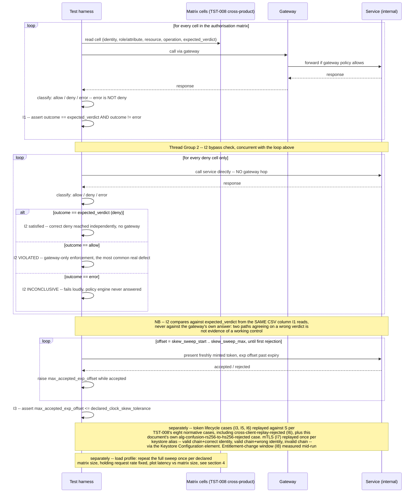

# AuthN/AuthZ Matrix & Token Lifecycle

Status: Approved | Last Reviewed: 2026-08-12 | Owner: @qe-lead
Catalog ID: TST-040 | Radii
Tier Applicability: T0, T1

## 1. Applies To

| Catalog ID | Title | Document |
|---|---|---|
| SEC-010 | Attribute-Based Access Control | [../../patterns/security/attribute-based-access-control.md](../../patterns/security/attribute-based-access-control.md) |
| SEC-006 | JWT Best Practices | [../../patterns/security/jwt-best-practices.md](../../patterns/security/jwt-best-practices.md) |
| SEC-002 | OAuth2 Authorization | [../../patterns/security/oauth2-authorization.md](../../patterns/security/oauth2-authorization.md) |
| SEC-005 | BFF + Token-Binding (web + iOS + Android) | [../../patterns/security/bff-token-binding.md](../../patterns/security/bff-token-binding.md) |
| SEC-011 | Session Revocation | [../../patterns/security/session-revocation.md](../../patterns/security/session-revocation.md) |
| SEC-001 | mTLS Service Mesh | [../../patterns/security/mtls-service-mesh.md](../../patterns/security/mtls-service-mesh.md) |
| MOB-003 | Mobile Biometric Auth | [../../patterns/mobile/mobile-biometric-auth.md](../../patterns/mobile/mobile-biometric-auth.md) |

These seven rows share one archetype because each names a distinct control point on the same
identity-to-resource decision path, and every one of them is verified the same way: an exhaustive
matrix sweep of the relevant dimensions, cross-checked against the normative case list
[TST-008 § Token Lifecycle Cases](../strategy/security-test-standard.md#token-lifecycle-cases)
defines, run against the actual resource or authorization server rather than inferred from
configuration or a library's own unit tests. SEC-010 Attribute-Based Access Control supplies the
policy-evaluation mechanism the authorisation-matrix cells (§3) exercise; SEC-006 JWT Best
Practices and SEC-002 OAuth2 Authorization supply the bearer-token format and issuance flow the
token-lifecycle cases validate; SEC-005 BFF + Token-Binding supplies the client-bound token this
archetype's replay case (I6) targets; SEC-011 Session Revocation supplies the propagation window
I4 asserts against; SEC-001 mTLS Service Mesh supplies the peer-identity assertion I7 targets; and
MOB-003 Mobile Biometric Auth supplies the client-side factor whose fallback behaviour the Failure
Taxonomy's biometric-fallback entry targets. The verification method is identical across all
seven; only the control point differs.

`SEC-010` is already claimed by [TST-025 Decision Table and Screening Accuracy](./decision-screening-accuracy.md)
for the decision-accuracy half of its testing obligation — its confusion-matrix run over this
archetype's own authorisation-matrix cell set, per
[TST-008 § Authorisation Matrix Method](../strategy/security-test-standard.md#authorisation-matrix-method).
This document appends `TST-040` to `SEC-010`'s existing `archetypes:` list in the coverage matrix
rather than creating a second row or overwriting TST-025's claim. TST-025 continues to own
decision-accuracy coverage for that row; this archetype owns authorisation-matrix-sweep and
token-lifecycle coverage for it — the two obligations are independent halves of the same catalog
row, not a replacement of one by the other. See §6 for the row's `primary_tool` resolution.

## 2. Failure Taxonomy

- Authorisation is enforced at the gateway but not at the service, so a direct call to the service
  bypasses it.
- An expired token is accepted because the clock-skew tolerance is too wide.
- A validator dispatches on the token header's own `alg` claim instead of a pinned expected
  algorithm, so a token forged by signing with the issuer's public key as an HMAC secret verifies
  successfully (algorithm confusion — distinct from `alg: none`, because here the signature really
  is valid for the algorithm the token claims).
- An infrastructure failure — a crashed policy engine, a timed-out decision point — returns a
  non-2xx that the test suite scores as a correct denial, so a fail-open deployment passes its
  authorisation suite while the control is down.
- Revocation is not honoured until natural expiry.
- Refresh-token reuse is permitted.
- A client-bound token is replayed successfully by a different client.
- mTLS validates the certificate chain but not the identity.
- A biometric fallback to a weaker factor with no policy governing when that fallback is allowed.
- An entitlement change does not take effect until the user re-logs in.

## 3. Functional Test Design

**Oracle:** `invariant-assertion` — every invariant below is checked mechanically against a
running resource or authorization server, per
[TST-001 § The Four Oracles](../strategy/test-strategy-standard.md#the-four-oracles); none of them
is inferred from configuration.

**The oracle resolves three outcomes, not two.** A verdict is `allow`, `deny`, or `error`, and
`error` is never scored as `deny`:

| Outcome | Response signature | Meaning |
|---|---|---|
| `allow` | 2xx **and** the response body carries the expected resource payload | The policy engine reached an explicit permit decision and the resource served it |
| `deny` | The single declared denial signature the policy engine returns for an explicit deny decision — a `403` whose body carries the decision marker and the policy/ruleset version §8's referential-integrity requirement already mandates (e.g. `{"decision":"deny","policy_version":"…"}`) | The policy engine was reached, evaluated the request, and refused it |
| `error` | Anything else — 5xx, a connect or read timeout, a `403` with no decision marker, a 2xx with an unexpected or unparseable body, a TLS handshake failure | The policy engine's decision is *unknown*; nothing was proven either way |

A two-outcome oracle of the form `status < 400 ? allow : deny` collapses `error` into `deny` and is
therefore unsound for this archetype: a crashed policy engine, a timed-out sidecar, or a downed
policy-decision-point dependency returns 5xx and scores as a clean pass on every deny cell in the
matrix. That is precisely the fail-open versus fail-closed distinction
[SEC-010 Attribute-Based Access Control](../../patterns/security/attribute-based-access-control.md)
exists to govern, and a suite that cannot tell a policy-enforced denial from an infrastructure
failure cannot report on it. A bare `403` with no decision marker is deliberately classified
`error` rather than `deny` for the same reason — an edge proxy's own generic 403, returned because
the policy engine was never reached at all, is indistinguishable from an enforced denial unless the
denial signature is specific.

Every invariant asserting a `deny` verdict therefore carries the same companion assertion:
`assert outcome != error` — an `error` outcome fails the test loudly and is reported as a distinct
failure category from an invariant violation, never absorbed into a passing deny count. §9's
evidence set records the three outcome counts separately for this reason.

### Invariants

| # | Invariant | Assertion |
|---|---|---|
| I1 | Every authorisation-matrix cell returns its expected allow or deny | `assert actual_verdict(identity, resource, operation) == expected_verdict` for every cell in [TST-008 § Authorisation Matrix Method](../strategy/security-test-standard.md#authorisation-matrix-method)'s cross-product — never a sampled subset — with `assert outcome != error` alongside it, per the three-outcome oracle above |
| I2 | A deny cannot be bypassed by calling the service directly, around the gateway | `assert direct_to_service_call(identity, resource, operation) == expected_verdict` for every cell whose expected verdict is deny, issued from a second Thread Group with no gateway hop (§5), plus `assert outcome != error` — the direct-to-service path must independently reach the *correct* verdict I1 declares, read from the same `expected_verdict` column, never merely the same verdict the gateway path happened to return |
| I3 | Expired, wrong-audience, wrong-issuer, tampered-signature, and algorithm-confusion tokens are all rejected | `assert response.status == rejected` for each of [TST-008 § Token Lifecycle Cases](../strategy/security-test-standard.md#token-lifecycle-cases)'s `expired-rejected`, `wrong-audience-rejected`, `wrong-issuer-rejected`, and `tampered-signature-rejected` cases, including the `alg: none` variant, and for this document's own additional `alg-confusion-rs256-to-hs256-rejected` case (defined in §3's negative paths — *not* part of TST-008's normative list); and, bounding the accepted leeway empirically rather than only probing one point on it, `assert max_accepted_exp_offset <= declared_clock_skew_tolerance`, where `max_accepted_exp_offset` is the largest measured offset past `exp` at which the running validator still accepts a token (offset sweep in §5, boundary detail in §3) |
| I4 | A revoked token is rejected before its natural expiry, within the declared propagation window | `assert time_to_rejection <= declared_propagation_window`, measured from the revocation action (logout, admin action, compromise response) to the first rejected request, on a token whose `exp` claim is still in the future |
| I5 | A used refresh token cannot be reused | `assert second_use(refresh_token) == rejected` after a first successful rotation, per TST-008's `refresh-rotation-invalidates-prior-refresh` case |
| I6 | A client-bound token replayed by another client is rejected | `assert replay_by_other_client(bound_token) == rejected` for a token bound via `cnf`/DPoP, an mTLS-bound token, or a BFF-issued session cookie scoped to one client — binding is enforced at the resource server, not merely recorded in the token |
| I7 | mTLS asserts peer *identity*, not merely a valid chain | `assert mtls_call(valid_chain, wrong_identity) == rejected` — a certificate signed by a trusted CA but presenting an identity outside the caller's declared allow-list must be denied, distinct from `assert mtls_call(invalid_chain, any_identity) == rejected` |
| I8 | An entitlement change takes effect within its declared window | `assert time_to_effect(entitlement_change) <= declared_propagation_window`, measured from the entitlement change's commit to the first authorisation decision that reflects it, without requiring the affected session to re-authenticate |

**I2 is the most consequential invariant in this document.** Gateway-only enforcement — where an
API gateway or edge proxy correctly denies a request, but the service behind it accepts the
identical call when reached directly — is the single most common real authorisation defect, and
it is structurally invisible to any test suite that only ever calls through the gateway. A matrix
sweep that exercises every cell in I1 but issues every request through the same gateway path can
report 100% cell coverage while a direct-to-service bypass sits completely untested. §5's second
Thread Group exists specifically to make this defect visible: it repeats every deny cell from I1
as a direct-to-service call with no gateway hop, so a service that only enforces the policy when
fronted by the gateway fails I2 even though it passes I1.

**I2 asserts against the expected verdict, not against the gateway's answer.** The tempting form
of this invariant — comparing the direct-to-service response with the gateway response and
requiring them to agree — is unsound, because agreement is not correctness. If both paths are
wrong in the same direction, the comparison reports green on a system whose authorisation is
broken outright: a cell that must deny but that *both* the gateway and the service allow satisfies
"the two paths agree" perfectly while representing a total control failure. Path agreement is also
already implied when both paths independently match `expected_verdict`, so the comparison form
gives up real signal and buys nothing. I2 is therefore the statement "the direct-to-service caller
independently reaches the same correct verdict I1 requires for this cell", evaluated against the
same `expected_verdict` column I1 reads and through the same three-outcome oracle — which is why
I2's failure to reach the policy engine at all surfaces as `error`, not as a satisfied deny.

### Equivalence classes and boundaries

- A cell whose expected verdict is allow, called through the gateway — the canonical happy path
  (I1).
- A cell whose expected verdict is deny, called through the gateway — the case the Failure
  Taxonomy's false-allow entry targets; every deny cell gets an explicit test, never an assumption
  of default-deny (I1).
- The same deny cell, called directly against the service with no gateway hop, and scored against
  that cell's own `expected_verdict` rather than against what the gateway path returned — I2's
  bypass check, and the boundary between "policy declared" and "policy actually enforced everywhere
  it must be".
- Any of the above where the policy engine cannot be reached or does not answer — a 5xx, a
  timeout, or a denial response missing its decision marker. This is its own class, distinct
  from both allow and deny, and it fails the run: it is the class that separates a fail-closed
  implementation that genuinely enforced a denial from one that merely happened to return a
  non-2xx while the control was down (I1, I2).
- A cell whose role or attribute is held constant and would earn an allow verdict against the
  resource *type*, but whose resource is a specific instance owned by an identity other than the
  caller — e.g. a teller authorised for `account:read` at their own branch calling that same
  operation against an account owned by a different customer at that branch. This is OWASP API
  Security Top 10 API1:2023 (Broken Object Level Authorization / IDOR), and it is its own
  equivalence class distinct from the class-level role/attribute mismatches above: I1's
  cross-product only exercises it when the `resource` column (§5) is populated with specific
  owned instances, not merely resource *types* — a matrix that varies resource type but never
  resource ownership can report full nominal cell coverage while never testing the case a QE
  engineer must actually vary (I1).
- A token whose `exp` falls exactly at the deployment's *declared* clock-skew tolerance boundary —
  one second inside that declared tolerance must be accepted, one second beyond it must be
  rejected. The boundary is defined relative to `declared_clock_skew_tolerance`, the leeway the
  deployment under test declares for its own token validator, not a fixed number: a boundary fixed
  at "one second past `exp`" assumes zero tolerance and can never detect the Failure Taxonomy's own
  named defect, because a tolerance configured far wider than intended still passes a fixed
  boundary cleanly (I3).
- The **widest offset past `exp` the running validator actually accepts**, found by measurement
  rather than declared anywhere —
  `assert max_accepted_exp_offset <= declared_clock_skew_tolerance`.
  The harness mints an otherwise-valid token at each offset in a monotonically increasing sweep
  past `exp` (§5), records the largest offset still accepted, and compares that *measured* quantity
  against the declared budget. This is the assertion that actually catches "someone configured skew
  tolerance too wide": the boundary bullet above only proves the validator enforces *some* boundary
  in the right place relative to whatever leeway is configured, so an independent measurement of
  the leeway the deployment is really applying is required. It is deliberately the same shape as
  I4's and I8's `assert <measured quantity> <= declared_propagation_window`: a runtime observation
  bounded by a declared budget, never a comparison of two declared values against each other —
  which the oracle contract above forbids, because a declared-versus-declared check is inferred
  from configuration and proves nothing about the running system (I3).
- A sweep that reaches its declared upper bound without ever seeing a rejection is itself a
  failure, not a pass: it means `max_accepted_exp_offset` is unbounded above the sweep's range and
  the validator's real leeway was never found. The sweep must terminate on an observed rejection
  (I3).
- A revoked token checked immediately after revocation, and again at the edge of the declared
  propagation window — both must reject; only the *measured* time-to-rejection is a boundary
  concern, not the verdict itself (I4).
- A refresh token used exactly once (must rotate and succeed) versus the same token presented a
  second time immediately afterward (must be rejected) — I5's boundary is temporal adjacency, not
  elapsed time.
- A client-bound token presented by its own binding party (must succeed) versus the identical
  token presented by any other party (must be rejected) — I6.
- A certificate whose chain is valid but whose subject identity is outside the declared allow-list,
  as the boundary case distinct from an invalid chain (I7).
- An entitlement change measured at the edge of its declared propagation window, against an
  already-active session that never re-authenticates (I8).

### Negative paths

- A request with no token at all is rejected before any authorisation-matrix lookup runs, never
  defaulted into an anonymous-role cell.
- A token whose claims are individually well-formed but whose `alg` field has been changed to
  `none` is rejected as tampered-signature, not accepted because signature verification was
  skipped for that algorithm (I3's negative path).
- **Algorithm confusion — `alg-confusion-rs256-to-hs256-rejected`.** A token whose header declares
  `alg: HS256`, whose signature is a valid HMAC computed using the issuer's *RSA public key bytes*
  as the shared secret, presented to a validator that expects RS256, is rejected. This is a
  distinct vulnerability class from both `alg: none` and generic byte-level signature tampering:
  the signature here is cryptographically valid for the algorithm the token claims, and every
  claim is well-formed, so a validator that reads `alg` from the untrusted header and dispatches
  on it verifies successfully. Only a validator with a pinned expected algorithm rejects it. The
  inverse direction is asserted alongside it — an RS256-signed token presented to a validator
  expecting HS256 must also be rejected rather than dispatched on the header's claim. This case is
  **not** in [TST-008 § Token Lifecycle Cases](../strategy/security-test-standard.md#token-lifecycle-cases)'s
  normative list, whose `tampered-signature-rejected` row names only the `alg: none` variant; it is
  added by this document and carried in this document's own case count (§10). The corresponding
  control it verifies is
  [SEC-006 JWT Best Practices](../../patterns/security/jwt-best-practices.md)'s algorithm-pinning
  requirement, which names algorithm confusion in its own threat model — this archetype supplies
  the assertion that the pin is enforced by the running resource server rather than only
  configured (I3's negative path).
- A revocation action issued against a token ID that does not exist is rejected explicitly by the
  revocation endpoint, never silently accepted as a no-op that could mask a real revocation
  failure.
- An mTLS handshake presenting no client certificate at all is rejected at the transport layer,
  distinct from and prior to the identity check I7 asserts (I7's negative path).
- A biometric-authentication attempt that fails is never silently retried against a weaker factor
  without an explicit, declared fallback policy naming which weaker factor is permitted and under
  what condition (Failure Taxonomy's biometric-fallback entry, made concrete as a negative path).

## 4. Performance Test Design

| Profile | Applies | Why | Threshold source |
|---|---|---|---|
| `baseline` | yes | Confirms authorisation-decision latency and token-validation latency have not regressed before any load-shaped run | [NFR-002](../../nfr/latency-budget-model.md) |
| `load` | yes | Proves authorisation-decision latency holds under sustained request rate as **authorisation-matrix size** grows — this archetype's own performance concern, addressed by reusing [TST-025 § Performance Test Design](./decision-screening-accuracy.md#4-performance-test-design)'s cardinality-curve redefinition rather than restating its mechanics: the harness re-runs the identical profile against a series of synthetic matrix snapshots of increasing declared size (identity × role/attribute × resource × operation), holding request rate and virtual-user population fixed per run, and plots authorisation-decision latency against matrix size rather than solely against request rate | [NFR-002](../../nfr/latency-budget-model.md), [NFR-003](../../nfr/capacity-planning-model.md) |
| `soak` | yes | Targets token-cache and revocation-list growth over an extended window — proves cache eviction and revocation-list pruning actually run, and that revocation-check latency (I4) does not degrade as the revocation list grows unbounded, rather than merely being declared to happen | [NFR-003](../../nfr/capacity-planning-model.md) |

**Workload model:** `closed` for all three profiles — each holds a declared, bounded population of
virtual users at steady state, per [TST-003](../strategy/workload-modelling.md). The `load`
profile's matrix-size sweep follows the same deliberate redefinition
[TST-025 § Performance Test Design](./decision-screening-accuracy.md#4-performance-test-design)
establishes for its own `stress` profile against list cardinality: the independent variable across
runs is a declared dimension size, not open-model arrival rate, so a fixed, `closed` population is
re-run once per matrix-size snapshot rather than ramped once against a single fixed matrix.

## 5. Canonical Harness — JMeter

The `resource` column in the CSV Data Set Config below encodes a specific, owned resource
*instance* (e.g. a synthetic account ID together with its owning identity), not a resource *type*
such as `account`. This is what makes §3's BOLA/IDOR equivalence class exercisable at all: it
requires the same `role_or_attribute` and `operation` to appear against resource instances owned
by more than one identity, with `expected_verdict` differing by ownership alone rather than by
role, attribute, or resource type. Every BOLA equivalence class named in §3 must therefore be
present as its own row in `authz_matrix_cells_*.csv`, not left to be inferred from a role/attribute
× resource-*type* cross-product that never varies ownership.

```xml
<!-- Thread Group 1: the authorisation-matrix sweep, through the gateway. Every cell from the
     TST-008 cross-product (identity x role/attribute x resource x operation) is one CSV row,
     with the expected verdict declared alongside it -- never inferred. -->
<ThreadGroup testname="tg-authz-matrix-sweep-via-gateway">
  <stringProp name="ThreadGroup.num_threads">${__P(users,20)}</stringProp>
  <stringProp name="ThreadGroup.ramp_time">${__P(rampup,60)}</stringProp>
  <stringProp name="ThreadGroup.duration">${__P(duration,600)}</stringProp>
</ThreadGroup>

<CSVDataSet testname="authz_matrix_cells.csv (SYNTHETIC -- no real identities)">
  <stringProp name="filename">data/authz_matrix_cells_${__P(matrix_size_ref,1x)}.csv</stringProp>
  <stringProp name="variableNames">cell_id,identity_id,role_or_attribute,resource,operation,expected_verdict,expected_payload_marker,token_case</stringProp>
  <boolProp name="recycle">true</boolProp>
</CSVDataSet>

<HTTPSamplerProxy testname="Call via gateway (I1, I3, I5, I6, I8)">
  <stringProp name="HTTPSampler.domain">${__P(gateway_host)}</stringProp>
  <stringProp name="HTTPSampler.path">/v1/${resource}/${operation}</stringProp>
  <stringProp name="HTTPSampler.method">POST</stringProp>
</HTTPSamplerProxy>

<!-- The three-outcome oracle (section 3), defined once and reused verbatim by the I2 assertion in
     Thread Group 2. "error" is NEVER folded into "deny": a 5xx, a timeout, or a 403 missing its
     policy decision marker means the policy engine's decision is unknown, and an unknown decision
     fails the run loudly instead of being counted as a passing denial. -->
<JSR223Assertion testname="classify outcome and assert it matches expected_verdict (I1)">
  <stringProp name="script"><![CDATA[
    // classify(): returns "allow", "deny", or "error" -- never collapses the third into the second
    def rc   = prev.getResponseCode();
    def body = prev.getResponseDataAsString();
    def outcome
    if (!prev.isSuccessful() && !rc.isInteger()) {
        outcome = "error";                       // connect/read timeout, TLS failure: no HTTP code
    } else if ((rc as int) >= 200 && (rc as int) < 300) {
        outcome = body.contains(vars.get("expected_payload_marker")) ? "allow" : "error";
    } else if ((rc as int) == 403 && body.contains('"decision":"deny"')
                                  && body.contains('"policy_version"')) {
        outcome = "deny";                        // the ONLY signature that counts as an enforced deny
    } else {
        outcome = "error";                       // 5xx, bare 403, 4xx from an edge that never
    }                                            // reached the policy engine, unparseable body

    def expected = vars.get("expected_verdict");
    if (outcome == "error") {
        AssertionResult.setFailure(true);
        AssertionResult.setFailureMessage(
            "ORACLE ERROR on cell " + vars.get("cell_id") + " (rc=" + rc + "): policy decision "
          + "unknown -- NOT counted as a deny. Expected " + expected + "."
        );
    } else if (outcome != expected) {
        AssertionResult.setFailure(true);
        AssertionResult.setFailureMessage(
            "I1 violated on cell " + vars.get("cell_id") + ": expected " + expected + ", got " + outcome
        );
    }
  ]]></stringProp>
</JSR223Assertion>

<!-- Thread Group 2: I2's bypass check -- replays only the deny cells directly against the
     service, with no gateway hop. A service that enforces the policy only when fronted by the
     gateway passes Thread Group 1 and fails here. -->
<ThreadGroup testname="tg-direct-to-service-bypass-check">
  <stringProp name="ThreadGroup.num_threads">${__P(users,5)}</stringProp>
  <stringProp name="ThreadGroup.duration">${__P(duration,600)}</stringProp>
</ThreadGroup>

<!-- expected_verdict is carried on THIS file too, and re-read here. I2 is asserted against the
     declared expected verdict for the cell, not against whatever Thread Group 1's gateway call
     returned: two paths agreeing on a wrong answer is not evidence of a working control. -->
<CSVDataSet testname="authz_matrix_deny_cells.csv (filtered: expected_verdict == deny)">
  <stringProp name="filename">data/authz_matrix_deny_cells_${__P(matrix_size_ref,1x)}.csv</stringProp>
  <stringProp name="variableNames">cell_id,identity_id,role_or_attribute,resource,operation,expected_verdict,expected_payload_marker</stringProp>
  <boolProp name="recycle">true</boolProp>
</CSVDataSet>

<HTTPSamplerProxy testname="Call service directly, bypassing gateway (I2)">
  <stringProp name="HTTPSampler.domain">${__P(service_internal_host)}</stringProp>
  <stringProp name="HTTPSampler.path">/internal/${resource}/${operation}</stringProp>
  <stringProp name="HTTPSampler.method">POST</stringProp>
</HTTPSamplerProxy>

<JSR223Assertion testname="assert direct call independently reaches expected_verdict (I2)">
  <stringProp name="script"><![CDATA[
    // Same classify() as the I1 assertion above -- identical three-outcome oracle, applied to the
    // no-gateway path. Compared against expected_verdict from the CSV, NOT against the gateway's
    // own response: if the gateway and the service are both wrong in the same direction, a
    // path-to-path comparison passes while authorisation is broken outright.
    def outcome  = classify(prev, vars.get("expected_payload_marker"));
    def expected = vars.get("expected_verdict");   // always "deny" on this filtered file
    if (outcome == "error") {
        AssertionResult.setFailure(true);
        AssertionResult.setFailureMessage(
            "ORACLE ERROR on direct-to-service cell " + vars.get("cell_id") + ": policy decision "
          + "unknown -- NOT counted as a deny. The bypass path proved nothing for this cell."
        );
    } else if (outcome != expected) {
        AssertionResult.setFailure(true);
        AssertionResult.setFailureMessage(
            "I2 violated on cell " + vars.get("cell_id") + ": direct-to-service call returned "
          + outcome + ", expected " + expected + " -- gateway-only enforcement."
        );
    }
  ]]></stringProp>
</JSR223Assertion>

<!-- ============================================================================================
     mTLS certificate cases (I7). JMeter DOES have a first-class Keystore Configuration element
     (Component Reference section 18.4, Config Element > Keystore Configuration). It does not hold
     the keystore path or password itself -- those stay javax.net.ssl.* system properties, supplied
     from a file, never on the command line (see the invocation block below) -- but it selects
     WHICH key entry inside that keystore is presented, from a JMeter variable resolved per thread.
     That is what makes all three certificate cases presentable and distinguishable in one run: one
     synthetic keystore holding three key entries under three aliases, and one Thread Group per
     case binding cert_alias to the alias it needs.

     Prerequisite, in the properties file passed with -p: https.use.cached.ssl.context=false.
     With the default (true) JMeter caches one SSL context per thread and the first alias a thread
     presents is the only one it will ever present, which is exactly how a single JVM-level
     keystore silently collapses three certificate cases into one.
     ============================================================================================ -->
<KeystoreConfig guiclass="TestBeanGUI" testclass="KeystoreConfig"
                testname="Keystore Configuration -- alias selected per Thread Group">
  <stringProp name="clientCertAliasVarName">cert_alias</stringProp>
  <stringProp name="startIndex">0</stringProp>
  <stringProp name="endIndex">2</stringProp>
  <boolProp name="preload">true</boolProp>
</KeystoreConfig>

<!-- Case 1 of 3: valid chain + correct identity -- MUST be accepted. -->
<ThreadGroup testname="tg-mtls-valid-chain-correct-identity (I7 control case)">
  <stringProp name="ThreadGroup.num_threads">${__P(mtls_users,2)}</stringProp>
  <elementProp name="ThreadGroup.main_controller" elementType="Arguments">
    <collectionProp name="Arguments.arguments">
      <elementProp name="cert_alias" elementType="Argument">
        <stringProp name="Argument.value">synthetic-valid-chain-correct-identity</stringProp>
      </elementProp>
      <elementProp name="mtls_expected" elementType="Argument">
        <stringProp name="Argument.value">accepted</stringProp>
      </elementProp>
    </collectionProp>
  </elementProp>
</ThreadGroup>

<!-- Case 2 of 3: valid chain + WRONG identity -- MUST be rejected. This is I7's whole point: the
     chain verifies against the trusted CA, so a chain-only check passes it. -->
<ThreadGroup testname="tg-mtls-valid-chain-wrong-identity (I7 primary assertion)">
  <stringProp name="ThreadGroup.num_threads">${__P(mtls_users,2)}</stringProp>
  <elementProp name="ThreadGroup.main_controller" elementType="Arguments">
    <collectionProp name="Arguments.arguments">
      <elementProp name="cert_alias" elementType="Argument">
        <stringProp name="Argument.value">synthetic-valid-chain-wrong-identity</stringProp>
      </elementProp>
      <elementProp name="mtls_expected" elementType="Argument">
        <stringProp name="Argument.value">rejected</stringProp>
      </elementProp>
    </collectionProp>
  </elementProp>
</ThreadGroup>

<!-- Case 3 of 3: invalid chain -- MUST be rejected, and distinguishably so (transport-layer
     handshake failure, not an application-layer identity denial). -->
<ThreadGroup testname="tg-mtls-invalid-chain (I7 distinct-from case)">
  <stringProp name="ThreadGroup.num_threads">${__P(mtls_users,2)}</stringProp>
  <elementProp name="ThreadGroup.main_controller" elementType="Arguments">
    <collectionProp name="Arguments.arguments">
      <elementProp name="cert_alias" elementType="Argument">
        <stringProp name="Argument.value">synthetic-invalid-chain</stringProp>
      </elementProp>
      <elementProp name="mtls_expected" elementType="Argument">
        <stringProp name="Argument.value">rejected</stringProp>
      </elementProp>
    </collectionProp>
  </elementProp>
</ThreadGroup>

<!-- ============================================================================================
     I3's clock-skew measurement. NOT a single assertion: a monotonically increasing sweep that
     measures max_accepted_exp_offset -- the largest offset past exp at which this deployment's
     validator still accepts a token -- and bounds that MEASURED value by the declared tolerance.
     Every bound is a property, never a literal, per this corpus's no-hardcoded-thresholds rule.
     ============================================================================================ -->
<ThreadGroup testname="tg-clock-skew-offset-sweep (I3)">
  <stringProp name="ThreadGroup.num_threads">1</stringProp>
</ThreadGroup>

<LoopController testname="sweep offsets past exp until first rejection">
  <stringProp name="LoopController.loops">${__P(skew_sweep_steps)}</stringProp>
</LoopController>

<CounterConfig testname="exp_offset (units and step are declared, not hardcoded here)">
  <stringProp name="CounterConfig.name">exp_offset</stringProp>
  <stringProp name="CounterConfig.start">${__P(skew_sweep_start)}</stringProp>
  <stringProp name="CounterConfig.incr">${__P(skew_sweep_step)}</stringProp>
  <stringProp name="CounterConfig.end">${__P(skew_sweep_max)}</stringProp>
</CounterConfig>

<JSR223PreProcessor testname="mint synthetic token with exp = now - exp_offset">
  <stringProp name="script"><![CDATA[
    vars.put("skew_token", SyntheticTokenMinter.expiredBy(vars.get("exp_offset") as long));
  ]]></stringProp>
</JSR223PreProcessor>

<HTTPSamplerProxy testname="present token at exp_offset past expiry">
  <stringProp name="HTTPSampler.domain">${__P(gateway_host)}</stringProp>
  <stringProp name="HTTPSampler.path">/v1/${__P(skew_probe_resource)}</stringProp>
</HTTPSamplerProxy>

<JSR223Assertion testname="record max_accepted_exp_offset; assert it is within declared tolerance (I3)">
  <stringProp name="script"><![CDATA[
    def outcome = classify(prev, vars.get("expected_payload_marker"));
    def offset  = vars.get("exp_offset") as long;
    def declared = props.get("declared_clock_skew_tolerance") as long;

    if (outcome == "error") {
        AssertionResult.setFailure(true);
        AssertionResult.setFailureMessage("ORACLE ERROR during skew sweep at offset " + offset);
        return;
    }
    if (outcome == "allow") {
        // still accepted this far past exp -- raise the measured ceiling and keep sweeping
        props.put("max_accepted_exp_offset", offset as String);
        if (offset > declared) {
            AssertionResult.setFailure(true);
            AssertionResult.setFailureMessage(
                "I3 violated: validator accepted a token " + offset + " past exp, exceeding the "
              + "declared clock-skew tolerance (" + declared + "). Measured leeway is wider than "
              + "declared -- the Failure Taxonomy's 'tolerance too wide' defect."
            );
        }
    } else {
        // first rejection: the measured ceiling is now final for this sweep
        props.put("skew_sweep_terminated", "true");
    }
  ]]></stringProp>
</JSR223Assertion>

<!-- Tear-down check: a sweep that ran to skew_sweep_max without ever being rejected never found
     the validator's real leeway, so its measurement is a lower bound, not a ceiling. That is a
     failed run, not a passing one. -->
<JSR223PostProcessor testname="assert the sweep actually terminated on a rejection (I3)">
  <stringProp name="script"><![CDATA[
    if (props.get("skew_sweep_terminated") != "true") {
        log.error("I3 inconclusive: no rejection observed up to skew_sweep_max; "
                + "max_accepted_exp_offset is unbounded within the swept range. Widen the sweep.");
        prev.setSuccessful(false);
    }
  ]]></stringProp>
</JSR223PostProcessor>
```

```bash
# The keystore PASSWORD is never passed as a -D system property on this command line. Anything in
# argv is world-readable via ps(1) and /proc/<pid>/cmdline to every other process on the host, and
# it lands in shell history and CI job logs. Even for a synthetic test credential, an archetype
# that teaches a *security* testing pattern must not model a credential-exposure anti-pattern.
# Instead: javax.net.ssl.keyStorePassword lives in a 0600 system-property file owned by the test
# runner and read by the JVM at startup via -S. -S loads its contents as System properties, so the
# password reaches the TLS stack exactly as before, without ever appearing in argv.
#
#   $ install -m 0600 /dev/null "${SYNTHETIC_TLS_SYSPROPS}"
#   $ printf 'javax.net.ssl.keyStorePassword=%s\n' "${SYNTHETIC_KEYSTORE_PASSWORD}" \
#       > "${SYNTHETIC_TLS_SYSPROPS}"      # from the runner's secret store, never committed
#
# Non-secret TLS paths stay on the command line -- they are not credentials.
jmeter -n -t authn-authz-token-lifecycle.jmx \
  -p "${JMETER_PROPERTIES}" \
  -S "${SYNTHETIC_TLS_SYSPROPS}" \
  -Jusers="${JMETER_USERS}" -Jrampup="${JMETER_RAMPUP}" -Jduration="${JMETER_DURATION}" \
  -Jgateway_host="${GATEWAY_HOST}" -Jservice_internal_host="${SERVICE_INTERNAL_HOST}" \
  -Jmatrix_size_ref="${MATRIX_SIZE_REF}" -Jprofile="${JMETER_PROFILE}" \
  -Jmtls_users="${JMETER_MTLS_USERS}" \
  -Jskew_sweep_start="${SKEW_SWEEP_START}" -Jskew_sweep_step="${SKEW_SWEEP_STEP}" \
  -Jskew_sweep_max="${SKEW_SWEEP_MAX}" -Jskew_sweep_steps="${SKEW_SWEEP_STEPS}" \
  -Jdeclared_clock_skew_tolerance="${DECLARED_CLOCK_SKEW_TOLERANCE}" \
  -Djavax.net.ssl.keyStore="${SYNTHETIC_CLIENT_KEYSTORE}" \
  -Djavax.net.ssl.trustStore="${SYNTHETIC_TRUST_STORE}" \
  -l results.jtl -e -o report/

# "${JMETER_PROPERTIES}" must set, for the Keystore Configuration element to serve a different
# alias per Thread Group rather than caching the first one each thread happens to present:
#   https.use.cached.ssl.context=false
```

The `-S` file, like the keystore itself, is created at environment setup with restricted
permissions, holds only synthetic credentials, and is purged at teardown alongside the rest of §8's
fixtures. `-S` is chosen over an exported environment variable because JMeter needs the value as a
JVM *system* property for the TLS stack to read it, and `-S` is the documented way to supply system
properties from a file rather than from argv.

The **second Thread Group** is this harness's load-bearing design choice, not an optional extra:
without it, the plan can report full I1 cell coverage while I2 — the bypass path — goes completely
untested, because every sampler in Thread Group 1 shares the same gateway-fronted path. Running
both Thread Groups concurrently, rather than as separate plans, matters for the same reason
[TST-033 § Security overlay](./multitenant-noisy-neighbour.md#7-overlays) runs its own cross-tenant
denial check under load rather than in isolation: a check that only passes when the system is idle
can hide behind an untested concurrent case.

The **mTLS keystore configuration** is the other notable element, and it is the reason JMeter wins
§6's tool-fit comparison. JMeter ships a dedicated **Keystore Configuration** config element
(Component Reference §18.4), and I7's design depends on it: the keystore file and its password are
supplied once as `javax.net.ssl.*` system properties, but *which key entry within that keystore a
given thread presents* is selected from a JMeter variable named by the element's
`clientCertAliasVarName` field. One synthetic keystore holds all three of I7's key entries; each
mTLS Thread Group binds `cert_alias` to the entry its case needs. A JVM-level keystore alone cannot
do this — it fixes one client identity for the whole JVM, so a plan built on system properties
alone can present exactly one of I7's three certificate cases per run, and the valid-chain/
wrong-identity case that is the entire point of the invariant would need a separate execution to
reach. The element's per-thread alias selection is what collapses that into a single executable
run. It carries one hard prerequisite: `https.use.cached.ssl.context=false` must be set in the
properties file, because with JMeter's default SSL-context caching a thread reuses the first
context it built and silently keeps presenting its first alias for the rest of the run — three
declared certificate cases would execute as one, and pass.

The **clock-skew offset sweep** is the third: I3's `max_accepted_exp_offset` is a measured
quantity, so it needs a loop rather than an assertion. A Counter drives increasing offsets past
`exp`, a preprocessor mints a token at each, and the assertion raises the recorded ceiling on every
acceptance and bounds it by the declared tolerance. Every bound in that sweep — start, step,
maximum, and the declared tolerance itself — is a JMeter property supplied at invocation, never a
literal in the plan, per this corpus's rule against thresholds outside
[TST-002](../strategy/performance-test-standard.md).

## 6. Tool Fit

| Tool | Fit | When to prefer |
|---|---|---|
| JMeter | BEST | A CSV Data Set Config drives the full matrix sweep declaratively, a second Thread Group gives the direct-to-service bypass check (I2) its own independent path with no code, and the **Keystore Configuration** element (Component Reference §18.4) selects a different client-certificate alias per Thread Group, so all three of I7's certificate cases execute in one run rather than one per run — no other tool in the corpus combines declarative matrix-sweep parameterisation with per-thread certificate selection in a single plan |
| k6 | good | A `SharedArray` can drive the matrix sweep from a CSV-equivalent source and `tlsAuth`/client-certificate options in `options.tlsAuth` cover the mTLS cases, but there is no first-class equivalent to a second, independently-configured Thread Group for the I2 bypass path — it must be a second `scenario` block wired together by hand |
| Gatling + Karate | good | Karate's `Examples` tables are a natural fit for the matrix sweep and Karate has native client-certificate support for the mTLS cases, but Gatling's own injection profile and Karate's scenario runner must be wired together rather than sharing one native plan the way JMeter's two Thread Groups do |
| Locust | fair | A plain Python CSV reader can drive the matrix sweep and `requests`' `cert=(...)` tuple covers mTLS, but the direct-to-service bypass check and the client-certificate configuration are both hand-built in Python rather than configured declaratively, per [TST-014](../tooling/locust.md#when-to-use-this-tool) |

Record `primary_tool: jmeter` for all seven coverage rows in §1, including `SEC-010`. For
`SEC-010` specifically, this supersedes TST-025's `locust` designation on that single row field,
for the same class of reason [TST-032](./batch-window-cutoff.md) recorded a `primary_tool` change
on `BSP-019`'s coverage row (see
[TST-025 § Tool Fit](./decision-screening-accuracy.md#6-tool-fit) and the coverage YAML's `notes`
field on that row for the precedent): the two archetypes verify independent halves of the same
catalog row, and a coverage row has exactly one `primary_tool` field to hold. TST-025's
confusion-matrix method and its `locust` recommendation for *that* method are unchanged and remain
the correct tool for decision-accuracy coverage; only the row's single `primary_tool` designation
is updated, to `jmeter`, for this archetype's own matrix-sweep and mTLS-keystore obligation. See
the coverage YAML's `notes` field on the `SEC-010` row for the resolution.

## 7. Overlays

Security is not a secondary overlay layered over some other primary method in this archetype — it
is the body of the document. The authorisation-matrix sweep and the token-lifecycle case list
(§§2-6) are this archetype's primary functional and performance test design, not an add-on to a
different oracle, so there is no separate "Security overlay" subsection here: §§2-6 already are
the security verification, cross-linking
[TST-008 § Authorisation Matrix Method](../strategy/security-test-standard.md#authorisation-matrix-method)
and [TST-008 § Token Lifecycle Cases](../strategy/security-test-standard.md#token-lifecycle-cases)
for the method and the normative case list rather than restating either.

Resilience, Contract, and Data-quality overlays are omitted: this archetype's failure modes are
about authorisation-decision correctness and token-lifecycle enforcement, not fault tolerance
under injected failure, schema or wire compatibility, or data reconciliation, so none of the three
overlays applies.

## 8. Test Data Requirements

Synthetic only, per [TST-004](../strategy/test-data-management.md). Entities needed: a set of
synthetic identities spanning every declared role or attribute combination; a set of synthetic
protected resources and the operations declared on each, with at least two distinct owning
identities per resource type so §3's BOLA/IDOR equivalence class is representable without
introducing a new dimension; the full authorisation-matrix cell list with its `expected_verdict`
column, sourced from
[TST-008 § Authorisation Matrix Method](../strategy/security-test-standard.md#authorisation-matrix-method)'s
cross-product rather than re-derived here; a synthetic token set covering **all eight** cases in
[TST-008 § Token Lifecycle Cases](../strategy/security-test-standard.md#token-lifecycle-cases) —
`valid-accepted`, `expired-rejected`, `wrong-audience-rejected`, `wrong-issuer-rejected`,
`tampered-signature-rejected`, `revoked-before-expiry-rejected`,
`refresh-rotation-invalidates-prior-refresh`, and `cross-client-replay-rejected`, the last of which
is the case **I6** asserts and must not be omitted: without a token bound to one synthetic client
plus a second, distinct synthetic client to replay it, I6 has no fixture and cannot run at all;
plus this document's own additional `alg-confusion-rs256-to-hs256-rejected` case (§3), which
requires a token whose header declares `alg: HS256` and whose signature is an HMAC over the token's
signing input computed with the issuer's **RSA public key bytes as the secret**, presented to the
RS256-expecting validator — and its inverse, an RS256-signed token presented where HS256 is
expected; plus a token pair bracketing the declared clock-skew tolerance boundary (one second
inside, one second beyond `declared_clock_skew_tolerance`, per §3) **and** a mintable token
generator that can issue an otherwise-valid token at an arbitrary offset past `exp`, which is what
I3's `max_accepted_exp_offset` sweep (§5) consumes — a fixed pair of pre-minted tokens cannot
measure a ceiling, only probe a point; a synthetic keystore holding three client-certificate key
entries under three distinct aliases, one per mTLS identity case (valid chain plus correct
identity, valid chain plus wrong identity, invalid chain), so §5's Keystore Configuration element
can select between them per Thread Group, together with the 0600 system-property file holding that
keystore's synthetic password; a declared biometric-fallback policy fixture; and a synthetic
entitlement-change event with its commit timestamp. The
cardinality driver for §3's boundary matrix is the authorisation-matrix cell count itself — every
role/attribute, resource, and operation combination named in §1's patterns must appear at least
once. The cardinality driver for the `load` profile's matrix-size sweep (§4) is the declared
matrix size, orthogonal to the virtual-user population the profile also declares. Referential
integrity requirement: every matrix cell's `expected_verdict` resolves against a specific, named
policy or ruleset version, so a verdict can always be traced to the exact version it was declared
against. Teardown: purge the synthetic identities, certificates, tokens, and matrix-cell fixtures
at environment reset, per [TST-005](../strategy/environments-quality-gates.md).

## 9. Evidence and Observability

Metrics to capture: authorisation-matrix cell coverage (cells exercised versus cells declared, per
I1) and per-cell pass/fail; **the three oracle outcomes counted separately — allow, deny, and
error — for both I1 and I2**, so an infrastructure failure can never be read as a satisfied denial
in the evidence pack any more than in the assertion, and a run with a non-zero error count is
reported as inconclusive on the affected cells rather than passing; the direct-to-service bypass
check's pass/fail per deny cell (I2); the pass/fail outcome of every token-lifecycle case by its
normative case ID, including `cross-client-replay-rejected` for I6 and this document's own
`alg-confusion-rs256-to-hs256-rejected` (I3, I5, I6); the measured `max_accepted_exp_offset` from
I3's skew sweep alongside the `declared_clock_skew_tolerance` it was bounded by, recorded as a
value rather than only as a pass/fail, so a tolerance drifting toward its declared limit is visible
before it crosses; revocation propagation latency, from revocation action to first rejected
request (I4); the mTLS
identity-versus-chain distinction's pass/fail per certificate case (I7); entitlement-change
propagation latency (I8); and the matrix-size-versus-latency curve from the `load` profile's
cardinality sweep. Trace assertions: every request must carry a queryable attribute distinguishing
a gateway-fronted call from a direct-to-service call, so I2's bypass check is verifiable
mechanically from trace data rather than only from the harness's own pass/fail output. Artifacts
to attach to a DAB submission: the JMeter aggregate report and HTML dashboard covering both Thread
Groups (per [TST-005](../strategy/environments-quality-gates.md)); the authorisation-matrix
coverage summary (cells declared, cells exercised, cells failed); the token-lifecycle case results
table, keyed by normative case ID; and the matrix-size-versus-latency curve chart from the `load`
profile.

## 10. Exit Criteria

The block below is illustrative for a synthetic service implementing this archetype's patterns —
every value is an example, not a normative one, per [TST-001](../strategy/test-strategy-standard.md).

```yaml
test_acceptance_criteria:
  service_name: synthetic-account-access-service
  archetypes: [TST-040]
  catalog_refs: [SEC-010, SEC-006, SEC-002, SEC-005, SEC-011, SEC-001, MOB-003]
  functional:
    invariants_covered: 8                 # I1-I8, all eight assertable
    negative_paths_covered: 6             # includes alg-confusion-rs256-to-hs256 (section 3)
    oracle: invariant-assertion
    oracle_outcomes: [allow, deny, error] # error is never scored as deny; see section 3
    oracle_error_count: 0                 # any non-zero value makes the run inconclusive,
                                          # not passing -- see section 9
  performance:
    profiles_executed: [baseline, load, soak]
    workload_model: closed                # load re-runs per declared matrix size, not open
                                           # arrival rate; see §4
  security:
    authz_matrix_cells_covered: 144       # illustrative -- every declared cell, none sampled.
                                          # TST-008's cell-count formula gives 4 roles x 6
                                          # resources x 3 operations = 72 nominal cells; section 3's
                                          # BOLA/IDOR class requires each to be exercised against
                                          # a resource instance owned by the caller AND one owned
                                          # by another identity (section 8's two-owner minimum),
                                          # so 72 x 2 = 144 for this synthetic service
    token_lifecycle_cases: 9              # TST-008's 8 normative cases (including
                                          # cross-client-replay-rejected, which I6 asserts) plus
                                          # this document's own alg-confusion-rs256-to-hs256-
                                          # rejected case, which TST-008 does not define
                                          # -- see section 3
  data_quality:
    dq_rules_asserted: 0                  # out of scope for this archetype; see §7
    reconciliation_tolerance: 'n/a'
```

## Compliance Mapping

| Layer | Reference | Section/Control | How this satisfies |
|---|---|---|---|
| Ring 0 | OWASP ASVS — V1 (Architecture), V4 (Access Control) | Secure-architecture and access-control verification | I1 and I2 are the assertable form of V4's access-control requirement, exercised exhaustively over every declared matrix cell and checked at the point of enforcement, not merely at the gateway; V1's architecture requirement is satisfied by I2's explicit distinction between a gateway-fronted call and a direct-to-service call |
| Ring 0 | OAuth 2.0 (RFC 6749, RFC 6750); OAuth Security Best Current Practice (RFC 9700) | Authorization framework, bearer-token usage, and refresh-token rotation | I3 is the assertable form of the bearer-token validation obligation RFC 6749/6750 define; I5's refresh-token-reuse rejection is the assertable form of RFC 9700's rotation recommendation specifically — RFC 6749/6750 alone do not mandate rotation — both checked against a running authorization server, not inferred from configuration |
| Ring 0 | RFC 8705 — mTLS client authentication and certificate-bound tokens | OAuth client authentication with mutual TLS | I6 and I7 are the assertable form of RFC 8705's certificate-binding requirement: a bound token must be rejected when replayed by another client, and a peer certificate must be checked for identity, not merely chain validity |
| Ring 0 | NIST SP 800-53 — AC-3 (Access Enforcement) | Access enforcement | I1 and I2 together are the control-verification evidence that access enforcement is exercised at every declared point, including the point a gateway-only implementation would otherwise leave unchecked |
| Ring 1 | [PCI-DSS 4.0](../../compliance/pci-dss-4-0.md) — §7 (least privilege), §8 (authentication) | Restrict access by business need to know; identify and authenticate access to system components | §7's least-privilege obligation is satisfied by I1's exhaustive matrix-cell verification; §8's authentication obligation is satisfied by I3, I4, and I5's token-lifecycle enforcement checks |
| Ring 1 | SWIFT Customer Security Programme (CSP) — Control 2.1 (Internal Data Flow Security) | Ensure the confidentiality, integrity, and authenticity of data flows between local components | I2's direct-to-service bypass check is the assertable evidence that a call reaching a service on an internal flow, without transiting the declared gateway path, is still authorised on its own merits — not trusted because it originated inside the network boundary. Control 2.1 is the closer fit than Control 1.4 (Restriction of Internet Access), whose obligation is perimeter placement rather than the trustworthiness of an internal hop |
| Ring 1 | SWIFT Customer Security Programme (CSP) — Objective 5, Control 5.1 (Logical Access Control) | Identify and restrict privileged access to systems and data | I7's mTLS peer-identity assertion is the assertable evidence that a caller's identity, not merely possession of a chain-valid certificate, is checked before privileged service-to-service access is granted; I1's exhaustive matrix sweep is the same evidence for human and service principals alike, cell by cell, on the need-to-know restriction Control 5.1 requires |
| Ring 2 | SBV Circular 09/2020/TT-NHNN — authentication requirements ⚠️ (working summary — pending Legal review); Decree 13/2023 ⚠️ (working summary — pending Legal review) | Authentication and access-control obligations for information systems handling personal or financial data | This archetype's authorisation-matrix and token-lifecycle invariants (I1-I8) are the technical control most directly responsible for satisfying these authentication and access-control expectations for an SBV review. **I8 is in scope here, not excluded:** Decree 13/2023's personal-data obligations include a data subject's withdrawal of consent and an operator's revocation of a processing right actually taking effect, and I8 is the only invariant that measures whether an entitlement change reaches the authorisation decision at all — an entitlement revoked in the system of record but still honoured until the session re-authenticates is continued processing without a valid basis, which is a Decree 13/2023 exposure rather than merely a functional lag. I4 covers the same obligation for the token; I8 covers it for the entitlement behind the token |

## 12. Related Patterns

- [SEC-010 Attribute-Based Access Control](../../patterns/security/attribute-based-access-control.md)
- [SEC-006 JWT Best Practices](../../patterns/security/jwt-best-practices.md)
- [SEC-002 OAuth2 Authorization](../../patterns/security/oauth2-authorization.md)
- [SEC-005 BFF + Token-Binding (web + iOS + Android)](../../patterns/security/bff-token-binding.md)
- [SEC-011 Session Revocation](../../patterns/security/session-revocation.md)
- [SEC-001 mTLS Service Mesh](../../patterns/security/mtls-service-mesh.md)
- [MOB-003 Mobile Biometric Auth](../../patterns/mobile/mobile-biometric-auth.md)

## 13. Related Archetypes

- [TST-008 Security Test Standard](../strategy/security-test-standard.md) — supplies the
  authorisation-matrix method (the cross-product cell-count formula) and the normative
  token-lifecycle case list this archetype's §3 consumes directly rather than re-deriving.
- [TST-025 Decision Table and Screening Accuracy](./decision-screening-accuracy.md) — supplies the
  cardinality-curve technique this archetype's §4 reuses, applied to authorisation-matrix size
  rather than list cardinality; also co-owns the `SEC-010` coverage row for its own
  decision-accuracy half (§1, §6).
- [TST-033 Multitenant Noisy-Neighbour Isolation](./multitenant-noisy-neighbour.md) — consumes this
  archetype's bypass-path assertion (I2) for its own narrower cross-tenant denial check, run
  concurrently with load rather than in isolation.
- TST-041 — Data Protection, Masking & Tokenisation (this plan's other Wave F security archetype,
  not yet published): expected to own the broader data-egress and masking assertions
  [TST-008 § Egress Assertion for Sensitive Data](../strategy/security-test-standard.md#egress-assertion-for-sensitive-data)
  defines, distinct from this archetype's authorisation and token-lifecycle scope.

## 14. Diagram


