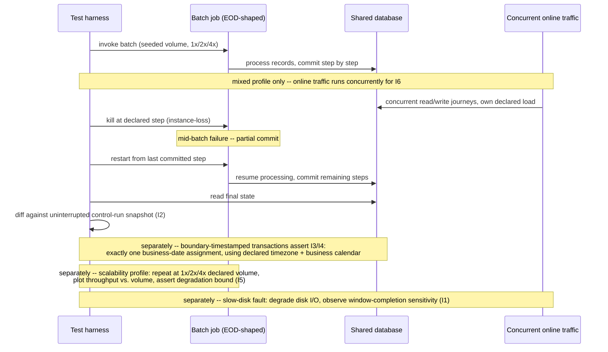

# Batch Window and Cutoff Throughput

Status: Approved | Last Reviewed: 2026-08-12 | Owner: @qe-lead
Catalog ID: TST-032 | Radii
Tier Applicability: T0, T1

## 1. Applies To

| Catalog ID | Title | Document |
|---|---|---|
| BSP-004 | End-of-Day Batch Window | [../../patterns/banking-solutions/end-of-day-batch-window.md](../../patterns/banking-solutions/end-of-day-batch-window.md) |
| BSP-019 | Collections Engine | [../../patterns/banking-solutions/collections-engine.md](../../patterns/banking-solutions/collections-engine.md) |
| REF-008 | Regulatory Reporting | [../../reference-architectures/regulatory-reporting.md](../../reference-architectures/regulatory-reporting.md) |
| DATA-004 | Data Vault 2.0 | [../../patterns/data/data-vault-2.md](../../patterns/data/data-vault-2.md) |

These four rows share one archetype because they share one method of verification: each one runs
a bounded-duration batch cycle against a declared processing window, must resume cleanly from a
mid-run failure, and must assign every record it processes to exactly one business date. BSP-004
is the canonical case — the nightly EOD settlement job itself. BSP-019 runs its own batch cycle
inside the same overnight window: the Collections Engine's `SchedulerService` daily days-past-due
refresh recalculates delinquency status for the full loan book once per business day, and that
refresh is exactly the kind of bounded, restartable, cutoff-sensitive batch this archetype exists
to test — a different failure surface from the rule-evaluation accuracy [TST-025 Decision Table
and Screening Accuracy](./decision-screening-accuracy.md) already verifies for BSP-019's strategy
assignment. REF-008's Spring Batch/Airflow report-aggregation pipeline must complete and submit to
the SBV ePortal before the 09:00 next-business-day deadline, making it a cutoff-throughput case in
its own right. DATA-004's Hub/Link/Satellite loads are batch-loaded in parallel on a nightly cycle
feeding the same EOD SLA; a late-arriving Satellite record is this archetype's late-arriving-
transaction failure mode expressed in warehouse-load terms rather than ledger terms. In every row,
the assertable question is the same: did the batch finish inside its declared window, does a
restart reproduce the same final state as an uninterrupted run, and did every record land in
exactly one business date.

`BSP-019` already carries [TST-025](./decision-screening-accuracy.md) in the coverage matrix for
its confusion-matrix decisioning accuracy. This document appends `TST-032` to that row rather than
replacing the claim: TST-025 verifies *what* the Collections Engine's rule engine decides; this
archetype verifies that its daily batch refresh *completes, restarts, and reconciles* on schedule.
The two archetypes test disjoint failure surfaces of the same catalog row and both apply.

## 2. Failure Taxonomy

- A batch exceeding its declared window and colliding with the next business day's processing,
  so the following cycle starts before the prior one has released its resources or its lock.
- No restartability: any mid-batch failure forces a full re-run that no longer fits inside the
  remaining window, turning a partial failure into a missed deadline.
- The cutoff applied on the wrong timezone, so a transaction is cut off an hour early or late
  relative to the business's declared operating timezone.
- A partial batch committed with no idempotent restart, so resuming after failure re-executes an
  already-committed step and produces a duplicate or inconsistent result.
- Throughput degrading nonlinearly as volume grows, so a batch that comfortably fits its window
  at today's volume silently stops fitting once volume doubles or quadruples.
- A late-arriving transaction landing in the wrong business date, because it crosses the cutoff
  boundary while in flight and is assigned to whichever side of midnight the batch happened to be
  on when it was picked up, rather than the date its own business timestamp declares.
- Batch and online traffic contending for the same database, so online transaction latency
  degrades during the batch window even though the batch itself completes on time.

## 3. Functional Test Design

**Oracle:** `invariant-assertion`, per
[TST-001 § The Four Oracles](../strategy/test-strategy-standard.md#the-four-oracles).

### Invariants

| # | Invariant | Assertion |
|---|---|---|
| I1 | The batch completes within its declared window at its declared volume | `assert batch_duration <= declared_window_duration` when the run is seeded at exactly `declared_volume` |
| I2 | A restart after a mid-batch failure yields the same final state as an uninterrupted control run | `assert final_state(restarted_run) == final_state(uninterrupted_control_run)`, compared field-by-field, not merely by completion status |
| I3 | The cutoff boundary uses the declared timezone **and** the declared business calendar | `assert cutoff_instant == business_calendar.cutoff_for(business_date, declared_timezone)`, never a fixed offset computed from the harness's own local clock |
| I4 | Every transaction is processed in exactly one business date — never two, never none | `assert count(business_date_assignments(transaction)) == 1` for every transaction in the run, including every transaction seeded to arrive within one second of the cutoff boundary |
| I5 | Throughput degradation stays within its declared bound across the declared volume range | `assert throughput(volume) / throughput(declared_volume) >= declared_min_throughput_ratio` at each of 1x, 2x, and 4x declared volume |
| I6 | Online latency during the batch window stays within its own budget | `assert online_p95_latency_during_batch <= declared_online_latency_budget`, measured only while batch and online load run concurrently, never against an online-only baseline |

### Equivalence classes and boundaries

- Declared volume, uninterrupted run — the canonical window-completion case (I1).
- 1x, 2x, and 4x declared volume, same batch logic — the throughput-degradation curve (I5).
- A transaction timestamped exactly at the cutoff boundary, on either side by one second — the
  business-date assignment boundary (I3, I4, and the Failure Taxonomy's late-arriving-transaction
  entry, made concrete).
- A mid-batch kill at an early step, a middle step, and the last step before commit — three
  distinct restart points, not one (I2).
- Batch running alone versus batch running concurrently with online traffic at its own declared
  load — the only equivalence-class pair that can distinguish I1 (batch completes) from I6 (online
  latency holds), since a batch that completes on time while starving online traffic passes I1 and
  fails I6.

### Negative paths

- A transaction whose business-date attribution cannot be resolved against the declared business
  calendar (an undeclared holiday, an unrecognised timezone) is rejected explicitly and logged,
  never silently defaulted to the harness's own clock.
- A restart attempted from a step whose upstream dependency has not itself committed is rejected,
  never allowed to proceed and produce a state that depends on an uncommitted precondition.
- A batch invoked a second time while a prior run still holds the window's lock is rejected with an
  explicit concurrent-attempt error, never allowed to run in parallel with itself.
- A volume beyond the declared 4x ceiling is flagged as out of the archetype's tested envelope,
  never silently extrapolated from the 1x–4x curve as if it had been measured.

## 4. Performance Test Design

| Profile | Applies | Why | Threshold source |
|---|---|---|---|
| `baseline` | yes | Confirms the batch completes correctly at a small, fixed volume before any load-shaped or restart-shaped run is attempted | [NFR-002](../../nfr/latency-budget-model.md) |
| `load` | yes | Proves the batch holds its declared window at declared volume under realistic contention from concurrent reads against the same store | [NFR-004](../../nfr/throughput-model.md) |
| `scalability` | yes | Locates whether throughput degrades linearly or nonlinearly as volume steps from 1x to 2x to 4x declared volume — the Failure Taxonomy's nonlinear-degradation entry, made concrete (I5) | [NFR-003](../../nfr/capacity-planning-model.md) |
| `soak` | yes | Proves the batch's window-completion time does not drift across many consecutive nightly cycles as historized data accumulates, which a single run cannot show | [NFR-003](../../nfr/capacity-planning-model.md) |
| `mixed` | yes — the decisive profile for this archetype | Batch and online traffic running concurrently is the only realistic case that can assert I6; see below | [TST-003 § Named Journey Blends](../strategy/workload-modelling.md#named-journey-blends) |

**`mixed` is the decisive profile for this archetype, not incidental.** I1 through I5 can all be
proven with the batch running in isolation. I6 — online latency holding its own budget while the
batch runs — cannot be proven any other way: a batch-alone run measures nothing about contention
for the shared database, and an online-alone run never exercises the batch at all. Run `mixed` with
the batch at its declared volume and online traffic at its own declared load, concurrently, for the
full length of the batch window, and evaluate I6 against the online journey's own latency budget,
per [TST-002 § `mixed`](../strategy/performance-test-standard.md#mixed).

**I1's window duration is sourced from the declared business calendar, not from
[NFR-002](../../nfr/latency-budget-model.md).** The batch window is a business-declared operating
boundary — the interval T24 OFS (or the equivalent downstream gateway) accepts postings, not a
latency budget derived from the standard tiering model. Citing NFR-002 as I1's threshold source
would be wrong: NFR-002 governs per-call latency, not the calendar-declared window a whole batch
run must fit inside. The window duration itself is read from the business calendar at run time,
per §3's I3, never hard-coded into the harness or into this document.

**Workload model:** `closed` for `baseline`, `load`, `scalability`, and `soak` — each holds a
declared, bounded population (a fixed synthetic volume, or a fixed 1x/2x/4x multiple of it) rather
than an open arrival process, per [TST-003](../strategy/workload-modelling.md). `mixed` is `closed`
for the batch component (a fixed declared volume) and `open` for the concurrent online component
(an exogenous arrival process the harness must not throttle), run together for the same duration.

## 5. Canonical Harness — JMeter

```xml
<!-- Thread Group 1: the batch itself. CLOSED model -- a fixed, seeded synthetic volume, never an
     open arrival process. volume_multiplier selects the 1x/2x/4x scalability step, generated per
     TST-004 Volume and Cardinality (see strategy/test-data-management.md). -->
<ThreadGroup testname="tg-batch-window-cutoff">
  <stringProp name="ThreadGroup.num_threads">1</stringProp>
  <stringProp name="ThreadGroup.duration">${__P(window_ceiling_seconds,9000)}</stringProp>
</ThreadGroup>

<CSVDataSet testname="synthetic_seeded_volume.csv (SYNTHETIC -- generated per TST-004)">
  <stringProp name="filename">data/synthetic_seeded_volume_${__P(volume_multiplier,1x)}.csv</stringProp>
  <stringProp name="variableNames">record_id,business_timestamp,expected_business_date</stringProp>
  <boolProp name="recycle">false</boolProp>
</CSVDataSet>

<JDBCSampler testname="invoke batch job (Spring Batch REST trigger or direct JDBC call)">
  <stringProp name="query">CALL invoke_eod_batch(?, ?)</stringProp>
  <stringProp name="queryArguments">${business_date},${volume_multiplier}</stringProp>
</JDBCSampler>

<!-- BeanShell/OS PreProcessor: kill the batch process mid-run at a declared step boundary --
     three separate runs, one per kill point (early / middle / last-step-before-commit). -->
<BeanShellPreProcessor testname="kill-and-restart trigger (I2)">
  <stringProp name="script"><![CDATA[
    if (vars.get("kill_at_step").equals(vars.get("current_step"))) {
        Runtime.getRuntime().exec("kill -9 " + vars.get("batch_pid"));
    }
  ]]></stringProp>
</BeanShellPreProcessor>

<JDBCSampler testname="restart batch job from last committed step">
  <stringProp name="query">CALL restart_eod_batch(?)</stringProp>
  <stringProp name="queryArguments">${job_execution_id}</stringProp>
</JDBCSampler>

<!-- JDBC PostProcessor: read the restarted run's final state and diff it against a stored
     control-run snapshot, field by field -- I2's actual assertion, not merely a status check. -->
<JDBCPostProcessor testname="assert final state matches uninterrupted control run (I2)">
  <stringProp name="query">SELECT * FROM eod_final_state WHERE business_date = ?</stringProp>
</JDBCPostProcessor>

<!-- Thread Group 2: concurrent online traffic, OPEN model, runs for the same window duration as
     Thread Group 1 -- the `mixed` profile's decisive component (I6). -->
<ThreadGroup testname="tg-concurrent-online-traffic">
  <stringProp name="ThreadGroup.num_threads">${__P(online_users,50)}</stringProp>
  <stringProp name="ThreadGroup.duration">${__P(window_ceiling_seconds,9000)}</stringProp>
</ThreadGroup>
<HTTPSamplerProxy testname="online journey request (synthetic)">
  <stringProp name="HTTPSampler.path">/v1/accounts/balance</stringProp>
  <stringProp name="HTTPSampler.method">GET</stringProp>
</HTTPSamplerProxy>
```

```bash
# scalability profile: one run per declared volume multiplier -- not one run total.
for multiplier in 1x 2x 4x; do
  jmeter -n -t batch-window-cutoff.jmx \
    -Jvolume_multiplier="${multiplier}" -Jprofile=scalability \
    -Jonline_users=0 \
    -l "results-${multiplier}.jtl" -e -o "report-${multiplier}/"
done

# mixed profile: batch at declared volume, concurrent online traffic at its own declared load.
jmeter -n -t batch-window-cutoff.jmx \
  -Jvolume_multiplier=1x -Jprofile=mixed -Jonline_users="${ONLINE_USERS}" \
  -l results-mixed.jtl -e -o report-mixed/
```

The **JDBC PostProcessor** diffing the restarted run's final state against a stored control-run
snapshot is the load-bearing element for I2: a status check alone (`job_status == COMPLETED`)
cannot distinguish a clean restart from a restart that silently re-executed an already-committed
step and produced a state that merely looks complete. Restart idempotency at the batch-step level
is the same discipline [TST-020 Idempotency and Replay Safety](./idempotency-replay.md) establishes
for request-level replay; this archetype applies it at the granularity of a batch step rather than
an API call, and I2 is its assertable form.

## 6. Tool Fit

| Tool | Fit | When to prefer |
|---|---|---|
| JMeter | BEST | The JDBC Sampler and JDBC PostProcessor give direct, in-plan control over invoking the batch, killing it mid-run at a declared step, restarting it, and diffing the final state against a stored control-run snapshot — plus the CSV Data Set Config drives the seeded 1x/2x/4x volume generation in the same plan |
| Locust | good | A Python task can invoke the batch trigger and poll for completion, and a database driver can perform the same final-state diff, but Locust has no native JDBC sampler — the diff logic must be hand-rolled rather than a first-class plan element |
| Gatling + Karate | fair | Karate can script the batch-trigger and restart HTTP calls and assert a response body, but neither tool has a native JDBC comparison step, so the state-diff behind I2 requires an external database client bolted onto the scenario |
| k6 | fair | k6 can drive the online-traffic side of the `mixed` profile well, but it has no native database sampler for the batch-invocation and state-diff side, requiring an external script or extension for I2 |

## 7. Overlays

### Resilience overlay

Two distinct fault scenarios apply, not one:

- `instance-loss` mid-batch (see
  [TST-006](../strategy/resilience-test-standard.md)) — kill the instance running the batch job at
  each of the three declared kill points (§3's equivalence classes), then restart, and assert I2:
  the restarted run's final state matches the uninterrupted control run's, field by field.
- `slow-disk` — inject degraded disk I/O latency on the volume the batch writes to, and observe
  whether the window-completion time (I1) degrades gracefully or falls off a cliff. This tests
  window *sensitivity*, a distinct question from restartability: a batch can be perfectly
  restartable (I2 holds) while still being unable to absorb even modest I/O degradation without
  missing its window (I1 fails).

### Data-quality overlay

Assert the completeness of the batch's output against its input count, per
[TST-009 § The Six Dimensions](../strategy/data-quality-test-standard.md#the-six-dimensions):
`actual_output_record_count == expected_input_record_count`, with zero unexplained drops. A record
present in the input but absent from the output — dropped silently during a mid-batch failure and
never picked up by the restart — is exactly the gap this check exists to catch, and it is the
data-quality-shaped restatement of the same failure I2's state-diff proves from the transactional
side.

Contract and Security overlays are omitted: this archetype's failure modes are about batch
window completion, restart correctness, and business-date attribution, not schema/wire
compatibility or access control, so neither overlay applies.

## 8. Test Data Requirements

Synthetic only, per [TST-004](../strategy/test-data-management.md). Entities needed: a seeded
synthetic transaction volume at exactly the declared 1x baseline, plus 2x and 4x multiples of it
for the `scalability` curve, generated per
[TST-004 § Volume and Cardinality](../strategy/test-data-management.md#volume-and-cardinality) so
that cardinality skew — not merely row count — matches production shape; a small set of records
timestamped deliberately within one second of the cutoff boundary on both sides, to exercise I3
and I4's business-date-attribution boundary; and a stored control-run final-state snapshot,
produced by one uninterrupted run per volume multiplier, against which every restarted run in I2
is diffed. The cardinality driver is the declared volume multiplier itself (1x/2x/4x), orthogonal
to the `mixed` profile's own online virtual-user count. Referential integrity requirement: every
seeded transaction resolves to a business date computed independently of the batch under test —
the corpus's `expected_business_date` column is derived from the declared business calendar before
the run starts, never read back from the system under test after the fact, so I4 has a genuine
oracle rather than a tautology. Teardown: purge the seeded volume, the control-run snapshots, and
any batch-job execution records created for the run, at environment reset, per
[TST-005](../strategy/environments-quality-gates.md).

## 9. Evidence and Observability

Metrics to capture: batch duration against the declared window ceiling (I1); the field-by-field
state diff between each restarted run and its control-run snapshot, which must be empty (I2); the
per-record business-date-assignment count, which must be exactly one for every record, including
every boundary-timestamped record (I4); the throughput curve across the 1x/2x/4x volume steps
(I5); and the online journey's own P95 latency measured only during the `mixed` run, against its
own declared budget (I6). Trace assertions: a restarted batch step's trace must show it resuming
from the last committed step, not re-entering a step whose commit has already been recorded.
Artifacts to attach to a DAB submission: the JMeter aggregate report and HTML dashboard, or the
Locust distribution report when Locust is the primary tool, per
[TST-005](../strategy/environments-quality-gates.md); the state-diff report from each restart
kill-point (I2); the volume-versus-throughput curve chart from the `scalability` profile (I5); and
the completeness reconciliation output from the Data-quality overlay.

## 10. Exit Criteria

The block below is illustrative for a synthetic service implementing this archetype's patterns —
every value is an example, not a normative one, per [TST-001](../strategy/test-strategy-standard.md).

```yaml
test_acceptance_criteria:
  service_name: synthetic-eod-batch-service
  archetypes: [TST-032]
  catalog_refs: [BSP-004, BSP-019]
  functional:
    invariants_covered: 6                 # I1-I6, all six assertable
    negative_paths_covered: 4
    oracle: invariant-assertion
  performance:
    profiles_executed: [baseline, load, scalability, soak, mixed]
    workload_model: mixed                 # closed for the batch component, open for the
                                           # concurrent online component; see §4
  resilience:
    fault_scenarios: [FM-instance-loss, FM-slow-disk]   # illustrative IDs, two distinct scenarios
  data_quality:
    dq_rules_asserted: 1                  # batch output completeness against input count
    reconciliation_tolerance: '0'
```

## Compliance Mapping

| Layer | Reference | Section/Control | How this satisfies |
|---|---|---|---|
| Ring 0 | ISO 22301 | Business continuity — a critical batch process must have defined, evidenced recovery steps | I2's field-by-field state diff between a restarted run and an uninterrupted control run is the assertable evidence that step-level checkpointing and restartability actually reproduce a correct outcome, not merely that the job status reports COMPLETED |
| Ring 1 | [Basel BCBS 239](../../compliance/basel-bcbs-239.md) — Principle 5 (Timeliness) | Risk data must be available within required reporting timeframes | I1's window-completion check against the declared business calendar is the assertable form of Principle 5's timeliness expectation for a batch-produced risk or settlement figure |
| Ring 1 | [Basel BCBS 230](../../compliance/basel-bcbs-230.md) — Principle 9 | Severe-but-plausible scenario testing, evidenced | The Resilience overlay's `instance-loss` and `slow-disk` fault scenarios are the severe-but-plausible batch-window disruptions Principle 9 requires be exercised and evidenced, not merely assumed tolerable |
| Ring 2 | SBV regulatory reporting submission deadlines ⚠️ (working summary — pending Legal review) | Daily prudential and transaction reports must reach the SBV ePortal by their declared deadline | I1 and I5 together are the technical control most directly responsible for satisfying the submission-deadline expectation: the batch that produces a report must complete inside its window at declared volume, and must keep doing so as volume grows |

## 12. Related Patterns

- [BSP-004 End-of-Day Batch Window](../../patterns/banking-solutions/end-of-day-batch-window.md)
- [BSP-019 Collections Engine](../../patterns/banking-solutions/collections-engine.md)
- [REF-008 Regulatory Reporting](../../reference-architectures/regulatory-reporting.md)
- [DATA-004 Data Vault 2.0](../../patterns/data/data-vault-2.md)

## 13. Related Archetypes

- [TST-004 Test Data Management](../strategy/test-data-management.md) — supplies the seeded
  synthetic volume generation method (§8) this archetype's `scalability` curve consumes rather
  than restates.
- [TST-020 Idempotency and Replay Safety](./idempotency-replay.md) — supplies the restart
  idempotency discipline this archetype's I2 applies at batch-step granularity rather than
  request granularity; see §5.
- [TST-022 Deterministic Calculation Engine](./deterministic-calculation-engine.md) — already
  cross-links this archetype in its own §4 for engines that run inside the end-of-day window: that
  archetype owns per-call calculation correctness and throughput, this archetype owns the batch's
  aggregate window-completion and restart assertions; the two are complementary, not overlapping.
- [TST-025 Decision Table and Screening Accuracy](./decision-screening-accuracy.md) — shares the
  `BSP-019` catalog row (§1); TST-025 verifies Collections Engine decisioning accuracy, this
  archetype verifies its daily batch refresh's window completion and restartability.
- TST-039 — Data Quality & Reconciliation (not yet published): expected to reuse this archetype's
  window-completion and restart-idempotency assertions for its own batch-mode reconciliation
  coverage, following the same forward-reference pattern already recorded against this archetype
  in [TST-022 §13](./deterministic-calculation-engine.md#13-related-archetypes).

## 14. Diagram


