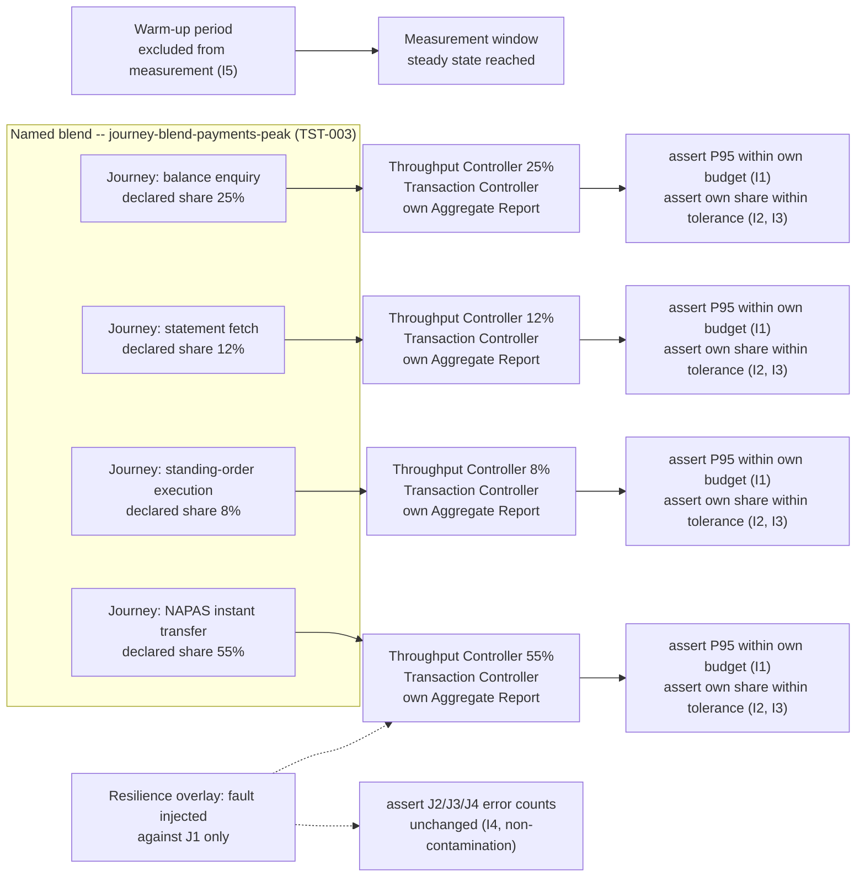

# Blended Journey Workload Testing

Status: Approved | Last Reviewed: 2026-08-12 | Owner: @qe-lead
Catalog ID: TST-034 | Radii
Tier Applicability: T0, T1

## 1. Applies To

This archetype owns the `mixed` profile's execution
([TST-002](../strategy/performance-test-standard.md)) and extends the named journey blend
registry it consumes ([TST-003](../strategy/workload-modelling.md#named-journey-blends)). It is
the only archetype whose method of verification — running several of a reference architecture's
own journeys concurrently, in their real percentage mix, and grading each journey against its own
budget — applies at the reference-architecture level rather than the individual-pattern level.
Every one of the twenty `REF-*` reference architectures is in scope: each has more than one
customer journey, and each journey's own tier budget is only ever proven meaningful under the
realistic contention of the others running alongside it.

| Catalog ID | Title | Document |
|---|---|---|
| REF-001 | Multi-Region Active-Active | [../../reference-architectures/multi-region-active-active.md](../../reference-architectures/multi-region-active-active.md) |
| REF-002 | Real-Time Payments — NAPAS / Instant | [../../reference-architectures/real-time-payments-napas.md](../../reference-architectures/real-time-payments-napas.md) |
| REF-003 | KYC / AML Onboarding | [../../reference-architectures/kyc-aml-onboarding.md](../../reference-architectures/kyc-aml-onboarding.md) |
| REF-004 | Card Authorization (3DS2) | [../../reference-architectures/card-authorization-3ds2.md](../../reference-architectures/card-authorization-3ds2.md) |
| REF-005 | SWIFT MT/MX Wire Transfer | [../../reference-architectures/swift-mt-mx-wire-transfer.md](../../reference-architectures/swift-mt-mx-wire-transfer.md) |
| REF-006 | Loan Origination | [../../reference-architectures/loan-origination.md](../../reference-architectures/loan-origination.md) |
| REF-007 | Fraud Screening Platform | [../../reference-architectures/fraud-screening-platform.md](../../reference-architectures/fraud-screening-platform.md) |
| REF-008 | Regulatory Reporting | [../../reference-architectures/regulatory-reporting.md](../../reference-architectures/regulatory-reporting.md) |
| REF-009 | Account Opening (Omnichannel) | [../../reference-architectures/account-opening-omnichannel.md](../../reference-architectures/account-opening-omnichannel.md) |
| REF-010 | Ledger Posting Engine | [../../reference-architectures/ledger-posting-engine.md](../../reference-architectures/ledger-posting-engine.md) |
| REF-011 | Open Banking (PSD2) | [../../reference-architectures/open-banking-psd2.md](../../reference-architectures/open-banking-psd2.md) |
| REF-012 | Dispute Management | [../../reference-architectures/dispute-management.md](../../reference-architectures/dispute-management.md) |
| REF-013 | Retail Deposits Platform | [../../reference-architectures/retail-deposits-platform.md](../../reference-architectures/retail-deposits-platform.md) |
| REF-014 | Consumer Lending Platform | [../../reference-architectures/consumer-lending-platform.md](../../reference-architectures/consumer-lending-platform.md) |
| REF-015 | Credit Card Issuing Platform | [../../reference-architectures/credit-card-issuing-platform.md](../../reference-architectures/credit-card-issuing-platform.md) |
| REF-016 | Corporate Lending and Syndications | [../../reference-architectures/corporate-lending-syndications.md](../../reference-architectures/corporate-lending-syndications.md) |
| REF-017 | Trade Finance Platform | [../../reference-architectures/trade-finance-platform.md](../../reference-architectures/trade-finance-platform.md) |
| REF-018 | Treasury and FX Platform | [../../reference-architectures/treasury-fx-platform.md](../../reference-architectures/treasury-fx-platform.md) |
| REF-019 | Wealth Management Platform | [../../reference-architectures/wealth-management-platform.md](../../reference-architectures/wealth-management-platform.md) |
| REF-020 | Cash Management and Liquidity | [../../reference-architectures/cash-management-liquidity.md](../../reference-architectures/cash-management-liquidity.md) |

## 2. Failure Taxonomy

- An aggregate P95 passing while a journey inside the blend breaches its own budget — the
  aggregate is dominated by a high-volume journey and hides a low-volume journey's failure.
- Blend percentages drifting from real traffic, so the test faithfully measures a mix that no
  longer resembles production and the result is a fiction.
- A low-volume, high-value journey starved below its declared share because the harness's
  scheduling favours the high-volume journeys it shares infrastructure with.
- Shared-resource contention — a connection pool, a cache, a rate limiter — that appears only when
  journeys run together and never surfaces in any single-journey run.
- A blend run too short to reach cache or connection-pool steady state, so the measured numbers
  reflect cold-start behaviour rather than the sustained contention the blend exists to reproduce.
- One journey's failure cascading into another and being attributed to the wrong journey, so the
  per-journey error ledger blames a healthy journey for a failure that originated elsewhere.

## 3. Functional Test Design

**Oracle:** `invariant-assertion`

### Invariants

| # | Invariant | Assertion |
|---|---|---|
| I1 | Every constituent journey meets its **own** tier budget | `assert p95_latency[j] <= NFR-002_tier_budget[j]` independently for every journey `j` in the blend — never against a single blended figure, per [TST-002 § `mixed`](../strategy/performance-test-standard.md) |
| I2 | Blend percentages match the declared mix within tolerance | `assert abs(actual_share[j] - declared_share[j]) <= tolerance` for every journey `j`, measured over the full measurement window, where `declared_share[j]` comes from the named blend's registry row in [TST-003](../strategy/workload-modelling.md#named-journey-blends) |
| I3 | No journey is starved below its declared share | `assert actual_share[j] >= declared_share[j] * (1 - tolerance)` and `assert request_count[j] > 0` in every sampling sub-window, for every journey `j`, including the lowest-volume one |
| I4 | Errors are attributed per journey, never only in aggregate | `assert error_count[j]` is independently recorded and reported for every journey `j`; an aggregate error rate alone never satisfies this invariant |
| I5 | Cache and connection-pool steady state is reached before measurement begins | `assert steady_state_reached_at <= measurement_window_start`, where steady state is the point at which cache hit ratio and pool utilisation both plateau during the declared warm-up period |

### Equivalence classes and boundaries

- The highest-volume journey in the blend — most exposed to I1's aggregate-masking failure mode.
- The lowest-volume, highest-value journey in the blend — most exposed to I3's starvation failure
  mode.
- Two journeys that share a downstream dependency (a connection pool, a cache, a rate limiter) —
  most exposed to the Failure Taxonomy's shared-resource-contention entry.
- Boundary: the instant the measurement window opens, immediately after the declared warm-up
  period — the point I5 exists to protect.
- Boundary: a blend percentage sampled in a short sub-window versus over the full run — I2 and I3
  must both hold over the full measurement window, not merely on average across it.

### Negative paths

- A journey configured with zero declared share is rejected at blend-definition time, never
  silently admitted as a valid constituent — a blend's percentages must sum to 100, per
  [TST-003](../strategy/workload-modelling.md#named-journey-blends).
- Measurement beginning before the declared warm-up period elapses is rejected by the harness
  configuration, never silently tolerated as an early start — the direct negative path for I5.
- A fault injected against one journey (§7 Resilience overlay) that surfaces in another journey's
  error count is a defect, never a result the harness merely notes and moves past — the direct
  negative path for I4.

## 4. Performance Test Design

| Profile | Applies | Why | Threshold source |
|---|---|---|---|
| `mixed` | yes — primary | This archetype's decisive profile: the named blend runs at its declared percentage mix and every journey is graded against its own budget, per [TST-002 § `mixed`](../strategy/performance-test-standard.md) | [NFR-002](../../nfr/latency-budget-model.md), per journey |
| `load` | yes | Confirms the blend holds its declared mix and every journey's own budget at sustained, steady-state throughput, before any harsher profile is attempted | [NFR-004](../../nfr/throughput-model.md) |
| `soak` | yes | Proves the blend's shared caches and connection pools remain stable over a duration long enough to expose the Failure Taxonomy's cache-steady-state and shared-resource-contention entries, which a short `mixed` run cannot reach | [NFR-003](../../nfr/capacity-planning-model.md) |
| `failover-under-load` | yes | Layers the Resilience overlay's single-journey fault (§7) on top of the blend, so I4's per-journey error attribution is proven while every journey is genuinely under load, not against an idle blend | [NFR-001](../../nfr/service-tiering-rto-rpo.md) |

**Workload model:** `closed` — the blend's declared percentage mix is expressed as a fixed
population split across per-journey Thread Groups via Throughput Controllers (§5); an open
arrival process would let each journey's own admitted rate drift under backpressure, which is
exactly the I2 percentage-drift failure this archetype exists to catch. See
[TST-003](../strategy/workload-modelling.md#open-versus-closed-workload-models).

## 5. Canonical Harness — JMeter

```xml
<!-- One Thread Group per journey. Percentages below are journey-blend-payments-peak's declared
     mix (see TST-003's Named Journey Blends registry), illustrated against REF-002; every other
     REF-* row supplies its own blend and its own percentages the same way. -->

<ThreadGroup testname="tg-journey-napas-instant-transfer (declared share: 55%)">
  <stringProp name="ThreadGroup.num_threads">${__P(blend_population,200)}</stringProp>
  <stringProp name="ThreadGroup.duration">${__P(duration,14400)}</stringProp>
</ThreadGroup>

<ThroughputController testname="Throughput Controller -- 55% of iterations (declared share)">
  <intProp name="ThroughputController.style">1</intProp> <!-- percent execution -->
  <FloatProperty name="ThroughputController.percentThroughput">55.0</FloatProperty>

  <TransactionController testname="Transaction Controller -- napas-instant-transfer (own aggregate report)">
    <boolProp name="TransactionController.includeTimers">false</boolProp>
    <HTTPSamplerProxy testname="POST /v1/payments/instant (synthetic)"/>
  </TransactionController>
</ThroughputController>

<!-- Repeat the Thread-Group / Throughput-Controller / Transaction-Controller triple for each
     remaining journey: balance-enquiry (25%), statement-fetch (12%),
     standing-order-execution (8%). Percentages must sum to 100, per TST-003. -->

<!-- Warm-up: an explicit period at the start of the run, excluded from measurement per I5. -->
<JSR223PreProcessor testname="skip samples before warm-up (I5) -- steady state gate">
  <stringProp name="script"><![CDATA[
    // Samples taken before warmup_seconds have elapsed since run start are tagged so the
    // Aggregate Report listeners below exclude them -- I5 requires steady state (cache hit
    // ratio and connection-pool utilisation both plateaued) BEFORE measurement begins, not a
    // best-effort approximation.
    long elapsed = System.currentTimeMillis() - props.get("run_start_ms") as long;
    long warmupMs = Long.parseLong(props.getProperty("warmup_seconds", "300")) * 1000L;
    sampler.getThreadContext().getVariables().put("in_warmup", (elapsed < warmupMs).toString());
  ]]></stringProp>
</JSR223PreProcessor>

<!-- Separate Aggregate Report listener per journey's Transaction Controller -- never one merged
     report across journeys, or I1's per-journey grading and I4's per-journey error attribution
     both become impossible to evaluate independently. -->
```

```bash
jmeter -n -t blended-journey-workload.jmx \
  -Jblend_ref="${JMETER_BLEND_REF}" -Jblend_population="${JMETER_BLEND_POPULATION}" \
  -Jduration="${JMETER_DURATION}" -Jwarmup_seconds="${JMETER_WARMUP_SECONDS}" \
  -Jprofile="${JMETER_PROFILE}" \
  -l results.jtl -e -o report/
```

The **Throughput Controller** is the load-bearing element: set to percent-execution mode, it
expresses a journey's declared share directly as a fraction of the Thread Group's own iterations,
so I2's percentage-match assertion is checkable against the harness's own configuration, not just
against the observed traffic. The **per-journey Transaction Controller and separate Aggregate
Report** are equally load-bearing: a single merged report across journeys would average away
exactly the effect I1 and I4 exist to catch — a low-volume journey's breach diluted into a
high-volume journey's healthy numbers. The **explicit warm-up exclusion** is the harness's
enforcement of I5: without it, the measurement window would include cold-cache, cold-pool samples
that belong to no realistic steady state.

## 6. Tool Fit

| Tool | Fit | When to prefer |
|---|---|---|
| JMeter | BEST | The Throughput Controller expresses a percentage blend directly, in percent-execution mode, against the Thread Group's own iteration count — no other tool in the corpus ties a declared mix that cleanly to the harness's own configuration |
| Gatling + Karate | good | Gatling's scenario-weight DSL can approximate a percentage mix and per-request-group assertions can grade each journey independently, but the mix is expressed as an injection-profile weight rather than a runtime-enforced controller |
| k6 | good | Tag-scoped thresholds let each journey's checks be graded independently, and scenario `exec` weighting can approximate the declared mix, but k6 has no first-class construct equivalent to a percent-execution Throughput Controller |
| Locust | fair | Locust's per-`User`-class task weighting can approximate a mix, but has no first-class per-journey aggregate reporting comparable to JMeter's per-Transaction-Controller listeners, so the per-journey split this archetype requires must be built by hand |

## 7. Overlays

### Resilience overlay

Inject a fault (per [TST-006](../strategy/resilience-test-standard.md)) affecting **one** journey
in the running blend — never the whole blend — and assert I4: that the resulting error is
attributed to the affected journey's own error count and does not contaminate the other
journeys' numbers. This is the Failure Taxonomy's cascading-attribution entry made assertable: a
fault confined to one journey's dependency must show up only in that journey's per-journey
Aggregate Report, while every other journey's error count stays at its pre-injection baseline.

Contract, security, and data-quality overlays are omitted: this archetype's failure modes are
about per-journey attribution and contention under a realistic mix, not schema compatibility,
access control, or data reconciliation, so none of those three overlays apply.

## 8. Test Data Requirements

Synthetic only, per [TST-004](../strategy/test-data-management.md). Entities needed: one
synthetic dataset per constituent journey in the blend — for example, synthetic payer/payee pairs
for a NAPAS instant-transfer journey, synthetic account identifiers for a balance-enquiry journey
— sized so no journey exhausts its own data before the run's measurement window closes. The
cardinality driver is the blend's declared population and duration together: the highest-share
journey's row count must cover its own iteration count for the full run, or the harness silently
recycles rows mid-run and understates the realistic-contention effect the blend exists to
reproduce. Referential-integrity requirement: each journey's synthetic records must resolve
against the same synthetic reference data (accounts, customers) the other journeys in the blend
use, so a cross-journey effect — for example, a balance-enquiry journey observing a state change
the instant-transfer journey just produced — is genuinely observable rather than an artifact of
disjoint fixtures. Teardown: purge every journey's synthetic records and reset any shared
reference data at environment reset, per [TST-005](../strategy/environments-quality-gates.md).

## 9. Evidence and Observability

Metrics to capture: each journey's own P95 latency and error count, reported independently (I1,
I4); each journey's actual share of total iterations against its declared share, over the full
measurement window (I2, I3); the timestamp steady state was reached against the declared warm-up
boundary (I5); cache hit ratio and connection-pool utilisation time series across the `soak`
run, to show they plateau rather than drift. Trace assertions: a fault injected against one
journey (§7) must show its trace's failure span rooted in that journey's own request path, never
in another journey's — the assertable form of I4's non-contamination requirement. Artifacts to
attach to a DAB submission: the per-journey Aggregate Reports (never a single merged report, per
§5); the actual-versus-declared share comparison for every journey; the warm-up-boundary log
showing when steady state was reached; and the fault-injection log from the Resilience overlay,
timestamped against the affected journey's own error-count time series.

## 10. Exit Criteria

The block below is illustrative for a synthetic service implementing this archetype's patterns —
every value is an example, not a normative one, per
[TST-001](../strategy/test-strategy-standard.md).

```yaml
test_acceptance_criteria:
  service_name: synthetic-payments-gateway
  archetypes: [TST-034]
  catalog_refs: [REF-002]
  functional:
    invariants_covered: 5                 # I1-I5, all five assertable
    negative_paths_covered: 3
    oracle: invariant-assertion
  performance:
    profiles_executed: [load, mixed, soak, failover-under-load]
    workload_model: closed                # see §4 above
    blend_ref: journey-blend-payments-peak
  resilience:
    fault_scenarios: [FM-single-journey-dependency-fault]  # illustrative ID, one journey only
```

## Compliance Mapping

| Layer | Reference | Section/Control | How this satisfies |
|---|---|---|---|
| Ring 0 | Google SRE Workbook | Chapter 5 — load and stress testing | The `mixed` profile's named-blend method operationalises the Workbook's guidance that realistic load testing exercise several concurrent workloads together, not one journey in isolation |
| Ring 1 | [Basel BCBS 230](../../compliance/basel-bcbs-230.md) — Principle 9 | Severe-but-plausible scenario testing | A blended peak **is** the severe-but-plausible scenario Principle 9 requires be exercised and evidenced: production traffic never arrives as a single isolated journey, so a single-journey test alone cannot serve as that evidence |
| Ring 2 | SBV Circular 09/2020 ⚠️ (working summary — pending Legal review) | Operational resilience under realistic peak conditions | This archetype's per-journey Aggregate Reports, retained per [TST-005](../strategy/environments-quality-gates.md), are the artifact an SBV inspection would examine to confirm every journey held its own budget under a realistic, concurrently-contended peak — not merely in isolation |

## 12. Related Patterns

- [TST-002 § `mixed`](../strategy/performance-test-standard.md) — the profile this archetype
  owns the execution of.
- [TST-003 § Named Journey Blends](../strategy/workload-modelling.md#named-journey-blends) — the
  blend registry this archetype consumes and extends as new blends are needed.

## 13. Related Archetypes

- TST-033 — Multi-Tenant Isolation and Noisy-Neighbour Testing
  ([multitenant-noisy-neighbour.md](./multitenant-noisy-neighbour.md)): also runs concurrent
  load components and grades per-component numbers independently, but its differential method
  isolates two tenants against each other, where this archetype's method blends several journeys
  of the *same* tenant population — the two methods are siblings, not substitutes for one
  another.
- TST-031 — Rate-Limit Breakpoint Testing
  ([rate-limit-breakpoint.md](./rate-limit-breakpoint.md)): its step-ramp method locates a single
  journey's own breakpoint; this archetype instead holds several journeys at their declared,
  sub-breakpoint shares simultaneously to prove realistic contention, not to locate a ceiling.

## 14. Diagram


