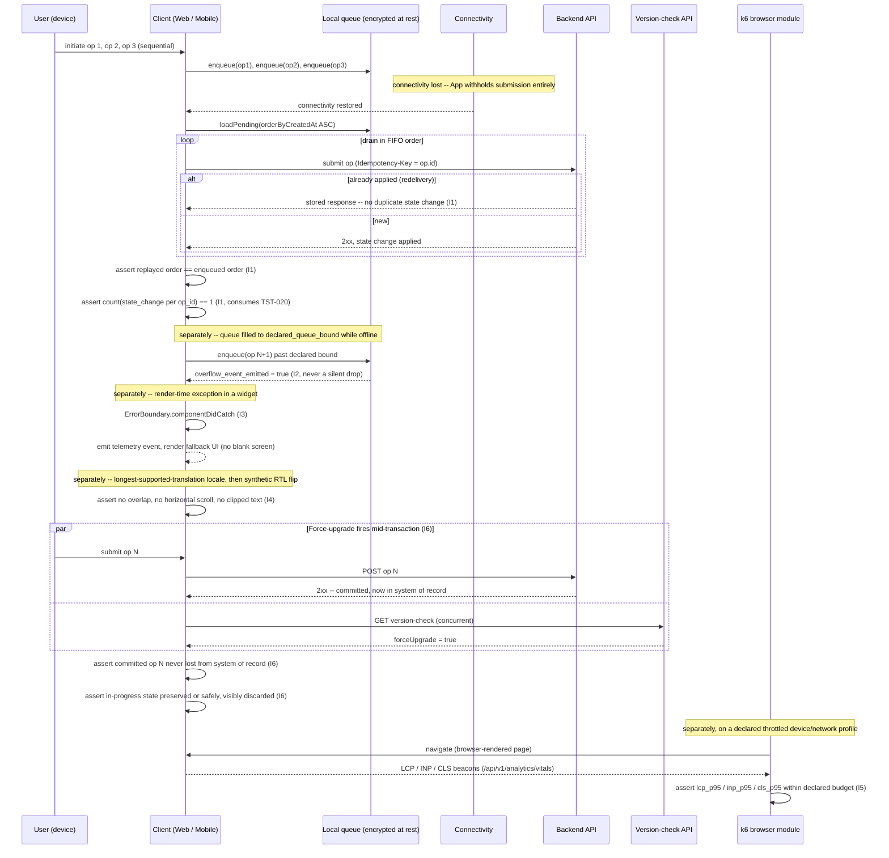

# Client Experience, Offline Sync and Performance Budget Testing

Status: Approved | Last Reviewed: 2026-08-12 | Owner: @qe-lead
Catalog ID: TST-043 | Radii
Tier Applicability: T1, T2

## 1. Applies To

| Catalog ID | Title | Document |
|---|---|---|
| FE-005 | Web Error Boundary | [../../patterns/frontend/web-error-boundary.md](../../patterns/frontend/web-error-boundary.md) |
| FE-006 | Web i18n / RTL | [../../patterns/frontend/web-i18n-rtl.md](../../patterns/frontend/web-i18n-rtl.md) |
| FE-001 | Web Performance Budgets | [../../patterns/frontend/web-performance-budgets.md](../../patterns/frontend/web-performance-budgets.md) |
| FE-002 | Web Resilience / Offline-First | [../../patterns/frontend/web-resilience-offline-first.md](../../patterns/frontend/web-resilience-offline-first.md) |
| MOB-001 | Mobile Offline Queue | [../../patterns/mobile/mobile-offline-queue.md](../../patterns/mobile/mobile-offline-queue.md) |
| MOB-006 | Mobile Force-Upgrade | [../../patterns/mobile/mobile-force-upgrade.md](../../patterns/mobile/mobile-force-upgrade.md) |

These six rows share one archetype because each one is a place where correctness is proven by
observing the *client's own rendered or persisted state* rather than a server response — an
invariant-assertion method identical across all six, even though the six invariants it produces
(I1–I6 below) look superficially unrelated. FE-002 Web Resilience/Offline-First and MOB-001 Mobile
Offline Queue are the same queue-replay concern on two platforms — an IndexedDB outbox on web, an
encrypted Room/CoreData store on mobile — so I1 and I2 apply to both identically. FE-005 Web Error
Boundary is the client-side fault-containment half of the same resilience story: a queue that
replays correctly is worthless if an unrelated rendering exception blanks the screen first, so I3
is tested in the same archetype rather than a separate one. FE-006 Web i18n/RTL and FE-001 Web
Performance Budgets are the two purely presentational invariants (I4, I5) — neither has a server
side to assert against at all, which is exactly why this archetype's harness (§5) has to reach for
a browser automation tool instead of a protocol-level one for those two. MOB-006 Mobile
Force-Upgrade closes the set: I6 is the one invariant that spans both the offline-queue state (a
transaction that was mid-flight when the client was blocked) and the client-rendered state (the
blocking modal itself), so it belongs with the same client-experience method as the other five
rather than with a purely server-side archetype.

This archetype consumes [TST-027](./ordering-resequencing.md)'s ordering-assertion method for I1's
original-order requirement and [TST-020](./idempotency-replay.md)'s replay-assertion method for
I1's exactly-once requirement — applied here to a client-side offline queue's drain sequence,
rather than re-derived. Neither TST-027 nor TST-020 is restated; see
[§13 Related Archetypes](#13-related-archetypes).

## 2. Failure Taxonomy

- An offline queue replaying in the wrong order after reconnect.
- An offline queue duplicating on reconnect.
- An error boundary swallowing an error with no telemetry.
- i18n or RTL layout breaking at the longest supported translation.
- A Core Web Vitals budget met on a fast development device but missed on the target device
  class.
- Force-upgrade blocking a user mid-transaction with unsaved state.
- An offline queue growing without bound.

## 3. Functional Test Design

**Oracle:** `invariant-assertion`, per
[TST-001 § The Four Oracles](../strategy/test-strategy-standard.md#the-four-oracles).

### Invariants

| # | Invariant | Assertion |
|---|---|---|
| I1 | An offline queue replays in original order, exactly once, on reconnect | `assert replayed_sequence == enqueued_sequence` (per-device FIFO order, [TST-027](./ordering-resequencing.md)'s ordering method) `AND assert count(applied_state_change per op_id) == 1` even under a duplicate redelivery ([TST-020](./idempotency-replay.md)'s replay method), never re-derived independently here |
| I2 | The queue is bounded with a defined overflow behaviour | `assert overflow_event_emitted == true` whenever `queue_depth == declared_queue_bound`, `AND assert silently_dropped_count == 0` — an offline enqueue past the bound must be rejected or evicted per a declared policy, never silently accepted |
| I3 | An error boundary contains the failure and emits telemetry | `assert error_caught_by_boundary == true` (the application remains interactive; no blank screen) `AND assert telemetry_event_emitted == true` for every synthetic thrown error, per [FE-005](../../patterns/frontend/web-error-boundary.md)'s `componentDidCatch` / Sentry `captureException` contract |
| I4 | Layout holds at the longest supported translation and in RTL | `assert no_element_overlap == true AND no_horizontal_scroll == true AND no_clipped_text == true` at the declared longest-string locale, and again under a synthetic `dir="rtl"` flip, exercising [FE-006](../../patterns/frontend/web-i18n-rtl.md)'s CSS logical-properties contract rather than its physical-property equivalent |
| I5 | The declared Core Web Vitals budget is met on the declared device and network class | `assert lcp_p95 <= declared_lcp_budget AND inp_p95 <= declared_inp_budget AND cls_p95 <= declared_cls_budget`, measured via the k6 browser module against the declared throttled device/network profile — never against the harness's own unthrottled host (§5, §6) |
| I6 | Force-upgrade preserves or safely discards in-progress state, and never loses committed state | `assert committed_transaction_never_lost == true` (any operation the backend already accepted is present in the system of record regardless of when the force-upgrade gate fires) `AND assert (in_progress_state_preserved == true OR in_progress_state_safely_discarded == true)` — never silently vanished with no user-visible signal — per [MOB-006](../../patterns/mobile/mobile-force-upgrade.md) |

### Equivalence classes and boundaries

- An offline window shorter than the declared queue bound versus one that fills or exceeds it —
  only the latter exercises I2's overflow behaviour (I1 vs. I2 boundary).
- A transient reconnect (single blip, in-memory drain) versus a sustained offline period spanning
  an app-process restart — I1's FIFO replay must survive the restart, not merely an in-memory
  queue that was never persisted.
- A rendering-time exception versus an async error (an event handler or a promise rejection)
  outside the React lifecycle — only the former is natively caught by an Error Boundary; the async
  case depends on the global `window.onerror` / `unhandledrejection` handler FE-005 also wires
  (I3).
- Boundary: the longest supported translation string exactly filling its container's declared
  max-width versus one character over it (I4).
- A page-load-time Core Web Vitals measurement (LCP) versus an interaction-time measurement
  (INP) — the two are sampled at different points in the navigation timeline (I5).
- Boundary: the force-upgrade gate firing before an operation is submitted versus firing after the
  backend has already returned success but before the client has rendered confirmation — I6's
  committed-state boundary, and the exact case the Failure Taxonomy names (I6).

### Negative paths

- A duplicate delivery of the same queued operation after reconnect must be rejected or
  deduplicated, never counted as a second state change (I1's negative path, consuming
  [TST-020](./idempotency-replay.md) directly).
- An offline enqueue attempt past the declared queue bound must be rejected or evicted per the
  archetype's own declared overflow policy, never accepted with silent truncation (I2's negative
  path).
- An error thrown inside the fallback UI itself must not escape the boundary a second time
  uncaught — this is checked, not assumed passing (I3's negative path).
- A locale-string overflow that only clips visually, with no console warning and no automated
  flag, is still a failure — the assertion is on rendered layout state, never on the absence of a
  JavaScript error (I4's negative path).
- A force-upgrade gate that fires while an in-progress transaction is silently dropped with no
  user-visible notification is rejected outright — "the user could have retried" is never an
  accepted excuse for silent loss (I6's negative path).

## 4. Performance Test Design

This archetype records `perf_profiles: [baseline, load]` — deliberately the narrowest performance
footprint of any archetype in this corpus — and that narrowness is deliberate, not an oversight.
I5 is **not** a protocol-level load test at all: it is measured with browser-based tooling (the k6
browser module) against a declared, throttled device and network profile. That is a different
*kind* of measurement from every server-side percentile/throughput profile
[TST-002](../strategy/performance-test-standard.md) defines, not merely a smaller sample of them.
`stress`, `spike`, `soak`, `mixed`, `scalability`, and `failover-under-load` all exist to locate a
system's behaviour under increasing or adverse *server-side* load; none of them describes a single
browser rendering a single page on a single, fixed, throttled device. There is no "spike" of a
browser's own paint timing, and a Core Web Vitals budget has no breakpoint to locate the way a
rate limiter's or a resequencer buffer's does — it is a fixed target met or missed, not a knee to
be found. This is why this archetype's performance obligations read differently from every other
archetype in the corpus, and it is stated here plainly rather than left for a reader to infer from
the shortened profile list.

| Profile | Applies | Why | Threshold source |
|---|---|---|---|
| `baseline` | yes | Confirms the offline-queue replay/idempotency/force-upgrade invariants (I1, I2, I6) and the Core Web Vitals budget check (I5) all hold on a single, minimal run before any repeated cycling — the same smoke role `baseline` plays everywhere else in this corpus | [FE-001 § NFR Acceptance Criteria](../../patterns/frontend/web-performance-budgets.md#nfr-acceptance-criteria) (I5); [NFR-004](../../nfr/throughput-model.md) (I1/I2's server-side drain path) |
| `load` | yes | Repeats the offline-disconnect/reconnect drain cycle enough times to prove the queue plateaus at its declared bound rather than creeping past it (I2), and repeats the browser navigation enough times to catch a Core Web Vitals regression that only appears once a page has been warmed or cached, not on a single cold load (I5) | [FE-001 § NFR Acceptance Criteria](../../patterns/frontend/web-performance-budgets.md#nfr-acceptance-criteria) (I5); [NFR-004](../../nfr/throughput-model.md) (I1/I2) |

**Workload model:** `closed` for both — the k6 browser scenario drives a fixed number of
iterations against one declared, throttled device profile (there is no population to model as an
open arrival process for a single browser context), and the offline-queue side enqueues a fixed,
declared synthetic operation count per cycle rather than an exogenous arrival stream, per
[TST-003 § The rule](../strategy/workload-modelling.md#the-rule).

## 5. Canonical Harness — JMeter

Two distinct measurement approaches make up this archetype's harness. The JMeter plan below proves
I1, I2, and I6 — all protocol-level, server-side assertions — but it cannot execute I5 at all:
JMeter has no browser rendering engine, so it cannot compute LCP, INP, or CLS. That gap is exactly
why this archetype's Tool Fit (§6) rates k6 `BEST` rather than JMeter, and I5 is proven separately
by the k6 browser-module script that follows this one.

```xml
<!-- Thread Group: one synthetic device enqueuing N sequential ops while marked offline. -->
<ThreadGroup testname="tg-offline-queue-replay">
  <stringProp name="ThreadGroup.num_threads">${__P(users,10)}</stringProp>
  <stringProp name="ThreadGroup.ramp_time">${__P(rampup,10)}</stringProp>
  <stringProp name="ThreadGroup.duration">${__P(duration,600)}</stringProp>
</ThreadGroup>

<CSVDataSet testname="synthetic_offline_ops.csv (SYNTHETIC -- generated, no real accounts)">
  <stringProp name="filename">data/synthetic_offline_ops.csv</stringProp>
  <stringProp name="variableNames">op_id,seq_num,payload</stringProp>
  <boolProp name="recycle">false</boolProp>
</CSVDataSet>

<!-- Connectivity-loss window: the harness withholds submission entirely, exactly as
     ordering-resequencing.md withholds a sequence number to force a gap -- never a shuffled
     or reordered publish. -->
<GenericController testname="enqueue locally while offline -- no submission attempted">
  <JSR223Sampler testname="local enqueue(op_id, seq_num, payload)">
    <stringProp name="script"><![CDATA[
      vars.put("enqueued_order_" + vars.get("seq_num"), vars.get("op_id"));
    ]]></stringProp>
  </JSR223Sampler>
</GenericController>

<!-- Reconnect: drain in FIFO order, one idempotency key per op (TST-020's mechanism). -->
<GenericController testname="drain queue in FIFO order on reconnect">
  <HTTPSamplerProxy testname="POST submit op (Idempotency-Key: ${op_id})">
    <stringProp name="HTTPSampler.path">/v1/offline-ops</stringProp>
    <stringProp name="HTTPSampler.method">POST</stringProp>
  </HTTPSamplerProxy>

  <!-- Deliberate duplicate redelivery of the same op -- proves I1's exactly-once clause,
       consuming TST-020's replay method rather than re-deriving it. -->
  <HTTPSamplerProxy testname="POST redeliver same op (Idempotency-Key: ${op_id}, duplicate)">
    <stringProp name="HTTPSampler.path">/v1/offline-ops</stringProp>
    <stringProp name="HTTPSampler.method">POST</stringProp>
  </HTTPSamplerProxy>

  <JSR223Assertion testname="assert FIFO order and exactly-once state change (I1)">
    <stringProp name="script"><![CDATA[
      String appliedOrder = vars.get("applied_order_csv");
      String enqueuedOrder = vars.get("enqueued_order_csv");
      if (!appliedOrder.equals(enqueuedOrder)) {
          AssertionResult.setFailure(true);
          AssertionResult.setFailureMessage("I1 violated: applied order " + appliedOrder
              + " does not match enqueued order " + enqueuedOrder);
      }
      int stateChanges = Integer.parseInt(vars.get("state_change_count_" + vars.get("op_id")));
      if (stateChanges != 1) {
          AssertionResult.setFailure(true);
          AssertionResult.setFailureMessage("I1 violated: op " + vars.get("op_id")
              + " produced " + stateChanges + " state changes, expected exactly 1");
      }
    ]]></stringProp>
  </JSR223Assertion>
</GenericController>

<!-- Queue-bound test: enqueue one op past declared_queue_bound while still offline. -->
<GenericController testname="enqueue past declared bound (I2)">
  <JSR223Sampler testname="assert overflow_event_emitted, never a silent drop (I2)">
    <stringProp name="script"><![CDATA[
      int depth = Integer.parseInt(vars.get("queue_depth"));
      int bound = Integer.parseInt(vars.get("declared_queue_bound"));
      if (depth >= bound && !"true".equals(vars.get("overflow_event_emitted"))) {
          AssertionResult.setFailure(true);
          AssertionResult.setFailureMessage("I2 violated: queue depth " + depth
              + " reached declared bound " + bound + " with no overflow event emitted");
      }
    ]]></stringProp>
  </JSR223Sampler>
</GenericController>

<!-- Force-upgrade mid-transaction: version-check returns forceUpgrade=true concurrently with
     an in-flight operation the backend has already committed. -->
<GenericController testname="force-upgrade gate fires mid-transaction (I6)">
  <HTTPSamplerProxy testname="POST op N -- backend commits before gate fires">
    <stringProp name="HTTPSampler.path">/v1/offline-ops</stringProp>
    <stringProp name="HTTPSampler.method">POST</stringProp>
  </HTTPSamplerProxy>
  <HTTPSamplerProxy testname="GET version-check -- forceUpgrade=true, concurrent">
    <stringProp name="HTTPSampler.path">/api/v1/version-check</stringProp>
    <stringProp name="HTTPSampler.method">GET</stringProp>
  </HTTPSamplerProxy>
  <JSR223Assertion testname="assert committed op is never lost, in-progress state handled explicitly (I6)">
    <stringProp name="script"><![CDATA[
      if (!"true".equals(vars.get("op_n_present_in_system_of_record"))) {
          AssertionResult.setFailure(true);
          AssertionResult.setFailureMessage("I6 violated: committed op N missing from system of record after force-upgrade gate fired");
      }
      boolean preserved = "true".equals(vars.get("in_progress_state_preserved"));
      boolean discarded = "true".equals(vars.get("in_progress_state_safely_discarded"));
      if (!preserved && !discarded) {
          AssertionResult.setFailure(true);
          AssertionResult.setFailureMessage("I6 violated: in-progress state neither preserved nor safely, visibly discarded");
      }
    ]]></stringProp>
  </JSR223Assertion>
</GenericController>
```

```bash
jmeter -n -t offline-queue-replay.jmx \
  -Jusers="${JMETER_USERS}" -Jrampup="${JMETER_RAMPUP}" -Jduration="${JMETER_DURATION}" \
  -Jprofile="${JMETER_PROFILE}" -Jdeclared_queue_bound="${DECLARED_QUEUE_BOUND}" \
  -l results.jtl -e -o report/
```

I5 is measured separately, on a throttled device and network profile, via the k6 browser module —
the one tool in this corpus with a real browser rendering engine (§6):

```javascript
import { browser } from 'k6/browser';
import { Trend } from 'k6/metrics';
import { tieredThreshold } from '../lib/thresholds.js';
import { deviceProfileFor } from '../lib/device-profiles.js';

// Populated by intercepting the same /api/v1/analytics/vitals beacon FE-001's own
// reportWebVitals.ts already sends in production -- this harness reads the real client
// instrumentation, it does not re-derive Core Web Vitals independently.
const lcpMs = new Trend('cwv_lcp_ms');
const inpMs = new Trend('cwv_inp_ms');
const clsScore = new Trend('cwv_cls_score');

export const options = {
  scenarios: {
    [__ENV.K6_PROFILE || 'baseline']: {
      executor: 'shared-iterations',
      iterations: Number(__ENV.K6_ITERATIONS || 1),
      options: { browser: { type: 'chromium' } },
    },
  },
  thresholds: {
    cwv_lcp_ms: [tieredThreshold('p(95)', __ENV.CWV_LCP_BUDGET_MS)],
    cwv_inp_ms: [tieredThreshold('p(95)', __ENV.CWV_INP_BUDGET_MS)],
    cwv_cls_score: [tieredThreshold('p(95)', __ENV.CWV_CLS_BUDGET)],
  },
};

export default async function () {
  // deviceProfileFor() returns the declared device/network class's viewport, device
  // scale factor, CPU slowdown, and network shape -- FE-001's own declared web-channel
  // profile, never the CI runner's own unthrottled hardware.
  const profile = deviceProfileFor(__ENV.DEVICE_CLASS);
  const context = await browser.newContext({
    viewport: profile.viewport,
    deviceScaleFactor: profile.deviceScaleFactor,
    isMobile: true,
  });
  await context.throttleNetwork(profile.network);
  const page = await context.newPage();
  await page.throttleCPU(profile.cpu);

  page.on('request', (req) => {
    if (req.url().endsWith('/api/v1/analytics/vitals')) {
      const body = JSON.parse(req.postData());
      if (body.name === 'LCP') lcpMs.add(body.value);
      if (body.name === 'INP') inpMs.add(body.value);
      if (body.name === 'CLS') clsScore.add(body.value);
    }
  });

  try {
    await page.goto(`${__ENV.K6_BASE_URL}/accounts`, { waitUntil: 'networkidle' });
  } finally {
    await page.close();
  }
}
```

```bash
K6_PROFILE="${K6_PROFILE}" K6_BASE_URL="${K6_BASE_URL}" DEVICE_CLASS="${DEVICE_CLASS}" \
  CWV_LCP_BUDGET_MS="${FE001_LCP_BUDGET_MS}" CWV_INP_BUDGET_MS="${FE001_INP_BUDGET_MS}" \
  CWV_CLS_BUDGET="${FE001_CLS_BUDGET}" \
  ./k6/toolchain/k6 run k6/scripts/client-vitals-browser.js
```

Neither script hard-codes a threshold value: every budget is passed in as a declared parameter
sourced from [FE-001](../../patterns/frontend/web-performance-budgets.md#nfr-acceptance-criteria),
exactly as the JMeter plan above passes `declared_queue_bound` rather than a literal number.

## 6. Tool Fit

| Tool | Fit | When to prefer |
|---|---|---|
| k6 | BEST | The `k6/browser` module is the only real browser-automation engine among the four tools in this corpus — it is what makes I5 assertable at all. Since `v0.52` it ships inside the core binary (per [TST-013](../tooling/k6.md#version-and-installation)), so no custom build is required to exercise it |
| JMeter | fair | Protocol-level only — JMeter has no browser rendering engine and **cannot measure Core Web Vitals**, full stop. It remains the right tool for I1, I2, and I6's server-side offline-queue and force-upgrade assertions, but it cannot touch I5 at all |
| Gatling + Karate | fair | Karate can script the same protocol-level offline-queue and force-upgrade assertions JMeter's plan expresses, but neither Gatling nor Karate has a browser-automation capability, so I5 is as unreachable here as it is in JMeter |
| Locust | fair | Locust's Python task model can script the offline-queue and force-upgrade HTTP assertions plainly, but it has no browser-automation capability either, and no built-in barrier or teardown-phase construct for coordinating the two measurement approaches in one run |

Record `primary_tool: k6` for all six coverage rows in §1 — even though the JMeter plan above
carries I1, I2, and I6, the coverage matrix's `primary_tool` field records the tool this
archetype's *defining* invariant depends on. I5 is the reason this archetype exists as a distinct
document rather than as another row in an existing offline/resilience archetype, and k6 is the
only one of the four tools capable of exercising it at all — recording `jmeter` here would hide
the one capability gap this whole archetype is built around.

## 7. Overlays

### Security overlay

Queued items sit in client-side storage between enqueue and drain — an encrypted Room/SQLCipher
database or CoreData store with file protection on mobile
([MOB-001](../../patterns/mobile/mobile-offline-queue.md)), an IndexedDB outbox on web
([FE-002](../../patterns/frontend/web-resilience-offline-first.md)). This overlay asserts the
queued payload is protected at rest on both platforms: for mobile, inspect the on-device store
directly (not through the app's own API) and assert the payload is never present in cleartext, per
[MOB-002](../../patterns/mobile/mobile-secure-storage.md)'s hardware-backed keystore contract,
which [MOB-001](../../patterns/mobile/mobile-offline-queue.md) itself already depends on. For web,
IndexedDB provides no at-rest encryption guarantee of its own — assert the application-layer
encryption wrapper FE-002 must apply before a queued payload is written is actually present,
rather than assuming browser storage is encrypted by default.
[TST-041](./data-protection-masking-tokenisation.md) — Data Protection, Masking & Tokenisation —
owns the device-keystore verification obligation this overlay's mobile queued-item check narrows to
the offline queue's specific case, via its MOB-002 row (I6). Its Applies To scope stops at the
mobile keystore, though, and does not extend to web/IndexedDB storage, so the browser-side check
above remains this document's own concern.

Resilience, Contract, and Data-quality overlays are omitted. A Resilience overlay exists to inject
a [TST-006](../strategy/resilience-test-standard.md) fault atop an otherwise-nominal run and prove
invariants still hold across the fault window; here, connectivity loss *is* the archetype's own
functional scenario (I1, I2, §3), not a perturbation layered on top of one, so overlaying it a
second time would be circular. Contract and Data-quality overlays do not apply: this archetype's
failure modes are about client-side ordering, containment, layout, budget, and state-preservation
correctness, not schema/wire compatibility or cross-store data reconciliation.

## 8. Test Data Requirements

Synthetic only, per [TST-004](../strategy/test-data-management.md). Entities needed: a set of
synthetic offline operations (`op_id`, `seq_num`, payload), enqueued in a fixed, reproducible order
at authoring time so a failing run can be replayed identically; a synthetic longest-supported-
translation string per locale (vi-VN, en-US) sized to exercise I4's container-overflow boundary,
plus a synthetic RTL-locale string used the same way FE-006's own NFR Acceptance Criteria uses an
Arabic locale for its `dir="rtl"` visual-regression check, since no RTL locale is live in
production yet; a declared device/network profile (viewport, device scale factor, CPU slowdown
multiplier, network shape) matching FE-001's own declared web-channel profile, never the harness's
own unthrottled host; and a synthetic version-policy override (`minVersion`, `softMinVersion`) for
the force-upgrade gate, per [MOB-006](../../patterns/mobile/mobile-force-upgrade.md). The
cardinality driver is `declared_queue_bound + 1` — the offline-op count must reach one past the
declared bound at least once per run, otherwise I2's boundary is never genuinely exercised.
Referential-integrity requirement: every synthetic `op_id` resolves to exactly one synthetic
account or customer identity, so a replayed operation's effect can be attributed unambiguously.
Teardown: purge the synthetic queue's on-device/browser store, any state changes the drain created,
and the version-policy override, at environment reset, per
[TST-005](../strategy/environments-quality-gates.md).

## 9. Evidence and Observability

Metrics to capture: the replay-order-violation count and the duplicate-state-change count, both of
which must be zero across the run (I1); the queue-depth trend against its declared bound, together
with the overflow-event count once the bound is reached (I2); the error-boundary catch count
against the telemetry-emission count, which must track 1:1 (I3); the Core Web Vitals trend
distributions (LCP, INP, CLS) sampled via the k6 browser module against the declared device and
network profile (I5); and the force-upgrade state-preservation/safe-discard outcome against the
committed-transaction-loss count, which must always read zero for the latter (I6). Trace
assertions: a replayed operation's trace must show the deduplication check short-circuiting before
any state-changing span, reusing [TST-020](./idempotency-replay.md)'s own trace assertion rather
than reinventing it; a Core Web Vitals measurement's underlying navigation trace must correlate to
the exact throttled-profile run it was sampled under, never mixed with an unthrottled baseline
trace. Artifacts to attach to a DAB submission: the JMeter aggregate report and HTML dashboard for
I1, I2, and I6 (per [TST-005](../strategy/environments-quality-gates.md#evidence-and-retention));
the k6 browser module's own JSON/HTML run summary for I5, showing the `thresholds` block's
pass/fail verdict per [TST-013](../tooling/k6.md)'s merge-gate mechanism; and the Security
overlay's at-rest storage inspection output for both platforms.

## 10. Exit Criteria

The block below is illustrative for a synthetic service implementing this archetype's patterns —
every value is an example, not a normative one, per [TST-001](../strategy/test-strategy-standard.md).

```yaml
test_acceptance_criteria:
  service_name: synthetic-banking-web-mobile-client
  archetypes: [TST-043]
  catalog_refs: [FE-005, FE-006, FE-001, FE-002, MOB-001, MOB-006]
  functional:
    invariants_covered: 6                 # I1-I6, all six are assertable
    negative_paths_covered: 5
    oracle: invariant-assertion
  performance:
    profiles_executed: [baseline, load]   # deliberately the narrowest set in this corpus; see §4
    workload_model: closed
  security:
    authz_matrix_cells_covered: 0         # out of scope for this archetype; see TST-008/TST-040
    token_lifecycle_cases: 0              # out of scope for this archetype; see TST-040
    # this archetype's own Security overlay (§7) is an at-rest storage inspection, not an
    # authorisation-matrix or token-lifecycle case; see TST-041 for the mobile keystore case
```

## Compliance Mapping

| Layer | Reference | Section/Control | How this satisfies |
|---|---|---|---|
| Ring 0 | Core Web Vitals | LCP, INP, CLS — user-centric page experience metrics | I5 is the assertable form of the Core Web Vitals budget: the k6 browser module measures the same metrics FE-001's own real-user monitoring reports, against a declared throttled device/network class rather than an unthrottled development machine |
| Ring 0 | WCAG 2.2 AA §3.1.1 | Language of Parts / programmatically determinable page language | I4's longest-translation and RTL layout check is the assertable evidence that FE-006's locale-switching mechanism holds under the boundary condition SC 3.1.1 depends on being testable at all |
| Ring 1 | GDPR Art. 32 (Security of Processing) | Appropriate technical measures for personal data at rest | The Security overlay's (§7) at-rest inspection of queued items is the assertable control for Art. 32's at-rest protection requirement, applied to personal transaction data queued locally on a device or in browser storage before it ever reaches the backend |
| Ring 2 | SBV Circular 09/2020 §III Art. 12 ⚠️ (working summary — pending Legal review) | Mobile and internet banking session security expectations | This archetype's I1, I2, and I6 invariants, together with the Security overlay's encryption-at-rest check, are the technical control most directly responsible for satisfying §III's mobile-banking security expectations for data handled outside an active, authenticated session |

## 12. Related Patterns

- [FE-005 Web Error Boundary](../../patterns/frontend/web-error-boundary.md)
- [FE-006 Web i18n / RTL](../../patterns/frontend/web-i18n-rtl.md)
- [FE-001 Web Performance Budgets](../../patterns/frontend/web-performance-budgets.md)
- [FE-002 Web Resilience / Offline-First](../../patterns/frontend/web-resilience-offline-first.md)
- [MOB-001 Mobile Offline Queue](../../patterns/mobile/mobile-offline-queue.md)
- [MOB-006 Mobile Force-Upgrade](../../patterns/mobile/mobile-force-upgrade.md)
- [MOB-002 Mobile Secure Storage](../../patterns/mobile/mobile-secure-storage.md) — the
  hardware-backed keystore contract the Security overlay (§7) asserts against; not itself an
  Applies To row, since this archetype tests the offline queue's use of it, not the keystore
  pattern generally.

## 13. Related Archetypes

- [TST-027 Ordering, Sequencing and Resequencing](./ordering-resequencing.md) — supplies the
  ordering-assertion method I1's original-order requirement applies to the client-side offline
  queue's drain sequence, rather than restating it.
- [TST-020 Idempotency and Replay Safety](./idempotency-replay.md) — supplies the
  replay-assertion method I1's exactly-once clause and I6's committed-state guarantee both depend
  on, rather than restating it.
- [TST-013 k6 Guide](../tooling/k6.md) — supplies the browser module, pinned toolchain, and
  `thresholds`/merge-gate mechanism this archetype's §5 k6 script and §9 evidence both depend on
  directly.
- [TST-041 Data Protection, Masking & Tokenisation](./data-protection-masking-tokenisation.md) —
  owns the device-keystore verification obligation the Security overlay's (§7) mobile queued-item
  check narrows to this archetype's specific case; does not cover the web/IndexedDB side of that
  same overlay.

## 14. Diagram


