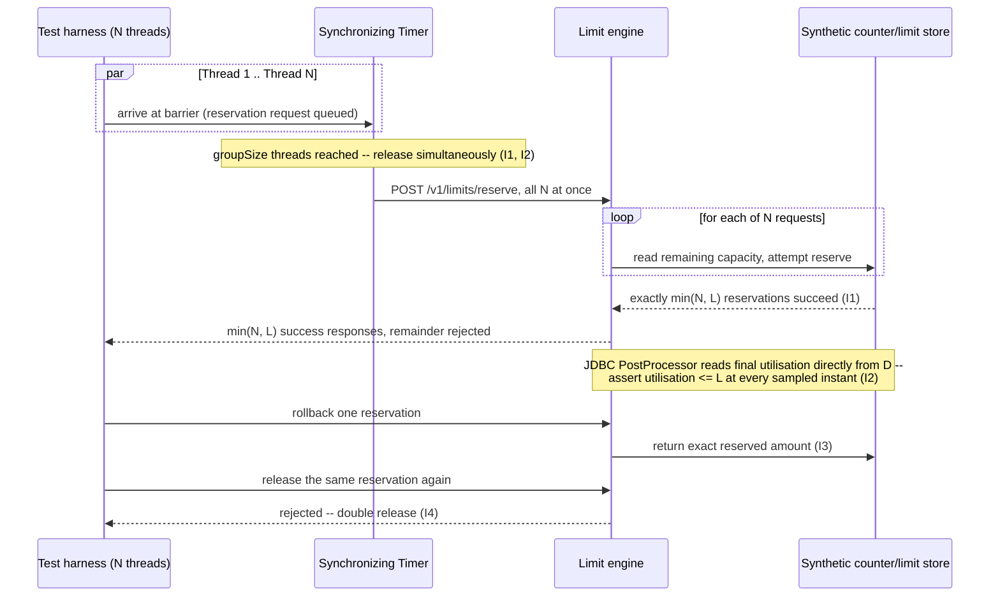

# Concurrent Limit & Counter Contention

Status: Approved | Last Reviewed: 2026-08-12 | Owner: @qe-lead
Catalog ID: TST-023 | Radii
Tier Applicability: T0, T1

## 1. Applies To

| Catalog ID | Title | Document |
|---|---|---|
| BSP-011 | Credit Limit Engine | [../../patterns/banking-solutions/credit-limit-engine.md](../../patterns/banking-solutions/credit-limit-engine.md) |
| BSP-012 | Transaction Limit Engine | [../../patterns/banking-solutions/transaction-limit-engine.md](../../patterns/banking-solutions/transaction-limit-engine.md) |
| BSP-013 | Collateral Management Engine | [../../patterns/banking-solutions/collateral-management-engine.md](../../patterns/banking-solutions/collateral-management-engine.md) |

These three rows share one archetype because they share one method of verification — driving
true, simultaneous concurrency against a declared numeric limit or counter and asserting the
invariants in §3 — not because they share a business domain. A credit limit, a per-transaction
limit, and a collateral haircut ceiling are each enforced by a different business rule, but every
one of them fails the same way under contention: two or more requests read the same
remaining-capacity value before either request's own update becomes visible to the other, so the
limit is oversubscribed. The method of verification is identical across all three; only the
business meaning of "the limit" changes.

## 2. Failure Taxonomy

- Oversubscription under concurrency: two or more requests read the same remaining-capacity
  value at the same instant and both succeed, so total utilisation exceeds the declared limit.
- Lost update on a read-modify-write: a concurrent write to the same counter overwrites another
  in-flight write, silently discarding one of the two updates instead of applying both.
- Double release on rollback: a reservation is released twice — once by a genuine rollback and
  once by a retry or duplicate compensating action — returning capacity that was never actually
  still held.
- Reservation leak: a reservation is placed but never released or expired, leaving that capacity
  permanently unusable even though no in-flight transaction still holds it.
- Wrong-timezone counter reset: the counter's periodic window boundary is evaluated in the wrong
  timezone, so the counter resets early or late relative to the declared business day.
- Pessimistic-lock latency cliff: request latency degrades sharply rather than gracefully once
  lock contention on the shared counter passes a concurrency threshold.
- Deadlock between two limit checks taken in different orders: two transactions each acquire
  locks on two limits — for example a credit limit and a collateral limit — in opposite order,
  producing a deadlock instead of either transaction failing cleanly.

## 3. Functional Test Design

**Oracle:** `invariant-assertion`, per
[TST-001 § The Four Oracles](../strategy/test-strategy-standard.md#the-four-oracles).

### Invariants

| # | Invariant | Assertion |
|---|---|---|
| I1 | Given N concurrent requests against a limit of L, exactly `min(N, L)` succeed | `assert success_count == min(N, L)` after releasing N threads simultaneously against a synthetic limit `L` |
| I2 | Observed utilisation never exceeds the limit at any instant | `assert max(utilisation_sample) <= L` over a continuous sample of utilisation taken throughout the concurrent run, never only at start and end |
| I3 | A rolled-back reservation returns exactly its own amount | `assert available_after_rollback == available_before_reservation` for precisely the amount that reservation held — no more, no less |
| I4 | A double release is rejected | `assert second_release.status == rejected` when the same reservation ID is released a second time |
| I5 | The counter window boundary uses the declared timezone | `assert counter_reset_instant == window_boundary_in_declared_tz`, checked at an instant on each side of the boundary as expressed in the declared timezone, never the host or UTC default |
| I6 | No reservation outlives its declared TTL | `assert reservation.expired_at <= reservation.created_at + declared_ttl`, verified by holding a reservation open past its TTL and asserting it is released with no further caller action |

### Equivalence classes and boundaries

- N < L — no contention; every request must succeed (I1).
- N == L exactly — the limit's own boundary; every request must succeed and utilisation must
  land exactly on `L`, never be treated as "over" merely for reaching it (I1, I2).
- N > L — the oversubscription attempt; exactly `L` requests succeed and the remaining `N - L`
  are rejected, never merely delayed until they too succeed (I1, I2).
- Reservation TTL boundary: a reservation checked one unit of time before its declared TTL
  expires (must still be honoured) and one unit after (must be treated as released) (I6).
- Timezone boundary: an instant exactly at the counter window boundary expressed in the declared
  timezone, exercised on both sides of that instant (I5).
- Rollback boundary: a rollback issued immediately after a reservation is created versus after
  the reservation has been partially consumed by a subsequent update (I3).

### Negative paths

- A release request naming a reservation ID that does not exist must be rejected explicitly,
  never treated as a silent no-op success.
- A release request naming a reservation ID that has already been released — the double-release
  case — must be rejected (I4's negative path).
- A reservation request arriving after the counter window has already rolled over must be
  evaluated against the new window's capacity, never against the stale, already-closed window.
- A rollback request for an amount that does not match any of the caller's own open reservations
  must be rejected, never silently accepted at face value.

## 4. Performance Test Design

| Profile | Applies | Why | Threshold source |
|---|---|---|---|
| `baseline` | yes | Confirms the limit-check and reservation path itself has not regressed before any load-shaped run | [NFR-002](../../nfr/latency-budget-model.md) |
| `load` | yes | Proves the counter/reservation store holds steady-state throughput under normal traffic without itself becoming the bottleneck | [NFR-004](../../nfr/throughput-model.md) |
| `stress` | yes | Locates the point at which lock contention on the shared counter degrades — this archetype exists specifically to surface the oversubscription and latency-cliff pathologies in the Failure Taxonomy that only appear near saturation | [NFR-003](../../nfr/capacity-planning-model.md) |
| `spike` | yes | A burst of near-simultaneous limit checks — many callers hitting the same limit within one settlement or trading window — is this archetype's realistic, not merely edge-case, trigger | [NFR-004](../../nfr/throughput-model.md) |

**Workload model:** `open` is **mandatory, not merely preferred, for the `stress` profile** —
per [TST-003 § The Rule](../strategy/workload-modelling.md#open-versus-closed-workload-models),
which also binds `spike` to an open model. A closed workload model runs a fixed population of
virtual users, each of which waits for its own response before issuing the next request; as
latency rises under contention, each virtual user completes fewer cycles per unit time, so the
harness's own offered concurrency falls automatically. That self-throttling is not a conservative
approximation of this archetype's `stress` result — **it completely hides the oversubscription
pathology this archetype exists to catch.** The whole point of `stress` here is to push enough
truly simultaneous requests at the limit that I1 (`exactly min(N, L) succeed`) and I2
(`utilisation never exceeds the limit`) are put under genuine pressure; a closed model backs off
its own arrival rate at precisely the moment contention would otherwise expose a lost update or a
lock-contention latency cliff, so a closed-model `stress` run against this archetype can report a
clean pass while the oversubscription defect it exists to find remains completely undetected.
Use the **Concurrency Thread Group** for `stress`, and either the Concurrency Thread Group or the
Arrivals Thread Group for `spike`, per
[TST-020 §5](./idempotency-replay.md#5-canonical-harness--jmeter)'s handling of the same open-model
rule.

## 5. Canonical Harness — JMeter

```xml
<!-- Thread Group: OPEN model via Concurrency Thread Group -- mandatory for `stress`, per §4
     and TST-003. `baseline` and `load` may use the standard closed Thread Group. -->
<kg.apc.jmeter.threads.concurrency.ConcurrencyThreadGroup testname="tg-concurrent-limit-contention (OPEN model)">
  <stringProp name="TargetLevel">${__P(concurrent_requests,50)}</stringProp>
  <stringProp name="RampUp">${__P(rampup,1)}</stringProp>
  <stringProp name="Steps">1</stringProp>
  <stringProp name="Hold">${__P(duration,300)}</stringProp>
</kg.apc.jmeter.threads.concurrency.ConcurrencyThreadGroup>

<CounterConfig testname="Counter -- cycles synthetic account IDs (SYNTHETIC, no real accounts)">
  <stringProp name="CounterConfig.start">1</stringProp>
  <stringProp name="CounterConfig.end">${__P(synthetic_account_pool_size,20)}</stringProp>
  <stringProp name="CounterConfig.incr">1</stringProp>
  <stringProp name="CounterConfig.name">synthetic_account_id</stringProp>
  <boolProp name="CounterConfig.per_user">false</boolProp>
</CounterConfig>

<SyncTimer testname="Synchronizing Timer -- release N threads simultaneously against limit L (I1, I2)">
  <stringProp name="groupSize">${__P(concurrent_requests,50)}</stringProp>
  <stringProp name="timeoutInMs">${__P(sync_timeout_ms,10000)}</stringProp>
</SyncTimer>

<HTTPSamplerProxy testname="POST /v1/limits/reserve (synthetic account ${synthetic_account_id})">
  <stringProp name="HTTPSampler.path">/v1/limits/reserve</stringProp>
  <stringProp name="HTTPSampler.method">POST</stringProp>
</HTTPSamplerProxy>

<JDBCDataSource testname="limit-synth-pool (SYNTHETIC schema, no production data)">
  <stringProp name="dataSource">limit_synth</stringProp>
  <stringProp name="dbUrl">${__P(jdbc_url,jdbc:postgresql://limit-perf.internal.example:5432/limit_synth)}</stringProp>
  <stringProp name="driver">${__P(jdbc_driver,org.postgresql.Driver)}</stringProp>
  <stringProp name="poolMax">${__P(jdbc_pool_max,20)}</stringProp>
</JDBCDataSource>

<JDBCPostProcessor testname="JDBC PostProcessor -- read final synthetic utilisation after the release (I2)">
  <stringProp name="dataSource">limit_synth</stringProp>
  <stringProp name="query">
    SELECT utilisation, declared_limit FROM limit_synth.account_limit WHERE account_id = ?
  </stringProp>
  <stringProp name="queryArguments">${synthetic_account_id}</stringProp>
  <stringProp name="queryArgumentsTypes">VARCHAR</stringProp>
  <stringProp name="variableNames">final_utilisation,declared_limit</stringProp>
</JDBCPostProcessor>

<JSR223Assertion testname="assert final utilisation never exceeded the limit (I2)">
  <stringProp name="script"><![CDATA[
    // I2: observed utilisation must never exceed the declared limit, at the instant read
    // here or at any of the continuously sampled instants this run also records.
    double utilisation = Double.parseDouble(vars.get("final_utilisation"));
    double limit = Double.parseDouble(vars.get("declared_limit"));
    if (utilisation > limit) {
        AssertionResult.setFailure(true);
        AssertionResult.setFailureMessage(
            "I2 violated: utilisation=" + utilisation + " exceeds limit=" + limit
        );
    }
  ]]></stringProp>
</JSR223Assertion>
```

```bash
jmeter -n -t concurrent-limit-contention.jmx \
  -Jconcurrent_requests="${JMETER_CONCURRENT_REQUESTS}" -Jrampup="${JMETER_RAMPUP}" \
  -Jduration="${JMETER_DURATION}" -Jprofile="${JMETER_PROFILE}" \
  -Jsynthetic_account_pool_size=20 \
  -l results.jtl -e -o report/
```

The **Synchronizing Timer** is the load-bearing element, exactly as it is in
[TST-020](./idempotency-replay.md#5-canonical-harness--jmeter): it holds every thread in its
group at a barrier until `groupSize` threads have arrived, then releases all of them together.
That barrier is the only clean way to put genuinely simultaneous pressure on the same limit — a
`sleep`-based approximation cannot guarantee true simultaneity, and true simultaneity is exactly
what I1 and I2 require to be meaningfully tested. The **Counter** config element cycles a bounded
pool of synthetic account IDs across iterations, so the same limit is contended by many threads
rather than each thread quietly reserving against its own private account and never actually
racing anyone. The **JDBC PostProcessor** runs after the reservation call completes and reads the
synthetic ledger's own `utilisation` and `declared_limit` columns directly from the system of
record — not from the HTTP response body — so I2 is checked against the actual persisted state,
which is the only place a lost update or a double release would ever become visible.

## 6. Tool Fit

| Tool | Fit | When to prefer |
|---|---|---|
| JMeter | BEST | The Synchronizing Timer is the cleanest true-simultaneity primitive in this corpus: it is the only element that gives a hard barrier guaranteeing `groupSize` threads are released at the same instant, which I1 and I2 both depend on |
| Gatling + Karate | good | Gatling's pause/throttle DSL can approximate near-simultaneous release and Karate can script a duplicate reservation call, but neither gives JMeter's group-barrier guarantee of true simultaneity |
| k6 | good | Scripted iterations across VUs can issue many reservation calls within a tight window, but k6 has no built-in barrier primitive equivalent to a Synchronizing Timer |
| Locust | fair | Locust's task scheduling is per-user and gevent-cooperative; it is not designed to guarantee lock-step release of many users at the same instant |

Every coverage row for the three catalog entries in §1 records `primary_tool: jmeter` for the
reason stated above and demonstrated in §5.

## 7. Overlays

### Resilience overlay

Inject a `resource-exhaustion` fault (see
[TST-006 § Fault Class Taxonomy](../strategy/resilience-test-standard.md#fault-class-taxonomy))
against the counter's own lock or connection pool while the Synchronizing Timer releases its
next group, to force the pessimistic-lock latency cliff and the cross-order deadlock the Failure
Taxonomy names directly, rather than waiting for organic contention to produce them. Assert that
latency degrades and, where the limit engine's own contract declares a deadlock-retry policy,
that a deadlocked transaction is retried or fails cleanly — never left holding a reservation that
neither commits nor rolls back. This is the same fault class TST-006 uses for CPU, memory, and
connection-pool saturation, applied here specifically to the lock or connection resource the
limit check itself contends on.

Contract, security, and data-quality overlays are omitted: this archetype's failure modes are
about concurrent contention on a shared numeric limit, not schema compatibility, access control,
or data-quality reconciliation, so none of those three overlays apply.

## 8. Test Data Requirements

Synthetic only, per [TST-004](../strategy/test-data-management.md). Entities needed: a bounded
pool of synthetic account IDs — cycled by the Counter element in §5 — each carrying its own
declared limit and starting utilisation; a set of synthetic reservation records exercising every
boundary in §3 (open, rolled back, released, expired past TTL, double-released). The cardinality
driver is concurrency, not data volume: the account pool must be small enough, relative to the
Synchronizing Timer's `groupSize`, that many threads genuinely contend for the same account's
limit rather than each thread quietly reserving against its own uncontended account — a pool
sized to the peak thread count would silently turn this archetype's contention test into N
independent, uncontended reservation tests. Referential-integrity requirement: every synthetic
reservation must resolve against a synthetic account that exists in the same seed, per
[TST-004 § Seeding and Reproducibility](../strategy/test-data-management.md#seeding-and-reproducibility).
Teardown: purge every synthetic reservation and reset each synthetic account's utilisation to its
seeded starting value at environment reset, per
[TST-005](../strategy/environments-quality-gates.md).

## 9. Evidence and Observability

Metrics to capture: success count against `min(N, L)` for every concurrent release (I1); the full
utilisation time series sampled continuously through the run, not only its final value, so I2 can
be checked at every instant rather than only at the end; reservation-store size over the run,
which must not grow unbounded (a reservation leak surfacing as a slow, monotonic climb); count of
double-release attempts rejected (I4); count of TTL-expired reservations actually released without
caller action (I6). Trace assertions: a rolled-back reservation's trace must show the exact
reserved amount returned to available capacity, not an approximation, so I3 is checked against
the trace as well as the store's own state. Artifacts to attach to a DAB submission: the JMeter
aggregate report and HTML dashboard (per
[TST-005](../strategy/environments-quality-gates.md)); the utilisation time series plotted against
the declared limit for the full run duration; and the fault-injection log from the Resilience
overlay, timestamped for when the `resource-exhaustion` fault was introduced and removed.

## 10. Exit Criteria

The block below is illustrative for a synthetic service implementing this archetype's patterns —
every value is an example, not a normative one, per
[TST-001](../strategy/test-strategy-standard.md).

```yaml
test_acceptance_criteria:
  service_name: synthetic-credit-limit-engine
  archetypes: [TST-023]
  catalog_refs: [BSP-011, BSP-012]
  functional:
    invariants_covered: 6                 # I1-I6, all six are assertable
    negative_paths_covered: 4
    oracle: invariant-assertion
  performance:
    profiles_executed: [baseline, load, stress, spike]
    workload_model: open                  # mandatory for stress and spike; see §4 above
  resilience:
    fault_scenarios: [FM21]               # this service's own resource-exhaustion entry
```

## Compliance Mapping

| Layer | Reference | Section/Control | How this satisfies |
|---|---|---|---|
| Ring 0 | ACID isolation levels; optimistic versus pessimistic concurrency control | Correct behaviour under concurrent read-modify-write access to a shared counter or limit | I1-I4 are the assertable form of correct concurrency control: exactly `min(N, L)` succeed, utilisation never exceeds the limit, a rollback returns exactly its own amount, and a double release is rejected — whichever isolation level or locking strategy the engine chooses, these are the outcomes it must produce |
| Ring 1 | BCBS 239 — Principle 3 (Accuracy and Integrity) | Risk and financial data — including limit utilisation — must be accurate and reconcilable | I2's continuous utilisation-never-exceeds-limit assertion is the accuracy evidence Principle 3 requires for a credit, transaction, or collateral limit: the reported utilisation must never silently drift past the declared ceiling |
| Ring 2 | SBV Circular 09/2020 §IV.2 ⚠️ (working summary — pending Legal review) | Transaction-limit enforcement obligations for domestic financial systems | This archetype's oversubscription and lost-update invariants (I1, I2) are the technical control most directly responsible for the transaction-limit engine actually enforcing the ceiling the obligation requires, under real concurrent load rather than only in a single-threaded check |

## 12. Related Patterns

- [BSP-011 Credit Limit Engine](../../patterns/banking-solutions/credit-limit-engine.md)
- [BSP-012 Transaction Limit Engine](../../patterns/banking-solutions/transaction-limit-engine.md)
- [BSP-013 Collateral Management Engine](../../patterns/banking-solutions/collateral-management-engine.md)

## 13. Related Archetypes

- [TST-020 Idempotency & Replay Safety](./idempotency-replay.md) — supplies the Synchronizing
  Timer technique this archetype reuses in §5 to achieve true simultaneity; TST-020 uses the same
  barrier to release two identical replay requests together, this archetype uses it to release N
  competing reservation requests together.
- TST-031 — Rate Limit, Throttle & Breakpoint (not yet published): reuses the true-simultaneity
  load pattern this archetype establishes in §5 — the Synchronizing Timer paired with a
  Concurrency Thread Group under an open model — for rate-limit breakpoint discovery rather than
  restating it.

## 14. Diagram


