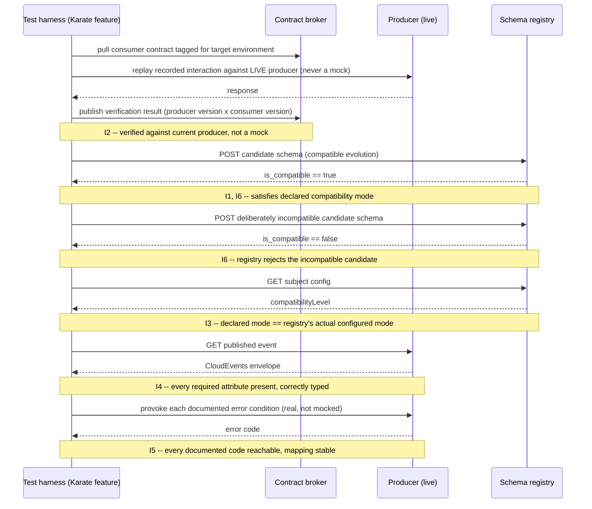

# Contract and Schema Compatibility

Status: Approved | Last Reviewed: 2026-08-12 | Owner: @qe-lead
Catalog ID: TST-030 | Radii
Tier Applicability: T0, T1, T2

## 1. Applies To

| Catalog ID | Title | Document |
|---|---|---|
| INT-015 | API Contract Testing | [../../patterns/integration/api-contract-testing.md](../../patterns/integration/api-contract-testing.md) |
| INT-010 | AsyncAPI Specification Standard | [../../patterns/integration/asyncapi-specification.md](../../patterns/integration/asyncapi-specification.md) |
| INT-011 | CloudEvents Envelope Standard | [../../patterns/integration/cloudevents-envelope.md](../../patterns/integration/cloudevents-envelope.md) |
| INT-013 | Schema Registry Governance | [../../patterns/integration/schema-registry-governance.md](../../patterns/integration/schema-registry-governance.md) |
| INT-003 | API Gateway Routing | [../../patterns/integration/api-gateway-routing.md](../../patterns/integration/api-gateway-routing.md) |

These five rows share one archetype because every one of them is a place where a producer and a
consumer agree on a shape — a REST payload, an AsyncAPI channel message, a CloudEvents envelope, a
registered Avro/Protobuf schema, or the effective contract a gateway route exposes — and the only
way to prove that agreement still holds is to verify a candidate change against a declared
compatibility rule, not merely against today's snapshot of the shape. INT-015 API Contract Testing
is the REST/HTTP instance of consumer-driven verification. INT-010 AsyncAPI Specification Standard
and INT-011 CloudEvents Envelope Standard are the same verification question applied to
event-carried messages instead of request/response payloads — a channel definition and an envelope
are both contracts a consumer depends on exactly as much as an OpenAPI document is. INT-013 Schema
Registry Governance owns the mechanism that enforces a compatibility mode at registration time; this
archetype owns the test proving that mechanism's guarantee is real rather than configured-but-
unverified. INT-003 API Gateway Routing belongs here for a subtler reason: a gateway route rewrite,
header injection, or path-mapping change silently changes the *effective* contract a consumer
actually receives even when neither the producer's OpenAPI document nor the consumer's Pact contract
changed at all — the gateway is a contract-mutation point most teams never think to test as one.

**Consumed interfaces.** This archetype does not restate the compatibility-mode vocabulary or the
consumer-driven contract method — both are owned by
[TST-007 Contract and Integration Test Standard](../strategy/contract-integration-test-standard.md)
and cross-linked wherever they are used below, in particular the
[Schema Compatibility Modes](../strategy/contract-integration-test-standard.md#schema-compatibility-modes)
table (`BACKWARD`/`FORWARD`/`FULL`/`NONE`) and the
[Consumer-Driven Contract Method](../strategy/contract-integration-test-standard.md#consumer-driven-contract-method)
(broker publication, provider verification, `can-i-deploy`). This archetype also consumes
[TST-012 Gatling + Karate Guide](../tooling/gatling-karate.md)'s `karate-gatling` bridge: the
`.feature` file that already exists as this archetype's contract suite is reused **unchanged** as
the harness's own performance scenario — see §5 and §6.

## 2. Failure Taxonomy

- A producer adds a required field and breaks consumers under `BACKWARD`.
- Compatibility mode set to `NONE` and nobody noticing.
- Consumer tests passing against a stale mock rather than the real producer.
- CloudEvents required attributes missing so routing fails.
- An error contract changed without a version bump.
- A gateway route change silently altering the effective contract.

## 3. Functional Test Design

**Oracle:** `contract-schema`, per
[TST-001 § The Four Oracles](../strategy/test-strategy-standard.md#the-four-oracles). Every
invariant below is graded against a published schema, channel definition, envelope specification,
or registry-configured compatibility rule — never against a hand-maintained mock's own idea of what
the contract should look like.

### Invariants

| # | Invariant | Assertion |
|---|---|---|
| I1 | Every registered schema version satisfies its declared compatibility mode against its predecessor | Run the round-trip check for the subject's declared `schema_compat_mode` from [TST-007's table](../strategy/contract-integration-test-standard.md#schema-compatibility-modes): `assert deserialize(serialize(sample, version_n), version_n_minus_1)` succeeds with no data loss for `BACKWARD`, and the symmetric direction for `FORWARD`; both directions for `FULL` |
| I2 | Every consumer contract verifies against the CURRENT producer, not a mock | `assert contract_verification.producer_instance == "live"` and `assert contract_verification.producer_version == current_deployed_producer_version()`, queried from the contract broker's `can-i-deploy` record, never from a locally stubbed counterparty |
| I3 | The declared compatibility mode equals the registry's ACTUAL configured mode | `assert declared_schema_compat_mode == schema_registry.get_config(subject).compatibilityLevel` for every subject in scope |
| I4 | Every CloudEvents required attribute is present and correctly typed | `assert all(attr in envelope and isinstance(envelope[attr], declared_type[attr]) for attr in {"id", "source", "type", "specversion"})`, plus `data_content_type` when the channel declares one |
| I5 | Every documented error code is reachable and its mapping is stable | `assert error_code in {codes provoked by a real producer condition, not a mocked one}` for every code in [INT-012's error catalogue](../../patterns/integration/error-code-mapping.md), and `assert mapping(error_code) == previous_run.mapping(error_code)` across two consecutive contract-suite runs |
| I6 | A deliberately incompatible candidate schema is rejected by the registry | `assert schema_registry.register(deliberately_incompatible_candidate) raises RegistrationRejected` |

### Equivalence classes and boundaries

- A new schema version that is a pure additive, optional-field change under `BACKWARD` — the
  canonical compatible-evolution path (I1).
- A new schema version that adds a required field with no default under `BACKWARD` — the exact
  boundary the Failure Taxonomy names first, and the negative case I1 and I6 both exist to catch.
- A subject whose `schema_compat_mode` has never been explicitly declared, which TST-007 treats as
  `NONE` for test-obligation purposes until fixed — the boundary between "declared `NONE`" and
  "never declared," both of which carry the same test obligation (I3).
- A consumer contract verified against a broker-replayed interaction where the recorded producer
  version equals the exact currently-deployed version — the canonical verified path (I2).
- A consumer contract "verified" against a hand-maintained stub that has drifted from the real
  producer's current behaviour — the boundary I2 exists to catch, and the Failure Taxonomy's stale-
  mock entry made concrete.
- A CloudEvents envelope carrying every required attribute at the correct declared type — the
  canonical conformant envelope (I4).
- A CloudEvents envelope missing exactly one required attribute (for example, no `id`) — the
  boundary for the missing-attribute case (I4).
- A CloudEvents envelope where every required attribute is present but one carries the wrong type
  (for example, `time` as an integer rather than an RFC 3339 string) — the subtler type-boundary
  case I4 exists to catch, distinct from a simple missing field.
- An error code that maps one-to-one to a condition a test can actually provoke against the real
  producer — the canonical reachable path (I5).
- An error code that is documented but has never been provoked by any test, only asserted against a
  mock's canned response — the coverage gap I5 exists to catch.
- A candidate schema that violates its subject's declared compatibility mode, submitted for
  registration — the canonical rejection path (I6).
- A candidate schema that is genuinely compatible with its declared mode, submitted for
  registration — the boundary proving I6's check rejects real incompatibilities without also
  rejecting valid, compatible evolution (a false-positive check on the same mechanism).

### Negative paths

- Any registered schema version found not to satisfy its declared compatibility mode against its
  predecessor is a defect regardless of whether the registry's own gate should have blocked it —
  I1 does not trust that the registry did its job; it re-proves the guarantee independently
  (I1's negative path).
- A consumer-contract verification result recorded against a mock or stub, rather than the live
  producer, is never counted as "verified" for `can-i-deploy` purposes — the deploy gate must fail
  closed rather than accept a stale-mock result as evidence (I2's negative path).
- A `schema_compat_mode` declared in a service's own documentation or contract-suite configuration
  that does not match the registry's actual subject-level configured mode is flagged as a
  documentation-drift defect immediately — it is not necessary to wait for an incompatible schema
  to actually be submitted before this counts as a failure (I3's negative path).
- A CloudEvents envelope missing a required attribute, or carrying one at the wrong type, is
  rejected by the contract test outright; it is never silently coerced, defaulted, or passed
  through to the routing layer regardless (I4's negative path).
- An error code with no test that provokes the real producer condition behind it is a coverage gap
  and fails this archetype's exit criteria — "it's documented" is not evidence that the mapping is
  correct or stable (I5's negative path).
- A deliberately incompatible candidate schema that the registry accepts — silently or otherwise —
  is this archetype's own worst-case failure: it is the compatibility-mode-set-to-`NONE`-and-nobody-
  noticing failure class from §2, made concrete and mechanically detectable rather than discovered
  in production (I6's negative path).

## 4. Performance Test Design

| Profile | Applies | Why | Threshold source |
|---|---|---|---|
| `baseline` | yes | Confirms the contract-suite invariants in §3 have not regressed before any load-shaped run; the same Karate feature file that proves this on every merge is reused unchanged here, per §5 | [NFR-002](../../nfr/latency-budget-model.md) |

**`baseline` is the only profile this archetype runs, and that is deliberate, not an omission.**
This is a functional and contract archetype: its invariants (I1–I6) are pass/fail conformance and
compatibility checks, not throughput or capacity questions, so `load`, `stress`, `spike`, `soak`,
`mixed`, `scalability`, and `failover-under-load` have nothing to prove here that `baseline` does
not already prove. Schema-registry-lookup latency sitting on a hot request path is a real
performance concern, but it is asserted inside the **owning service's own** `load` (or heavier)
profile run, under that service's own performance archetype — duplicating it here would mean the
same registry-lookup latency number gets asserted twice, against two different threshold sources,
which is worse than asserting it once in the place that actually owns the call path. Record
`perf_profiles: [baseline]` for exactly this reason — padding this list with additional profiles
"because other archetypes have more" would misrepresent what this archetype is actually testing.

**Workload model:** `open` — `baseline` here runs via
[TST-012](../tooling/gatling-karate.md)'s own `injectOpen("baseline")` idiom
(`constantUsersPerSec(1).during(60.seconds)`, per
[Parameterisation and Correlation](../tooling/gatling-karate.md#parameterisation-and-correlation)),
which standardises every profile on the open model as this harness's default rather than a closed
Thread Group population; per [TST-003](../strategy/workload-modelling.md), `baseline` may run under
either model, and the open model is the one this archetype's own primary harness already uses.

## 5. Canonical Harness — JMeter

```xml
<!-- JSR223 Sampler calling the schema registry's compatibility-check endpoint directly,
     asserting I3 and I6 without reusing the contract suite as a separate artifact. -->
<JSR223Sampler testname="POST /compatibility/subjects/{subject}/versions/latest (I3, I6)">
  <stringProp name="script"><![CDATA[
    def response = new URL("${__P(registry_url,http://schema-registry-perf.internal.example)}"
        + "/compatibility/subjects/${vars.get('subject')}/versions/latest")
        .openConnection();
    response.setRequestMethod("POST");
    response.setDoOutput(true);
    response.setRequestProperty("Content-Type", "application/json");
    response.getOutputStream().write(vars.get("candidate_schema").getBytes("UTF-8"));
    vars.put("registry_response_code", String.valueOf(response.getResponseCode()));
  ]]></stringProp>
</JSR223Sampler>

<!-- JSON Assertion (plugin -- no core JSON Schema draft support) validates a CloudEvents
     envelope's required attributes are present (I4). Type-correctness still needs a second,
     hand-written JSR223 Assertion beside this one -- JMeter has no native envelope-aware check. -->
<JSONPathAssertion testname="assert CloudEvents envelope has required attributes (I4)">
  <stringProp name="JSON_PATH">$.id</stringProp>
  <boolProp name="JSONVALIDATION">true</boolProp>
</JSONPathAssertion>
```

```bash
jmeter -n -t contract-schema-compatibility.jmx \
  -Jregistry_url="http://schema-registry-perf.internal.example" \
  -Jsubject="${SUBJECT}" -Jprofile="${JMETER_PROFILE}" \
  -l results.jtl -e -o report/
```

JMeter is rated only `fair` in §6 because this is as far as a native JMX plan gets: there is no
core JSON Schema Draft assertion, so envelope-attribute *type* checking (as opposed to presence)
needs a second, hand-authored JSR223 Assertion, and — the larger problem — none of this reuses the
contract suite that already exists for these five catalog rows. A JMeter plan built this way is a
second, independently maintained artifact that drifts from the real Karate contract suite the
moment either one changes, which is precisely the "one artifact serves both disciplines" value
proposition this archetype exists to realise instead.

The actual canonical harness is the Karate `.feature` file each of these five catalog rows already
maintains as its contract-tested suite under [TST-007](../strategy/contract-integration-test-standard.md),
reused **unchanged** as the Gatling scenario via `karate-gatling`, per
[TST-012 § Version and Installation](../tooling/gatling-karate.md#version-and-installation):

```gherkin
Feature: synthetic order-created event contract (functional and performance)

Background:
  * url baseUrl
  * def registryUrl = registryBaseUrl

Scenario: candidate schema satisfies its declared BACKWARD compatibility mode (I1, I6)
  Given path '/compatibility/subjects/order-created-value/versions/latest'
  And request read('classpath:schemas/order-created.v3.synthetic.avsc')
  When method post
  Then status 200
  And match response.is_compatible == true

Scenario: deliberately incompatible candidate schema is rejected (I6)
  Given path '/compatibility/subjects/order-created-value/versions/latest'
  And request read('classpath:schemas/order-created.v3-incompatible.synthetic.avsc')
  When method post
  Then status 200
  And match response.is_compatible == false

Scenario: published event envelope carries every required CloudEvents attribute (I4)
  Given path '/v1/orders/synthetic-0001'
  When method get
  Then status 200
  And match response.envelope contains { id: '#string', source: '#string', type: '#string', specversion: '#string' }
```

Run functionally, independent of Gatling, on every merge:

```bash
mvn test -Dtest=KarateRunner -Dkarate.options="classpath:features/contract/order-created.feature"
```

The same file, reused unchanged, as the `baseline` performance scenario:

```scala
import io.gatling.core.Predef._
import com.intuit.karate.gatling.Predef._
import support.Injection.injectOpen

class ContractSchemaCompatibilitySimulation extends Simulation {

  val protocol = karateProtocol()

  val contractSuite = scenario("contract-schema-compatibility-baseline")
    .exec(karateFeature("classpath:features/contract/order-created.feature"))

  setUp(
    contractSuite.inject(injectOpen("baseline")).protocols(protocol)
  ).assertions(
    global.successfulRequests.percent.is(100)
  )
}
```

```bash
PROFILE=baseline BASE_URL=https://api-perf.internal.example \
  mvn -q gatling:test -Dgatling.simulationClass=ContractSchemaCompatibilitySimulation
```

There is exactly one artifact here, not two: the same `.feature` file that runs on every merge as
the contract suite is the load-generating unit `karate-gatling` calls under `baseline`. Karate's own
`match` assertions (I1, I4, I6 above) run identically whichever runner invokes them; Gatling's
`assertions(...)` block adds only the run-level pass/fail wrapper `baseline` needs, per
[TST-012 § Assertions and Thresholds](../tooling/gatling-karate.md#assertions-and-thresholds).

## 6. Tool Fit

| Tool | Fit | When to prefer |
|---|---|---|
| Gatling + Karate | BEST | Karate is a contract-testing tool first — its `.feature` files already are this archetype's I1–I6 assertions — and `karate-gatling` runs that same file, unchanged, as the `baseline` performance scenario; no other tool in this corpus lets the contract suite and the performance scenario be the literal same artifact |
| k6 | good | k6 can call a schema registry's REST compatibility endpoint and script an envelope-attribute check in JavaScript, but the check must be hand-written independently of whatever contract suite already exists, so it is a second artifact rather than a reused one |
| JMeter | fair | No core JSON Schema Draft assertion and no way to reuse the Karate contract suite; a JMX plan built for this archetype (§5) is a second, independently maintained artifact that drifts the moment the real contract suite changes |
| Locust | fair | Locust can script the same registry-endpoint call and envelope check in Python, but like JMeter it authors a second artifact rather than reusing the one that already exists as the contract suite |

Record `primary_tool: gatling-karate` for all five coverage rows in §1, with the justification
above: the single artifact serving both the functional contract obligation and this archetype's
sole `baseline` performance profile is *why* this archetype's primary tool is the one exception to
this corpus's JMeter default, not an arbitrary substitution.

## 7. Overlays

### Contract overlay

There is no separate Contract overlay subsection to write here beyond a cross-link, because contract
verification **is** the body of this document — §3's oracle, invariants, and negative paths are
themselves the contract overlay every other archetype in this corpus cross-links into rather than
restates. Where another archetype's Contract overlay asks "does the message this step just produced
conform to its declared schema right now" (conformance, for one message, in one run — see
[message-transformation-routing.md §7](./message-transformation-routing.md#7-overlays) for the exact
conformance/compatibility distinction), this archetype asks "does a new schema, contract, or route
version still satisfy what an existing consumer already depends on" (compatibility, across
versions). The compatibility-mode vocabulary and the consumer-driven contract method both live in
[TST-007](../strategy/contract-integration-test-standard.md) and are cross-linked, not restated,
throughout §1 and §3.

Resilience, security, and data-quality overlays are omitted entirely: this archetype's failure
modes are about contract and schema compatibility across versions, not fault tolerance under a
degraded dependency, access control, or data-quality reconciliation, so none of the three overlays
apply — a compatibility break is a correctness defect this archetype's oracle already grades in §3,
not a fault-injection, authorization, or reconciliation concern any of the other three overlays
would add anything to.

## 8. Test Data Requirements

Synthetic only, per [TST-004](../strategy/test-data-management.md). Entities needed: a synthetic
schema evolution pair for each subject in scope — a prior registered version and a candidate next
version — covering both a genuinely compatible change and a deliberately incompatible one under
that subject's declared `schema_compat_mode`; a synthetic CloudEvents envelope fixture with every
required attribute present and correctly typed, plus at least one deliberately malformed variant
(one missing attribute, one wrong-typed attribute); a synthetic error-provoking request per
documented error code in [INT-012's catalogue](../../patterns/integration/error-code-mapping.md),
sufficient to provoke the real condition rather than a mocked response. The cardinality driver is
the boundary matrix in §3, not load volume: every equivalence class and boundary listed there must
appear at least once, independent of how many virtual users `baseline` drives. Referential-integrity
requirement: every candidate schema and envelope fixture is tagged with the subject or channel name
it belongs to, so a compatibility-check result is traceable back to the exact subject version pair
it was run against. Teardown: deregister every synthetic candidate schema version registered during
a test run, and purge every synthetic envelope fixture, at environment reset, per
[TST-005](../strategy/environments-quality-gates.md).

## 9. Evidence and Observability

Metrics to capture: count of schema-registration attempts against count of rejections, broken out
by whether the candidate was deliberately compatible or deliberately incompatible (I1, I6); count of
consumer-contract verifications recorded against the live producer versus any recorded against a
stub, which must be zero for the latter (I2); count of declared-versus-actual `schema_compat_mode`
mismatches, which must be zero (I3); count of documented error codes with at least one passing,
real-condition-provoking test, against the total documented count (I5). Trace assertions: a
contract-verification run's trace must show the exact producer instance and version identifier the
verification ran against, so I2 is auditable after the fact rather than merely asserted at run time.
Artifacts to attach to a DAB submission: the Gatling HTML report for the `baseline` run, per
[TST-005](../strategy/environments-quality-gates.md); the schema registry's own compatibility-check
response log for every candidate schema submitted during the run; and the `can-i-deploy` query
result used to evidence I2 for the consumer-contract verifications exercised.

## 10. Exit Criteria

The block below is illustrative for a synthetic service implementing this archetype's patterns —
every value is an example, not a normative one, per
[TST-001](../strategy/test-strategy-standard.md).

```yaml
test_acceptance_criteria:
  service_name: synthetic-order-events
  archetypes: [TST-030]
  catalog_refs: [INT-015, INT-010, INT-011, INT-013, INT-003]
  functional:
    invariants_covered: 6                 # I1-I6, all six are assertable
    negative_paths_covered: 6
    oracle: contract-schema
  performance:
    profiles_executed: [baseline]
    workload_model: open                  # baseline only; see §4 above
  contract:
    consumer_contracts_verified: 1
    schema_compat_mode: BACKWARD
```

## Compliance Mapping

| Layer | Reference | Section/Control | How this satisfies |
|---|---|---|---|
| Ring 0 | Pact — Consumer-Driven Contract Specification | Contract publication, provider verification, `can-i-deploy` | I2 is the assertable form of Pact's own verification lifecycle: a consumer contract counts as verified only when checked against the current live producer instance and version, never a mock |
| Ring 0 | OpenAPI, AsyncAPI, and CloudEvents Specifications | Request/response, channel, and envelope schema conformance and compatibility | I1, I4, and I6 operationalise each specification's own schema-evolution and envelope-conformance rules as mechanically checkable tests, rather than leaving "the spec was followed" as an unverified claim |
| Ring 1 | ISO 20022 message conformance | A payment message's elements must validate against the ISO 20022 schema version they are declared under, across schema evolution | I1 and I6 are the direct compatibility control ISO 20022 evolution requires: a new schema version — or a candidate that would break it — is proven compatible or rejected before it reaches a real ISO 20022 message flow |
| Ring 1 | SWIFT CSP v2024 — Control 2.x | Change management for interfacing applications | I2's consumer-driven verification against the live producer, gated by `can-i-deploy`, is the change-management evidence a SWIFT-adjacent interface change did not silently break a dependent consumer |
| Ring 2 | SBV Circular 09/2020/TT-NHNN — §IV.3 ⚠️ (working summary — pending Legal review) | Interface change-control evidence | The registry's recorded compatibility-check results and the broker's recorded verification results, retained per [TST-005](../strategy/environments-quality-gates.md), are the artifact an SBV review of interface change-control practice would examine |

## 12. Related Patterns

- [INT-015 API Contract Testing](../../patterns/integration/api-contract-testing.md)
- [INT-010 AsyncAPI Specification Standard](../../patterns/integration/asyncapi-specification.md)
- [INT-011 CloudEvents Envelope Standard](../../patterns/integration/cloudevents-envelope.md)
- [INT-013 Schema Registry Governance](../../patterns/integration/schema-registry-governance.md)
- [INT-003 API Gateway Routing](../../patterns/integration/api-gateway-routing.md)

## 13. Related Archetypes

- [TST-026 Message Transformation and Routing Correctness](./message-transformation-routing.md) —
  its Contract overlay owns per-message schema *conformance* for the transformation and routing
  step it verifies right now; this archetype owns schema and contract *compatibility* across
  versions. Neither substitutes for the other — see §7 for the exact distinction, cross-linked
  there rather than restated here.
- [TST-024 Saga and Compensation Correctness](./saga-compensation.md) — its Contract overlay
  applies this archetype's general contract-verification method specifically to a saga's own
  command and event schemas; consumed there as a forward reference, now live.
- [TST-022 Deterministic Calculation Engine Fidelity](./deterministic-calculation-engine.md) —
  established the precedent, followed here, that a corpus archetype's primary tool can be something
  other than JMeter when a different tool's native mechanism is the actual oracle or artifact this
  archetype's invariants depend on.

## 14. Diagram


