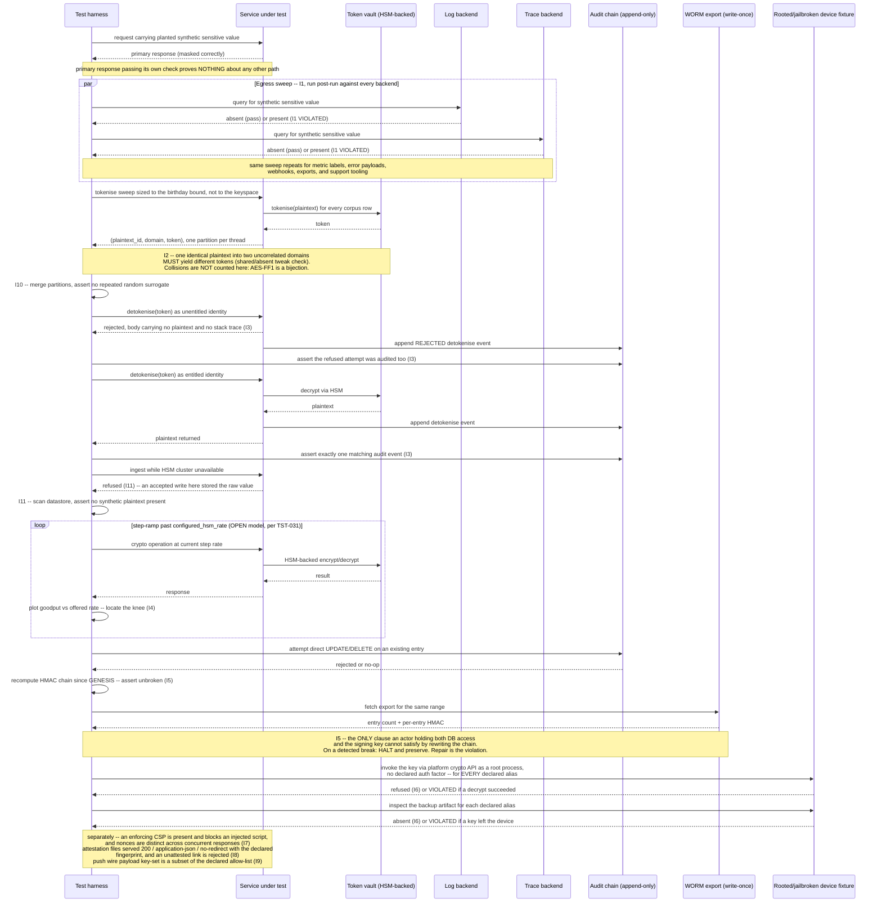

# Data Protection, Masking & Tokenisation

Status: Draft | Last Reviewed: 2026-08-12 | Owner: @qe-lead
Catalog ID: TST-041 | Radii
Tier Applicability: T0, T1

## 1. Applies To

| Catalog ID | Title | Document |
|---|---|---|
| SEC-008 | Data Masking | [../../patterns/security/data-masking.md](../../patterns/security/data-masking.md) |
| SEC-013 | PII Tokenization (Format-Preserving) | [../../patterns/security/pii-tokenization-format-preserving.md](../../patterns/security/pii-tokenization-format-preserving.md) |
| SEC-004 | Tokenization + HSM Key Management | [../../patterns/security/tokenization-hsm.md](../../patterns/security/tokenization-hsm.md) |
| SEC-012 | Tamper-Evident Audit Logging | [../../patterns/security/audit-logging-tamper-evident.md](../../patterns/security/audit-logging-tamper-evident.md) |
| MOB-002 | Mobile Secure Storage | [../../patterns/mobile/mobile-secure-storage.md](../../patterns/mobile/mobile-secure-storage.md) |
| FE-003 | Web CSP Hardening | [../../patterns/frontend/web-csp-hardening.md](../../patterns/frontend/web-csp-hardening.md) |
| MOB-005 | Mobile Deep Link Attestation | [../../patterns/mobile/mobile-deep-link-attestation.md](../../patterns/mobile/mobile-deep-link-attestation.md) |
| MOB-004 | Mobile Push Notification (Secure) | [../../patterns/mobile/mobile-push-notification-secure.md](../../patterns/mobile/mobile-push-notification-secure.md) |

These eight rows share one archetype because each names a distinct point at which a sensitive
value, or the control protecting it, can leak or be defeated, and every one of them is verified
the same way: prove the declared protection holds by looking at the value or the control from the
outside — querying the log, trace, or storage backend a naive test would never touch — rather than
trusting the primary API response or the on-screen display. SEC-008 Data Masking and SEC-013 PII
Tokenization supply the two protective techniques (irreversible masking, reversible
format-preserving tokenisation) whose leakage across every egress path I1 sweeps for, and SEC-013
additionally supplies the AES-FF1 mode whose tweak handling and domain sizing I2 checks; SEC-004
Tokenization + HSM Key Management supplies the HSM-backed vault whose detokenisation gate I3
exercises, whose crypto throughput I4 locates the ceiling of, whose random-surrogate token type is
the one mode here where a collision is genuinely reachable (I10), and whose fail-secure obligation
under HSM loss I11 asserts; SEC-012 Tamper-Evident Audit Logging supplies the append-only chain and
the WORM secondary store I5 asserts against, itself the audit trail I3's detokenisation events —
successful and rejected alike — must land in; MOB-002 Mobile Secure Storage supplies the
hardware-backed keystore contract I6 exercises by invoking the key on a rooted or jailbroken device
rather than by attempting to extract it; FE-003 Web CSP Hardening supplies both the enforcing-policy
requirement and the per-request nonce-uniqueness property I7 targets; MOB-005 Mobile Deep Link
Attestation supplies the Universal Link / App Link verification I8's unattested-link rejection
targets, along with the server-side attestation files I8 asserts directly; and MOB-004 Mobile Push
Notification (Secure) supplies the pull-on-notify payload contract — an allow-list of exactly two
fields — that I9's key-set check grades against. The verification method is identical across
all eight — assert from outside the primary path, against the backend or store the value would
actually have to survive in for a leak to be real — only the channel differs.

## 2. Failure Taxonomy

- Data masked in the UI but present, unmasked, in application logs, distributed traces, or error
  payloads.
- Two format-preserving token domains that must stay uncorrelated sharing one tweak, or a domain
  configured with no tweak at all — so the same plaintext tokenises identically in both domains and
  a record can be re-linked across them, and so the token-oracle dictionary
  [SEC-013 § Threat Model](../../patterns/security/pii-tokenization-format-preserving.md#threat-model)
  names becomes reusable rather than domain-local.
- A format-preserving domain declared below the minimum domain size its mode requires, so the
  permutation is defined over a space small enough to enumerate.
- A random-surrogate token vault issuing the same surrogate for two distinct plaintexts — the
  collision mode that is genuinely reachable, unlike in a format-preserving permutation.
- Detokenisation permitted for a caller without the declared entitlement.
- A rejected detokenisation attempt leaving no audit entry at all, so the insider-probing signal
  that repeated unauthorised attempts constitute is invisible; or the rejection response itself
  carrying the plaintext value or an internal stack trace, making the rejection its own egress path.
- Raw, untokenised sensitive data written to the datastore because the tokenisation path failed
  *open* when the HSM cluster became unavailable, rather than refusing the write.
- An HSM throughput ceiling discovered only in production, because it was never located under a
  representative load in a lower environment.
- An audit chain rewritten internally-consistently by an actor holding both database access and the
  signing key — every in-place recompute still verifies, and only a comparison against the
  write-once secondary store reveals the divergence.
- A chain-verification run that auto-repairs or writes past a detected break, destroying the
  forensic state the break was supposed to preserve.
- A hardware-backed key that a root-privileged process *on the device itself* can invoke to decrypt
  without satisfying the declared authentication factor — the key material never leaves the hardware
  boundary, so extraction was never the reachable attack; invocation is.
- Authentication-requirement flags applied inconsistently across a single app's keys, so some keys
  are gated on user authentication and others, protecting equally sensitive material, are not.
- A keystore or keychain entry included in an OS-level backup, which defeats the on-device-only
  guarantee regardless of how strong the on-device protection is.
- No enforcing Content Security Policy on a response at all, or an injected violating script that
  executes despite one — a violation observed and reported but never actually blocked.
- A per-request CSP nonce repeated across concurrent requests, so a nonce captured from one response
  authorises a script injected into another.
- A deep link accepted and opened without attestation, so a rogue app can intercept a payment or
  OTP link; or the server-side attestation file unreachable, redirected, or served with the wrong
  content type, which silently disables attestation for every client.
- A push notification payload carrying any field beyond the declared allow-list — not merely the
  obvious financial ones, but a customer or merchant name, a phone number, or free-text body
  content — readable on a lock screen with no authentication.

## 3. Functional Test Design

**Oracle:** `invariant-assertion` — every invariant below is checked mechanically against a
running system's actual egress paths, storage, and controls, per
[TST-001 § The Four Oracles](../strategy/test-strategy-standard.md#the-four-oracles); none of them
is inferred from configuration or from the primary response alone. "Mechanically" does not mean
"by the JMeter plan" for all eleven: §5 names which invariants that plan proves, which run as
post-run jobs over the whole run's output, and which are proven off the harness entirely on a
device fixture. Each still has a named, executable mechanism — that is the claim; a single tool
proving all of them is not.

### Invariants

| # | Invariant | Assertion |
|---|---|---|
| I1 | Sensitive data is absent from **every** egress path — response, logs, traces, metric labels, error payloads, webhooks, exports, and support tooling | `assert synthetic_sensitive_value NOT IN egress_backend_query(path)` for every declared egress path in [TST-008 § Egress Assertion for Sensitive Data](../strategy/security-test-standard.md#egress-assertion-for-sensitive-data), queried directly against each path's own backend after the run — never inferred from the primary API response passing its own check |
| I2 | Format-preserving token domains are cryptographically separated from one another and conformant to their declared mode | `assert tweak(domain_a) != tweak(domain_b)` for every pair of declared domains required to stay uncorrelated — evidenced by tokenising one identical synthetic plaintext into each and asserting the resulting tokens differ — and `assert declared_domain_size(domain) >= declared_minimum_domain_size` for every declared domain, the minimum its mode's specification states. Collision-freedom is deliberately **not** asserted here; see the note below the table |
| I3 | Detokenisation requires the declared entitlement, leaks nothing on rejection, and is audited whether it succeeds or is refused | `assert detokenise_call(identity_without_entitlement) == rejected` for every non-entitled identity; `assert rejection_response_body NOT CONTAINS plaintext_value` and `assert rejection_response_body NOT CONTAINS stack_trace_or_internal_error_detail`, because by I1's own thesis an error payload is a real egress path; and `assert audit_log contains exactly one entry per detokenise_call`, **both** successful and rejected, matched by correlation ID, with the rejected case carrying an explicit refusal outcome in the entry |
| I4 | HSM operation throughput meets its declared rate, and its ceiling is known and documented | `assert hsm_knee_located == true` and `assert hsm_knee_throughput >= declared_rate`, located by the step-ramp method [TST-031](./rate-limit-breakpoint.md) defines, applied here to HSM-backed tokenise/detokenise operations rather than a rate limiter |
| I5 | Audit log entries are append-only, tamper-evident, and cross-checked against the write-once secondary store | `assert direct_update_or_delete(audit_log_entry) == rejected_or_no_op`; `assert recompute_chain(entries_since_genesis) == unbroken`; and `assert (chain_entry_count, per_entry_hmac) == worm_export(same_range)` for every exported range — the third clause is the only one an actor holding *both* database access and the signing key cannot satisfy by rewriting the chain internally-consistently |
| I6 | A root-privileged process on the device cannot invoke the hardware-backed key without the declared authentication factor, and no protected key is carried off the device by backup | `assert keystore_decrypt(root_privileged_on_device_process, key_alias) == rejected_without(declared_auth_factor)` for **every** declared key alias, invoked through the platform crypto API on a rooted or jailbroken fixture — not by attempting extraction, which the hardware boundary makes structurally impossible and therefore untestable — and `assert backup_artifact(device) CONTAINS NO declared_key_alias`, for both the iOS keychain synchronisation attribute and the Android backup-exclusion rule |
| I7 | An enforcing CSP is present and actually blocks, and its per-request nonce is unique under concurrency | `assert response_header('Content-Security-Policy') is present` and `assert injected_violating_script.executed == false` — a violation must be blocked, not merely reported — and `assert count(distinct(nonces)) == count(responses)` over `declared_nonce_concurrency` concurrent requests. The presence of a *Report-Only* header alongside an enforcing one is **not** asserted against: staging a stricter policy in report-only mode beside an already-enforcing policy is a legitimate deployment step |
| I8 | An unattested deep link is rejected, and the attestation file the OS depends on is actually served correctly | `assert deep_link_open(app_failing_signature_or_fingerprint_check) == falls_back_to_https_page` — the link never reaches the payment or OTP UI when verification fails — and, server-side and harness-reachable without any device, `assert attestation_file_response.status == 200 AND content_type == 'application/json' AND redirect_count == 0 AND declared_app_id_and_fingerprint IN body` for both `apple-app-site-association` and `assetlinks.json` |
| I9 | Push wire payloads carry only the declared allow-listed fields | `assert set(push_wire_payload.keys) ⊆ declared_push_payload_allowlist` for every notification category sent — an allow-list, not a deny-list, because a deny-list of named financial fields passes a payload leaking a customer name, a merchant name, a phone number, or free-text body content — plus `assert planted_truncation_marker NOT IN push_wire_payload` for the fragment form the taxonomy's partial-redaction case names, inspected at the APNs/FCM wire payload itself, never at the in-app rendered content the pull-on-notify fetch produces |
| I10 | A random-surrogate token vault issues no duplicate surrogate at the volume the declared collision-probability bound requires | `assert count(distinct(surrogates)) == count(issued_surrogates)` over `birthday_bound_volume(declared_collision_probability_bound, surrogate_space)` issuances — a volume derived from the probability target, **not** from the domain's cardinality |
| I11 | Tokenisation fails secure, never open, when the HSM is unavailable | `assert ingest_request(hsm_cluster_unavailable) == rejected` and `assert datastore_scan(after_run) CONTAINS NO synthetic_plaintext` — a request that succeeds under HSM loss has written the raw value untokenised, which is a data-protection failure, not a resilience one |

**I1 is the invariant that matters most and the one most often missed.** Masking is usually
verified on the primary response only, and a control proven correct there is unproven — not
merely untested but genuinely unknown — on every other path a value can travel. Each of the
egress paths this invariant enumerates is typically built on a different serialisation path than
the primary response, per
[TST-008 § Egress Assertion for Sensitive Data](../strategy/security-test-standard.md#egress-assertion-for-sensitive-data):
a structured-logging call that serialises the whole request object bypasses the masking
interceptor wired into the API response pipeline; a stack trace embedded in an error payload
carries the raw value that triggered the exception; a webhook payload assembled from a DTO's raw
getters skips the same DTO's own masking layer; a support tool that queries the database directly
never passes through masking at all. A test suite that asserts masking once, on the response, and
calls the obligation satisfied has not tested seven of these eight paths.

**Why I2 does not count collisions, and I10 does.**
[SEC-013 § Solution](../../patterns/security/pii-tokenization-format-preserving.md#solution)
declares AES-FF1 (NIST SP 800-38G) — a format-preserving *permutation*. Under a fixed key and
tweak a permutation is bijective by construction, so two distinct plaintexts mathematically cannot
map to one token. A collision count over an FPE domain therefore reads zero whether the implementation is
correct or catastrophically broken; it is not a weak test, it is a test of nothing. What SEC-013
genuinely leaves exposed is different, and I2 targets it directly. First, tweak handling: SEC-013's
Vault configuration sets `tweak_source` per transformation, and a tweak shared across two domains
that must stay uncorrelated — or absent altogether — lets one plaintext produce the same token in
both, re-linking a record across domains that were separated on purpose. On a domain as small as
SEC-013's twelve-digit CCCD class, that turns the token-oracle dictionary
[SEC-013 § Threat Model](../../patterns/security/pii-tokenization-format-preserving.md#threat-model)
already names — an attacker submitting arbitrary inputs to the tokenise API — from a domain-local
nuisance into a reusable rainbow table. Second, domain size: a format-preserving mode is only sound
above the minimum domain size its specification states, and a domain declared below that bound is
enumerable outright. Collision counting still belongs in this archetype, but against the mode where
a collision is genuinely reachable — the random-surrogate vault
[SEC-004 § Token types](../../patterns/security/tokenization-hsm.md#token-types) declares as the
default for storage, where surrogates are drawn at random rather than permuted — which is what I10
asserts, and at a volume derived from a probability bound rather than from the domain's cardinality
(see the boundary note under I10 below).

### Equivalence classes and boundaries

- A sensitive value present in the primary API response, masked correctly — the canonical happy
  path every naive test already covers (I1).
- The same value, queried directly against the log backend after the run — the class this
  archetype exists to add, since it is the class a response-only check can never exercise (I1).
- The same value, queried against the trace backend, metric-label store, error-payload capture,
  webhook delivery log, batch-export artifact, and support-tooling view in turn — six further
  equivalence classes under I1, each its own distinct serialisation path per
  [TST-008](../strategy/security-test-standard.md#egress-assertion-for-sensitive-data), none of
  them inferable from any other passing.
- One identical synthetic plaintext tokenised into two declared domains that must stay uncorrelated
  — the two tokens must differ, which is the observable form of the two domains holding distinct
  tweaks (I2).
- A domain declared at exactly its mode's stated minimum size, and one declared a single position
  below it — the boundary I2 checks, since soundness of the format-preserving mode is defined
  against that minimum and nothing else about the run reveals a violation of it (I2's boundary).
- A random-surrogate issuance run at a volume below the birthday bound the declared
  collision-probability target implies — the case a small run passes cleanly while the genuine
  duplicate risk remains unexercised (I10's boundary).
- A random-surrogate issuance run at exactly the volume
  `birthday_bound_volume(declared_collision_probability_bound, surrogate_space)` yields — the volume
  I10 actually requires. Note what this is *not*: the declared domain for these token
  classes runs from a twelve-digit to a sixteen-digit space, so "the full keyspace" is a volume no
  test run reaches and no test run should target. Test volume is derived from the probability bound;
  the keyspace is the mathematical domain, and the two are not interchangeable.
- A detokenisation call from an identity holding the declared entitlement — must succeed and must
  be audited (I3).
- The identical call from an identity one entitlement short of the declared requirement — must be
  rejected, must carry neither the plaintext nor an internal stack trace in its rejection body, and
  must itself produce an audit entry flagged as a refusal (I3's boundary).
- An ingestion request issued while the HSM cluster is induced unavailable — must be refused, and
  the datastore must afterwards contain no untokenised synthetic plaintext attributable to it
  (I11).
- The identical request with the HSM cluster healthy — must succeed and must store only the token,
  the control case that distinguishes a genuine fail-secure path from a service that is simply
  broken (I11's negative space).
- Offered HSM-backed crypto operation rate below the located knee — throughput tracks offered rate
  and latency stays flat, per [TST-031 § The knee, defined](./rate-limit-breakpoint.md#4-performance-test-design).
- Offered rate at and beyond the located knee — the ceiling itself, which must be documented as a
  known capacity limit rather than discovered for the first time in production (I4).
- An audit log entry inserted through the normal append path — must succeed and extend the chain
  (I5).
- The identical entry targeted by a direct `UPDATE` or `DELETE` issued outside the append path —
  must be rejected or converted to a no-op, and the chain-verification pass must still report
  unbroken across every entry that was never touched (I5's boundary).
- A chain rewritten in place and re-signed so that every HMAC recomputes correctly — the DML
  rejection check and the in-place recompute both still pass, and only the comparison against the
  write-once export for the same range diverges (I5's boundary, and the only class that exercises
  the actor holding both database access and the signing key).
- A secure-storage read performed through the app's own API on an unmodified device, with the
  declared authentication factor satisfied — succeeds, because this is the path the pattern is
  designed for, not the path this archetype tests (I6's negative space).
- A decrypt invoked through the platform crypto API by a root-privileged process on a rooted or
  jailbroken fixture, with the declared authentication factor absent — must be refused, for every
  declared key alias without exception, since one alias configured not to require authentication
  makes a decrypt oracle out of the whole store (I6).
- The device's backup artifact, inspected for each declared key alias — must contain none of them
  (I6's second clause; a key that leaves the device by backup makes every on-device control moot).
- A CSP violation on a policy correctly deployed as enforcing — the violating script does not
  execute, and the violation is still reported (I7).
- The identical violation on a response carrying no enforcing policy at all — the script executes,
  which is the gap I7 exists to catch. A response carrying an enforcing policy *and* a report-only
  policy staging a stricter one is a passing case, not a failing one (I7's boundary).
- Nonces extracted from `declared_nonce_concurrency` concurrent responses — every one must be
  distinct; a repeat is a load-observable correctness defect, which is why I7 sits on the `load`
  and `stress` profiles rather than `baseline` alone (I7's boundary).
- The attestation files fetched server-side, with no device involved — each must return `200`,
  `Content-Type: application/json`, no redirect, and the declared app ID and certificate
  fingerprint (I8's harness-reachable class).
- A deep link opened by the verified, correctly signed bank app — succeeds and renders the payment
  or OTP UI (I8's happy path).
- The identical link presented to a device where the signature or certificate-fingerprint check
  fails — falls back to the HTTPS web page, never to a custom-scheme handler and never to any UI
  claiming to be the payment flow (I8's boundary).
- A push notification of every declared category — the wire payload's key set must be a subset of
  the declared allow-list, checked at the APNs/FCM payload itself. The class this replaces is the
  one a named-field deny-list can never reach: a payload carrying a customer name, a merchant name,
  a phone number, or free-text body content is caught by the allow-list and missed entirely by any
  list of forbidden field names (I9).
- The same notification's in-app rendered content after the pull-on-notify fetch — legitimately
  carries the sensitive value, and asserting against it instead of the wire payload is the
  substitution that makes I9 pass while the leak is real (I9's negative space).

### Negative paths

- A synthetic sensitive value present anywhere in the log backend after masking is declared
  active — treated as an I1 violation regardless of whether the primary API response passed its
  own masking check.
- Two declared domains that must stay uncorrelated producing the same token for one identical
  synthetic plaintext — treated as an I2 violation, because it is the observable signature of a
  shared or absent tweak, and no amount of correct behaviour elsewhere in the run offsets it.
- A random-surrogate run reporting a duplicate surrogate anywhere — treated as an I10 violation
  even if every other surrogate in the run is unique; one duplicate is one violation, not an
  acceptable defect rate.
- A detokenisation call missing its corresponding audit entry — treated as an I3 violation whether
  the call was authorised or refused. An unaudited *successful* detokenisation is unauditable
  regardless of its legitimacy; an unaudited *rejected* one destroys the only signal that
  distinguishes an insider probing entitlements from ordinary traffic, which is the detection
  signal both
  [SEC-004 § Threat Model Summary](../../patterns/security/tokenization-hsm.md#threat-model-summary)
  and PCI-DSS 4.0 §10.2.1.4's invalid-access-attempt logging obligation depend on.
- A crypto-throughput run reporting no located knee at all — treated as an I4 violation, not a
  passing run, since an undocumented ceiling is exactly the failure mode this invariant exists to
  prevent, whether or not the tested rate happened to succeed.
- A chain-verification pass that continues past a detected break, recomputes the chain forward, or
  otherwise repairs it — treated as an I5 violation. Halting at the first break and preserving the
  broken state is the *correct*, passing behaviour: it is what
  [SEC-012 § 4. Nightly chain verification](../../patterns/security/audit-logging-tamper-evident.md#4-nightly-chain-verification)
  implements deliberately and what its runbook's step (5) — "do NOT repair the chain — preserve
  broken state as forensic evidence" — requires. A run that grades halting as a failure fails a
  correctly implemented system and passes one that has silently destroyed the evidence.
- An ingestion request that succeeds while the HSM cluster is unavailable — treated as an I11
  violation regardless of what the response body claims, because the only way the write completed
  is with the raw value unprotected.
- A CSP violation report arriving at the report endpoint from a script that still executed —
  evidence that nothing enforcing actually blocked it, regardless of what the deployment
  configuration claims to declare (I7's negative path). The report's mere existence is not the
  finding; the script's execution is.
- A deep link that opens a custom URL scheme handler as a fallback when Universal Link / App Link
  verification fails — treated as an I8 violation; the only permitted fallback is the HTTPS web
  page, never a scheme a rogue app could also register.
- A push payload carrying a truncated or partially redacted sensitive value (for example, only
  the last four digits of an account number) — still treated as an I9 violation, since the
  declared contract is an allow-list of permitted fields, not a permitted quantity of sensitive
  content. This class is why the fixture plants a marker whose trailing fragment is itself
  distinctive: a truncated leak carries no field name to match on and is invisible to a key-set
  check alone.
- A hardware-backed key alias that a root-privileged on-device process can invoke to decrypt with
  no authentication prompt — treated as an I6 violation even when every other alias in the app
  correctly requires it, because the attacker chooses the alias. This document requires every
  declared alias to enforce the declared authentication factor, including the
  `tcb_mobile_master_key` alias MOB-002's own reference implementation currently sets to
  `setUserAuthenticationRequired(false)`.

## 4. Performance Test Design

| Profile | Applies | Why | Threshold source |
|---|---|---|---|
| `baseline` | yes | Confirms masking-serialiser, tokenisation, and detokenisation latency have not regressed before any load-shaped run | [NFR-002](../../nfr/latency-budget-model.md) |
| `load` | yes | Proves tokenisation and detokenisation hold their declared latency and correctness at sustained declared traffic, including the audit-chain append path (I5) keeping pace, and carries I7's per-request CSP nonce-uniqueness check — a correctness property that is only observable under concurrency and is therefore untestable on `baseline` | [NFR-002](../../nfr/latency-budget-model.md), [NFR-004](../../nfr/throughput-model.md) |
| `stress` | yes | This archetype's primary profile for I4: a step-ramp past the HSM-backed operation's configured rate is how the throughput ceiling is located and documented, reusing [TST-031](./rate-limit-breakpoint.md)'s breakpoint method rather than restating it | [NFR-003](../../nfr/capacity-planning-model.md) |
| `soak` | yes | Targets audit-chain growth and token-vault growth over an extended window — proves chain-verification latency and vault lookup latency do not degrade as both grow unbounded, rather than merely being declared to hold | [NFR-003](../../nfr/capacity-planning-model.md) |

**Workload model:** `open` for `stress`, per
[TST-003 § The Rule](../strategy/workload-modelling.md#the-rule) and
[TST-031 § Performance Test Design](./rate-limit-breakpoint.md#4-performance-test-design) — a
closed model self-throttles the offered rate the instant the HSM-backed operation begins
degrading, which would make the located knee an artifact of the harness rather than a property of
the HSM. `closed` for `baseline`, `load`, and `soak`, each holding a declared, bounded population
of virtual users at steady state.

**The HSM throughput ceiling is explicitly non-extrapolable.** A single Hardware Security Module
is a shared singleton with a fixed physical signing/decryption throughput: a smaller `perf`
environment sharing the same HSM as production observes the *same* ceiling production would hit,
never a fraction of it scaled down by the environment's own sizing ratio. Per
[TST-005 § Performance Environment Sizing and Extrapolation](../strategy/environments-quality-gates.md#performance-environment-sizing-and-extrapolation),
an HSM-bound throughput figure is on the explicitly non-extrapolable list; the `stress` profile's
located knee must be recorded as the number the shared HSM itself produced, never multiplied by
any sizing ratio to fabricate a projected production figure the hardware cannot actually produce.

## 5. Canonical Harness — JMeter

**What this plan proves mechanically, and what it does not.** Stating this explicitly is the
convention [TST-043 § 5](./client-experience-offline-perf.md#5-canonical-harness--jmeter)
establishes, and this archetype needs it more than most, because three of its eleven invariants
reach past anything a protocol-level load tool can drive. The JMeter plan below fully proves I1,
I2, I3, I4, I7, I9, and I11, and the server-side half of I8. Three mechanisms sit **outside** it and
are named here so the coverage claim in §10 is honest rather than aspirational:

- **I5's chain and WORM verification** runs as a standalone post-run job, not a sampler, because it
  operates over the run's whole accumulated output rather than any request/response pair.
- **I10's surrogate-uniqueness scan** likewise runs post-run over the merged issuance record.
- **I6 has no JMeter-reachable form at all.** JMeter cannot obtain a root shell on a device or call
  a platform keystore API, so I6's decrypt-invocation clause is proven by a device-instrumentation
  job on the rooted or jailbroken fixture, and its backup clause by inspecting the backup artifact
  the platform produces — both consuming
  [MOB-002 § Test Strategy Stub](../../patterns/mobile/mobile-secure-storage.md#test-strategy-stub)'s
  own integration approach unchanged. Their pass/fail results are attached as run evidence; this
  plan records them, it does not produce them.
- **I8's on-device half** — a companion build failing signature or fingerprint verification — is
  likewise device-bound. Its server-side half, the attestation files themselves, *is* fully
  harness-reachable and is asserted below without any device in the loop.

```xml
<!-- Thread Group 1: bulk tokenisation across the declared synthetic domains. Two things happen
     here: the cross-domain tweak check (I2), and the capture of every issuance for the post-run
     surrogate-uniqueness scan (I10). Volume is supplied at invocation from the birthday bound the
     declared collision-probability target implies -- NEVER from the domain's cardinality, which
     for these classes runs from a twelve- to a sixteen-digit space and is not a reachable
     test volume. -->
<ThreadGroup testname="tg-tokenisation-domain-sweep">
  <stringProp name="ThreadGroup.num_threads">${__P(users,50)}</stringProp>
  <stringProp name="ThreadGroup.ramp_time">${__P(rampup,60)}</stringProp>
  <stringProp name="ThreadGroup.duration">${__P(duration,1800)}</stringProp>
</ThreadGroup>

<CSVDataSet testname="synthetic_domain_corpus.csv (SYNTHETIC -- no real PII, no real PANs)">
  <!-- Sized to ${__P(surrogate_run_volume)}: birthday_bound_volume(declared_collision_probability
       _bound, surrogate_space), supplied at invocation. -->
  <stringProp name="filename">data/synthetic_domain_corpus_${__P(corpus_ref)}.csv</stringProp>
  <stringProp name="variableNames">plaintext_id,pii_class,token_domain,synthetic_plaintext,cross_domain_probe</stringProp>
  <boolProp name="recycle">false</boolProp>
</CSVDataSet>

<HTTPSamplerProxy testname="POST /internal/v1/tokenize (I2, I10)">
  <stringProp name="HTTPSampler.path">/internal/v1/tokenize</stringProp>
  <stringProp name="HTTPSampler.method">POST</stringProp>
</HTTPSamplerProxy>

<!-- I2, clause 1 -- domain separation. Rows flagged cross_domain_probe carry ONE identical
     synthetic plaintext submitted to two domains declared to stay uncorrelated. Identical tokens
     mean the two domains share a tweak, or neither has one. This is the observable form of the
     property; the tweak value itself is never exposed by the API and is not assertable directly. -->
<JSR223Assertion testname="assert uncorrelated domains do not produce identical tokens (I2)">
  <stringProp name="script"><![CDATA[
    if (vars.get("cross_domain_probe") != "true") { return }
    def token = new groovy.json.JsonSlurper().parseText(prev.getResponseDataAsString()).token
    def priorKey   = "probe_token_" + vars.get("plaintext_id")
    // putIfAbsent on the shared props map is atomic: a null return means this thread just
    // registered the first domain of the pair; get-then-put here would race two threads into
    // both observing null and both registering, so the comparison branch below would never run.
    def priorToken = props.putIfAbsent(priorKey, token)
    if (priorToken == null) {
        // first domain of the pair seen -- this thread just registered it
    } else if (priorToken == token) {
        AssertionResult.setFailure(true);
        AssertionResult.setFailureMessage(
            "I2 violated: identical token for one plaintext across two domains declared "
          + "uncorrelated (probe " + vars.get("plaintext_id") + ", domain "
          + vars.get("token_domain") + ") -- shared or absent tweak."
        );
    }
  ]]></stringProp>
</JSR223Assertion>

<!-- I10 capture. Each thread appends to its OWN file, never a shared one: groovy's File.append()
     opens, writes and closes with no cross-thread lock, so concurrent appends to one path
     interleave mid-line or drop writes outright -- which would silently deflate the issuance count
     and make "no duplicates" meaningless in exactly the direction that hides a defect. Per-thread
     partitioning removes the shared handle entirely; a post-run merge concatenates the parts before
     the uniqueness scan, and the merged line count is asserted equal to the plan's sample count so
     a lost partition fails loudly rather than quietly. -->
<JSR223PostProcessor testname="append (plaintext_id, token) to this thread's partition (I10)">
  <stringProp name="script"><![CDATA[
    def token = new groovy.json.JsonSlurper().parseText(prev.getResponseDataAsString()).token
    new File(vars.get("tokenise_results_path") + ".part-" + ctx.getThreadNum()).append(
        vars.get("plaintext_id") + "," + vars.get("token_domain") + "," + token + "\n")
  ]]></stringProp>
</JSR223PostProcessor>

<!-- Thread Group 2: OPEN-model step-ramp against the HSM-backed tokenise/detokenise endpoint,
     reusing TST-031's Concurrency Thread Group + Throughput Shaping Timer unchanged to locate
     the HSM throughput ceiling (I4). -->
<kg.apc.jmeter.threads.concurrency.ConcurrencyThreadGroup testname="tg-hsm-crypto-throughput-breakpoint (OPEN model)">
  <stringProp name="TargetLevel">${__P(targetrps,200)}</stringProp>
  <stringProp name="RampUp">${__P(rampup,1)}</stringProp>
  <stringProp name="Steps">${__P(ramp_steps,10)}</stringProp>
  <stringProp name="Hold">${__P(step_hold_seconds,300)}</stringProp>
</kg.apc.jmeter.threads.concurrency.ConcurrencyThreadGroup>

<kg.apc.jmeter.timers.VariableThroughputTimer testname="Throughput Shaping Timer -- step-ramp through configured_hsm_rate">
  <collectionProp name="load_profile">
    <collectionProp name="0">
      <stringProp name="49">${__P(configured_hsm_rate,150)}</stringProp>
      <stringProp name="50">${__P(configured_hsm_rate,150)}</stringProp>
      <stringProp name="51">${__P(step_hold_seconds,300)}</stringProp>
    </collectionProp>
    <collectionProp name="1">
      <stringProp name="49">${__P(configured_hsm_rate,150)}</stringProp>
      <stringProp name="50">${__P(targetrps,200)}</stringProp>
      <stringProp name="51">${__P(step_hold_seconds,300)}</stringProp>
    </collectionProp>
  </collectionProp>
</kg.apc.jmeter.timers.VariableThroughputTimer>

<HTTPSamplerProxy testname="POST /internal/v1/detokenize (I3, I4)">
  <stringProp name="HTTPSampler.path">/internal/v1/detokenize</stringProp>
  <stringProp name="HTTPSampler.method">POST</stringProp>
</HTTPSamplerProxy>

<ResponseAssertion testname="assert unentitled identity is rejected (I3)">
  <stringProp name="Assertion.test_field">Assertion.response_code</stringProp>
  <collectionProp name="Assertion.test_strings">
    <stringProp name="0">403</stringProp>
  </collectionProp>
  <intProp name="Assertion.test_type">8</intProp>
  <!-- test_type 8: EQUALS. Note the collectionProp wrapper: a bare stringProp sibling is not
       read as a test string and the assertion silently passes on every response. -->
</ResponseAssertion>

<!-- I3, clause 2 -- the rejection is itself an egress path. A 403 that carries the plaintext or a
     stack trace has leaked exactly what the entitlement gate refused. -->
<ResponseAssertion testname="assert rejection body carries no plaintext and no stack trace (I3)">
  <stringProp name="Assertion.test_field">Assertion.response_data</stringProp>
  <collectionProp name="Assertion.test_strings">
    <stringProp name="0">${synthetic_sensitive_value}</stringProp>
    <stringProp name="1">java.lang.</stringProp>
    <stringProp name="2">at com.</stringProp>
    <stringProp name="3">Caused by:</stringProp>
  </collectionProp>
  <intProp name="Assertion.test_type">6</intProp>
  <!-- test_type 6 = NOT (4) | CONTAINS (2): the correct does-NOT-contain bitmask. -->
</ResponseAssertion>

<!-- I3, clause 3 -- BOTH outcomes are audited. A rejected attempt that leaves no audit entry is
     the gap this asserts against; it is the insider-probing signal, and it is the outcome most
     implementations miss, because an entitlement check that throws before the audit call produces
     no record at all. -->
<JSR223Assertion testname="assert an audit entry exists for this call, success or rejection (I3)">
  <stringProp name="script"><![CDATA[
    def cid      = vars.get("correlation_id")
    def expected = prev.getResponseCode() == "200" ? "SUCCESS" : "REJECTED"
    def entries  = AuditBackendClient.findByCorrelationId(cid)
    if (entries.size() != 1) {
        AssertionResult.setFailure(true);
        AssertionResult.setFailureMessage(
            "I3 violated: expected exactly 1 audit entry for correlationId " + cid
          + " (outcome " + expected + "), found " + entries.size()
          + " -- an unaudited rejected attempt is an invisible entitlement probe."
        );
    } else if (entries[0].outcome != expected) {
        AssertionResult.setFailure(true);
        AssertionResult.setFailureMessage(
            "I3 violated: audit entry for " + cid + " records outcome '" + entries[0].outcome
          + "', expected '" + expected + "'."
        );
    }
  ]]></stringProp>
</JSR223Assertion>

<!-- Thread Group 3: fail-secure under HSM unavailability (I11). The HSM cluster is taken out of
     reach for the window this group runs in; every ingestion request issued inside it must be
     refused. The assertion that matters is not the status code but the datastore scan that
     follows: a request that "succeeded" here wrote the raw value untokenised. -->
<ThreadGroup testname="tg-hsm-unavailable-fail-secure (I11)">
  <stringProp name="ThreadGroup.num_threads">${__P(failsecure_users,5)}</stringProp>
  <stringProp name="ThreadGroup.duration">${__P(hsm_outage_window_seconds)}</stringProp>
</ThreadGroup>

<HTTPSamplerProxy testname="POST /v1/ingest while HSM cluster unreachable (I11)">
  <stringProp name="HTTPSampler.path">/v1/ingest</stringProp>
  <stringProp name="HTTPSampler.method">POST</stringProp>
</HTTPSamplerProxy>

<JSR223Assertion testname="assert ingestion is refused, and no raw value reached the store (I11)">
  <stringProp name="script"><![CDATA[
    def rc = prev.getResponseCode()
    if (rc.isInteger() && (rc as int) >= 200 && (rc as int) < 300) {
        AssertionResult.setFailure(true);
        AssertionResult.setFailureMessage(
            "I11 violated: ingestion accepted (rc=" + rc + ") with the HSM cluster unavailable "
          + "-- the value cannot have been tokenised, so it was stored raw."
        );
        return
    }
    if (DatastoreClient.containsValue(vars.get("synthetic_plaintext"))) {
        AssertionResult.setFailure(true);
        AssertionResult.setFailureMessage(
            "I11 violated: request was refused but the synthetic plaintext is present in the "
          + "datastore -- the write path bypassed tokenisation before failing."
        );
    }
  ]]></stringProp>
</JSR223Assertion>

<!-- I8, server-side half. No device required: the attestation files the OS fetches are ordinary
     HTTP resources, and a non-200, a redirect, or the wrong content type silently disables
     Universal Link / App Link verification for every client at once. -->
<HTTPSamplerProxy testname="GET /.well-known/apple-app-site-association (I8)">
  <stringProp name="HTTPSampler.path">/.well-known/apple-app-site-association</stringProp>
  <stringProp name="HTTPSampler.method">GET</stringProp>
  <boolProp name="HTTPSampler.follow_redirects">false</boolProp>
</HTTPSamplerProxy>

<ResponseAssertion testname="assert AASA: 200, application/json, no redirect, declared appID (I8)">
  <stringProp name="Assertion.test_field">Assertion.response_code</stringProp>
  <collectionProp name="Assertion.test_strings">
    <stringProp name="0">200</stringProp>
  </collectionProp>
  <intProp name="Assertion.test_type">8</intProp>
</ResponseAssertion>

<ResponseAssertion testname="assert AASA content type and declared app ID (I8)">
  <stringProp name="Assertion.test_field">Assertion.response_headers</stringProp>
  <collectionProp name="Assertion.test_strings">
    <stringProp name="0">Content-Type: application/json</stringProp>
  </collectionProp>
  <intProp name="Assertion.test_type">2</intProp>
</ResponseAssertion>

<ResponseAssertion testname="assert AASA body carries the declared app ID (I8)">
  <stringProp name="Assertion.test_field">Assertion.response_data</stringProp>
  <collectionProp name="Assertion.test_strings">
    <stringProp name="0">${__P(declared_app_id)}</stringProp>
  </collectionProp>
  <intProp name="Assertion.test_type">2</intProp>
</ResponseAssertion>

<!-- assetlinks.json is asserted identically, against ${__P(declared_sha256_fingerprint)} rather
     than the app ID. Both fingerprint and app ID are supplied at invocation from the release
     record, never literal in the plan -- a plan carrying its own expected fingerprint passes
     after a signing-certificate rotation that has already broken every real client. -->
<HTTPSamplerProxy testname="GET /.well-known/assetlinks.json (I8)">
  <stringProp name="HTTPSampler.path">/.well-known/assetlinks.json</stringProp>
  <stringProp name="HTTPSampler.method">GET</stringProp>
  <boolProp name="HTTPSampler.follow_redirects">false</boolProp>
</HTTPSamplerProxy>

<ResponseAssertion testname="assert assetlinks.json carries the declared SHA-256 fingerprint (I8)">
  <stringProp name="Assertion.test_field">Assertion.response_data</stringProp>
  <collectionProp name="Assertion.test_strings">
    <stringProp name="0">${__P(declared_sha256_fingerprint)}</stringProp>
  </collectionProp>
  <intProp name="Assertion.test_type">2</intProp>
</ResponseAssertion>

<!-- I7, clause 1: an enforcing policy is present. Deliberately NOT paired with an assertion that
     the Report-Only header is absent -- see the note below the code block. -->
<ResponseAssertion testname="assert an enforcing CSP header is present (I7)">
  <stringProp name="Assertion.test_field">Assertion.response_headers</stringProp>
  <collectionProp name="Assertion.test_strings">
    <stringProp name="0">Content-Security-Policy:</stringProp>
  </collectionProp>
  <intProp name="Assertion.test_type">2</intProp>
</ResponseAssertion>

<!-- I7, clause 3: per-request nonce uniqueness under concurrency. This is FE-003's own declared
     load-observable correctness property, and it is the reason I7 carries load and stress profiles
     at all: a nonce generator seeded once per process, or cached per connection, produces a
     perfectly valid-looking header on every single-request check and repeats under concurrency. -->
<JSR223Assertion testname="assert this response's CSP nonce has not been seen before (I7)">
  <stringProp name="script"><![CDATA[
    def m = (prev.getResponseHeaders() =~ /nonce-([A-Za-z0-9+\/=]+)/)
    if (!m.find()) {
        AssertionResult.setFailure(true);
        AssertionResult.setFailureMessage("I7 violated: no nonce in the CSP header.");
        return
    }
    def nonce = m.group(1)
    // putIfAbsent on the shared props map is atomic: a non-null return means another concurrent
    // response already claimed this nonce.
    if (props.putIfAbsent("csp_nonce_" + nonce, "seen") != null) {
        AssertionResult.setFailure(true);
        AssertionResult.setFailureMessage(
            "I7 violated: CSP nonce repeated across concurrent requests -- a nonce captured from "
          + "one response authorises a script injected into another."
        );
    }
  ]]></stringProp>
</JSR223Assertion>

<!-- I9: allow-list, not deny-list. The service's push transport is pointed at a synthetic capture
     sink for the run (a prerequisite of the environment, stated in section 8), so the assertion
     reads the wire payload as APNs/FCM would receive it -- never the in-app rendered content,
     which legitimately carries the sensitive value after the pull-on-notify fetch. -->
<JSR223Assertion testname="assert push wire payload keys are a subset of the allow-list (I9)">
  <stringProp name="script"><![CDATA[
    def allowed = (props.get("declared_push_payload_allowlist") as String).split(",") as Set
    def payload = PushCaptureSink.lastPayloadFor(vars.get("notification_category"))
    def extra   = payload.data.keySet() - allowed
    def marker  = vars.get("planted_truncation_marker")
    def failures = []
    if (!extra.isEmpty()) {
        failures << ("keys outside the declared allow-list: " + extra.join(", "))
    }
    // The truncation case carries no field name to match on: a partially redacted value can ride
    // inside an allow-listed field's value. Assert the marker's trailing fragment too.
    def flat = payload.data.values().join("")
    if (flat.contains(marker) || flat.contains(marker[-4..-1])) {
        failures << "planted sensitive marker (or its trailing fragment) present in a payload value"
    }
    if (!failures.isEmpty()) {
        AssertionResult.setFailure(true);
        AssertionResult.setFailureMessage(
            "I9 violated for category " + vars.get("notification_category") + ": "
          + failures.join(" AND ")
        );
    }
  ]]></stringProp>
</JSR223Assertion>

<!-- Post-run only, after every prior Thread Group has stopped: query every declared egress backend
     for the planted synthetic sensitive value -- the only mechanism that can prove I1, since the
     primary response passing its own check proves nothing about any other path. This element is a
     genuine Sampler, so it reports through SampleResult; AssertionResult is not bound here. Every
     violated path is collected and reported in ONE message: failing per-path inside the loop would
     let the last iteration overwrite the first, and a sweep that finds leaks on three backends must
     name all three. -->
<JSR223Sampler testname="egress sweep -- query every declared backend for the planted value (I1)">
  <stringProp name="script"><![CDATA[
    def egressPaths = ["logs", "traces", "metric_labels", "error_payloads",
                        "webhooks", "exports", "support_tooling"]
    def sensitiveValue = vars.get("synthetic_sensitive_value")
    def leaked = []
    egressPaths.each { path ->
        if (EgressBackendClient.query(path, sensitiveValue)) {  // one client per backend
            leaked << path
        }
    }
    if (!leaked.isEmpty()) {
        SampleResult.setSuccessful(false);
        SampleResult.setResponseMessage(
            "I1 violated: planted synthetic sensitive value found on " + leaked.size()
          + " egress path(s): " + leaked.join(", ")
        );
    }
  ]]></stringProp>
</JSR223Sampler>
```

```bash
# Detokenisation identities -- entitled and unentitled alike -- are read from the runner's secret
# store into the environment, never passed as -J properties. Anything in argv is world-readable
# through ps(1) and /proc/<pid>/cmdline to every other process on the host, and lands in shell
# history and CI job logs. These are synthetic credentials, but an archetype that teaches data
# protection must not model a credential-exposure anti-pattern; the plan reads them via
# ${__env(...)} rather than ${__P(...)}.
export DETOK_ENTITLED_IDENTITY DETOK_UNENTITLED_IDENTITY   # from the runner's secret store

jmeter -n -t data-protection-masking-tokenisation.jmx \
  -Jusers="${JMETER_USERS}" -Jrampup="${JMETER_RAMPUP}" -Jduration="${JMETER_DURATION}" \
  -Jcorpus_ref="${JMETER_CORPUS_REF}" -Jsurrogate_run_volume="${SURROGATE_RUN_VOLUME}" \
  -Jtargetrps="${JMETER_TARGETRPS}" -Jconfigured_hsm_rate="${JMETER_CONFIGURED_HSM_RATE}" \
  -Jramp_steps="${JMETER_RAMP_STEPS}" -Jstep_hold_seconds="${JMETER_STEP_HOLD_SECONDS}" \
  -Jfailsecure_users="${JMETER_FAILSECURE_USERS}" \
  -Jhsm_outage_window_seconds="${HSM_OUTAGE_WINDOW_SECONDS}" \
  -Jnonce_concurrency="${DECLARED_NONCE_CONCURRENCY}" \
  -Jdeclared_app_id="${DECLARED_APP_ID}" \
  -Jdeclared_sha256_fingerprint="${DECLARED_SHA256_FINGERPRINT}" \
  -Jtokenise_results_path="${JMETER_TOKENISE_RESULTS_PATH}" -Jprofile="${JMETER_PROFILE}" \
  -l results.jtl -e -o report/

# Post-run, separate passes -- each operates over the whole run's accumulated output rather than
# any single request/response pair, which is why none of them is a sampler:
#   (1) merge the per-thread partitions, assert the merged line count equals the plan's sample
#       count, then scan for a repeated surrogate (I10);
#   (2) recompute the HMAC chain from the GENESIS anchor, AND compare entry count and per-entry
#       HMAC against the WORM export for the same range (I5) -- see the note below;
#   (3) device-instrumentation job on the rooted/jailbroken fixture and backup-artifact
#       inspection (I6), whose results are attached as evidence, not produced by this plan.
cat "${JMETER_TOKENISE_RESULTS_PATH}".part-* > "${JMETER_TOKENISE_RESULTS_PATH}"
```

The **post-run egress sweep** (`JSR223Sampler`, run once after every Thread Group has stopped) is
this harness's load-bearing design choice, not an optional addition: it is the only mechanism that
can prove I1, because every other sampler in this plan only ever proves the primary response is
correctly masked, which is exactly the check [TST-008](../strategy/security-test-standard.md#egress-assertion-for-sensitive-data)
warns produces false confidence. The **HSM step-ramp** (Thread Group 2) reuses
[TST-031](./rate-limit-breakpoint.md#5-canonical-harness--jmeter)'s Concurrency Thread Group and
Throughput Shaping Timer unchanged, applying the identical knee-location mechanism to a
crypto-throughput ceiling rather than a rate limiter's configured rate.

**Why the results file is partitioned per thread, and why it is purged.** The issuance record is
written one partition per thread and merged after the run, not appended to one shared path, because
Groovy's `File.append()` acquires no cross-thread lock: concurrent appends to a single path
interleave mid-line or drop writes, and either outcome deflates the observed issuance count. That
would weaken I10's "counted exactly, never sampled" claim in precisely the direction that hides a
duplicate. Asserting the merged line count against the plan's own sample count turns a lost
partition into a loud failure rather than a quietly short scan. The merged file also matters for a
second reason that has nothing to do with correctness: it *is* a plaintext-to-token mapping — a
working detokenisation oracle for the whole run, assembled outside the vault and outside the
entitlement gate I3 exists to enforce. §8 purges it, its partitions, and the synthetic corpus it
dereferences, at teardown; leaving it behind would mean this archetype's own test run had created
the exposure it is written to prevent.

**Why I5 needs the WORM cross-check, not just the recompute.**
[SEC-012 § Threat Model](../../patterns/security/audit-logging-tamper-evident.md#threat-model) names
its primary tampering threat as an actor holding **both** database access and the Vault signing key,
who rewrites every entry and recomputes the chain so the forged chain verifies. Against that actor,
the append-only DML rejection passes (no `UPDATE` was issued — the rows were rewritten with the key)
and the in-place recompute passes by construction. What that actor cannot forge is the secondary
copy: SEC-012 pairs the GENESIS anchor with an S3 WORM Object Lock store in COMPLIANCE mode, whose
immutability its own `TAL-03` criterion asserts by attempting a `DeleteObject` and requiring
`AccessDenied`, and its runbook's step (3) — "compare PostgreSQL entry against S3 WORM export for
the same time range" — is exactly the comparison I5's third clause automates. A chain check without
it is a check the pattern's own named threat walks straight past.

**Why I7 does not assert the Report-Only header is absent.** The security-meaningful pair is that an
*enforcing* policy is present and that an injected violating script does not execute. Asserting the
absence of `Content-Security-Policy-Report-Only` flags a legitimate deployment: staging a stricter
policy in report-only mode alongside an already-enforcing one is how a CSP tightening is rolled out
safely, and what [FE-003 § When Not to Use](../../patterns/frontend/web-csp-hardening.md#when-not-to-use)
actually warns against is leaving report-only in production *as the only policy*, indefinitely — a
condition the enforcing-header assertion already catches directly.

## 6. Tool Fit

| Tool | Fit | When to prefer |
|---|---|---|
| JMeter | BEST | The Concurrency Thread Group and Throughput Shaping Timer give the HSM ceiling its exact step-ramp, a JSR223 Sampler drives the post-run egress sweep against arbitrary log/trace backend clients, and the same plan captures the tokenisation output for the post-run surrogate-uniqueness scan — no other tool in the corpus combines native step-ramp crypto-throughput testing with an extensible post-run assertion sampler in one plan. None of the four, JMeter included, can reach I6's on-device clauses; that gap is a property of the invariant, not a discriminator between tools (§5) |
| k6 | good | The `ramping-arrival-rate` executor models the HSM step-ramp natively and a custom JS check can query log/trace backends post-run, but there is no first-class equivalent to a dedicated post-run sampler stage — the egress sweep must be scripted as a final, separately-invoked scenario |
| Locust | good | A custom `LoadTestShape` can approximate the step-ramp and a Python post-run script can drive the same backend queries for I1, but both require hand-built scaffolding rather than JMeter's native elements, per [TST-014](../tooling/locust.md#when-to-use-this-tool) |
| Gatling + Karate | fair | Karate can script the egress-backend queries and the detokenisation entitlement checks well, but Gatling's injection profile approximates rather than exactly reproduces the Throughput Shaping Timer's per-step rate/duration control the HSM knee-location depends on |

Record `primary_tool: jmeter` for all eight coverage rows in §1.

## 7. Overlays

Security is not a secondary overlay layered over some other primary method in this archetype — it
is the body of the document. The egress-path sweep, the tokenisation and HSM invariants, the
audit-chain check, and the client- and channel-specific invariants (§§2–6) are this archetype's
primary functional and performance test design, not an add-on to a different oracle, so there is
no separate "Security overlay" subsection here: §§2–6 already are the security verification,
cross-linking [TST-008](../strategy/security-test-standard.md#egress-assertion-for-sensitive-data)
for the egress-assertion rule rather than restating it.

### Data-quality overlay

Surrogate-uniqueness detection over the synthetic corpus (I10) is this archetype's data-quality
concern: the post-run scan over the merged issuance record (§5) is graded against a known ground
truth — the issuance count the run itself produced — the same way any other data-quality check in
this corpus grades a result against a counted, deliberately-sized dataset rather than an inferred
one, per
[TST-004 § Data for Each Discipline](../strategy/test-data-management.md#data-for-each-discipline).
A duplicate found anywhere in the scan is graded as a defect count of exactly one, never rounded
down to "acceptable" regardless of how large the surrogate space is. The dataset is sized to the
birthday bound the declared collision-probability target implies, not to the domain's cardinality:
grading against a ground truth is only meaningful when the ground truth is a number the run can
actually reach.

I2's domain-separation check is graded the same way and for the same reason, but it is a
cryptographic-configuration property rather than a counted one — a single identical token across two
domains declared uncorrelated is the whole finding, and no run volume makes it more or less true.

Resilience and Contract overlays are omitted: this archetype's failure modes are about data
exposure, tokenisation correctness, audit integrity, and client/channel-side control enforcement,
not fault tolerance under injected failure or schema/wire compatibility, so neither overlay
applies. I11 is worth naming against that omission rather than leaving the reader to wonder. It
induces an HSM outage, which looks like a resilience technique, but the property it grades is not
recovery, degradation, or fault tolerance — it is whether raw sensitive data reaches the datastore
when the protection mechanism is gone. That is a data-protection obligation squarely inside this
archetype's scope, and
[SEC-004 § Test Strategy](../../patterns/security/tokenization-hsm.md#test-strategy) names verifying
fail-secure behaviour on full HSM cluster loss as a required check in its own right. The outage is
the setup; the assertion is about exposure.

### Explicitly out of scope: detokenisation-rate anomaly detection

[SEC-004 § Threat Model Summary](../../patterns/security/tokenization-hsm.md#threat-model-summary)
names detokenisation abuse by an *authorised* insider as a residual threat — someone who holds the
entitlement I3 checks and uses it far beyond their business need — and mitigates it with an alert
that fires when a principal detokenises above a declared multiple of their own baseline rate. No
invariant here covers that, deliberately. The property is a comparison against a *production*
behavioural baseline, and a test run's synthetic traffic has no baseline to deviate from: any figure
the harness produced would be an artifact of the workload model, not evidence about the control. The
testable residue is whether the alert itself fires on a synthetic breach, and that is
[TST-042](./telemetry-verification.md)'s subject rather than this archetype's — a telemetry
verification, not a data-protection assertion. Named here so the omission is a decision on the
record rather than a gap.

## 8. Test Data Requirements

Synthetic only, per [TST-004](../strategy/test-data-management.md). Entities needed: a synthetic
corpus of PII-shaped values (CCCD-shaped national IDs, phone numbers, card PANs drawn only from
the designated test BIN ranges, account numbers marked `ACCT-SYN-*`) sized to
`birthday_bound_volume(declared_collision_probability_bound, surrogate_space)` so I10's uniqueness
scan is meaningful rather than sampled; within it, a subset of cross-domain probe rows carrying one
identical plaintext addressed to two domains declared to stay uncorrelated (I2); a distinct,
single-use synthetic sensitive value planted specifically for the I1 egress sweep, chosen so it
cannot be confused with any value already present in the environment from a prior run; a set of
synthetic identities spanning entitled and non-entitled detokenisation roles (I3), supplied from
the runner's secret store into the environment and never as command-line properties (§5); an
inducible HSM-unavailability condition and a synthetic ingestion payload to issue during it (I11);
a rooted or jailbroken synthetic device image (or emulator equivalent) carrying **every** declared
key alias, not only the biometric-gated ones, for the I6 decrypt-invocation check, plus the backup
artifact that image produces, distinct from the production fleet's device population; a
deliberately unsigned or fingerprint-mismatched companion app build for the I8 deep-link
attestation negative path, alongside the declared app ID and SHA-256 signing fingerprint supplied
from the release record for I8's server-side half; and a declared push-notification fixture set
covering every notification category the service sends, each carrying a planted sensitive marker
whose trailing four characters are themselves distinctive so I9's truncation case has something to
match on, routed through a synthetic push capture sink rather than live APNs/FCM.

The cardinality driver for I10 is the declared collision-probability bound, not the domain's
cardinality: these token classes span a twelve- to sixteen-digit domain, a volume no run reaches, so
sizing the corpus to "the keyspace" would make the requirement unsatisfiable rather than strict.
Referential-integrity requirement: every synthetic plaintext resolves to exactly one token and every
token resolves back to exactly one plaintext through the vault, per
[TST-004 § Referential Integrity](../strategy/test-data-management.md#referential-integrity).

Teardown, at environment reset, per [TST-005](../strategy/environments-quality-gates.md): purge the
synthetic corpus, the planted egress-sweep value, the planted push markers, the token-vault entries,
and the audit-log entries this run created — **and the tokenise-results file together with every
per-thread partition it was merged from**. That file is not an incidental artifact. It is a
`(plaintext_id, token)` mapping which, joined against the corpus it dereferences, is a working
detokenisation oracle for every value the run tokenised, sitting outside the vault and outside the
entitlement gate I3 enforces. Leaving it on the runner would mean this archetype's own execution had
manufactured the exposure it exists to detect; purge both halves, and purge them together, since
either alone is inert and the pair is not.

## 9. Evidence and Observability

Metrics to capture: per-egress-path pass/fail for the synthetic sensitive value (I1); the
cross-domain probe result per declared domain pair, plus the declared size of each domain against
its mode's stated minimum (I2); detokenisation pass/fail per identity, the matching audit-event
count for **both** successful and rejected calls, which must track 1:1, and the rejection-body
leak-scan result (I3); the HSM-backed operation's goodput-versus-offered-rate and
latency-versus-offered-rate curves with the located knee marked (I4); chain-verification pass/fail
across every entry since the last verified anchor, **and** the chain-versus-WORM-export divergence
count for each exported range, which must read zero (I5); the decrypt-invocation attempt's pass/fail
per key alias on the rooted/jailbroken device fixture, and the backup-artifact inspection result per
alias (I6); the enforcing-CSP header check, the injected-script execution outcome, and the distinct-
nonce count against the concurrent-response count (I7); the deep-link attestation pass/fail per
device/app-signature combination, plus the attestation-file status, content type, redirect count and
fingerprint match (I8); the push wire-payload key-set and planted-marker scan per notification
category (I9); the duplicate-surrogate count from the merged issuance scan, which must read exactly
zero, alongside the merged line count asserted against the plan's sample count (I10); and the
ingestion outcome and post-run datastore scan for the HSM-unavailability window (I11).

Trace assertions: every tokenise and detokenise call must carry a queryable correlation ID linking
it to its audit event, so I3's 1:1 tracking is verifiable mechanically from trace data rather than
only from the harness's own tally — and this applies to rejected calls too, which is precisely
where a correlation ID is most often dropped because the request never reached the business path.
Artifacts to attach to a DAB submission: the JMeter aggregate report and HTML dashboard covering
both load-shaped Thread Groups (per [TST-005](../strategy/environments-quality-gates.md)); the
egress-sweep result table, one row per declared path; the merged surrogate-uniqueness scan report
with its line-count reconciliation; the HSM knee-location chart; the chain-verification report
covering every entry since the last verified anchor together with the WORM cross-check output; and
the device-instrumentation job's report for I6, which the JMeter run records but does not produce.

## 10. Exit Criteria

The block below is illustrative for a synthetic service implementing this archetype's patterns —
every value is an example, not a normative one, per
[TST-001](../strategy/test-strategy-standard.md).

```yaml
test_acceptance_criteria:
  service_name: synthetic-data-protection-service
  archetypes: [TST-041]
  catalog_refs: [SEC-008, SEC-013, SEC-004, SEC-012, MOB-002, FE-003, MOB-005, MOB-004]
  functional:
    invariants_covered: 11                # I1-I11, all eleven assertable
    invariants_proven_by_jmeter_plan: 7   # I1, I2, I3, I4, I7, I9, I11 -- plus I8's server half
    invariants_proven_post_run: 2         # I5 (chain + WORM), I10 (surrogate scan); see §5
    invariants_proven_off_harness: 2      # I6 (device + backup), I8's on-device half; see §5
    negative_paths_covered: 11
    oracle: invariant-assertion
  performance:
    profiles_executed: [baseline, load, stress, soak]
    workload_model: mixed                 # open for stress (HSM knee), closed elsewhere; see §4
    hsm_knee_located: true                # goodput plateau + rising latency, non-extrapolable
  security:
    egress_paths_swept: 8                 # illustrative -- every declared path, none skipped
    uncorrelated_domain_pairs_probed: 2   # I2 -- illustrative; every declared pair, none skipped
    chain_worm_divergences: 0             # I5 -- must read exactly zero
    duplicate_surrogates: 0               # I10 -- must read exactly zero
    hsm_unavailable_writes_accepted: 0    # I11 -- must read exactly zero
  data_quality:
    dq_rules_asserted: 2                  # surrogate-uniqueness scan (I10) and domain
                                          # separation (I2); see §7
    reconciliation_tolerance: 'n/a'
```

## Compliance Mapping

| Layer | Reference | Section/Control | How this satisfies |
|---|---|---|---|
| Ring 0 | OWASP ASVS — V6 (Stored Cryptography), V8 (Data Protection) | Cryptographic storage and sensitive-data handling verification | I2's domain-separation and minimum-domain-size checks, I3's key-access gate, and I10's surrogate-uniqueness scan are the assertable form of V6's stored-cryptography requirements for a tokenisation vault; I1 is the assertable form of V8's data-protection requirement, exercised against every egress path rather than the primary response alone |
| Ring 0 | NIST SP 800-53 — SC-28 (Protection of Information at Rest) | Protection of information at rest | I3, I6, and I11 together are the control-verification evidence that information at rest — in a token vault, in a client-side secure store — is actually protected as declared, not merely configured to be: I3 proves the vault's access gate holds, I6 proves the client-side key cannot be invoked without its declared factor, and I11 proves the raw value is never written when the protection mechanism is unavailable |
| Ring 1 | [PCI-DSS 4.0](../../compliance/pci-dss-4-0.md) — §3 (protect stored account data), §10 (audit trails) | Protection of stored account data; logging and monitoring | §3's stored-account-data obligation is satisfied by I3's entitlement-gated, audited detokenisation and I6's client-side key protection — the same framing [MOB-002](../../patterns/mobile/mobile-secure-storage.md#compliance-mapping) uses for §3.5, which is a key-management and access-control obligation. I4 is deliberately **not** cited here: an HSM throughput ceiling is a capacity property and satisfies no part of §3. §10's audit-trail obligation is satisfied by I3's detokenisation audit check — covering rejected attempts as well as successful ones, per §10.2.1.4's invalid-access-attempt logging requirement — and by I5's tamper-evident chain verification and WORM cross-check |
| Ring 1 | GDPR Art. 32 | Security of processing | I1's egress sweep and I6's secure-storage check are the assertable evidence that appropriate technical measures protect personal data both in transit across every egress path and at rest on a client device |
| Ring 2 | Decree 13/2023 — personal-data protection ⚠️ (working summary — pending Legal review) | Personal-data protection obligations for information systems handling personal data, including §17's cross-border transfer expectations | This archetype's egress-sweep, tokenisation, and audit-chain invariants (I1, I2, I3, I5) are the technical control most directly responsible for satisfying these personal-data protection expectations for an SBV or Legal review — and **I9** is the most directly Decree-13-relevant of the eleven: [MOB-004](../../patterns/mobile/mobile-push-notification-secure.md#compliance-mapping) maps push-payload handling to §17 specifically because APNs/FCM traffic transits Apple and Google infrastructure outside the domestic boundary, so an allow-listed wire payload is what keeps personal data out of a cross-border transfer entirely rather than merely minimising it |

## 12. Related Patterns

- [SEC-008 Data Masking](../../patterns/security/data-masking.md)
- [SEC-013 PII Tokenization (Format-Preserving)](../../patterns/security/pii-tokenization-format-preserving.md)
- [SEC-004 Tokenization + HSM Key Management](../../patterns/security/tokenization-hsm.md)
- [SEC-012 Tamper-Evident Audit Logging](../../patterns/security/audit-logging-tamper-evident.md)
- [MOB-002 Mobile Secure Storage](../../patterns/mobile/mobile-secure-storage.md)
- [FE-003 Web CSP Hardening](../../patterns/frontend/web-csp-hardening.md)
- [MOB-005 Mobile Deep Link Attestation](../../patterns/mobile/mobile-deep-link-attestation.md)
- [MOB-004 Mobile Push Notification (Secure)](../../patterns/mobile/mobile-push-notification-secure.md)

## 13. Related Archetypes

- [TST-008 Security Test Standard](../strategy/security-test-standard.md) — supplies the
  egress-assertion rule I1 consumes directly rather than re-deriving: mask on every path, never
  the primary response alone.
- [TST-004 Test Data Management](../strategy/test-data-management.md) — supplies the synthetic-data
  prohibitions and test-BIN-range rule this archetype's §8 data requirements follow without
  exception, given this archetype is itself about data protection.
- [TST-031 Rate Limit, Throttle and Breakpoint](./rate-limit-breakpoint.md) — supplies the
  breakpoint method and knee definition this archetype's §4/§5 reuse unchanged, applied to an
  HSM-backed crypto throughput ceiling rather than a rate limiter's configured rate.
- [TST-005 Test Environments and Quality Gates](../strategy/environments-quality-gates.md) —
  supplies the non-extrapolable list this archetype's §4 cites for the HSM throughput ceiling: a
  shared-singleton HSM's observed ceiling in a smaller environment is production's own ceiling,
  never a fraction of it.
- [TST-040 AuthN/AuthZ Matrix & Token Lifecycle](./authn-authz-token-lifecycle.md) — this plan's
  other Wave F security archetype; owns the authorisation-matrix and token-lifecycle verification
  distinct from this archetype's data-egress, masking, and tokenisation scope.
- [TST-042 Telemetry and Observability Verification](./telemetry-verification.md) — owns the
  verification that an alert fires on a synthetic breach, which is where SEC-004's
  anomalous-detokenisation-rate residual threat belongs; §7 states why this archetype does not
  claim it.
- [TST-043 Client Experience, Offline Sync and Performance Budget Testing](./client-experience-offline-perf.md) —
  its own Security overlay's queued-item at-rest check is a narrow instance of this archetype's
  broader MOB-002 secure-storage invariant (I6); that overlay checks one queued payload's
  protection, this archetype checks the keystore contract itself. Its §5 also supplies the
  convention this archetype's §5 follows of naming, up front, which invariants the harness can and
  cannot mechanically prove.

## 14. Diagram


