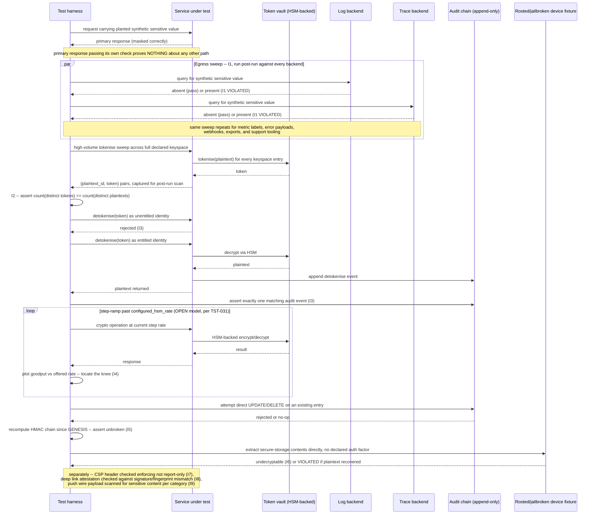

# Data Protection, Masking & Tokenisation

Status: Draft | Last Reviewed: 2026-08-12 | Owner: @qe-lead
Catalog ID: TST-041 | Radii
Tier Applicability: T0, T1

## 1. Applies To

| Catalog ID | Title | Document |
|---|---|---|
| SEC-008 | Data Masking | [../../patterns/security/data-masking.md](../../patterns/security/data-masking.md) |
| SEC-013 | PII Tokenization (Format-Preserving) | [../../patterns/security/pii-tokenization-format-preserving.md](../../patterns/security/pii-tokenization-format-preserving.md) |
| SEC-004 | Tokenization + HSM Key Management | [../../patterns/security/tokenization-hsm.md](../../patterns/security/tokenization-hsm.md) |
| SEC-012 | Tamper-Evident Audit Logging | [../../patterns/security/audit-logging-tamper-evident.md](../../patterns/security/audit-logging-tamper-evident.md) |
| MOB-002 | Mobile Secure Storage | [../../patterns/mobile/mobile-secure-storage.md](../../patterns/mobile/mobile-secure-storage.md) |
| FE-003 | Web CSP Hardening | [../../patterns/frontend/web-csp-hardening.md](../../patterns/frontend/web-csp-hardening.md) |
| MOB-005 | Mobile Deep Link Attestation | [../../patterns/mobile/mobile-deep-link-attestation.md](../../patterns/mobile/mobile-deep-link-attestation.md) |
| MOB-004 | Mobile Push Notification (Secure) | [../../patterns/mobile/mobile-push-notification-secure.md](../../patterns/mobile/mobile-push-notification-secure.md) |

These eight rows share one archetype because each names a distinct point at which a sensitive
value, or the control protecting it, can leak or be defeated, and every one of them is verified
the same way: prove the declared protection holds by looking at the value or the control from the
outside — querying the log, trace, or storage backend a naive test would never touch — rather than
trusting the primary API response or the on-screen display. SEC-008 Data Masking and SEC-013 PII
Tokenization supply the two protective techniques (irreversible masking, reversible
format-preserving tokenisation) whose leakage across every egress path I1 sweeps for; SEC-004
Tokenization + HSM Key Management supplies the HSM-backed vault whose detokenisation gate I3
exercises and whose crypto throughput I4 locates the ceiling of; SEC-012 Tamper-Evident Audit
Logging supplies the append-only chain I5 asserts against, itself the audit trail I3's
detokenisation events must land in; MOB-002 Mobile Secure Storage supplies the hardware-backed
keystore contract I6 exercises directly against a rooted or jailbroken device; FE-003 Web CSP
Hardening supplies the enforcing-versus-report-only header distinction I7 targets; MOB-005 Mobile
Deep Link Attestation supplies the Universal Link / App Link verification I8's unattested-link
rejection targets; and MOB-004 Mobile Push Notification (Secure) supplies the pull-on-notify
payload contract I9's sensitive-content check targets. The verification method is identical across
all eight — assert from outside the primary path, against the backend or store the value would
actually have to survive in for a leak to be real — only the channel differs.

## 2. Failure Taxonomy

- Data masked in the UI but present, unmasked, in application logs, distributed traces, or error
  payloads.
- A format-preserving token colliding within the declared keyspace — two distinct plaintexts
  producing the same token.
- Detokenisation permitted for a caller without the declared entitlement.
- An HSM throughput ceiling discovered only in production, because it was never located under a
  representative load in a lower environment.
- A mutable audit log, so a privileged insider's tampering with a prior entry is undetectable.
- Secure client-side storage readable on a rooted or jailbroken device without the declared
  authentication factor.
- A Content Security Policy left in report-only mode in production, so a violation is observed and
  logged but never actually blocked.
- A deep link accepted and opened without attestation, so a rogue app can intercept a payment or
  OTP link.
- A push notification payload carrying sensitive content — an amount, an account number, a
  balance — readable on a lock screen with no authentication.

## 3. Functional Test Design

**Oracle:** `invariant-assertion` — every invariant below is checked mechanically against a
running system's actual egress paths, storage, and controls, per
[TST-001 § The Four Oracles](../strategy/test-strategy-standard.md#the-four-oracles); none of them
is inferred from configuration or from the primary response alone.

### Invariants

| # | Invariant | Assertion |
|---|---|---|
| I1 | Sensitive data is absent from **every** egress path — response, logs, traces, metric labels, error payloads, webhooks, exports, and support tooling | `assert synthetic_sensitive_value NOT IN egress_backend_query(path)` for every declared egress path in [TST-008 § Egress Assertion for Sensitive Data](../strategy/security-test-standard.md#egress-assertion-for-sensitive-data), queried directly against each path's own backend after the run — never inferred from the primary API response passing its own check |
| I2 | Format-preserving tokens are collision-free across the declared keyspace | `assert count(distinct(tokens)) == count(distinct(plaintexts))` over a high-volume tokenisation run spanning the full declared keyspace — any two distinct plaintexts sharing one token is a collision, counted exactly, never sampled |
| I3 | Detokenisation requires the declared entitlement and is itself audited | `assert detokenise_call(identity_without_entitlement) == rejected` for every non-entitled identity, and `assert audit_log contains exactly one entry per successful detokenise_call`, matched by correlation ID |
| I4 | HSM operation throughput meets its declared rate, and its ceiling is known and documented | `assert hsm_knee_located == true` and `assert hsm_knee_throughput >= declared_rate`, located by the step-ramp method [TST-031](./rate-limit-breakpoint.md) defines, applied here to HSM-backed tokenise/detokenise operations rather than a rate limiter |
| I5 | Audit log entries are append-only and tamper-evident | `assert direct_update_or_delete(audit_log_entry) == rejected_or_no_op` and `assert recompute_chain(entries_since_genesis) == unbroken` — a chain-verification pass recomputes every entry's HMAC against its predecessor and fails on the first break |
| I6 | Client secure storage is inaccessible without the declared authentication | `assert extract_from_device_store(rooted_or_jailbroken_device) == undecryptable_without(declared_auth_factor)` — inspecting the on-device keystore or encrypted store directly, not through the app's own API |
| I7 | CSP is enforcing, not report-only | `assert response_header('Content-Security-Policy') is present` and `assert response_header('Content-Security-Policy-Report-Only') is absent`, and `assert injected_violating_script.executed == false` — a violation must be blocked, not merely reported |
| I8 | An unattested deep link is rejected | `assert deep_link_open(app_failing_signature_or_fingerprint_check) == falls_back_to_https_page` — the link never reaches the payment or OTP UI when the Universal Link / App Link verification fails |
| I9 | Push payloads carry no sensitive content | `assert push_wire_payload NOT IN {amount, account_number, balance, cardPan, nationalId}` for every notification category sent, inspected at the APNs/FCM wire payload itself, never at the in-app rendered content the pull-on-notify fetch produces |

**I1 is the invariant that matters most and the one most often missed.** Masking is usually
verified on the primary response only, and a control proven correct there is unproven — not
merely untested but genuinely unknown — on every other path a value can travel. Each of the
egress paths this invariant enumerates is typically built on a different serialisation path than
the primary response, per
[TST-008 § Egress Assertion for Sensitive Data](../strategy/security-test-standard.md#egress-assertion-for-sensitive-data):
a structured-logging call that serialises the whole request object bypasses the masking
interceptor wired into the API response pipeline; a stack trace embedded in an error payload
carries the raw value that triggered the exception; a webhook payload assembled from a DTO's raw
getters skips the same DTO's own masking layer; a support tool that queries the database directly
never passes through masking at all. A test suite that asserts masking once, on the response, and
calls the obligation satisfied has not tested seven of these eight paths.

### Equivalence classes and boundaries

- A sensitive value present in the primary API response, masked correctly — the canonical happy
  path every naive test already covers (I1).
- The same value, queried directly against the log backend after the run — the class this
  archetype exists to add, since it is the class a response-only check can never exercise (I1).
- The same value, queried against the trace backend, metric-label store, error-payload capture,
  webhook delivery log, batch-export artifact, and support-tooling view in turn — six further
  equivalence classes under I1, each its own distinct serialisation path per
  [TST-008](../strategy/security-test-standard.md#egress-assertion-for-sensitive-data), none of
  them inferable from any other passing.
- A tokenisation run at low volume, well inside the declared keyspace — the case a small test run
  can pass cleanly while a genuine collision risk at full keyspace volume remains completely
  unexercised (I2's boundary).
- A tokenisation run at the full declared keyspace volume — the boundary I2 actually requires;
  collision detection performed at any smaller volume is not evidence about the declared keyspace.
- A detokenisation call from an identity holding the declared entitlement — must succeed and must
  be audited (I3).
- The identical call from an identity one entitlement short of the declared requirement — must be
  rejected, not merely logged as suspicious (I3's boundary).
- Offered HSM-backed crypto operation rate below the located knee — throughput tracks offered rate
  and latency stays flat, per [TST-031 § The knee, defined](./rate-limit-breakpoint.md#5-canonical-harness--jmeter).
- Offered rate at and beyond the located knee — the ceiling itself, which must be documented as a
  known capacity limit rather than discovered for the first time in production (I4).
- An audit log entry inserted through the normal append path — must succeed and extend the chain
  (I5).
- The identical entry targeted by a direct `UPDATE` or `DELETE` issued outside the append path —
  must be rejected or converted to a no-op, and the chain-verification pass must still report
  unbroken across every entry that was never touched (I5's boundary).
- A secure-storage read performed through the app's own API on an unmodified device — succeeds,
  because this is the path the pattern is designed for, not the path this archetype tests (I6's
  negative space).
- The identical store, inspected directly on a rooted or jailbroken device with the declared
  authentication factor absent — must remain undecryptable (I6).
- A CSP violation on a policy correctly deployed as enforcing — the violating script does not
  execute, and the violation is still reported (I7).
- The identical violation on a policy accidentally left in `Content-Security-Policy-Report-Only`
  mode — the script executes despite the report being generated, which is exactly the gap I7
  exists to catch, distinct from the report simply existing.
- A deep link opened by the verified, correctly signed bank app — succeeds and renders the payment
  or OTP UI (I8's happy path).
- The identical link presented to a device where the signature or certificate-fingerprint check
  fails — falls back to the HTTPS web page, never to a custom-scheme handler and never to any UI
  claiming to be the payment flow (I8's boundary).
- A push notification of a category declared to carry no sensitive content — the wire payload
  never contains it, checked at the APNs/FCM payload itself (I9).

### Negative paths

- A synthetic sensitive value present anywhere in the log backend after masking is declared
  active — treated as an I1 violation regardless of whether the primary API response passed its
  own masking check.
- A tokenisation run reporting a collision anywhere in the declared keyspace — treated as an I2
  violation even if every other token in the run is unique; one collision is one violation, not
  an acceptable defect rate.
- A detokenisation call missing its corresponding audit entry — treated as an I3 violation even
  when the call itself was correctly authorised, because an unaudited detokenisation is
  unauditable regardless of whether it was legitimate.
- A crypto-throughput run reporting no located knee at all — treated as an I4 violation, not a
  passing run, since an undocumented ceiling is exactly the failure mode this invariant exists to
  prevent, whether or not the tested rate happened to succeed.
- A chain-verification pass that stops at the first detected break rather than continuing to
  report every entry after it — the run must still report the full extent of the compromised
  range, not merely the first break point (I5's negative path).
- A CSP violation report arriving at `/csp-report` from a script that still executed — evidence
  the policy is report-only regardless of what the deployment configuration claims to declare
  (I7's negative path).
- A deep link that opens a custom URL scheme handler as a fallback when Universal Link / App Link
  verification fails — treated as an I8 violation; the only permitted fallback is the HTTPS web
  page, never a scheme a rogue app could also register.
- A push payload carrying a truncated or partially redacted sensitive value (for example, only
  the last four digits of an account number) — still treated as an I9 violation, since the
  declared contract is that the wire payload carries no sensitive content at all, not a reduced
  amount of it.

## 4. Performance Test Design

| Profile | Applies | Why | Threshold source |
|---|---|---|---|
| `baseline` | yes | Confirms masking-serialiser, tokenisation, and detokenisation latency have not regressed before any load-shaped run | [NFR-002](../../nfr/latency-budget-model.md) |
| `load` | yes | Proves tokenisation and detokenisation hold their declared latency and correctness at sustained declared traffic, including the audit-chain append path (I5) keeping pace | [NFR-002](../../nfr/latency-budget-model.md), [NFR-004](../../nfr/throughput-model.md) |
| `stress` | yes | This archetype's primary profile for I4: a step-ramp past the HSM-backed operation's configured rate is how the throughput ceiling is located and documented, reusing [TST-031](./rate-limit-breakpoint.md)'s breakpoint method rather than restating it | [NFR-003](../../nfr/capacity-planning-model.md) |
| `soak` | yes | Targets audit-chain growth and token-vault growth over an extended window — proves chain-verification latency and vault lookup latency do not degrade as both grow unbounded, rather than merely being declared to hold | [NFR-003](../../nfr/capacity-planning-model.md) |

**Workload model:** `open` for `stress`, per
[TST-003 § The Rule](../strategy/workload-modelling.md#the-rule) and
[TST-031 § Performance Test Design](./rate-limit-breakpoint.md#4-performance-test-design) — a
closed model self-throttles the offered rate the instant the HSM-backed operation begins
degrading, which would make the located knee an artifact of the harness rather than a property of
the HSM. `closed` for `baseline`, `load`, and `soak`, each holding a declared, bounded population
of virtual users at steady state.

**The HSM throughput ceiling is explicitly non-extrapolable.** A single Hardware Security Module
is a shared singleton with a fixed physical signing/decryption throughput: a smaller `perf`
environment sharing the same HSM as production observes the *same* ceiling production would hit,
never a fraction of it scaled down by the environment's own sizing ratio. Per
[TST-005 § Performance Environment Sizing Extrapolation](../strategy/environments-quality-gates.md#performance-environment-sizing-extrapolation),
an HSM-bound throughput figure is on the explicitly non-extrapolable list; the `stress` profile's
located knee must be recorded as the number the shared HSM itself produced, never multiplied by
any sizing ratio to fabricate a projected production figure the hardware cannot actually produce.

## 5. Canonical Harness — JMeter

```xml
<!-- Thread Group 1: bulk tokenisation load spanning the full declared keyspace, capturing every
     (plaintext, token) pair to a shared results file for post-run collision analysis (I2). -->
<ThreadGroup testname="tg-tokenisation-keyspace-sweep">
  <stringProp name="ThreadGroup.num_threads">${__P(users,50)}</stringProp>
  <stringProp name="ThreadGroup.ramp_time">${__P(rampup,60)}</stringProp>
  <stringProp name="ThreadGroup.duration">${__P(duration,1800)}</stringProp>
</ThreadGroup>

<CSVDataSet testname="synthetic_keyspace.csv (SYNTHETIC -- no real PII, no real PANs)">
  <stringProp name="filename">data/synthetic_keyspace_${__P(keyspace_ref,full)}.csv</stringProp>
  <stringProp name="variableNames">plaintext_id,pii_class,synthetic_plaintext</stringProp>
  <boolProp name="recycle">false</boolProp>
</CSVDataSet>

<HTTPSamplerProxy testname="POST /internal/v1/tokenize (I2)">
  <stringProp name="HTTPSampler.path">/internal/v1/tokenize</stringProp>
  <stringProp name="HTTPSampler.method">POST</stringProp>
</HTTPSamplerProxy>

<JSR223PostProcessor testname="append (plaintext_id, token) pair for post-run collision scan (I2)">
  <stringProp name="script"><![CDATA[
    // Every returned token is appended, one line per request, to a shared results file.
    // Collision detection runs as a separate post-run pass over this file: any token value
    // appearing against more than one distinct plaintext_id is a collision (I2).
    def token = new groovy.json.JsonSlurper().parseText(prev.getResponseDataAsString()).token
    new File(vars.get("tokenise_results_path")).append(
        vars.get("plaintext_id") + "," + token + "\n")
  ]]></stringProp>
</JSR223PostProcessor>

<!-- Thread Group 2: OPEN-model step-ramp against the HSM-backed tokenise/detokenise endpoint,
     reusing TST-031's Concurrency Thread Group + Throughput Shaping Timer unchanged to locate
     the HSM throughput ceiling (I4). -->
<kg.apc.jmeter.threads.concurrency.ConcurrencyThreadGroup testname="tg-hsm-crypto-throughput-breakpoint (OPEN model)">
  <stringProp name="TargetLevel">${__P(targetrps,200)}</stringProp>
  <stringProp name="RampUp">${__P(rampup,1)}</stringProp>
  <stringProp name="Steps">${__P(ramp_steps,10)}</stringProp>
  <stringProp name="Hold">${__P(step_hold_seconds,300)}</stringProp>
</kg.apc.jmeter.threads.concurrency.ConcurrencyThreadGroup>

<kg.apc.jmeter.timers.VariableThroughputTimer testname="Throughput Shaping Timer -- step-ramp through configured_hsm_rate">
  <collectionProp name="load_profile">
    <collectionProp name="0">
      <stringProp name="49">${__P(configured_hsm_rate,150)}</stringProp>
      <stringProp name="50">${__P(configured_hsm_rate,150)}</stringProp>
      <stringProp name="51">${__P(step_hold_seconds,300)}</stringProp>
    </collectionProp>
    <collectionProp name="1">
      <stringProp name="49">${__P(configured_hsm_rate,150)}</stringProp>
      <stringProp name="50">${__P(targetrps,200)}</stringProp>
      <stringProp name="51">${__P(step_hold_seconds,300)}</stringProp>
    </collectionProp>
  </collectionProp>
</kg.apc.jmeter.timers.VariableThroughputTimer>

<HTTPSamplerProxy testname="POST /internal/v1/detokenize (I3, I4)">
  <stringProp name="HTTPSampler.path">/internal/v1/detokenize</stringProp>
  <stringProp name="HTTPSampler.method">POST</stringProp>
</HTTPSamplerProxy>

<ResponseAssertion testname="assert unentitled identity is rejected (I3)">
  <stringProp name="Assertion.test_field">Assertion.response_code</stringProp>
  <intProp name="Assertion.test_type">8</intProp>
  <stringProp name="1">403</stringProp>
</ResponseAssertion>

<!-- Post-run only, after every prior Thread Group has stopped: assertions that query the log
     and trace backends for the synthetic sensitive value -- the only mechanism that can prove
     I1, since the primary response passing its own check proves nothing about any other path. -->
<JSR223Sampler testname="egress sweep -- query log backend for synthetic sensitive value (I1)">
  <stringProp name="script"><![CDATA[
    def egressPaths = ["logs", "traces", "metric_labels", "error_payloads",
                        "webhooks", "exports", "support_tooling"]
    def sensitiveValue = vars.get("synthetic_sensitive_value")
    egressPaths.each { path ->
        def found = EgressBackendClient.query(path, sensitiveValue) // one client per backend
        if (found) {
            AssertionResult.setFailure(true)
            AssertionResult.setFailureMessage(
                "I1 violated: synthetic sensitive value found on egress path '" + path + "'")
        }
    }
  ]]></stringProp>
</JSR223Sampler>

<ResponseAssertion testname="assert CSP header is enforcing, not report-only (I7)">
  <stringProp name="Assertion.test_field">Assertion.response_headers</stringProp>
  <collectionProp name="Assertion.test_strings">
    <stringProp name="0">Content-Security-Policy:</stringProp>
  </collectionProp>
  <intProp name="Assertion.test_type">2</intProp>
</ResponseAssertion>

<ResponseAssertion testname="assert Content-Security-Policy-Report-Only header absent (I7)">
  <stringProp name="Assertion.test_field">Assertion.response_headers</stringProp>
  <collectionProp name="Assertion.test_strings">
    <stringProp name="0">Content-Security-Policy-Report-Only:</stringProp>
  </collectionProp>
  <intProp name="Assertion.test_type">22</intProp>
  <!-- test_type 22: does NOT contain -->
</ResponseAssertion>
```

```bash
jmeter -n -t data-protection-masking-tokenisation.jmx \
  -Jusers="${JMETER_USERS}" -Jrampup="${JMETER_RAMPUP}" -Jduration="${JMETER_DURATION}" \
  -Jkeyspace_ref="${JMETER_KEYSPACE_REF}" -Jtargetrps="${JMETER_TARGETRPS}" \
  -Jconfigured_hsm_rate="${JMETER_CONFIGURED_HSM_RATE}" -Jramp_steps="${JMETER_RAMP_STEPS}" \
  -Jstep_hold_seconds="${JMETER_STEP_HOLD_SECONDS}" \
  -Jtokenise_results_path="${JMETER_TOKENISE_RESULTS_PATH}" -Jprofile="${JMETER_PROFILE}" \
  -l results.jtl -e -o report/

# Post-run, separate pass: collision scan over the tokenise-results file (I2) and chain
# verification over the audit log since the last verified GENESIS anchor (I5) -- both run as
# standalone jobs, not JMeter samplers, since both operate over the full run's accumulated
# output rather than a single request/response pair.
```

The **post-run egress sweep** (`JSR223Sampler`, run once after every Thread Group has stopped) is
this harness's load-bearing design choice, not an optional addition: it is the only mechanism that
can prove I1, because every other sampler in this plan only ever proves the primary response is
correctly masked, which is exactly the check [TST-008](../strategy/security-test-standard.md#egress-assertion-for-sensitive-data)
warns produces false confidence. The **HSM step-ramp** (Thread Group 2) reuses
[TST-031](./rate-limit-breakpoint.md#5-canonical-harness--jmeter)'s Concurrency Thread Group and
Throughput Shaping Timer unchanged, applying the identical knee-location mechanism to a
crypto-throughput ceiling rather than a rate limiter's configured rate. The **tokenisation
keyspace sweep** (Thread Group 1) writes every `(plaintext_id, token)` pair to a shared results
file rather than asserting collision-freedom inline, because collision detection is a property of
the whole run's output set, not of any single request in isolation — the same reasoning
[TST-031](./rate-limit-breakpoint.md#5-canonical-harness--jmeter) applies to its own cross-thread
tally, generalised here to a full post-run scan instead of a running counter.

## 6. Tool Fit

| Tool | Fit | When to prefer |
|---|---|---|
| JMeter | BEST | The Concurrency Thread Group and Throughput Shaping Timer give the HSM ceiling its exact step-ramp, a JSR223 Sampler drives the post-run egress sweep against arbitrary log/trace backend clients, and the same plan captures the full tokenisation-keyspace output for collision analysis — no other tool in the corpus combines native step-ramp crypto-throughput testing with an extensible post-run assertion sampler in one plan |
| k6 | good | The `ramping-arrival-rate` executor models the HSM step-ramp natively and a custom JS check can query log/trace backends post-run, but there is no first-class equivalent to a dedicated post-run sampler stage — the egress sweep must be scripted as a final, separately-invoked scenario |
| Locust | good | A custom `LoadTestShape` can approximate the step-ramp and a Python post-run script can drive the same backend queries for I1, but both require hand-built scaffolding rather than JMeter's native elements, per [TST-014](../tooling/locust.md#when-to-use-this-tool) |
| Gatling + Karate | fair | Karate can script the egress-backend queries and the detokenisation entitlement checks well, but Gatling's injection profile approximates rather than exactly reproduces the Throughput Shaping Timer's per-step rate/duration control the HSM knee-location depends on |

Record `primary_tool: jmeter` for all eight coverage rows in §1.

## 7. Overlays

Security is not a secondary overlay layered over some other primary method in this archetype — it
is the body of the document. The egress-path sweep, the tokenisation and HSM invariants, the
audit-chain check, and the client- and channel-specific invariants (§§2–6) are this archetype's
primary functional and performance test design, not an add-on to a different oracle, so there is
no separate "Security overlay" subsection here: §§2–6 already are the security verification,
cross-linking [TST-008](../strategy/security-test-standard.md#egress-assertion-for-sensitive-data)
for the egress-assertion rule rather than restating it.

### Data-quality overlay

Token collision detection over the synthetic keyspace (I2) is this archetype's data-quality
concern: the post-run scan over the tokenisation-keyspace sweep's captured output (§5) is graded
against a known ground truth — the declared keyspace's cardinality — the same way any other
data-quality check in this corpus grades a result against a counted, deliberately-sized dataset
rather than an inferred one, per
[TST-004 § Data for Each Discipline](../strategy/test-data-management.md#data-for-each-discipline).
A collision found anywhere in the scan is graded as a defect count of exactly one, never rounded
down to "acceptable" regardless of how large the keyspace is.

Resilience and Contract overlays are omitted: this archetype's failure modes are about data
exposure, tokenisation correctness, audit integrity, and client/channel-side control enforcement,
not fault tolerance under injected failure or schema/wire compatibility, so neither overlay
applies.

## 8. Test Data Requirements

Synthetic only, per [TST-004](../strategy/test-data-management.md). Entities needed: a synthetic
keyspace of PII-shaped values (CCCD-shaped national IDs, phone numbers, card PANs drawn only from
the designated test BIN ranges, account numbers marked `ACCT-SYN-*`) sized to the full declared
keyspace so I2's collision scan is meaningful rather than sampled; a distinct, single-use synthetic
sensitive value planted specifically for the I1 egress sweep, chosen so it cannot be confused with
any value already present in the environment from a prior run; a set of synthetic identities
spanning entitled and non-entitled detokenisation roles (I3); a rooted or jailbroken synthetic
device image (or emulator equivalent) for the I6 secure-storage check, distinct from the
production fleet's device population; a deliberately unsigned or fingerprint-mismatched companion
app build for the I8 deep-link attestation negative path; and a declared push-notification fixture
set covering every notification category the service sends, for the I9 wire-payload content scan.
The cardinality driver for I2 is the declared keyspace size itself — a collision scan run over any
smaller volume proves nothing about the declared keyspace. Referential-integrity requirement:
every synthetic plaintext resolves to exactly one token and every token resolves back to exactly
one plaintext through the vault, per
[TST-004 § Referential Integrity](../strategy/test-data-management.md#referential-integrity).
Teardown: purge the synthetic keyspace, the planted egress-sweep value, the token-vault entries,
and the audit-log entries this run created, at environment reset, per
[TST-005](../strategy/environments-quality-gates.md).

## 9. Evidence and Observability

Metrics to capture: per-egress-path pass/fail for the synthetic sensitive value (I1); collision
count from the tokenisation-keyspace scan, which must read exactly zero (I2); detokenisation
pass/fail per identity and the matching audit-event count, which must track 1:1 (I3); the
HSM-backed operation's goodput-versus-offered-rate and latency-versus-offered-rate curves with the
located knee marked (I4); chain-verification pass/fail across every entry since the last verified
anchor (I5); the secure-storage extraction attempt's pass/fail on the rooted/jailbroken device
fixture (I6); the CSP enforcing-versus-report-only header check and the injected-script execution
outcome (I7); the deep-link attestation pass/fail per device/app-signature combination (I8); and
the push wire-payload content scan's pass/fail per notification category (I9). Trace assertions:
every tokenise and detokenise call must carry a queryable correlation ID linking it to its audit
event, so I3's 1:1 tracking is verifiable mechanically from trace data rather than only from the
harness's own tally. Artifacts to attach to a DAB submission: the JMeter aggregate report and HTML
dashboard covering both load-shaped Thread Groups (per
[TST-005](../strategy/environments-quality-gates.md)); the egress-sweep result table, one row per
declared path; the tokenisation-keyspace collision-scan report; the HSM knee-location chart; and
the chain-verification report covering every entry since the last verified anchor.

## 10. Exit Criteria

The block below is illustrative for a synthetic service implementing this archetype's patterns —
every value is an example, not a normative one, per
[TST-001](../strategy/test-strategy-standard.md).

```yaml
test_acceptance_criteria:
  service_name: synthetic-data-protection-service
  archetypes: [TST-041]
  catalog_refs: [SEC-008, SEC-013, SEC-004, SEC-012, MOB-002, FE-003, MOB-005, MOB-004]
  functional:
    invariants_covered: 9                 # I1-I9, all nine assertable
    negative_paths_covered: 8
    oracle: invariant-assertion
  performance:
    profiles_executed: [baseline, load, stress, soak]
    workload_model: mixed                 # open for stress (HSM knee), closed elsewhere; see §4
    hsm_knee_located: true                # goodput plateau + rising latency, non-extrapolable
  security:
    egress_paths_swept: 8                 # illustrative -- every declared path, none skipped
    token_collisions: 0                   # I2 -- must read exactly zero
  data_quality:
    dq_rules_asserted: 1                  # token-collision ground-truth check (I2); see §7
    reconciliation_tolerance: 'n/a'
```

## Compliance Mapping

| Layer | Reference | Section/Control | How this satisfies |
|---|---|---|---|
| Ring 0 | OWASP ASVS — V6 (Stored Cryptography), V8 (Data Protection) | Cryptographic storage and sensitive-data handling verification | I2, I3, and I4 are the assertable form of V6's stored-cryptography requirements for a tokenisation vault; I1 is the assertable form of V8's data-protection requirement, exercised against every egress path rather than the primary response alone |
| Ring 0 | NIST SP 800-53 — SC-28 (Protection of Information at Rest) | Protection of information at rest | I2, I3, and I6 together are the control-verification evidence that information at rest — in a token vault, in a client-side secure store — is actually protected as declared, not merely configured to be |
| Ring 1 | [PCI-DSS 4.0](../../compliance/pci-dss-4-0.md) — §3 (protect stored account data), §10 (audit trails) | Protection of stored account data; logging and monitoring | §3's stored-account-data obligation is satisfied by I2's collision-free tokenisation and I4's documented HSM ceiling; §10's audit-trail obligation is satisfied by I3's detokenisation audit check and I5's tamper-evident chain verification |
| Ring 1 | GDPR Art. 32 | Security of processing | I1's egress sweep and I6's secure-storage check are the assertable evidence that appropriate technical measures protect personal data both in transit across every egress path and at rest on a client device |
| Ring 2 | Decree 13/2023 — personal-data protection ⚠️ (working summary — pending Legal review) | Personal-data protection obligations for information systems handling personal data | This archetype's egress-sweep, tokenisation, and audit-chain invariants (I1, I2, I3, I5) are the technical control most directly responsible for satisfying these personal-data protection expectations for an SBV or Legal review |

## 12. Related Patterns

- [SEC-008 Data Masking](../../patterns/security/data-masking.md)
- [SEC-013 PII Tokenization (Format-Preserving)](../../patterns/security/pii-tokenization-format-preserving.md)
- [SEC-004 Tokenization + HSM Key Management](../../patterns/security/tokenization-hsm.md)
- [SEC-012 Tamper-Evident Audit Logging](../../patterns/security/audit-logging-tamper-evident.md)
- [MOB-002 Mobile Secure Storage](../../patterns/mobile/mobile-secure-storage.md)
- [FE-003 Web CSP Hardening](../../patterns/frontend/web-csp-hardening.md)
- [MOB-005 Mobile Deep Link Attestation](../../patterns/mobile/mobile-deep-link-attestation.md)
- [MOB-004 Mobile Push Notification (Secure)](../../patterns/mobile/mobile-push-notification-secure.md)

## 13. Related Archetypes

- [TST-008 Security Test Standard](../strategy/security-test-standard.md) — supplies the
  egress-assertion rule I1 consumes directly rather than re-deriving: mask on every path, never
  the primary response alone.
- [TST-004 Test Data Management](../strategy/test-data-management.md) — supplies the synthetic-data
  prohibitions and test-BIN-range rule this archetype's §8 data requirements follow without
  exception, given this archetype is itself about data protection.
- [TST-031 Rate Limit, Throttle and Breakpoint](./rate-limit-breakpoint.md) — supplies the
  breakpoint method and knee definition this archetype's §4/§5 reuse unchanged, applied to an
  HSM-backed crypto throughput ceiling rather than a rate limiter's configured rate.
- [TST-005 Test Environments and Quality Gates](../strategy/environments-quality-gates.md) —
  supplies the non-extrapolable list this archetype's §4 cites for the HSM throughput ceiling: a
  shared-singleton HSM's observed ceiling in a smaller environment is production's own ceiling,
  never a fraction of it.
- [TST-040 AuthN/AuthZ Matrix & Token Lifecycle](./authn-authz-token-lifecycle.md) — this plan's
  other Wave F security archetype; owns the authorisation-matrix and token-lifecycle verification
  distinct from this archetype's data-egress, masking, and tokenisation scope.
- [TST-043 Client Experience, Offline Sync and Performance Budget Testing](./client-experience-offline-perf.md) —
  its own Security overlay's queued-item at-rest check is a narrow instance of this archetype's
  broader MOB-002 secure-storage invariant (I6); that overlay checks one queued payload's
  protection, this archetype checks the keystore contract itself.

## 14. Diagram


