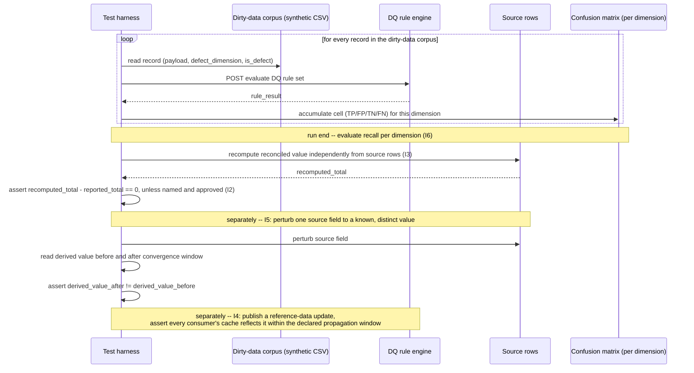

# Data Quality and Reconciliation

Status: Approved | Last Reviewed: 2026-08-12 | Owner: @qe-lead
Catalog ID: TST-039 | Radii
Tier Applicability: T0, T1, T2

## 1. Applies To

| Catalog ID | Title | Document |
|---|---|---|
| DATA-011 | Data Quality Rules | [../../patterns/data/data-quality-rules.md](../../patterns/data/data-quality-rules.md) |
| DATA-013 | Reference Data Master | [../../patterns/data/reference-data-master.md](../../patterns/data/reference-data-master.md) |
| DATA-009 | Data Lineage | [../../patterns/data/data-lineage.md](../../patterns/data/data-lineage.md) |
| DATA-002 | Data Mesh Ownership | [../../patterns/data/data-mesh-ownership.md](../../patterns/data/data-mesh-ownership.md) |

These four rows share one archetype because each one's obligation resolves to the same set of
mechanically checkable data-quality invariants, not merely a shared domain label. DATA-011 owns
the rule-engine mechanism (Great Expectations, dbt tests) whose per-rule recall this archetype
measures against a dirty-data corpus (I6). DATA-013 publishes reference-data changes that every
consumer must absorb inside a declared window — I4 is the assertable form of that propagation
contract. DATA-009 documents lineage as a diagram; I5 is the perturbation test that proves the
diagram describes a real data flow rather than an aspirational one. DATA-002 assigns data-product
ownership per domain; an unassigned owner (Failure Taxonomy) means a failure surfaced by any of
I1–I6 has nowhere to route. This archetype consumes
[TST-009 § The Six Dimensions and § Reconciliation Testing](../strategy/data-quality-test-standard.md#the-six-dimensions)'s
six-dimension vocabulary and exact-zero monetary-tolerance rule,
[TST-021 §5](../archetypes/ledger-monetary-invariant.md#5-canonical-harness--jmeter)'s
independent-recomputation technique, and
[TST-025 §3](../archetypes/decision-screening-accuracy.md#3-functional-test-design)'s
confusion-matrix method, applying all three together to a domain none of those three archetypes
individually covers: cross-system reconciliation, reference-data propagation, lineage
verification, and per-rule recall measurement.

## 2. Failure Taxonomy

- A DQ rule defined in the rules engine but never executed — the rule exists as a specification of
  what should be true, and no scheduled run has proven it fires and reports a result.
- Reconciliation run with an undeclared non-zero tolerance, silently absorbing a real break inside
  a fudge factor nobody named or approved.
- A reference-data update that does not propagate to all consumers, so two systems disagree about
  the same code's canonical value — one still holds the stale local cache entry.
- Lineage documented in a diagram or metadata catalogue entry but never verified — nobody has
  perturbed the source and confirmed the derived value actually changes the way the diagram claims.
- An unassigned data-product owner, so a data-quality failure surfaced by any rule, reconciliation,
  or lineage check has no accountable party to route to.
- Dirty records counted in aggregate but never classified by dimension, so a quality report shows
  "312 failed records" without saying how many were completeness failures versus validity failures
  versus duplicates — a number with no diagnostic value.

## 3. Functional Test Design

**Oracle:** `confusion-matrix` — primary, per
[TST-025 §3](../archetypes/decision-screening-accuracy.md#3-functional-test-design)'s
confusion-matrix method, applied here to measure each declared DQ rule's recall against the
dirty-data corpus's known, per-dimension defect counts (I6), per
[TST-009 § Dirty-Data Corpus](../strategy/data-quality-test-standard.md#dirty-data-corpus).

**This archetype declares a second, explicit oracle for two invariants only.** I2 (the monetary
reconciliation exact-zero-tolerance rule) and I3 (independent recomputation from source) are
checked by `invariant-assertion`, not by the confusion-matrix method named above — a reconciliation
break or an undeclared tolerance is a binary pass/fail assertion against a stated rule, not a
recall measurement against a labelled corpus, so the confusion-matrix oracle has nothing to compute
for either of them. A reviewer reading only the primary declaration should not flag this as a
template violation: it is a documented, deliberate two-oracle exception for this archetype only,
not an oversight, and not a precedent for any other archetype to declare more than one oracle
without the same explicit call-out.

### Invariants

| # | Invariant | Assertion |
|---|---|---|
| I1 | Every declared DQ rule executes and reports a result | `assert rule.execution_count >= 1 and rule.result in {PASS, FAIL}` for every rule declared in the ruleset, over every scheduled run window — a rule with zero executions is a taxonomy violation regardless of what its logic would have found |
| I2 | Monetary reconciliation tolerance is exactly zero; any non-zero tolerance is named and approved | `assert tolerance == 0 or tolerance in approved_tolerance_registry`, per [TST-009 § Reconciliation Testing](../strategy/data-quality-test-standard.md#reconciliation-testing)'s exact-zero rule — an undeclared or unapproved non-zero tolerance is a failing check, never a passing one with a rounding allowance |
| I3 | Reconciliation recomputes independently from source — never re-reads the same aggregate | `assert recomputed_value == derive_from_source_rows(...)`, where the derivation path is a separate code path from the one that produced the value under test, per [TST-021 §5](../archetypes/ledger-monetary-invariant.md#5-canonical-harness--jmeter)'s independent-recomputation technique |
| I4 | A reference-data change propagates to all consumers within its declared window | `assert max(consumer.cache_refresh_time for consumer in all_consumers) - update.publish_time <= declared_propagation_window` |
| I5 | Perturbing a source changes the derived value, proving the stated lineage | `assert derived_value_after != derived_value_before` when a specific source field is changed to a known, distinct value, observed within the declared convergence window, per [TST-009 § Lineage Verification](../strategy/data-quality-test-standard.md#lineage-verification) |
| I6 | Each DQ rule's recall against the dirty corpus meets its declared threshold | `assert recall(rule, dimension) >= declared_recall_target(rule, dimension)`, where `recall = defects_caught / defects_seeded`, computed per dimension against [TST-009 § Dirty-Data Corpus](../strategy/data-quality-test-standard.md#dirty-data-corpus)'s known, declared defect counts |

The recall **targets** I6 checks against are business-owned, declared per rule and per dimension,
and cited in the owning service's own `test_acceptance_criteria` submission — this archetype
defines the measurement method and the pass/fail logic, never the numeric target itself.

### Equivalence classes and boundaries

- A clean corpus record versus a record carrying exactly one deliberately seeded defect for a
  given dimension — the recall floor I6 checks.
- A monetary reconciliation at exact-zero tolerance, versus one with a named and approved non-zero
  tolerance, versus one with an undeclared non-zero tolerance — only the third is a failing check
  (I2).
- A reference-data update observed exactly at the edge of the declared propagation window, on
  either side by one measurement interval (I4).
- A source perturbation observed within the declared convergence window versus after it has
  elapsed — only the former is evidence for I5; a change observed only after the window has passed
  proves nothing about whether the window itself was honoured.
- A rule declared in the ruleset but never scheduled for execution, versus one scheduled and
  executed at least once (I1's gap case, made concrete).

### Negative paths

- A DQ rule with zero recorded executions across a full scheduled window is flagged as a taxonomy
  violation, never silently omitted from the coverage report as if it had passed by not running.
- A monetary reconciliation whose declared tolerance is non-zero and absent from the approved
  tolerance registry is rejected outright as a failing check, never accepted as "close enough."
- A reconciliation implemented by re-reading the same materialised aggregate a second time is
  rejected at review before it ever reaches a test run — it proves the read is self-consistent,
  nothing about whether the aggregate was computed correctly (I3).
- A lineage claim with no perturbation evidence attached is rejected as unverified; a diagram
  alone is never accepted as proof (I5's negative path).
- A data product with no assigned owner recorded against it is flagged before any failure ever
  needs routing, not discovered only when a failure has nowhere to go (Failure Taxonomy, DATA-002).

## 4. Performance Test Design

| Profile | Applies | Why | Threshold source |
|---|---|---|---|
| `baseline` | yes | Confirms the confusion-matrix recall computation and the independent-recomputation path themselves have not regressed before any load-shaped run | [NFR-002](../../nfr/latency-budget-model.md) |
| `load` | yes | Proves DQ rule execution and reconciliation hold steady-state throughput against the dirty corpus without the rule engine itself becoming the bottleneck | [NFR-004](../../nfr/throughput-model.md) |

**Batch-scale DQ execution is asserted via TST-032, not duplicated here.**
[TST-032 § Data-quality overlay](./batch-window-cutoff.md#7-overlays) already asserts
batch-output completeness against input count for a bounded-duration batch cycle. This archetype's
`baseline` and `load` profiles cover per-call and steady-state DQ rule execution, reconciliation,
and recall measurement — not batch-window completion or restart correctness — so `scalability`,
`soak`, and `mixed` are deliberately absent here rather than restated; a service that runs its DQ
rules inside a nightly batch window claims TST-032 for that window's completion and restart
assertions in addition to this archetype's rule-execution and reconciliation invariants.

**Workload model:** `closed` for both `baseline` and `load` — each holds a declared, bounded
corpus population (the dirty-data corpus at its declared size) rather than an open arrival
process, per [TST-003](../strategy/workload-modelling.md).

## 5. Canonical Harness — JMeter

```xml
<!-- Thread Group: CLOSED model, fixed corpus population held constant per run. See TST-003. -->
<ThreadGroup testname="tg-data-quality-reconciliation">
  <stringProp name="ThreadGroup.num_threads">${__P(users,20)}</stringProp>
  <stringProp name="ThreadGroup.ramp_time">${__P(rampup,60)}</stringProp>
  <stringProp name="ThreadGroup.duration">${__P(duration,600)}</stringProp>
</ThreadGroup>

<!-- Dirty-data corpus -- one row per record, known defect_dimension and is_defect ground truth.
     Declared defect counts per dimension live alongside the corpus, per TST-009 Dirty-Data Corpus. -->
<CSVDataSet testname="synthetic_dirty_corpus.csv (SYNTHETIC -- generated, no real records)">
  <stringProp name="filename">data/synthetic_dirty_corpus.csv</stringProp>
  <stringProp name="variableNames">record_id,payload_json,defect_dimension,is_defect</stringProp>
  <boolProp name="recycle">true</boolProp>
</CSVDataSet>

<HTTPSamplerProxy testname="POST run DQ rule set against corpus record (synthetic)">
  <stringProp name="HTTPSampler.path">/v1/dq-rules/evaluate</stringProp>
  <stringProp name="HTTPSampler.method">POST</stringProp>
</HTTPSamplerProxy>

<!-- JDBC PostProcessor: independent recomputation from source rows, never re-reading the
     already-materialised aggregate the response itself claims. See TST-021 §5. -->
<JDBCPostProcessor testname="recompute reconciled value from source rows (I3)">
  <stringProp name="dataSource">dq_synth</stringProp>
  <stringProp name="query">
    SELECT SUM(amount) AS recomputed_total
    FROM source_ledger.transaction
    WHERE batch_id = ?
  </stringProp>
  <stringProp name="queryArguments">${batch_id}</stringProp>
  <stringProp name="variableNames">recomputed_total</stringProp>
</JDBCPostProcessor>

<!-- JSR223 PostProcessor: accumulate a confusion-matrix cell PER DIMENSION into a JVM-wide
     shared props object -- one Counter per dimension, not one Counter overall, since I6's
     recall target is declared per dimension. Every increment needs an explicit lock, because
     props is shared across every thread and every iteration. This is the "awkward in JMX" half
     of the primary-tool justification in Section 6. -->
<JSR223PostProcessor testname="accumulate per-dimension confusion-matrix cell (I6)">
  <stringProp name="script"><![CDATA[
    def dimension = vars.get("defect_dimension");
    def expectedDefect = vars.get("is_defect") == "true";
    def caughtDefect = vars.get("rule_result") == "FAIL";
    def cell = (expectedDefect && caughtDefect) ? "tp"
              : (!expectedDefect && caughtDefect) ? "fp"
              : (!expectedDefect && !caughtDefect) ? "tn"
              : "fn";

    synchronized (props) {
        def key = "confusion." + dimension + "." + cell;
        def current = (props.get(key) ?: "0") as int;
        props.put(key, String.valueOf(current + 1));
    }
  ]]></stringProp>
</JSR223PostProcessor>

<!-- JSR223 Assertion: I2's exact-zero rule, BigDecimal only -- see TST-021's ban on double/float
     anywhere in a monetary-tolerance comparison chain. -->
<JSR223Assertion testname="assert reconciliation tolerance == 0 unless named and approved (I2)">
  <stringProp name="script"><![CDATA[
    import java.math.BigDecimal;

    BigDecimal recomputed = new BigDecimal(vars.get("recomputed_total"));
    BigDecimal reported   = new BigDecimal(vars.get("reported_total"));
    BigDecimal remainder  = recomputed.subtract(reported);

    if (remainder.compareTo(BigDecimal.ZERO) != 0
        && !props.getProperty("approved_tolerance_registry", "").contains(vars.get("batch_id"))) {
        AssertionResult.setFailure(true);
        AssertionResult.setFailureMessage(
            "I2 violated: undeclared/unapproved reconciliation remainder = "
            + remainder.toPlainString() + " for batch " + vars.get("batch_id")
        );
    }
  ]]></stringProp>
</JSR223Assertion>
```

```bash
jmeter -n -t data-quality-reconciliation.jmx \
  -Jusers="${JMETER_USERS}" -Jrampup="${JMETER_RAMPUP}" -Jduration="${JMETER_DURATION}" \
  -Jprofile="${JMETER_PROFILE}" -Jjdbc_url="${DQ_SYNTH_JDBC_URL}" \
  -l results.jtl -e -o report/
```

The **JSR223 PostProcessor**'s `synchronized (props)` block, keyed per dimension, is the
load-bearing — and awkward — element: `props` is the only cross-thread, cross-iteration shared
state JMeter offers, and every single per-dimension accumulation must take an explicit lock on it.
In Locust, the equivalent accumulator is one plain Python `Counter` per dimension, updated inline
by every simulated user's own task, with the recomputation and the source-perturbation step for I5
expressed as ordinary Python rather than a bolted-on JDBC sampler and a separate fault-injection
step:

```python
from locust import HttpUser, task, between, events
from collections import Counter
from decimal import Decimal

# One Counter per dimension, updated inline -- no synchronized shared-properties object, no
# cross-thread lock. This is the whole reason Locust is rated BEST in Section 6 below.
confusion = {dim: Counter() for dim in
             ("completeness", "accuracy", "consistency", "timeliness", "uniqueness", "validity")}

class DataQualityJourney(HttpUser):
    wait_time = between(0, 0)

    @task
    def evaluate_dirty_record(self):
        record = self.corpus_row()  # reads from the dirty-data corpus CSV
        r = self.client.post("/v1/dq-rules/evaluate", json=record["payload_json"])
        rule_result = r.json()["rule_result"]
        dimension = record["defect_dimension"]
        expected_defect = record["is_defect"] == "true"
        caught_defect = rule_result == "FAIL"

        cell = ("tp" if expected_defect and caught_defect
                else "fp" if not expected_defect and caught_defect
                else "tn" if not expected_defect and not caught_defect
                else "fn")
        confusion[dimension][cell] += 1

    @task
    def reconcile_batch(self):
        batch_id = self.next_batch_id()
        reported = Decimal(self.client.get(f"/v1/batches/{batch_id}/total").json()["total"])
        # I3: independent recomputation from source rows -- a fresh query against the
        # source table, never a second read of the same materialised aggregate.
        recomputed = self.recompute_from_source_rows(batch_id)
        remainder = recomputed - reported
        assert remainder == 0 or batch_id in self.approved_tolerance_registry, (
            f"I2 violated: undeclared/unapproved remainder {remainder} for batch {batch_id}"
        )

    @task
    def perturb_source_and_observe(self):
        # I5: change a specific source field to a known, distinct value; assert the derived
        # value changes within the declared convergence window, proving the stated lineage.
        before = self.read_derived_value()
        self.perturb_source_field(known_distinct_value=True)
        after = self.read_derived_value_after_convergence_window()
        assert after != before, "I5 violated: perturbed source, derived value did not change"

@events.test_stop.add_listener
def evaluate_recall_per_dimension(environment, **kwargs):
    # I6: evaluated once, at run end, per dimension against declared per-dimension targets.
    for dimension, counts in confusion.items():
        tp, fn = counts["tp"], counts["fn"]
        recall = tp / (tp + fn) if (tp + fn) else 0
        target = environment.parsed_options.declared_recall_targets[dimension]
        assert recall >= target, f"I6 violated for {dimension}: recall {recall} < target {target}"
```

## 6. Tool Fit

| Tool | Fit | When to prefer |
|---|---|---|
| JMeter | good | The JDBC PostProcessor and JSR223 Assertion give direct, in-plan control over independent recomputation (I3) and the exact-zero check (I2), but every per-dimension confusion-matrix accumulation touches a JVM-wide shared `props` object under an explicit lock rather than an ordinary counter |
| Gatling + Karate | fair | Karate can assert response-level rule results cleanly, but Gatling's Scala DSL has no idiomatic mutable cross-session counter, so a per-dimension confusion matrix and a source-recomputation step both need an external side-channel bolted onto the scenario |
| k6 | fair | k6's `Counter` custom metrics can tally TP/FP/TN/FN per dimension, but k6 has no native SQL/JDBC capability at all, so both I3's recomputation and the source-perturbation step for I5 need an external script or extension |
| Locust | BEST | Independent recomputation and per-dimension defect accounting are natural in Python — a plain `Counter` per dimension updated inline, a source-recomputation query issued from the same task, a source-perturbation step expressed as an ordinary function call — and awkward everywhere else: a synchronized, JVM-wide shared object in JMeter, no idiomatic mutable shared state in Gatling/Karate, and no native SQL capability in k6 |

Record `primary_tool: locust` for all four coverage rows in §1 — the independent-recomputation and
per-dimension defect-accounting problem is identical for every row regardless of which of the four
patterns owns the data under test.

## 7. Overlays

### Data-quality overlay

Data-quality **is** the body of this document, not a subsection restating it. The Six Dimensions
from [TST-009](../strategy/data-quality-test-standard.md#the-six-dimensions), the exact-zero
reconciliation rule, the independent-recomputation technique, the lineage-perturbation method, and
the confusion-matrix recall measurement are this archetype's entire subject — §3 through §6 above
are what a Data-quality overlay subsection would otherwise summarise in every other archetype that
carries one. There is nothing left to add here that §3–§6 have not already stated as the
archetype's own invariants and harness.

Resilience, Contract, and Security overlays are omitted: this archetype's failure modes are about
data-quality correctness — rule execution, reconciliation, reference-data propagation, lineage, and
ownership — not fault tolerance under injected failure, schema/wire compatibility, or access
control, so none of those three overlays applies.

## 8. Test Data Requirements

Synthetic only, per [TST-004](../strategy/test-data-management.md). Entities needed: a deliberately
dirty synthetic corpus with a declared, known defect count per dimension (for example 50 records
with a missing required field for `completeness`, 15 duplicate natural keys for `uniqueness`, 20
out-of-domain currency codes for `validity`), generated per
[TST-009 § Dirty-Data Corpus](../strategy/data-quality-test-standard.md#dirty-data-corpus); a set of
synthetic source rows for the independent-recomputation path (I3), structurally separate from the
materialised aggregate the reconciliation compares against; a synthetic reference-data change event
and a declared consumer list, each consumer carrying its own cache-refresh timestamp, for I4's
propagation-window measurement; a synthetic source field eligible for perturbation and a downstream
derived value it feeds, for I5; and a data-product ownership record for every DATA-002 domain
exercised, so the ownership negative path in §3 has a genuine registry to check against rather than
an assumed default. Referential integrity requirement: every dirty-corpus record's
`defect_dimension` and `is_defect` ground truth is assigned independently of the rule engine under
test, before the run starts, never inferred from the engine's own output after the fact — the same
discipline [TST-025 §8](../archetypes/decision-screening-accuracy.md#8-test-data-requirements)
requires of its labelled corpus. Teardown: purge the synthetic corpus, source rows, reference-data
events, and ownership records created for the run, at environment reset, per
[TST-005](../strategy/environments-quality-gates.md).

## 9. Evidence and Observability

Metrics to capture: the confusion matrix (TP/FP/TN/FN) and derived recall, per dimension, at run
end (I6); the reconciliation remainder, recomputed independently from source, which must be exactly
zero for every batch absent a named and approved exception (I2, I3); the per-rule execution count
across the full scheduled window, which must be at least one for every declared rule (I1); the
propagation-window measurement — elapsed time from a reference-data update's publish timestamp to
the last consumer's cache refresh (I4); and the before/after derived-value diff from the
source-perturbation step (I5). Trace assertions: a reconciliation's trace must show the independent
recomputation query executing against source rows, not a second read of the already-materialised
aggregate. Artifacts to attach to a DAB submission: the JMeter aggregate report and HTML dashboard,
or the Locust distribution report when Locust is the primary tool, per
[TST-005](../strategy/environments-quality-gates.md); the per-dimension recall summary (TP/FP/TN/FN,
recall) per run; the reconciliation remainder report per batch; the propagation-window measurement
per reference-data update; and the source-perturbation before/after diff for I5.

## 10. Exit Criteria

The block below is illustrative for a synthetic service implementing this archetype's patterns —
every value is an example, not a normative one, per [TST-001](../strategy/test-strategy-standard.md).

```yaml
test_acceptance_criteria:
  service_name: synthetic-data-quality-service
  archetypes: [TST-039]
  catalog_refs: [DATA-011, DATA-013, DATA-009, DATA-002]
  functional:
    invariants_covered: 6                 # I1-I6, all six assertable
    negative_paths_covered: 5
    oracle: confusion-matrix              # primary; I2/I3 use invariant-assertion, see §3
  performance:
    profiles_executed: [baseline, load]   # batch-scale DQ execution asserted via TST-032, see §4
    workload_model: closed
  data_quality:
    dq_rules_asserted: 6                  # one per dimension, recall-measured against the corpus
    reconciliation_tolerance: '0'
```

## Compliance Mapping

| Layer | Reference | Section/Control | How this satisfies |
|---|---|---|---|
| Ring 0 | DAMA-DMBOK Data Quality Dimensions | Completeness, accuracy, consistency, timeliness, uniqueness, validity | I6's per-dimension recall measurement against the dirty-data corpus is the assertable, mechanically-checked evidence that every one of the six dimensions is actually caught by its declared rule, not merely specified |
| Ring 1 | [Basel BCBS 239](../../compliance/basel-bcbs-239.md) — Principle 3 (Accuracy and Integrity) | Risk data must be accurate and reconcilable to source | I2 and I3's exact-zero tolerance and independent-recomputation rule are the test evidence Principle 3's accuracy expectation requires for every reconciliation this archetype covers |
| Ring 1 | [Basel BCBS 239](../../compliance/basel-bcbs-239.md) — Principle 4 (Completeness) | Risk data aggregation must capture all material risk data | I1's every-rule-executes invariant and I6's recall measurement together are the completeness evidence: no declared rule silently skipped, and each rule's actual catch rate measured against known defects rather than assumed |
| Ring 1 | [Basel BCBS 239](../../compliance/basel-bcbs-239.md) — Principle 5 (Timeliness) | Risk data must be available within required reporting timeframes | I4's reference-data propagation-window check is the assertable form of Principle 5's timeliness expectation applied to reference-data consistency across consumers |
| Ring 2 | SBV Circular 09/2020/TT-NHNN — reporting-accuracy obligations ⚠️ (working summary — pending Legal review) | Regulatory report accuracy | Reconciliation and lineage-verification evidence (I2, I3, I5), retained per [TST-005](../strategy/environments-quality-gates.md), is the artifact produced for an SBV review of regulatory reporting accuracy |

## 12. Related Patterns

- [DATA-011 Data Quality Rules](../../patterns/data/data-quality-rules.md)
- [DATA-013 Reference Data Master](../../patterns/data/reference-data-master.md)
- [DATA-009 Data Lineage](../../patterns/data/data-lineage.md)
- [DATA-002 Data Mesh Ownership](../../patterns/data/data-mesh-ownership.md)

## 13. Related Archetypes

- [TST-009 Data Quality Test Standard](../strategy/data-quality-test-standard.md) — supplies the
  six-dimension vocabulary and the exact-zero reconciliation rule this archetype's I2 and I6 apply
  rather than restate.
- [TST-021 Ledger and Monetary Invariant](./ledger-monetary-invariant.md) — supplies the
  independent-recomputation technique this archetype's I3 reuses for cross-system reconciliation
  rather than ledger-balance recomputation; that document's own §13 already forward-referenced this
  archetype for exactly this reuse.
- [TST-025 Decision Table and Screening Accuracy](./decision-screening-accuracy.md) — supplies the
  confusion-matrix method this archetype's primary oracle applies to per-dimension DQ-rule recall
  rather than decisioning accuracy.
- [TST-032 Batch Window and Cutoff Throughput](./batch-window-cutoff.md) — owns batch-scale DQ
  execution's window-completion and restart-idempotency assertions; this archetype's §4
  deliberately does not restate them, closing the forward reference that document's own §13
  recorded against this archetype.

## 14. Diagram


