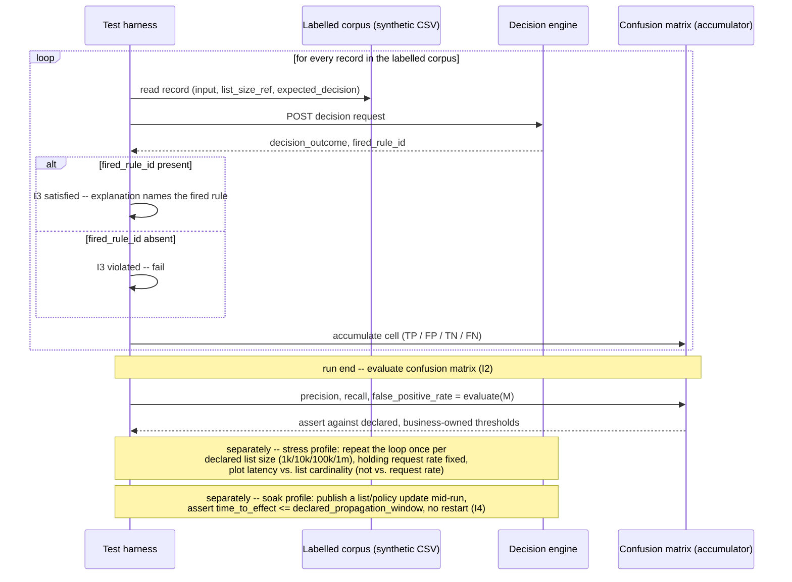

# Decision Table and Screening Accuracy

Status: Approved | Last Reviewed: 2026-08-12 | Owner: @qe-lead
Catalog ID: TST-025 | Radii
Tier Applicability: T0, T1

## 1. Applies To

| Catalog ID | Title | Document |
|---|---|---|
| BSP-010 | Rule / Decisioning Engine | [../../patterns/banking-solutions/rule-decisioning-engine.md](../../patterns/banking-solutions/rule-decisioning-engine.md) |
| BSP-003 | Sanction Screening Pipeline | [../../patterns/banking-solutions/sanction-screening-pipeline.md](../../patterns/banking-solutions/sanction-screening-pipeline.md) |
| BSP-019 | Collections Engine | [../../patterns/banking-solutions/collections-engine.md](../../patterns/banking-solutions/collections-engine.md) |
| SEC-009 | Fraud Signal Collection | [../../patterns/security/fraud-signal-collection.md](../../patterns/security/fraud-signal-collection.md) |
| SEC-010 | Attribute-Based Access Control | [../../patterns/security/attribute-based-access-control.md](../../patterns/security/attribute-based-access-control.md) |

These five rows share one archetype because they share one method of verification, not merely a
domain: each one resolves an input to exactly one decision by evaluating it against a rule set,
list, or policy, and each one's accuracy is measured the same way — precision, recall, and
false-positive rate against a labelled corpus of inputs whose correct decision is already known.
BSP-010 evaluates business rules; BSP-003 screens counterparties against sanction lists; BSP-019
decisions collections treatment; SEC-009 scores fraud signals; SEC-010 evaluates access-control
policy. The decisioning subject differs in every row; the confusion-matrix method that proves the
decision is correct does not.

`SEC-010` is explicitly shared with
[TST-040 AuthN/AuthZ Matrix & Token Lifecycle](./authn-authz-token-lifecycle.md), which also
claims this catalog row, for its own authorisation-matrix-sweep and token-lifecycle coverage. This
document claims `SEC-010` first, for the decision-accuracy half of its testing obligation only;
TST-040 appends `TST-040` to `SEC-010`'s `archetypes:` list in the coverage matrix rather than
overwriting this archetype's claim, and the two obligations remain independent halves of the same
catalog row. See §6 for the row's `primary_tool` resolution — TST-040 has since claimed that
single field as `jmeter` for its own matrix-sweep and mTLS-keystore obligation; this archetype's
own confusion-matrix method and its `locust` recommendation for that method are unaffected.

## 2. Failure Taxonomy

- Overlapping rules producing a non-deterministic decision, where two or more rules match the
  same input with conflicting outcomes and the result depends on evaluation order rather than a
  declared resolution rule.
- No default rule, so an input that matches nothing falls through silently instead of resolving
  to an explicit, declared outcome.
- A fuzzy-match threshold tuned so false negatives pass unnoticed — the threshold is loose enough
  that a genuine match is scored as a non-match, and no one notices because a non-match produces
  no alert.
- A list or policy update not taking effect until restart, so a newly added entry is silently
  absent from decisions made in the gap between publication and the next deployment.
- A decision with no explanation, so a regulator query — "why was this transaction blocked, why
  was this access denied" — cannot be answered from the decision record alone.
- Screening latency growing with list cardinality, so a screening engine that meets its latency
  budget against a small test list silently misses it once the production list grows.
- An unreachable rule that can never fire, because its condition is subsumed by an earlier rule,
  contradicted by its own preconditions, or gated behind a flag that is never set — the rule looks
  present in the ruleset but contributes nothing to any decision.

## 3. Functional Test Design

**Oracle:** `confusion-matrix` — precision, recall, and false-positive rate computed against a
labelled corpus, per
[TST-001 § The Four Oracles](../strategy/test-strategy-standard.md#the-four-oracles).

### Invariants

| # | Invariant | Assertion |
|---|---|---|
| I1 | Every input matches exactly one decision path — no overlap, no gap | `assert count(matched_decision_paths(input)) == 1` for every input in the corpus and boundary matrix — never `0` (a gap) and never `>1` (an overlap) |
| I2 | Precision, recall, and false-positive rate against the labelled corpus meet the declared thresholds | `assert precision >= declared_precision_target and recall >= declared_recall_target and false_positive_rate <= declared_fp_rate_target`, all three computed from the confusion matrix accumulated over the full labelled corpus |
| I3 | Every decision emits an explanation naming the rule that fired | `assert decision.explanation.rule_id is not None and decision.explanation.rule_id in ruleset.rule_ids` for every decision produced in the run |
| I4 | A list or policy update takes effect within its declared propagation window, without restart | `assert time_to_effect <= declared_propagation_window`, measured from the update's publish timestamp to the first decision that reflects it, and `assert restart_count == 0` across the measurement window |
| I5 | No rule is unreachable | `assert fired_count(rule_id) >= 1` for every `rule_id` in the ruleset across the full corpus run, backed by a dedicated static reachability sweep — see §9 |
| I6 | The same input yields the same decision until the ruleset version changes | `assert engine(input, ruleset_version) == engine(input, ruleset_version)` on repeated invocation against an unchanged ruleset version |

The precision, recall, and false-positive-rate **targets** I2 checks against are business-owned,
declared per engine, and cited in that engine's own `nfr_acceptance_criteria` /
`test_acceptance_criteria` submission — this archetype defines the measurement method and the
pass/fail logic, never the numeric target itself. A test run that hard-codes a threshold value
here, rather than reading it from the engine's own declared target, is testing against a number
this document invented, not the number the business actually owns.

### Equivalence classes and boundaries

- Exact match against a list, rule condition, or policy entry — the canonical true-positive path
  (I1, I2).
- A fuzzy or attribute-similarity match just inside the declared threshold — must resolve to a
  match; this is the recall floor I2 checks (Failure Taxonomy's tuned-threshold entry, on the
  side that must catch).
- A fuzzy or attribute-similarity match just outside the declared threshold — must resolve to no
  match; this is the false-positive ceiling I2 checks (Failure Taxonomy's tuned-threshold entry,
  on the side that must not over-alert).
- No rule or list entry matches at all — must resolve to the declared default outcome, never fall
  through silently (I1's gap case; Failure Taxonomy's no-default-rule entry, made concrete).
- Two or more rules match the same input with conflicting outcomes — must resolve deterministically
  to exactly one declared decision path, never resolved by evaluation-order accident (I1's overlap
  case; Failure Taxonomy's non-deterministic-decision entry, made concrete).
- Boundary: a list or policy update applied exactly at the edge of the declared propagation window
  (I4).
- Boundary: the smallest and largest declared list cardinality, run against the same fuzzy-match
  case at both ends, to isolate whether cardinality itself changes the *decision* (it must not) as
  distinct from the *latency* (which is §4's concern, not §3's).

### Negative paths

- A malformed input, missing a decisioning attribute the ruleset requires, is rejected before it
  reaches rule evaluation — never defaulted into an arbitrary decision path.
- A decision request evaluated against a ruleset version the requester did not declare is rejected
  explicitly, never silently evaluated against a stale cached version.
- A rule whose condition can never be satisfied by construction (subsumed, contradicted, or
  permanently flagged off) is caught by the static reachability sweep before the corpus run ever
  executes, not left to be inferred later from a zero fired-count alone (I5's negative path).
- A corpus record whose `expected_decision` disagrees with every other record sharing its exact
  input is flagged as a corpus defect and excluded from the confusion-matrix computation, never
  silently averaged into precision or recall as if it were a genuine disagreement with the engine.

## 4. Performance Test Design

| Profile | Applies | Why | Threshold source |
|---|---|---|---|
| `baseline` | yes | Confirms the decision path and confusion-matrix computation itself have not regressed before any load-shaped run | [NFR-002](../../nfr/latency-budget-model.md) |
| `load` | yes | Proves the decision engine holds steady-state throughput replaying the labelled corpus without the list or rule lookup itself becoming the bottleneck | [NFR-004](../../nfr/throughput-model.md) |
| `stress` | yes | Locates the point at which latency degrades as **list cardinality** grows, not request rate — see below | [NFR-003](../../nfr/capacity-planning-model.md) |
| `soak` | yes | Proves a list or policy update actually completes propagation within its declared window across a run long enough to cross several update cycles, and that stale-entry eviction runs rather than merely being declared | [NFR-003](../../nfr/capacity-planning-model.md) |

**Workload model:** `closed` for `baseline`, `load`, and `soak`, each holding a declared, bounded
population at steady state, per [TST-003](../strategy/workload-modelling.md). `stress` in this
archetype deliberately redefines the standard knee-finding shape from
[TST-002 § `stress`](../strategy/performance-test-standard.md#stress): the independent variable is
**list cardinality**, not open-model request rate. The harness holds request rate and virtual-user
population fixed — `closed`, per run — and re-runs the identical profile against a series of
synthetic list snapshots of increasing declared size, one run per size (see §5), plotting latency
against cardinality rather than against offered load. A screening engine that meets its latency
budget against a small test list and misses it once the production list grows is exactly the
failure this profile exists to catch, and an open-model request-rate ramp would not surface it —
the list could be small and the request rate enormous, or the list enormous and the request rate
trivial; only varying cardinality directly isolates the effect.

## 5. Canonical Harness — JMeter

```xml
<!-- Thread Group: CLOSED model, fixed population held constant across every list-size run.
     See TST-003 and the Workload model note in §4. -->
<ThreadGroup testname="tg-decision-screening-accuracy">
  <stringProp name="ThreadGroup.num_threads">${__P(users,20)}</stringProp>
  <stringProp name="ThreadGroup.ramp_time">${__P(rampup,60)}</stringProp>
  <stringProp name="ThreadGroup.duration">${__P(duration,600)}</stringProp>
</ThreadGroup>

<!-- Labelled synthetic corpus -- one row per record, ground truth in expected_decision.
     list_size_ref names which synthetic list snapshot this run is scored against (§4, §8). -->
<CSVDataSet testname="synthetic_labelled_corpus.csv (SYNTHETIC -- no real counterparties)">
  <stringProp name="filename">data/synthetic_labelled_corpus_${__P(list_size_ref,1k)}.csv</stringProp>
  <stringProp name="variableNames">record_id,input_json,list_size_ref,expected_decision</stringProp>
  <boolProp name="recycle">true</boolProp>
</CSVDataSet>

<HTTPSamplerProxy testname="POST decision (synthetic record)">
  <stringProp name="HTTPSampler.path">/v1/decisions</stringProp>
  <stringProp name="HTTPSampler.method">POST</stringProp>
</HTTPSamplerProxy>

<!-- JSR223 PostProcessor: accumulate TP/FP/TN/FN into a JVM-wide shared props object --
     this is the "awkward in JMX" part named in Section 6: props is shared across every
     thread and every iteration, so every increment must go through an explicit lock,
     unlike an ordinary in-process counter. -->
<JSR223PostProcessor testname="accumulate confusion-matrix cell (I2)">
  <stringProp name="script"><![CDATA[
    def actual = vars.get("decision_outcome");
    def expected = vars.get("expected_decision");
    def cell = (actual == "match" && expected == "match") ? "tp"
              : (actual == "match" && expected == "no-match") ? "fp"
              : (actual == "no-match" && expected == "no-match") ? "tn"
              : "fn";

    // props is a single JVM-wide java.util.Properties instance -- every thread in every
    // running sampler shares it, so the increment must be synchronized explicitly.
    synchronized (props) {
        def key = "confusion." + cell;
        def current = (props.get(key) ?: "0") as int;
        props.put(key, String.valueOf(current + 1));
    }

    // I3: explanation must name the fired rule.
    if (vars.get("fired_rule_id") == null) {
        AssertionResult.setFailure(true);
        AssertionResult.setFailureMessage(
            "I3 violated: decision for " + vars.get("record_id") + " carries no rule_id"
        );
    }
  ]]></stringProp>
</JSR223PostProcessor>

<!-- tearDown Thread Group: runs once after every ordinary thread group finishes, reads the
     shared props counters, and evaluates precision/recall/false-positive-rate (I2). -->
<TestPlan testname="tearDown Thread Group">
  <boolProp name="TestPlan.tearDown_on_shutdown">true</boolProp>
</TestPlan>
```

```bash
# One run per declared list size, per §4's stress-profile definition -- not one run total.
for size in 1k 10k 100k 1m; do
  jmeter -n -t decision-screening-accuracy.jmx \
    -Jusers="${JMETER_USERS}" -Jrampup="${JMETER_RAMPUP}" -Jduration="${JMETER_DURATION}" \
    -Jlist_size_ref="${size}" -Jprofile="${JMETER_PROFILE}" \
    -l "results-${size}.jtl" -e -o "report-${size}/"
done
```

The **JSR223 PostProcessor**'s `synchronized (props)` block is the load-bearing — and awkward —
element: `props` is the only cross-thread, cross-iteration shared state JMeter offers, and every
single accumulation into the confusion matrix must take an explicit lock on it, for the entire
duration of the run, across however many threads the profile declares. In Locust, the equivalent
accumulator is an ordinary Python object, because Locust's gevent-cooperative model lets a global
counter be updated from every simulated user without a JVM-wide shared-properties object or an
explicit lock:

```python
from locust import HttpUser, task, between, events
from collections import Counter

# Module-level: one process, one confusion matrix, updated inline by every user's own task --
# no synchronized shared-properties object, no cross-thread lock. This is the whole reason
# Locust, not JMeter, is rated BEST in Section 6 below.
confusion = Counter()

class ScreeningJourney(HttpUser):
    wait_time = between(0, 0)

    @task
    def score_record(self):
        record = self.corpus_row()  # reads from the labelled corpus CSV for this list_size run
        r = self.client.post("/v1/decisions", json=record["input_json"])
        actual = r.json()["decision_outcome"]
        expected = record["expected_decision"]

        if actual == "match" and expected == "match":
            confusion["tp"] += 1
        elif actual == "match" and expected == "no-match":
            confusion["fp"] += 1
        elif actual == "no-match" and expected == "no-match":
            confusion["tn"] += 1
        else:
            confusion["fn"] += 1

        # I3: explanation must name the fired rule.
        assert r.json().get("fired_rule_id"), (
            f"I3 violated: decision for {record['record_id']} carries no rule_id"
        )

@events.test_stop.add_listener
def evaluate_confusion_matrix(environment, **kwargs):
    # Evaluated once, at run end, against the full accumulated matrix -- I2.
    tp, fp, tn, fn = confusion["tp"], confusion["fp"], confusion["tn"], confusion["fn"]
    precision = tp / (tp + fp) if (tp + fp) else 0
    recall = tp / (tp + fn) if (tp + fn) else 0
    fp_rate = fp / (fp + tn) if (fp + tn) else 0
    assert precision >= environment.parsed_options.declared_precision_target
    assert recall >= environment.parsed_options.declared_recall_target
    assert fp_rate <= environment.parsed_options.declared_fp_rate_target
```

The difference — a plain module-level `Counter` updated inline by every task, evaluated once by an
ordinary event listener at run end, no shared-properties object and no explicit lock anywhere — is
exactly why Locust is rated `BEST` in §6 Tool Fit below. This same kind of "not JMeter"
primary-tool justification was established first in this corpus in
[TST-022 §6](./deterministic-calculation-engine.md#6-tool-fit) and applied again in
[TST-024 §6](./saga-compensation.md#6-tool-fit); it is precedent here, not novel.

## 6. Tool Fit

| Tool | Fit | When to prefer |
|---|---|---|
| JMeter | good | A `synchronized (props)` JSR223 block and a `tearDown Thread Group` can accumulate and evaluate a confusion matrix correctly, but every accumulation touches a JVM-wide shared object under an explicit lock rather than an ordinary counter |
| Gatling + Karate | fair | Gatling's Scala DSL has no idiomatic mutable cross-session counter — session state is per-virtual-user by design — so a cross-run confusion matrix requires bolting on an external side-channel (an atomic reference, an actor, or per-response rows written to a file for later reduction) |
| k6 | fair | k6's `Counter` custom metrics can tally TP/FP/TN/FN independently, but deriving precision/recall/false-positive-rate as a ratio at run end is not native to the metrics API and needs an external post-processing step |
| Locust | BEST | Accumulating and evaluating a confusion matrix across iterations is natural in Python — a plain module-level counter updated inline, evaluated by one event listener at run end — and awkward in JMX (explicit cross-thread locking) or Scala (no idiomatic mutable shared state) |

Record `primary_tool: locust` for all five coverage rows in §1 — the confusion-matrix accumulation
problem is identical for every row regardless of decisioning subject — except `BSP-019`, where
`TST-032` (Batch Window and Cutoff Throughput) has since claimed the row's `primary_tool` as
`jmeter` for its own batch-restart obligation, and `SEC-010`, where
[TST-040](./authn-authz-token-lifecycle.md) (AuthN/AuthZ Matrix & Token Lifecycle) has since
claimed the row's `primary_tool` as `jmeter` for its own matrix-sweep and mTLS-keystore
obligation; see the coverage YAML's `notes` field on each row, and TST-032 §1 / TST-040 §6, for
the resolution. `BSP-019` and `SEC-010`'s remaining sibling rows in this archetype (`BSP-010`,
`BSP-003`, `SEC-009`) remain `locust`.

## 7. Overlays

### Security overlay

For the `SEC-010` row specifically, the labelled corpus **is**
[TST-008 § Authorisation Matrix Method](../strategy/security-test-standard.md#authorisation-matrix-method)'s
cross-product of identity × resource × operation, with each cell's declared allow/deny outcome
standing in as this archetype's `expected_decision` column (§3, §5, §8). This archetype does not
re-derive that matrix; it consumes TST-008's cell set as the ground-truth corpus and runs it
through the confusion-matrix oracle, so a false allow or a false deny surfaces as a confusion-matrix
cell — an FP or an FN — rather than only as an isolated per-cell pass/fail. Verify per OWASP ASVS
V4 (Access Control), the same Ring 0 reference TST-008 cites for the matrix itself.

### Data-quality overlay

The labelled corpus's provenance — who signed off each `expected_decision`, and against what
source (a compliance-maintained list version, a business rule-book sign-off, or, for the
`SEC-010` case, TST-008's own matrix) — is recorded alongside the corpus per
[TST-004 § Seeding and Reproducibility](../strategy/test-data-management.md#seeding-and-reproducibility),
following the same discipline
[TST-009 § Dirty-Data Corpus](../strategy/data-quality-test-standard.md#dirty-data-corpus) requires
of a defect-seeded corpus: a declared true/false count per decision class, not an impression. The
corpus's refresh cadence — when list or policy content is regenerated and re-signed-off — is
declared explicitly and tracked, because a stale corpus silently drifts from the production list
or policy it stands in for, and a drifted corpus can pass its own confusion-matrix check while
testing nothing the production engine currently does.

Resilience and Contract overlays are omitted: this archetype's failure modes are about decision-path
correctness and screening accuracy against a labelled corpus, not fault tolerance under injected
failure or schema/wire compatibility, so neither overlay applies.

## 8. Test Data Requirements

Synthetic only, per [TST-004](../strategy/test-data-management.md). Entities needed: the labelled
corpus itself — one record per row, the decisioning attributes the ruleset needs, and an
`expected_decision` column sourced independently of the engine under test (for `SEC-010`, inherited
directly from TST-008's own matrix cells, per §7); a declared ruleset or policy version the corpus
was scored against; and, for the `stress` cardinality curve, a series of synthetic list snapshots
at increasing declared sizes (for example 1k / 10k / 100k / 1m entries), each internally consistent
so a given corpus record's `expected_decision` never changes as the list grows — only latency
should move. The cardinality driver for §3's boundary matrix is corpus composition: every rule,
decision path, and fuzzy-threshold edge named there must appear at least once, independent of how
many virtual users the `load` profile drives. The cardinality driver for the `stress` profile is
the declared list size itself, orthogonal to the load profile's own virtual-user count. Referential
integrity requirement: every corpus record's `expected_decision` resolves against a specific,
named ruleset or policy version, so a decision can always be traced to the exact version it was
scored against, and never silently re-scored against a version the corpus was not signed off for.
Teardown: purge the synthetic corpus load, list snapshots, and any ruleset versions created for the
run, at environment reset, per [TST-005](../strategy/environments-quality-gates.md).

## 9. Evidence and Observability

Metrics to capture: the confusion matrix (TP/FP/TN/FN counts) and the derived precision, recall,
and false-positive rate at run end (I2); the explanation-present rate across every decision in the
run, which must be exactly 100% (I3); the per-list-size latency distribution forming the
cardinality curve from the `stress` profile; the propagation-window measurement — elapsed time from
a list or policy update's publish timestamp to the first decision that reflects it (I4); and the
fired-rule count per rule ID across the full corpus run. A rule with a zero fired-count is flagged
for review, not assumed dead — a dedicated reachability sweep, a static analysis over the ruleset's
own condition graph rather than a runtime harness assertion (the same class of CI gate
[TST-022](./deterministic-calculation-engine.md#3-functional-test-design)'s I6 float-check
establishes for that archetype), is what actually closes I5, because a rule can be unreachable by
construction even in a run whose corpus happens not to exercise it. Trace assertions: a decision's
response must carry the fired rule's ID as a queryable field, so I3's explanation is checkable
mechanically rather than by reading free text. Artifacts to attach to a DAB submission: the JMeter
aggregate report and HTML dashboard, or the Locust distribution report when Locust is the primary
tool (per [TST-005](../strategy/environments-quality-gates.md)); the confusion-matrix summary
(TP/FP/TN/FN, precision, recall, false-positive rate) per run; the list-cardinality-versus-latency
curve chart from the `stress` profile; and the corpus provenance record from the Data-quality
overlay.

## 10. Exit Criteria

The block below is illustrative for a synthetic service implementing this archetype's patterns —
every value is an example, not a normative one, per [TST-001](../strategy/test-strategy-standard.md).

```yaml
test_acceptance_criteria:
  service_name: synthetic-sanction-screening-service
  archetypes: [TST-025]
  catalog_refs: [BSP-003, SEC-010]
  functional:
    invariants_covered: 6                 # I1-I6, all six assertable
    negative_paths_covered: 4
    oracle: confusion-matrix
  performance:
    profiles_executed: [baseline, load, stress, soak]
    workload_model: closed                # stress ramps list cardinality across runs, not
                                           # open arrival rate; see §4
  security:
    authz_matrix_cells_covered: 72        # illustrative -- SEC-010 case only, sourced from
                                           # TST-008's own matrix, not invented here
    token_lifecycle_cases: 0              # out of scope for this archetype; see TST-040
  data_quality:
    dq_rules_asserted: 1                  # labelled-corpus provenance and refresh-cadence check
    reconciliation_tolerance: '0'
```

## Compliance Mapping

| Layer | Reference | Section/Control | How this satisfies |
|---|---|---|---|
| Ring 0 | Confusion matrix / classifier evaluation (precision, recall, false-positive rate) | Standard classifier-accuracy evaluation method | I2 is the assertable form of this method: precision, recall, and false-positive rate computed against a labelled corpus, checked against a declared, business-owned threshold |
| Ring 0 | OWASP ASVS — V4 (Access Control) | Access-control verification | For the `SEC-010` case, the Security overlay's confusion-matrix run over TST-008's own authorisation matrix is the assertable evidence that ASVS V4's access-control verification requirement is exercised exhaustively, not sampled |
| Ring 1 | FATF Recommendation 6 | Targeted financial sanctions — financial institutions must implement real-time screening | I1, I2, and I5 are the assertable form of a real-time screening control: every input resolves to exactly one decision, screening accuracy meets its declared threshold, and no screening rule sits unreachable in the ruleset |
| Ring 1 | Basel BCBS 239 — Principle 3 (Accuracy & Integrity) | Risk and decisioning data must be accurate and reconcilable to source | I2's confusion-matrix accuracy check and I6's determinism check are the accuracy control: a screening or decisioning outcome must be measurably correct against a labelled source of truth, and reproducible given the same input and ruleset version |
| Ring 2 | SBV Circular 09/2020/TT-NHNN — §III.5 ⚠️ (working summary — pending Legal review) | AML/CFT screening of counterparties against domestic sanction lists | This archetype's confusion-matrix invariants (I1-I3, I5) are the technical control most directly responsible for satisfying §III.5's screening-accuracy and explainability expectation for an SBV review |

## 12. Related Patterns

- [BSP-010 Rule / Decisioning Engine](../../patterns/banking-solutions/rule-decisioning-engine.md)
- [BSP-003 Sanction Screening Pipeline](../../patterns/banking-solutions/sanction-screening-pipeline.md)
- [BSP-019 Collections Engine](../../patterns/banking-solutions/collections-engine.md)
- [SEC-009 Fraud Signal Collection](../../patterns/security/fraud-signal-collection.md)
- [SEC-010 Attribute-Based Access Control](../../patterns/security/attribute-based-access-control.md)

## 13. Related Archetypes

- [TST-022 Deterministic Calculation Engine](./deterministic-calculation-engine.md) — established
  the "Locust, not JMeter" primary-tool justification this archetype's §5/§6 reuse rather than
  restate.
- [TST-024 Saga and Compensation Correctness](./saga-compensation.md) — applied the same
  primary-tool justification a second time; this archetype is the third, not a novel case.
- [TST-040 AuthN/AuthZ Matrix & Token Lifecycle](./authn-authz-token-lifecycle.md) — appends
  `TST-040` to `SEC-010`'s `archetypes:` list in the coverage matrix for its own
  authorisation-matrix-sweep and token-lifecycle coverage of the same catalog row, rather than
  overwriting this archetype's decision-accuracy claim; see §1 and §6.
- This archetype's own contribution, available to reuse rather than restate: the labelled-corpus
  confusion-matrix method (§3, §5) and the list-cardinality latency curve technique (§4, §5).

## 14. Diagram


