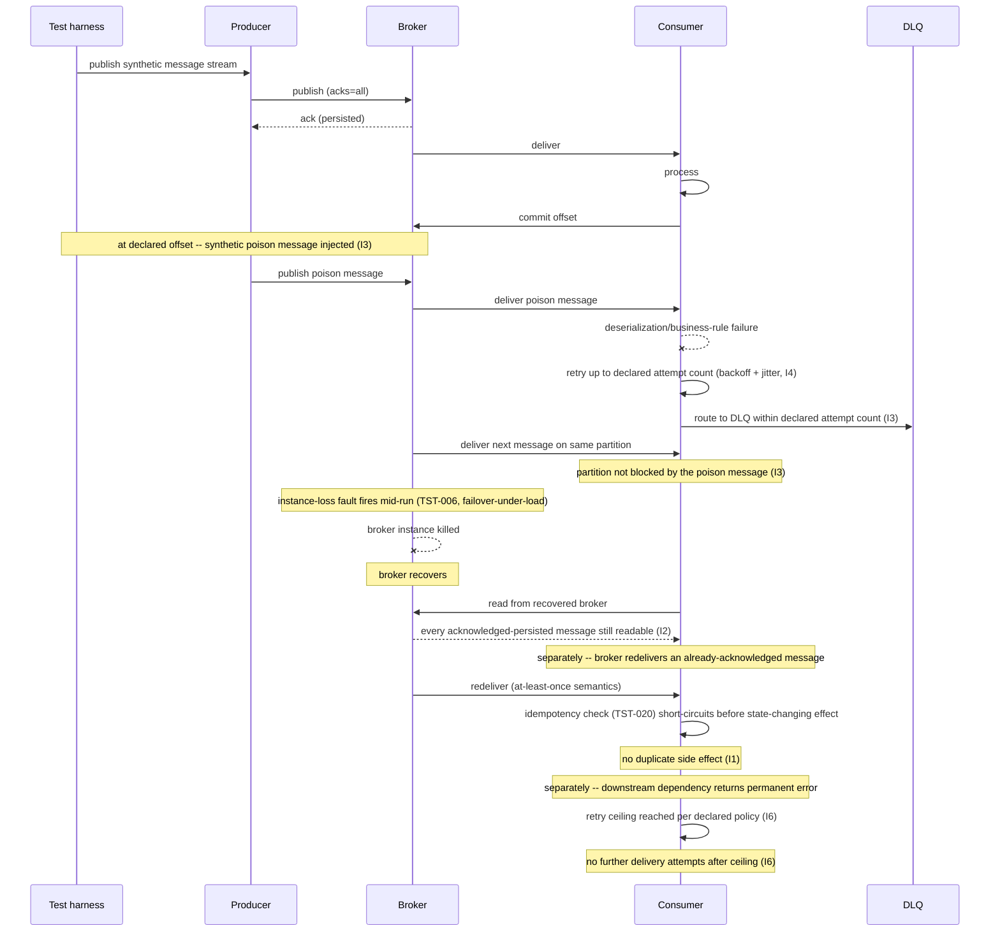

# Delivery Guarantee, Retry, and Dead Letter Queue Testing

Status: Approved | Last Reviewed: 2026-08-12 | Owner: @qe-lead
Catalog ID: TST-029 | Radii
Tier Applicability: T0, T1

## 1. Applies To

| Catalog ID | Title | Document |
|---|---|---|
| EIP-023 | Guaranteed Delivery | [../../patterns/eip/guaranteed-delivery.md](../../patterns/eip/guaranteed-delivery.md) |
| EIP-022 | Durable Subscriber | [../../patterns/eip/durable-subscriber.md](../../patterns/eip/durable-subscriber.md) |
| EIP-025 | Dead Letter Channel | [../../patterns/eip/dead-letter-channel.md](../../patterns/eip/dead-letter-channel.md) |
| EIP-021 | Channel Purger | [../../patterns/eip/channel-purger.md](../../patterns/eip/channel-purger.md) |
| EIP-001 | Message Channel | [../../patterns/eip/message-channel.md](../../patterns/eip/message-channel.md) |
| EIP-002 | Point-to-Point Channel | [../../patterns/eip/point-to-point-channel.md](../../patterns/eip/point-to-point-channel.md) |
| EIP-020 | Test Message | [../../patterns/eip/test-message.md](../../patterns/eip/test-message.md) |
| INT-014 | Webhook Delivery Reliability | [../../patterns/integration/webhook-delivery-reliability.md](../../patterns/integration/webhook-delivery-reliability.md) |

These eight rows share one archetype because each one's correctness ultimately reduces to the
same question: given a channel that can lose, duplicate, or stall a message, does the message
either reach its consumer or land somewhere observable — and does the channel itself keep working
for every other message while it does so? EIP-001 Message Channel and EIP-002 Point-to-Point
Channel are the channel abstractions this archetype's delivery, persistence, and retry mechanics
are exercised against. EIP-022 Durable Subscriber is what makes a broker restart survivable for a
disconnected consumer at all. EIP-023 Guaranteed Delivery and EIP-025 Dead Letter Channel are the
two mechanisms under direct test — the former for what must never be lost, the latter for what
must be quarantined rather than silently dropped or left blocking. EIP-021 Channel Purger is the
operational counterpart this archetype must not be confused with: it verifies that a channel *can*
be drained under maintenance, whereas this archetype verifies that a channel *does not need* to be
drained of undeliverable messages because they migrate to the DLQ automatically. EIP-020 Test
Message supplies the liveness-probe mechanism this archetype's harness reuses as a continuous
canary rather than re-deriving one; see §5.

INT-014 Webhook Delivery Reliability also appears in [TST-020](./idempotency-replay.md)'s Applies
To — that archetype covers the redelivery-must-not-duplicate-effects half of webhook reliability.
This archetype covers the other half of the same pattern: whether a webhook that a receiving
endpoint permanently rejects is retried forever or is correctly abandoned per policy (I6), and
whether an endpoint that is merely slow or transiently down is retried with the declared backoff
and jitter rather than a fixed interval (I4). The two archetypes test disjoint invariants of the
same pattern, which is why the pattern's coverage row carries both archetype IDs rather than a
duplicate row.

This archetype consumes [TST-020](./idempotency-replay.md)'s idempotency invariants directly: I1
below asserts that redelivery must not duplicate a message's effect, which is the same
exactly-once-in-effect guarantee TST-020 already proves for the request/response case, applied
here to broker-driven redelivery instead of a client-initiated retry. It also consumes
[TST-006](../strategy/resilience-test-standard.md)'s `instance-loss` fault class directly, applied
to the broker itself rather than to a stateless service instance.

## 2. Failure Taxonomy

- A message is lost on a broker restart because it was never actually persisted before the
  restart.
- A consumer acknowledges a message before processing it, so a crash between acknowledgement and
  processing loses the message.
- A poison message blocks its partition indefinitely, stalling every message queued behind it.
- The dead letter queue fills with no alert, so an operator discovers the backlog only when a
  customer complains.
- A retry issued without backoff amplifies an outage, turning a transient dependency failure into
  a self-inflicted traffic spike.
- A webhook is retried forever against an endpoint that has permanently gone away, wasting sender
  capacity on a delivery that can never succeed.
- A message redelivered after its original acknowledgement produces a duplicate side effect,
  because the consumer had no memory of having already processed it.

## 3. Functional Test Design

**Oracle:** `invariant-assertion`, per
[TST-001 § The Four Oracles](../strategy/test-strategy-standard.md#the-four-oracles).

### Invariants

| # | Invariant | Assertion |
|---|---|---|
| I1 | Every message is either processed exactly once in effect or lands in the DLQ — never silently lost | `assert (state_change_count == 1) or (message_id in dlq)` for every published message, checked against the harness's own record of what it published, not the consumer's self-report |
| I2 | A broker restart loses nothing that was acknowledged as persisted | `assert set(persisted_before_restart) ⊆ set(readable_after_restart)`, checked after a forced broker `instance-loss` fault (§5, §7) |
| I3 | A poison message reaches the DLQ within its declared attempt count and does not block its partition | `assert poison_message_dlq_arrival_attempt <= declared_max_attempts`, and `assert count(messages_delivered_after_poison_message_on_same_partition) > 0` within the harness's bounded-wait window |
| I4 | Retry intervals follow the declared backoff curve, with jitter | `assert observed_retry_interval_n ≈ declared_backoff(n) ± declared_jitter_window` for each retry attempt `n`, and `assert count(distinct_retry_intervals) > 1` across concurrently-retrying consumers — a single repeated interval is evidence jitter is not actually applied |
| I5 | DLQ depth is observable and alertable | `assert dlq_depth_metric_is_exported == true` and `assert alert_fires` when synthetic DLQ depth is driven past its declared alert threshold |
| I6 | An endpoint returning a permanent error stops being retried per the declared policy | `assert retry_count_after_permanent_error <= declared_permanent_error_retry_ceiling`, and `assert no_further_delivery_attempts` are observed after the ceiling is reached |

### Equivalence classes and boundaries

- A healthy message through a healthy channel — the baseline delivery path (I1).
- A transient-failure message that succeeds on a later retry within the declared backoff curve
  (I1, I4).
- A poison message that never succeeds and must reach the DLQ within its declared attempt count
  (I3).
- A permanent-error response (a declared non-retryable status) that must stop retrying
  immediately, not merely after the same ceiling a transient failure would exhaust (I6).
- Boundary: a poison message injected at the head of a partition versus mid-partition — both must
  reach the DLQ without blocking messages queued behind either position (I3).
- Boundary: a message acknowledged as persisted the instant before a broker `instance-loss` fault
  fires — it must survive; a message still in-flight and unacknowledged at that instant is outside
  I2's guarantee and must be handled by the producer's own retry, not silently assumed delivered.
- Boundary: the retry attempt exactly at the declared permanent-error retry ceiling — the next
  attempt after it must not occur (I6).

### Negative paths

- A message with no route to any partition (a malformed or unroutable key) is rejected at publish
  time, never accepted and then silently dropped downstream (I1's negative path).
- A DLQ replay request naming a message ID that was never actually dead-lettered is rejected, never
  silently accepted as a no-op that could mask an operator's mistaken assumption about what is in
  the DLQ.
- A retry-interval override that is smaller than the declared minimum backoff floor is rejected by
  configuration validation, never silently accepted and left to amplify load (I4's negative path).
- A DLQ-depth alert that has not fired is not reported as healthy by inference — the absence of an
  alert is checked against the metric actually being exported (I5), not treated as proof nothing is
  wrong.

## 4. Performance Test Design

| Profile | Applies | Why | Threshold source |
|---|---|---|---|
| `baseline` | yes | Confirms delivery, retry, and DLQ routing behave correctly before any load-shaped run distorts timing | [NFR-002](../../nfr/latency-budget-model.md) |
| `load` | yes | Proves the broker and DLQ path hold steady-state throughput without DLQ writes or retry traffic becoming the bottleneck | [NFR-004](../../nfr/throughput-model.md) |
| `spike` | yes | A dependency outage that turns a burst of transient failures into a retry storm is this archetype's realistic trigger — exactly the scenario I4's jitter assertion exists to prove safe | [NFR-004](../../nfr/throughput-model.md) |
| `soak` | yes | Asserts DLQ depth stays flat over the full run — a DLQ that slowly grows across a long window is the failure taxonomy's "fills with no alert" entry made concrete, and only a long enough window proves it rather than merely declaring it | [NFR-003](../../nfr/capacity-planning-model.md) |
| `failover-under-load` | yes | The decisive profile for this archetype — see below | [NFR-001](../../nfr/service-tiering-rto-rpo.md) |

**Workload model:** `open` for `spike`, modelling the retry storm as an exogenous arrival process
rather than a fixed population; `closed` for `baseline`, `load`, and `soak`, per
[TST-003](../strategy/workload-modelling.md).

**`failover-under-load` is the decisive profile for this archetype, not incidental.** Kill the
broker mid-run while publish and consume traffic continue, then assert I2 specifically — not
merely that the broker comes back up. Every message the broker had acknowledged as persisted
before the kill must still be readable by a consumer once the broker recovers; a message still
in-flight at the moment of the kill is outside this guarantee. This is the same fault-under-load
discipline [TST-006 § Fault Injection Under Load](../strategy/resilience-test-standard.md#fault-injection-under-load)
requires of every resilience assertion — made against a broker instance rather than a stateless
service instance.

## 5. Canonical Harness — JMeter

```xml
<!-- Thread Group: steady publish/consume traffic for the declared profile. -->
<ThreadGroup testname="tg-delivery-guarantee-dlq">
  <stringProp name="ThreadGroup.num_threads">${__P(users,20)}</stringProp>
  <stringProp name="ThreadGroup.ramp_time">${__P(rampup,60)}</stringProp>
  <stringProp name="ThreadGroup.duration">${__P(duration,3600)}</stringProp>
</ThreadGroup>

<!-- Kafka sampler publishing at a known, harness-controlled offset so the poison
     message's exact position in the partition is known, not incidental. -->
<KafkaProducerSampler testname="publish synthetic message stream (SYNTHETIC — no real payloads)">
  <stringProp name="kafka.topic">${__P(topic,payment-events-synthetic)}</stringProp>
  <stringProp name="kafka.key">${synthetic_message_key}</stringProp>
</KafkaProducerSampler>

<!-- At a known offset (e.g. every 500th message), inject one poison message: a
     payload the consumer's deserialiser or business-rule validation is known to
     reject deterministically, never an incidental malformed record. -->
<JSR223PreProcessor testname="inject synthetic poison message at declared offset (I3)">
  <stringProp name="script"><![CDATA[
    if (Integer.parseInt(vars.get("message_offset")) == Integer.parseInt(vars.get("__P(poison_offset,500)"))) {
        vars.put("payload", "{\"synthetic\":true,\"__poison\":\"undeserializable-by-design\"}");
    }
  ]]></stringProp>
</JSR223PreProcessor>

<!-- DLQ-depth assertion via the broker admin API (or a JDBC query against a
     DLQ-tracking table, when the DLQ is backed by JMS/a relational dead-letter
     table rather than a Kafka topic). -->
<JSR223Sampler testname="assert DLQ depth via broker admin API (I3, I5)">
  <stringProp name="script"><![CDATA[
    // e.g. AdminClient#listConsumerGroupOffsets against the DLQ topic, or a JDBC
    // COUNT(*) against a DLQ table when the harness targets a JMS broker.
    def dlqDepth = adminClient.dlqDepth(vars.get("dlq_topic"))
    vars.put("dlq_depth", dlqDepth as String)
  ]]></stringProp>
</JSR223Sampler>

<!-- Broker instance-loss during the run (TST-006), for I2 under failover-under-load. -->
<JSR223PreProcessor testname="trigger broker instance-loss mid-run (I2, TST-006)">
  <stringProp name="script"><![CDATA[
    if ("true".equals(vars.get("__P(fault_enabled,false)")) && Long.parseLong(vars.get("elapsed_ms")) > Long.parseLong(vars.get("__P(fault_at_ms,60000)"))) {
        faultController.killBrokerInstance(vars.get("broker_instance_id"));
    }
  ]]></stringProp>
</JSR223PreProcessor>
```

```bash
jmeter -n -t delivery-guarantee-dlq.jmx \
  -Jusers="${JMETER_USERS}" -Jrampup="${JMETER_RAMPUP}" -Jduration="${JMETER_DURATION}" \
  -Jpoison_offset=500 -Jprofile="${JMETER_PROFILE}" \
  -l results.jtl -e -o report/
```

The harness's liveness probe throughout the run is [EIP-020 Test Message](../../patterns/eip/test-message.md):
a synthetic, clearly-labelled canary message travels the same channel and consumer path as the
harness's own traffic, on its own schedule, and its round-trip is what proves the channel is
actually processing messages rather than merely reporting itself healthy at the infrastructure
layer. This archetype cross-links that mechanism rather than restating it — the canary's own
design, interception, and alerting are EIP-020's concern.

## 6. Tool Fit

| Tool | Fit | When to prefer |
|---|---|---|
| JMeter | BEST | Native Kafka and JMS samplers plus admin-API/JDBC assertions give direct DLQ-depth and offset-level control — no other tool in the corpus can inject a poison message at a declared offset and separately assert broker-admin DLQ depth in the same plan |
| Gatling + Karate | fair | Gatling's Kafka connector can publish and consume, and Karate can script an admin-API DLQ-depth check, but neither gives JMeter's offset-precise poison-message placement without custom protocol code |
| k6 | fair | k6's extension ecosystem (xk6-kafka) can publish and consume, but it has no first-class DLQ-depth or broker-admin assertion primitive — that check must be hand-coded against the admin API |
| Locust | good | Locust can drive sustained publish/consume load and script a DLQ-depth check via a custom client, but it lacks JMeter's built-in broker-admin and JDBC listener integrations |

## 7. Overlays

### Resilience overlay

Inject three distinct fault scenarios, each targeting a different failure mode in §2, per
[TST-006 § Fault Class Taxonomy](../strategy/resilience-test-standard.md#fault-class-taxonomy):

- `instance-loss` on the broker itself, mid-run under `failover-under-load` — asserts I2
  specifically, per §4.
- `resource-exhaustion` on the consumer — CPU, memory, or connection-pool saturation while the
  consumer is mid-redelivery — to prove that a consumer under load still acknowledges only after
  processing completes, rather than acknowledging early to relieve backpressure and silently
  reintroducing the "ack-before-process" entry in §2.
- The retry-amplification measurement from
  [TST-006 § Retry Amplification](../strategy/resilience-test-standard.md#retry-amplification):
  inject a `dependency-latency` or `dependency-error` fault against the consumer's downstream
  dependency while its retry policy remains enabled, and measure offered load on that dependency
  through fault removal and recovery — `assert offered_load_during_fault <= declared_retry_ceiling`
  and `assert no_recovery_spike`, reused here rather than re-derived, against this archetype's own
  DLQ and retry paths.

These are three distinct fault scenarios against three distinct components — the broker, the
consumer's resource envelope, and the consumer's downstream dependency — not one fault repeated
three ways.

Contract, Security, and Data-quality overlays are omitted: this archetype's failure modes are about
delivery, persistence, and retry mechanics, not schema compatibility, access control, or
data-quality reconciliation, so none of the three overlays applies.

## 8. Test Data Requirements

Synthetic only, per [TST-004](../strategy/test-data-management.md). Entities needed: a synthetic
message stream with a declared cardinality sufficient to place the poison message at a known
offset without running out of surrounding messages under any profile's peak throughput; one
synthetic poison payload per run, deterministic in how it fails (a fixed deserialisation or
business-rule rejection, never an incidental malformed record that might occasionally happen to
parse); and a synthetic permanent-error target endpoint that always returns a declared
non-retryable status, distinct from a synthetic transient-error target that returns a retryable
status a bounded number of times before succeeding. The cardinality driver is the peak in-flight
message count under `spike` and the full-run duration under `soak` — the message stream must not
be recycled mid-run, or a later assertion could be checked against a message the harness itself
already consumed. Referential-integrity requirement: every DLQ entry must resolve back to the
synthetic message ID the harness published, so I1 and I3 can be checked against the harness's own
publish record rather than the consumer's self-report alone. Teardown: purge the synthetic DLQ
entries, the synthetic dead-letter table rows (when JMS-backed), and any broker topic state the run
created, at environment reset, per [TST-005](../strategy/environments-quality-gates.md).

## 9. Evidence and Observability

Metrics to capture: delivered-count plus DLQ-count against total published count, which must
account for every message published (I1); DLQ depth over the full `soak` run, which must plateau
rather than grow (I5); observed retry-interval distribution against the declared backoff curve,
including its spread — a flat, non-jittered distribution is itself a finding (I4); retry count
after a permanent-error response, which must not exceed the declared ceiling (I6); and readable
message count immediately after broker recovery under `failover-under-load`, checked against the
pre-fault persisted-message record (I2). Trace assertions: a redelivered message's trace must show
the consumer's deduplication or idempotency check running before any state-changing span, the same
method [TST-020](./idempotency-replay.md) uses for a client-initiated replay, applied here to
broker-driven redelivery. Artifacts to attach to a DAB submission: the JMeter aggregate report and
HTML dashboard, per [TST-005](../strategy/environments-quality-gates.md#evidence-and-retention); the
fault-injection log timestamped for when `instance-loss`, `resource-exhaustion`, and the retry-
amplification fault were each introduced and removed; and the DLQ-depth time series covering the
full `soak` window.

## 10. Exit Criteria

The block below is illustrative for a synthetic service implementing this archetype's patterns —
every value is an example, not a normative one, per
[TST-001](../strategy/test-strategy-standard.md).

```yaml
test_acceptance_criteria:
  service_name: synthetic-payment-event-channel
  archetypes: [TST-029]
  catalog_refs: [EIP-023, EIP-022, EIP-025, EIP-021, EIP-001, EIP-002, EIP-020, INT-014]
  functional:
    invariants_covered: 6                 # I1-I6, all six assertable
    negative_paths_covered: 4
    oracle: invariant-assertion
  performance:
    profiles_executed: [baseline, load, spike, soak, failover-under-load]
    workload_model: open                  # spike only; see §4 above
  resilience:
    fault_scenarios: [FM41, FM42, FM43]    # this service's own instance-loss,
                                           # resource-exhaustion, and retry-amplification entries
```

## Compliance Mapping

| Layer | Reference | Section/Control | How this satisfies |
|---|---|---|---|
| Ring 0 | EIP §4 (Hohpe/Woolf) | Guaranteed Delivery — Messaging Systems | I1 and I2 are the assertable form of the Guaranteed Delivery contract: a published message survives producer, broker, and consumer failure, and is never lost between an acknowledgement and its persistence |
| Ring 0 | EIP §10 (Hohpe/Woolf) | Dead Letter Channel — Messaging Channels | I3 and I5 are the assertable form of the Dead Letter Channel contract: an unprocessable message is quarantined within a declared attempt count, does not block its partition, and its accumulation is observable |
| Ring 1 | Basel BCBS 239 — Principle 4 (Completeness) | Risk and financial data arising from message-driven processing must be complete, not silently lost | I1 is the completeness control directly: a message that is neither processed nor dead-lettered is exactly the silent loss Principle 4 prohibits |
| Ring 1 | ISO 20022 — non-repudiation of delivery | A sender must be able to demonstrate that a message was delivered, or that its non-delivery was recorded, not silently dropped | I1, I3, and I6 together are the technical control that makes non-repudiation possible: every message's fate — delivered, dead-lettered, or permanently abandoned per policy — is recorded rather than lost without trace |
| Ring 2 | SBV Circular 09/2020 §IV.2 ⚠️ (working summary — pending Legal review) | Operational continuity — no message left unresolved indefinitely during a disruption | I2's broker-restart guarantee and I5's DLQ-depth alertability are the technical controls most directly responsible for satisfying §IV.2's continuity expectation during and after a broker disruption |

## 12. Related Patterns

- [EIP-023 Guaranteed Delivery](../../patterns/eip/guaranteed-delivery.md)
- [EIP-022 Durable Subscriber](../../patterns/eip/durable-subscriber.md)
- [EIP-025 Dead Letter Channel](../../patterns/eip/dead-letter-channel.md)
- [EIP-021 Channel Purger](../../patterns/eip/channel-purger.md)
- [EIP-001 Message Channel](../../patterns/eip/message-channel.md)
- [EIP-002 Point-to-Point Channel](../../patterns/eip/point-to-point-channel.md)
- [EIP-020 Test Message](../../patterns/eip/test-message.md)
- [INT-014 Webhook Delivery Reliability](../../patterns/integration/webhook-delivery-reliability.md)

## 13. Related Archetypes

- [TST-020 Idempotency & Replay Safety](./idempotency-replay.md) — supplies the exactly-once-in-
  effect assertion method I1 reuses for broker-driven redelivery, applied here rather than
  restated; also shares INT-014 Webhook Delivery Reliability in its own Applies To, covering the
  redelivery-duplication half of that pattern while this archetype covers the retry-ceiling and
  backoff-jitter half.
- [TST-006 Resilience Test Standard](../strategy/resilience-test-standard.md) — supplies the
  `instance-loss` and `resource-exhaustion` fault classes and the Retry Amplification measurement
  method this archetype's Resilience overlay applies (§7); consumed, not restated.
- TST-035 — Fault Injection & Graceful Degradation (not yet published): reuses this archetype's
  DLQ-depth and backoff-interval assertions (§5, §9) for its own retry-amplification checks rather
  than re-deriving them.

## 14. Diagram


