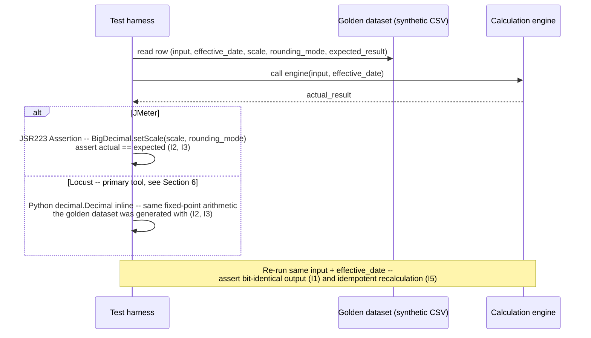

# Deterministic Calculation Engine

Status: Approved | Last Reviewed: 2026-08-12 | Owner: @qe-lead
Catalog ID: TST-022 | Radii
Tier Applicability: T0, T1

## 1. Applies To

| Catalog ID | Title | Document |
|---|---|---|
| BSP-018 | Accrual Engine | [../../patterns/banking-solutions/accrual-engine.md](../../patterns/banking-solutions/accrual-engine.md) |
| BSP-007 | Interest Calculation Engine | [../../patterns/banking-solutions/interest-calculation-engine.md](../../patterns/banking-solutions/interest-calculation-engine.md) |
| BSP-008 | Fee Engine | [../../patterns/banking-solutions/fee-engine.md](../../patterns/banking-solutions/fee-engine.md) |
| BSP-009 | Tax Calculation Engine | [../../patterns/banking-solutions/tax-calculation-engine.md](../../patterns/banking-solutions/tax-calculation-engine.md) |
| BSP-006 | Pricing Engine | [../../patterns/banking-solutions/pricing-engine.md](../../patterns/banking-solutions/pricing-engine.md) |
| BSP-020 | Relationship Pricing Engine | [../../patterns/banking-solutions/relationship-pricing-engine.md](../../patterns/banking-solutions/relationship-pricing-engine.md) |
| BSP-014 | FX Rate Engine | [../../patterns/banking-solutions/fx-rate-engine.md](../../patterns/banking-solutions/fx-rate-engine.md) |
| BSP-017 | Product Factory | [../../patterns/banking-solutions/product-factory.md](../../patterns/banking-solutions/product-factory.md) |

These eight rows share one archetype because they share one method of verification —
independent recomputation of a declared calculation against a signed-off golden dataset,
compared at an explicit decimal scale and rounding mode — not because they share a domain. An
accrual engine, an FX rate engine, and a tax engine fail in different services for different
business reasons, but every one of them fails the same way when it fails: the computed value no
longer matches the value an independent source says it should be. Product Factory belongs here
too because it assembles the rate, fee, and tax schedules these engines evaluate; the same
golden-dataset comparison method applies to its assembled output, not only to the individual
engines it composes.

## 2. Failure Taxonomy

- Rounding mode differing between the engine and the expectation.
- Day-count convention wrong at month and year boundaries.
- Leap-year and 29 February mishandling.
- Floating point used instead of decimal in the money path.
- A tiered threshold off by one at its boundary.
- An effective-dated rate change applied at the wrong instant.
- A timezone applied to a value date.
- Recalculation that is not idempotent, so re-running changes the result.

## 3. Functional Test Design

**Oracle:** `golden-dataset` — an exact expected value from a signed-off dataset, per
[TST-001 § The Four Oracles](../strategy/test-strategy-standard.md#the-four-oracles). This
archetype defines the comparison method itself — a value at a declared scale, compared under a
declared rounding mode — as its canonical contribution; [TST-038](#13-related-archetypes) reuses
this method for temporal recomputation rather than restating it.

### Invariants

| # | Invariant | Assertion |
|---|---|---|
| I1 | The same input and effective date produce a bit-identical output | `assert engine(input, effective_date) == engine(input, effective_date)` on repeated invocation against the same input snapshot, not merely a single-run read |
| I2 | Output matches the golden dataset to the declared scale | `assert actual.setScale(scale, rounding_mode) == golden_dataset.expected_result` for every row of the synthetic golden dataset |
| I3 | Rounding uses the declared mode, verified at an exact `.5` boundary | `assert round(value, scale, rounding_mode) == golden_dataset.expected_result` for a golden-dataset row whose unrounded value lands exactly on the `.5` boundary at the declared scale |
| I4 | A value exactly on a tier boundary resolves to the documented tier | `assert tier_of(boundary_value) == documented_tier` where `boundary_value` equals the declared threshold exactly, per the boundary's documented inclusive/exclusive edge |
| I5 | Recalculation is idempotent | `assert engine.recalculate(same_input) == first_result` after N ≥ 2 reruns against unchanged input |
| I6 | No floating-point arithmetic appears in the money path | `assert count(double\|float type on any amount-bearing field or variable in the money path) == 0`, enforced as a static-analysis / CI gate over the engine's own source, not a runtime harness assertion — I1–I3's decimal comparisons in the harness depend on this invariant already holding upstream |

### Equivalence classes and boundaries

- Day-count boundary: a 28-day February (non-leap), a 29-day February (leap), a 30-day month, and
  a 31-day month, each exercised against the same annualised rate, to prove the day-count
  convention's denominator is correct at every month length (I2, I3).
- Leap-year boundary: 29 February used as both an accrual start date and an accrual end date, and
  a year-end boundary (31 December to 1 January) that crosses two accounting years within one
  accrual period (I1, I2).
- Tier boundary: each declared tier threshold, tested one unit below the threshold, exactly at
  the threshold, and one unit above it (I4).
- Amount boundary: a zero amount (I2's degenerate case — must still return a defined
  golden-dataset value, never an error); the maximum permitted amount (I2, I4 at the top of the
  declared range); a negative amount where the engine's own contract permits one — a refund, a
  reversal, a negative-rate environment (I2).
- Effective-date boundary: an instant exactly at a declared rate change's effective timestamp,
  tested on both sides of that instant, expressed in the timezone the value date is declared in
  — the Failure Taxonomy's effective-dated-rate and timezone entries, made concrete.

### Negative paths

- A request whose input does not match any signed-off golden-dataset row is rejected or flagged,
  never silently computed and returned as if it had an oracle behind it.
- A rate, fee, or tax-tier lookup with no row for the given effective date is rejected explicitly,
  never defaulted to the nearest available date without disclosure.
- An amount outside the engine's declared envelope — negative where the contract forbids it, or
  beyond the declared maximum — is rejected before it reaches the calculation itself.
- A recalculation whose stored result has been mutated between runs is flagged as an idempotency
  violation (I5's negative path), never silently overwritten with the new value as if nothing had
  changed.

## 4. Performance Test Design

| Profile | Applies | Why | Threshold source |
|---|---|---|---|
| `baseline` | yes | Confirms the golden-dataset comparison path itself has not regressed before any load-shaped run | [NFR-002](../../nfr/latency-budget-model.md) |
| `load` | yes | Proves the calculation and decimal-comparison path holds steady-state throughput without the comparison itself becoming the bottleneck | [NFR-004](../../nfr/throughput-model.md) |

**Workload model:** `closed` for both profiles — each holds a declared, bounded population at
steady state, per [TST-003](../strategy/workload-modelling.md).

For engines that run inside the end-of-day batch window — an accrual engine's nightly run, for
example — aggregate batch throughput is asserted by TST-032 — Batch Window & Cutoff Throughput
(not yet published), not here. This archetype's `load` profile proves per-call correctness and
throughput of the calculation itself; it is cross-linked rather than duplicated in TST-032, which
owns the batch window's aggregate completion-time assertions.

## 5. Canonical Harness — JMeter

```xml
<!-- Thread Group: CLOSED model, valid for both `baseline` and `load`. See TST-003. -->
<ThreadGroup testname="tg-deterministic-calculation-engine">
  <stringProp name="ThreadGroup.num_threads">${__P(users,20)}</stringProp>
  <stringProp name="ThreadGroup.ramp_time">${__P(rampup,60)}</stringProp>
  <stringProp name="ThreadGroup.duration">${__P(duration,600)}</stringProp>
</ThreadGroup>

<CSVDataSet testname="synthetic_golden_dataset.csv (SYNTHETIC -- signed-off, no real accounts)">
  <stringProp name="filename">data/synthetic_golden_dataset.csv</stringProp>
  <stringProp name="variableNames">input_json,effective_date,scale,rounding_mode,expected_result</stringProp>
  <boolProp name="recycle">true</boolProp>
</CSVDataSet>

<HTTPSamplerProxy testname="POST calculate (synthetic input)">
  <stringProp name="HTTPSampler.path">/v1/calculate</stringProp>
  <stringProp name="HTTPSampler.method">POST</stringProp>
</HTTPSamplerProxy>

<JSR223Assertion testname="assert actual == expected, BigDecimal at declared scale (I2, I3)">
  <stringProp name="script"><![CDATA[
    import java.math.BigDecimal;
    import java.math.RoundingMode;

    // BigDecimal is mandatory here, at the declared scale and rounding mode -- never
    // double/float. This is the same rule I6 requires of the engine itself; the harness
    // cannot prove I2/I3 in a comparison type the engine is banned from using.
    int scale = Integer.parseInt(vars.get("scale"));
    RoundingMode mode = RoundingMode.valueOf(vars.get("rounding_mode"));

    BigDecimal actual   = new BigDecimal(vars.get("actual_result")).setScale(scale, mode);
    BigDecimal expected = new BigDecimal(vars.get("expected_result")).setScale(scale, mode);

    if (actual.compareTo(expected) != 0) {
        AssertionResult.setFailure(true);
        AssertionResult.setFailureMessage(
            "I2/I3 violated: actual=" + actual.toPlainString()
            + " expected=" + expected.toPlainString()
            + " at scale=" + scale + ", mode=" + mode
        );
    }
  ]]></stringProp>
</JSR223Assertion>
```

```bash
jmeter -n -t deterministic-calculation-engine.jmx \
  -Jusers="${JMETER_USERS}" -Jrampup="${JMETER_RAMPUP}" -Jduration="${JMETER_DURATION}" \
  -Jprofile="${JMETER_PROFILE}" \
  -l results.jtl -e -o report/
```

The golden-dataset CSV is the oracle itself: every row's `expected_result` was produced
independently of the engine under test and signed off (see the Data-quality overlay in §7), not
derived by running the engine and capturing its own output. The **JSR223 Assertion** is the
load-bearing element: it compares in `java.math.BigDecimal`, at the row's own declared `scale`
and `rounding_mode`, never `double`/`float` — the identical rule I6 requires and I2/I3 assert.

In Locust, the equivalent comparison is expressed inline using Python's own `decimal.Decimal`:

```python
from decimal import Decimal, ROUND_HALF_EVEN

# The harness reproduces the expected value using the same fixed-point arithmetic the
# golden dataset was generated with -- this inline computation IS this archetype's oracle,
# not an approximation compared against it.
scale = Decimal(10) ** -row["scale"]
actual = Decimal(response_body["result"]).quantize(scale, rounding=ROUND_HALF_EVEN)
expected = Decimal(row["expected_result"]).quantize(scale, rounding=ROUND_HALF_EVEN)
assert actual == expected, f"I2/I3 violated: actual={actual} expected={expected}"
```

That difference — Python's `decimal.Decimal` reproducing the expected value inline, in the same
language the assertion is written in — is why Locust, not JMeter, is rated `BEST` in §6 Tool Fit
below. No other tool in this corpus lets the assertion logic and the oracle mechanism be the same
decimal computation, expressed inline: JMeter's BigDecimal comparison is equally exact but sits
one step removed, in a JSR223 script bolted onto a sampler chain; k6 has no decimal type at all,
which is a real disqualifier for money arithmetic, not a stylistic preference.

## 6. Tool Fit

| Tool | Fit | When to prefer |
|---|---|---|
| JMeter | good | The JSR223 Assertion's `BigDecimal` comparison is equally exact, and the CSV Data Set Config is a natural home for a golden dataset, but the comparison logic sits in a bolted-on script rather than being the same language the oracle itself is reasoned about in |
| Gatling + Karate | fair | Karate can assert a response body against a literal expected value, but neither tool's DSL performs arbitrary-precision decimal arithmetic inline, so a rounding-mode boundary check requires an external step |
| k6 | fair | k6 has no decimal type — a real disqualifier for money arithmetic: every comparison must round-trip through JavaScript's floating-point `Number`, which is the exact defect class the Failure Taxonomy names as "floating point used instead of decimal in the money path" |
| Locust | BEST | Python's `decimal.Decimal` reproduces the expected value inline, in the same fixed-point arithmetic the golden dataset was generated with — this is precisely this archetype's oracle, not an approximation of it |

**This is the first archetype in this corpus whose primary tool is not JMeter.** Every coverage
row for the eight catalog entries in §1 records `primary_tool: locust` for the reason stated
above and demonstrated in §5: the oracle and the assertion mechanism collapse into the same
Python `decimal` computation, which no other tool in the stack offers.

## 7. Overlays

### Data-quality overlay

Every golden-dataset row's `expected_result` must be traceable to a signed-off source — a
finance or actuarial sign-off spreadsheet, a vendor reference calculation, or a previously
certified value captured before the dataset was frozen — recorded alongside the dataset's
generation seed per
[TST-004 § Seeding and Reproducibility](../strategy/test-data-management.md#seeding-and-reproducibility).
A dataset row whose expected value was itself derived by running the engine under test proves
nothing: it shows the engine agrees with itself, not that it computed the correct answer. Per
[TST-009](../strategy/data-quality-test-standard.md#reconciliation-testing)'s exact-zero
reconciliation-tolerance rule, I2's dataset comparison carries no tolerance band of its own — the
only variation permitted is the declared rounding mode's own last-digit rule, which I3 asserts
directly, never an approximate "close enough" delta.

Resilience, contract, and security overlays are omitted: this archetype's failure modes are about
calculation correctness under a deterministic golden-dataset oracle, not fault tolerance, schema
compatibility, or access control, so none of those three overlays apply.

## 8. Test Data Requirements

Synthetic only, per [TST-004](../strategy/test-data-management.md). Entities needed: the
signed-off golden dataset itself — input parameters, effective date, declared scale, declared
rounding mode, and the independently sourced `expected_result` for each row; a synthetic
rate/fee/tax-tier reference table covering every declared tier boundary named in §3; a synthetic
chart of accounts or product-tier catalog sufficient to resolve each row's account or tier
reference. The cardinality driver is the boundary matrix in §3, not load volume: every day-count
length, the leap-year and year-end dates, every tier edge (and the unit either side of it), and
the zero/maximum/negative-amount rows must each appear at least once in the dataset, independent
of how many virtual users the `load` profile drives. Referential-integrity requirement: every
dataset row's account, product, or tier reference must resolve against the synthetic reference
data seeded alongside it, using the same seed, per
[TST-004 § Seeding and Reproducibility](../strategy/test-data-management.md#seeding-and-reproducibility)
— a dataset regenerated from an unrelated seed breaks that resolution silently. Teardown: a
stateless calculation call leaves no persistent state of its own; where the engine also writes an
accrual, fee, or tax posting record as a side effect, purge those synthetic postings at
environment reset, per [TST-005](../strategy/environments-quality-gates.md).

## 9. Evidence and Observability

Metrics to capture: the per-row expected-vs-actual delta at the declared scale, which must be
exact zero for every row, not "small"; the count of golden-dataset rows exercised per boundary
class named in §3, to prove the boundary matrix was actually run and not merely declared. Trace
assertions do not apply in the usual call-path sense here — this archetype's evidence is the
comparison result itself, because the correctness question is arithmetic, not sequencing.
Artifacts to attach to a DAB submission: the JMeter aggregate report and HTML dashboard, or the
Locust distribution report when Locust is the primary tool (per
[TST-005](../strategy/environments-quality-gates.md)); the full per-row comparison output
(expected vs. actual, at declared scale) for every profile run; and the golden-dataset sign-off
record from the Data-quality overlay, so a reviewer can trace each expected value back to its
independent source.

## 10. Exit Criteria

The block below is illustrative for a synthetic service implementing this archetype's patterns —
every value is an example, not a normative one, per
[TST-001](../strategy/test-strategy-standard.md).

```yaml
test_acceptance_criteria:
  service_name: synthetic-accrual-engine
  archetypes: [TST-022]
  catalog_refs: [BSP-018, BSP-007]
  functional:
    invariants_covered: 6                 # I1-I6, all six are assertable
    negative_paths_covered: 4
    oracle: golden-dataset
  performance:
    profiles_executed: [baseline, load]
    workload_model: closed                # both profiles; see §4 above
  data_quality:
    dq_rules_asserted: 1                  # golden-dataset comparison, exact-zero at declared scale
    reconciliation_tolerance: '0'
```

## Compliance Mapping

| Layer | Reference | Section/Control | How this satisfies |
|---|---|---|---|
| Ring 0 | Decimal arithmetic over IEEE 754 for monetary values (canonical money-representation invariant) | No `double`/`float` type on the money path; fixed-point or arbitrary-precision decimal only | I6 is the assertable, mechanically checked form of this invariant — enforced as a static-analysis gate, not merely observed as "close enough" at runtime |
| Ring 1 | Basel BCBS 239 — Principle 3 (Accuracy and Integrity) | Risk and financial data must be accurate and reconcilable to source | I2's golden-dataset comparison at an explicit, declared scale is the accuracy evidence Principle 3 requires: every calculated value is checked against an independently sourced expected value, never merely plausible-looking |
| Ring 1 | IFRS 9 §B5.4 — effective-interest method determinism | The effective-interest calculation must produce a reproducible, deterministic result over the life of a financial instrument | I1 and I5 are the assertable form of this requirement: the same input and effective date reproduce a bit-identical result, and recalculation is idempotent |
| Ring 2 | SBV Circular 09/2020 §IV.3 ⚠️ (working summary — pending Legal review) | Interest and fee disclosure accuracy expectations for domestic financial reporting | This archetype's golden-dataset invariants (I1–I6) are the technical control most directly responsible for the disclosed interest and fee figures matching the amounts the engine actually computed |

## 12. Related Patterns

- [BSP-018 Accrual Engine](../../patterns/banking-solutions/accrual-engine.md)
- [BSP-007 Interest Calculation Engine](../../patterns/banking-solutions/interest-calculation-engine.md)
- [BSP-008 Fee Engine](../../patterns/banking-solutions/fee-engine.md)
- [BSP-009 Tax Calculation Engine](../../patterns/banking-solutions/tax-calculation-engine.md)
- [BSP-006 Pricing Engine](../../patterns/banking-solutions/pricing-engine.md)
- [BSP-020 Relationship Pricing Engine](../../patterns/banking-solutions/relationship-pricing-engine.md)
- [BSP-014 FX Rate Engine](../../patterns/banking-solutions/fx-rate-engine.md)
- [BSP-017 Product Factory](../../patterns/banking-solutions/product-factory.md)

## 13. Related Archetypes

- [TST-021 Ledger & Monetary Invariant](./ledger-monetary-invariant.md) — commonly runs alongside
  this archetype when a settlement or position-keeping service also owns a pricing or
  fee-calculation path. TST-021 verifies ledger balance by independent recomputation of posted
  entries; this archetype verifies the calculation feeding those entries by golden-dataset
  comparison. Neither substitutes for the other.
- TST-032 — Batch Window & Cutoff Throughput (not yet published): owns the aggregate
  batch-throughput assertions for engines that run inside the end-of-day window, per §4 above,
  rather than restating them here.
- TST-038 — Temporal & Historisation Correctness (not yet published): reuses this archetype's
  golden-dataset comparison method — an explicit scale and rounding mode — for temporal
  recomputation rather than restating it.

## 14. Diagram


