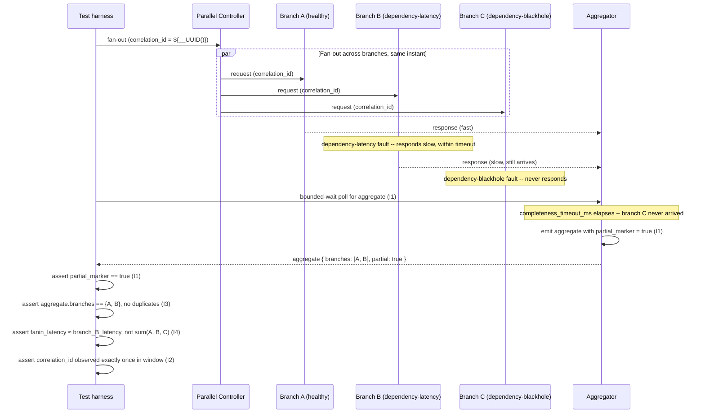

# Fan-out / Fan-in Correlation

Status: Approved | Last Reviewed: 2026-08-12 | Owner: @qe-lead
Catalog ID: TST-028 | Radii
Tier Applicability: T0, T1

## 1. Applies To

| Catalog ID | Title | Document |
|---|---|---|
| EIP-015 | Scatter-Gather | [../../patterns/eip/scatter-gather.md](../../patterns/eip/scatter-gather.md) |
| EIP-011 | Aggregator | [../../patterns/eip/aggregator.md](../../patterns/eip/aggregator.md) |
| EIP-009 | Claim Check | [../../patterns/eip/claim-check.md](../../patterns/eip/claim-check.md) |
| EIP-018 | Message Store | [../../patterns/eip/message-store.md](../../patterns/eip/message-store.md) |

These four rows share one archetype because the method of verification is identical regardless of
which leg of the fan-out/fan-in shape a given row plays: broadcast the request across branches
(EIP-015), correlate and release the aggregate under a completeness or timeout condition
(EIP-011), keep large branch payloads out of the correlation channel itself (EIP-009), and give
the correlated aggregate a durable, queryable home once it has been released (EIP-018). A test
that only ever proves one branch responds correctly proves nothing about correlation, ordering, or
completeness under mixed branch health — which is exactly the gap this archetype closes.

## 2. Failure Taxonomy

- An aggregator waiting indefinitely for a response that will never arrive.
- A partial aggregate emitted as though it were complete.
- A correlation ID collision merging two unrelated conversations.
- The slowest branch dictating total latency with no partial-result strategy.
- A claim-check payload expiring before retrieval.
- An aggregate emitted twice on retry.

## 3. Functional Test Design

**Oracle:** `invariant-assertion`

### Invariants

| # | Invariant | Assertion |
|---|---|---|
| I1 | An aggregate is emitted only when its completeness condition is met, or on timeout with an explicit partial marker | `assert aggregate_emitted == true` implies `(completeness_condition_met == true) OR (timed_out == true AND partial_marker == true)` — never emitted with neither true |
| I2 | Correlation IDs are unique within the correlation window | `assert count(occurrences(correlation_id)) == 1` for every `correlation_id` observed across the full correlation window, for every fan-out started in that window |
| I3 | Aggregate contents equal the union of received branch responses, with no duplication | `assert set(aggregate.branch_responses) == union(received_branch_responses)` AND `assert len(aggregate.branch_responses) == len(set(aggregate.branch_responses))` |
| I4 | Fan-in latency approximates the slowest branch, not the sum of branches | `assert abs(fanin_latency - max(branch_latencies)) <= declared_tolerance` AND `assert fanin_latency < sum(branch_latencies)` whenever branch count ≥ 2 |
| I5 | A claim-check reference resolves for at least its declared retention period | `assert claim_check_resolve(reference) == success` when resolved at any point up to and including `retention_period_boundary` |

### Equivalence classes and boundaries

- All branches healthy and responsive within budget — the canonical happy-path completeness case
  (I1, I3, I4).
- One branch degraded with `dependency-latency` while the remaining branches respond normally —
  proves I4's "slowest branch, not the sum" claim under a real, non-uniform branch mix.
- One branch permanently unresponsive (`dependency-blackhole`) with a declared completeness
  timeout configured — proves I1's partial-marker path fires rather than an indefinite wait.
- Two fan-outs started close enough together that their correlation IDs could plausibly collide if
  the ID generator or the correlation-window size were undersized — the boundary I2 exists to
  force explicit, not assumed.
- Boundary: a branch response arrives at the exact instant the completeness condition is
  evaluated — must be counted, not dropped by a race between arrival and evaluation (I1, I3).
- Boundary: a claim-check reference resolved at exactly its declared retention-period boundary,
  not one tick before or after (I5).

### Negative paths

- A branch response bearing a correlation ID that matches no open fan-out (an orphan) is rejected
  or logged, never silently merged into the wrong aggregate (I2's negative path).
- A duplicate branch response for the same branch, within the same fan-out — e.g. a retried
  downstream call — is deduplicated, not counted twice toward completeness (I3's negative path).
- A claim-check reference resolved after its retention period has expired returns an explicit
  not-found, never a corrupted or stale payload substituted silently (I5's negative path).
- The entire fan-out is retried by its caller after an ambiguous timeout; the resequencer must not
  emit the same aggregate a second time under a new attempt (I3's negative path; this taxonomy's
  "aggregate emitted twice on retry" defect made concrete).

## 4. Performance Test Design

| Profile | Applies | Why | Threshold source |
|---|---|---|---|
| `baseline` | yes | Confirms the completeness/timeout logic (I1) and correlation-ID uniqueness (I2) have not regressed before any load-shaped run | [NFR-002](../../nfr/latency-budget-model.md) |
| `load` | yes | Proves the aggregator holds steady-state completion under sustained, concurrent fan-outs without correlation state leaking across conversations (I2, I3) | [NFR-004](../../nfr/throughput-model.md) |
| `spike` | yes | A burst of many simultaneous fan-outs is exactly when correlation-ID collisions become likely if the ID generator or correlation-window size is undersized — this is the realistic trigger for I2, not an edge case | [NFR-004](../../nfr/throughput-model.md) |
| `failover-under-load` | yes | The decisive profile for this archetype — see below | [NFR-001](../../nfr/service-tiering-rto-rpo.md) |

**`failover-under-load` is the decisive profile for this archetype, not incidental.** Run it with
one branch made deliberately slow (`dependency-latency`) and another branch simultaneously
blackholed (`dependency-blackhole`) — never sequentially. A fan-in that only ever sees healthy
branches is untested: it has proven nothing about I1's partial-marker path, I4's slowest-branch
latency claim, or whether the two degraded branches interact (e.g. the blackholed branch's timeout
firing at the same moment the slow branch's response finally lands). See
[§7 Resilience overlay](#resilience-overlay) for the exact fault pairing.

**Workload model:** `open` for `spike` — a burst of simultaneous fan-out requests is an exogenous
arrival process the harness must not self-throttle, per
[TST-003 § Open Versus Closed Workload Models](../strategy/workload-modelling.md#open-versus-closed-workload-models).
`baseline`, `load`, and `failover-under-load` run `closed`, holding a declared, bounded population
of concurrent fan-outs.

## 5. Canonical Harness — JMeter

The harness has four load-bearing elements: a **Parallel Controller** that fans a single fan-out
out across N branch samplers concurrently rather than sequentially, `${__UUID()}` generating the
correlation ID so every fan-out's identity is unique by construction, a bounded-wait assertion on
the aggregate so the harness never reports success merely because it never checked, and one branch
deliberately routed to a blackhole endpoint to exercise I1's partial-marker path directly in the
functional harness (independent of the `failover-under-load` overlay in §7, which pairs it with a
second, simultaneously degraded branch).

```xml
<!-- Parallel Controller (plugin -- jp@gc "Parallel Controller", JMeter Plugins Project "jpgc -
     Standard" set; add to this project's pinned plugin manifest per TST-011 § Version and
     Installation -- stock JMeter has no native parallel-execution controller). Each child
     sampler below runs in its own thread, fired at the same instant, which is what makes this a
     genuine fan-out rather than N sequential requests. -->
<ParallelController testname="fan-out across 3 branches (correlation_id=${correlation_id})">
  <stringProp name="correlation_id">${__UUID()}</stringProp>

  <HTTPSamplerProxy testname="branch A (healthy, synthetic)">
    <stringProp name="HTTPSampler.path">/v1/branch-a</stringProp>
    <stringProp name="HTTPSampler.method">POST</stringProp>
    <stringProp name="HTTPSampler.postBodyRaw">{"correlationId":"${correlation_id}"}</stringProp>
  </HTTPSamplerProxy>

  <HTTPSamplerProxy testname="branch B (healthy, synthetic)">
    <stringProp name="HTTPSampler.path">/v1/branch-b</stringProp>
    <stringProp name="HTTPSampler.method">POST</stringProp>
    <stringProp name="HTTPSampler.postBodyRaw">{"correlationId":"${correlation_id}"}</stringProp>
  </HTTPSamplerProxy>

  <HTTPSamplerProxy testname="branch C -- routed to blackhole endpoint (I1 partial-marker path)">
    <stringProp name="HTTPSampler.domain">${__P(blackhole_host,blackhole.perf.internal.example)}</stringProp>
    <stringProp name="HTTPSampler.path">/v1/branch-c</stringProp>
    <stringProp name="HTTPSampler.method">POST</stringProp>
    <stringProp name="HTTPSampler.postBodyRaw">{"correlationId":"${correlation_id}"}</stringProp>
  </HTTPSamplerProxy>
</ParallelController>

<!-- Bounded-wait assertion on the aggregate (I1) -- NEVER an unbounded poll; an unbounded poll
     reports success the instant it happens to observe one, proving nothing about whether the
     aggregate arrives within its declared completeness timeout. -->
<WhileController testname="bounded-wait poll for aggregate (I1)">
  <stringProp name="WhileController.condition">
    ${__jexl3("${poll_elapsed_ms}" &lt; "${__P(completeness_timeout_ms,10000)}" &amp;&amp; "${aggregate_seen}" != "true")}
  </stringProp>
  <HTTPSamplerProxy testname="poll GET aggregate by correlation_id">
    <stringProp name="HTTPSampler.path">/v1/aggregates/${correlation_id}</stringProp>
    <stringProp name="HTTPSampler.method">GET</stringProp>
  </HTTPSamplerProxy>
</WhileController>

<JSR223Assertion testname="assert partial marker set when branch C never responded (I1)">
  <stringProp name="script"><![CDATA[
    boolean completenessMet = Boolean.parseBoolean(vars.get("completeness_condition_met"));
    boolean partialMarker = Boolean.parseBoolean(vars.get("partial_marker"));
    if (!completenessMet && !partialMarker) {
        AssertionResult.setFailure(true);
        AssertionResult.setFailureMessage(
            "I1 violated: aggregate emitted with neither completeness met nor a partial marker"
        );
    }
  ]]></stringProp>
</JSR223Assertion>
```

```bash
jmeter -n -t fanout-fanin-correlation.jmx \
  -Jusers="${JMETER_USERS}" -Jrampup="${JMETER_RAMPUP}" -Jduration="${JMETER_DURATION}" \
  -Jtargetrps="${JMETER_TARGETRPS}" -Jprofile="${JMETER_PROFILE}" \
  -Jcompleteness_timeout_ms=10000 \
  -l results.jtl -e -o report/
```

The **While Controller**'s declared `completeness_timeout_ms` bound is load-bearing for the same
reason [TST-009 § Convergence Lag Assertions](../strategy/data-quality-test-standard.md#convergence-and-lag-assertions)
requires it elsewhere: an unbounded poll would report success the instant it happened to observe
one, proving nothing about whether the aggregate resolves — complete or explicitly partial —
within its declared window.

## 6. Tool Fit

| Tool | Fit | When to prefer |
|---|---|---|
| JMeter | BEST | The Parallel Controller fires N branch samplers as a genuine concurrent fan-out rather than a sequential approximation, and the Synchronizing Timer gives the same true-simultaneity guarantee this archetype needs for the resilience overlay's paired-fault injection |
| Gatling + Karate | good | Gatling's scenario DSL can fire parallel requests and Karate can script the correlation-ID assertion, but neither ships a barrier primitive equivalent to JMeter's Synchronizing Timer for guaranteeing two faults land at the same instant |
| k6 | good | k6 can issue concurrent requests within one VU iteration and script the aggregate poll in JavaScript, but has no native barrier for simultaneous fault injection across two branches |
| Locust | fair | Locust's task scheduling is per-user and gevent-cooperative; concurrent branch dispatch is straightforward, but lock-step simultaneity for the paired-fault overlay is not a first-class primitive |

## 7. Overlays

### Resilience overlay

Inject [TST-006](../strategy/resilience-test-standard.md)'s `dependency-latency` fault on one
branch **and** `dependency-blackhole` on a different branch, **simultaneously** — not
sequentially. This is the point of the overlay: a fan-in that is only ever exercised against one
degraded branch at a time has never proven what happens when the aggregator must reconcile a
branch that is merely slow with a branch that will never respond at all, in the same aggregation
window. Assert I1 (the aggregate still resolves — complete or explicitly partial — within its
declared timeout, never hanging on the blackholed branch), I4 (fan-in latency tracks the slow
branch's actual response time, not an artefact of the blackholed branch's timeout), and I3 (the
resulting aggregate contains exactly the branches that actually responded, with no duplication
from any retry the caller issues after the timeout). This is the same bounded-wait assertion
method from §5, reused rather than restated, and it is the method TST-035 — Fault Injection &
Graceful Degradation (not yet published) will in turn reuse for its own partial-aggregate
assertions rather than re-deriving them.

Contract, Security, and Data-quality overlays are omitted: this archetype's failure modes are about
correlation, completeness, and fan-in latency under branch-health variation, not schema
compatibility, access control, or data-quality reconciliation, so none of the three overlays
applies.

## 8. Test Data Requirements

Synthetic only, per [TST-004](../strategy/test-data-management.md). Entities needed: a synthetic
fan-out request with a declared branch count and completeness condition (count-based or
condition-based), one correlation ID per fan-out generated fresh per iteration (never reused across
iterations, so I2's uniqueness claim is tested against genuinely independent conversations), and a
synthetic claim-check payload with a declared retention period (a short, environment-configured
TTL, never a hard-coded value in the test itself) attached to at least one branch so I5 is
exercised on every run, not only when a branch happens to be large.
The cardinality driver is the equivalence-class and boundary matrix in §3, not load volume: the
healthy-mix, one-slow, one-blackholed, and near-collision cases must each appear at least once
independent of how many virtual users the `load` or `spike` profile drives. Referential-integrity
requirement: every branch response and every claim-check reference must resolve back to its
originating correlation ID, so I2, I3, and I5 can be checked against the harness's own record of
what was dispatched, not against the aggregator's self-report alone. Teardown: purge the
correlation-window state and any claim-check store entries the run created, at environment reset,
per [TST-005](../strategy/environments-quality-gates.md).

## 9. Evidence and Observability

Metrics to capture: aggregate completeness rate (complete versus explicit-partial, must never be
neither) against I1; correlation-ID collision count, which must be zero, against I2; fan-in
latency compared against the slowest branch's own latency, against I4; claim-check resolution
success rate measured up to the declared retention boundary, against I5; duplicate-aggregate-
emission count, which must be zero, against I3's retry negative path. Trace assertions: every
branch response in a given fan-out must carry the same correlation ID in its trace context, and
the aggregate-emission span's start must reference the completion (or timeout) of every branch it
claims to have waited on — a fast aggregate alone is not evidence that it waited correctly.
Artifacts to attach to a DAB submission: the JMeter aggregate report and HTML dashboard, per
[TST-005](../strategy/environments-quality-gates.md#evidence-and-retention); the fault-injection
log from the Resilience overlay, timestamped for when `dependency-latency` and
`dependency-blackhole` were introduced on their respective branches and whether they overlapped as
declared; and the correlation-ID collision audit export used to check I2 against the harness's own
record of every correlation ID it minted.

## 10. Exit Criteria

The block below is illustrative for a synthetic service implementing this archetype's patterns —
every value is an example, not a normative one, per
[TST-001](../strategy/test-strategy-standard.md).

```yaml
test_acceptance_criteria:
  service_name: synthetic-loan-underwriting-gateway
  archetypes: [TST-028]
  catalog_refs: [EIP-015, EIP-011, EIP-009, EIP-018]
  functional:
    invariants_covered: 5                 # I1-I5, all five assertable
    negative_paths_covered: 4
    oracle: invariant-assertion
  performance:
    profiles_executed: [baseline, load, spike, failover-under-load]
    workload_model: open                  # for spike only; see §4 above
  resilience:
    fault_scenarios: [FM21]               # this service's own paired dependency-latency /
                                           # dependency-blackhole entry
```

## Compliance Mapping

| Layer | Reference | Section/Control | How this satisfies |
|---|---|---|---|
| Ring 0 | EIP §7 (Hohpe/Woolf) | Aggregator and Scatter-Gather — Routing Patterns | I1 and I3 are the assertable form of the Aggregator contract (release only on completeness or an explicit partial marker, no duplication), and I4 is the assertable form of Scatter-Gather's parallel-broadcast latency claim |
| Ring 1 | Basel BCBS 239 — Principle 4 (Completeness) | Aggregated risk and business data must be complete, not partial | A partial aggregate presented as though complete IS a completeness breach under Principle 4; I1's explicit partial marker and I3's no-duplication assertion are exactly the technical control that keeps a partial aggregate from being silently mistaken for a complete one |
| Ring 2 | SBV Circular 09/2020 §IV.2 ⚠️ (working summary — pending Legal review) | Operational continuity — no message or aggregate outcome left unresolved indefinitely | I1's bounded-wait/partial-marker assertion and I5's claim-check retention assertion are the technical controls most directly responsible for satisfying §IV.2's expectation that no in-flight business outcome is left unresolved past its declared window |

## 12. Related Patterns

- [EIP-015 Scatter-Gather](../../patterns/eip/scatter-gather.md)
- [EIP-011 Aggregator](../../patterns/eip/aggregator.md)
- [EIP-009 Claim Check](../../patterns/eip/claim-check.md)
- [EIP-018 Message Store](../../patterns/eip/message-store.md)

## 13. Related Archetypes

- [TST-006 Resilience Test Standard](../strategy/resilience-test-standard.md) — supplies the
  `dependency-latency` and `dependency-blackhole` fault classes this archetype's overlay pairs
  simultaneously (§7); consumed, not restated.
- TST-035 — Fault Injection & Graceful Degradation (not yet published): reuses this archetype's
  bounded-wait, partial-aggregate assertion method (§5, §7) for its own graceful-degradation
  checks rather than re-deriving it.

## 14. Diagram


