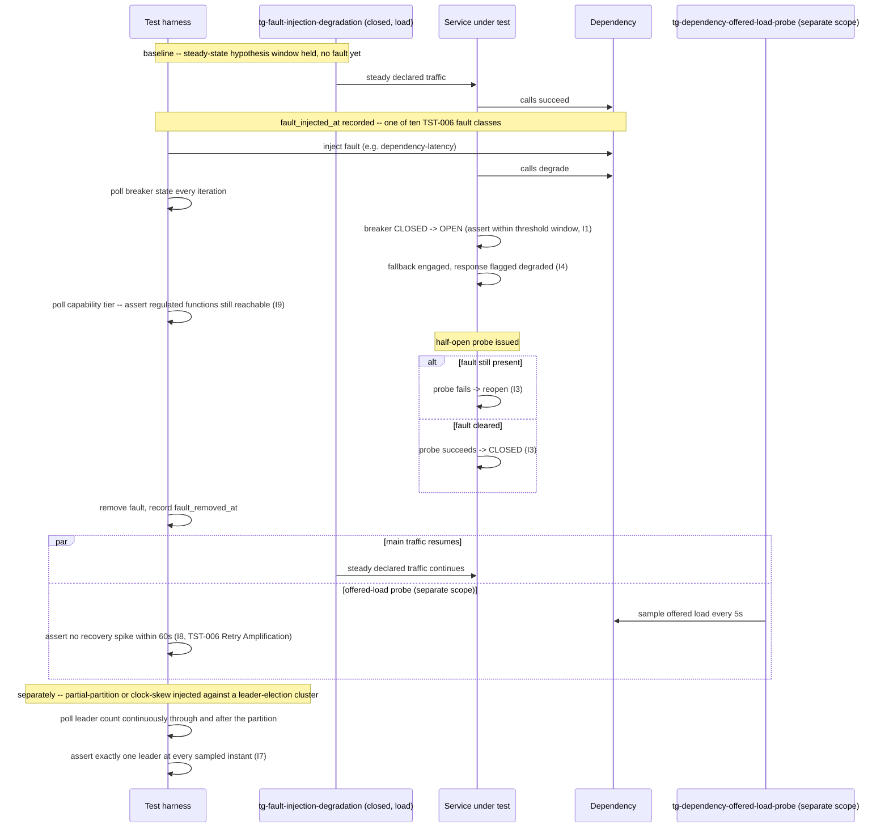

# Fault Injection and Graceful Degradation Testing

Status: Approved | Last Reviewed: 2026-08-12 | Owner: @qe-lead
Catalog ID: TST-035 | Radii
Tier Applicability: T0, T1

## 1. Applies To

| Catalog ID | Title | Document |
|---|---|---|
| RES-002 | Circuit Breaker | [../../patterns/resilience/circuit-breaker.md](../../patterns/resilience/circuit-breaker.md) |
| RES-007 | Fallback Strategies | [../../patterns/resilience/fallback-strategies.md](../../patterns/resilience/fallback-strategies.md) |
| RES-004 | Graceful Degradation | [../../patterns/resilience/graceful-degradation.md](../../patterns/resilience/graceful-degradation.md) |
| RES-006 | Timeout Budget | [../../patterns/resilience/timeout-budget.md](../../patterns/resilience/timeout-budget.md) |
| RES-012 | Health Check Aggregation | [../../patterns/resilience/health-check-aggregation.md](../../patterns/resilience/health-check-aggregation.md) |
| RES-010 | Leader Election | [../../patterns/resilience/leader-election.md](../../patterns/resilience/leader-election.md) |
| RES-001 | Bulkhead Isolation | [../../patterns/resilience/bulkhead-isolation.md](../../patterns/resilience/bulkhead-isolation.md) |
| RES-003 | Retry with Backoff | [../../patterns/resilience/retry-with-backoff.md](../../patterns/resilience/retry-with-backoff.md) |
| BP-005 | Chaos Engineering | [../../best-practices/chaos-engineering.md](../../best-practices/chaos-engineering.md) |
| BP-002 | Disaster Recovery Playbook | [../../best-practices/disaster-recovery-playbook.md](../../best-practices/disaster-recovery-playbook.md) |

These ten rows share one archetype because each is one link in the same fault-response chain,
and the method of verification is identical across all ten: inject one of
[TST-006](../strategy/resilience-test-standard.md#fault-class-taxonomy)'s ten fault classes
against a service under real traffic and assert what each link in the chain does in response —
not one design claim per row, evaluated in isolation. RES-006 Timeout Budget is the first
backstop on any call; RES-002 Circuit Breaker trips once a fault sustains past its declared
threshold; RES-007 Fallback Strategies serves the degraded response while the breaker is open;
RES-004 Graceful Degradation is the coordination layer above RES-002 and RES-007 that selects a
capability tier from their combined state; RES-001 Bulkhead Isolation is the precondition that
keeps a resource-exhaustion or partial-partition fault's blast radius contained to its own pool,
which is what makes a "fail fast without reaching the dependency" assertion meaningful rather than
itself starved; RES-003 Retry with Backoff governs what happens to offered load on the dependency
through fault removal and recovery; RES-012 Health Check Aggregation must reflect every one of
these states accurately to the orchestration layer; RES-010 Leader Election must not split-brain
under the fault classes that attack cluster coordination directly (`clock-skew`,
`partial-partition`, `instance-loss`, `zone-loss`). BP-005 Chaos Engineering is not a pattern under
test in the same sense as the other eight rows — it is the practice this archetype's harness
executes as a codified, assertable test obligation, exactly the division of labour
[TST-006 § Relationship to BP-005](../strategy/resilience-test-standard.md#relationship-to-bp-005)
draws: BP-005 owns the drill cadence and game-day culture; this archetype owns the pass/fail
assertions that prove a drill actually exercised what it claims to have exercised. BP-002 Disaster
Recovery Playbook belongs here for the same reason as BP-005: a DR playbook is not a document to
cross-reference, it is a procedure this archetype's `failover-under-load` profile (§4) — this
archetype's primary profile — actually executes end to end, so the playbook's own steps are
verified against a real fault injection rather than merely reviewed on paper.

## 2. Failure Taxonomy

- A circuit breaker whose failure-rate or slow-call threshold is configured unreachably high, so
  it never opens no matter how degraded the downstream becomes.
- A circuit breaker that opens correctly, but whose fallback method also fails — the caller is
  left with a raw exception instead of a degraded-but-usable response.
- A fallback that returns stale or cached data with no indication to the caller that the response
  is degraded, so a consumer treats stale data as fresh.
- A callee whose declared timeout is longer than its caller's remaining budget, so the caller
  always gives up and returns first — the callee's own timeout protects nothing and the call is a
  phantom "in-flight" operation from the moment it starts.
- A health check that reports healthy while one or more of the dependencies it composes are
  actually down, so the orchestration layer keeps routing traffic to a pod that cannot serve it.
- Leader election flapping under a network partition, producing two leaders simultaneously — one
  on each side of the split — rather than exactly one or none.
- A retry storm on recovery: every caller that was retrying against a degraded dependency retries
  again the instant it recovers, and the resulting spike re-triggers the fault the retries were
  meant to survive.
- Degradation silently dropping a regulated function — a capability-tier transition that queues or
  skips a check a compliance or risk control requires (sanction screening, AML scoring, a
  mandatory audit write) without that omission being visible or reversible.

## 3. Functional Test Design

**Oracle:** `invariant-assertion`, per
[TST-001 § The Four Oracles](../strategy/test-strategy-standard.md#the-four-oracles).

### Invariants

| # | Invariant | Assertion |
|---|---|---|
| I1 | The breaker opens within its declared threshold under the injected fault | `assert (breaker_first_open_timestamp - fault_injected_at) <= declared_threshold_window`, measured against the recorded injection timestamp (§5), never against wall-clock convenience |
| I2 | While open, calls fail fast without reaching the dependency | `assert count(downstream_calls_during_open_window) == 0` and `assert call_latency_during_open <= declared_fail_fast_budget`; RES-001's own containment of the fault to its own pool is the precondition that keeps this a fail-fast measurement rather than a still-starved caller |
| I3 | Half-open probes are bounded and a probe failure reopens the breaker | `assert probe_count_in_half_open <= declared_permitted_calls_in_half_open` and `assert breaker_state == OPEN` immediately following any probe failure — a probe run against a fault that has not actually cleared must reopen, not linger half-open |
| I4 | The fallback path is exercised while the breaker is open, and its result is marked degraded | `assert fallback_invocation_count > 0` during the OPEN window and `assert every fallback_response.degraded_flag == true`, per RES-007's disclosure obligation |
| I5 | Every callee's declared timeout is strictly less than its caller's remaining budget | `assert callee_timeout_ms < caller_timeout_ms` for every hop in the declared RES-006 waterfall, checked statically against configuration and dynamically against observed call latency under fault |
| I6 | The health check reflects the real state of every dependency it composes | `assert health_endpoint_status in {DOWN, OUT_OF_SERVICE}` within one probe cycle of any composed dependency's fault injection, per RES-012's aggregation contract — never `UP` while a composed dependency is under active fault injection |
| I7 | Exactly one leader exists during and after a partition | `assert count(pods reporting isLeader()==true) == 1` at every polled instant through the injected fault and after it clears — zero is a transient, bounded gap; two is never acceptable at any sampled instant |
| I8 | Recovery produces no thundering herd on the dependency | `assert offered_load_60s_after_fault_removal <= pre_fault_steady_state_load * declared_tolerance`, the retry-amplification measurement from [TST-006](../strategy/resilience-test-standard.md#retry-amplification), reused here rather than re-derived |
| I9 | No regulated function is silently dropped by a degradation-tier transition | `assert declared_regulated_functions ⊆ functions_available_at(current_tier)` for every tier RES-004's capability-tier selector can select, checked at every tier transition observed during the run, not only at `FULL` |

### Equivalence classes and boundaries

- A fault below the breaker's declared threshold — the uncontended case; the breaker stays CLOSED
  and no fallback engages (baseline for I1, I4).
- A fault that crosses the declared threshold and sustains — the decisive case; the breaker must
  open within the declared window (I1) and the fallback must engage with the degraded flag set
  (I4).
- Boundary: the instant a half-open probe is issued against a fault that has *just* cleared versus
  one that has not — the former must close, the latter must reopen (I3).
- Boundary: a callee timeout configured exactly equal to its caller's remaining budget — this is a
  violation of I5, not a boundary pass, because "strictly less than" excludes equality: an
  equal-length callee timeout still races the caller's own deadline and can lose.
- A regulated-function transaction submitted while the service is at `FULL` capability versus while
  it is `DEGRADED` or `MINIMAL` — I9 must hold identically at every tier, not only at `FULL`.
- Boundary: exactly one instant during a `partial-partition` injection where the partition has just
  formed — I7 must never observe two leaders at that instant, even transiently, once both sides
  have had time to complete a single lease-check cycle.
- Boundary: the 60-second window immediately following fault removal — I8's thundering-herd check
  is scoped to exactly this window, per [TST-006](../strategy/resilience-test-standard.md#retry-amplification),
  not to the run's aggregate.

### Negative paths

- A breaker that never opens because its threshold is configured unreachably high — the Failure
  Taxonomy's first entry made concrete; caught by I1's negative case: no state transition is
  observed at all during a sustained fault.
- A fallback method that itself throws — caught by I4's negative case: fallback invocation is
  recorded but no successful degraded response follows it, which must be treated as a defect, not
  as "the breaker at least worked."
- A degraded response served with no `degraded` flag set — an I4 violation even when the response
  itself is otherwise correct; a caller that cannot distinguish degraded from full-fidelity data is
  the Failure Taxonomy's third entry.
- A capability-tier transition that queues or skips a declared regulated function without flagging
  it — an I9 violation, never accepted merely because throughput held during the fault.

## 4. Performance Test Design

| Profile | Applies | Why | Threshold source |
|---|---|---|---|
| `baseline` | yes | Confirms breaker, fallback, health-check, and leader-election behaviour has not regressed before any fault is injected — the pre-injection steady-state hypothesis window per [TST-006](../strategy/resilience-test-standard.md#steady-state-hypothesis) | [NFR-002](../../nfr/latency-budget-model.md) |
| `load` | yes | Establishes the sustained-traffic steady state that `failover-under-load` layers a fault onto; a fault injected at idle proves nothing about pool exhaustion, breaker sampling, or queue backlog, per [TST-006](../strategy/resilience-test-standard.md#fault-injection-under-load) | [NFR-004](../../nfr/throughput-model.md) |
| `spike` | yes | Models the retry storm named in the Failure Taxonomy as an exogenous arrival process, not a population the harness self-throttles — the realistic trigger for I8's thundering-herd check | [NFR-004](../../nfr/throughput-model.md) |
| `failover-under-load` | yes — the decisive profile for this archetype | Every fault class in §7 is injected during this profile, at declared sustained throughput, per [TST-006's rule](../strategy/resilience-test-standard.md#fault-injection-under-load) that a resilience result captured outside it is a data point, not evidence for a DAB submission | [NFR-001](../../nfr/service-tiering-rto-rpo.md) |

**Workload model:** `closed` for `baseline` and `load` — a fixed, declared population held steady,
so the pre-fault steady state I1-I9 compare against is itself stable, per
[TST-003](../strategy/workload-modelling.md). `open` for `spike`, mandatory per
[TST-003's Rule](../strategy/workload-modelling.md#the-rule): a closed model's population would
self-throttle the instant retries began queuing, understating exactly the retry storm I8 exists to
catch. `failover-under-load` layers each fault class in §7 onto `load`'s closed-model steady
traffic, per [TST-006](../strategy/resilience-test-standard.md#fault-injection-under-load) — but
I8's offered-load-on-recovery measurement is captured as a **separate, un-throttled probe against
the dependency itself**, because that measurement is of the offered load the caller's own retry
policy generates on the dependency, not of the harness's client-side population; conflating the
two would let the harness's own closed-model back-pressure mask a real thundering herd.

## 5. Canonical Harness — JMeter

```xml
<!-- Thread Group: steady closed-model traffic for baseline/load; the failover-under-load
     profile layers the fault injection below onto this same steady traffic. -->
<ThreadGroup testname="tg-fault-injection-degradation">
  <stringProp name="ThreadGroup.num_threads">${__P(users,50)}</stringProp>
  <stringProp name="ThreadGroup.ramp_time">${__P(rampup,60)}</stringProp>
  <stringProp name="ThreadGroup.duration">${__P(duration,3600)}</stringProp>
</ThreadGroup>

<!-- Fault injection fires once, mid-run, at a recorded timestamp -- every later assertion in
     this plan is measured relative to fault_injected_at, never to wall-clock convenience. -->
<JSR223PreProcessor testname="inject declared TST-006 fault at fault_at_ms, record timestamp (I1, I3, I5, I6, I7)">
  <stringProp name="script"><![CDATA[
    long elapsedMs = Long.parseLong(vars.get("elapsed_ms"));
    long faultAtMs = Long.parseLong(vars.get("__P(fault_at_ms,60000)"));
    if (!"true".equals(props.getProperty("fault_injected")) && elapsedMs >= faultAtMs) {
        // e.g. faultController.inject("dependency-latency", targetService, faultParams) --
        // Istio HTTPFaultInjection, Toxiproxy toxic, or Chaos Mesh CRD apply, per the fault
        // class named in vars.get("fault_class") (see TST-006 Fault Class Taxonomy).
        faultController.inject(vars.get("fault_class"), vars.get("target_dependency"));
        props.setProperty("fault_injected", "true");
        props.setProperty("fault_injected_at", String.valueOf(System.currentTimeMillis()));
    }
  ]]></stringProp>
</JSR223PreProcessor>

<HTTPSamplerProxy testname="POST /v1/payments/synthetic (protected call path)">
  <stringProp name="HTTPSampler.path">/v1/payments/synthetic</stringProp>
  <stringProp name="HTTPSampler.method">POST</stringProp>
</HTTPSamplerProxy>

<!-- Polls the composite health/circuit-breaker actuator endpoint every iteration; the first
     OPEN observation after fault_injected_at is what I1 and I3 are measured against. -->
<JSR223Sampler testname="poll breaker + health state, tally first-OPEN and probe outcomes (I1, I3, I6)">
  <stringProp name="script"><![CDATA[
    def status = actuatorClient.getCircuitBreakerStatus(vars.get("breaker_name"))
    if ("OPEN".equals(status.state) && props.getProperty("breaker_first_open_at") == null) {
        props.setProperty("breaker_first_open_at", String.valueOf(System.currentTimeMillis()));
    }
    vars.put("health_status", actuatorClient.getReadinessStatus())
  ]]></stringProp>
</JSR223Sampler>

<JSR223Assertion testname="assert breaker opened within declared threshold window (I1)">
  <stringProp name="script"><![CDATA[
    String firstOpenAt = props.getProperty("breaker_first_open_at");
    String injectedAt = props.getProperty("fault_injected_at");
    if (firstOpenAt != null && injectedAt != null) {
        long detectMs = Long.parseLong(firstOpenAt) - Long.parseLong(injectedAt);
        long thresholdMs = Long.parseLong(vars.get("declared_threshold_window_ms"));
        if (detectMs > thresholdMs) {
            AssertionResult.setFailure(true);
            AssertionResult.setFailureMessage(
                "I1 violated: breaker took " + detectMs + "ms to open, threshold=" + thresholdMs);
        }
    }
  ]]></stringProp>
</JSR223Assertion>

<!-- Separate, un-throttled Thread Group polling the dependency's OWN request counter -- this
     is I8's offered-load-on-recovery measurement, deliberately isolated from the closed-model
     Thread Group above so its own back-pressure never masks a real thundering herd. Reuses the
     retry-amplification method from TST-006, and the backoff-interval assertion technique
     TST-029 already established for its own DLQ/retry path, rather than restating either. -->
<ThreadGroup testname="tg-dependency-offered-load-probe (un-throttled, separate scope)">
  <stringProp name="ThreadGroup.num_threads">1</stringProp>
  <stringProp name="ThreadGroup.duration">${__P(duration,3600)}</stringProp>
</ThreadGroup>
<JSR223Sampler testname="sample dependency's own offered-load counter every 5s (I8)">
  <stringProp name="script"><![CDATA[
    def offered = dependencyProbe.currentOfferedLoad(vars.get("target_dependency"))
    vars.put("offered_load", offered as String)
  ]]></stringProp>
</JSR223Sampler>
<JSR223Assertion testname="assert no recovery spike within the declared recovery window after fault removal (I8, TST-006 Retry Amplification)">
  <stringProp name="script"><![CDATA[
    long faultRemovedAt = Long.parseLong(props.getProperty("fault_removed_at", "0"));
    long now = System.currentTimeMillis();
    long recoveryWindowMs = Long.parseLong(vars.get("__P(recovery_window_ms,60000)"));
    if (faultRemovedAt > 0 && (now - faultRemovedAt) <= recoveryWindowMs) {
        double offered = Double.parseDouble(vars.get("offered_load"));
        double preFaultSteadyState = Double.parseDouble(vars.get("pre_fault_steady_state_load"));
        double tolerance = Double.parseDouble(vars.get("declared_recovery_tolerance"));
        if (offered > preFaultSteadyState * tolerance) {
            AssertionResult.setFailure(true);
            AssertionResult.setFailureMessage(
                "I8 violated: offered load " + offered + " exceeds pre-fault steady state " +
                preFaultSteadyState + " * tolerance " + tolerance + " within the declared " +
                recoveryWindowMs + "ms recovery window");
        }
    }
  ]]></stringProp>
</JSR223Assertion>
```

```bash
jmeter -n -t fault-injection-degradation.jmx \
  -Jusers="${JMETER_USERS}" -Jrampup="${JMETER_RAMPUP}" -Jduration="${JMETER_DURATION}" \
  -Jfault_at_ms="${JMETER_FAULT_AT_MS}" -Jfault_class="${JMETER_FAULT_CLASS}" \
  -Jtarget_dependency="${JMETER_TARGET_DEPENDENCY}" -Jprofile="${JMETER_PROFILE}" \
  -l results.jtl -e -o report/
```

The **recorded injection timestamp** (`fault_injected_at`) is the load-bearing element of this
harness: every state-transition assertion in §3 (I1, I3, I6, I7) is measured relative to that
timestamp, never to the run's own elapsed time or a fixed sleep — a fault whose observable impact
lags its injection by even a few seconds would otherwise be silently mismeasured against the wrong
reference point. The **second, un-throttled Thread Group** scoped only to the dependency's own
offered-load counter is the harness's other load-bearing design choice, for exactly the reason
[TST-033](./multitenant-noisy-neighbour.md)'s per-tenant listener scoping demonstrates: a single
combined report would average the recovery spike away against the main Thread Group's own
steady-state samples, producing a blended figure that could pass I8 even while the dependency's own
view of offered load spikes.

## 6. Tool Fit

| Tool | Fit | When to prefer |
|---|---|---|
| JMeter | BEST | A JSR223PreProcessor firing the fault at a recorded timestamp, a polling JSR223 Sampler measuring state-transition timing against that timestamp, and a second, distinctly-scoped Thread Group measuring offered load on the dependency itself all compose in one plan — no other tool in the corpus gives this three-way separation with JMeter's shared, cross-thread `props` store |
| Gatling + Karate | good | Gatling's injection profile can drive the steady traffic and Karate can script the fault-toggle call and the actuator polling, but neither gives a native second listener scoped as cleanly to the dependency-side offered-load measurement as JMeter's separate Thread Group |
| k6 | good | A `constant-arrival-rate` scenario for steady traffic plus a second scripted scenario polling the dependency's counter can approximate the same separation, with k6's tagged custom metrics distinguishing the two measurement streams, but it lacks a built-in barrier or shared cross-VU store as direct as JMeter's `props` |
| Locust | fair | Locust can run two `User` classes concurrently — one driving traffic, one polling the dependency — but per [TST-014](../tooling/locust.md#when-to-use-this-tool) its closed population model is a poor fit for the `spike` profile's retry storm, and the dual-measurement separation must be hand-built rather than configured |

Every coverage row for the ten catalog entries in §1 records `primary_tool: jmeter`, for the
reason stated above and demonstrated in §5.

## 7. Overlays

### Resilience overlay

This archetype's Resilience overlay **is the body of the document** — every invariant in §3 is a
resilience assertion, and every equivalence class in §3 is a fault-injection scenario. There is no
separate functional-only path this archetype exercises without a fault present; the `failover-under-load`
profile in §4 is the archetype's only decisive profile. All ten fault classes from
[TST-006 § Fault Class Taxonomy](../strategy/resilience-test-standard.md#fault-class-taxonomy) are
exercised, each stated below against the invariant(s) it puts under test:

- **`dependency-latency`** — exercises **I1** (the breaker must open within its declared threshold
  as the delay sustains) and **I5** (RES-006's timeout budget is the first backstop, enforced
  before the delay is ever allowed to cascade upstream).
- **`dependency-error`** — exercises **I1** (elevated error rate crosses the breaker's threshold),
  **I4** (RES-007's fallback engages once the breaker opens), and **I9** (an elevated error rate is
  exactly the condition RES-004's capability-tier selector reacts to; the tier transition it
  triggers must not silently drop a declared regulated function).
- **`dependency-blackhole`** — exercises **I5** (RES-006's timeout is the *only* backstop, since no
  error or reset is ever observed) and **I1** (the breaker must open on timeout rate, not error
  rate, because it never sees one).
- **`resource-exhaustion`** — exercises **I2** (RES-001's bulkhead containment is the precondition
  that keeps the caller's own pool from being exhausted alongside the failing one, which is what
  makes "fail fast without reaching the dependency" a meaningful measurement) and **I6** (RES-012's
  health check must surface the saturating dependency before load-balancer routing compounds it).
- **`instance-loss`** — exercises **I6** (RES-012 removes the killed instance from rotation within
  its detection window) and **I7** (RES-010 re-elects a new leader if the killed instance held
  leadership).
- **`zone-loss`** — exercises **I7** (if the lost zone held the leader, exactly one new leader must
  emerge on a surviving zone) and **I8** (recovery on the surviving zones must not thundering-herd
  the shared dependency).
- **`region-loss`** — exercises **I8** (cross-region failover's recovery load on the surviving
  region's dependencies must not spike beyond the declared tolerance).
- **`clock-skew`** — exercises **I7** (RES-010's lease mechanism must not split-brain when the
  current leader's and a challenger's clocks disagree).
- **`partial-partition`** — exercises **I7** (no two leaders, one on each side of the partition)
  and **I2** (RES-001's bulkhead keeps the partitioned subset from starving the healthy majority of
  shared resources, the precondition for a meaningful fail-fast on the healthy side).
- **`slow-disk`** — exercises **I5** (RES-006 bounds any disk-bound call path) and **I3** (a
  half-open probe issued against a disk that is still slow must fail and reopen the breaker, not
  linger half-open on the strength of one lucky fast probe).

Contract, Security, and Data-quality overlays are omitted: this archetype's failure modes are about
fault-response timing, degraded-response correctness, and cluster-coordination safety under
injected faults — not schema compatibility, access control, or data-quality reconciliation — so
none of the three overlays applies.

## 8. Test Data Requirements

Synthetic only, per [TST-004](../strategy/test-data-management.md). Entities needed: a synthetic
protected call path with at least two downstream dependencies whose RES-004 tier-impact differs —
one mapped to `DEGRADED`, one mapped to `MINIMAL` — so I9 can be checked against more than one
tier transition rather than only the `FULL → DEGRADED` boundary; a synthetic regulated-function
transaction (a synthetic sanction-screening or high-value-payment check) that is identifiable
independent of capability tier, so its fate — processed, queued, or dropped — can be traced across
a tier transition for I9; and a synthetic multi-pod leader-election deployment (minimum three pods)
so I7's "exactly one leader" check has a genuine quorum to observe rather than a trivial single-pod
case. The cardinality driver is the number of *distinct* fault classes exercised per run, not data
volume: each of the ten fault classes in §7 requires its own injection-and-recovery cycle, and
recycling the same synthetic transaction across cycles would conflate one cycle's degraded-flag
state with the next's. Referential-integrity requirement: the synthetic regulated-function
transaction's identifier must resolve to exactly one outcome record regardless of which tier
processed it, so I9 can be checked against the harness's own submission record rather than the
service's self-report alone. Teardown: reset every circuit breaker to CLOSED, clear the capability
tier selector's cached state, release every leader-election lease, and restore all synthetic
dependencies to their un-faulted state, at environment reset, per
[TST-005](../strategy/environments-quality-gates.md).

## 9. Evidence and Observability

Metrics to capture: the fault-injection log itself, timestamped for when each of the ten fault
classes was introduced and removed; breaker state-transition timeline relative to
`fault_injected_at` for every fault class (I1, I3); fallback invocation count and degraded-flag
rate during every OPEN window (I4); the dependency-side offered-load time series through fault
removal and the 60-second recovery window (I8); leader-count sampled continuously through every
`partial-partition` and `clock-skew` injection (I7); health-endpoint status transitions against
each composed dependency's own fault state (I6); and a regulated-function availability audit
recording, per tier transition observed during the run, whether the declared regulated functions
remained reachable (I9). Trace assertions: a call made while the breaker is OPEN must show no span
ever reaching the downstream — the fallback span must be the leaf, per I2. Artifacts to attach to a
DAB submission: the JMeter aggregate report and HTML dashboard, per
[TST-005](../strategy/environments-quality-gates.md#evidence-and-retention); the fault-injection log
covering all ten fault classes exercised in the run; the state-transition timing chart for I1/I3;
the offered-load recovery chart for I8; and the leader-count time series export for I7.

## 10. Exit Criteria

The block below is illustrative for a synthetic service implementing this archetype's patterns —
every value is an example, not a normative one, per [TST-001](../strategy/test-strategy-standard.md).

```yaml
test_acceptance_criteria:
  service_name: synthetic-payment-gateway
  archetypes: [TST-035]
  catalog_refs: [RES-002, RES-007, RES-004, RES-006, RES-012, RES-010, RES-001, RES-003, BP-005, BP-002]
  functional:
    invariants_covered: 9                 # I1-I9, all nine assertable
    negative_paths_covered: 4
    oracle: invariant-assertion
  performance:
    profiles_executed: [baseline, load, spike, failover-under-load]
    workload_model: closed                # open for spike only; see §4 above
  resilience:
    fault_scenarios: [FM50, FM51, FM52, FM53, FM54, FM55, FM56, FM57, FM58, FM59]
    # this service's own entry for each of the ten TST-006 fault classes exercised in §7
```

## Compliance Mapping

| Layer | Reference | Section/Control | How this satisfies |
|---|---|---|---|
| Ring 0 | NIST SP 800-53 — CP-4 (Contingency Plan Testing) | Test the contingency plan, not merely document it | I1-I9 are the per-service, assertable instantiation of CP-4: each of the ten fault classes in §7 is injected and its declared response is verified, not merely diagrammed |
| Ring 0 | Principles of Chaos Engineering (principlesofchaos.org) | Steady-state hypothesis; minimise blast radius | This archetype's `baseline` profile (§4) is the pre-declared steady-state window per [TST-006](../strategy/resilience-test-standard.md#steady-state-hypothesis); I2's bulkhead-contained fail-fast and I7's exactly-one-leader check are the assertable form of minimised blast radius |
| Ring 1 | [Basel BCBS 230](../../compliance/basel-bcbs-230.md) — Principle 9 | Severe-but-plausible scenario testing and drill evidence | All ten fault classes in §7, run under `failover-under-load`, are the severe-but-plausible scenarios Principle 9 requires be exercised and evidenced |
| Ring 1 | [Basel BCBS 230](../../compliance/basel-bcbs-230.md) — §27 | Blast radius containment | I2 (bulkhead-contained fail-fast) and I7 (exactly-one-leader under partition) are measured artifacts, per [TST-006 § Blast Radius Measurement](../strategy/resilience-test-standard.md#blast-radius-measurement), not architectural assertions, that §27's containment expectation is satisfied |
| Ring 2 | SBV Circular 09/2020 — §IV.3 ⚠️ (working summary — pending Legal review) | BCP drill obligations | This archetype's `failover-under-load` fault-injection evidence, retained per [TST-005](../strategy/environments-quality-gates.md), is the artifact produced for an SBV BCP-drill review; I9's regulated-function-availability audit is the specific control an SBV reviewer would examine to confirm no compliance-critical function was silently dropped during a drill |

## 12. Related Patterns

- [RES-002 Circuit Breaker](../../patterns/resilience/circuit-breaker.md)
- [RES-007 Fallback Strategies](../../patterns/resilience/fallback-strategies.md)
- [RES-004 Graceful Degradation](../../patterns/resilience/graceful-degradation.md)
- [RES-006 Timeout Budget](../../patterns/resilience/timeout-budget.md)
- [RES-012 Health Check Aggregation](../../patterns/resilience/health-check-aggregation.md)
- [RES-010 Leader Election](../../patterns/resilience/leader-election.md)
- [RES-001 Bulkhead Isolation](../../patterns/resilience/bulkhead-isolation.md)
- [RES-003 Retry with Backoff](../../patterns/resilience/retry-with-backoff.md)
- [BP-005 Chaos Engineering](../../best-practices/chaos-engineering.md)
- [BP-002 Disaster Recovery Playbook](../../best-practices/disaster-recovery-playbook.md)

## 13. Related Archetypes

- [TST-006 Resilience Test Standard](../strategy/resilience-test-standard.md) — supplies the
  ten-class fault taxonomy this archetype's Resilience overlay (§7) exercises in full, the
  steady-state hypothesis this archetype's `baseline` profile satisfies, and the Retry
  Amplification measurement method I8 reuses rather than restates; consumed, not restated.
- [TST-029 Delivery Guarantee, Retry & DLQ Testing](./delivery-guarantee-dlq.md) — its own §5/§9
  DLQ-depth and backoff-interval assertion technique is the measurement pattern this archetype's
  §5 offered-load probe and I8 assertion reuse for their own recovery-window check, applied here to
  a generic protected call path rather than a broker-backed channel; TST-029 §13 already
  cross-links this reuse from its own side.
- [TST-031 Rate Limit, Throttle & Breakpoint Testing](./rate-limit-breakpoint.md) — its own §4 knee
  definition (goodput plateau while latency keeps rising) is the reference this archetype's
  observability (§9) uses to distinguish a genuinely graceful degradation curve from a cliff when a
  fault is injected under load; TST-031 §13 already cross-links this reuse from its own side.
- [TST-033 Multi-Tenant Isolation & Noisy Neighbour](./multitenant-noisy-neighbour.md) — shares
  RES-001 Bulkhead Isolation in its own Applies To; that archetype verifies bulkhead containment
  under a two-tenant differential load method, while this archetype verifies the same pattern's
  containment property as the precondition for a fail-fast measurement under direct fault
  injection — the two are complementary evidence for RES-001, not duplicate coverage.
- [TST-020 Idempotency & Replay Safety](./idempotency-replay.md) — shares RES-003 Retry with
  Backoff in its own Applies To; that archetype verifies replay-safety invariants under a
  client-initiated retry, while this archetype verifies the offered-load shape of the same
  pattern's retries under a harness-injected fault — the two are complementary evidence for RES-003,
  not duplicate coverage.

## 14. Diagram


