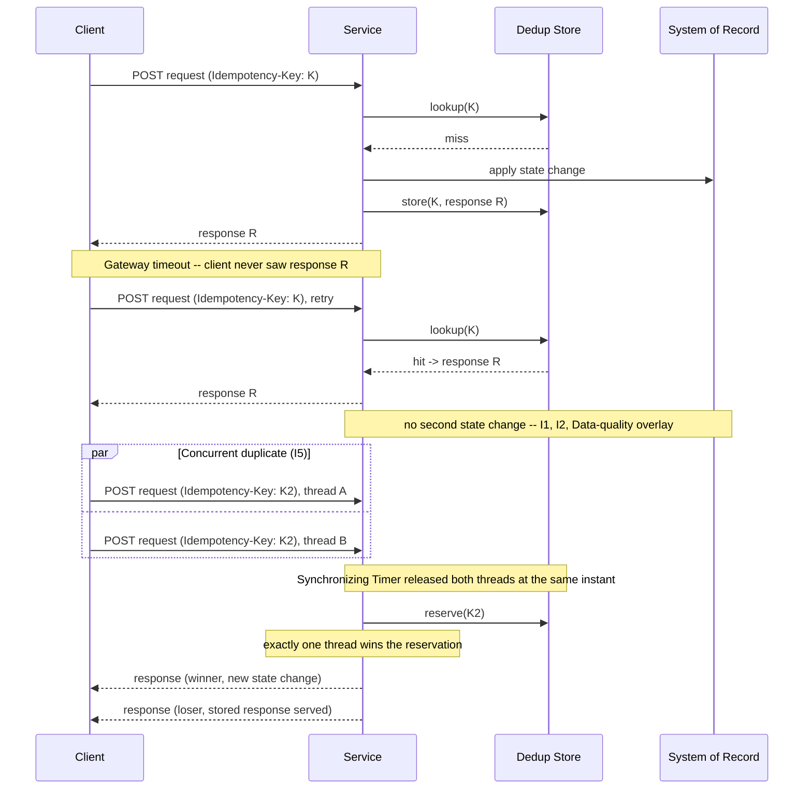

# Idempotency and Replay Safety

Status: Approved | Last Reviewed: 2026-08-12 | Owner: @qe-lead
Catalog ID: TST-020 | Radii
Tier Applicability: T0, T1

## 1. Applies To

| Catalog ID | Title | Document |
|---|---|---|
| BSP-002 | Idempotent Payment Key | [../../patterns/banking-solutions/idempotent-payment-key.md](../../patterns/banking-solutions/idempotent-payment-key.md) |
| EIP-024 | Idempotent Receiver | [../../patterns/eip/idempotent-receiver.md](../../patterns/eip/idempotent-receiver.md) |
| INT-014 | Webhook Delivery Reliability | [../../patterns/integration/webhook-delivery-reliability.md](../../patterns/integration/webhook-delivery-reliability.md) |
| RES-003 | Retry with Backoff | [../../patterns/resilience/retry-with-backoff.md](../../patterns/resilience/retry-with-backoff.md) |

`PRIN-006` Idempotency-by-default is deliberately not listed above. It is a principle, and a
principle carries the `governs` obligation in the coverage matrix rather than a real archetype
assignment — a principle constrains design, it is not itself under test. Listing it here would
make its coverage row fail check 6 of `scripts/validate-testing-coverage.py`. It is cross-linked
instead in [§12 Related Patterns](#12-related-patterns).

## 2. Failure Taxonomy

- Duplicate posting when the client retries after a gateway timeout, producing two state changes
  for one customer instruction.
- Idempotency key collision across customers, where two different customers' requests are
  deduplicated against each other's stored response.
- Key retention window expiring before the client's own retry window closes, so a legitimate,
  in-window retry is treated as a brand-new request instead of a replay.
- A non-deterministic response body on replay, so the client reads a stored failure as a success
  (or a stored success as a failure) purely because of drift in the replayed payload.
- Two concurrent in-flight duplicates both proceeding to the state-changing operation because no
  lock or reservation exists at the point of receipt.
- Idempotency enforced at the API gateway layer but not at the downstream message consumer, so a
  second broker delivery bypasses the control entirely.
- Replay after a schema or contract change produces a different result than the original request,
  silently breaking the assumption that a replay is comparable to what it replays.

## 3. Functional Test Design

**Oracle:** `invariant-assertion`

### Invariants

| # | Invariant | Assertion |
|---|---|---|
| I1 | N identical requests bearing the same key produce exactly one state change | `assert state_change_count == 1` after replaying the same idempotency key N ≥ 2 times |
| I2 | A replay returns the same status and response body as the original | `assert replay_response == original_response` (status code and body, byte-for-byte) |
| I3 | Different keys with identical payloads produce N distinct state changes | `assert state_change_count == N` for N requests, each bearing its own distinct key, identical payload |
| I4 | The same key with a different payload is rejected explicitly, never silently ignored | `assert response.status == conflict_code` when the key matches a stored entry but the payload hash differs |
| I5 | Under true concurrency exactly one duplicate wins; the other returns the stored response | `assert count(state_change) == 1 and count(stored_response_served) == 1` when both requests are released at the same instant |
| I6 | The key-retention window is at least the client's maximum retry window | `assert key_ttl >= client_max_retry_window`, both values sourced from the declared retry policy, never hard-coded in the test |
| I7 | Consumer-side deduplication survives broker redelivery | `assert state_change_count == 1` after the broker redelivers the same message under at-least-once semantics |

### Equivalence classes and boundaries

- Same key, same payload — the canonical replay case (I1, I2).
- Same key, different payload — the conflict case (I4).
- Different key, same payload — independent, legitimate transactions (I3).
- Boundary: a replay arriving at the exact edge of the key-retention TTL (I6).
- Boundary: two replays arriving in the same processing instant — true concurrency (I5).
- Boundary: a replay arriving as a broker redelivery rather than a client-initiated retry (I7).

### Negative paths

- Idempotency key omitted on a request that requires one — must be rejected, not silently
  treated as a fresh transaction.
- A malformed key (wrong format, wrong length) — must be rejected before the request reaches the
  state-changing operation.
- A replay arriving after its key has been evicted past the retention window — must be treated as
  a genuinely new request, never silently merged with stale state.
- A replay of a request whose original attempt is still in flight — must not race ahead of, or
  duplicate, the still-processing original.

## 4. Performance Test Design

| Profile | Applies | Why | Threshold source |
|---|---|---|---|
| `baseline` | yes | Confirms the deduplication path itself has not regressed before any load-shaped run | [NFR-002](../../nfr/latency-budget-model.md) |
| `load` | yes | Proves the dedup store's lookup-and-write path holds steady-state throughput without becoming the bottleneck for the wrapped operation | [NFR-004](../../nfr/throughput-model.md) |
| `stress` | yes | Locates the knee of the dedup store itself — lookup latency, lock contention — independent of the operation it wraps | [NFR-003](../../nfr/capacity-planning-model.md) |
| `spike` | yes | A retry storm — many clients retrying the same in-flight requests after a timeout — is this archetype's realistic trigger, not an edge case | [NFR-004](../../nfr/throughput-model.md) |
| `soak` | yes | Asserts the deduplication store does not grow without bound and that TTL eviction actually runs, over a window long enough to prove it | [NFR-003](../../nfr/capacity-planning-model.md) |

**Workload model:** `open` for `stress` and `spike` — a retry storm is an exogenous arrival
process, not a population the harness should throttle to a fixed closed count; see
[TST-003](../strategy/workload-modelling.md).

## 5. Canonical Harness — JMeter

```xml
<!-- Thread Group: OPEN model via Concurrency/Arrivals Thread Group -- required for `stress`
     and `spike`; `load`/`soak` may use the standard closed Thread Group. See TST-003. -->
<ThreadGroup testname="tg-idempotency-replay">
  <stringProp name="ThreadGroup.num_threads">${__P(users,20)}</stringProp>
  <stringProp name="ThreadGroup.ramp_time">${__P(rampup,60)}</stringProp>
  <stringProp name="ThreadGroup.duration">${__P(duration,3600)}</stringProp>
</ThreadGroup>

<CSVDataSet testname="synthetic_idempotency_keys.csv (SYNTHETIC -- generated, no real keys)">
  <stringProp name="filename">data/synthetic_idempotency_keys.csv</stringProp>
  <stringProp name="variableNames">idempotency_key,payload_hash</stringProp>
  <boolProp name="recycle">false</boolProp>
</CSVDataSet>

<GenericController testname="Replay pair -- original request, then a duplicate of it">
  <HTTPSamplerProxy testname="POST original (synthetic; header Idempotency-Key: ${idempotency_key})">
    <stringProp name="HTTPSampler.path">/v1/payments</stringProp>
    <stringProp name="HTTPSampler.method">POST</stringProp>
  </HTTPSamplerProxy>

  <JSONPostProcessor testname="capture original response into ${original_response}">
    <stringProp name="JSONPostProcessor.referenceNames">original_response</stringProp>
    <stringProp name="JSONPostProcessor.jsonPathExprs">$</stringProp>
  </JSONPostProcessor>

  <SyncTimer testname="Synchronizing Timer -- release replay threads simultaneously (I5)">
    <stringProp name="groupSize">${__P(concurrent_replays,2)}</stringProp>
  </SyncTimer>

  <HTTPSamplerProxy testname="POST replay -- same Idempotency-Key (synthetic)">
    <stringProp name="HTTPSampler.path">/v1/payments</stringProp>
    <stringProp name="HTTPSampler.method">POST</stringProp>
  </HTTPSamplerProxy>

  <ResponseAssertion testname="assert replay equals original (I2)">
    <stringProp name="Assertion.test_field">Assertion.response_data</stringProp>
    <stringProp name="Assertion.test_type">8</stringProp>
    <stringProp name="49586">${original_response}</stringProp>
  </ResponseAssertion>
</GenericController>
```

```bash
jmeter -n -t idempotency-replay.jmx \
  -Jusers="${JMETER_USERS}" -Jrampup="${JMETER_RAMPUP}" -Jduration="${JMETER_DURATION}" \
  -Jtargetrps="${JMETER_TARGETRPS}" -Jprofile="${JMETER_PROFILE}" \
  -Jconcurrent_replays=2 \
  -l results.jtl -e -o report/
```

The **Synchronizing Timer** is the load-bearing element: it holds every thread in its group at a
barrier until `groupSize` threads have arrived, then releases them together. That barrier is the
only clean way to make two identical requests bearing the same key arrive at the receiver at the
same instant — a `sleep`-based approximation cannot guarantee true simultaneity, and true
simultaneity is exactly what I5 requires.

## 6. Tool Fit

| Tool | Fit | When to prefer |
|---|---|---|
| JMeter | BEST | The Synchronizing Timer gives true simultaneity — the only clean way to release two identical requests for the same key at the same instant, which I5 requires |
| Gatling + Karate | good | Gatling's pause/throttle DSL can approximate near-simultaneous release and Karate can script a duplicate call, but neither gives JMeter's group-barrier guarantee |
| k6 | good | Scripted iterations can issue two identical requests within one VU or across VUs, but k6 has no built-in barrier primitive equivalent to a Synchronizing Timer |
| Locust | fair | Locust's task scheduling is per-user and gevent-cooperative; it is not designed to guarantee lock-step release of two users at the same instant |

## 7. Overlays

### Resilience overlay

Inject a `dependency-blackhole` fault (see [TST-006](../strategy/resilience-test-standard.md)) on
the downstream the idempotent operation depends on, mid-request, to force a genuine client-side
retry rather than a harness-synthesized one. Then assert I1: exactly one state change results,
even though the client — not the harness — is the source of the duplicate. This is the case the
Failure Taxonomy's first entry names directly: duplicate posting after a real gateway timeout.

### Data-quality overlay

After the replay completes, assert the ledger (or equivalent system-of-record) entry count is
unchanged from before the replay — one instruction still produces exactly one entry — per
[TST-009](../strategy/data-quality-test-standard.md). This is the same accuracy assertion I1
makes, restated as a reconciliation check against the data store rather than the API response.

Contract and security overlays are omitted: this archetype's failure modes are about duplicate
state changes, not schema compatibility or access control, so neither overlay applies.

## 8. Test Data Requirements

Synthetic idempotency keys and payloads only, per
[TST-004](../strategy/test-data-management.md). Entities needed: a set of unique synthetic keys
— one per virtual-user iteration — each paired with a synthetic payload and its hash. The
cardinality driver is the profile's peak concurrency: the CSV Data Set Config's row count must be
at least the peak in-flight thread count under `spike`, otherwise the harness recycles keys
mid-run and silently substitutes an I3 test (distinct keys) for the I1/I5 tests (same key) the
run was meant to exercise. Referential integrity requirement: each synthetic key must map to
exactly one synthetic customer or account ID that also exists in the environment's synthetic
reference data, so a replay's ledger effect can be attributed to a specific, traceable identity.
Teardown: purge the dedup store's synthetic entries and any state changes the run created, at
environment reset, per [TST-005](../strategy/environments-quality-gates.md).

## 9. Evidence and Observability

Metrics to capture: replay count against state-change count, which must track 1:1 in aggregate
across the run; dedup-store size over the `soak` run, which must plateau rather than grow
unbounded; TTL-eviction event count, which must be greater than zero once the run has run long
enough to cross the retention window. Trace assertions: a replayed request's trace must show the
deduplication check short-circuiting before the state-changing span is ever entered — a fast
response alone is not sufficient evidence that reprocessing did not happen. Artifacts to attach
to a DAB submission: the JMeter aggregate report and HTML dashboard (per
[TST-005](../strategy/environments-quality-gates.md)); the ledger-entry-count reconciliation
output from the Data-quality overlay; and the fault-injection log from the Resilience overlay,
timestamped for when the `dependency-blackhole` fault was introduced and removed.

## 10. Exit Criteria

The block below is illustrative for a synthetic service implementing this archetype's patterns —
every value is an example, not a normative one, per [TST-001](../strategy/test-strategy-standard.md).

```yaml
test_acceptance_criteria:
  service_name: synthetic-payments-service
  archetypes: [TST-020]
  catalog_refs: [BSP-002, EIP-024]
  functional:
    invariants_covered: 7                 # I1-I7, all seven are assertable
    negative_paths_covered: 4
    oracle: invariant-assertion
  performance:
    profiles_executed: [baseline, load, stress, spike, soak]
    workload_model: open                  # for stress and spike; see §4 above
  resilience:
    fault_scenarios: [FM12]                # this service's own dependency-blackhole entry
  data_quality:
    dq_rules_asserted: 1                  # ledger entry count unchanged after replay
    reconciliation_tolerance: '0'
```

## Compliance Mapping

| Layer | Reference | Section/Control | How this satisfies |
|---|---|---|---|
| Ring 0 | EIP §10.1 (Hohpe/Woolf) | Idempotent Receiver — Endpoint Patterns | I1-I7 are the assertable form of the Idempotent Receiver contract: a receiver that has already seen a message returns the stored result rather than reprocessing it |
| Ring 1 | Basel BCBS 239 — Principle 3 (Accuracy) | Duplicate delivery must not misstate reported figures | I1 and the Data-quality overlay's ledger-entry-count assertion are the accuracy control: a duplicate delivery must never create a second entry that would misstate a reported balance |
| Ring 1 | ISO 20022 | Retry and duplicate-transaction semantics carried in end-to-end message identifiers | I2, I3, and I7 assert the retry and duplicate semantics that ISO 20022 message flows rely on for reconciliation between counterparties |
| Ring 2 | SBV Circular 09/2020 §IV.2 ⚠️ (working summary — pending Legal review) | Transaction integrity and deduplication requirements for electronic payment systems | This archetype's replay-safety invariants (I1-I7) are the technical control most directly responsible for satisfying §IV.2's duplicate-transaction-prevention expectation |

## 12. Related Patterns

- [PRIN-006 Idempotency-by-default](../../principles/idempotency-by-default.md) — the design
  principle this archetype verifies; it carries `governs` in the coverage matrix rather than
  appearing in §1 Applies To (see the note there).
- [BSP-002 Idempotent Payment Key](../../patterns/banking-solutions/idempotent-payment-key.md)
- [EIP-024 Idempotent Receiver](../../patterns/eip/idempotent-receiver.md)
- [INT-014 Webhook Delivery Reliability](../../patterns/integration/webhook-delivery-reliability.md)
- [RES-003 Retry with Backoff](../../patterns/resilience/retry-with-backoff.md)

## 13. Related Archetypes

- TST-024 — Saga/Compensation Idempotency (not yet published): reuses this archetype's
  replay-assertion method for compensating-transaction retries rather than restating it.
- TST-029 — Message Redelivery Safety (not yet published): reuses this archetype's
  replay-assertion method for broker redelivery rather than restating it.

## 14. Diagram


