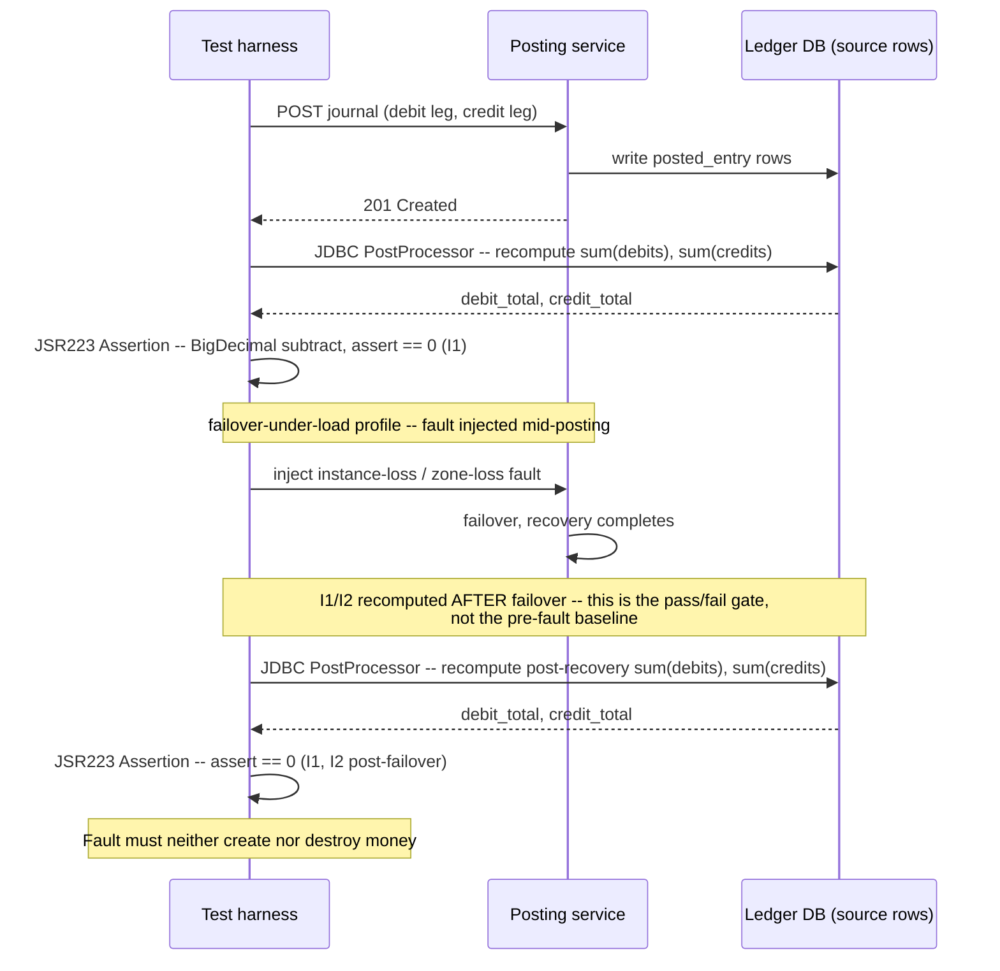

# Ledger and Monetary Invariant

Status: Approved | Last Reviewed: 2026-08-12 | Owner: @qe-lead
Catalog ID: TST-021 | Radii
Tier Applicability: T0

## 1. Applies To

| Catalog ID | Title | Document |
|---|---|---|
| BSP-001 | Double-Entry Ledger | [../../patterns/banking-solutions/double-entry-ledger.md](../../patterns/banking-solutions/double-entry-ledger.md) |
| BSP-015 | Position Keeping Engine | [../../patterns/banking-solutions/position-keeping-engine.md](../../patterns/banking-solutions/position-keeping-engine.md) |
| BSP-016 | Settlement Engine | [../../patterns/banking-solutions/settlement-engine.md](../../patterns/banking-solutions/settlement-engine.md) |
| BSP-005 | Reversal and Chargeback | [../../patterns/banking-solutions/reversal-and-chargeback.md](../../patterns/banking-solutions/reversal-and-chargeback.md) |
| REF-010 | Ledger Posting Engine | [../../reference-architectures/ledger-posting-engine.md](../../reference-architectures/ledger-posting-engine.md) |

These five rows share one archetype because they share one method of verification —
independent recomputation of sum(debits) and sum(credits) from source rows against an
exact-zero tolerance — not because they share a domain. A position-keeping drift and a
settlement break are different failure surfaces on different services; both are caught by the
same recomputation method, so both belong here rather than in a domain-specific archetype.

## 2. Failure Taxonomy

- Debits and credits within a journal fail to sum to zero after a partial write — a crash or a
  timeout leaves one leg of a journal posted and its counterpart leg missing.
- A rounding remainder is silently dropped rather than posted to a declared remainder account,
  so the ledger balances only because the last cent of every batch quietly vanished.
- A reversal is not the exact symmetric negation of its original entry — same accounts, same
  currency, same magnitude, opposite sign — so the reversal itself introduces a new break
  instead of closing the original one.
- A reversal is reversed more than once, double-crediting or double-debiting an account that
  should have returned to its pre-original-entry state exactly one time.
- Position drift accumulates under concurrent posting — two postings racing against the same
  account produce a stored balance that does not equal the recomputed sum of that account's
  own entries.
- Two currencies are mixed within one journal, so a single journal's debit/credit balance
  check is satisfied only by summing amounts that are not actually commensurable.
- A back-dated entry mutates a closed accounting period, changing a balance that a prior
  period-close reconciliation already certified as final.

## 3. Functional Test Design

**Oracle:** `invariant-assertion`

### Invariants

| # | Invariant | Assertion |
|---|---|---|
| I1 | Within every journal, sum(debits) equals sum(credits) | `assert sum(debit_amount) == sum(credit_amount)` per `journal_id`, recomputed from the posted-entry rows, not read from a stored journal-total column |
| I2 | Across the ledger, the sum of all entries per currency is zero | `assert sum(signed_amount) == 0` grouped by `currency`, recomputed from every posted entry in the account range under test |
| I3 | A reversal is an exact negation of its original — same accounts, same currency, same magnitude | `assert reversal.accounts == original.accounts and reversal.currency == original.currency and reversal.amount == -original.amount` |
| I4 | A reversal cannot itself be reversed more than once | `assert count(reversal_of == entry_id) <= 1` for every entry that has been reversed |
| I5 | Every account balance equals the recomputed sum of that account's own posted entries | `assert stored_balance == sum(entry.signed_amount for entry in account.entries)`, recomputed independently from the entry rows, never compared against another cached balance |
| I6 | No rounding remainder is dropped — every batch's remainder is posted to the declared remainder account | `assert batch_input_total == sum(posted_amount) + remainder_account_delta` |
| I7 | No journal mixes more than one currency | `assert count(distinct currency) == 1` per `journal_id` |
| I8 | A closed accounting period's certified balances do not change after close | `assert balance_at_close(period) == recomputed_balance(period, as_of=now)` for every account in a period already marked closed |

### Equivalence classes and boundaries

- A journal with exactly two legs (the minimal double-entry case) versus a journal with N legs
  across N accounts — I1 must hold for both.
- A reversal issued immediately after its original versus a reversal issued after the original
  has crossed a period boundary — I3 and I8 interact at that boundary.
- A batch whose input total divides evenly across its postings (no remainder) versus a batch
  whose input total leaves a remainder under the declared rounding rule — I6's boundary case.
- Boundary: two postings against the same account released at the same instant under true
  concurrency — the case I5 exists to catch when a lock or optimistic-concurrency check is
  missing.
- Boundary: a posting timestamped inside an already-closed period, submitted after close — I8's
  boundary case, distinct from a posting that arrives before close completes.

### Negative paths

- A journal whose legs do not sum to zero is rejected at the write boundary, never accepted and
  silently corrected downstream.
- A reversal request against an entry that has already been reversed once is rejected, not
  silently applied a second time.
- A posting bearing more than one currency within a single journal is rejected before it
  reaches the ledger's storage layer.
- A back-dated posting targeting a closed period is rejected, or is routed to an explicit
  reopen-and-re-close workflow that produces its own auditable adjustment entry — never merged
  silently into the closed period's certified balance.

## 4. Performance Test Design

| Profile | Applies | Why | Threshold source |
|---|---|---|---|
| `baseline` | yes | Confirms the recomputation path itself has not regressed before any load-shaped run | [NFR-002](../../nfr/latency-budget-model.md) |
| `load` | yes | Proves concurrent posting throughput holds while I1/I2/I5 continue to hold under steady-state contention on shared accounts | [NFR-004](../../nfr/throughput-model.md) |
| `stress` | yes | Locates the knee of the posting path under concurrent contention on the same accounts — the exact condition Position drift (Failure Taxonomy) requires volume to surface | [NFR-003](../../nfr/capacity-planning-model.md) |
| `soak` | yes | Rounding-remainder drift and closed-period integrity are cumulative failure modes; only a long hold accumulates enough batches to expose a remainder that is dropped a small amount at a time | [NFR-003](../../nfr/capacity-planning-model.md) |
| `failover-under-load` | yes | The decisive profile for this archetype — see below | [NFR-001](../../nfr/service-tiering-rto-rpo.md) |

**Workload model:** `open` for `stress` — a step-ramp against shared-account contention must not
be throttled by the harness's own population ceiling, per
[TST-003](../strategy/workload-modelling.md); `closed` for `load`, `soak`, and
`failover-under-load`, which hold a declared, bounded posting population.

**`failover-under-load` is decisive, not incidental, for this archetype.** A failover injected
mid-posting is the one scenario where a partially-written journal is most likely to occur — a
leg committed, its counterpart leg lost to the failover, or a leg double-applied because a
retry raced a not-yet-failed-over write path. I1 and I2 are therefore asserted **twice** in this
profile: once against the steady-state baseline before the fault is injected, and again — as
the profile's actual pass/fail gate — after the fault has been injected and recovery has
completed. Asserting I1/I2 only before the failover proves nothing about the one moment this
profile exists to exercise; the post-failover recomputation is the assertion a DAB reviewer
checks, per [TST-006](../strategy/resilience-test-standard.md#fault-injection-under-load), which
requires every resilience assertion in this archetype's Resilience overlay to be made during
this profile, not at idle.

## 5. Canonical Harness — JMeter

```xml
<!-- Thread Group: CLOSED model — valid for `load`, `soak`, `failover-under-load`. See TST-003. -->
<ThreadGroup testname="tg-ledger-monetary-invariant">
  <stringProp name="ThreadGroup.num_threads">${__P(users,20)}</stringProp>
  <stringProp name="ThreadGroup.ramp_time">${__P(rampup,60)}</stringProp>
  <stringProp name="ThreadGroup.duration">${__P(duration,3600)}</stringProp>
</ThreadGroup>

<CSVDataSet testname="synthetic_ledger_journals.csv (SYNTHETIC -- generated, no real accounts)">
  <stringProp name="filename">data/synthetic_ledger_journals.csv</stringProp>
  <stringProp name="variableNames">journal_id,debit_account,credit_account,currency,amount</stringProp>
  <boolProp name="recycle">true</boolProp>
</CSVDataSet>

<HTTPSamplerProxy testname="POST journal posting (synthetic)">
  <stringProp name="HTTPSampler.path">/v1/ledger/journals</stringProp>
  <stringProp name="HTTPSampler.method">POST</stringProp>
</HTTPSamplerProxy>

<JDBCDataSource testname="ledger-synth-pool (SYNTHETIC schema, no production data)">
  <stringProp name="dataSource">ledger_synth</stringProp>
  <stringProp name="dbUrl">${__P(jdbc_url,jdbc:postgresql://ledger-perf.internal.example:5432/ledger_synth)}</stringProp>
  <stringProp name="driver">${__P(jdbc_driver,org.postgresql.Driver)}</stringProp>
</JDBCDataSource>

<JDBCPostProcessor testname="recompute sum(debits) minus sum(credits) from source rows (I1, I2)">
  <stringProp name="dataSource">ledger_synth</stringProp>
  <stringProp name="query">
    SELECT
      SUM(CASE WHEN entry_type = 'DEBIT' THEN amount ELSE 0 END)  AS debit_total,
      SUM(CASE WHEN entry_type = 'CREDIT' THEN amount ELSE 0 END) AS credit_total
    FROM ledger_synth.posted_entry
    WHERE journal_id = ?
  </stringProp>
  <stringProp name="queryArguments">${journal_id}</stringProp>
  <stringProp name="queryArgumentsTypes">VARCHAR</stringProp>
  <stringProp name="variableNames">debit_total,credit_total</stringProp>
</JDBCPostProcessor>

<JSR223Assertion testname="assert sum(debits) - sum(credits) == 0, BigDecimal only (I1)">
  <stringProp name="script"><![CDATA[
    import java.math.BigDecimal;

    // BigDecimal is mandatory in every money-path assertion this harness makes.
    // `double`/`float` are banned outright: binary floating point cannot represent
    // most decimal fractions exactly, so a `double` comparison against an exact-zero
    // tolerance produces a false failure (or, worse, a false pass that happens to
    // cancel out) that has nothing to do with a real ledger break.
    BigDecimal debitTotal  = new BigDecimal(vars.get("debit_total"));
    BigDecimal creditTotal = new BigDecimal(vars.get("credit_total"));
    BigDecimal remainder   = debitTotal.subtract(creditTotal);

    if (remainder.compareTo(BigDecimal.ZERO) != 0) {
        AssertionResult.setFailure(true);
        AssertionResult.setFailureMessage(
            "I1 violated: sum(debits) - sum(credits) = " + remainder.toPlainString()
            + " for journal " + vars.get("journal_id") + " (expected exact zero, no tolerance)"
        );
    }
  ]]></stringProp>
</JSR223Assertion>
```

```bash
jmeter -n -t ledger-monetary-invariant.jmx \
  -Jusers="${JMETER_USERS}" -Jrampup="${JMETER_RAMPUP}" -Jduration="${JMETER_DURATION}" \
  -Jprofile="${JMETER_PROFILE}" \
  -Jjdbc_url="${LEDGER_SYNTH_JDBC_URL}" \
  -l results.jtl -e -o report/
```

The **JDBC PostProcessor** is the load-bearing element: it re-derives `debit_total` and
`credit_total` directly from `posted_entry` source rows on every iteration, independently of
whatever total the posting response itself claims. This is the independent-recomputation method
[TST-009](../strategy/data-quality-test-standard.md#reconciliation-testing) requires for any
monetary reconciliation — re-reading a cached aggregate a second time would only prove the read
path is self-consistent, not that the ledger is actually balanced. The **JSR223 Assertion** that
follows it does the comparison exclusively in `java.math.BigDecimal`; a `double` or `float`
comparison anywhere in this chain is rejected in review regardless of how small the observed
discrepancy is, because a `double`'s representable-value error is indistinguishable from a real
one-cent ledger break at the precision this invariant is asserted at.

## 6. Tool Fit

| Tool | Fit | When to prefer |
|---|---|---|
| JMeter | BEST | The native JDBC sampler and JDBC PostProcessor enable independent recomputation straight from source rows, in the same plan that drives the posting load — no other tool in the stack reaches the ledger schema this directly |
| Locust | good | Python's `decimal.Decimal` gives the same exact-arithmetic guarantee as `BigDecimal`, and a Locust task can issue its own recomputation query, but it lacks JMeter's native JDBC sampler ergonomics |
| Gatling + Karate | fair | Karate can assert response-level invariants cleanly, but Gatling's JDBC support needs a plugin, and neither tool's DSL is built around independent source-row recomputation |
| k6 | fair | `xk6-sql` is required for any JDBC-equivalent recomputation query, since k6 has no native SQL capability at all |

## 7. Overlays

### Resilience overlay

Inject an `instance-loss` or `zone-loss` fault (per
[TST-006](../strategy/resilience-test-standard.md)) against the posting service mid-transaction,
during the `failover-under-load` profile defined in
[TST-002](../strategy/performance-test-standard.md#failover-under-load). A failover mid-posting
must neither create nor destroy money: recompute I1 (sum(debits) equals sum(credits) per
journal) and I2 (sum of all entries per currency is zero) **after** the failover completes and
recovery has stabilised, not only against the pre-fault baseline. A result that asserts I1/I2
only before the fault is injected has not tested this overlay at all — the fault is the point of
the test, and the post-recovery recomputation is the only assertion that proves the failover
itself did not leave a partially-written journal or a duplicated leg behind.

### Data-quality overlay

Every recomputation in this archetype uses the reconciliation tolerance rule in
[TST-009](../strategy/data-quality-test-standard.md#reconciliation-testing): for a monetary
reconciliation the declared tolerance is exactly zero, with no default carried over from a
non-monetary check and no team-consensus exception. I1, I2, I5, and I6 are all instances of that
exact-zero rule applied to this archetype's specific invariants; a non-zero tolerance anywhere
in this archetype's assertions is treated as a failing check, not a passing one with a rounding
allowance.

Contract and security overlays are omitted: this archetype's failure modes are about monetary
correctness under posting and failover, not schema compatibility or access control, so neither
overlay applies.

## 8. Test Data Requirements

Synthetic journals, accounts, and postings only, per
[TST-004](../strategy/test-data-management.md). Entities needed: a set of synthetic accounts
spanning at least two currencies (to exercise I7's negative path), each seeded with a known
starting balance so I5's recomputation has a verifiable independent baseline; a set of synthetic
journals, each with two or more legs summing to zero at seed time; a subset of already-reversed
synthetic entries, to seed I4's negative path without needing the harness to construct the first
reversal itself. The cardinality driver is the `stress` profile's peak concurrent-posting rate
against a deliberately narrow set of shared accounts — enough distinct accounts that legitimate
concurrent postings are possible, but few enough that the harness reliably drives contention on
the same rows I5 exists to catch. Referential-integrity requirement: every synthetic posting's
debit and credit accounts must both exist in the synthetic chart of accounts before the posting
is issued, and every synthetic reversal must reference a synthetic original entry that is
present in the same dataset. Teardown: purge all synthetic journals, postings, and derived
balances created during the run, and restore the seeded starting balances, at environment reset,
per [TST-005](../strategy/environments-quality-gates.md).

## 9. Evidence and Observability

Metrics to capture: the I1/I2 recomputed remainder, sampled per journal and aggregated per run —
this must be exactly zero for every sample, not "small." Position-drift magnitude per account
under the `stress` profile's contention window, comparing the stored balance against the
independently recomputed balance (I5). Remainder-account delta over the `soak` run's full hold,
to prove I6's rounding rule is actually applied rather than silently absorbed. Trace assertions:
a reversal's trace must show the negation check (I3) executing before the reversal is committed,
not as an after-the-fact audit step. Artifacts to attach to a DAB submission: the JMeter
aggregate report and HTML dashboard (per
[TST-005](../strategy/environments-quality-gates.md)); the JDBC PostProcessor's recomputation
output for every profile run, including the mandatory post-failover recomputation from the
Resilience overlay; and the fault-injection log timestamped for when the `instance-loss` or
`zone-loss` fault was introduced and removed.

## 10. Exit Criteria

The block below is illustrative for a synthetic service implementing this archetype's patterns —
every value is an example, not a normative one, per
[TST-001](../strategy/test-strategy-standard.md).

```yaml
test_acceptance_criteria:
  service_name: synthetic-ledger-posting-service
  archetypes: [TST-021]
  catalog_refs: [BSP-001, REF-010]
  functional:
    invariants_covered: 8                 # I1-I8, all eight are assertable
    negative_paths_covered: 4
    oracle: invariant-assertion
  performance:
    profiles_executed: [baseline, load, stress, soak, failover-under-load]
    workload_model: closed                # open only for stress; see §4 above
  resilience:
    fault_scenarios: [FM9]                # this service's own instance-loss/zone-loss entry
  data_quality:
    dq_rules_asserted: 4                  # I1, I2, I5, I6 recomputed against source
    reconciliation_tolerance: '0'
```

## Compliance Mapping

| Layer | Reference | Section/Control | How this satisfies |
|---|---|---|---|
| Ring 0 | Double-entry bookkeeping (canonical accounting invariant) | Every recorded transaction affects at least two accounts such that total debits equal total credits | I1, I2, and I7 are the assertable, mechanically-checked form of the double-entry invariant itself — not an approximation of it |
| Ring 1 | Basel BCBS 239 — Principle 3 (Accuracy and Integrity) | Risk data must be accurate and reconcilable to source | I1, I2, and I5's independent-recomputation method, at the exact-zero tolerance required by [TST-009](../strategy/data-quality-test-standard.md#reconciliation-testing), is the test evidence Principle 3 requires |
| Ring 1 | Basel BCBS 239 — Principle 4 (Completeness) | Aggregated risk and position data must be complete | I6's remainder-posting assertion and I8's closed-period integrity check are the completeness evidence — no amount is dropped, and no certified period balance silently changes |
| Ring 1 | IFRS 9 | Closed accounting period integrity under IFRS reporting | I8 is the direct, assertable check that a closed period's certified balances do not change after close |
| Ring 2 | SBV Circular 09/2020 §IV.2 ⚠️ (working summary — pending Legal review) | Accounting-integrity expectations for domestic financial reporting | This archetype's double-entry and closed-period invariants (I1, I2, I8) are the technical control most directly responsible for satisfying §IV.2's accounting-integrity expectation |

## 12. Related Patterns

- [BSP-001 Double-Entry Ledger](../../patterns/banking-solutions/double-entry-ledger.md)
- [BSP-015 Position Keeping Engine](../../patterns/banking-solutions/position-keeping-engine.md)
- [BSP-016 Settlement Engine](../../patterns/banking-solutions/settlement-engine.md)
- [BSP-005 Reversal and Chargeback](../../patterns/banking-solutions/reversal-and-chargeback.md)
- [REF-010 Ledger Posting Engine](../../reference-architectures/ledger-posting-engine.md)

## 13. Related Archetypes

- TST-039 — Data Quality & Reconciliation (not yet published): reuses this archetype's
  independent-recomputation method for cross-system reconciliation rather than restating it.
- TST-022 — Deterministic Calculation Engine (not yet published): a sibling archetype for
  services whose correctness is calculation determinism rather than ledger balance; commonly
  runs alongside this archetype when a settlement or position engine also owns a pricing or
  fee-calculation path.

## 14. Diagram


