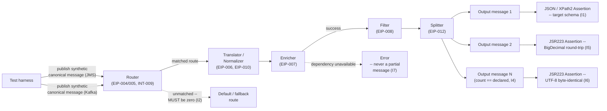

# Message Transformation and Routing Correctness

Status: Approved | Last Reviewed: 2026-08-12 | Owner: @qe-lead
Catalog ID: TST-026 | Radii
Tier Applicability: T0, T1

## 1. Applies To

| Catalog ID | Title | Document |
|---|---|---|
| EIP-004 | Message Router | [../../patterns/eip/message-router.md](../../patterns/eip/message-router.md) |
| EIP-005 | Content-Based Router | [../../patterns/eip/content-based-router.md](../../patterns/eip/content-based-router.md) |
| EIP-006 | Message Translator | [../../patterns/eip/message-translator.md](../../patterns/eip/message-translator.md) |
| EIP-007 | Content Enricher | [../../patterns/eip/content-enricher.md](../../patterns/eip/content-enricher.md) |
| EIP-008 | Content Filter | [../../patterns/eip/content-filter.md](../../patterns/eip/content-filter.md) |
| EIP-010 | Normalizer | [../../patterns/eip/normalizer.md](../../patterns/eip/normalizer.md) |
| EIP-014 | Composed Message Processor | [../../patterns/eip/composed-message-processor.md](../../patterns/eip/composed-message-processor.md) |
| EIP-012 | Splitter | [../../patterns/eip/splitter.md](../../patterns/eip/splitter.md) |
| EIP-019 | Smart Proxy | [../../patterns/eip/smart-proxy.md](../../patterns/eip/smart-proxy.md) |
| INT-009 | Content-Based Router | [../../patterns/integration/content-based-router.md](../../patterns/integration/content-based-router.md) |
| INT-005 | Anti-Corruption Layer | [../../patterns/integration/anti-corruption-layer.md](../../patterns/integration/anti-corruption-layer.md) |
| INT-012 | Error Code Mapping Standard | [../../patterns/integration/error-code-mapping.md](../../patterns/integration/error-code-mapping.md) |
| INT-007 | Sidecar / Ambassador | [../../patterns/integration/sidecar-ambassador.md](../../patterns/integration/sidecar-ambassador.md) |
| INT-008 | Backend-for-Frontend Routing | [../../patterns/integration/backend-for-frontend-routing.md](../../patterns/integration/backend-for-frontend-routing.md) |

That is **fourteen** rows, and they share one archetype for one reason: every one of them takes a
message in, decides where it goes or what shape it leaves in, and the only way to prove either
decision correct is to publish a synthetic message and assert on what comes out the other side.
EIP-004 and EIP-005/INT-009 (Content-Based Router appears once in each pattern domain, under the
same verification method) decide *where* a message goes; EIP-006 Message Translator, EIP-007
Content Enricher, EIP-008 Content Filter, EIP-010 Normalizer, and EIP-014 Composed Message
Processor decide *what shape* a message leaves in; EIP-012 Splitter decides *how many* messages
leave for the one that arrived. INT-005 Anti-Corruption Layer is a translation boundary by
definition — it exists specifically to translate an upstream model into a downstream one without
letting the upstream model leak through, which is this archetype's transformation-correctness
question applied at a bounded-context seam. INT-012 Error Code Mapping Standard is the same
translation question applied to error payloads instead of business payloads: a mis-mapped error
code is a silent-corruption defect of exactly the same shape as a mis-mapped business field.
INT-007 Sidecar/Ambassador and INT-008 Backend-for-Frontend Routing are proxy and routing-topology
patterns whose verification method is routing correctness, which is why they sit here rather than
in a separate edge-routing archetype: an ambassador that silently drops a header on the way
through, or a BFF that routes a request to the wrong backend, fails this archetype's invariants
exactly as a message router does.

## 2. Failure Taxonomy

- Silent field truncation on translation.
- An unmapped enum value defaulting rather than erroring.
- A router falling through to a default channel, so a message class is silently lost.
- An enricher failing open and emitting an incomplete message.
- A filter removing a field a downstream consumer requires.
- A splitter losing the final element.
- Character-encoding corruption of Vietnamese diacritics.
- Decimal precision lost translating a monetary amount.

## 3. Functional Test Design

**Oracle:** `contract-schema`, per
[TST-001 § The Four Oracles](../strategy/test-strategy-standard.md#the-four-oracles). Every
transformation and routing decision is graded against the source and target contract schemas
themselves — see [TST-007 Contract and Integration Test
Standard](../strategy/contract-integration-test-standard.md) for the contract vocabulary this
archetype's invariants are expressed against, in particular the `schema_compat_mode` domain and
the async-contract conformance method in [Async Contract
Testing](../strategy/contract-integration-test-standard.md#async-contract-testing).

### Invariants

| # | Invariant | Assertion |
|---|---|---|
| I1 | Every source-contract field maps to a defined target field or an explicit, documented discard | `assert field in target_mapping.keys() or field in documented_discards` for every field in the source contract schema |
| I2 | In a passing run, no message reaches a default or fallback route | `assert count(messages_on_default_route) == 0` across the full run |
| I3 | Unmapped enum values are rejected, never defaulted | `assert response.status == rejected_code` when an enum value outside the declared domain is submitted — never a silently substituted default value in the target payload |
| I4 | Splitter output count equals the declared element count | `assert count(split_output_messages) == declared_element_count(source_message)` |
| I5 | Round-trip translation preserves amount precision and currency exactly | `assert BigDecimal(amount_out).compareTo(BigDecimal(amount_in)) == 0 and currency_out == currency_in` after translating a monetary field out and back |
| I6 | Non-ASCII text, including Vietnamese diacritics, survives byte-identically | `assert bytes(field_out, "utf-8") == bytes(field_in, "utf-8")` for a fixture field containing Vietnamese diacritic characters |
| I7 | An enricher failure yields an error, never a partial message | `assert response.status == error_code and count(partial_messages_emitted) == 0` when the enrichment dependency is unavailable |

### Equivalence classes and boundaries

- Every field in the source contract present and mapped — the canonical translation path (I1).
- A field the target contract has no slot for, carrying a documented discard entry — the
  explicit-discard path (I1).
- A field with no mapping and no documented discard — the gap the invariant exists to catch (I1).
- A message that matches a real routing condition — the canonical routing path (I2).
- A message that matches no routing condition at all — the boundary I2 exists to police, because
  this is exactly where a fallthrough to a default channel would otherwise hide (I2).
- An enum value inside the declared domain, at both the first and last member of that domain — the
  boundary values of a bounded set (I3).
- An enum value outside the declared domain entirely — the negative path for I3.
- A splitter input producing exactly one element, and one producing the maximum declared element
  count — the boundary sizes for I4.
- A monetary amount at the smallest and largest representable scale for its currency (for
  example, `0.01` and a value at the currency's maximum permitted magnitude) — the boundary for I5.
- A field containing only ASCII text, and a field containing the full set of Vietnamese diacritic
  characters used in this fixture — the two ends of the encoding boundary for I6.
- An enricher call that succeeds, and one whose dependency is unavailable for the full duration of
  the call — the boundary for I7.

### Negative paths

- A source field with neither a target mapping nor a documented discard is rejected at
  translation time, never silently dropped (I1's negative path).
- A message matching no explicit routing condition is rejected or quarantined, never delivered on
  a default or catch-all channel (I2's negative path).
- An enum value outside the declared domain is rejected with an explicit error, never coerced to
  the domain's first or default member (I3's negative path).
- A splitter whose output count does not equal the source message's declared element count fails
  the run outright — a silently truncated split (missing the final element, per §2) is a defect,
  not a partial success (I4's negative path).
- A round-trip translation that returns a different scale, a rounded amount, or a substituted
  currency code is rejected, never accepted as "close enough" (I5's negative path).
- A round-trip translation that corrupts a Vietnamese diacritic character — by mojibake,
  normalization-form drift, or lossy transcoding — is rejected, never accepted as a cosmetic
  difference (I6's negative path).
- An enricher failure that reaches the outbound channel as a partial message — rather than as an
  explicit error — is rejected outright; "failing open" is the defect this invariant exists to
  catch (I7's negative path).

## 4. Performance Test Design

| Profile | Applies | Why | Threshold source |
|---|---|---|---|
| `baseline` | yes | Confirms the transformation and routing invariants in §3 have not regressed before any load-shaped run | [NFR-002](../../nfr/latency-budget-model.md) |
| `load` | yes | Proves the translator, router, and enricher hold steady-state throughput without the transformation step itself becoming the bottleneck ahead of the messaging transport | [NFR-004](../../nfr/throughput-model.md) |
| `soak` | yes | Catches unbounded growth in a transformation cache or an XSLT stylesheet cache over a window long enough to prove it, not merely to declare it — a cache that grows without bound under sustained translation volume is invisible at `baseline` or `load` and only shows up as memory pressure hours into a sustained run | [NFR-003](../../nfr/capacity-planning-model.md) |

**Workload model:** `closed` for `baseline`, `load`, and `soak`, each holding a declared, bounded
population of concurrent message flows, per [TST-003](../strategy/workload-modelling.md).
`stress`, `spike`, and `scalability` are not applicable to this archetype: this archetype's
concern is transformation and routing *correctness* under sustained volume, not the breakpoint,
burst shape, or per-step throughput ceiling those three profiles exist to find — a service in
scope of this archetype still runs them, but as part of its own performance-archetype coverage,
not as part of this one.

## 5. Canonical Harness — JMeter

```xml
<!-- JMS Point-to-Point sampler (native -- no plugin) publishing a synthetic canonical
     message into the translation/routing pipeline under test. See TST-011 Worked Example 3. -->
<JMSPointToPointSampler testname="publish canonical-order.synthetic (JMS, native)">
  <stringProp name="jms.queue">${__P(jms_queue,canonical-order.synthetic)}</stringProp>
  <stringProp name="jms.initial_context_factory">${__P(jms_icf,org.apache.activemq.jndi.ActiveMQInitialContextFactory)}</stringProp>
  <stringProp name="jms.provider_url">${__P(jms_provider_url,tcp://mq-perf.internal.example:61616)}</stringProp>
  <stringProp name="jms.content">${synthetic_canonical_message}</stringProp>
</JMSPointToPointSampler>

<!-- Kafka producer sampler (plugin -- Kafka sampler set, TST-011 §Version and Installation)
     publishing the same synthetic message onto a Kafka-fronted transformation pipeline. -->
<KafkaMeterProducerSampler testname="publish canonical-order.synthetic (Kafka)">
  <stringProp name="kafka.topic">${__P(kafka_topic,canonical-order.synthetic)}</stringProp>
  <stringProp name="kafka.bootstrap_servers">${__P(kafka_bootstrap,kafka-perf.internal.example:9092)}</stringProp>
  <stringProp name="kafka.message">${synthetic_canonical_message}</stringProp>
</KafkaMeterProducerSampler>

<!-- JSON Assertion (native -- no plugin) proves target-schema conformance for JSON-carried
     transformed output (I1). -->
<JSONPathAssertion testname="assert transformed payload matches target-contract schema (I1)">
  <stringProp name="JSON_PATH">$.targetField</stringProp>
  <boolProp name="JSONVALIDATION">true</boolProp>
</JSONPathAssertion>

<!-- XPath2 Assertion (native -- no plugin) proves target-schema conformance for XML-carried
     transformed output, the ISO 20022 element-conformance case (I1; see Compliance Mapping). -->
<XPath2Assertion testname="assert transformed payload matches ISO 20022 element schema (I1)">
  <stringProp name="xpath2.expression">//Document/CdtTrfTxInf/Amt/InstdAmt</stringProp>
</XPath2Assertion>

<!-- JSR223 Assertion comparing the round-tripped amount with BigDecimal (I5). A double or
     float comparison here is exactly the defect this invariant exists to catch. -->
<JSR223Assertion testname="assert round-tripped amount == original, BigDecimal only (I5)">
  <stringProp name="script"><![CDATA[
    import java.math.BigDecimal;

    BigDecimal amountIn  = new BigDecimal(vars.get("amount_in"));
    BigDecimal amountOut = new BigDecimal(vars.get("amount_out"));

    if (amountIn.compareTo(amountOut) != 0 || !vars.get("currency_in").equals(vars.get("currency_out"))) {
        AssertionResult.setFailure(true);
        AssertionResult.setFailureMessage(
            "I5 violated: round-trip translation changed amount or currency -- "
            + amountIn + " " + vars.get("currency_in") + " != "
            + amountOut + " " + vars.get("currency_out")
        );
    }
  ]]></stringProp>
</JSR223Assertion>

<!-- JSR223 Assertion comparing the round-tripped UTF-8 fixture byte-for-byte (I6). The
     fixture itself carries real Vietnamese diacritic characters, e.g. "Nguyễn Văn Phúc". -->
<JSR223Assertion testname="assert Vietnamese-diacritic field survives byte-identically (I6)">
  <stringProp name="script"><![CDATA[
    byte[] fieldInBytes  = vars.get("vn_field_in").getBytes("UTF-8");
    byte[] fieldOutBytes = vars.get("vn_field_out").getBytes("UTF-8");

    if (!java.util.Arrays.equals(fieldInBytes, fieldOutBytes)) {
        AssertionResult.setFailure(true);
        AssertionResult.setFailureMessage(
            "I6 violated: Vietnamese-diacritic field corrupted in translation -- "
            + vars.get("vn_field_in") + " != " + vars.get("vn_field_out")
        );
    }
  ]]></stringProp>
</JSR223Assertion>
```

```bash
jmeter -n -t message-transformation-routing.jmx \
  -Jusers="${JMETER_USERS}" -Jrampup="${JMETER_RAMPUP}" -Jduration="${JMETER_DURATION}" \
  -Jjms_provider_url="tcp://mq-perf.internal.example:61616" \
  -Jkafka_bootstrap="kafka-perf.internal.example:9092" \
  -Jprofile="${JMETER_PROFILE}" \
  -l results.jtl -e -o report/
```

The synthetic canonical message and the Vietnamese-diacritic fixture are both loaded from a
UTF-8-encoded CSV Data Set Config, never inlined as a Java string literal in the JSR223 script —
inlining risks the authoring editor's own encoding silently re-normalising or corrupting the
diacritic characters before the test ever runs, which would make the fixture untrustworthy
regardless of what the assertion logic does with it.

## 6. Tool Fit

| Tool | Fit | When to prefer |
|---|---|---|
| JMeter | BEST | Native JMS and Kafka samplers (Kafka via the pinned plugin set, per [TST-011](../tooling/jmeter.md#version-and-installation)) publish synthetic canonical messages directly onto the real transport this archetype's routing and translation patterns run on, and the native JSON and XPath2 assertions give schema conformance without a bolted-on library |
| Gatling + Karate | good | Karate's payload matching is unusually strong for transformation assertions — its schema-and-fuzzy-match syntax expresses "every field maps or is documented" more directly than a JMeter assertion chain — but Karate has no native JMS sampler, so a JMS-backed pipeline needs a custom Java bridge |
| k6 | fair | k6 can drive an HTTP-fronted transformation endpoint and script a JSON-shape check in JavaScript, but it has no native JMS or Kafka client, so a broker-native pipeline requires an external extension |
| Locust | fair | Locust can script a routing assertion in Python against an HTTP-fronted pipeline, but like k6 it has no native JMS or Kafka client, so the broker-native samplers this archetype's harness depends on are unavailable without a custom client |

Record `primary_tool: jmeter` for all fourteen coverage rows in §1.

## 7. Overlays

### Contract overlay

Verify the transformed and routed message's conformance to its declared target schema, per
[TST-007 Contract and Integration Test
Standard](../strategy/contract-integration-test-standard.md), using the
[Async Contract Testing](../strategy/contract-integration-test-standard.md#async-contract-testing)
envelope-and-payload conformance method for the JMS- and Kafka-carried messages this archetype's
harness publishes. Cross-link TST-030 (not yet published; see
[§13 Related Archetypes](#13-related-archetypes)): this overlay and TST-030 answer two different
questions that are easy to conflate because both grade a message against a schema. **This
archetype asserts *conformance*** — does the message this transformation or routing step just
produced match its declared target schema right now, in this one run, for this one message.
**TST-030 asserts *compatibility across versions*** — does a new schema version still satisfy the
consumers built against an older version of that same schema. A translator can pass every I1
conformance check in this archetype on every message it produces today and still ship a schema
change tomorrow that breaks a consumer still running the previous version; conformance says
nothing about compatibility, and compatibility says nothing about whether any given message
today actually conforms. Neither overlay substitutes for the other, and this overlay does not
restate TST-030's `schema_compat_mode` verification technique — it applies the conformance half of
the contract obligation to this archetype's own transformation and routing invariants (I1, I3, I5,
I6) instead.

Security and data-quality overlays are omitted: this archetype's failure modes are about
transformation and routing correctness, not access control or data-quality reconciliation, so
neither overlay applies. The resilience overlay is also omitted: a transformation or routing
dependency going unavailable is exactly I7's enricher-failure case, which §3's functional
invariants already cover as a correctness assertion (fail with an error, never emit a partial
message) rather than as a fault-injection exercise against a declared RTO/RPO target.

## 8. Test Data Requirements

Synthetic only, per [TST-004](../strategy/test-data-management.md). Entities needed: a synthetic
canonical source message covering every field in the source contract schema, including at least
one field with no target mapping (to exercise the documented-discard path) and at least one
monetary field; a synthetic routing-condition matrix covering every declared route plus at least
one input that matches none of them (the default-route boundary I2 polices); a synthetic
splitter-input message whose declared element count is known in advance, at both a minimum and a
maximum cardinality; a UTF-8 fixture field carrying real Vietnamese diacritic characters. The
cardinality driver is the boundary matrix in §3, not load volume: every equivalence class and
boundary listed there must appear at least once, independent of how many virtual users the `load`
profile drives. Referential-integrity requirement: every synthetic message carries its own
correlation ID, so a message's full transformation-and-routing history — including which route it
took and which fields were mapped, discarded, or enriched — is reconstructable from that one ID.
Teardown: purge every synthetic message, its downstream transformed artifacts, and any
transformation-cache entry it populated, at environment reset, per
[TST-005](../strategy/environments-quality-gates.md).

## 9. Evidence and Observability

Metrics to capture: count of messages on each declared route against count on the default or
fallback route, which must be zero in a passing run (I2); count of documented field discards
against undocumented field drops, which must be zero for the latter (I1); splitter output count
against declared element count, per split operation (I4); transformation-cache or XSLT-cache size
over the `soak` window, to prove it plateaus rather than growing unbounded. Trace assertions: a
message's trace must show which routing condition it matched (or that it matched none, which
should not occur in a passing run) and which transformation steps it passed through, in order.
Artifacts to attach to a DAB submission: the JMeter aggregate report and HTML dashboard, per
[TST-005](../strategy/environments-quality-gates.md); the round-trip precision and encoding
assertion log from I5 and I6, showing the exact `BigDecimal` and byte-comparison results rather
than a pass/fail summary alone; and the `soak` profile's cache-size time series used to prove the
transformation or XSLT cache did not grow unbounded.

## 10. Exit Criteria

The block below is illustrative for a synthetic service implementing this archetype's patterns —
every value is an example, not a normative one, per
[TST-001](../strategy/test-strategy-standard.md).

```yaml
test_acceptance_criteria:
  service_name: synthetic-payment-router
  archetypes: [TST-026]
  catalog_refs: [EIP-006, EIP-005, INT-005]
  functional:
    invariants_covered: 7                 # I1-I7, all seven are assertable
    negative_paths_covered: 7
    oracle: contract-schema
  performance:
    profiles_executed: [baseline, load, soak]
    workload_model: closed                # baseline, load, soak; see §4 above
  contract:
    consumer_contracts_verified: 1
    schema_compat_mode: BACKWARD
```

## Compliance Mapping

| Layer | Reference | Section/Control | How this satisfies |
|---|---|---|---|
| Ring 0 | Enterprise Integration Patterns (Hohpe and Woolf) — §4 Routing | A message is delivered to exactly one correct destination based on its content or a declared routing condition, never a default fallthrough | I2 and I3 are the assertable form of §4's own routing contract: no message reaches a default or fallback route in a passing run, and an unmapped condition is rejected rather than defaulted |
| Ring 0 | Enterprise Integration Patterns (Hohpe and Woolf) — §8 Transformation | A message's content is translated, enriched, filtered, or normalized without silent data loss | I1, I5, I6, and I7 are the assertable form of §8's own transformation contract: every field maps or is documented as discarded, monetary precision and non-ASCII text survive exactly, and a failed enrichment errors rather than emitting a partial message |
| Ring 1 | ISO 20022 element conformance | A translated payment message's elements (for example `CdtTrfTxInf/Amt/InstdAmt`) must validate against the ISO 20022 schema they are declared under | The XPath2 Assertion in §5 and invariant I1 are the direct conformance check ISO 20022 requires: a transformed message that does not validate against its declared element schema fails this archetype outright |
| Ring 1 | Basel BCBS 239 — Principle 3 (Accuracy and Integrity) | Risk and financial data must remain accurate through every transformation it passes through, including monetary amount and currency fields | I5 is the accuracy control: a round-trip translation must preserve amount precision and currency exactly, with no rounding or coercion tolerated as "close enough" |
| Ring 2 | SBV Circular 09/2020 ⚠️ (working summary — pending Legal review) | Operational and data-integrity requirements for domestic financial systems, including correct handling of Vietnamese-language customer and transaction data | Vietnamese-language field handling is a **practical** Ring 2 requirement here, not a generic internationalisation note: I6's byte-identical Vietnamese-diacritic assertion is the concrete technical control that proves a customer name or address field is not silently corrupted by a transformation step somewhere in the pipeline |

## 12. Related Patterns

- [EIP-004 Message Router](../../patterns/eip/message-router.md)
- [EIP-006 Message Translator](../../patterns/eip/message-translator.md)
- [EIP-012 Splitter](../../patterns/eip/splitter.md)
- [INT-005 Anti-Corruption Layer](../../patterns/integration/anti-corruption-layer.md)
- [INT-012 Error Code Mapping Standard](../../patterns/integration/error-code-mapping.md)

## 13. Related Archetypes

- TST-030 — Async Event Contract Verification (not yet published): owns schema-*compatibility*
  verification across versions; this archetype's Contract overlay in §7 owns schema-*conformance*
  verification for the message this archetype's harness produces right now — see §7 for the exact
  distinction. Consumed here as a forward reference only, not a live link.
- [TST-024 Saga and Compensation Correctness](./saga-compensation.md) — a saga's own compensating
  and forward events are subject to this archetype's conformance method wherever they pass
  through a translator, router, or enricher in scope of §1.

## 14. Diagram


