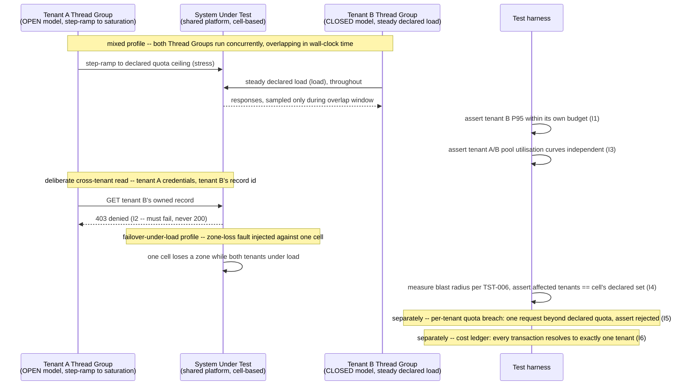

# Multi-Tenant Isolation and Noisy-Neighbour Testing

Status: Approved | Last Reviewed: 2026-08-12 | Owner: @qe-lead
Catalog ID: TST-033 | Radii
Tier Applicability: T0, T1

## 1. Applies To

| Catalog ID | Title | Document |
|---|---|---|
| PLT-008 | Multi-Tenancy Isolation | [../../patterns/platform/multi-tenancy-isolation.md](../../patterns/platform/multi-tenancy-isolation.md) |
| RES-001 | Bulkhead Isolation | [../../patterns/resilience/bulkhead-isolation.md](../../patterns/resilience/bulkhead-isolation.md) |
| RES-005 | Cell-Based Architecture | [../../patterns/resilience/cell-based-architecture.md](../../patterns/resilience/cell-based-architecture.md) |
| PLT-006 | FinOps Cost Allocation | [../../patterns/platform/finops-cost-allocation.md](../../patterns/platform/finops-cost-allocation.md) |

These four rows share one archetype because they share one method of verification: a two-tenant
**differential** measurement, in which one synthetic tenant is driven to saturation while a second
synthetic tenant is measured concurrently, and every claim is checked on the second tenant's
numbers rather than on an aggregate. PLT-008 is the canonical case — the namespace-level RBAC,
NetworkPolicy, and ResourceQuota stack whose entire purpose is to keep one tenant's misbehaviour
from reaching another. RES-001 is the resource-pool half of the same claim expressed one layer
down: a bulkhead's saturation must stay contained to its own pool, which is exactly what a noisy
tenant driven into a shared connection pool or thread pool would violate if the bulkhead were not
actually isolating tenants from one another. RES-005 is the same claim expressed one layer up: a
cell's declared blast radius is a multi-tenant isolation boundary at the deployment-slice level,
and this archetype's `zone-loss` overlay run (§7) is one of the fault injections
[TST-006](../strategy/resilience-test-standard.md) uses to measure whether that boundary actually
holds. PLT-006 is the commercial expression of the same isolation failure: if a noisy tenant's
resource consumption cannot be attributed back to that tenant, the isolation failure is invisible
on the cost ledger even when it is visible on the latency dashboard. In every row, the assertable
question is the same: does one tenant's load, fault, or cost footprint stay inside its own
boundary, measured against a second tenant that did nothing to deserve the impact.

## 2. Failure Taxonomy

- One tenant's burst degrading another tenant's latency.
- A shared connection pool exhausted by a single tenant.
- Cross-tenant data leakage appearing only under concurrency.
- A cell failure exceeding its declared blast radius.
- A per-tenant quota not actually enforced.
- Cost attribution wrong, so a noisy tenant is commercially invisible.

## 3. Functional Test Design

**Oracle:** `invariant-assertion`, per
[TST-001 § The Four Oracles](../strategy/test-strategy-standard.md#the-four-oracles).

### Invariants

| # | Invariant | Assertion |
|---|---|---|
| I1 | Tenant A at maximum quota does not push tenant B's P95 beyond tenant B's own budget | `assert tenant_b.p95_latency <= tenant_b.declared_budget`, sampled only during the window in which tenant A is simultaneously held at its maximum quota — never against a tenant-A-idle baseline |
| I2 | No response contains another tenant's data, under any concurrency | `assert every response.body` for every request in the run, `NOT contains(other_tenant_identifiers)`; includes a deliberate cross-tenant read that must itself be denied, not merely absent from a well-behaved response |
| I3 | A bulkhead's saturation is contained to its own pool | `assert tenant_b.pool_utilisation` stays within its own declared ceiling while `assert tenant_a.pool_utilisation == 100%` (or its declared maximum) simultaneously — the two pools' utilisation curves must be independent, not correlated |
| I4 | A cell failure's blast radius equals its declared tenant set — no more | `assert affected_tenants(zone_loss_injection) == declared_tenant_set(cell)`, measured per [TST-006 § Blast Radius Measurement](../strategy/resilience-test-standard.md#blast-radius-measurement), never merely asserted from the architecture diagram |
| I5 | Per-tenant quota is enforced | `assert tenant.requests_accepted_above_quota == 0` once tenant.usage reaches its declared quota, checked per tenant, never against a platform-wide aggregate that would let one tenant's headroom mask another's breach |
| I6 | Cost per transaction is attributable per tenant | `assert cost_ledger.resolves(transaction_id) -> exactly_one_tenant`, for every transaction generated by both tenants during the run, with no unattributed or shared-bucket remainder |

### Equivalence classes and boundaries

- Tenant A idle, tenant B at steady `load` — the uncontended baseline both later differential
  comparisons are measured against (I1, I3).
- Tenant A at declared maximum quota, tenant B at steady `load`, **simultaneously** — the
  decisive equivalence class this archetype exists to exercise (I1, I3, I5).
- Tenant A one request beyond its declared quota — the quota boundary itself (I5); the request
  must be rejected, not merely logged.
- A cross-tenant read issued by tenant A's credentials against tenant B's own record identifier —
  the boundary case for I2, deliberately constructed to fail closed.
- One cell serving only tenant A and tenant B loses a zone while both are under load — the
  boundary case for I4, checked with the Resilience overlay (§7).
- A transaction attributable to tenant A immediately followed by one attributable to tenant B on
  the same shared infrastructure — the boundary case for I6's per-transaction attribution, chosen
  so that a coarse time-bucketed cost estimate could not pass by coincidence.

### Negative paths

- A cross-tenant read that succeeds — even partially, even a single field — is a defect, never a
  degraded-but-acceptable result (I2's negative path).
- A quota breach that is logged or alerted on but still accepted is a defect: I5 requires the
  request itself be rejected, not merely observed.
- A blast radius measured wider than the cell's declared tenant set — including a tenant outside
  the failing cell that nonetheless observed degradation — is a RES-005 implementation gap, per
  [TST-006 § Blast Radius Measurement](../strategy/resilience-test-standard.md#blast-radius-measurement),
  never a result to average away against the tenants that were unaffected.
- A transaction whose cost cannot be resolved to exactly one tenant — split across a shared bucket,
  or dropped from the ledger entirely — is an I6 violation, never treated as immaterial because the
  aggregate bill still reconciles.

## 4. Performance Test Design

| Profile | Applies | Why | Threshold source |
|---|---|---|---|
| `baseline` | yes | Establishes each tenant's own uncontended latency and cost figures before any differential run, so I1 and I6 have a control to compare against | [NFR-002](../../nfr/latency-budget-model.md) |
| `load` | yes | Tenant B's steady-state component of the differential run: tenant B is held at its own declared `load` profile throughout, and every I1/I3 assertion is checked against tenant B's numbers at this profile | [NFR-004](../../nfr/throughput-model.md) |
| `stress` | yes | Tenant A's saturation component: tenant A is driven past its own maximum quota using the step-ramp breakpoint method [TST-031](./rate-limit-breakpoint.md) establishes, to locate and hold the point at which tenant A is genuinely "noisy" rather than merely busy | [NFR-004](../../nfr/throughput-model.md) |
| `mixed` | yes — the decisive profile for this archetype | The two components above run **simultaneously**, not sequentially; see below | [TST-003 § Named Journey Blends](../strategy/workload-modelling.md#named-journey-blends) |
| `failover-under-load` | yes | Layers the Resilience overlay's `zone-loss` fault (§7) on top of the `mixed` run, so I4's blast-radius measurement is taken while both tenants are genuinely under load, not against an idle cell | [NFR-001](../../nfr/service-tiering-rto-rpo.md) |

**`mixed` is the decisive profile for this archetype, not incidental, and the simultaneity is the
entire point.** `stress` alone proves tenant A can be driven to saturation; `load` alone proves
tenant B behaves correctly when nothing else is happening. Neither run, on its own, can prove
anything about isolation, because isolation is a claim about what happens to one tenant *while*
another tenant is noisy. Two sequential runs — first stress tenant A to saturation and record its
behaviour, then separately run tenant B at load and record its behaviour — prove nothing about I1,
I3, or I5: a platform with zero isolation and a platform with perfect isolation produce
indistinguishable results under sequential measurement, because neither tenant ever experiences
the other's load. The only run that can distinguish them is `mixed`: tenant A's `stress` ramp and
tenant B's `load` hold must execute concurrently, for overlapping wall-clock time, with I1 and I3
asserted only against samples taken during that overlap window.

**Workload model:** `open` for tenant A's `stress` component, mandatory per
[TST-003's Rule](../strategy/workload-modelling.md#open-versus-closed-workload-models) — a closed
model would self-throttle tenant A's own offered load the instant tenant A's quota limiter began
rejecting it, understating exactly the saturation this archetype needs tenant A to sustain.
`closed` for tenant B's `load` component — a fixed, declared population held steady throughout the
run, per [TST-003](../strategy/workload-modelling.md), so that any change in tenant B's observed
latency or pool utilisation is attributable to tenant A's noise rather than to a change in tenant
B's own offered load.

## 5. Canonical Harness — JMeter

```xml
<!-- Thread Group 1: Tenant A, driven to saturation. OPEN model via Concurrency Thread Group and
     Throughput Shaping Timer -- the step-ramp breakpoint method TST-031 establishes, reused here
     unchanged to locate and hold tenant A's own maximum-quota point. Distinct synthetic
     credentials from Thread Group 2 -- the two tenants must never share a credential, a
     connection pool handle, or a JMeter variable namespace. -->
<kg.apc.jmeter.threads.concurrency.ConcurrencyThreadGroup testname="tg-tenant-a-stress (OPEN model, step-ramp to quota ceiling)">
  <stringProp name="TargetLevel">${__P(tenant_a_target_rps,500)}</stringProp>
  <stringProp name="RampUp">${__P(rampup,1)}</stringProp>
  <stringProp name="Steps">${__P(ramp_steps,10)}</stringProp>
  <stringProp name="Hold">${__P(step_hold_seconds,300)}</stringProp>
</kg.apc.jmeter.threads.concurrency.ConcurrencyThreadGroup>
<HeaderManager testname="tenant A credentials (synthetic)">
  <collectionProp name="HeaderManager.headers">
    <elementProp name="X-Tenant-Id" elementType="Header">
      <stringProp name="Header.value">${tenant_a_id}</stringProp>
    </elementProp>
  </collectionProp>
</HeaderManager>
<HTTPSamplerProxy testname="tenant A: POST /v1/orders/synthetic"/>
<ResponseAssertion testname="tenant A pool utilisation report (I3, own aggregate only)"/>

<!-- Thread Group 2: Tenant B, held at steady declared load. CLOSED model -- a fixed population,
     never allowed to self-throttle or ramp, so any change observed in tenant B's own numbers is
     attributable only to tenant A's concurrent noise. -->
<ThreadGroup testname="tg-tenant-b-load (CLOSED model, steady declared population)">
  <stringProp name="ThreadGroup.num_threads">${__P(tenant_b_users,50)}</stringProp>
  <stringProp name="ThreadGroup.duration">${__P(run_duration_seconds,3600)}</stringProp>
</ThreadGroup>
<HeaderManager testname="tenant B credentials (synthetic, distinct from tenant A)">
  <collectionProp name="HeaderManager.headers">
    <elementProp name="X-Tenant-Id" elementType="Header">
      <stringProp name="Header.value">${tenant_b_id}</stringProp>
    </elementProp>
  </collectionProp>
</HeaderManager>
<HTTPSamplerProxy testname="tenant B: GET /v1/orders/synthetic"/>
<ResponseAssertion testname="assert tenant B P95 within its own declared budget, sampled only during tenant-A-stress overlap window (I1)">
  <stringProp name="Assertion.test_field">Assertion.response_time</stringProp>
</ResponseAssertion>
<JSR223Assertion testname="tenant B: assert pool utilisation independent of tenant A's (I3)">
  <stringProp name="script"><![CDATA[
    // Tenant B's own pool utilisation must not track tenant A's. If tenant A's pool is at its
    // declared maximum (from the shared props tally below) and tenant B's own pool utilisation
    // has risen in correlation with it, the bulkhead is not actually containing saturation to
    // tenant A's own pool -- I3 is violated.
    double tenantAPoolUtil = Double.parseDouble(props.getProperty("tenant_a_pool_util", "0"));
    double tenantBPoolUtil = Double.parseDouble(vars.get("tenant_b_pool_util"));
    double tenantBOwnCeiling = Double.parseDouble(vars.get("tenant_b_declared_pool_ceiling"));
    if (tenantBPoolUtil > tenantBOwnCeiling) {
        AssertionResult.setFailure(true);
        AssertionResult.setFailureMessage(
            "I3 violated: tenant B pool utilisation " + tenantBPoolUtil +
            " exceeded its own ceiling while tenant A pool utilisation was " + tenantAPoolUtil);
    }
  ]]></stringProp>
</JSR223Assertion>

<!-- Deliberate cross-tenant read: tenant A's own credentials, tenant B's own record identifier.
     This request MUST fail (be denied) -- a 200 here is the archetype's core defect (I2). -->
<HTTPSamplerProxy testname="DELIBERATE cross-tenant read: tenant A credentials against tenant B's record (must be denied, I2)">
  <stringProp name="HTTPSampler.path">/v1/orders/${tenant_b_owned_record_id}</stringProp>
  <stringProp name="HTTPSampler.method">GET</stringProp>
</HTTPSamplerProxy>
<ResponseAssertion testname="assert cross-tenant read is denied, never 200 (I2)">
  <stringProp name="Assertion.test_field">Assertion.response_code</stringProp>
  <collectionProp name="Assertion.test_strings">
    <stringProp name="0">403</stringProp>
  </collectionProp>
</ResponseAssertion>
```

```bash
# mixed profile: tenant A's stress ramp and tenant B's steady load run in the same JMeter
# invocation, for overlapping wall-clock time -- two Thread Groups in one plan, never two
# separate jmeter invocations, which is exactly what would turn this into the two sequential
# runs §4 explains prove nothing about isolation.
jmeter -n -t multitenant-noisy-neighbour.jmx \
  -Jtenant_a_target_rps="${JMETER_TENANT_A_TARGET_RPS}" -Jtenant_b_users="${JMETER_TENANT_B_USERS}" \
  -Jtenant_a_id="${SYNTHETIC_TENANT_A_ID}" -Jtenant_b_id="${SYNTHETIC_TENANT_B_ID}" \
  -Jrun_duration_seconds="${JMETER_RUN_DURATION_SECONDS}" -Jprofile=mixed \
  -l results.jtl -e -o report/
```

**Two Thread Groups with distinct synthetic tenant credentials, and separate assertions and
reports per tenant, are the load-bearing design choice of this harness.** A combined aggregate
report — one JTL, one dashboard, one P95 figure across both tenants' traffic — would average away
exactly the effect this archetype exists to test: tenant B's genuinely-elevated P95 during tenant
A's saturation window would be diluted by tenant B's own unaffected samples and by tenant A's own
(expected, by design) degraded samples, producing a blended figure that could pass I1 even while
the real, per-tenant I1 fails. Every listener, assertion, and generated report in this plan is
scoped per tenant — filtered by `X-Tenant-Id`, never merged — for exactly this reason. The
deliberate cross-tenant read is the harness's other load-bearing element: without a request that
actively attempts the violation and asserts it is denied, I2 could pass merely because no
well-behaved request happened to leak data, which proves nothing about whether a malicious or
misconfigured one would.

## 6. Tool Fit

| Tool | Fit | When to prefer |
|---|---|---|
| JMeter | BEST | Independent Thread Groups per tenant, each with its own credentials, listeners, and assertions, give the cleanest separation for the per-tenant reporting this archetype's harness depends on — no other tool in this corpus keeps two concurrent, differently-shaped load profiles (one open-model step-ramp, one closed-model steady population) this cleanly partitioned in one plan |
| Gatling + Karate | good | Gatling's scenario-per-population model can run two concurrent injection profiles with separate simulations, and Karate can script the deliberate cross-tenant read and its denial assertion, but Gatling's per-scenario reporting is less cleanly separable into two fully independent per-tenant dashboards than JMeter's per-Thread-Group listeners |
| k6 | good | Tag-scoped thresholds (`thresholds` keyed by a `tenant` tag on each check) let k6 assert tenant B's P95 independently of tenant A's traffic within one script, which is a close functional match to this archetype's per-tenant assertion requirement, though k6's native executor model makes true simultaneous open-plus-closed profiles less direct than JMeter's two Thread Groups |
| Locust | fair | Locust can run two `User` classes concurrently with distinct credentials, but has no first-class per-tag threshold or per-class reporting separation, so the per-tenant report split this archetype requires must be built by hand rather than configured |

Every coverage row in §1 records `primary_tool: jmeter`, for the reason stated above and
demonstrated in §5.

## 7. Overlays

### Resilience overlay

Inject a `zone-loss` fault (see
[TST-006 § Fault Class Taxonomy](../strategy/resilience-test-standard.md#fault-class-taxonomy))
against one cell — per [RES-005 Cell-Based Architecture](../../patterns/resilience/cell-based-architecture.md)
— while the `mixed` profile's two Thread Groups are both under load. Measure the blast radius per
[TST-006 § Blast Radius Measurement](../strategy/resilience-test-standard.md#blast-radius-measurement)'s
four dimensions (affected journeys, fraction of requests impacted, duration, recovery shape), and
assert I4: the set of tenants observed to degrade during the injection window equals the cell's
declared tenant set — no more. A tenant hosted in a different cell that nonetheless observes
degradation during this run is not a resilience finding to note separately; it is a direct I4
violation and the archetype's own multi-tenant-isolation failure mode, expressed through a fault
injection rather than through pure load.

### Security overlay

The deliberate cross-tenant access attempt in §5 is this archetype's security assertion: tenant
A's own valid credentials, used against a record identifier owned by tenant B, must be denied,
never merely unused by a well-behaved client. This is the same authorisation boundary
[TST-008 § Authorisation Matrix Method](../strategy/security-test-standard.md#authorisation-matrix-method)
verifies generally; this archetype narrows it to the specific tenant-versus-tenant cell of that
matrix and runs it concurrently with load, rather than in isolation, so a check that only passes
when the system is idle cannot hide behind an untested concurrent case. TST-040 — Data
Protection, Masking & Tokenisation (not yet published) — is expected to own the broader data-
egress assertion this overlay's denial check is a narrow instance of; this document cross-links it
as a plain forward reference and does not depend on it existing.

Contract and Data-quality overlays are omitted: this archetype's failure modes are about resource
and data isolation between tenants under concurrent load, not schema/wire compatibility or data
reconciliation, so neither overlay applies.

## 8. Test Data Requirements

Synthetic only, per [TST-004](../strategy/test-data-management.md). Entities needed: exactly two
synthetic tenants, A and B, each with its own credential set, its own resource-pool identity (its
own connection-pool or thread-pool binding, per RES-001), and its own seeded set of owned records,
generated per [TST-004 § Seeding and Reproducibility](../strategy/test-data-management.md#seeding-and-reproducibility).
The cardinality driver is the number of *distinct* tenants exercised concurrently, not data volume
per tenant: two is the minimum needed for the differential method in §4, and a run with only one
tenant present cannot exercise this archetype at all, regardless of how much load it generates.
Referential-integrity requirement: every record seeded for tenant B must resolve only under tenant
B's own credentials — the corpus itself must not depend on the system under test's isolation
already working, or I2's cross-tenant read would have no genuine boundary to cross. Teardown:
reset both tenants' quota counters and pool state, and purge both tenants' seeded records, at
environment reset, per [TST-005](../strategy/environments-quality-gates.md).

## 9. Evidence and Observability

Metrics to capture: tenant B's P95 latency, sampled separately during the tenant-A-idle baseline
and during the tenant-A-stress overlap window, plotted against each other (I1); the presence
count of any cross-tenant data in any response body across the whole run, which must be zero
except for the single deliberate cross-tenant read, which must show a denial (I2); tenant A's and
tenant B's pool-utilisation curves plotted independently, to show (or disprove) correlation (I3);
the blast-radius measurement from the Resilience overlay's `zone-loss` injection, against the
cell's declared tenant set (I4); the count of requests accepted above each tenant's own declared
quota, per tenant (I5); and the per-transaction cost-ledger resolution rate — the fraction of
transactions from the run resolving to exactly one tenant (I6). Trace assertions: the deliberate
cross-tenant read's trace must show the request denied at the authorisation layer, never reaching
the data layer that holds tenant B's record. Artifacts to attach to a DAB submission: the two
per-tenant JMeter reports (never a merged one, per §5); the tenant-A-idle-versus-tenant-A-stress
P95 comparison chart for tenant B (I1); the blast-radius measurement report from the Resilience
overlay; and the per-transaction cost-ledger attribution report (I6).

## 10. Exit Criteria

The block below is illustrative for a synthetic service implementing this archetype's patterns —
every value is an example, not a normative one, per [TST-001](../strategy/test-strategy-standard.md).

```yaml
test_acceptance_criteria:
  service_name: synthetic-multitenant-platform
  archetypes: [TST-033]
  catalog_refs: [PLT-008, RES-001, RES-005, PLT-006]
  functional:
    invariants_covered: 6                 # I1-I6, all six assertable
    negative_paths_covered: 4
    oracle: invariant-assertion
  performance:
    profiles_executed: [baseline, load, stress, mixed, failover-under-load]
    workload_model: mixed                 # open for tenant A's stress component, closed for
                                           # tenant B's steady load component; see §4
  resilience:
    fault_scenarios: [FM-zone-loss]       # illustrative ID, run against one cell
  security:
    authz_matrix_cells_covered: 1         # the deliberate tenant-A-vs-tenant-B cross-tenant cell
    token_lifecycle_cases: 0              # out of scope for this archetype; see TST-040
```

## Compliance Mapping

| Layer | Reference | Section/Control | How this satisfies |
|---|---|---|---|
| Ring 0 | AWS Well-Architected Reliability Pillar — cell-based isolation | Bulkhead/cell architecture to limit the blast radius of a single tenant's failure or overload | I3 and I4 are the assertable form of this guidance: a bulkhead's saturation stays inside its own pool, and a cell's measured blast radius equals its declared tenant set |
| Ring 1 | [Basel BCBS 230](../../compliance/basel-bcbs-230.md) — §27 | Blast radius containment for severe-but-plausible disruption scenarios | I4's blast-radius measurement, taken via [TST-006](../strategy/resilience-test-standard.md) during the `failover-under-load` run, is the assertable evidence that a cell's declared tenant boundary actually contains a disruption rather than merely being drawn on an architecture diagram |
| Ring 1 | PCI-DSS 4.0 — network and tenant segmentation requirements | Cardholder-data-environment segmentation from other tenants/workloads | I2's deliberate cross-tenant read, asserted to be denied, is the assertable form of PCI-DSS 4.0's segmentation requirement: tenant A's valid credentials must never resolve tenant B's data, under any load condition |
| Ring 2 | SBV Circular 09/2020 ⚠️ (working summary — pending Legal review) | Logical separation of critical banking systems from non-critical or other-tenant workloads | This archetype's differential run, retained as evidence per [TST-005](../strategy/environments-quality-gates.md), is the artifact an SBV inspection would examine to confirm one tenant's workload is logically separated from another's under real concurrent load, not merely at rest |

## 12. Related Patterns

- [PLT-008 Multi-Tenancy Isolation](../../patterns/platform/multi-tenancy-isolation.md)
- [RES-001 Bulkhead Isolation](../../patterns/resilience/bulkhead-isolation.md)
- [RES-005 Cell-Based Architecture](../../patterns/resilience/cell-based-architecture.md)
- [PLT-006 FinOps Cost Allocation](../../patterns/platform/finops-cost-allocation.md)

## 13. Related Archetypes

- [TST-006 Resilience Test Standard](../strategy/resilience-test-standard.md) — supplies the
  blast-radius measurement method (§7) this archetype's I4 consumes rather than restates, and the
  `zone-loss` fault class the Resilience overlay injects.
- [TST-031 Rate Limit, Throttle & Breakpoint Testing](./rate-limit-breakpoint.md) — supplies the
  open-model step-ramp breakpoint method (§5) this archetype reuses unchanged to drive tenant A to
  its own saturation point, rather than restating a second breakpoint method here.
- [TST-008 Security Test Standard](../strategy/security-test-standard.md) — supplies the
  authorisation matrix method the Security overlay's deliberate cross-tenant read narrows to a
  single tenant-versus-tenant cell.
- TST-035 — Fault Injection & Graceful Degradation (not yet published): may in time claim the
  RES-001 coverage row (§1) alongside this archetype, if its own bulkhead-focused verification
  method turns out to differ from this archetype's two-tenant differential method; this document
  makes no commitment about that future archetype's eventual scope, and the coverage row (§1) is
  structured as a normal appendable list so such a future claim, if it happens, requires no change
  here.
- TST-040 — Data Protection, Masking & Tokenisation (not yet published): expected to own the
  broader data-egress assertion this archetype's Security overlay (§7) narrows to a single
  cross-tenant denial check.

## 14. Diagram


