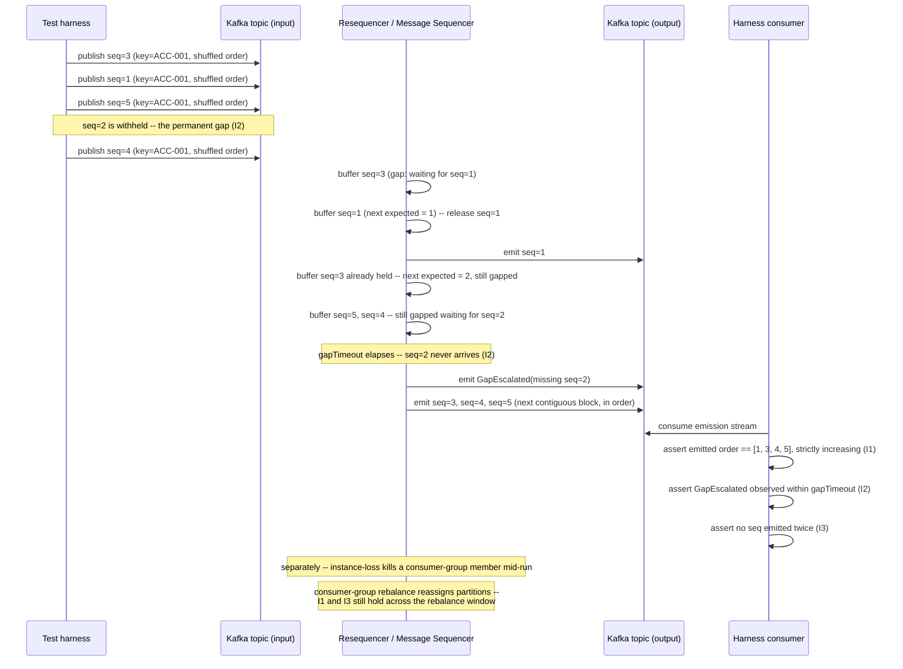

# Ordering, Sequencing and Resequencing

Status: Approved | Last Reviewed: 2026-08-12 | Owner: @qe-lead
Catalog ID: TST-027 | Radii
Tier Applicability: T0, T1

## 1. Applies To

| Catalog ID | Title | Document |
|---|---|---|
| EIP-013 | Resequencer | [../../patterns/eip/resequencer.md](../../patterns/eip/resequencer.md) |
| INT-017 | Message Sequencer | [../../patterns/integration/message-sequencer.md](../../patterns/integration/message-sequencer.md) |
| EIP-003 | Publish-Subscribe Channel | [../../patterns/eip/publish-subscribe-channel.md](../../patterns/eip/publish-subscribe-channel.md) |

These three rows share one archetype because each one makes an ordering promise that can only be
proven by the same method — publishing a deliberately shuffled sequence and asserting the emitted
order, never by inspecting a single request/response pair. EIP-013 Resequencer and INT-017 Message
Sequencer are the same pattern from two angles: EIP-013 is the classical Enterprise Integration
Pattern, and INT-017 is its Kafka-native, Redis-buffered implementation — a per-account sorted-set
buffer that drains in strict sequence order and escalates on a gap timeout. EIP-003 Publish-
Subscribe Channel belongs here specifically **for its ordering guarantees**, not for its fan-out
behaviour generally: a Kafka topic backing a pub-sub channel guarantees order only within a
partition, and this archetype's I5 exists precisely to force that scope to be documented and
asserted rather than assumed. A service that fans out via EIP-003 without ever proving whether its
consumers see per-partition order, per-key order, or no order at all has exactly the defect class
this archetype exists to catch (§2).

## 2. Failure Taxonomy

- Out-of-order delivery accepted so that an earlier state overwrites a later one.
- Resequencer buffer overflow dropping messages silently, with no overflow signal.
- Missing gap detection, so a permanently absent sequence number blocks the buffer forever.
- Per-partition ordering mistaken for global ordering.
- Consumer-group rebalance reordering in-flight messages.
- Duplicate sequence number accepted and re-emitted as if it were new.

## 3. Functional Test Design

**Oracle:** `invariant-assertion`, per
[TST-001 § The Four Oracles](../strategy/test-strategy-standard.md#the-four-oracles) — ordering is
a property that must hold over any arrival permutation, not a value looked up from a golden
dataset.

### Invariants

| # | Invariant | Assertion |
|---|---|---|
| I1 | Messages are emitted in sequence order regardless of arrival order | `assert emitted_sequence_numbers == sorted(emitted_sequence_numbers)` for every key, measured against the harness's own shuffled publish order, not the emission order |
| I2 | A gap is detected and either resolves within a bounded window or escalates | `assert (gap_resolved_at - gap_detected_at) <= declared_gap_timeout OR gap_escalation_emitted == true` — never neither |
| I3 | The resequencer never emits the same message twice | `assert count(emissions_for(seq_num)) == 1` for every sequence number, across the full run including after any restart |
| I4 | The buffer bound is enforced with a defined overflow behaviour — never silent loss | `assert overflow_event_emitted == true` whenever `buffer_depth == declared_buffer_bound`, and `assert silently_dropped_count == 0` |
| I5 | The ordering guarantee's scope — per-key, per-partition, or global — is documented and asserted | `assert declared_scope in {per_key, per_partition, global}` AND `assert ordering_violation_count == 0` when violations are measured only within that declared scope, never across it |

### Equivalence classes and boundaries

- A fully shuffled arrival sequence within the buffer's bounded window — the canonical happy path
  (I1).
- A single transient gap (one sequence number arrives late but within `gapTimeout`) — resolves
  without escalation (I2).
- Boundary: a **permanent** gap — a sequence number that never arrives — must escalate at exactly
  the declared `gapTimeout` boundary, not one tick later and not never (I2, and see §5's harness
  focus).
- Boundary: the buffer sitting exactly at its declared bound — the next arrival must trigger the
  declared overflow behaviour, not silently succeed one message past the bound (I4).
- A duplicate sequence number arriving after the resequencer has already emitted that number once
  — must be discarded, not re-emitted (I3).
- Boundary: two messages sharing the same key but arriving on different Kafka partitions — the
  per-partition-vs-per-key scope boundary I5 exists to force explicit (I5).

### Negative paths

- A duplicate sequence number arriving after its original emission is rejected or discarded,
  never counted as a second, valid emission (I3's negative path).
- An arrival past the declared buffer bound is rejected or spilled per the archetype's own
  declared overflow policy — never dropped with no signal at all (I4's negative path).
- A permanently absent sequence number produces an explicit escalation (an alert or a
  dead-letter/gap event) — the buffer must never remain blocked indefinitely waiting for it
  (I2's negative path; this is the taxonomy's "missing gap detection" defect made concrete).
- A consumer asserting global order across partitions when the service has only ever declared
  per-partition scope is a test-design defect, not a system defect — I5 exists so this
  mismatch is caught before it is mistaken for a production bug.

## 4. Performance Test Design

| Profile | Applies | Why | Threshold source |
|---|---|---|---|
| `baseline` | yes | Confirms the monotonic-emission assertion (I1) and gap-detection logic (I2) have not regressed before any load-shaped run | [NFR-002](../../nfr/latency-budget-model.md) |
| `load` | yes | Proves the resequencer holds steady-state in-order emission throughput without the buffer-drain path becoming the bottleneck under sustained, realistically shuffled volume | [NFR-004](../../nfr/throughput-model.md) |
| `stress` | yes | Repurposed for this archetype: `stress` deliberately drives arrivals faster than the resequencer can drain them, filling the reorder buffer to its declared bound on purpose — the point of the profile here is to prove I4's overflow behaviour, not to locate a throughput knee | [NFR-003](../../nfr/capacity-planning-model.md) |
| `soak` | yes | Proves the buffer does not grow unbounded across a long run of continuously shuffled traffic, and that a permanent gap injected mid-soak is still escalated rather than silently forgotten as the run continues | [NFR-003](../../nfr/capacity-planning-model.md) |

**Workload model:** `closed` for `baseline`, `load`, and `soak` — each holds a fixed population of
publishing virtual users, per [TST-003](../strategy/workload-modelling.md). `stress` runs `open`:
filling the reorder buffer on purpose (I4) requires the arrival rate to outpace the resequencer's
own drain rate, which a closed model's self-throttling feedback would mask, per
[TST-003 § Open Versus Closed Workload Models](../strategy/workload-modelling.md#open-versus-closed-workload-models).

## 5. Canonical Harness — JMeter

The harness has three load-bearing elements: a Kafka producer publishing a deliberately shuffled
synthetic sequence, a consumer-side assertion verifying monotonic emission, and an injected
**permanent** gap used to prove escalation rather than an indefinite block.

```xml
<!-- Kafka producer sampler (plugin -- Kafka sampler set, TST-011 Worked Example 2) publishing
     a synthetic sequence in a deliberately shuffled arrival order. seq_num is drawn from a
     CSV Data Set Config pre-shuffled at authoring time -- never re-shuffled at runtime, so a
     failing run is reproducible. -->
<KafkaMeterProducerSampler testname="publish shuffled sequence (seq=${seq_num}, key=${sequence_key})">
  <stringProp name="kafka.topic">${__P(kafka_topic,ordering.synthetic)}</stringProp>
  <stringProp name="kafka.bootstrap_servers">${__P(kafka_bootstrap,kafka-perf.internal.example:9092)}</stringProp>
  <stringProp name="kafka.message">{"seqNum":${seq_num},"key":"${sequence_key}","permanentGap":${is_permanent_gap}}</stringProp>
</KafkaMeterProducerSampler>

<!-- Consumer-side Kafka sampler reading the resequencer's OUTPUT topic, in emission order. -->
<KafkaMeterConsumerSampler testname="consume resequencer output (emission order)">
  <stringProp name="kafka.topic">${__P(kafka_output_topic,ordering-resequenced.synthetic)}</stringProp>
  <stringProp name="kafka.bootstrap_servers">${__P(kafka_bootstrap,kafka-perf.internal.example:9092)}</stringProp>
  <stringProp name="kafka.group_id">${__P(kafka_group_id,ordering-resequencing-qe)}</stringProp>
</KafkaMeterConsumerSampler>

<!-- Monotonic-emission assertion (I1): each emitted seqNum for a key must be exactly one
     greater than the previous emission for that same key. -->
<JSR223Assertion testname="assert monotonic emission per key (I1)">
  <stringProp name="script"><![CDATA[
    String key = vars.get("emitted_key");
    int seqNum = Integer.parseInt(vars.get("emitted_seq_num"));
    String lastVarName = "last_emitted_seq__" + key;
    String lastSeqStr = vars.get(lastVarName);

    if (lastSeqStr != null) {
        int lastSeq = Integer.parseInt(lastSeqStr);
        if (seqNum <= lastSeq) {
            AssertionResult.setFailure(true);
            AssertionResult.setFailureMessage(
                "I1 violated: key=" + key + " emitted seqNum=" + seqNum
                + " is not greater than the previous emission seqNum=" + lastSeq
            );
        }
    }
    vars.put(lastVarName, String.valueOf(seqNum));
  ]]></stringProp>
</JSR223Assertion>

<!-- Permanent-gap escalation assertion (I2): a seqNum flagged permanentGap=true is NEVER
     published to the input topic at all -- the harness withholds it entirely -- and the test
     asserts that a gap-escalation event appears within declared_gap_timeout of the withheld
     seqNum's expected position, and that the buffer still releases every subsequent
     contiguous block rather than blocking forever. -->
<WhileController testname="bounded-wait poll for gap escalation (I2) -- NEVER unbounded">
  <stringProp name="WhileController.condition">
    ${__jexl3("${poll_elapsed_ms}" &lt; "${__P(gap_timeout_ms,30000)}" &amp;&amp; "${gap_escalation_seen}" != "true")}
  </stringProp>
</WhileController>

<JSR223Assertion testname="fail if permanent gap never escalates within gap_timeout_ms (I2)">
  <stringProp name="script"><![CDATA[
    if (!"true".equals(vars.get("gap_escalation_seen"))) {
        AssertionResult.setFailure(true);
        AssertionResult.setFailureMessage(
            "I2 violated: withheld seqNum=" + vars.get("withheld_seq_num")
            + " for key=" + vars.get("sequence_key")
            + " did not escalate within " + vars.get("gap_timeout_ms") + "ms"
        );
    }
  ]]></stringProp>
</JSR223Assertion>
```

```bash
jmeter -n -t ordering-resequencing.jmx \
  -Jusers="${JMETER_USERS}" -Jrampup="${JMETER_RAMPUP}" -Jduration="${JMETER_DURATION}" \
  -Jkafka_bootstrap="kafka-perf.internal.example:9092" \
  -Jgap_timeout_ms=30000 -Jprofile="${JMETER_PROFILE}" \
  -l results.jtl -e -o report/
```

The permanent gap is withheld at the harness level — the producer sampler simply never publishes
that one `seqNum` for the run's duration — rather than published-then-deleted, so the assertion
proves the resequencer's own escalation logic and not a harness cleanup artefact. The **While
Controller**'s declared `gap_timeout_ms` bound is load-bearing for the same reason
[TST-009 § Convergence and Lag Assertions](../strategy/data-quality-test-standard.md#convergence-and-lag-assertions)
requires it elsewhere: an unbounded poll would report success the instant it happened to observe
an escalation, proving nothing about whether escalation happens within the declared window.

## 6. Tool Fit

| Tool | Fit | When to prefer |
|---|---|---|
| JMeter | BEST | The Kafka sampler set (TST-011) publishes the shuffled synthetic sequence directly onto the real transport this archetype's patterns run on, and a JSR223 Assertion expresses the ordered, per-key monotonicity check natively alongside the sampler that produced the data |
| Gatling + Karate | fair | Karate can script the consumer-side assertions and Gatling's scenario DSL can shuffle a publish sequence, but neither ships native Kafka support — the community `gatling-kafka-plugin` (per [TST-011](../tooling/gatling-karate.md)) is required, and per-key monotonicity bookkeeping across a shuffled run must be hand-rolled in the same way JMeter's JSR223 script is here |
| k6 | fair | k6 can drive the assertion logic in JavaScript, but it has no stock Kafka client — the `xk6-kafka` extension requires a custom-compiled binary (per [TST-011](../tooling/k6.md)) before a Kafka-backed resequencer can be exercised at all |
| Locust | good | Sequence bookkeeping — tracking the last-emitted `seqNum` per key and asserting monotonicity — is plain Python in a Locust `User`, which reads more directly than the equivalent JSR223 script, but Locust has no native Kafka client either, so the same external-client dependency as k6 applies |

## 7. Overlays

### Resilience overlay

Two fault injections from
[TST-006 § Fault Class Taxonomy](../strategy/resilience-test-standard.md#fault-class-taxonomy),
both using the cataloged `instance-loss` fault class, targeted at two different roles in the
pipeline so that the run exercises both a broker-side and a consumer-side disruption:

- `instance-loss` on a Kafka broker instance mid-run, while the shuffled publish sequence
  continues — assert I1 and I3 hold once the partition leadership fails over: every message
  still emits in order exactly once, with no reordering and no double emission introduced by
  the leader-election path itself.
- `instance-loss` on a consumer instance that is a member of the resequencer's own consumer
  group — this is exactly what forces Kafka's own group-coordinator protocol to run a
  **consumer-group rebalance** mid-stream, without naming "rebalance" as an untracked fault
  class outside TST-006's ten: killing a group member is the cataloged fault, and the rebalance
  is its Kafka-native, observable consequence. Assert I1 and I3 hold specifically across that
  rebalance window — partition reassignment must not cause the resequencer to reorder
  already-buffered messages (I1) or re-emit a message a since-reassigned partition owner had
  already released (I3).

Contract, security, and data-quality overlays are omitted: this archetype's failure modes are
about ordering, gap-detection, and buffer-overflow correctness under fault, not schema
compatibility, access control, or data-quality reconciliation, so none of those three overlays
applies.

## 8. Test Data Requirements

Synthetic only, per [TST-004](../strategy/test-data-management.md). Entities needed: a synthetic
sequence-numbered message stream per key (an account-style or UETR-style synthetic key is
sufficient to exercise the per-key scope in I5), pre-shuffled at authoring time into a fixed,
reproducible arrival order rather than shuffled at runtime, so a failing run can be replayed
identically. The cardinality driver is the equivalence and boundary matrix in §3, not load
volume: every boundary — the transient gap, the permanent gap, the buffer-at-bound overflow, and
the duplicate-after-emission case — must appear at least once per key under test, independent of
how many virtual users the `load` or `stress` profile drives. Referential-integrity requirement:
every emitted message must resolve back to its originating synthetic key and declared sequence
number, so I1, I3, and I5 can be checked against the harness's own publish log rather than
inferred from consumer throughput alone. Teardown: purge every synthetic buffer entry, gap-
escalation record, and consumer-group offset created during the run at environment reset, per
[TST-005](../strategy/environments-quality-gates.md).

## 9. Evidence and Observability

Metrics to capture: emission-order violation count, which must be zero (I1); gap-detection and
escalation latency against the declared `gapTimeout`, for both the transient and permanent gap
cases (I2); duplicate-emission count, which must be zero (I3); buffer-depth against its declared
bound, together with the overflow-event count once the bound is reached under the `stress` profile
(I4); and per-scope ordering-violation count, scoped to the declared per-key, per-partition, or
global boundary and not measured across it (I5). Trace assertions: a consumer-side trace must show
each emission's timestamp strictly increasing against its sequence number per key, and the gap-
escalation event's trace must correlate to the specific withheld sequence number that triggered
it. Artifacts to attach to a DAB submission: the JMeter aggregate report and HTML dashboard, per
[TST-005](../strategy/environments-quality-gates.md); the fault-injection log timestamping when
each `instance-loss` injection (broker and consumer-group member) was introduced and when the
consumer-group rebalance it triggered completed; and the per-key publish-order-versus-emission-
order export used to check I1, I3, and I5 against the harness's own record of what was published.

## 10. Exit Criteria

The block below is illustrative for a synthetic service implementing this archetype's patterns —
every value is an example, not a normative one, per
[TST-001](../strategy/test-strategy-standard.md).

```yaml
test_acceptance_criteria:
  service_name: synthetic-ordering-resequencer
  archetypes: [TST-027]
  catalog_refs: [EIP-013, INT-017]
  functional:
    invariants_covered: 5                 # I1-I5, all five are assertable
    negative_paths_covered: 4
    oracle: invariant-assertion
  performance:
    profiles_executed: [baseline, load, stress, soak]
    workload_model: closed                # open only for stress; see §4 above
  resilience:
    fault_scenarios: [FM41, FM42]         # this service's own broker and consumer-group
                                           # instance-loss entries, per TST-006
```

## Compliance Mapping

| Layer | Reference | Section/Control | How this satisfies |
|---|---|---|---|
| Ring 0 | Enterprise Integration Patterns (Hohpe/Woolf) — EIP §7 Resequencer | Collect out-of-order messages in a buffer and re-emit them in sequence order | I1, I3, and I4 are the assertable form of the Resequencer's own contract: messages are released in order, never twice, and the buffer's overflow behaviour is defined rather than left to silently drop |
| Ring 1 | ISO 20022 | Multi-leg and sequence-numbered message flows must preserve their declared temporal order end to end | I1 and I2 assert the same ordering guarantee an ISO 20022 sequence-numbered flow depends on for reconciliation: a message sequence must resolve in order, and a gap in that sequence must be detected rather than silently reconciled incorrectly |
| Ring 1 | Basel BCBS 239 — Principle 3 (Accuracy and Integrity) | Risk and financial data must reflect transactions in the correct temporal order to produce accurate aggregations | I1 and I5 are the accuracy control this principle requires: out-of-order posting produces incorrect intraday risk positions, so this archetype's in-order-emission and explicit-scope invariants are what makes that accuracy claim testable |
| Ring 2 | SBV Circular 09/2020 §IV.2 ⚠️ (working summary — pending Legal review) | Financial transaction data exchanged between systems must preserve integrity and order of operations | This archetype's ordering and gap-detection invariants (I1, I2) are the technical control most directly responsible for satisfying §IV.2's order-of-operations expectation, including detecting and escalating a missing transaction event before it corrupts end-of-day reconciliation |

## 12. Related Patterns

- [EIP-013 Resequencer](../../patterns/eip/resequencer.md)
- [INT-017 Message Sequencer](../../patterns/integration/message-sequencer.md)
- [EIP-003 Publish-Subscribe Channel](../../patterns/eip/publish-subscribe-channel.md)

## 13. Related Archetypes

- [TST-011 JMeter Guide](../tooling/jmeter.md) — supplies the Kafka sampler set this archetype's
  harness consumes directly (§5); consumed, not restated.
- [TST-006 Resilience Test Standard](../strategy/resilience-test-standard.md) — supplies the
  `instance-loss` fault class this archetype's Resilience overlay applies twice, against a broker
  and a consumer-group member (§7); consumed, not restated.
- [TST-024 Saga and Compensation Correctness](./saga-compensation.md) — a sibling archetype whose
  own compensation ordering (I2) depends on step commits being observed in order; this archetype's
  monotonic-emission method is the more general tool a saga's transport layer would need if its
  own event stream were subject to reordering.
- TST-037 — Saga Timeout & Escalation Policy (not yet published): reuses this archetype's
  shuffled-injection monotonicity-assertion method (§5) rather than restating it, applied to a
  saga's own event stream instead of a standalone resequencer.

## 14. Diagram


