# Rate Limit, Throttle & Breakpoint Testing

Status: Approved | Last Reviewed: 2026-08-12 | Owner: @qe-lead
Catalog ID: TST-031 | Radii
Tier Applicability: T0, T1, T2

## 1. Applies To

| Catalog ID | Title | Document |
|---|---|---|
| RES-008 | Throttling / Rate Limiting | [../../patterns/resilience/throttling-rate-limiting.md](../../patterns/resilience/throttling-rate-limiting.md) |
| RES-009 | Load Shedding | [../../patterns/resilience/load-shedding.md](../../patterns/resilience/load-shedding.md) |
| RES-011 | Queue-Based Load Levelling | [../../patterns/resilience/queue-based-load-levelling.md](../../patterns/resilience/queue-based-load-levelling.md) |

These three rows share one archetype because they share one method of verification — drive
offered load past a declared ceiling under an open workload model and assert what happens at,
just below, and just beyond that ceiling — not because they share one mechanism. Throttling
rejects outright once the ceiling is reached, shedding rejects selectively by declared priority
class, and queue-based levelling defers rather than rejects. All three are verified the same
way: push offered load past the point the pattern exists to protect, locate the knee (defined in
§4), and assert the invariants in §3 hold on both sides of it.

## 2. Failure Taxonomy

- A limit enforced per instance rather than globally, so the effective limit observed by callers
  is N× the configured value once the service is running on N instances behind a load balancer.
- A `429` returned without a machine-readable retry hint, so a well-behaved client has no signal
  for when to retry and instead retries immediately, amplifying the load the rejection was meant
  to relieve.
- Shedding that drops high-value requests indiscriminately rather than preserving the priority
  classes the declared shedding policy names.
- A queue that absorbs a burst while requests sitting inside it silently breach their own
  end-to-end latency budget — the queue hides the overload from the caller's perspective without
  actually meeting the caller's deadline.
- The limiter itself becoming the bottleneck: the enforcement mechanism's own overhead — a
  synchronous call to a shared counter store, a lock held across the check-and-increment — comes
  to exceed the capacity it was introduced to protect.
- A burst allowance mis-tuned so low that legitimate, expected bursts (a mobile app's
  reconnect-and-resync burst, a batch job's opening fan-out) are rejected as if they were abuse.
- No distinction between a per-client limit and the global platform limit, so a single
  well-behaved client's own ceiling is conflated with — or silently borrows headroom from — the
  aggregate ceiling every other client also depends on.

## 3. Functional Test Design

**Oracle:** `invariant-assertion`, per
[TST-001 § The Four Oracles](../strategy/test-strategy-standard.md#the-four-oracles).

### Invariants

| # | Invariant | Assertion |
|---|---|---|
| I1 | Offered load above the limit is rejected, not queued indefinitely | `assert rejected_count == offered_count - accepted_count` for every request above the configured limit, and `assert max(observed_wait) <= declared_max_wait` for anything that is queued rather than rejected outright — nothing accepted is ever held with no bound |
| I2 | Accepted rate stays within the configured limit measured **globally**, not per instance | `assert sum(accepted_rate across every instance) <= configured_limit`, sampled continuously through the run against the aggregate — never checked against any single instance's own local counter, which is exactly the check that a per-instance limiter would pass while N× oversubscribing the true ceiling |
| I3 | Every rejection carries a machine-readable retry hint | `assert every 429/503 response has a parseable Retry-After (or equivalent) header` and `assert header_value > 0` |
| I4 | Shedding preserves the classes the declared policy prioritises | `assert shed_count[declared_protected_class] == 0` while `assert shed_count[lowest_priority_class] > 0`, sampled while offered load exceeds capacity |
| I5 | A queued request either meets its end-to-end budget or is rejected before enqueue | `assert (queued_request.completed_within_budget == true) OR (queued_request.rejected_before_enqueue == true)` for every request that ever touches the queue — never delivered late as a silent success |
| I6 | The limiter's own overhead is bounded and measured | `assert limiter_decision_latency_p99 <= declared_overhead_budget`, measured as the delta between a request's arrival at the limiter and the limiter's own accept/reject decision, isolated from downstream processing time |

### Equivalence classes and boundaries

- Offered rate below the configured limit — the uncontended case; every request is accepted
  (I1, I2).
- Offered rate exactly at the configured limit — the boundary itself; the accepted rate must
  land exactly on the limit, never be treated as "over" merely for reaching it (I2).
- Offered rate above the limit — the rejection case; the excess is rejected with a retry hint,
  never queued indefinitely (I1, I3).
- Burst within the declared burst allowance — accepted even though it momentarily exceeds the
  steady-state rate, because the allowance exists precisely for this case.
- Burst beyond the declared burst allowance — rejected, distinguishing a legitimate burst from
  sustained overload (the mis-tuned-allowance failure class in §2).
- Per-client limit reached while the global limit still has headroom — that one client is
  throttled; every other client is unaffected (the per-client/global distinction §2 names).
- Global limit reached while every individual client is still below its own per-client
  ceiling — every client is throttled proportionally, not only the one that happens to be
  sampled.
- Queue at its declared maximum depth — a newly arriving request is rejected before enqueue,
  never appended past the depth that would itself breach I5's end-to-end budget.

### Negative paths

- A rejection response missing a retry hint entirely — treated as a defect, never as a degraded
  but acceptable response (I3's negative path).
- A shed request drawn from the declared protected class — must never occur while any
  lower-priority class still has capacity left to shed (I4's negative path).
- A request still sitting in the queue past its declared end-to-end budget, delivered late
  rather than rejected — treated as an I5 violation, never as a slow success.
- A limit enforced against a single instance's own local counter while the deployment runs N
  instances — caught by I2 sampling the aggregate rate, never by any one instance's own view of
  itself.

## 4. Performance Test Design

| Profile | Applies | Why | Threshold source |
|---|---|---|---|
| `baseline` | yes | Confirms the limiter's own check-and-decide path has not regressed in latency or correctness before any load-shaped run | [NFR-002](../../nfr/latency-budget-model.md) |
| `load` | yes | Proves the limiter holds its configured ceiling at steady declared traffic without its own overhead becoming material (I6) | [NFR-004](../../nfr/throughput-model.md) |
| `stress` | yes | This archetype's primary profile: the step-ramp past the configured limit is how the knee (defined below) is located and how I1-I3 are put under genuine pressure | [NFR-003](../../nfr/capacity-planning-model.md) |
| `spike` | yes | A sudden burst tests the declared burst-allowance boundary directly — whether a legitimate burst is absorbed and a sustained-overload burst is rejected | [NFR-004](../../nfr/throughput-model.md) |
| `scalability` | yes | Proves I2 holds as instance count changes under autoscaling — the configured limit stays one global ceiling rather than silently multiplying with each new instance | [NFR-003](../../nfr/capacity-planning-model.md) |

**Workload model:** `open` is **mandatory, not merely preferred, for every profile this
archetype runs**, per [TST-003 § The Rule](../strategy/workload-modelling.md#the-rule). This is
a stronger statement than TST-003's general rule for `stress`, `spike`, and `scalability`
elsewhere in this corpus: for this specific archetype, a closed workload model does not merely
under-report the result — **it makes a breakpoint test meaningless**, because a closed model's
virtual-user population self-throttles its own offered rate the instant the limiter starts doing
its job. Each virtual user that receives a `429` simply loops back and waits for its next cycle,
so the harness's own offered load falls exactly at the moment the limiter begins rejecting, and
the run can never push meaningfully past the configured limit no matter how long it continues —
the reported "knee" would be an artifact of the harness's own back-pressure, not a property of
the system under test. Use the **Concurrency Thread Group** for `baseline`, `load`, `stress`, and
`scalability`, and the **Arrivals Thread Group** for `spike`, exactly as
[TST-011](../tooling/jmeter.md#version-and-installation) supplies them — this archetype consumes
both elements unchanged rather than restating their configuration.

**The knee, defined.** This archetype owns the definition that every later archetype needing its
own breakpoint result cross-links rather than restates: **the knee is the offered rate beyond
which goodput — successfully completed requests per unit time, not merely accepted or attempted
requests — stops increasing while latency continues to rise.** Below the knee, goodput tracks
offered rate one-for-one. At and beyond the knee, additional offered load produces no additional
completed work — it is rejected, queued, or displaces work that would otherwise have completed —
while the latency of the requests that do complete keeps climbing. A step-ramp run locates the
knee by plotting goodput against offered rate for each step and finding the step at which the
goodput curve goes flat while the latency curve keeps rising. The configured limit asserted in
I1-I3 must sit at or below the located knee, never above it: a limit configured above the
system's own knee protects nothing, because the system is already degrading before the limiter
would ever reject anything.

## 5. Canonical Harness — JMeter

```xml
<!-- Thread Group: OPEN model via Concurrency Thread Group -- mandatory for every profile in
     this archetype, per §4 and TST-003 -- stepping past configured_limit_rps to locate the
     knee. -->
<kg.apc.jmeter.threads.concurrency.ConcurrencyThreadGroup testname="tg-rate-limit-breakpoint (OPEN model, step-ramp)">
  <stringProp name="TargetLevel">${__P(targetrps,500)}</stringProp>
  <stringProp name="RampUp">${__P(rampup,1)}</stringProp>
  <stringProp name="Steps">${__P(ramp_steps,10)}</stringProp>
  <stringProp name="Hold">${__P(step_hold_seconds,300)}</stringProp>
</kg.apc.jmeter.threads.concurrency.ConcurrencyThreadGroup>

<!-- Throughput Shaping Timer -- the precise step-ramp instrument this archetype depends on,
     supplied unchanged by TST-011. Each step holds its own target rate for step_hold_seconds
     before advancing, so goodput and latency both settle before that step's reading is taken
     -- the mechanism the knee definition in §4 depends on being reproducible. -->
<kg.apc.jmeter.timers.VariableThroughputTimer testname="Throughput Shaping Timer -- step-ramp through configured_limit_rps">
  <collectionProp name="load_profile">
    <collectionProp name="0">
      <stringProp name="49">${__P(configured_limit_rps,300)}</stringProp>
      <stringProp name="50">${__P(configured_limit_rps,300)}</stringProp>
      <stringProp name="51">${__P(step_hold_seconds,300)}</stringProp>
    </collectionProp>
    <collectionProp name="1">
      <stringProp name="49">${__P(configured_limit_rps,300)}</stringProp>
      <stringProp name="50">${__P(targetrps,500)}</stringProp>
      <stringProp name="51">${__P(step_hold_seconds,300)}</stringProp>
    </collectionProp>
  </collectionProp>
</kg.apc.jmeter.timers.VariableThroughputTimer>

<HTTPSamplerProxy testname="POST /v1/payments/synthetic (rate-limited endpoint)">
  <stringProp name="HTTPSampler.path">/v1/payments/synthetic</stringProp>
  <stringProp name="HTTPSampler.method">POST</stringProp>
</HTTPSamplerProxy>

<ResponseAssertion testname="assert every 429 carries a Retry-After header (I3)">
  <stringProp name="Assertion.test_field">Assertion.response_headers</stringProp>
  <collectionProp name="Assertion.test_strings">
    <stringProp name="0">Retry-After</stringProp>
  </collectionProp>
  <intProp name="Assertion.test_type">2</intProp>
</ResponseAssertion>

<JSR223PostProcessor testname="tally accept/429 outcomes into shared, cross-thread step counters (I1, I2)">
  <stringProp name="script"><![CDATA[
    // props is a single java.util.Properties instance shared by every thread in this JVM,
    // which is what makes this tally a GLOBAL count across the whole generator rather than a
    // per-thread local one -- I2 requires the accepted rate be checked against the aggregate,
    // never against any one thread's or instance's own local view.
    String step = vars.get("__jm__tg-rate-limit-breakpoint__idx");
    boolean rejected = prev.getResponseCode().equals("429");
    String key = "step_" + step + (rejected ? "_rejected" : "_accepted");
    synchronized (props) {
        long count = Long.parseLong(props.getProperty(key, "0"));
        props.setProperty(key, String.valueOf(count + 1));
    }
  ]]></stringProp>
</JSR223PostProcessor>

<JSR223Assertion testname="assert observed 429 rate reflects offered load crossing configured_limit_rps (I1)">
  <stringProp name="script"><![CDATA[
    // Below the limit, rejections should be at or near zero (a nonzero rate here is the
    // mis-tuned burst-allowance failure class in §2). Above the limit, rejections MUST be
    // observed -- their total absence there means the limit is not actually being enforced.
    double offeredRps = Double.parseDouble(vars.get("current_step_offered_rps"));
    double limit = Double.parseDouble(vars.get("configured_limit_rps"));
    String step = vars.get("__jm__tg-rate-limit-breakpoint__idx");
    long accepted, rejected;
    synchronized (props) {
        accepted = Long.parseLong(props.getProperty("step_" + step + "_accepted", "0"));
        rejected = Long.parseLong(props.getProperty("step_" + step + "_rejected", "0"));
    }
    long total = accepted + rejected;
    if (total > 0) {
        double observedRejectRate = (double) rejected / total;
        double tolerance = Double.parseDouble(vars.get("false_reject_tolerance"));
        if (offeredRps <= limit && observedRejectRate > tolerance) {
            AssertionResult.setFailure(true);
            AssertionResult.setFailureMessage(
                "burst-allowance mis-tuned: offered=" + offeredRps + " <= limit=" + limit +
                " but observed reject rate=" + observedRejectRate);
        }
        if (offeredRps > limit && rejected == 0) {
            AssertionResult.setFailure(true);
            AssertionResult.setFailureMessage(
                "I1 violated: offered=" + offeredRps + " > limit=" + limit +
                " but zero rejections observed -- limit not enforced");
        }
    }
  ]]></stringProp>
</JSR223Assertion>
```

```bash
jmeter -n -t rate-limit-breakpoint.jmx \
  -Jtargetrps="${JMETER_TARGETRPS}" -Jconfigured_limit_rps="${JMETER_CONFIGURED_LIMIT_RPS}" \
  -Jramp_steps="${JMETER_RAMP_STEPS}" -Jstep_hold_seconds="${JMETER_STEP_HOLD_SECONDS}" \
  -Jfalse_reject_tolerance="${JMETER_FALSE_REJECT_TOLERANCE}" -Jprofile="${JMETER_PROFILE}" \
  -R "${JMETER_WORKER_HOSTS}" \
  -l results.jtl -e -o report/
```

The **Concurrency Thread Group** and **Throughput Shaping Timer** are consumed here exactly as
[TST-011](../tooling/jmeter.md#version-and-installation) supplies them — this archetype adds
nothing to either element beyond parameterising the step target through
`configured_limit_rps` and `targetrps`. The **JSR223 PostProcessor** tallies accepted and
rejected outcomes per step into `props`, JMeter's single cross-thread shared store, rather than a
JMeter variable, which is scoped per thread and would silently reproduce the per-instance
undercounting failure class this archetype exists to catch; that shared tally is what lets the
**JSR223 Assertion** compare the observed rejection rate against `configured_limit_rps` as a
single global figure. `-R "${JMETER_WORKER_HOSTS}"` distributes the ramp across the
[Distributed Execution](../tooling/jmeter.md#distributed-execution) master/worker topology
whenever `targetrps` exceeds one generator host's own safe headroom; per the same rule TST-011
states there, every worker is identically sized, and the run's evidence package records each
worker's PerfMon CPU/network time series alongside the result. **A run is void, regardless of
what the aggregate report shows, if any worker's own PerfMon series shows the generator itself
saturating before the target under test does** — per
[TST-003 § Generator Sizing and Fidelity](../strategy/workload-modelling.md#generator-sizing-and-fidelity)
— because the "knee" such a run reports would be the generator's own ceiling, not the system's.

## 6. Tool Fit

| Tool | Fit | When to prefer |
|---|---|---|
| JMeter | BEST | The Throughput Shaping Timer paired with the Concurrency/Arrivals Thread Group gives the most precise step-ramp of the four tools in this corpus — an exact rate and hold duration per step with an exact transition between steps — which is what a reproducible knee-location result depends on |
| k6 | good | The `ramping-arrival-rate` executor models a true open arrival-rate ramp natively, without a plugin, but its step granularity is coarser than the Throughput Shaping Timer's explicit per-step rate/duration pairs |
| Gatling + Karate | good | Gatling's `rampUsersPerSec(...).to(...).during(...)` injection profile approximates a step-ramp under an open model, and Karate can script the retry-hint and priority-class assertions, but neither reaches the Throughput Shaping Timer's exact per-step control |
| Locust | fair | Locust's workload model is user-based and closed unless a custom `LoadTestShape` is written specifically to compensate, per [TST-014](../tooling/locust.md#when-to-use-this-tool) — its own guide states plainly that this makes it a poor fit for breakpoint work, and this archetype's entire method is breakpoint location, so the same limitation applies here without qualification |

Every coverage row for the three catalog entries in §1 records `primary_tool: jmeter` for the
reason stated above and demonstrated in §5.

## 7. Overlays

### Resilience overlay

Inject a `resource-exhaustion` fault (see
[TST-006 § Fault Class Taxonomy](../strategy/resilience-test-standard.md#fault-class-taxonomy))
against the limiter's own backing store — the shared counter cache, or whatever the
check-and-increment decision in §5 actually depends on — while the step-ramp is running past
`configured_limit_rps`. Assert that I2 still holds — the accepted rate stays within the
configured limit measured globally — even while that backing store is degraded. A limiter that
fails open when its own store is slow or unreachable silently stops enforcing the ceiling at
precisely the moment the platform can least afford it, which is the limiter-becomes-the-bottleneck
and per-instance-drift failure classes in §2 in their most dangerous form: a degraded store is
exactly the condition under which a per-instance fallback counter is most likely to be
introduced, and exactly the condition under which I2's global check is most likely to catch it.
This is the same fault class TST-006 uses for CPU, memory, and connection-pool saturation,
applied here specifically to the store the rate limiter's own decision depends on.

Contract, security, and data-quality overlays are omitted: this archetype's failure modes are
about a load-shaped ceiling and what happens at and beyond it, not schema compatibility, access
control, or data-quality reconciliation, so none of those three overlays apply.

## 8. Test Data Requirements

Synthetic only, per [TST-004](../strategy/test-data-management.md). Entities needed: a pool of
synthetic client and account identifiers, each tagged with the priority class it maps to under
the declared shedding policy so that I4 can be checked per class rather than in aggregate. The
cardinality driver is the number of *distinct* synthetic clients, not data volume: the pool must
be large enough that the per-client equivalence classes in §3 are exercised across genuinely
different callers, rather than one synthetic client repeatedly hitting its own ceiling while the
global limit is never actually approached by anyone else. Referential-integrity requirement:
every synthetic request resolves against a synthetic client/account identifier that exists in the
same seed, per
[TST-004 § Seeding and Reproducibility](../strategy/test-data-management.md#seeding-and-reproducibility).
Teardown: reset every synthetic client's counter state and drain any queue populated during the
run at environment reset, per [TST-005](../strategy/environments-quality-gates.md).

## 9. Evidence and Observability

Metrics to capture: goodput and latency per step — the two series the knee definition in §4
compares directly — plotted against offered rate for the full step-ramp; rejected count and
observed 429 rate per step (I1); retry-hint presence rate across every rejection (I3); shed count
broken out by priority class (I4); the limiter's own decision-latency distribution, isolated from
downstream processing time (I6); and, where a queue sits in the path, queue depth over the run and
the share of queued requests completing within their end-to-end budget versus rejected before
enqueue (I5). Trace assertions: a rejected request's trace must show no downstream call was ever
issued — a rejection that still reaches the protected resource is not a rejection. Artifacts to
attach to a DAB submission: the JMeter aggregate report and HTML dashboard (per
[TST-005](../strategy/environments-quality-gates.md)); the goodput-versus-offered-rate and
latency-versus-offered-rate plots with the located knee marked on both; and the fault-injection
log from the Resilience overlay, timestamped for when the `resource-exhaustion` fault was
introduced and removed.

## 10. Exit Criteria

The block below is illustrative for a synthetic service implementing this archetype's patterns —
every value is an example, not a normative one, per
[TST-001](../strategy/test-strategy-standard.md).

```yaml
test_acceptance_criteria:
  service_name: synthetic-payment-gateway
  archetypes: [TST-031]
  catalog_refs: [RES-008, RES-009, RES-011]
  functional:
    invariants_covered: 6                 # I1-I6, all six are assertable
    negative_paths_covered: 4
    oracle: invariant-assertion
  performance:
    profiles_executed: [baseline, load, stress, spike, scalability]
    workload_model: open                  # mandatory for every profile of this archetype
    knee_located: true                    # goodput plateau + rising latency, per §4
  resilience:
    fault_scenarios: [FM21]               # this service's own resource-exhaustion entry
```

## Compliance Mapping

| Layer | Reference | Section/Control | How this satisfies |
|---|---|---|---|
| Ring 0 | AWS Well-Architected Reliability Pillar — REL 6: Throttle requests | Throttling and load-shedding under overload | I1-I4 are the assertable form of REL 6's throttle-and-shed guidance: offered load above the limit is rejected with a retry hint, and shedding preserves the priority classes the declared policy names, rather than degrading uniformly |
| Ring 1 | [Basel BCBS 230](../../compliance/basel-bcbs-230.md) — Principle 9 | Severe-but-plausible scenario testing, capacity under peak load | The `stress` and `spike` profiles in §4 are the severe-but-plausible overload scenarios Principle 9 requires be exercised and evidenced, and the located knee is the capacity ceiling that evidence is measured against |
| Ring 2 | SBV Circular 09/2020 ⚠️ (working summary — pending Legal review) | Operational continuity and capacity resilience under peak domestic payment traffic | This archetype's breakpoint result and its retained evidence, per [TST-005](../strategy/environments-quality-gates.md), are the artifact an SBV review of capacity resilience practice would examine for a rate-limited or load-shedding payment path |

## 12. Related Patterns

- [RES-008 Throttling / Rate Limiting](../../patterns/resilience/throttling-rate-limiting.md)
- [RES-009 Load Shedding](../../patterns/resilience/load-shedding.md)
- [RES-011 Queue-Based Load Levelling](../../patterns/resilience/queue-based-load-levelling.md)

## 13. Related Archetypes

- [TST-003 Workload Modelling](../strategy/workload-modelling.md) — supplies the open-model rule
  this archetype states as unconditional in §4: a closed model self-throttles at the exact
  moment the limiter starts working, which is why every profile here, not only `stress`, must
  run open.
- [TST-011 JMeter Guide](../tooling/jmeter.md) — supplies the Concurrency Thread Group and
  Throughput Shaping Timer this archetype's §5 harness reuses unchanged for the step-ramp, and
  the Distributed Execution topology this archetype's §5 depends on once the target rate exceeds
  one generator host's own headroom.
- [TST-023 Concurrent Limit & Counter Contention](./concurrent-limit-contention.md) — a sibling
  load archetype that already cross-links here: TST-023 verifies true simultaneous contention
  against a fixed limit, this archetype verifies the shape of the ceiling itself as offered load
  is ramped past it; the two are commonly run against the same limit-enforcing service for
  complementary evidence.
- TST-033 — Multi-Tenant Isolation & Noisy Neighbour (not yet published): will reuse this
  archetype's knee definition and step-ramp method to locate the offered rate at which one
  tenant's load begins degrading another tenant sharing the same capacity pool.
- TST-034 — Blended Journey Workload (not yet published): will reuse this archetype's step-ramp
  harness to locate a journey-level breakpoint under a realistic blended-traffic mix rather than
  a single endpoint.
- TST-035 — Fault Injection & Graceful Degradation (not yet published): will reuse this
  archetype's knee definition to distinguish genuinely graceful degradation from a cliff when a
  fault is injected under load.
- TST-041 — Data Protection, Masking & Tokenisation (not yet published): will reuse this
  archetype's breakpoint method to locate the throughput ceiling of a tokenisation or masking
  service sitting in a synchronous request path.

## 14. Diagram

```mermaid
graph LR
    subgraph BelowKnee["Below the knee -- offered <= configured_limit_rps"]
        direction TB
        B1["Goodput tracks offered rate\n1:1 (I1, I2 hold trivially)"]
        B2["Latency flat at baseline"]
        B3["Reject rate ~0\n(no burst-allowance false rejects)"]
    end

    subgraph AtKnee["At the knee -- offered == configured_limit_rps"]
        direction TB
        K1["Goodput at its peak"]
        K2["Latency begins rising"]
        K3["Limit boundary case (I2):\naccepted rate lands exactly on the limit"]
    end

    subgraph BeyondKnee["Beyond the knee -- offered > configured_limit_rps"]
        direction TB
        A1["Goodput flat or falling\nwhile latency keeps climbing"]
        A2["Excess rejected with\nRetry-After (I1, I3)"]
        A3["Shedding protects\ndeclared priority class (I4)"]
        A4["Resilience overlay: backing\nstore degraded -- I2 must still hold"]
    end

    BelowKnee -->|"step-ramp advances\n(Throughput Shaping Timer)"| AtKnee
    AtKnee -->|"step-ramp advances"| BeyondKnee

    Harness["Concurrency Thread Group\n(OPEN model, per TST-003)"] -.->|drives| BelowKnee
    Harness -.->|drives| AtKnee
    Harness -.->|drives| BeyondKnee
```


