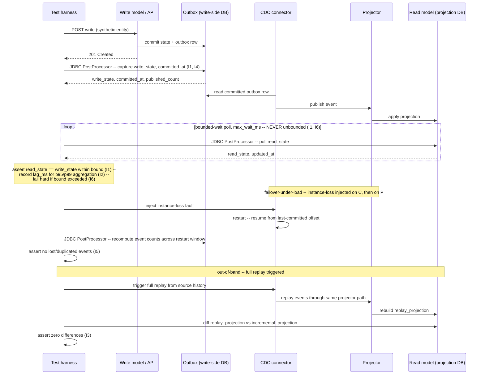

# Read-Model Convergence and CDC Lag

Status: Approved | Last Reviewed: 2026-08-12 | Owner: @qe-lead
Catalog ID: TST-037 | Radii
Tier Applicability: T0, T1

## 1. Applies To

| Catalog ID | Title | Document |
|---|---|---|
| DATA-001 | CQRS Pattern | [../../patterns/data/cqrs-pattern.md](../../patterns/data/cqrs-pattern.md) |
| DATA-008 | Change Data Capture (general) | [../../patterns/data/change-data-capture.md](../../patterns/data/change-data-capture.md) |
| DATA-007 | Kappa Architecture | [../../patterns/data/kappa-architecture.md](../../patterns/data/kappa-architecture.md) |
| DATA-006 | Lambda Architecture | [../../patterns/data/lambda-architecture.md](../../patterns/data/lambda-architecture.md) |
| DATA-012 | Data Virtualization | [../../patterns/data/data-virtualization.md](../../patterns/data/data-virtualization.md) |
| INT-002 | Transactional Outbox + CDC | [../../patterns/integration/cdc-outbox-pattern.md](../../patterns/integration/cdc-outbox-pattern.md) |
| INT-004 | Event Sourcing | [../../patterns/integration/event-sourcing.md](../../patterns/integration/event-sourcing.md) |

These seven rows share one archetype because they share one method of verification — writing
through the write side, then asserting the read side converges to match it within a declared,
bounded window at the tail percentile — not because they share a domain. A CQRS query-side
projection, a Kappa or Lambda serving layer, a virtualized data view, and a CDC-fed outbox
consumer are different components built for different reasons, but all four expose the same
failure surface: a downstream read model that is asynchronously derived from a write model and
can silently fall behind, drop data, or diverge. This archetype exists to catch that surface
wherever it appears.

## 2. Failure Taxonomy

- A read model that never converges because an event was dropped somewhere between the write
  and the projection.
- Convergence asserted by unbounded polling, producing a test that always eventually passes and
  therefore tests nothing.
- Lag measured as a mean, hiding the tail.
- An outbox row committed but never published.
- A full replay producing a different projection than the incremental path.
- A schema change breaking the projector silently.
- A CDC connector restarting from the wrong offset, causing duplication or gaps.

## 3. Functional Test Design

**Oracle:** `invariant-assertion`

### Invariants

| # | Invariant | Assertion |
|---|---|---|
| I1 | The read model converges to match the write model within the declared bound | `assert read_model_state == write_model_state`, evaluated only once the elapsed wait is inside the declared convergence bound, never before |
| I2 | Lag is asserted at the tail percentile, never the mean | `assert p95(lag_ms) <= declared_bound_ms and p99(lag_ms) <= declared_bound_ms`; a run that only asserts `mean(lag_ms)` fails this invariant regardless of what the mean shows |
| I3 | A full replay produces a projection identical to the incrementally built one | `assert replay_projection == incremental_projection` (field-by-field diff, zero differences) once the replay run completes |
| I4 | Every outbox row is eventually published exactly once | `assert outbox_row.published_count == 1` for every committed outbox row, recomputed from the outbox table and the broker's delivered-offset log — never from the publisher's own in-process success flag alone |
| I5 | No event is lost or duplicated across a connector restart | `assert event_count_after == event_count_before + events_produced_during_window` and `assert duplicate_event_id_count == 0`, recomputed from source and sink offsets spanning the restart window |
| I6 | Exceeding the convergence bound is a hard failure, never an indefinite wait | `assert test_result == FAIL` when `elapsed_wait_ms > declared_bound_ms`; the poll loop terminates at the bound and fails — it does not continue waiting for a match |

### Equivalence classes and boundaries

- Convergence completing well inside the declared bound versus convergence completing at the
  exact edge of the bound versus convergence never completing within the bound — I1 and I6's
  shared boundary.
- A lag distribution dominated by fast-converging records versus one with a long straggler tail
  — the case I2's tail-percentile assertion exists to distinguish from a mean that would hide it.
- A full replay run versus the ordinary incremental catch-up path building the same projection
  from the same source history — I3's boundary.
- An outbox row published on the first attempt versus one published only after a retry versus one
  that is committed but never picked up at all — I4's boundary.
- A connector restart from the correct last-committed offset versus a restart from a stale or
  advanced offset — the boundary between a clean recovery and I5's gap-or-duplication failure.

### Negative paths

- An event dropped between the write and the projection is never silently absorbed: the read
  model's projection for that record must remain visibly stale past the declared bound, failing
  I1 and I6 rather than being masked by a poll that simply never reports.
- An outbox row committed but never published is detected directly from the outbox table's own
  `published_count`, not inferred from the absence of a downstream error — I4's negative path.
- A schema change that breaks the projector silently (no thrown error, no crash, just a projector
  that stops making progress) is caught because I1/I2's lag keeps growing past the bound, not
  because the projector reports its own failure.
- A CDC connector that restarts from the wrong offset is rejected by I5's exact event-count and
  duplicate-ID check — a gap or a duplicate is a failure regardless of whether the connector's own
  health check reports green.

## 4. Performance Test Design

| Profile | Applies | Why | Threshold source |
|---|---|---|---|
| `baseline` | yes | Confirms the write-then-poll convergence path itself has not regressed before any load-shaped run | [NFR-002](../../nfr/latency-budget-model.md) |
| `load` | yes | Proves the connector and projector hold the declared tail-percentile lag bound (I2) under sustained steady-state throughput, not only at idle | [NFR-004](../../nfr/throughput-model.md) |
| `spike` | yes | A write burst is this archetype's most realistic trigger for a lag spike — exactly the tail-percentile excursion I2 exists to catch, and exactly the profile most likely to expose a connector or projector that cannot absorb a sudden backlog | [NFR-004](../../nfr/throughput-model.md) |
| `soak` | yes | Decisive for this archetype — see below | [NFR-002](../../nfr/latency-budget-model.md) |
| `failover-under-load` | yes | Decisive for this archetype — see below | [NFR-001](../../nfr/service-tiering-rto-rpo.md) |

**Workload model:** `open` for `spike` — a write burst is an exogenous arrival process the harness
must not throttle to its own population ceiling, per
[TST-003](../strategy/workload-modelling.md); `closed` for `baseline`, `load`, `soak`, and
`failover-under-load`, which hold a declared, bounded write population.

**`soak` is decisive, not incidental, for this archetype.** A slowly growing lag — one that
creeps upward a few milliseconds per minute rather than jumping in one visible step — is the
characteristic CDC failure mode, and it is invisible in a short run: a 60-minute run that samples
p95 lag once at the start and once at the end can show both samples comfortably inside the
declared bound while the trend between them is climbing toward a breach the run never lives long
enough to observe. This archetype's `soak` profile therefore asserts explicitly that the p95/p99
lag trend does **not** creep upward across the full hold — using the drift check already native
to [TST-002](../strategy/performance-test-standard.md)'s `soak` profile, applied here to the
lag distribution rather than to response-time drift in general. A soak run that reports the bound
held at every individual sample but does not also assert the trend is flat has not actually run
this archetype's soak profile.

**`failover-under-load` is equally decisive.** The connector `instance-loss` fault (§7) is
injected during this profile, not at idle, because a restart under active write traffic is the
one condition under which a wrong-offset resume is most likely to actually surface as a gap or a
duplicate (I5) — a restart against an idle system proves nothing about how the connector resumes
mid-stream.

## 5. Canonical Harness — JMeter

```xml
<!-- Thread Group: CLOSED model -- valid for baseline, load, soak, failover-under-load. See TST-003. -->
<ThreadGroup testname="tg-read-model-convergence-lag">
  <stringProp name="ThreadGroup.num_threads">${__P(users,20)}</stringProp>
  <stringProp name="ThreadGroup.ramp_time">${__P(rampup,60)}</stringProp>
  <stringProp name="ThreadGroup.duration">${__P(duration,3600)}</stringProp>
</ThreadGroup>

<CSVDataSet testname="synthetic_write_payloads.csv (SYNTHETIC -- no production data)">
  <stringProp name="filename">data/synthetic_write_payloads.csv</stringProp>
  <stringProp name="variableNames">entity_id,payload,expected_field</stringProp>
  <boolProp name="recycle">true</boolProp>
</CSVDataSet>

<HTTPSamplerProxy testname="POST write through the API (synthetic)">
  <stringProp name="HTTPSampler.path">/v1/entities</stringProp>
  <stringProp name="HTTPSampler.method">POST</stringProp>
</HTTPSamplerProxy>

<JDBCDataSource testname="write-side-synth-pool (SYNTHETIC schema)">
  <stringProp name="dataSource">write_synth</stringProp>
  <stringProp name="dbUrl">${__P(write_jdbc_url,jdbc:postgresql://write-perf.internal.example:5432/write_synth)}</stringProp>
</JDBCDataSource>

<JDBCPostProcessor testname="capture committed write-side state and commit timestamp (I1, I4)">
  <stringProp name="dataSource">write_synth</stringProp>
  <stringProp name="query">
    SELECT state, committed_at, outbox_published_count
    FROM write_synth.entity_outbox
    WHERE entity_id = ?
  </stringProp>
  <stringProp name="queryArguments">${entity_id}</stringProp>
  <stringProp name="variableNames">write_state,committed_at,published_count</stringProp>
</JDBCPostProcessor>

<JDBCDataSource testname="read-side-synth-pool (SYNTHETIC projection schema)">
  <stringProp name="dataSource">read_synth</stringProp>
  <stringProp name="dbUrl">${__P(read_jdbc_url,jdbc:postgresql://read-perf.internal.example:5432/read_synth)}</stringProp>
</JDBCDataSource>

<!-- Bounded-wait poll for read-model convergence (I1, I6). The upper bound
     (max_wait_ms) is mandatory -- see the bounded-wait terminal-state
     assertion pattern in TST-024 §5, applied here to a projection row
     rather than a saga's terminal state. -->
<WhileController testname="bounded-wait poll for read-model convergence (I1, I6) -- NEVER unbounded">
  <stringProp name="WhileController.condition">
    ${__jexl3("${elapsed_ms}" &lt; "${__P(max_wait_ms,5000)}" &amp;&amp; !"${converged}".equals("true"))}
  </stringProp>

  <JDBCPostProcessor testname="poll read-side projection row (I1)">
    <stringProp name="dataSource">read_synth</stringProp>
    <stringProp name="query">
      SELECT state, updated_at
      FROM read_synth.entity_projection
      WHERE entity_id = ?
    </stringProp>
    <stringProp name="queryArguments">${entity_id}</stringProp>
    <stringProp name="variableNames">read_state,updated_at</stringProp>
  </JDBCPostProcessor>
</WhileController>

<JSR223Assertion testname="fail if convergence bound exceeded (I6), else assert match and record lag (I1, I2)">
  <stringProp name="script"><![CDATA[
    // NEVER unbounded: the loop above stops polling at max_wait_ms regardless
    // of whether convergence has happened yet.
    long elapsed = Long.parseLong(vars.get("elapsed_ms"));
    long bound = Long.parseLong(vars.get("max_wait_ms"));

    if (elapsed > bound) {
        AssertionResult.setFailure(true);
        AssertionResult.setFailureMessage(
            "I6 violated: convergence bound " + bound
            + "ms exceeded for entity " + vars.get("entity_id")
            + " -- hard failure, not an indefinite wait"
        );
    } else if (!vars.get("read_state").equals(vars.get("write_state"))) {
        AssertionResult.setFailure(true);
        AssertionResult.setFailureMessage(
            "I1 violated: read_model_state != write_model_state for entity "
            + vars.get("entity_id")
        );
    } else {
        // Recorded per-sample; aggregated across the run at p95/p99, never
        // the mean, per I2.
        vars.put("lag_ms", String.valueOf(elapsed));
    }
  ]]></stringProp>
</JSR223Assertion>
```

```bash
jmeter -n -t read-model-convergence-lag.jmx \
  -Jusers="${JMETER_USERS}" -Jrampup="${JMETER_RAMPUP}" -Jduration="${JMETER_DURATION}" \
  -Jprofile="${JMETER_PROFILE}" -Jmax_wait_ms="${CONVERGENCE_BOUND_MS}" \
  -Jwrite_jdbc_url="${WRITE_SYNTH_JDBC_URL}" -Jread_jdbc_url="${READ_SYNTH_JDBC_URL}" \
  -l results.jtl -e -o report/
```

The **two `JDBCDataSource` pools** are the load-bearing elements: one reaches the write side's
own outbox/state table, the other reaches the read-side projection table, so I1's convergence
comparison and I4's publish-count check are both independent recomputations from source rows on
each side of the projection — never a single query re-reading the same aggregate twice. The
**`WhileController` bounded-wait poll** is this archetype's instance of the pattern
[TST-024](./saga-compensation.md) establishes for asserting a terminal condition without
flakiness: a mandatory upper bound, checked every iteration, that the loop actually stops at.
The **JSR223 Assertion** that follows encodes I6 directly — a bound exceeded is a hard failure,
reported and stopped there, not an assertion that keeps polling until it happens to pass.

For **I3**, a separate, out-of-band run triggers a full replay from source history through the
same projector code path (via the connector's admin API or a direct offset-reset), then diffs
the resulting `replay_projection` snapshot against the `incremental_projection` snapshot captured
from the ordinary run above, field by field, asserting zero differences. This runs once per test
cycle, gated behind `${__P(run_replay_diff,false)}`, rather than on every iteration, because a
full replay is an expensive operation distinct from the per-write convergence poll the rest of
this plan exercises.

For **I5**, the connector `instance-loss` fault (§7) is injected mid-run during
`failover-under-load`, and the same write-side and read-side JDBC pools recompute event counts
and duplicate-ID checks across the restart window once the connector has resumed.

## 6. Tool Fit

| Tool | Fit | When to prefer |
|---|---|---|
| JMeter | BEST | The native JDBC sampler and JDBC PostProcessor give a JDBC assertion on both sides of the projection — the write-side outbox table and the read-side projection table — in the same plan as the While Controller's bounded-wait poll; no other tool in the corpus reaches both schemas this directly |
| Locust | good | A Python task can issue its own write-side and read-side database queries and implement the same bounded-wait poll, but it lacks JMeter's native JDBC sampler ergonomics for a two-sided comparison in one plan element |
| Gatling + Karate | fair | Karate can script the write call and poll an HTTP-exposed read endpoint, but Gatling's JDBC support needs a plugin, and neither tool's DSL is built around a two-sided source-row recomputation |
| k6 | fair | `xk6-sql` is required for any JDBC-equivalent query on either side, since k6 has no native SQL capability at all |

## 7. Overlays

### Resilience overlay

Inject an `instance-loss` fault (per [TST-006](../strategy/resilience-test-standard.md)) against
two distinct components in turn, during the `failover-under-load` profile: first the CDC
connector process itself, then the projector/consumer process. These are deliberately treated
as two separate injections rather than one, because they exercise different failure surfaces —
a connector restart risks resuming from the wrong offset (I5's gap-or-duplication check), while
a projector restart risks losing in-flight projection state without losing the underlying event
stream (I1/I6's convergence-bound check, now measured across a restart rather than at idle).
After each fault's recovery completes, recompute I1 (read model still converges within the
declared bound, even if the bound's clock effectively restarts at the point of recovery) and,
for the connector case specifically, I5 (no event lost or duplicated across the restart window).
A result that only asserts these invariants against the pre-fault baseline has not exercised this
overlay at all.

### Data-quality overlay

I1 through I3 are completeness assertions in the terms
[TST-009](../strategy/data-quality-test-standard.md) defines the dimension: no event dropped, no
divergent replay, no gap across a restart. I2 is a direct instantiation of TST-009's
[Convergence and Lag Assertions](../strategy/data-quality-test-standard.md#convergence-and-lag-assertions)
rule — a declared bound, asserted at the tail percentile, with a hard failure on breach — applied
to this archetype's read-model lag rather than restated as a new rule. A test run that measures
this archetype's lag as a mean, or polls without a declared bound, has not satisfied TST-009's
rule and has not satisfied I2 or I6 either; the three are the same requirement viewed from the
strategy layer and from this archetype in turn.

Contract and security overlays are omitted: this archetype's failure modes are about read-model
completeness and timeliness under asynchronous propagation, not schema compatibility or access
control, so neither overlay applies.

## 8. Test Data Requirements

Synthetic write payloads and synthetic outbox/projection rows only, per
[TST-004](../strategy/test-data-management.md). Entities needed: a set of synthetic write-side
entities, each with a distinct `entity_id` and a payload whose expected projected field is known
up front, so the read-side comparison in I1 has a verifiable expected value rather than only a
self-consistency check; a subset of entities seeded with already-committed but deliberately
unpublished outbox rows, to exercise I4's negative path without the harness having to induce the
gap itself. The cardinality driver is the `spike` profile's peak write burst rate — enough
distinct entity IDs that the harness never recycles an ID mid-poll and silently substitutes one
entity's convergence check for another's. Referential-integrity requirement: every synthetic
write must produce exactly one corresponding outbox row and, once published, exactly one
corresponding read-side projection row — no orphaned projection rows with no write-side origin,
and no write-side row with no addressable projection counterpart once past the convergence bound.
Teardown: purge all synthetic write-side rows, outbox rows, and projection rows created during
the run, and reset connector offsets to their pre-run state, at environment reset, per
[TST-005](../strategy/environments-quality-gates.md).

## 9. Evidence and Observability

Metrics to capture: lag distribution (p50/p95/p99) per profile, with the `soak` profile's trend
across the full hold plotted explicitly rather than summarised as a single end-of-run number;
outbox `published_count` per row, aggregated to confirm every committed row reaches exactly one
publish; event counts and duplicate-ID counts spanning each `instance-loss` restart window (I5).
Trace assertions: a converged read-model row's trace must show the projector's write-path
completing before the poll that observed convergence returns success — a fast poll response
alone is not evidence the projection was actually applied rather than coincidentally already
correct from a prior run. Artifacts to attach to a DAB submission: the JMeter aggregate report
and HTML dashboard (per [TST-005](../strategy/environments-quality-gates.md)); the I3 replay-vs-
incremental diff report from the out-of-band replay run; the connector and projector offset logs
spanning each `instance-loss` fault injection, timestamped for when the fault was introduced and
when recovery completed.

## 10. Exit Criteria

The block below is illustrative for a synthetic service implementing this archetype's patterns —
every value is an example, not a normative one, per
[TST-001](../strategy/test-strategy-standard.md).

```yaml
test_acceptance_criteria:
  service_name: synthetic-read-model-service
  archetypes: [TST-037]
  catalog_refs: [DATA-001, INT-002]
  functional:
    invariants_covered: 6                 # I1-I6, all six are assertable
    negative_paths_covered: 4
    oracle: invariant-assertion
  performance:
    profiles_executed: [baseline, load, spike, soak, failover-under-load]
    workload_model: closed                # open only for spike; see §4 above
  resilience:
    fault_scenarios: [FM14, FM15]         # connector instance-loss, projector instance-loss
  data_quality:
    dq_rules_asserted: 3                  # I1, I2, I3 recomputed against source
    lag_assertion_percentile: p95         # never mean, per I2
```

## Compliance Mapping

| Layer | Reference | Section/Control | How this satisfies |
|---|---|---|---|
| Ring 0 | CQRS and Event Sourcing (canonical pattern definitions) | A query-side read model is asynchronously derived from a write model and must eventually converge to reflect it | I1-I3 are the assertable, mechanically-checked form of the convergence guarantee the CQRS and Event Sourcing patterns themselves depend on |
| Ring 1 | Basel BCBS 239 — Principle 3 (Accuracy and Integrity) | Risk data must be accurate and reconcilable to source | I1 and I3's convergence and replay-identity checks are the test evidence Principle 3 requires for any asynchronously derived read model |
| Ring 1 | Basel BCBS 239 — Principle 5 (Timeliness) | Risk data must be available within a timeframe that meets its intended use | I2's tail-percentile lag assertion, applying [TST-009](../strategy/data-quality-test-standard.md#convergence-and-lag-assertions)'s rule directly, is the test evidence Principle 5 requires |
| Ring 2 | SBV Circular 09/2020 ⚠️ (working summary — pending Legal review) | Data-availability and reporting-timeliness expectations for domestic financial reporting | This archetype's convergence-bound and tail-percentile lag invariants (I1, I2) are the technical control most directly responsible for satisfying the circular's timeliness expectation for any read model feeding a regulatory report |

## 12. Related Patterns

- [DATA-001 CQRS Pattern](../../patterns/data/cqrs-pattern.md)
- [DATA-008 Change Data Capture (general)](../../patterns/data/change-data-capture.md)
- [DATA-007 Kappa Architecture](../../patterns/data/kappa-architecture.md)
- [DATA-006 Lambda Architecture](../../patterns/data/lambda-architecture.md)
- [DATA-012 Data Virtualization](../../patterns/data/data-virtualization.md)
- [INT-002 Transactional Outbox + CDC](../../patterns/integration/cdc-outbox-pattern.md)
- [INT-004 Event Sourcing](../../patterns/integration/event-sourcing.md)

## 13. Related Archetypes

- [TST-024 Saga and Compensation Correctness](./saga-compensation.md): its bounded-wait
  terminal-state assertion pattern (§5, I4) is the pattern this archetype's read-model
  convergence poll reuses directly for I1/I6, applied to a projection row instead of a saga's
  terminal state.
- TST-038 — Cross-System Reconciliation (not yet published): may reuse this archetype's
  tail-percentile lag assertion for its own cross-system timeliness check, though the exact
  reuse depends on that archetype's own scope once it is drafted.
- TST-039 — Data Quality & Reconciliation (not yet published): may similarly reuse this
  archetype's tail-percentile lag assertion rather than restating it, if its own reconciliation
  method turns out to depend on an asynchronously derived value.

## 14. Diagram


