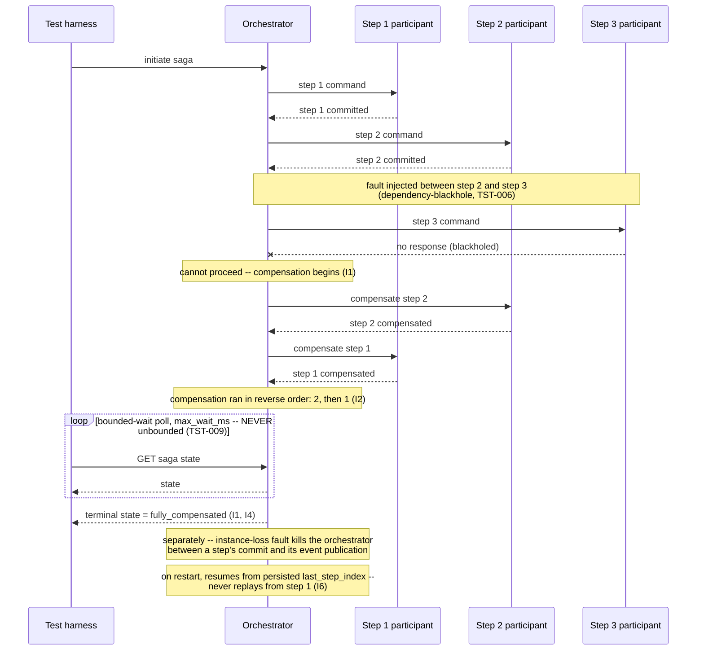

# Saga and Compensation Correctness

Status: Approved | Last Reviewed: 2026-08-12 | Owner: @qe-lead
Catalog ID: TST-024 | Radii
Tier Applicability: T0, T1

## 1. Applies To

| Catalog ID | Title | Document |
|---|---|---|
| INT-001 | Saga Orchestration | [../../patterns/integration/saga-orchestration.md](../../patterns/integration/saga-orchestration.md) |
| INT-016 | Distributed Saga Choreography | [../../patterns/integration/distributed-saga-choreography.md](../../patterns/integration/distributed-saga-choreography.md) |
| EIP-017 | Process Manager | [../../patterns/eip/process-manager.md](../../patterns/eip/process-manager.md) |
| EIP-016 | Routing Slip | [../../patterns/eip/routing-slip.md](../../patterns/eip/routing-slip.md) |

These four rows share one archetype because they all produce a multi-step business process
whose steps can partially succeed, and whose correctness therefore depends on a compensation or
resumption discipline — not because they share one coordination topology. INT-001 centralizes
compensation in an orchestrator. INT-016 has no central coordinator at all: compensation emerges
from the same event chain that drives the happy path, as a reactive branch of it. EIP-017 Process
Manager's own pattern doc is explicit that it "governs routing logic rather than
compensating-transaction logic," but that it composes with a Saga for the compensating branch
whenever a step fails — so wherever a Process Manager owns that composed flow, this archetype's
invariants apply to its compensating branch. EIP-016 Routing Slip's own pattern doc names the
identical failure mode this archetype exists to test directly: "partial failures mid-pipeline are
common... the pipeline must be resumable from the last completed step — not restarted from
scratch." Every one of the four therefore needs the same method of verification — invariant-
assertion over which steps committed, which compensated, in what order, and whether the process
resumes from persisted state — regardless of whether the coordination is centralized or emergent.

## 2. Failure Taxonomy

- Compensation not executed for a step that partially succeeded.
- A compensation that itself fails, with no escalation path.
- A non-idempotent compensation applied twice.
- A saga stuck with no timeout.
- Out-of-order compensation corrupting state.
- An orchestrator crash between step commit and event publication.
- A compensation running for a step that never committed.

## 3. Functional Test Design

**Oracle:** `invariant-assertion`, per
[TST-001 § The Four Oracles](../strategy/test-strategy-standard.md#the-four-oracles).

### Invariants

| # | Invariant | Assertion |
|---|---|---|
| I1 | For every committed step, either the saga completes or every committed step is compensated | `assert saga.terminal_state in {completed, fully_compensated}`, and when `fully_compensated`, `assert set(compensated_steps) == set(committed_steps)` |
| I2 | Compensations execute in reverse order of their forward steps | `assert compensation_invocation_order == list(reversed(committed_step_commit_order))` |
| I3 | Each compensation is idempotent | `assert count(net_effect) == 1` after replaying the same compensating action N ≥ 2 times against the same step — the identical idempotency-assertion method [TST-020](./idempotency-replay.md) uses for a forward operation, applied here to the compensating action instead |
| I4 | Every saga reaches a terminal state within its declared timeout | `assert saga.reached_terminal_state_at - saga.started_at <= declared_timeout` |
| I5 | No compensation runs for a step that did not commit | `assert compensated_steps.issubset(committed_steps)`, equivalently `assert count(compensation_invoked for step where step.committed == False) == 0` |
| I6 | Orchestrator restart resumes from persisted state, never from the beginning | `assert resumed_step_index == last_persisted_step_index` after a forced orchestrator restart, and `assert count(steps_re_executed_from_step_1) == 0` whenever `last_persisted_step_index > 1` |

### Equivalence classes and boundaries

- All steps commit, none fail — the happy-path completion (I1, I4).
- Step N fails after steps 1..N-1 committed — the canonical compensation path (I1, I2).
- Step 1 fails before it commits — the degenerate case where zero steps are committed, so zero
  compensations should run at all (I5).
- Boundary: failure lands on the very last step — every prior step must still be compensated;
  none may be left uncompensated merely because the saga was nearly complete (I1, I2).
- Boundary: an orchestrator crash landing exactly between a step's local commit and its event
  publication — the Failure Taxonomy's own crash case, made concrete (I6; see the Resilience
  overlay in §7).
- Boundary: a saga sitting exactly at its declared timeout instant — it must resolve to a
  terminal state, not remain in-flight one tick past the declared bound (I4).

### Negative paths

- A compensation request naming a step that never appears in the saga's committed-step log is
  rejected, never silently executed as if that step had committed (I5's negative path).
- A duplicate compensation trigger for a step already compensated is rejected or absorbed
  without a second net effect, never applied twice (I3's negative path).
- A saga that stalls past its declared timeout with no fault injected is flagged as a timeout
  violation, never left open indefinitely waiting for organic completion (I4's negative path;
  see the bounded-wait discipline in §5).
- A request to compensate step 2 before step 3's own compensation has completed, when step 3
  committed after step 2, is rejected — compensation out of reverse order is a defect, not a
  scheduling detail (I2's negative path).

## 4. Performance Test Design

| Profile | Applies | Why | Threshold source |
|---|---|---|---|
| `baseline` | yes | Confirms the saga's own state-machine transitions and compensation path have not regressed before any load-shaped run | [NFR-002](../../nfr/latency-budget-model.md) |
| `load` | yes | Proves the orchestrator (or the choreography's event chain) holds steady-state saga throughput without the state-persistence path becoming the bottleneck | [NFR-004](../../nfr/throughput-model.md) |
| `soak` | yes | Proves the saga-state store does not grow unbounded across many completed and compensated sagas, and that a stuck saga is actually caught by the declared timeout — over a window long enough to prove it, not merely to declare it | [NFR-003](../../nfr/capacity-planning-model.md) |
| `failover-under-load` | yes | The decisive profile for this archetype — see below | [NFR-001](../../nfr/service-tiering-rto-rpo.md) |

**Workload model:** `closed` for `baseline`, `load`, and `soak`, each holding a declared, bounded
population of concurrent sagas, per [TST-003](../strategy/workload-modelling.md).

**`failover-under-load` is the decisive profile for this archetype, not incidental.** Kill the
orchestrator mid-saga while traffic continues, then assert I1 and I6 specifically — not merely
that the service comes back up. I1 must hold across the crash: every step the orchestrator had
already committed before it died must either complete or be compensated once a new or restarted
instance resumes ownership. I6 must hold at the same moment: the resuming instance must pick up
from its last persisted step index, never replay the saga from step 1 — a replay-from-start would
double-execute already-committed steps, which is exactly the ambiguity between a fresh saga and a
resumed one that this profile exists to rule out. Both assertions are made after the fault and
after recovery completes, per
[TST-006 § Fault Injection Under Load](../strategy/resilience-test-standard.md#fault-injection-under-load),
which requires every resilience assertion in this archetype's Resilience overlay to be made under
the fault, not at idle.

## 5. Canonical Harness — JMeter

```xml
<!-- Transaction Controller: one saga = one measured transaction, matching the harness's
     own saga boundary to the business boundary I1/I4 assert over. -->
<TransactionController testname="tc-saga (initiate through terminal state)">
  <boolProp name="TransactionController.includeTimers">true</boolProp>
</TransactionController>

<HTTPSamplerProxy testname="POST initiate saga (synthetic order)">
  <stringProp name="HTTPSampler.path">/v1/sagas</stringProp>
  <stringProp name="HTTPSampler.method">POST</stringProp>
</HTTPSamplerProxy>

<!-- step 1 and step 2 samplers omitted for brevity; each posts its own commit event -->

<!-- Fault injection between step 2 and step 3: the harness flips a synthetic
     dependency-blackhole toggle only after step 2's own commit event is observed,
     never on a fixed sleep -- see TST-006 Fault Class Taxonomy. -->
<JSR223PreProcessor testname="inject dependency-blackhole between step 2 and step 3 (TST-006)">
  <stringProp name="script"><![CDATA[
    if ("true".equals(vars.get("step2_committed")) && "true".equals(vars.get("fault_enabled"))) {
        // route the step 3 sampler at http://step3-blackhole.internal.example, which
        // accepts the connection and never responds -- no error, no reset.
        vars.put("step3_target", "http://step3-blackhole.internal.example");
    }
  ]]></stringProp>
</JSR223PreProcessor>

<!-- Bounded-wait poll for the terminal state. The upper bound (max_wait_ms) is mandatory,
     not advisory: a While Controller with no bound is the exact "polling until success"
     anti-pattern TST-009 names directly -- see the explanation below. -->
<WhileController testname="bounded-wait poll for terminal state (I4) -- NEVER unbounded">
  <stringProp name="WhileController.condition">
    ${__jexl3("${poll_elapsed_ms}" &lt; "${__P(max_wait_ms,30000)}" &amp;&amp; "${saga_state}" != "terminal")}
  </stringProp>
</WhileController>

<JSR223Assertion testname="fail if terminal state not reached within max_wait_ms (I4)">
  <stringProp name="script"><![CDATA[
    if (!"terminal".equals(vars.get("saga_state"))) {
        AssertionResult.setFailure(true);
        AssertionResult.setFailureMessage(
            "I4 violated: saga " + vars.get("saga_id")
            + " did not reach a terminal state within " + vars.get("max_wait_ms") + "ms"
        );
    }
  ]]></stringProp>
</JSR223Assertion>
```

```bash
jmeter -n -t saga-compensation.jmx \
  -Jusers="${JMETER_USERS}" -Jrampup="${JMETER_RAMPUP}" -Jduration="${JMETER_DURATION}" \
  -Jmax_wait_ms=30000 -Jprofile="${JMETER_PROFILE}" \
  -l results.jtl -e -o report/
```

The **Transaction Controller** is the load-bearing measurement boundary: it makes "one saga" the
unit the aggregate report measures, matching the harness's own transaction boundary to the
business boundary I1 and I4 assert over. The **While Controller**'s declared `max_wait_ms` is the
load-bearing correctness element, not a performance nicety: a poll loop with no declared upper
bound would report success the first instant it happened to observe a terminal state, proving
nothing about whether the saga actually resolves within its declared timeout — exactly the
anti-pattern [TST-009 § Convergence and Lag Assertions](../strategy/data-quality-test-standard.md#convergence-and-lag-assertions)
names directly: "polling until success, with no declared bound, is not a test."

In Locust, the same two elements — the saga's own step boundary and the bounded-wait poll — fall
out of a `SequentialTaskSet` naturally, with the compensating branch expressed as part of the same
structure rather than bolted on afterward:

```python
from locust import SequentialTaskSet, task
import time

POLL_INTERVAL_S = 0.5

class SagaJourney(SequentialTaskSet):
    @task
    def step_1_reserve(self):
        r = self.client.post("/v1/sagas/step1", json=self.synthetic_payload)
        self.committed_steps = [1] if r.ok else []

    @task
    def step_2_authorize(self):
        r = self.client.post("/v1/sagas/step2", json=self.synthetic_payload)
        if r.ok:
            self.committed_steps.append(2)
        # fault injected here between step 2 and step 3 -- see TST-006

    @task
    def step_3_settle(self):
        r = self.client.post("/v1/sagas/step3", json=self.synthetic_payload)
        if r.ok:
            self.committed_steps.append(3)

    @task
    def poll_terminal_state(self):
        # Bounded-wait poll (I4) -- a deadline, never a `while True`. See TST-009.
        deadline = time.monotonic() + self.user.max_wait_s
        self.terminal_state = None
        while time.monotonic() < deadline:
            state = self.client.get(f"/v1/sagas/{self.saga_id}").json()["state"]
            if state in ("completed", "fully_compensated"):
                self.terminal_state = state
                return
            time.sleep(POLL_INTERVAL_S)
        raise AssertionError(
            f"I4 violated: saga {self.saga_id} did not reach a terminal "
            f"state within {self.user.max_wait_s}s"
        )

    @task
    def compensating_branch(self):
        # I2: compensation runs in reverse order of the forward steps that committed.
        if self.terminal_state == "fully_compensated":
            for step in reversed(self.committed_steps):
                self.client.post(f"/v1/sagas/{self.saga_id}/compensate/{step}")
```

That difference — the forward steps, the bounded poll, and the reverse-order compensating branch
all living as `@task` methods of the same `SequentialTaskSet`, ordered by declaration — is why
Locust, not JMeter, is rated `BEST` in §6 Tool Fit below. This is the same kind of "not JMeter"
primary-tool justification [TST-022 §6](./deterministic-calculation-engine.md#6-tool-fit)
established first in this corpus; it is precedent now, not novel.

## 6. Tool Fit

| Tool | Fit | When to prefer |
|---|---|---|
| JMeter | good | The Transaction Controller cleanly bounds the saga as a single measured transaction and a While Controller can express the bounded-wait poll, but the reverse-order compensating branch must be bolted on as a separate, manually ordered sampler chain rather than falling out of the journey's own structure |
| Gatling + Karate | good | Gatling's scenario DSL chains an ordered sequence cleanly, and Karate can script the compensation calls, but neither expresses a conditional, reverse-order compensating branch as a native construct of the forward chain |
| k6 | fair | k6's scenario/exec model can script the sequence and the poll loop, but it has no built-in journey abstraction that keeps the forward steps and the compensating branch structurally linked — both must be hand-coded as independent functions |
| Locust | BEST | `SequentialTaskSet` expresses an ordered multi-step journey and a compensating branch directly, in the same control-flow construct — no other tool in this corpus lets the forward sequence and its reverse-order compensating branch share one native abstraction, which JMX and Scala (Gatling) both make awkward |

Record `primary_tool: locust` for all four coverage rows in §1.

## 7. Overlays

### Resilience overlay

Inject three fault classes from
[TST-006 § Fault Class Taxonomy](../strategy/resilience-test-standard.md#fault-class-taxonomy),
each targeting a distinct compensation failure mode from §2:

- `instance-loss` on the orchestrator itself, mid-saga — the crash case (§2's
  orchestrator-crash-between-commit-and-publish entry, made concrete); assert I1 and I6 once a
  new or restarted instance resumes.
- `dependency-blackhole` on the service or dependency owning step 2 of 3 — forces exactly the
  partial-success case I1 exists to catch: step 1 has committed, step 2 never returns, and the
  saga must still resolve to either completion or full compensation, never hang indefinitely
  (I4's negative path).
- `partial-partition` between the orchestrator and one participant — the out-of-order-
  compensation risk named in §2: the orchestrator can reach some participants but not others, so
  a compensation may be issued to the wrong subset, or in the wrong order, if the orchestrator's
  own view of committed state is stale relative to which participants it can currently reach (I2,
  I5).

### Contract overlay

Verify the saga's own event contracts — the commands an orchestrator issues, and the events a
choreographed saga's participants emit and consume — per
[TST-007 Contract and Integration Test Standard](../strategy/contract-integration-test-standard.md).
Cross-link TST-030 (not yet published; see [§13 Related Archetypes](#13-related-archetypes)):
TST-030 owns the general async event-contract verification method; this overlay applies that
method specifically to a saga's own command/event schemas — the saga-initiated, step-completion,
and compensating-event payloads — rather than restating TST-030's contract-testing technique here.
A schema-incompatible compensating event is exactly as dangerous as a schema-incompatible forward
event: if a compensating event's consumer cannot deserialize it, I1's guarantee that a committed
step is compensated is untestable no matter how correct the emitting side's own logic is.

Security and data-quality overlays are omitted: this archetype's failure modes are about
compensation correctness and saga termination, not access control or data-quality reconciliation,
so neither overlay applies.

## 8. Test Data Requirements

Synthetic only, per [TST-004](../strategy/test-data-management.md). Entities needed: a synthetic
multi-step saga definition (order, payment, and inventory-style steps are sufficient to exercise
the boundary matrix in §3); a synthetic correlation ID per saga instance, carried by every
participant's own event or command; a synthetic committed-step log per saga instance, so I1, I2,
and I5 can be checked against a source of record rather than inferred from response codes alone.
The cardinality driver is the boundary matrix in §3, not load volume: every failure point (step 1
through step N), the timeout boundary, and the crash-between-commit-and-publish boundary must each
appear at least once, independent of how many virtual users the `load` profile drives.
Referential-integrity requirement: every participant's committed-step and compensation record must
resolve against the same synthetic correlation ID, so a saga's full forward-and-compensation
history is reconstructable from that one ID. Teardown: purge every synthetic saga-state row,
committed-step log entry, and compensation record at environment reset, per
[TST-005](../strategy/environments-quality-gates.md).

## 9. Evidence and Observability

Metrics to capture: saga completion count against compensation count, which together must account
for every initiated saga (I1); time-to-terminal-state distribution against the declared timeout
(I4); count of compensation-order violations, which must be zero (I2); count of stuck sagas the
`soak` profile's timeout monitor actually catches, to prove the monitor runs rather than merely
being declared. Trace assertions: a saga's trace must show each step's commit span, and — on the
compensation path — each compensation span in reverse order of the corresponding commit spans,
with no compensation span appearing for a step whose commit span never completed (I5). Artifacts
to attach to a DAB submission: the JMeter aggregate report and HTML dashboard, or the Locust
distribution report when Locust is the primary tool (per
[TST-005](../strategy/environments-quality-gates.md)); the fault-injection log from the Resilience
overlay, timestamped for when each of `instance-loss`, `dependency-blackhole`, and
`partial-partition` was introduced and removed; and the per-saga committed-step and compensation
log export used to check I1, I2, and I5 against the system of record.

## 10. Exit Criteria

The block below is illustrative for a synthetic service implementing this archetype's patterns —
every value is an example, not a normative one, per
[TST-001](../strategy/test-strategy-standard.md).

```yaml
test_acceptance_criteria:
  service_name: synthetic-payment-saga
  archetypes: [TST-024]
  catalog_refs: [INT-001, EIP-017]
  functional:
    invariants_covered: 6                 # I1-I6, all six are assertable
    negative_paths_covered: 4
    oracle: invariant-assertion
  performance:
    profiles_executed: [baseline, load, soak, failover-under-load]
    workload_model: closed                # baseline, load, soak; see §4 above
  resilience:
    fault_scenarios: [FM31, FM32, FM33]    # this service's own instance-loss,
                                           # dependency-blackhole, partial-partition entries
  contract:
    consumer_contracts_verified: 1
    schema_compat_mode: BACKWARD
```

## Compliance Mapping

| Layer | Reference | Section/Control | How this satisfies |
|---|---|---|---|
| Ring 0 | Saga pattern (Garcia-Molina and Salem) | A long-lived transaction as a sequence of local transactions, each with a compensating transaction | I1, I2, and I5 are the assertable form of the Saga's own compensation contract: every committed local transaction either completes or is undone, in reverse order, and never for a step that did not commit |
| Ring 0 | Microsoft Cloud Design Patterns — Saga | Maintaining data consistency across microservices using a sequence of local transactions coordinated via compensation | I1, I4, and I6 are the assertable form of this pattern's own consistency and recovery guarantees: a saga either completes or fully compensates, within a declared timeout, and a restarted coordinator resumes rather than restarts |
| Ring 1 | Basel BCBS 239 — Principle 3 (Accuracy and Integrity) | Risk and financial data arising from a multi-step process must be accurate and reconcilable to source, including after a partial failure | I1 and I5 are the accuracy control: a partially-succeeded multi-step transaction must be fully compensated or fully completed, never left in a state that misstates which steps actually took effect |
| Ring 1 | ISO 20022 — multi-leg message flows (`pacs.008` → `pacs.002` → `pacs.004` reversal) | A payment's multi-leg message sequence, including its reversal leg, must resolve consistently end to end | I1 and I2 assert the same consistency an ISO 20022 reversal flow requires: a `pacs.008` credit transfer that cannot complete must be reversed via `pacs.004` in the correct order relative to the `pacs.002` status leg it followed, never left half-applied |
| Ring 2 | SBV Circular 09/2020 §IV.2 ⚠️ (working summary — pending Legal review) | Operational continuity and transaction-integrity requirements for domestic financial systems | This archetype's compensation and resumption invariants (I1, I5, I6) are the technical control most directly responsible for a multi-step transaction resolving consistently even across an orchestrator failure, which §IV.2's continuity expectation depends on |

## 12. Related Patterns

- [INT-001 Saga Orchestration](../../patterns/integration/saga-orchestration.md)
- [INT-016 Distributed Saga Choreography](../../patterns/integration/distributed-saga-choreography.md)
- [EIP-017 Process Manager](../../patterns/eip/process-manager.md)
- [EIP-016 Routing Slip](../../patterns/eip/routing-slip.md)

## 13. Related Archetypes

- [TST-020 Idempotency & Replay Safety](./idempotency-replay.md) — supplies the idempotency-
  assertion method this archetype reuses in I3, applied to a compensating action rather than a
  forward operation; consumed, not restated.
- TST-030 — Async Event Contract Verification (not yet published): owns the general
  contract-verification method the Contract overlay in §7 applies to this archetype's own saga
  event schemas, rather than restating it here.
- TST-037 — Saga Timeout & Escalation Policy (not yet published): reuses this archetype's
  bounded-wait terminal-state assertion (§5, I4) rather than restating it.

## 14. Diagram


