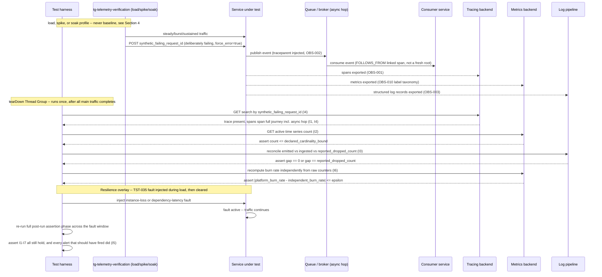

# Telemetry and Observability Verification

Status: Approved | Last Reviewed: 2026-08-12 | Owner: @qe-lead
Catalog ID: TST-042 | Radii
Tier Applicability: T0, T1, T2

## 1. Applies To

| Catalog ID | Title | Document |
|---|---|---|
| OBS-001 | OpenTelemetry Instrumentation | [../../patterns/observability/otel-instrumentation.md](../../patterns/observability/otel-instrumentation.md) |
| OBS-002 | Distributed Trace Propagation | [../../patterns/observability/distributed-trace-propagation.md](../../patterns/observability/distributed-trace-propagation.md) |
| OBS-003 | Structured Logging Standard | [../../patterns/observability/structured-logging-standard.md](../../patterns/observability/structured-logging-standard.md) |
| OBS-004 | SLO Alerting | [../../patterns/observability/slo-alerting.md](../../patterns/observability/slo-alerting.md) |
| OBS-005 | Async Middleware Observability | [../../patterns/observability/async-middleware-observability.md](../../patterns/observability/async-middleware-observability.md) |
| OBS-006 | Error Budget Burn Rate Alerting | [../../patterns/observability/error-budget-burn-rate.md](../../patterns/observability/error-budget-burn-rate.md) |
| OBS-007 | Distributed Tracing Sampling Strategy | [../../patterns/observability/tracing-sampling-strategy.md](../../patterns/observability/tracing-sampling-strategy.md) |
| OBS-008 | Log Aggregation Pipeline | [../../patterns/observability/log-aggregation-pipeline.md](../../patterns/observability/log-aggregation-pipeline.md) |
| OBS-009 | Synthetic Monitoring and Canary Probes | [../../patterns/observability/synthetic-monitoring-canary.md](../../patterns/observability/synthetic-monitoring-canary.md) |
| OBS-010 | Metrics Cardinality Management | [../../patterns/observability/metrics-cardinality-management.md](../../patterns/observability/metrics-cardinality-management.md) |
| BP-004 | Observability Standards | [../../best-practices/observability-standards.md](../../best-practices/observability-standards.md) |
| BP-007 | Golden Signals (SRE) | [../../best-practices/golden-signals-sre.md](../../best-practices/golden-signals-sre.md) |
| BP-008 | Error Budgets | [../../best-practices/error-budgets.md](../../best-practices/error-budgets.md) |

These thirteen rows share one archetype because the method of verification is identical across
all of them: run traffic through the system, then query the tracing, metrics, logging, and
alerting backends over their own APIs to prove — mechanically, after the fact — that what each row
declares is actually happening in production, not merely wired up. OBS-001's instrumentation and
OBS-002's propagation format are the substrate every other row in this table depends on; a trace
that does not span an async hop (OBS-002) makes OBS-005's `FOLLOWS_FROM` claim unverifiable, and a
sampling policy (OBS-007) that drops a failing request makes OBS-001's instrumentation invisible
exactly when it matters most. OBS-003 and OBS-008 are the same completeness question applied to
logs instead of traces. OBS-010 is the same completeness question applied to metrics: a cardinality
explosion under load does not merely cost money, it takes the backend down, which is why I2 treats
it as a correctness invariant rather than a FinOps concern. OBS-004 and OBS-006 are the alerting
layer built on top of all of the above — an alert is only as good as the SLI it reads and the burn
rate arithmetic that decides when to fire. OBS-009's synthetic probes are the one row in this table
that generates its own traffic rather than observing real traffic, which is exactly the mechanism
this archetype's harness (§5) reuses to produce a deliberately failing, identifiable request.
BP-004 Observability Standards, BP-007 Golden Signals (SRE), and BP-008 Error Budgets are not
patterns under test in the same sense as the ten OBS-\* rows — each is a best-practice framework
this archetype's invariants operationalise into a pass/fail check: BP-004's three-pillars framing
is what I1, I3, and I7 each verify one pillar of; BP-007's four golden signals are what I2's
cardinality bound protects the queryability of; BP-008's error-budget model is what I6's
independent burn-rate recomputation holds accountable. Without these three best-practice rows in
this table, BP-004, BP-007, and BP-008 would have no coverage row that names an archetype, and
would fail catalog check 1.

This archetype consumes [TST-002](../strategy/performance-test-standard.md)'s `load`, `spike`, and
`soak` profiles (§4) rather than defining its own load-shape vocabulary, and its harness (§5)
produces the post-run backend-assertion phase that gives every other archetype's own Evidence and
Observability section (§9) a concrete method for capturing trace and metric evidence, instead of
each archetype inventing its own query technique against the tracing and metrics backends.

## 2. Failure Taxonomy

- A trace broken at an async hop — a queue, topic, or broker boundary — so the journey cannot be
  reconstructed from ingress through to its eventual consumer.
- Metric cardinality exploding under load and overwhelming the metrics backend, taking the entire
  observability stack down exactly when the incident it would have explained begins.
- A log pipeline dropping records silently under burst, with no counter anywhere recording that a
  drop happened at all.
- Sampling configured so aggressively that failing requests are never captured, leaving the one
  trace an incident investigation needs missing from the backend it is queried against.
- An alert defined in configuration but never actually firing — a specification of what should page
  on-call, with no drill ever having proven it does.
- A burn-rate alert firing on an arithmetic error in its own recording-rule computation, rather than
  on a genuine budget-consuming event.
- Inconsistent structured-log fields across services or over time, so a query built against the
  declared schema silently misses records that used a different field name for the same fact.
- Trace context lost across a queue boundary, so the consumer-side span starts a fresh trace with no
  link back to the producer that emitted the message.

## 3. Functional Test Design

**Oracle:** `invariant-assertion`, per
[TST-001 § The Four Oracles](../strategy/test-strategy-standard.md#the-four-oracles).

### Invariants

| # | Invariant | Assertion |
|---|---|---|
| I1 | A trace spans the full journey, including asynchronous hops | `assert count(distinct trace_id across every span from ingress through every async hop) == 1`, with each async hop's consumer span linked to its producer span via `FOLLOWS_FROM` per [OBS-002](../../patterns/observability/distributed-trace-propagation.md), not started as a fresh root trace |
| I2 | Metric cardinality stays within its declared bound at peak load | `assert active_time_series_count(service) <= declared_cardinality_bound`, sampled at peak during `load`/`spike`/`soak`, against the approved label taxonomy in [OBS-010](../../patterns/observability/metrics-cardinality-management.md) |
| I3 | The log pipeline drops nothing at peak, or drops observably and countably | `assert emitted_log_count == ingested_log_count` at peak, **or** `assert (emitted_log_count - ingested_log_count) == reported_dropped_count` where `reported_dropped_count` is itself an emitted, queryable metric — an unreconciled gap between emitted and ingested counts is always a failure, never an accepted silent loss |
| I4 | An error is always captured in traces regardless of the base sampling rate | `assert trace_exists(synthetic_failing_request_id) == true`, checked against the tracing backend even when the service's configured base sampling rate is at its lowest declared tier (the T2 1% probabilistic floor in [OBS-007](../../patterns/observability/tracing-sampling-strategy.md)) — the always-keep-errors tail policy must hold independent of the base rate |
| I5 | Every declared alert fires in a drill | `assert alert_fired_count_during_drill >= 1` for every alert in the service's declared alert registry ([OBS-004](../../patterns/observability/slo-alerting.md)), observed via the alerting backend's own firing history, never inferred from the alert rule's configuration existing |
| I6 | Burn-rate computation matches an independent calculation | `assert abs(platform_reported_burn_rate - independently_recomputed_burn_rate) <= epsilon`, where the independent value is recomputed from the raw numerator/denominator (error count, total count) per [OBS-006](../../patterns/observability/error-budget-burn-rate.md)'s formula — never by re-reading the platform's own recording-rule output a second time |
| I7 | Required structured-log fields are present on every record | `assert count(records missing any field in the mandatory schema) == 0`, checked against every record sampled at peak load, per [OBS-003](../../patterns/observability/structured-logging-standard.md)'s mandatory JSON log schema |

### Equivalence classes and boundaries

- A synchronous, single-hop request versus a request that crosses at least one async hop (a queue
  or broker boundary) — only the latter exercises I1's `FOLLOWS_FROM` linkage; a suite that only
  ever tests the synchronous case can pass I1 vacuously.
- Metric cardinality comfortably under its declared bound versus cardinality at the declared bound
  versus cardinality exceeding it — I2's boundary is the declared bound itself, not a comfortable
  margin under it.
- A log volume the pipeline fully ingests versus a burst volume that forces the pipeline to drop —
  I3 requires the dropped case to still be observable and countable, not merely absent from the
  test.
- A request sampled at the service's base rate versus a deliberately failing request evaluated
  against the same base rate — I4 is specifically the boundary case where the base rate alone would
  normally have discarded the trace, and the always-keep-errors policy must override it.
- An alert whose underlying SLI briefly crosses its threshold and clears versus one that sustains
  past the drill's observation window — I5 requires the drill to observe an actual firing event, not
  merely a threshold crossing that never propagated to the alerting backend.
- A burn-rate value computed correctly from a healthy SLI feed versus one computed from a recording
  rule with a stale or malformed input — I6's independent recomputation is what distinguishes a
  genuine budget-consuming event from an arithmetic error in the pipeline itself.

### Negative paths

- A trace that terminates at a queue boundary with no consumer-side span linked to it is a taxonomy
  violation (I1), never accepted as "the producer side is instrumented, that's enough."
- A cardinality measurement taken only at idle, never at peak, does not satisfy I2 — the bound must
  be checked under `load`, `spike`, and `soak`, per §4, since idle cardinality tells nothing about
  the peak condition the invariant exists to protect.
- A log-count reconciliation that reports a gap with no corresponding `reported_dropped_count`
  metric is rejected outright as an unaccounted loss (I3's negative path), never waved through as
  "probably just retries."
- A synthetic failing request absent from the tracing backend is an I4 violation regardless of what
  the service's base sampling rate is configured to — "the sampling rate was low" is never an
  accepted explanation for a missing error trace.
- An alert rule that exists in configuration but records zero firings across a full drill window is
  flagged as a taxonomy violation (I5), never treated as evidence the system was simply healthy
  throughout the drill.
- A burn-rate alert that fires with no independently-recomputed value within tolerance of the
  platform-reported one is rejected as an arithmetic defect (I6), even if the alert's own firing
  behaviour otherwise looks correct.

## 4. Performance Test Design

| Profile | Applies | Why | Threshold source |
|---|---|---|---|
| [TST-002 § `load`](../strategy/performance-test-standard.md#load) | yes | Sustained steady-state traffic is what drives metric cardinality toward its declared bound (I2) and log volume toward the pipeline's steady-state throughput ceiling — the peak conditions I2 and I3 exist to catch, never visible at idle | [NFR-004](../../nfr/throughput-model.md) |
| [TST-002 § `spike`](../strategy/performance-test-standard.md#spike) | yes | A burst is the sharpest test of I3's log-pipeline drop behaviour and I2's cardinality explosion — a sudden concentration of log volume or new label values in a short window is exactly the shape that overwhelms a backend sized for steady state | [NFR-004](../../nfr/throughput-model.md) |
| [TST-002 § `soak`](../strategy/performance-test-standard.md#soak) | yes | Sustained duration is what surfaces a slow cardinality creep, a gradual log-pipeline backlog growth that never fully drains, or a burn-rate drift — failures that a short run's two endpoint samples would show as comfortably passing on both sides of a slowly worsening trend | [NFR-003](../../nfr/capacity-planning-model.md) |

**`baseline` is deliberately absent from this table.** Every invariant in §3 concerns behaviour
that manifests specifically at peak load or over sustained duration — trace loss under high-volume
async fan-out, cardinality explosion, log-pipeline drops under burst, and burn-rate drift are each a
function of load and time, not of correctness at idle. A `baseline` run's low, steady, single-digit
throughput never approaches the peak or duration conditions any of I1 through I7 depend on to
surface a failure; a service can pass every observability check at `baseline` while OBS-010's
cardinality bound, OBS-008's pipeline throughput ceiling, and OBS-006's burn-rate arithmetic all
fail the instant real peak traffic arrives. A `baseline` observability check therefore only ever
confirms that the four telemetry pillars are wired up at all — a smoke check on instrumentation
presence, not a verification of this archetype's invariants — so it earns no row in this table and
must never be cited as having exercised I1 through I7.

**Workload model:** `open` for `spike`, per [TST-003](../strategy/workload-modelling.md), since the
burst that stresses the log pipeline and cardinality gate must be an exogenous arrival process the
harness does not throttle — a closed model's population would self-limit the very burst I2 and I3
exist to catch. `closed` for `load` and `soak` — a fixed, declared population held steady is what
lets the cardinality and log-throughput measurements be compared against a stable, repeatable
baseline run over run.

## 5. Canonical Harness — JMeter

```xml
<!-- Thread Group: closed-model steady traffic for load/soak, or spike-shaped arrival for spike.
     One request in the population is deliberately, permanently failing -- see below. -->
<ThreadGroup testname="tg-telemetry-verification">
  <stringProp name="ThreadGroup.num_threads">${__P(users,100)}</stringProp>
  <stringProp name="ThreadGroup.ramp_time">${__P(rampup,60)}</stringProp>
  <stringProp name="ThreadGroup.duration">${__P(duration,3600)}</stringProp>
</ThreadGroup>

<!-- One deliberately failing synthetic request per iteration, tagged with a distinctive,
     grep-able business id so the post-run assertion phase below can look it up by name rather
     than by guessing which of thousands of spans is the failing one. This is how I4 is proven. -->
<HTTPSamplerProxy testname="POST /v1/payments/synthetic (deliberately failing -- SYNTHETIC, no real data)">
  <stringProp name="HTTPSampler.path">/v1/payments/synthetic</stringProp>
  <stringProp name="HTTPSampler.method">POST</stringProp>
  <stringProp name="HTTPSampler.postBodyRaw">true</stringProp>
  <elementProp name="HTTPsampler.Arguments" elementType="Arguments">
    <collectionProp name="Arguments.arguments">
      <elementProp name="" elementType="HTTPArgument">
        <!-- request_id is fixed per run, not per iteration, so the tracing-backend query in the
             tearDown phase below has exactly one known id to look up. -->
        <stringProp name="Argument.value">{"request_id":"${synthetic_failing_request_id}","force_error":true}</stringProp>
      </elementProp>
    </collectionProp>
  </elementProp>
</HTTPSamplerProxy>

<!-- tearDown Thread Group: runs once, after every main Thread Group has finished. This is the
     "post-run assertion phase" -- it queries the tracing and metrics backends over their own
     APIs, exactly as a human investigator would, rather than trusting the harness's own
     in-process view of what happened during the run. -->
<TearDownThreadGroup testname="tg-post-run-backend-assertion">
  <stringProp name="ThreadGroup.num_threads">1</stringProp>

  <!-- I4: query the tracing backend for the one known-failing request id. -->
  <HTTPSamplerProxy testname="GET tracing backend API -- search trace by synthetic_failing_request_id (I4)">
    <stringProp name="HTTPSampler.path">/api/search?tags=business.request_id=${synthetic_failing_request_id}</stringProp>
    <stringProp name="HTTPSampler.method">GET</stringProp>
  </HTTPSamplerProxy>
  <JSR223Assertion testname="assert synthetic failing request is present in traces regardless of base sampling rate (I4)">
    <stringProp name="script"><![CDATA[
      def traces = new groovy.json.JsonSlurper().parseText(prev.getResponseDataAsString())
      if (!traces.traces || traces.traces.isEmpty()) {
          AssertionResult.setFailure(true)
          AssertionResult.setFailureMessage(
              "I4 violated: synthetic failing request " + vars.get("synthetic_failing_request_id")
              + " absent from tracing backend -- error not captured despite base sampling rate")
      }
    ]]></stringProp>
  </JSR223Assertion>

  <!-- I2: query the metrics backend's own cardinality-explorer API at peak, not at idle. -->
  <HTTPSamplerProxy testname="GET metrics backend API -- active time series count for service (I2)">
    <stringProp name="HTTPSampler.path">/api/v1/status/tsdb</stringProp>
    <stringProp name="HTTPSampler.method">GET</stringProp>
  </HTTPSamplerProxy>
  <JSR223Assertion testname="assert active time series count is within declared cardinality bound (I2)">
    <stringProp name="script"><![CDATA[
      def status = new groovy.json.JsonSlurper().parseText(prev.getResponseDataAsString())
      long activeSeries = status.data.seriesCountByMetricName.values().sum()
      long bound = Long.parseLong(vars.get("declared_cardinality_bound"))
      if (activeSeries > bound) {
          AssertionResult.setFailure(true)
          AssertionResult.setFailureMessage(
              "I2 violated: " + activeSeries + " active series exceeds declared bound " + bound)
      }
    ]]></stringProp>
  </JSR223Assertion>

  <!-- I3: reconcile emitted vs ingested log counts, or the declared drop counter, at peak. -->
  <JSR223Sampler testname="reconcile emitted vs ingested log counts against log-pipeline API (I3)">
    <stringProp name="script"><![CDATA[
      def emitted = logBackendClient.emittedCount(vars.get("run_id"))
      def ingested = logBackendClient.ingestedCount(vars.get("run_id"))
      def reportedDropped = logBackendClient.reportedDroppedCount(vars.get("run_id"))
      def gap = emitted - ingested
      if (gap != 0 && gap != reportedDropped) {
          AssertionResult.setFailure(true)
          AssertionResult.setFailureMessage(
              "I3 violated: unreconciled log gap " + gap + " (reported dropped=" + reportedDropped + ")")
      }
    ]]></stringProp>
  </JSR223Sampler>

  <!-- I6: recompute burn rate independently from raw counters, never re-reading the platform's
       own recording-rule output a second time. -->
  <JSR223Sampler testname="independently recompute burn rate from raw error/total counters (I6)">
    <stringProp name="script"><![CDATA[
      def errorCount = metricsBackendClient.rawCounter("http_requests_total", [status: "5xx"])
      def totalCount = metricsBackendClient.rawCounter("http_requests_total", [:])
      def sloTarget = Double.parseDouble(vars.get("declared_slo_target"))
      def independentBurnRate = (errorCount / totalCount) / (1 - sloTarget)
      def platformBurnRate = metricsBackendClient.recordingRuleValue("burn_rate_1h")
      def epsilon = Double.parseDouble(vars.get("burn_rate_epsilon"))
      if (Math.abs(platformBurnRate - independentBurnRate) > epsilon) {
          AssertionResult.setFailure(true)
          AssertionResult.setFailureMessage(
              "I6 violated: platform burn rate " + platformBurnRate
              + " disagrees with independent recomputation " + independentBurnRate)
      }
    ]]></stringProp>
  </JSR223Sampler>
</TearDownThreadGroup>
```

```bash
jmeter -n -t telemetry-verification.jmx \
  -Jusers="${JMETER_USERS}" -Jrampup="${JMETER_RAMPUP}" -Jduration="${JMETER_DURATION}" \
  -Jprofile="${JMETER_PROFILE}" -Jdeclared_cardinality_bound="${OBS_CARDINALITY_BOUND}" \
  -Jsynthetic_failing_request_id="${SYNTHETIC_FAILING_REQUEST_ID}" \
  -l results.jtl -e -o report/
```

The **`TearDownThreadGroup`** is the load-bearing element of this harness: it runs exactly once,
after every main Thread Group has finished, and every one of its samplers queries a real backend
API — the tracing backend's search endpoint, the metrics backend's TSDB status endpoint, the log
pipeline's own count API — rather than reasoning from anything the main Thread Group observed
in-process during the run. That separation is what makes this a genuine post-run backend-assertion
phase instead of a client-side approximation of one, and it is exactly the phase every other
archetype's own §9 Evidence and Observability section points back to (§1) rather than each one
re-inventing its own backend query technique.

## 6. Tool Fit

| Tool | Fit | When to prefer |
|---|---|---|
| JMeter | BEST | A `TearDownThreadGroup` that runs once after the main load and issues real HTTP calls against the tracing, metrics, and log backend APIs is a native, first-class JMeter construct — the post-run backend-assertion phase this archetype's harness depends on is straightforward to express, with no bolted-on scripting layer required to get the ordering right |
| k6 | good | A `teardown()` function runs once after the main scenario and can issue the same backend API calls, but k6 has no equivalent to JMeter's per-thread-group scoping, so isolating the post-run phase from the main load's own metrics requires deliberate tagging discipline |
| Locust | good | A `test_stop` event handler can run the same post-run backend queries in plain Python, but Locust has no declarative teardown-phase construct — the ordering guarantee that every main-phase request has actually completed before the assertion phase begins must be hand-built |
| Gatling + Karate | fair | Karate can script the backend API assertions cleanly once the run has finished, but Gatling's own DSL has no native "run once after the load injection completes" phase, so the two tools must be chained externally by the pipeline rather than composed in one plan |

Record `primary_tool: jmeter` for all thirteen coverage rows in §1 — the post-run
backend-assertion phase is identical regardless of which OBS-\* pattern or best-practice row a
given service's telemetry is being verified against.

## 7. Overlays

### Resilience overlay

Inject an `instance-loss` or `dependency-latency` fault (per
[TST-006 § Fault Class Taxonomy](../strategy/resilience-test-standard.md#fault-class-taxonomy)),
using [TST-035](./fault-injection-degradation.md)'s
[Resilience overlay](./fault-injection-degradation.md#resilience-overlay) mechanism, during this
archetype's `load` profile — not at idle. Immediately after the fault clears, re-run the full §5
post-run backend-assertion phase and assert I1 through I7 still hold across the fault window: the
trace for a request that spanned the fault must still show its full journey (I1), cardinality must
still sit within its declared bound even as error-labelled series spike (I2), the log pipeline must
still reconcile or countably drop (I3), the deliberately failing synthetic request must still be
present in traces (I4), every declared alert — including the one the injected fault itself should
have triggered — must have fired (I5), the burn-rate computation must still match an independent
recalculation even as the SLI degrades sharply (I6), and every structured-log field must still be
present on records emitted during the fault (I7). Telemetry that goes dark, drops silently, or
mis-fires exactly during the incident it exists to explain is worthless — this overlay is what
proves observability itself survives the conditions it is built to observe, rather than assuming it
does because it worked during a quiet run.

Contract, Security, and Data-quality overlays are omitted: this archetype's failure modes are about
telemetry completeness and correctness under load and duration — trace continuity, cardinality
bounds, log-pipeline integrity, sampling behaviour, alert firing, and burn-rate arithmetic — not
schema/wire compatibility, access control, or data-quality reconciliation, so none of the three
overlays applies.

## 8. Test Data Requirements

Synthetic only, per [TST-004](../strategy/test-data-management.md). Entities needed: a synthetic
traffic population sized to reach the declared cardinality bound at peak (§4), so I2 is checked
against a genuine peak rather than an under-scaled approximation of one; exactly one deliberately,
permanently failing synthetic request per run, carrying a fixed, distinctive business identifier
the post-run phase can look up by name rather than search for (I4); a synthetic multi-hop journey
that crosses at least one async boundary (a queue or broker), so I1's `FOLLOWS_FROM` linkage has a
genuine hop to verify rather than only a synchronous call chain; and a declared alert registry and
declared SLO target for the service under test, so I5's drill and I6's independent burn-rate
recomputation each have a concrete target to check against. The cardinality driver is the number of
distinct label values the synthetic traffic generates at peak — deliberately close to, but never
exceeding, the declared bound in a passing run, so I2's boundary is genuinely exercised rather than
comfortably avoided. Referential-integrity requirement: the synthetic failing request's business
identifier must resolve to exactly one trace in the tracing backend, never zero and never more than
one, so I4's lookup is unambiguous. Teardown: purge the synthetic traffic population, the
deliberately failing request's records, and any alert-drill artefacts created for the run, at
environment reset, per [TST-005](../strategy/environments-quality-gates.md).

## 9. Evidence and Observability

Metrics to capture: active time-series count sampled at peak during `load`, `spike`, and `soak`
(I2); the emitted-versus-ingested log count reconciliation and the reported-dropped-count metric
when they disagree (I3); the per-alert firing count observed across the drill window for every
alert in the declared registry (I5); and the platform-reported burn rate alongside the
independently recomputed value, with their absolute difference, for every burn-rate window checked
(I6). Trace assertions: the deliberately failing synthetic request's trace must be present in the
tracing backend and must show every async hop it crossed linked via `FOLLOWS_FROM`, not a fresh
root span at the consumer side (I1, I4). Artifacts to attach to a DAB submission: the JMeter
aggregate report and HTML dashboard, per
[TST-005](../strategy/environments-quality-gates.md#evidence-and-retention); the tracing-backend
search result for the synthetic failing request; the cardinality-bound measurement time series
across the full run, including the `soak` profile's trend rather than only its endpoints; the
log-reconciliation report; the alert-drill firing log; and the burn-rate agreement report showing
the platform-reported and independently recomputed values side by side.

## 10. Exit Criteria

The block below is illustrative for a synthetic service implementing this archetype's patterns —
every value is an example, not a normative one, per [TST-001](../strategy/test-strategy-standard.md).

```yaml
test_acceptance_criteria:
  service_name: synthetic-observability-service
  archetypes: [TST-042]
  catalog_refs: [OBS-001, OBS-002, OBS-003, OBS-004, OBS-005, OBS-006, OBS-007, OBS-008, OBS-009, OBS-010, BP-004, BP-007, BP-008]
  functional:
    invariants_covered: 7                 # I1-I7, all seven assertable
    negative_paths_covered: 6
    oracle: invariant-assertion
  performance:
    profiles_executed: [load, spike, soak]  # baseline deliberately absent, see §4
    workload_model: closed                  # open for spike only; see §4 above
  resilience:
    fault_scenarios: [FM50]
    # this service's own TST-035 fault-class entry exercised during the Resilience overlay, §7
```

## Compliance Mapping

| Layer | Reference | Section/Control | How this satisfies |
|---|---|---|---|
| Ring 0 | OpenTelemetry specification | Context propagation, trace/span model | I1's full-journey trace-continuity check and I4's always-capture-errors check are the assertable evidence that a service's instrumentation actually conforms to the specification's context-propagation and sampling model, not merely that an OTel SDK is present |
| Ring 0 | Google SRE golden signals ([BP-007](../../best-practices/golden-signals-sre.md)) | Latency, Traffic, Errors, Saturation | I2's cardinality bound at peak is what keeps the Traffic and Saturation signals queryable at all; I5's fires-in-a-drill check is the assertable proof that each golden signal's declared alert threshold is wired end-to-end, not merely defined in configuration |
| Ring 1 | [Basel BCBS 230](../../compliance/basel-bcbs-230.md) — Principle 9 | Monitoring as an operational-resilience control | This archetype's Resilience overlay (§7) — asserting telemetry itself survives a [TST-035](./fault-injection-degradation.md) fault injection — is the direct evidence Principle 9 requires that monitoring functions as an operational-resilience control during a severe-but-plausible scenario, not only as a business-as-usual dashboard |
| Ring 2 | SBV Circular 09/2020 — §IV.3 ⚠️ (working summary — pending Legal review) | Monitoring obligations | This archetype's I5 alert-drill evidence and I6 burn-rate agreement report, retained per [TST-005](../strategy/environments-quality-gates.md), are the artifacts produced for an SBV review of a service's monitoring obligations under §IV.3 |

## 12. Related Patterns

- [OBS-001 OpenTelemetry Instrumentation](../../patterns/observability/otel-instrumentation.md)
- [OBS-002 Distributed Trace Propagation](../../patterns/observability/distributed-trace-propagation.md)
- [OBS-003 Structured Logging Standard](../../patterns/observability/structured-logging-standard.md)
- [OBS-004 SLO Alerting](../../patterns/observability/slo-alerting.md)
- [OBS-005 Async Middleware Observability](../../patterns/observability/async-middleware-observability.md)
- [OBS-006 Error Budget Burn Rate Alerting](../../patterns/observability/error-budget-burn-rate.md)
- [OBS-007 Distributed Tracing Sampling Strategy](../../patterns/observability/tracing-sampling-strategy.md)
- [OBS-008 Log Aggregation Pipeline](../../patterns/observability/log-aggregation-pipeline.md)
- [OBS-009 Synthetic Monitoring and Canary Probes](../../patterns/observability/synthetic-monitoring-canary.md)
- [OBS-010 Metrics Cardinality Management](../../patterns/observability/metrics-cardinality-management.md)
- [BP-004 Observability Standards](../../best-practices/observability-standards.md)
- [BP-007 Golden Signals (SRE)](../../best-practices/golden-signals-sre.md)
- [BP-008 Error Budgets](../../best-practices/error-budgets.md)

## 13. Related Archetypes

- [TST-035 Fault Injection and Graceful Degradation Testing](./fault-injection-degradation.md) —
  supplies the fault-injection mechanism this archetype's Resilience overlay (§7) reuses to prove
  observability survives the same fault classes that archetype injects against a service's own
  behaviour, rather than re-deriving a fault taxonomy here.
- [TST-006 Resilience Test Standard](../strategy/resilience-test-standard.md) — supplies the
  fault-class taxonomy the Resilience overlay (§7) draws from; consumed, not restated.
- [TST-002 Performance and Load Test Standard](../strategy/performance-test-standard.md) — supplies
  the `load`, `spike`, and `soak` profile definitions this archetype's §4 applies directly, and
  whose `baseline` profile this archetype's §4 deliberately declines to cite for the reason stated
  there.

## 14. Diagram


