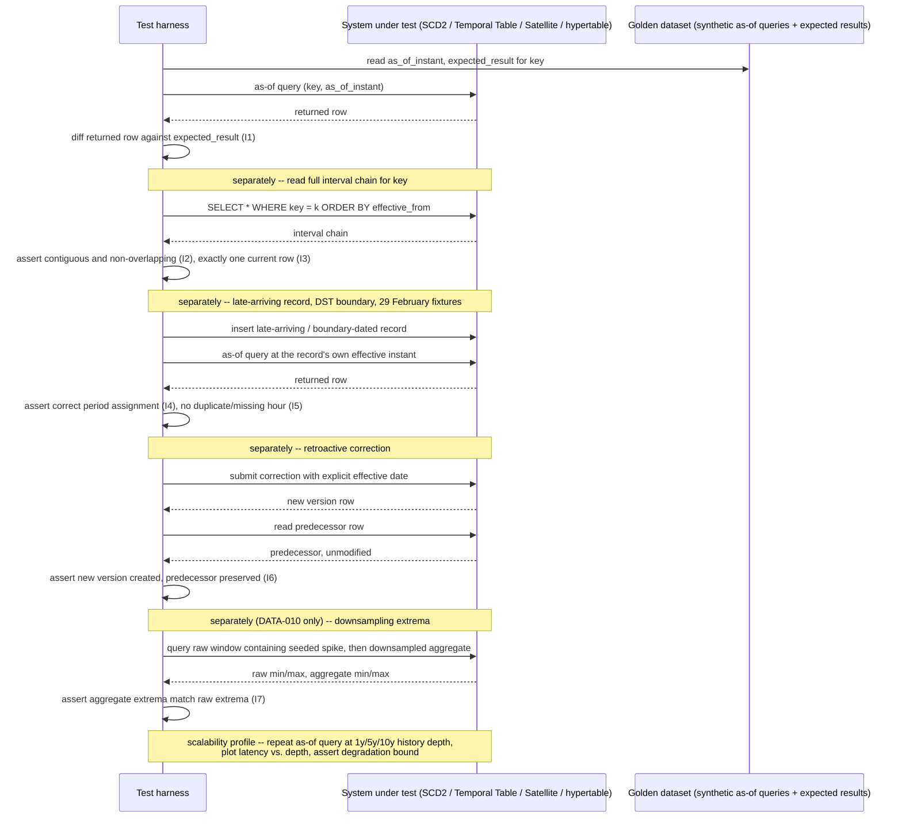

# Temporal and Historisation Correctness

Status: Approved | Last Reviewed: 2026-08-12 | Owner: @qe-lead
Catalog ID: TST-038 | Radii
Tier Applicability: T1, T2

## 1. Applies To

| Catalog ID | Title | Document |
|---|---|---|
| DATA-005 | Slowly Changing Dimensions | [../../patterns/data/slowly-changing-dimensions.md](../../patterns/data/slowly-changing-dimensions.md) |
| DATA-003 | Temporal Tables | [../../patterns/data/temporal-tables.md](../../patterns/data/temporal-tables.md) |
| DATA-004 | Data Vault 2.0 | [../../patterns/data/data-vault-2.md](../../patterns/data/data-vault-2.md) |
| DATA-010 | Time-Series Modelling | [../../patterns/data/time-series-modelling.md](../../patterns/data/time-series-modelling.md) |

These four rows share one archetype because they share one method of verification: each one
stores more than one version of a fact over time and must answer, correctly, "what was true at
instant X?" DATA-005's SCD Type 2 dimension closes a row (`effective_to`, `is_current = false`)
and opens a new one on every tracked change; DATA-003's system-versioned table lets the database
itself answer `FOR SYSTEM_TIME AS OF` against an automatically maintained history table; DATA-004's
Satellites are append-only, `load_date`/`load_end_date`-bounded attribute history keyed to a
Hub or Link hash; DATA-010's TimescaleDB hypertable partitions time-series rows into chunks and
derives continuous aggregates that must remain faithful to the raw series they summarise,
including at the extremes a downsampled aggregate is most likely to lose. In every row, the
assertable question is the same: does an as-of query return exactly the version that was valid at
the requested instant, do the validity periods behind that answer tile the timeline without a gap
or an overlap, and does a correction to history create a new version rather than silently erasing
the one it replaces.

`DATA-004` already carries [TST-032](./batch-window-cutoff.md) in the coverage matrix for its
Hub/Link/Satellite nightly batch-load window completion and restartability. This document appends
`TST-038` to that row rather than replacing the claim: TST-032 verifies whether the Data Vault's
batch load *finishes on time and restarts cleanly*; this archetype verifies that the Satellite
history *load produces*, once written, is temporally correct — that `load_date`/`load_end_date`
boundaries are contiguous and non-overlapping and that an as-of query against them returns the
right version. The two archetypes test disjoint failure surfaces of the same catalog row and both
apply.

## 2. Failure Taxonomy

- An as-of query returning the current row rather than the row that was historically valid at the
  requested instant.
- Overlapping validity intervals in an SCD-2 dimension, so two rows both claim to have been valid
  at the same instant for the same key.
- A gap between validity intervals, losing a period entirely — no row claims to have been valid
  during that window at all.
- Late-arriving data not back-dated correctly, so a record that arrives after its effective date
  is filed under the date it arrived rather than the date it actually became true.
- A DST boundary producing a duplicate or missing hour, so a validity period computed across the
  clock change either repeats an hour twice or skips it entirely.
- A retroactive correction overwriting history instead of versioning it, destroying the very
  predecessor value the correction was supposed to be checked against.
- Downsampling a time series and losing a spike, so a continuous aggregate silently smooths away
  the extreme value a risk or fraud process depended on seeing.

## 3. Functional Test Design

**Oracle:** `golden-dataset`, per
[TST-001 § The Four Oracles](../strategy/test-strategy-standard.md#the-four-oracles). The golden
dataset is a synthetic corpus of as-of queries — a key, a query instant, and the expected result
row or value at that instant — signed off independently of the system under test, per
[TST-004](../strategy/test-data-management.md). This archetype consumes the golden-dataset
comparison method [TST-022 Deterministic Calculation Engine](./deterministic-calculation-engine.md)
already establishes — independent recomputation checked against a signed-off expected value,
compared under a declared scale — and applies it to temporal recomputation: the "declared scale"
here is a validity instant rather than a rounding precision, and the comparison target is the row
that was true at that instant rather than a calculated amount.

### Invariants

| # | Invariant | Assertion |
|---|---|---|
| I1 | An as-of query returns exactly the row valid at that instant | `assert as_of_query(key, t) == golden_dataset.expected_row(key, t)`, never the row that happens to be current at query time |
| I2 | Validity intervals per key are contiguous and non-overlapping | `assert for every consecutive pair (interval[i], interval[i+1]) of key: interval[i].valid_to == interval[i+1].valid_from`, with zero gap and zero overlap across the full history |
| I3 | Exactly one current row exists per key | `assert count(rows WHERE key = k AND is_current) == 1` for every key, never zero and never more than one |
| I4 | A late-arriving record lands in its correct effective period | `assert stored_interval(late_arriving_record) == golden_dataset.expected_interval(late_arriving_record)`, where the expected interval is computed from the record's own business timestamp, not its arrival timestamp |
| I5 | DST transitions produce neither duplicate nor missing periods | `assert count(hours_covered_across_dst_transition) == golden_dataset.expected_hour_count`, asserted separately for the spring-forward and fall-back transition dates |
| I6 | A retroactive correction creates a new version and preserves its predecessor | `assert correction_produces_new_row(key, correction_date) AND predecessor_row(key) still exists unmodified with its original values`, never an UPDATE in place of the original row |
| I7 | Downsampling preserves the declared extrema | `assert downsampled_aggregate.max == golden_dataset.expected_max AND downsampled_aggregate.min == golden_dataset.expected_min` for the raw window the aggregate summarises, not merely its mean |

### Equivalence classes and boundaries

- An as-of query timestamped exactly on a validity boundary (`valid_from`), one unit before it,
  and one unit after it — the boundary case I1 and I2 both depend on for their inclusive/exclusive
  edge.
- A key with zero history (never changed), a key with exactly one closed interval and one current
  interval, and a key with a long chain of many closed intervals — the interval-count boundary I2
  and I3 must hold across, not merely at one point in the chain.
- A late-arriving record whose effective date falls inside an already-closed interval, requiring
  that interval to be split or re-derived rather than the late record simply appended after the
  current row (I4).
- 29 February in a leap year, and the day immediately before and after the spring-forward and
  fall-back DST transitions, each exercised in the declared local timezone rather than UTC — the
  Failure Taxonomy's DST and leap-day entries, made concrete (I5).
- A retroactive correction applied to a key that has already been corrected once before, so the
  chain of predecessors must remain intact two versions deep, not merely one (I6).
- A downsampling window containing exactly one extreme spike and a window containing none — the
  degenerate case that must still report the correct, unchanged min/max rather than defaulting to
  the bucket's average (I7).

### Negative paths

- An as-of query for an instant before any recorded history for a key is rejected explicitly with
  a "no historical state" result, never silently returned as the earliest available row.
- A correction submitted without an explicit effective date is rejected, never defaulted to "now"
  and applied as if it had always been true from the beginning of history.
- A late-arriving record whose effective date cannot be resolved against any existing interval —
  because it predates the key's own creation — is rejected and flagged, never inserted as an
  orphaned interval with no predecessor.
- A downsampled aggregate requested over a window that has not yet fully closed (still receiving
  late-arriving raw points) is flagged as provisional, never returned as final.

## 4. Performance Test Design

| Profile | Applies | Why | Threshold source |
|---|---|---|---|
| `baseline` | yes | Confirms the as-of query and interval-contiguity path itself is correct at a small, fixed history depth before any load- or depth-shaped run is attempted | [NFR-002](../../nfr/latency-budget-model.md) |
| `load` | yes | Proves as-of query latency holds under realistic concurrent query volume at a fixed, declared history depth | [NFR-004](../../nfr/throughput-model.md) |
| `scalability` | yes — the decisive profile for this archetype, on an unusual axis | Locates whether as-of query latency degrades beyond its bound as history *depth* grows, not as request rate grows | [NFR-003](../../nfr/capacity-planning-model.md) |

**This archetype's `scalability` axis is history depth, not request rate.** Every other archetype
in this catalog that names `scalability` scales the *offered load* — more concurrent users, more
transactions per second — while holding the data shape fixed. Here the axis under test is the
opposite: request rate is held fixed and small, while the number of versions per key, and the
span of time the history covers, grows — one year of history, five years, ten years. The
assertable question is whether an as-of query's latency stays within its declared bound as the
interval chain it must search grows longer, per I1 and I2, not whether the system holds up under
concurrent traffic. A system that scales perfectly under request-rate growth but whose as-of query
degrades linearly (or worse) with history depth passes every other archetype's notion of
`scalability` and still fails this one.

**Workload model:** `closed` for all three profiles — each holds a declared, bounded population
(a fixed synthetic query set, or a fixed history-depth multiple of it) rather than an open arrival
process, per [TST-003](../strategy/workload-modelling.md).

## 5. Canonical Harness — JMeter

```xml
<!-- Thread Group: CLOSED model. history_depth_years selects the scalability step
     (1y/5y/10y) -- request rate itself stays fixed across all three steps. -->
<ThreadGroup testname="tg-temporal-historisation">
  <stringProp name="ThreadGroup.num_threads">${__P(users,10)}</stringProp>
  <stringProp name="ThreadGroup.ramp_time">${__P(rampup,30)}</stringProp>
  <stringProp name="ThreadGroup.duration">${__P(duration,300)}</stringProp>
</ThreadGroup>

<!-- Golden dataset of as-of queries with expected results, generated per TST-004.
     Deliberately includes rows at DST transition boundaries and at 29 February. -->
<CSVDataSet testname="synthetic_as_of_golden_dataset.csv (SYNTHETIC -- signed-off, no real accounts)">
  <stringProp name="filename">data/synthetic_as_of_golden_dataset_${__P(history_depth_years,1y)}.csv</stringProp>
  <stringProp name="variableNames">key,as_of_instant,timezone,expected_result_json,fixture_type</stringProp>
  <boolProp name="recycle">true</boolProp>
</CSVDataSet>

<JDBCSampler testname="as-of query (I1, I2)">
  <stringProp name="query">
    SELECT * FROM dim_customer
    WHERE customer_id = ? AND effective_from &lt;= ? AND effective_to &gt; ?
  </stringProp>
  <stringProp name="queryArguments">${key},${as_of_instant},${as_of_instant}</stringProp>
</JDBCSampler>

<!-- JDBC PostProcessor: diff the returned row against the golden dataset's expected
     result, field by field -- I1's actual assertion, not merely a non-empty result. -->
<JDBCPostProcessor testname="assert as-of result matches golden dataset (I1)">
  <stringProp name="query">-- compare ${expected_result_json} to sampler response</stringProp>
</JDBCPostProcessor>

<!-- Separate JDBC query, run once per key against the full interval chain, asserting
     contiguity and non-overlap and exactly one current row (I2, I3). -->
<JDBCSampler testname="interval contiguity check (I2, I3)">
  <stringProp name="query">
    SELECT customer_id, effective_from, effective_to, is_current
    FROM dim_customer WHERE customer_id = ? ORDER BY effective_from
  </stringProp>
  <stringProp name="queryArguments">${key}</stringProp>
</JDBCSampler>
```

```bash
# scalability profile: one run per declared history-depth multiplier -- not one run total.
for depth in 1y 5y 10y; do
  jmeter -n -t temporal-historisation.jmx \
    -Jhistory_depth_years="${depth}" -Jprofile=scalability -Jusers=10 \
    -l "results-${depth}.jtl" -e -o "report-${depth}/"
done

# baseline / load profiles: fixed history depth, varying concurrent users.
jmeter -n -t temporal-historisation.jmx \
  -Jhistory_depth_years=1y -Jprofile=load -Jusers="${LOAD_USERS}" \
  -l results-load.jtl -e -o report-load/
```

The **JDBC PostProcessor** diffing the as-of query's result against the golden dataset's expected
row is the load-bearing element for I1: an assertion that the query merely returned a non-empty
result cannot distinguish a correct historical answer from a query that silently fell back to the
current row — exactly the Failure Taxonomy's first, and most common, failure mode.

## 6. Tool Fit

| Tool | Fit | When to prefer |
|---|---|---|
| JMeter | BEST | The JDBC Sampler and JDBC PostProcessor give direct, in-plan control over parameterising as-of queries from the golden-dataset CSV and diffing the returned row against the expected result — the CSV Data Set Config also drives the 1y/5y/10y history-depth generation in the same plan |
| Locust | good | A Python task can issue the parameterised as-of query via a database driver and perform the same field-by-field diff, but Locust has no native JDBC sampler — the comparison logic must be hand-rolled rather than a first-class plan element |
| Gatling + Karate | fair | Karate can script an as-of query over an HTTP-fronted API and assert a response body, but neither tool has a native JDBC comparison step, so a direct database-level as-of query — the form DATA-005, DATA-003, and DATA-004 all expose — requires an external database client bolted onto the scenario |
| k6 | fair | k6 can drive an HTTP-fronted as-of query well, but it has no native database sampler for the direct JDBC form of this archetype's queries, requiring an external script or extension |

## 7. Overlays

### Data-quality overlay

Interval contiguity is asserted as a data-quality rule per
[TST-009 § The Six Dimensions](../strategy/data-quality-test-standard.md#the-six-dimensions),
specifically the `validity` dimension: a validity interval's declared constraint is that it
shares its closing boundary with the next interval's opening boundary, for every key, with no
gap and no overlap. I2 is the assertable, mechanically-checked form of this rule — this archetype
does not restate TST-009's dimension vocabulary, it applies it to the specific structural
constraint a historisation pattern's validity-interval chain must satisfy. A test run that checks
only that *a* row exists for a given instant, without checking that the surrounding chain tiles
the timeline without gap or overlap, has not satisfied this rule — it has satisfied `completeness`
for one instant while leaving `validity` for the chain as a whole unverified.

Resilience, Contract, and Security overlays are omitted: this archetype's failure modes are about
whether stored history is temporally correct — whether an as-of query resolves to the right
version and whether the validity-interval chain behind it is sound — not about fault tolerance
under instance loss, wire-format compatibility, or access control, so none of the three applies.

## 8. Test Data Requirements

Synthetic only, per [TST-004](../strategy/test-data-management.md). Entities needed: for each of
the four Applies-To patterns, a key with a chain of closed validity intervals plus exactly one
current interval, generated at 1y, 5y, and 10y history depths for the `scalability` curve; a small
set of late-arriving records whose effective date falls inside an already-closed interval, to
exercise I4; a set of records spanning the declared local timezone's spring-forward and fall-back
DST transition dates, to exercise I5; a set of records dated exactly 29 February in a leap year,
to exercise the leap-day boundary alongside I2; a chain in which the same key has been retroactively
corrected at least twice, to exercise I6's two-versions-deep predecessor preservation; and, for
DATA-010's continuous aggregates specifically, a raw time-series window seeded with a single known
extreme spike, to exercise I7. The cardinality driver is history depth (1y/5y/10y), orthogonal to
the concurrent query volume the `load` profile varies independently. Referential integrity
requirement: every golden-dataset row's expected result is derived from the declared business
timestamp and business calendar before the run starts, never read back from the system under test
after the fact, so I1 and I4 have a genuine oracle rather than a tautology. Teardown: purge the
seeded history chains, the golden dataset, and any correction records created for the run, at
environment reset, per [TST-005](../strategy/environments-quality-gates.md).

## 9. Evidence and Observability

Metrics to capture: the as-of query result mismatch count against the golden dataset, which must
be zero (I1); the interval gap and overlap count across every key's full chain, which must be
zero (I2); the per-key current-row count, which must be exactly one for every key (I3); the
stored-versus-expected interval match for every late-arriving record (I4); the covered-hour count
across each DST transition date, compared against its expected count (I5); the predecessor-row
existence and unmodified-value check after each retroactive correction (I6); and the downsampled
extrema delta against the raw window's true min/max (I7). Trace assertions: an as-of query's
trace must show the query plan resolving against the historical interval, not the current-row
index path, when the requested instant is not "now." Artifacts to attach to a DAB submission: the
JMeter aggregate report and HTML dashboard, or the Locust distribution report when Locust is the
primary tool, per [TST-005](../strategy/environments-quality-gates.md); the as-of query latency
versus history-depth curve from the `scalability` profile; the interval-contiguity reconciliation
report from the Data-quality overlay; and the DST-boundary and leap-day fixture results as a
distinct, individually reviewable artifact.

## 10. Exit Criteria

The block below is illustrative for a synthetic service implementing this archetype's patterns —
every value is an example, not a normative one, per [TST-001](../strategy/test-strategy-standard.md).

```yaml
test_acceptance_criteria:
  service_name: synthetic-historisation-service
  archetypes: [TST-038]
  catalog_refs: [DATA-005, DATA-003, DATA-004, DATA-010]
  functional:
    invariants_covered: 7                 # I1-I7, all seven assertable
    negative_paths_covered: 4
    oracle: golden-dataset
  performance:
    profiles_executed: [baseline, load, scalability]
    scalability_axis: history_depth        # 1y/5y/10y -- not request rate
    workload_model: closed
  data_quality:
    dq_rules_asserted: 1                   # interval contiguity (validity dimension, TST-009)
    reconciliation_tolerance: '0'
```

## Compliance Mapping

| Layer | Reference | Section/Control | How this satisfies |
|---|---|---|---|
| Ring 0 | Kimball, R. & Ross, M. — The Data Warehouse Toolkit, Ch. 5 (Slowly Changing Dimensions Type 2) | Point-in-time dimensional history via effective-dated rows and a single current-row flag | I1, I2, and I3 are the assertable, mechanically-checked form of the SCD Type 2 contract itself: an as-of query resolves to the row valid at that instant, the chain of rows tiles the timeline without gap or overlap, and exactly one row is ever marked current |
| Ring 0 | Data Vault 2.0 (Linstedt & Olschimke) — Satellite historisation | Append-only, load-date-bounded attribute history keyed to a Hub or Link hash | I2, I4, and I6 assert the same `load_date`/`load_end_date`-bounded validity a Satellite depends on for auditability: no row is ever updated in place, a late-arriving attribute lands in its correct period, and a correction opens a new Satellite row rather than overwriting the one it supersedes |
| Ring 1 | [Basel BCBS 239](../../compliance/basel-bcbs-239.md) — Principle 3 (Accuracy and Integrity) | Risk data must be accurate and reconcilable to source, including reconstruction of the audit trail behind any historical figure | I1's as-of comparison against a signed-off golden dataset and I6's predecessor-preservation check are the test evidence Principle 3's audit-trail reconstruction expectation requires: an examiner must be able to reconstruct exactly what the data showed at a past instant, and that reconstruction must survive every retroactive correction made since |
| Ring 2 | SBV Circular 09/2020/TT-NHNN §IV Art. 24–25 — record-retention and audit-trail reconstruction expectations ⚠️ (working summary — pending Legal review) | Financial and transaction records must be retained and reconstructable for their declared regulatory retention period | I2's interval-contiguity guarantee and I6's version-preservation guarantee are the technical control most directly responsible for satisfying a retention-and-reconstruction expectation: a record's historical state must remain queryable, without gap, for as long as the declared retention period requires; Legal review required to confirm which of the four Applies-To patterns' stored history falls within Art. 24–25's specific retention scope |

## 12. Related Patterns

- [DATA-005 Slowly Changing Dimensions](../../patterns/data/slowly-changing-dimensions.md)
- [DATA-003 Temporal Tables](../../patterns/data/temporal-tables.md)
- [DATA-004 Data Vault 2.0](../../patterns/data/data-vault-2.md)
- [DATA-010 Time-Series Modelling](../../patterns/data/time-series-modelling.md)

## 13. Related Archetypes

- [TST-022 Deterministic Calculation Engine](./deterministic-calculation-engine.md) — supplies the
  golden-dataset comparison method this archetype reuses for temporal recomputation rather than
  restating it; see §3. TST-022's own §13 already forward-references this archetype by name and
  ID, recorded before this document was drafted.
- [TST-009 Data Quality Test Standard](../strategy/data-quality-test-standard.md) — supplies the
  `validity` dimension this archetype's Data-quality overlay applies to interval contiguity; see
  §7. TST-009's own Related section already forward-references this archetype by name and ID.
- [TST-032 Batch Window and Cutoff Throughput](./batch-window-cutoff.md) — shares the `DATA-004`
  catalog row (§1); TST-032 verifies the Data Vault's nightly batch load completes and restarts
  cleanly inside its window, this archetype verifies that the history the load produces is
  temporally correct once written.
- [TST-004 Test Data Management](../strategy/test-data-management.md) — supplies the synthetic
  golden-dataset generation and history-depth cardinality method this archetype's `scalability`
  curve consumes rather than restates; see §8.

## 14. Diagram


