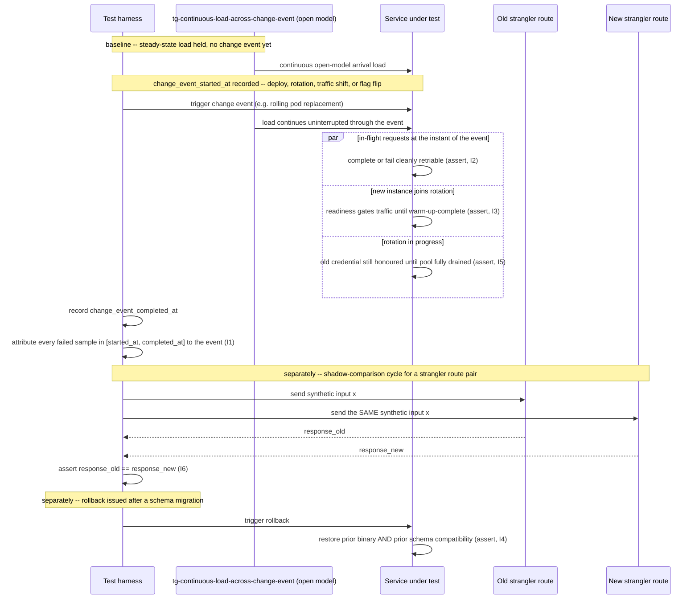

# Zero-Downtime Deploy, Traffic Shift and Rotation Testing

Status: Approved | Last Reviewed: 2026-08-12 | Owner: @qe-lead
Catalog ID: TST-036 | Radii
Tier Applicability: T0, T1

## 1. Applies To

| Catalog ID | Title | Document |
|---|---|---|
| PLT-003 | GitOps Deployment Pipeline | [../../patterns/platform/gitops-deployment-pipeline.md](../../patterns/platform/gitops-deployment-pipeline.md) |
| PLT-001 | Service Mesh Traffic Management | [../../patterns/platform/service-mesh-traffic.md](../../patterns/platform/service-mesh-traffic.md) |
| PLT-005 | Kubernetes Operator Pattern | [../../patterns/platform/kubernetes-operator-pattern.md](../../patterns/platform/kubernetes-operator-pattern.md) |
| INT-006 | Strangler Fig | [../../patterns/integration/strangler-fig.md](../../patterns/integration/strangler-fig.md) |
| SEC-007 | Secrets Rotation | [../../patterns/security/secrets-rotation.md](../../patterns/security/secrets-rotation.md) |
| SEC-003 | Vault Secret Management | [../../patterns/security/vault-secret-management.md](../../patterns/security/vault-secret-management.md) |
| FE-004 | Web Feature Flags | [../../patterns/frontend/web-feature-flags.md](../../patterns/frontend/web-feature-flags.md) |
| MOB-006 | Mobile Force-Upgrade | [../../patterns/mobile/mobile-force-upgrade.md](../../patterns/mobile/mobile-force-upgrade.md) |

These eight rows share one archetype because each is a distinct trigger for the same underlying
obligation: a change event fires while real traffic is in flight, and no request may be lost,
corrupted, or served an inconsistent view of the system as a result. PLT-003 GitOps Deployment
Pipeline is the trigger for a rolling pod replacement; PLT-001 Service Mesh Traffic Management is
the trigger for a canary or blue/green weight shift; PLT-005 Kubernetes Operator Pattern is the
trigger for an order-dependent stateful rollout (leader transfer before pod deletion); INT-006
Strangler Fig is the trigger for a route migrating from the legacy system to the new one; SEC-007
Secrets Rotation and SEC-003 Vault Secret Management are the trigger for a credential rotating
under pooled connections that must not observe the swap; FE-004 Web Feature Flags is the trigger
for a flag flip that must not be observed as split state within one request; and MOB-006 Mobile
Force-Upgrade is the trigger for a forced client-version gate that must not fire mid-transaction.
The *method of verification* is identical across all eight: hold continuous load across the entire
window the change event spans, and attribute every observed failure to a precise timestamp
relative to that event — never one design claim per row, evaluated in isolation.

## 2. Failure Taxonomy

- In-flight requests dropped at pod termination because there is no graceful shutdown or `preStop`
  delay.
- A readiness probe passing before warm-up completes, so traffic is routed to a cold instance.
- Canary metrics evaluated over too short a window, masking a regression that only surfaces once
  enough traffic has accumulated.
- A rollback that leaves a schema change applied, so the restored prior version runs against a
  schema it was never tested against.
- A secret rotated while pooled connections still hold the old credential, so calls using a stale
  pooled connection fail once the old credential is revoked.
- A feature-flag flip producing inconsistent state within a single request — one code path reads
  the flag before the flip and another reads it after, inside the same request's execution.
- A forced upgrade blocking a user mid-transaction, with no path to complete or safely abandon the
  in-flight operation.
- A strangler route shifted where old and new behaviour diverge — the same input produces a
  different result depending on which system happened to serve it.

## 3. Functional Test Design

**Oracle:** `invariant-assertion`, per
[TST-001 § The Four Oracles](../strategy/test-strategy-standard.md#the-four-oracles).

### Invariants

| # | Invariant | Assertion |
|---|---|---|
| I1 | Zero failed requests attributable to a deploy, rotation, or traffic shift | `assert count(failures_attributable_to_change_event) == 0`, where attribution is the timestamp-correlation method of §5 — a background failure rate from unrelated causes during the same window is not evidence of a violation |
| I2 | In-flight requests either complete or are cleanly retriable | `assert every in_flight_request_at_change_event.outcome in {COMPLETED, CLEANLY_RETRIABLE}` — a request that returns a connection-reset or a partial write with no retriable signal is a violation |
| I3 | Readiness gates traffic until the instance is warm | `assert count(requests_routed_to_instance_before_warm_up_complete) == 0`, measured from the instance's `readiness=true` transition against its own recorded warm-up-complete timestamp |
| I4 | Rollback restores prior behaviour completely, including schema compatibility | `assert post_rollback_response == pre_deploy_baseline_response` for the full negative-path suite, and `assert schema_version_active_after_rollback == schema_version_the_rolled_back_binary_was_tested_against` |
| I5 | Rotation completes with no failed request attributable to it | `assert count(failures_attributable_to_rotation) == 0` over the rotation window, per [TST-008 Rotation Under Load](../strategy/security-test-standard.md#rotation-under-load) |
| I6 | Old and new strangler routes produce equivalent results for the same input | `assert old_route_response(x) == new_route_response(x)` for every synthetic input `x` sent to both routes in the shadow-comparison window (§5) |
| I7 | A flag flip is atomic from a single request's perspective | `assert every_single_request.flag_value_observed` is constant across every read of that flag within that request's own execution — no request observes the pre-flip value on one read and the post-flip value on a later read of the same flag |

### Equivalence classes and boundaries

- A request that starts and completes entirely before the change event begins — the baseline case;
  I1-I7 are vacuously satisfied and establish the pre-event steady state.
- A request in flight at the exact instant the change event fires — the decisive case for I2 and
  I3; this is the population every attribution assertion in §5 is built to isolate.
- Boundary: an instance whose readiness probe passes at the same instant its warm-up completes —
  the boundary between I3's pass and fail case is "any" traffic routed strictly before that
  instant, not merely traffic routed to an instance that later turns out to have been slow to warm.
- Boundary: a rollback issued the instant after a schema migration commits versus the instant
  before — I4 must hold in both cases; a rollback timed to land inside the migration's own
  transaction window is not an exemption.
- Boundary: the same synthetic input sent to the old and new strangler route within the same
  shadow-comparison cycle versus across two different cycles — I6 is only meaningful when both
  calls are contemporaneous, since the underlying data each route reads may itself change between
  cycles.
- A request that reads a feature flag exactly once versus one that reads it twice at different
  points in its own execution — I7's atomicity claim is only decidable for the second case; the
  boundary is the flip landing between those two reads.

### Negative paths

- A pod terminated with no `preStop` delay and no graceful-shutdown hook — the Failure Taxonomy's
  first entry made concrete; caught by I1 and I2's negative case: in-flight requests are dropped
  with a connection reset rather than completing or failing retriably.
- A readiness probe that returns healthy from a liveness-style check with no warm-up gate — caught
  by I3's negative case: requests are observed reaching the instance before its own warm-up-complete
  timestamp.
- A rollback that reverts the application binary but leaves a forward-only schema migration applied
  — caught by I4's negative case: the restored binary's negative-path suite fails against the
  still-migrated schema.
- A rotation that invalidates the old credential before every pooled connection holding it has been
  drained — caught by I5's negative case: a failure burst starts at the moment the old credential
  is revoked and stops once every stale pooled connection has cycled out.
- A strangler route pair that diverges on a specific input class (e.g. a legacy rounding rule the
  new service does not replicate) — caught by I6's negative case: the shadow comparison records a
  mismatch for that input class specifically, not a generic timeout or error.

## 4. Performance Test Design

| Profile | Applies | Why | Threshold source |
|---|---|---|---|
| `baseline` | yes | Establishes the pre-change-event steady state I1-I7 compare against; a change event evaluated with no pre-event reference point cannot be attributed to anything | [NFR-002](../../nfr/latency-budget-model.md) |
| `load` | yes | Establishes the sustained-traffic population that the change event is layered onto; a deploy or rotation exercised at idle proves nothing about in-flight-request handling, connection-pool draining, or readiness-gate timing under real concurrency | [NFR-004](../../nfr/throughput-model.md) |
| `failover-under-load` | yes — the decisive profile for this archetype | The change event **is** the injected event: this archetype does not layer a separate resilience fault onto steady traffic, per [TST-002](../strategy/performance-test-standard.md#failover-under-load) — the deploy, rotation, or traffic shift itself is the disruption whose recovery is measured | [NFR-001](../../nfr/service-tiering-rto-rpo.md) |

**Workload model:** `open`, per [TST-003's Rule](../strategy/workload-modelling.md#the-rule), for
every profile in this archetype. A closed model's fixed population would self-throttle the instant
in-flight requests began failing or retrying at the change event, understating exactly the
in-flight-request population I2 exists to observe; an open arrival process keeps offering load
independent of how the system under test responds to the change event, so the attribution method in
§5 is measuring the system's real behaviour rather than a population the harness itself capped.

## 5. Canonical Harness — JMeter

```xml
<!-- Thread Group: continuous open-model arrival load spanning the ENTIRE deploy/rotation/
     traffic-shift window -- started before the change event and held running past its
     completion, never paused for the change event itself. -->
<ThreadGroup testname="tg-continuous-load-across-change-event">
  <stringProp name="ThreadGroup.num_threads">${__P(users,50)}</stringProp>
  <stringProp name="ThreadGroup.ramp_time">${__P(rampup,60)}</stringProp>
  <stringProp name="ThreadGroup.duration">${__P(duration,3600)}</stringProp>
  <boolProp name="ThreadGroup.scheduler">true</boolProp>
</ThreadGroup>

<!-- Every sample is timestamped and the change event's own start/end is recorded once, by
     polling the deployment controller / rotation job / traffic-split config, not by a fixed
     sleep -- this recorded window is what every attribution assertion below correlates against. -->
<JSR223PreProcessor testname="record change_event_started_at / change_event_completed_at once">
  <stringProp name="script"><![CDATA[
    if (props.getProperty("change_event_started_at") == null) {
        if (changeEventController.hasStarted(vars.get("change_event_id"))) {
            props.setProperty("change_event_started_at", String.valueOf(System.currentTimeMillis()));
        }
    } else if (props.getProperty("change_event_completed_at") == null) {
        if (changeEventController.hasCompleted(vars.get("change_event_id"))) {
            props.setProperty("change_event_completed_at", String.valueOf(System.currentTimeMillis()));
        }
    }
  ]]></stringProp>
</JSR223PreProcessor>

<HTTPSamplerProxy testname="POST /v1/transfers/synthetic (protected call path under continuous load)">
  <stringProp name="HTTPSampler.path">/v1/transfers/synthetic</stringProp>
  <stringProp name="HTTPSampler.method">POST</stringProp>
</HTTPSamplerProxy>

<!-- Error attribution by timestamp, correlated against the recorded change-event window (I1, I2,
     I5) -- a failure inside the window is a candidate; a failure outside it is background noise. -->
<JSR223Assertion testname="attribute this sample's failure (if any) to the change-event window (I1, I2, I5)">
  <stringProp name="script"><![CDATA[
    if (prev.isSuccessful()) { return; }
    long sampleAt = prev.getEndTime();
    long startedAt = Long.parseLong(props.getProperty("change_event_started_at", "0"));
    long completedAt = Long.parseLong(props.getProperty("change_event_completed_at",
        String.valueOf(Long.MAX_VALUE)));
    if (startedAt > 0 && sampleAt >= startedAt && sampleAt <= completedAt) {
        vars.put("attributable_failure", "true");
        long attributableCount = props.getProperty("attributable_failure_count") == null ? 0
            : Long.parseLong(props.getProperty("attributable_failure_count"));
        props.setProperty("attributable_failure_count", String.valueOf(attributableCount + 1));
    } else {
        vars.put("attributable_failure", "false");
    }
  ]]></stringProp>
</JSR223Assertion>

<!-- Readiness-gate check (I3): compares this sample's target-instance identity and timestamp
     against that instance's own recorded warm-up-complete timestamp. -->
<JSR223Assertion testname="assert no traffic routed to an instance before its warm-up-complete timestamp (I3)">
  <stringProp name="script"><![CDATA[
    String instanceId = prev.getResponseHeaders().contains("X-Instance-Id")
        ? SampleResult.class.cast(prev).getResponseHeaders() : null;
    String warmAt = instanceRegistry.warmUpCompleteAt(vars.get("target_instance_id"));
    if (warmAt != null && prev.getEndTime() < Long.parseLong(warmAt)) {
        AssertionResult.setFailure(true);
        AssertionResult.setFailureMessage(
            "I3 violated: request served by instance before its recorded warm-up-complete timestamp");
    }
  ]]></stringProp>
</JSR223Assertion>

<!-- Shadow-comparison assertion for I6: the SAME synthetic input is sent to BOTH the old and new
     strangler route in the same cycle, and their responses are compared -- this is the archetype's
     other load-bearing element, distinct from the single-route attribution logic above. -->
<HTTPSamplerProxy testname="POST /v1/legacy-route/synthetic (old strangler route, shadow input)">
  <stringProp name="HTTPSampler.path">/v1/legacy-route/synthetic</stringProp>
  <stringProp name="HTTPSampler.method">POST</stringProp>
</HTTPSamplerProxy>
<HTTPSamplerProxy testname="POST /v1/new-route/synthetic (new strangler route, same shadow input)">
  <stringProp name="HTTPSampler.path">/v1/new-route/synthetic</stringProp>
  <stringProp name="HTTPSampler.method">POST</stringProp>
</HTTPSamplerProxy>
<JSR223Assertion testname="assert old and new strangler route responses are equivalent for the same shadow input (I6)">
  <stringProp name="script"><![CDATA[
    String oldResponse = vars.get("old_route_response_normalised");
    String newResponse = vars.get("new_route_response_normalised");
    if (oldResponse != null && newResponse != null && !oldResponse.equals(newResponse)) {
        AssertionResult.setFailure(true);
        AssertionResult.setFailureMessage(
            "I6 violated: old route response '" + oldResponse + "' != new route response '"
            + newResponse + "' for the same synthetic shadow input");
    }
  ]]></stringProp>
</JSR223Assertion>
```

```bash
jmeter -n -t zero-downtime-deploy-rotation.jmx \
  -Jusers="${JMETER_USERS}" -Jrampup="${JMETER_RAMPUP}" -Jduration="${JMETER_DURATION}" \
  -Jchange_event_id="${JMETER_CHANGE_EVENT_ID}" -Jprofile="${JMETER_PROFILE}" \
  -l results.jtl -e -o report/
```

The **recorded change-event window** (`change_event_started_at` / `change_event_completed_at`) is
this harness's load-bearing element: every attribution assertion (I1, I2, I5) correlates a sample's
own timestamp against that window, never against a fixed sleep or the run's own elapsed time — a
change event whose observable impact lags its trigger by even a few seconds would otherwise be
mismeasured against the wrong reference point, exactly per [TST-006](../strategy/resilience-test-standard.md#blast-radius-measurement)'s
timestamp-correlation discipline, applied here to a change event rather than an injected fault. The
**shadow-comparison assertion for I6** is the harness's other load-bearing design choice: it sends
the identical synthetic input to both strangler routes within the same cycle and compares
normalised responses, rather than comparing two independently-sampled requests that could differ
merely because the underlying data changed between calls.

## 6. Tool Fit

| Tool | Fit | When to prefer |
|---|---|---|
| JMeter | BEST | A JSR223PreProcessor recording the change-event window once, a per-sample JSR223Assertion attributing failures against that window, and a shadow-comparison assertion sending one synthetic input to two samplers and diffing their normalised responses all compose in one plan, sharing state through JMeter's cross-thread `props` store — no other tool in the corpus gives this combination of open-model arrival load, timestamp attribution, and dual-route comparison in a single plan |
| k6 | good | A natural fit where the deploy is pipeline-driven: a `constant-arrival-rate` scenario can run for the pipeline's own deploy duration, with k6's tagged custom metrics distinguishing pre/during/post-change-event samples, but it lacks a built-in shared cross-VU store as direct as JMeter's `props` for the shadow-comparison correlation |
| Gatling + Karate | good | Gatling's injection profile drives the open-model arrival load and Karate can script the change-event polling and the dual-route shadow call, but the two tools must be wired together rather than sharing one native cross-thread store |
| Locust | fair | Locust's open-model `constant_throughput`-style shape can hold arrival load through the change event, but per [TST-014](../tooling/locust.md#when-to-use-this-tool) the timestamp-attribution and dual-route shadow-comparison logic must be hand-built in Python rather than configured declaratively |

Every coverage row for the eight catalog entries in §1 records `primary_tool: jmeter`, for the
reason stated above and demonstrated in §5.

## 7. Overlays

### Resilience overlay

Two distinct scenarios, each a change event this archetype exercises directly rather than an
externally-injected fault:

- **`instance-loss` during rollout** — a pod is terminated as part of the GitOps-driven (PLT-003)
  rolling replacement. Exercises **I1** and **I2**: the terminated pod's in-flight requests must
  either complete against a connection drained gracefully or fail in a cleanly retriable way, never
  as a bare connection reset, per [TST-006's fault class taxonomy](../strategy/resilience-test-standard.md#fault-class-taxonomy)
  — the same `instance-loss` class TST-006 defines, applied here to a planned rollout event rather
  than an injected chaos experiment.
- **`partial-partition` during traffic shift** — a subset of mesh endpoints (PLT-001) becomes
  briefly unreachable from a subset of callers while the traffic-shift weight is being adjusted.
  Exercises **I1**: the weight shift itself must not produce failures attributable to the partition
  window, distinguishing a transient mesh-config propagation delay from a genuine service defect.

### Security overlay

Rotation under load, exercising **I5**: [TST-008 Rotation Under Load](../strategy/security-test-standard.md#rotation-under-load)
requires the synthetic load generator to keep running through the entire rotation window rather
than pausing before rotation starts and resuming after it completes — this archetype's §5 harness
is exactly that continuous load, applied to a SEC-007 Secrets Rotation or SEC-003 Vault-managed
credential swap. The specific failure mode under test, per TST-008, is a request that acquired a
credential just before rotation and is still in flight when the credential is invalidated; I5's
assertion (`assert count(failures_attributable_to_rotation) == 0`) is this archetype's own
instantiation of TST-008's rotation assertion, using the same timestamp-attribution method §5 uses
for every other change event this archetype covers rather than a separate rotation-specific
technique.

Contract and Data-quality overlays are omitted: this archetype's failure modes are about request
continuity, readiness timing, rollback completeness, and behavioural equivalence across a change
event — not schema-contract negotiation between independently-versioned producers and consumers, or
data reconciliation across a pipeline — so neither overlay applies.

## 8. Test Data Requirements

Synthetic only, per [TST-004](../strategy/test-data-management.md). Entities needed: a synthetic
protected call path (e.g. a synthetic transfer or balance-enquiry request) that can be issued
continuously across the entire change-event window without depending on any state the change event
itself might reset; a synthetic credential pair (old and new) for SEC-007/SEC-003 rotation, distinct
from any real secret; a synthetic feature flag with an identifiable pre-flip and post-flip value for
FE-004, so I7's within-request atomicity check has a concrete value pair to compare; and a synthetic
input set sent identically to both the old and new INT-006 strangler route, chosen to cover the
input classes most likely to diverge (rounding, date-boundary, and null-optional-field cases) rather
than an arbitrary sample. The cardinality driver is the number of *distinct* change-event types
exercised per run (deploy, traffic shift, rotation, flag flip, strangler cutover, force-upgrade
gate), not data volume: each type requires its own recorded start/completion window, and reusing one
synthetic transaction's identity across two change-event types would conflate one type's
attributable-failure count with another's. Referential-integrity requirement: every synthetic
request issued during the run must resolve to exactly one outcome record independent of which
instance, route, or credential served it, so I1, I2, and I6 can be checked against the harness's own
submission record rather than the service's self-report alone. Teardown: revoke every synthetic
rotation credential, reset the synthetic feature flag to its pre-test value, and restore the
synthetic strangler routing weight to its pre-test split, at environment reset, per
[TST-005](../strategy/environments-quality-gates.md).

## 9. Evidence and Observability

Metrics to capture: the recorded change-event window (start/completion timestamp) for every
change-event type exercised in the run; the attributable-failure count and rate inside that window
versus the background failure rate outside it (I1); the in-flight-request outcome distribution
(`COMPLETED` / `CLEANLY_RETRIABLE` / violation) sampled at the instant the change event fires (I2);
the per-instance warm-up-complete timestamp against the first-traffic-routed timestamp for every
instance that joined rotation during the run (I3); the pre-deploy baseline response set replayed
against the post-rollback response set (I4); the rotation-window failure count attributed per
[TST-008](../strategy/security-test-standard.md#rotation-under-load) (I5); the shadow-comparison
diff log between old and new strangler routes for every synthetic input sent (I6); and the
per-request flag-value-read sequence for any request whose execution spans a recorded flag flip
(I7). Trace assertions: a request in flight at the change event must show either a completed span
or a span whose final status is explicitly retriable — never a span that simply stops without a
terminal status, per I2. Artifacts to attach to a DAB submission: the JMeter aggregate report and
HTML dashboard, per [TST-005](../strategy/environments-quality-gates.md#evidence-and-retention);
the change-event timeline covering every type exercised in the run; the attributable-failure chart
for I1/I2/I5; the shadow-comparison diff log for I6; and the warm-up-versus-first-traffic chart for
I3.

## 10. Exit Criteria

The block below is illustrative for a synthetic service implementing this archetype's patterns —
every value is an example, not a normative one, per [TST-001](../strategy/test-strategy-standard.md).

```yaml
test_acceptance_criteria:
  service_name: synthetic-payments-platform
  archetypes: [TST-036]
  catalog_refs: [PLT-003, PLT-001, PLT-005, INT-006, SEC-007, SEC-003, FE-004, MOB-006]
  functional:
    invariants_covered: 7                 # I1-I7, all seven assertable
    negative_paths_covered: 5
    oracle: invariant-assertion
  performance:
    profiles_executed: [baseline, load, failover-under-load]
    workload_model: open                  # per §4 above, for every profile
  resilience:
    fault_scenarios: [instance-loss-during-rollout, partial-partition-during-traffic-shift]
  security:
    rotation_under_load: true             # TST-008 obligation, exercised via I5
```

## Compliance Mapping

| Layer | Reference | Section/Control | How this satisfies |
|---|---|---|---|
| Ring 0 | NIST SP 800-53 — CM-3 (Configuration Change Control) | Test that a configuration change does not disrupt service, not merely document the change | I1-I5 are the per-service, assertable instantiation of CM-3: every deploy, rotation, and traffic-shift change event this archetype exercises is verified against zero attributable failures, not merely recorded in a change ticket |
| Ring 0 | The Twelve-Factor App — Disposability | Processes should start fast and shut down gracefully | I2 and I3 are the assertable form of disposability: a process that cannot complete or cleanly fail its in-flight work on shutdown (I2), or that accepts traffic before it is actually ready (I3), violates the disposability principle this archetype's harness is built to catch |
| Ring 1 | [PCI-DSS 4.0](../../compliance/pci-dss-4-0.md) — §6.5.2 | Change control for production changes affecting the cardholder data environment | This archetype's continuous-load-across-the-change-event method (§5) is the evidence that a production change to a T0/T1 service was verified not to disrupt the cardholder-data-adjacent transaction path, satisfying §6.5.2's change-control testing obligation with a measured result rather than a sign-off checklist |
| Ring 1 | [Basel BCBS 230](../../compliance/basel-bcbs-230.md) — Principle 9 | Severe-but-plausible scenario testing and drill evidence | The `failover-under-load` profile in §4, where the change event itself is the disruption under test, is the assertable evidence Principle 9 requires for a change-driven disruption scenario, distinct from the externally-injected fault scenarios [TST-035](./fault-injection-degradation.md) already provides for the same Principle |
| Ring 2 | SBV Circular 09/2020/TT-NHNN ⚠️ (working summary — pending Legal review) | Change-management expectations for internet-banking system modifications | This archetype's change-event timeline and attributable-failure evidence, retained per [TST-005](../strategy/environments-quality-gates.md#evidence-and-retention), is a possible artifact for an SBV change-management review, though the specific evidentiary form any given service submits is a decision for that service's compliance owner, not one this archetype prescribes |

## 12. Related Patterns

- [PLT-003 GitOps Deployment Pipeline](../../patterns/platform/gitops-deployment-pipeline.md)
- [PLT-001 Service Mesh Traffic Management](../../patterns/platform/service-mesh-traffic.md)
- [PLT-005 Kubernetes Operator Pattern](../../patterns/platform/kubernetes-operator-pattern.md)
- [INT-006 Strangler Fig](../../patterns/integration/strangler-fig.md)
- [SEC-007 Secrets Rotation](../../patterns/security/secrets-rotation.md)
- [SEC-003 Vault Secret Management](../../patterns/security/vault-secret-management.md)
- [FE-004 Web Feature Flags](../../patterns/frontend/web-feature-flags.md)
- [MOB-006 Mobile Force-Upgrade](../../patterns/mobile/mobile-force-upgrade.md)

## 13. Related Archetypes

- [TST-006 Resilience Test Standard](../strategy/resilience-test-standard.md) — supplies the
  `instance-loss` and `partial-partition` fault-class definitions this archetype's Resilience
  overlay (§7) reuses, applied here to a planned change event rather than an injected chaos
  experiment; consumed, not restated.
- [TST-008 Security Test Standard](../strategy/security-test-standard.md) — its own Rotation Under
  Load section supplies the rotation assertion this archetype's Security overlay (§7) and I5
  instantiate; TST-008's own Rotation Under Load section already cross-links this archetype from
  its own side as the archetype that exercises the obligation end-to-end.
- [TST-035 Fault Injection and Graceful Degradation Testing](./fault-injection-degradation.md) —
  exercises the same ten-class TST-006 fault taxonomy through externally-injected chaos experiments
  against steady traffic; this archetype exercises two of those same fault classes (`instance-loss`,
  `partial-partition`) as the natural consequence of a planned change event rather than an injected
  one — the two are complementary evidence, not duplicate coverage.

## 14. Diagram


