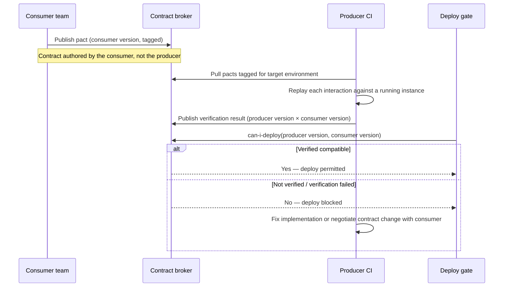

# Contract and Integration Test Standard

Status: Approved | Last Reviewed: 2026-08-13 | Owner: @qe-lead
Catalog ID: TST-007 | Radii
Tier Applicability: T0, T1, T2

## Problem Statement

- A producer ships a change that looks compatible in isolation — a renamed field with a
  default, an added optional property, a reordered enum — and it breaks a consumer that never
  revalidated against the same schema. "Looks compatible" and "verified compatible" are
  different claims, and only one of them is testable.
- Integration suites assert against a hand-maintained mock of the counterparty, so the suite
  stays green while the real producer and the real consumer quietly diverge. The suite is
  testing the mock's fidelity to a stale understanding of the contract, not the contract
  itself.
- A schema's `schema_compat_mode` is left undeclared, so the registry's actual compatibility
  guarantee for that schema is unknown until a producer change either passes or breaks a
  consumer — in production, because nobody could say in advance what the registry would
  permit.
- Contract tooling exists for REST — an OpenAPI spec, a Pact broker, a generated client — but
  async contracts (AsyncAPI channels, CloudEvents envelopes) ship untested, because the team's
  contract-testing habit formed entirely around request/response tooling and was never
  extended past it.
- Error codes are documented in prose — a wiki page, a Confluence table, a comment in the
  producer's source — rather than tested, so the mapping drifts silently and consumers end up
  switching on a substring match against a human-readable message instead of a stable,
  contract-tested code.

## Relationship to INT-015

[INT-015 API Contract Testing](../../patterns/integration/api-contract-testing.md) owns the
pattern: Pact broker topology, the `can-i-deploy` gate, where contract verification sits in the
pipeline, and the worked Spring Cloud Contract / Pact-JVM implementation. `TST-007` does not
restate any of that. `TST-007` owns the *test obligation and coverage definition* that sits
underneath the pattern: the normative `schema_compat_mode` vocabulary every registry entry must
declare, the scope boundary between a contract test and an integration test, the specific
technique for testing an async contract that has no request/response pair to assert on, and the
rule that every documented error code must be reachable by a test. Where INT-015 answers "how do
we run consumer-driven contract testing," TST-007 answers "what must every contract prove before
it counts as verified, and where exactly does that proof have to live."

## Consumer-Driven Contract Method

- **Who writes the contract.** The consumer team, not the producer. The consumer knows exactly
  which fields, which status codes, and which error shapes its own code actually depends on; a
  producer-authored contract tends to describe everything the producer *could* return, which is
  a specification, not a contract.
- **Where it is published.** A shared contract broker (Pact Broker or equivalent), tagged with
  the consumer's application version and the environment/branch it will deploy from. The broker
  is the single source of truth — a contract living only in a consumer's repository has not been
  published and cannot gate a producer's deploy.
- **How the producer verifies.** The producer's CI pipeline pulls every contract tagged for the
  environment it is about to deploy to, stands up a running instance (or a narrowly scoped
  provider-state harness), replays each recorded interaction against it, and asserts the
  response matches. This runs on every producer build, not on a schedule — a contract that is
  only checked nightly can be broken and merged hours before the check catches it.
- **What "verified" means.** A specific producer version is marked, in the broker, as having
  verified a specific consumer version's contract. Deploy tooling queries the broker's
  `can-i-deploy` check before either side ships: it answers, from recorded verification results
  alone, whether this producer version and this consumer version are known to be compatible.
  "The tests passed once" is not verification; "the broker's compatibility matrix says yes for
  these two exact versions" is.
- **What happens when verification fails.** The producer's deploy is blocked by the
  `can-i-deploy` gate. The producer either changes its implementation to satisfy the existing
  contract, or opens a negotiation with the consumer team to change the contract — it never
  weakens the pact unilaterally to make the check pass, because that converts a real
  compatibility break into a passing pipeline and a production incident.

## Schema Compatibility Modes

Every schema registered for contract-tested async or event-carried data declares exactly one
`schema_compat_mode`, drawn from this normative domain. A schema with no declared mode is a gap,
not a default — an undeclared mode is treated as `NONE` for test-obligation purposes until it is
fixed.

| `schema_compat_mode` | Permits | Rejects | Test that proves it |
|---|---|---|---|
| `BACKWARD` | A new schema version can read data written under the immediately previous version — remove a field, add an optional field with a default. | Removing or renaming a field a previous consumer relies on without a default; adding a required field. | Serialise a sample payload with the *old* schema, deserialise it with the *new* schema; assert no data loss and no deserialisation exception. |
| `FORWARD` | An old schema version (already deployed to a consumer that has not upgraded yet) can read data written under the new version — add fields, remove optional fields. | Narrowing a field's type; adding a field the old schema has no slot for and no default handling. | Serialise a sample payload with the *new* schema, deserialise it with the *old, currently-deployed* schema; assert the old reader either ignores or safely defaults the unfamiliar field rather than failing. |
| `FULL` | Both `BACKWARD` and `FORWARD` at once — additive, optional-only changes in either direction. | Any change that fails either directional test. | Run both the `BACKWARD` and `FORWARD` round-trip tests above; both must pass for the schema to remain registered under `FULL`. |
| `NONE` | Any change at all — the registry enforces no compatibility guarantee. | Nothing is rejected at the registry level. | No registry-level test exists to prove compatibility; the entire test obligation shifts to the consumer-driven contract in [Consumer-Driven Contract Method](#consumer-driven-contract-method), because `NONE` means the registry gives the consumer nothing to lean on. |

Cross-link: [INT-013 Schema Registry
Governance](../../patterns/integration/schema-registry-governance.md) owns the registry topology
and the enforcement mechanism (a rejected `PUT` at registration time); this section owns the test
that proves each mode's guarantee is real rather than configured-but-unverified.

## Async Contract Testing

Async contracts have no request/response pair to assert on — a producer publishes a message and
walks away, so a test cannot simply "call the endpoint and check the response." The assertion
has to be made on two things instead: the published message's conformance to its declared
schema and envelope, and the consumer's observable effect after processing it.

- **Envelope and payload conformance.** Every published message is validated against its
  AsyncAPI channel definition and, where CloudEvents is the transport envelope, against the
  required CloudEvents attributes (`id`, `source`, `type`, `specversion`, and any
  `data_content_type` the channel declares). A message missing a required CloudEvents attribute
  fails the contract test even if the business payload itself is well-formed.
- **Observable-effect assertion.** Because there is no synchronous response, the test publishes
  a message and then asserts the consumer's side effect — a row created, a state transition
  applied, a downstream event re-published — within a declared timeout. Asserting only "the
  consumer's handler did not throw" is not sufficient; the effect the message was supposed to
  cause has to be the thing under test.
- **Idempotent-consumer check.** The same message is replayed a second time in the same test,
  and the observable effect is asserted to be unchanged from the first delivery — an async
  contract that only tests single delivery has not tested the at-least-once guarantee the
  transport actually provides.

Cross-link: [INT-010 AsyncAPI Specification](../../patterns/integration/asyncapi-specification.md)
owns the channel-definition format this validates against; [INT-011 CloudEvents Envelope
Standard](../../patterns/integration/cloudevents-envelope.md) owns the envelope attributes this
section's conformance check enforces.

## Error Contract Testing

Every documented error code is reachable by a test that provokes the real condition producing
it — not a test that mocks the error path and asserts the mock returns the code. A code that can
only be reached by mocking has not been proven to correspond to any real producer behaviour.

The mapping is stable: a coverage table cross-references [INT-012's](../../patterns/integration/error-code-mapping.md)
canonical error code catalogue against the set of tests that assert each code, using the same
idiom as [TST-001's](./test-strategy-standard.md#cross-block-invariants) cross-block invariant —
a documented error code with no corresponding test is a detectable gap, not a documentation
nit, because it means a consumer's `switch` statement on that code has never actually been
exercised against a real producer response.

## Integration Scope Boundary

Three levels exist, and the rule is that an assertion belongs at the lowest level that can make
it — pushing an assertion up a level does not make it more thorough, it only makes it slower and
more likely to be skipped when the suite needs to run fast.

- **Contract test** — asserts the wire contract between exactly two participants, one producer
  and one consumer, in isolation, using a broker-replayed interaction or a stubbed
  counterparty. It proves the shape of the interaction is honoured; it proves nothing about
  what either side does with the rest of its own dependencies.
- **Integration test** — asserts the service under test is wired correctly to its own real
  adjacent infrastructure (its own database, its own broker client, its own cache) while
  counterparties are represented by contract-verified stubs. It proves the service behaves
  correctly given a contract-conformant collaborator; it does not re-prove the collaborator's
  own contract.
- **End-to-end journey test** — asserts a full business journey across multiple real, deployed
  services in an integration or staging environment. It is the most expensive and the slowest
  level, and it is reserved for assertions that genuinely require the emergent behaviour of
  several real services together — a cross-service invariant that no single contract or
  integration test can observe.

An assertion that a contract test can make — "this producer returns this shape for this
request" — does not belong in an end-to-end journey test. Promoting it there only hides a
contract gap behind a slower, flakier check.

## Compliance Mapping

| Layer | Reference | Section/Control | How this satisfies |
|---|---|---|---|
| Ring 0 | Pact — Consumer-Driven Contract Specification | Contract publication, provider verification, `can-i-deploy` | [Consumer-Driven Contract Method](#consumer-driven-contract-method) is the normative instantiation of the Pact specification's verification lifecycle as a test obligation. |
| Ring 0 | OpenAPI Specification | Request/response schema conformance | [Integration Scope Boundary](#integration-scope-boundary)'s contract-test level is verified against the OpenAPI document for REST producers. |
| Ring 0 | AsyncAPI Specification | Channel and message schema conformance | [Async Contract Testing](#async-contract-testing) operationalises AsyncAPI conformance as an assertable test rather than a design-time document only. |
| Ring 1 | [ISO 20022 Messaging](../../compliance/iso-20022-messaging.md) | Message conformance for financial messaging | `FULL` and `BACKWARD` schema-compatibility tests are the mechanism proving an ISO 20022 message population change does not break an existing consumer of that message type. |
| Ring 1 | [SWIFT CSP v2024](../../compliance/swift-csp-2024.md) — Control 2.x | Change management for interfacing applications | Consumer-driven contract verification, gated by `can-i-deploy`, is the change-management evidence that a producer change to a SWIFT-adjacent interface did not silently break a dependent consumer. |
| Ring 2 | SBV Circular 09/2020/TT-NHNN — §IV.3 ⚠️ (working summary — pending Legal review) | Interface change-control evidence | The broker's recorded verification results, retained per [TST-005](./environments-quality-gates.md), are the artifact produced for an SBV review of interface change-control practice. |

## Related

- [TST-001 Test Strategy Standard](./test-strategy-standard.md)
- [TST-005 Test Environments and Quality Gates](./environments-quality-gates.md)
- [TST-030 Contract & Schema Compatibility](../archetypes/contract-schema-compatibility.md)
- [INT-015 API Contract Testing](../../patterns/integration/api-contract-testing.md)
- [INT-013 Schema Registry Governance](../../patterns/integration/schema-registry-governance.md)
- [INT-010 AsyncAPI Specification](../../patterns/integration/asyncapi-specification.md)
- [INT-011 CloudEvents Envelope Standard](../../patterns/integration/cloudevents-envelope.md)
- [INT-012 Error Code Mapping and Propagation](../../patterns/integration/error-code-mapping.md)
