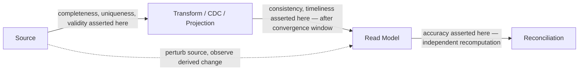

# Data Quality Test Standard

Status: Approved | Last Reviewed: 2026-08-13 | Owner: @qe-lead
Catalog ID: TST-009 | Radii
Tier Applicability: T0, T1, T2

## Problem Statement

- Data quality rules are defined — in a rules engine, a dbt test, a data-contract YAML file —
  but never asserted in an actual test run. The rule exists as a specification of what should
  be true, and nobody has proven it is checked, only that it is written down.
- Read models are compared against source for equality without accounting for eventual
  consistency, so a test that runs a moment before CDC or projection catch-up produces a flaky
  failure that has nothing to do with correctness — the comparison was simply made too early.
- Reconciliation is run with an undeclared tolerance, so a real break in the numbers is
  silently absorbed inside whatever fudge factor the reconciliation job happens to apply, and
  nobody can say afterward whether the tolerance was reasonable or was hiding a defect.
- Convergence lag is measured as an average, which makes tail lag invisible — the p99 straggler
  that actually breaches a downstream SLA disappears inside a mean that is dominated by the
  99% of records that converged quickly.
- Lineage is documented — a diagram showing source system to report field — but never verified;
  the diagram describes an intended data flow, and nobody has confirmed the flow it describes
  is the flow that actually happens.

## The Six Dimensions

Every data quality assertion is one of exactly six dimensions. A DQ rule that does not map to
one of these six has introduced an untracked vocabulary term and should be rejected at review.

| Dimension | Assertion form | Metric | Synthetic example |
|---|---|---|---|
| `completeness` | Every expected record and every required field on it is present; no unexpected null in a non-nullable business field. | % of records with all required fields populated. | A daily settlement batch expects 12,000 transaction records; the completeness check asserts `actual_count == expected_count` and `null_rate(settlement_amount) == 0`. |
| `accuracy` | The value matches an independently verifiable source of truth, within a declared tolerance. | % of values matching the independent source within tolerance; error magnitude for the values that don't. | A customer's displayed account balance is recomputed independently from the ledger's posted entries and asserted equal to the displayed value within the reconciliation tolerance declared in [Reconciliation Testing](#reconciliation-testing). |
| `consistency` | The same fact is represented identically across systems or read models, once both have had time to converge. | Cross-system diff count, evaluated only after the declared convergence window. | A loan's `status` field in the origination service and its projection in the reporting read model are asserted equal, checked at `t + convergence_window`, never at `t`. |
| `timeliness` | The value is available within its declared SLA of the event that produced it. | Lag distribution (p50/p95/p99) from triggering event to value availability. | A payment's settlement status is asserted available in the reporting read model within the declared 5-second p95 lag bound of the settlement event, per [Convergence and Lag Assertions](#convergence-and-lag-assertions). |
| `uniqueness` | No duplicate entities exist under the declared natural key. | Duplicate count / duplicate rate against the natural key. | A customer's `national_id` is asserted to appear at most once across the customer master; the dirty-data corpus seeds 15 deliberate duplicates to prove the check's recall. |
| `validity` | The value conforms to its declared format, domain, or range constraint. | % of values conforming to the declared schema/domain rule. | A transaction's `currency` field is asserted to be one of the ISO 4217 codes the service declares as valid; a value outside that domain fails the check regardless of whether it is otherwise well-formed. |

## Reconciliation Testing

The method is independent recomputation from source — re-deriving the value under test from
raw source records through a separate code path — never re-reading the same materialised
aggregate a second time. Re-reading the same aggregate only proves the read is consistent with
itself; it proves nothing about whether the aggregate was computed correctly in the first
place.

Every reconciliation test declares its tolerance up front, before the comparison runs, and the
tolerance is a stated number, not "close enough."

**The rule, stated without exception:** for any monetary reconciliation, the declared tolerance
is exactly zero. Any non-zero tolerance on a monetary reconciliation requires named,
dated approval recorded against the specific reconciliation it applies to — never a team
consensus, never a default carried over from a non-monetary check. A monetary reconciliation
with an undeclared or unapproved non-zero tolerance is treated as a failing check, not a
passing one with a rounding allowance.

Cross-link: [TST-021 Ledger & Monetary Invariant](../archetypes/ledger-monetary-invariant.md)
is the archetype that applies this exact-zero rule to double-entry ledger invariants; [DATA-011
Data Quality Rules](../../patterns/data/data-quality-rules.md) owns the rule-engine mechanism
(dbt tests, Great Expectations suites) this method's assertions are implemented against.

## Convergence and Lag Assertions

Asserting eventual consistency without flakiness requires three things together, not any one
alone:

- **A bounded convergence window with a declared upper bound.** "Eventually consistent" is not
  a test condition; "converges within 5 seconds" is. The bound is declared per data flow, not
  assumed globally.
- **Assertion at the tail percentile, not the mean.** The check asserts against p95 or p99 lag,
  because the mean is dominated by the majority of records that converge quickly and hides
  exactly the straggler that would breach a downstream SLA.
- **A hard failure if the bound is exceeded.** Exceeding the declared bound is a test failure,
  not a warning logged and ignored — a bound nobody enforces is not actually a bound.

**Polling until success, with no declared bound, is not a test.** A test that retries a
comparison every 500ms for up to 5 minutes and reports success the first time it matches has
proven the value eventually became correct, and has asserted nothing about whether "eventually"
satisfies any SLA a downstream consumer actually depends on — it will pass identically whether
convergence took 50ms or 4 minutes 59 seconds.

## Lineage Verification

Lineage is verified by perturbing the source and observing the derived value change — not by
inspecting a lineage diagram or a metadata catalogue entry and confirming it looks plausible. The
test changes a specific field on a specific source record to a known, distinct value, then
asserts the value downstream (the report field, the read-model projection) changes in the way
the declared lineage predicts, within the declared convergence window from
[Convergence and Lag Assertions](#convergence-and-lag-assertions).

A lineage diagram that shows field X flowing from system A to report field Y is a claim; a
perturbation test that changes X in system A and observes Y change in the report is the
evidence the claim is true rather than aspirational.

Cross-link: [DATA-009 Data Lineage](../../patterns/data/data-lineage.md) owns the lineage-capture
mechanism (Apache Atlas or equivalent metadata tooling); this section owns the test that proves
the captured lineage matches the real data flow rather than a stale or manually maintained
description of it.

## Dirty-Data Corpus

A deliberately defective synthetic corpus, seeded with a known defect count per dimension, is
maintained so that a DQ rule's recall is measurable rather than asserted in prose. "This rule
catches missing fields" is not evidence; "this rule caught 48 of the 50 deliberately missing
fields seeded into the corpus" is.

- The corpus declares, per dimension, exactly how many defects of that kind it contains — for
  example, 50 records with a missing required field for `completeness`, 15 duplicate natural
  keys for `uniqueness`, 20 out-of-domain currency codes for `validity`.
- Running the DQ rule set against the corpus and comparing catches against the declared defect
  count yields `recall = defects_caught / defects_seeded` per dimension — a number, not an
  impression.
- The corpus is synthetic, generated per [TST-004 Test Data Management](./test-data-management.md)'s
  prohibition on real or de-identified production data; a dirty-data corpus is exactly the kind
  of data most tempting to pull from a production snapshot "because it already has real
  defects in it," and that temptation is exactly what TST-004's mandate exists to close off.

## Compliance Mapping

| Layer | Reference | Section/Control | How this satisfies |
|---|---|---|---|
| Ring 0 | DAMA-DMBOK Data Quality Dimensions | Completeness, accuracy, consistency, timeliness, uniqueness, validity | [The Six Dimensions](#the-six-dimensions) is the normative, test-assertable instantiation of the DAMA-DMBOK dimension set for every catalog row that carries a `data_quality` obligation. |
| Ring 1 | [Basel BCBS 239](../../compliance/basel-bcbs-239.md) — Principle 3 (Accuracy and Integrity) | Risk data must be accurate and reconcilable to source | [Reconciliation Testing](#reconciliation-testing)'s independent-recomputation method and exact-zero monetary tolerance rule are the test evidence Principle 3's accuracy expectation requires. |
| Ring 1 | [Basel BCBS 239](../../compliance/basel-bcbs-239.md) — Principle 4 (Completeness) | Risk data aggregation must capture all material risk data | The `completeness` dimension in [The Six Dimensions](#the-six-dimensions), measured against the [Dirty-Data Corpus](#dirty-data-corpus)'s known defect counts, is the recall evidence for Principle 4. |
| Ring 1 | [Basel BCBS 239](../../compliance/basel-bcbs-239.md) — Principle 5 (Timeliness) | Risk data must be available within required reporting timeframes | [Convergence and Lag Assertions](#convergence-and-lag-assertions)'s tail-percentile bound is the concrete, test-asserted instantiation of Principle 5. |
| Ring 2 | SBV Circular 09/2020/TT-NHNN — reporting-accuracy expectations ⚠️ (working summary — pending Legal review) | Regulatory report accuracy | Reconciliation and lineage-verification evidence, retained per [TST-005](./environments-quality-gates.md), is the artifact produced for an SBV review of regulatory reporting accuracy. |

## Related

- [TST-001 Test Strategy Standard](./test-strategy-standard.md)
- [TST-004 Test Data Management](./test-data-management.md)
- [TST-005 Test Environments and Quality Gates](./environments-quality-gates.md)
- [TST-021 Ledger & Monetary Invariant](../archetypes/ledger-monetary-invariant.md)
- [TST-037 Read-Model Convergence & CDC Lag](../archetypes/read-model-convergence-lag.md)
- [TST-038 Temporal & Historisation Correctness](../archetypes/temporal-historisation.md)
- [TST-039 Data Quality & Reconciliation](../archetypes/data-quality-reconciliation.md)
- [DATA-011 Data Quality Rules](../../patterns/data/data-quality-rules.md)
- [DATA-009 Data Lineage](../../patterns/data/data-lineage.md)
