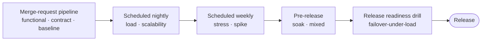

# Test Environments and Quality Gates

Status: Approved | Last Reviewed: 2026-08-13 | Owner: @qe-lead
Catalog ID: TST-005 | Radii
Tier Applicability: T0, T1, T2, T3

## Problem Statement

- Performance results from an undersized environment are extrapolated to a production claim
  without a stated sizing ratio, so a DAB reviewer has no way to tell whether "meets budget in
  perf" means anything about production at all.
- Environments are shared across squads or across concurrent runs, so a result is silently
  contaminated by someone else's load, someone else's deploy, or someone else's data mutation,
  and the run that produced it cannot be trusted or reproduced.
- Quality gates are placed so late in the pipeline — often only before a release — that a defect
  a `baseline` or contract check would have caught on day one is instead found and fixed at the
  most expensive possible point in the delivery cycle.
- A flaky test is retried until it goes green rather than investigated, so a test that changes
  its verdict without any change in the system under test is treated as reliable evidence when
  it is actually hiding a real, intermittent defect.
- Evidence from a passing run is not retained long enough to satisfy an audit, so a regulator's
  post-incident examination or a BCP-drill review finds no artifact for a control the
  organisation claims to have exercised.

## Environment Tiers

| Environment | Purpose | Data source | Owner | Profiles run there |
|---|---|---|---|---|
| `dev` | Unit and component verification during development | Synthetic, minimal — just enough to exercise the code path under change | Squad | None of the eight [TST-002](./performance-test-standard.md) profiles; functional and contract checks only |
| `sit` | Integration and contract verification across service boundaries | Synthetic, generated per [TST-004](./test-data-management.md) rule-based and graph-consistent techniques | Squad, shared within a domain | None of the eight profiles; contract and integration checks |
| `uat` | Business acceptance against the specification a stakeholder signs off on | Synthetic, scenario-shaped to the acceptance criteria under review | Product/QE jointly | None of the eight profiles; functional acceptance only |
| `perf` | All eight performance profiles, run in isolation | Synthetic, distribution-matched and volume-scaled per [TST-004](./test-data-management.md) | QE (perf environment is not squad-shared) | `baseline`, `load`, `stress`, `spike`, `soak`, `mixed`, `scalability` — see [Isolation Requirements](#isolation-requirements) for why this environment is never shared |
| `prod-like` | Release readiness drill — the last gate before a release is judged ready | Synthetic, matched to production topology and configuration, not merely to production data shape | QE, with SRE co-ownership of the drill | `failover-under-load` — the only profile that exercises a declared fault under live-shaped traffic immediately before release |

## Performance Environment Sizing and Extrapolation

A `perf` environment smaller than production may be used only when a sizing ratio is declared
in advance — for example, "this environment runs 4 of production's 16 instances behind the same
load-balanced tier, a 1:4 ratio." Given a declared ratio, exactly two measured quantities may be
extrapolated from the smaller environment to a production claim:

- **Latency-per-request** — the time a single request spends in the system does not depend on
  how many peer instances exist behind the same load balancer, so a latency figure measured on
  the smaller footprint is a valid proxy for the production figure.
- **Per-instance throughput** — the request rate one instance can sustain is a property of that
  instance's own resources (CPU, memory, connection pool), not of how many other instances exist
  alongside it, so it scales linearly with the declared ratio.

**Explicitly non-extrapolable — never scale these by the sizing ratio, under any
circumstance:**

- **Anything gated by a shared singleton.** A single database primary, one Hardware Security
  Module (HSM), and one NAPAS link are each a hard, physical ceiling that does not multiply when
  the sizing ratio says "4×." An HSM's signing or decryption throughput is fixed by the physical
  device itself: a smaller `perf` environment sharing the same single HSM as production observes
  the *same* HSM ceiling production would hit, not a quarter of it, and a result that multiplies
  an observed HSM-bound throughput by the sizing ratio is fabricating a number the hardware
  cannot produce. The same reasoning applies without exception to a single database primary
  (write throughput is bound by that one primary, not by instance count) and to a single NAPAS
  link (the external link's capacity does not grow because the test environment is smaller).
- **Cache hit rate.** Hit rate is a function of working-set size relative to cache size and of
  the traffic's own access pattern, not of the sizing ratio; a smaller environment's cache
  behaves differently from production's regardless of how many instances sit behind it, per the
  cardinality and skew argument in [TST-004](./test-data-management.md#volume-and-cardinality).
- **Anything where cardinality differs.** Index selectivity, hot-key contention, and any other
  quantity whose value depends on how many distinct values or how skewed a distribution is
  present cannot be inferred from a smaller footprint's measurement, because cardinality is a
  property of the dataset, not of instance count — see
  [NFR-003](../../nfr/capacity-planning-model.md) for the capacity model this sizing rule feeds.

**Rule:** an evidence artifact that reports an extrapolated value for anything on the
non-extrapolable list above is void regardless of the sizing ratio used to produce it, and the
`test_acceptance_criteria.evidence` block citing it is rejected at DAB review.

## Isolation Requirements

The `perf` environment carries no other workload during a run — no concurrent squad's test, no
background batch job, no shared-tenant traffic. A run is not evidence unless isolation is
observably confirmed, not merely assumed because no one else booked the environment:

- **Neighbour CPU** — no process outside the run under test consumes measurable CPU on any host
  participating in the run.
- **Shared-database session count** — the session count against any shared database matches the
  run's own expected connection-pool size, with no unexplained sessions from another source.
- **Network saturation** — no unrelated traffic is observed consuming the network path the run
  depends on.

**Rule:** a run without a recorded isolation check against all three signals above is not
evidence — it is discarded, and the profile is re-run once isolation is confirmed. This is the
same class of failure as the shared-environment contamination named in the
[Problem Statement](#problem-statement): an uncontaminated result and an unverified result are
not distinguishable after the fact, so verification is mandatory, not optional.

## Gate Placement

| Discipline / profile | Pipeline stage |
|---|---|
| Functional unit and component checks | Merge-request pipeline |
| Contract checks | Merge-request pipeline |
| `baseline` | Merge-request pipeline |
| `load` | Scheduled nightly |
| `scalability` | Scheduled nightly |
| `stress` | Scheduled weekly |
| `spike` | Scheduled weekly |
| `soak` | Pre-release |
| `mixed` | Pre-release |
| `failover-under-load` | Release readiness drill |

Placing `baseline` and contract checks on every merge request is deliberate: it is how this
document closes the "gates placed so late" failure named in the
[Problem Statement](#problem-statement) — the cheapest signals run on every change, and the most
expensive, highest-fidelity signal (`failover-under-load`) runs exactly once, immediately before
release, on the `prod-like` environment. See [BP-001](../../best-practices/ci-cd-pipeline-design.md)
for the underlying pipeline-stage design this gate placement extends.

## Entry and Exit Criteria

**Entry — all of the following must be true before a profile may run:**

- **Build identity is pinned.** The exact artifact under test (image digest or build ID) is
  recorded before the run starts, so a later question about "which build was this?" has one
  answer.
- **Dataset is seeded and verified.** The seed used to generate the run's dataset is recorded
  per [TST-004](./test-data-management.md#seeding-and-reproducibility), and the dataset's
  referential integrity and cardinality have been checked, not merely assumed from generation
  having "completed without error."
- **Isolation is confirmed.** All three signals in [Isolation Requirements](#isolation-requirements)
  are checked and recorded before load begins.
- **A baseline is available.** For any profile that grades against a baseline (see
  [TST-002](./performance-test-standard.md#result-baselining-and-regression)), the accepted
  baseline for comparison exists and is identified before the run starts.

**Exit — all of the following must be true before a run may be called passed:**

- **All pass criteria are met**, as declared by the owning profile in
  [TST-002](./performance-test-standard.md) or by the archetype's own Functional Test Design.
- **Evidence is captured**, per the artifact list in [Evidence and Retention](#evidence-and-retention).
- **No unexplained anomaly exists.** An anomaly observed during the run — a latency spike, an
  unexpected error burst, a resource metric behaving outside its normal envelope — is either
  explained and shown not to affect the pass criteria, or the run does not pass regardless of
  whether the declared assertions technically succeeded.

A run that satisfies entry but not exit is a failed run. A run that never satisfied entry never
produced evidence at all, and its result — pass or fail — is not admissible.

## Flakiness Policy

**Definition:** a flaky test is one that changes verdict — pass to fail, or fail to pass —
without any corresponding change in the system under test, the build under test, or the
declared inputs to the run. A test whose verdict tracks a real change is not flaky, however
surprising the change; only a verdict that toggles for no discoverable reason qualifies.

**Prohibition on blind retry-until-green.** Re-running a failed test until it passes, without
first investigating why it failed, is prohibited. Retry-until-green converts a real signal —
something about the system, the environment, or the test itself is unreliable — into silence,
and the defect it was hiding remains in the system, now with no record that it was ever
observed.

**Quarantine mechanism.** A test confirmed flaky (verdict toggles across repeated runs against
the same build, same environment, same inputs) is moved into quarantine: it continues to run and
its result is recorded, but it does not gate a pipeline stage while quarantined. Quarantine is a
tracked, visible state, not a silent skip — a quarantined test appears in the coverage record as
`quarantined`, never as passing.

**Time limit on quarantine.** A test may remain quarantined for at most 30 days. Within that
window it must be either fixed and returned to gating status, or replaced by a redesigned test
that verifies the same obligation without the same flake source. A test still quarantined past
30 days is treated as a coverage gap, not as a passing check, for the discipline it was meant to
verify.

**Rule:** a quarantined test that was gating a `required` discipline (per the obligation levels
in [TST-001](./test-strategy-standard.md)) blocks the release until it is either fixed and
passing, or explicitly and visibly waived by the accountable reviewer named in the service's
`test_acceptance_criteria.evidence.signed_off_by` field. Quarantine removes the test from the
gate; it does not remove the underlying obligation the test existed to satisfy.

## Evidence and Retention

**What constitutes evidence, per profile:**

- **Raw results file** — the unprocessed output the load-generation or test-execution tool
  produced, before any summarisation.
- **Generated report** — the human-readable summary (time series, pass/fail table, knee-point
  chart, or equivalent) named as the evidence artifact for that profile in
  [TST-002](./performance-test-standard.md).
- **Resource metrics** — CPU, memory, connection-pool, queue-depth, and cache-state time series
  for the full run window.
- **Trace samples** — a representative sample of distributed traces from the run, sufficient to
  attribute an observed latency or error to a specific hop.
- **The seed** — the data-generation seed used, per
  [TST-004](./test-data-management.md#seeding-and-reproducibility).
- **The build identity** — the artifact digest or build ID pinned at entry, per
  [Entry and Exit Criteria](#entry-and-exit-criteria).
- **The isolation check** — the recorded confirmation of all three isolation signals, per
  [Isolation Requirements](#isolation-requirements).

A run missing any item on this list has not produced evidence, regardless of what its pass/fail
summary claims.

**Where it is stored.** Evidence is written to the QE evidence store at run completion, indexed
by service name, profile, build identity, and run timestamp, so a DAB reviewer or an auditor can
retrieve the full evidence set for a specific claimed run rather than a summary reconstructed
after the fact.

**Retention period.** Evidence is retained for a minimum of 12 months, matching the regression
baseline window in [TST-002](./performance-test-standard.md#result-baselining-and-regression),
and for the full record-retention period applicable to `failover-under-load` runs on T0/T1
services, since that evidence is the artifact a regulatory BCP-drill review expects to find.
Evidence retained under this rule must remain tamper-evident for its full retention window — see
[SEC-012 Tamper-Evident Audit Logging](../../patterns/security/audit-logging-tamper-evident.md)
for the integrity mechanism this obligation relies on; this document does not restate SEC-012's
chaining or WORM design, only the requirement that retained test evidence be covered by it.

## Compliance Mapping

| Layer | Reference | Section/Control | How this satisfies |
|---|---|---|---|
| Ring 0 | NIST SP 800-53 | CM-4 (Security Impact Analysis) | The [Gate Placement](#gate-placement) pipeline ensures every change is assessed for impact at a defined stage before release, rather than only at an ad hoc point a squad chooses. |
| Ring 0 | NIST SP 800-53 | CA-2 (Control Assessment) | The [Entry and Exit Criteria](#entry-and-exit-criteria) and [Evidence and Retention](#evidence-and-retention) sections together make every gate an assessed, evidenced control rather than an unrecorded assertion that a stage "passed." |
| Ring 1 | [PCI-DSS 4.0](../../compliance/pci-dss-4-0.md) | §6.5.3 (separation of test and production environments) | The [Environment Tiers](#environment-tiers) table's distinct ownership and data source per tier, and the `prod-like` tier's status as a pre-release drill rather than production itself, keeps test and production separated as §6.5.3 requires. |
| Ring 1 | [PCI-DSS 4.0](../../compliance/pci-dss-4-0.md) | §6.5.5 | The `perf` and `prod-like` environments run exclusively on synthetic data per [TST-004](./test-data-management.md), never on production extracts, closing the same gap §6.5.5 addresses for performance and drill environments specifically. |
| Ring 1 | [Basel BCBS 230](../../compliance/basel-bcbs-230.md) — Principle 9 | Severe-but-plausible scenario testing, evidenced | The `prod-like` release readiness drill and its retained [Evidence and Retention](#evidence-and-retention) artifact are the drill evidence Principle 9 requires exist and be producible on demand. |
| Ring 2 | SBV Circular 09/2020/TT-NHNN — §IV.3 ⚠️ (working summary — pending Legal review) | Operational continuity testing | The `failover-under-load` release readiness drill and its evidence retention are the artifact expected for an SBV on-site examination of operational continuity practice. |

## Related

- [TST-001 Test Strategy Standard](./test-strategy-standard.md)
- [TST-002 Performance Test Standard](./performance-test-standard.md)
- [TST-003 Workload Modelling](./workload-modelling.md)
- [TST-004 Test Data Management](./test-data-management.md)
- [BP-001 CI/CD Pipeline Design Best Practice](../../best-practices/ci-cd-pipeline-design.md)
- [NFR-003 Capacity Planning Model](../../nfr/capacity-planning-model.md)
- [SEC-012 Tamper-Evident Audit Logging](../../patterns/security/audit-logging-tamper-evident.md)
