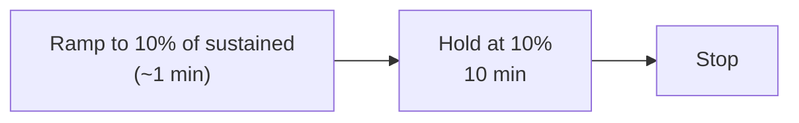
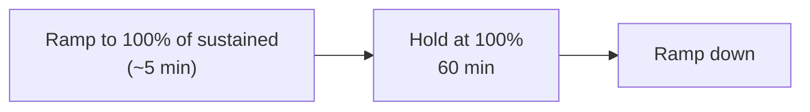
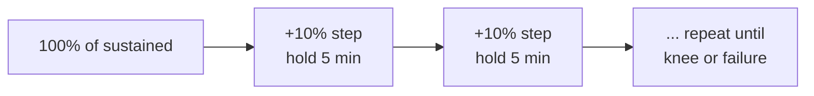
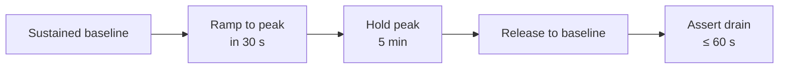
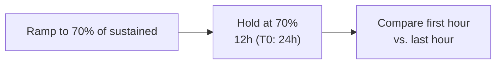
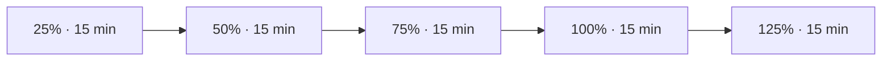

# Performance Test Standard

Status: Approved | Last Reviewed: 2026-08-13 | Owner: @qe-lead
Catalog ID: TST-002 | Radii
Tier Applicability: T0, T1, T2, T3

## Problem Statement

- Profile names — "load test," "stress test," "soak test" — are used inconsistently across
  squads, so two teams that both claim a profile passed are not comparing the same evidence.
- Soak duration and spike shape are left undefined, so a two-hour soak and a twenty-four-hour
  soak are treated as equivalent proof when they are not.
- Aggregate pass criteria hide per-journey failures — a blended run can report a passing
  headline P95 while a low-volume, high-value journey inside the blend breaches its own budget.
- Thresholds are copied by hand from NFR documents into test plans and dashboards, then drift
  silently as the owning NFR document is revised and the copies are not.
- No defined evidence artifact exists per profile, so a DAB reviewer has nothing fixed to
  request and cannot audit a "passed" claim.

## The Eight Profiles

| Profile | Purpose | Load shape | Pass criteria | Required for |
|---|---|---|---|---|
| `baseline` | per-build sanity | 10% of sustained, 10 min | zero errors; P95 within tier budget | T0–T3 |
| `load` | steady-state proof | 100% of sustained, 60 min | P50/P95/P99 all within the NFR-002 tier row; error rate ≤ 0.1% | T0–T2 |
| `stress` | locate the knee | step +10% every 5 min until failure | knee ≥ declared `peak_rps`; degradation graceful, not cliff-edge | T0, T1 |
| `spike` | burst absorption | sustained → peak in 30 s, hold 5 min, release | recovery to baseline P95 ≤ 60 s; zero message loss; no DLQ growth | T0, T1 |
| `soak` | leak and drift | 70% of sustained; 12 h (T0: 24 h) | RSS growth ≤ 5%; P95 drift ≤ 10% first hour vs last hour; connection-pool and thread counts flat; DLQ depth flat; no unbounded cache growth | T0, T1 |
| `mixed` | realistic contention | named journey blend from TST-003, 4 h | every journey's own P95 within its own tier budget | T0, T1 |
| `scalability` | linearity and autoscaling | 25/50/75/100/125% step-ramp, 15 min per step | throughput linear within ±15%; HPA settles < 3 min; no thrash | T0–T2 |
| `failover-under-load` | HA proof under traffic | 100% sustained with an injected fault from the declared `failure_modes` | RTO and RPO within the NFR-001 tier row; error burst ≤ the agreed share of the error budget | T0, T1 |

The numbers in this table — durations, ramp shapes, drift tolerances — are *profile
parameters*: they describe how the test is run and how its own result is graded, and they
belong in this document. They are not service SLOs. Service SLOs (`P95`, `sustained_rps`,
`RTO`) stay in the NFR spine and are linked, never copied.

## Per-Profile Detail

### `baseline`

Confirms a build has not regressed before it earns the right to run anything heavier. Runs on
every build as the cheapest possible performance signal, not as proof of capacity.

**Required inputs:** tier assignment; declared `sustained_rps` (source of the 10% floor); an
environment matching the pre-prod gate defined in [TST-005](./environments-quality-gates.md).

**Pass criteria (assertable):**

- `assert error_count == 0` for the full run.
- `assert p95_latency <= NFR-002 tier row` for the service's declared tier.

**Common false pass:** the run passes because 10% load never leaves the JIT-warm fast path —
code paths only exercised under real contention (lock acquisition, connection-pool exhaustion,
GC pressure) never fire.

**Evidence artifact:** a per-build pass/fail summary (error count, observed P95) attached to
the CI run.

### `load`

Proves the service holds its declared steady-state throughput for a sustained period, not just
in a burst. This is the profile a DAB submission cites as the primary throughput proof.

**Required inputs:** declared `sustained_rps`; workload model (`open` or `closed`) per
[TST-003](./workload-modelling.md); an environment sized per the load gate in
[TST-005](./environments-quality-gates.md).

**Pass criteria (assertable):**

- `assert p50_latency <= NFR-002 tier row`, `assert p95_latency <= NFR-002 tier row`,
  `assert p99_latency <= NFR-002 tier row`.
- `assert error_rate <= 0.1%` across the full 60-minute hold.

**Common false pass:** the run passes because the backing dataset is too small — index
selectivity and cache hit rate, not row count, drive latency at scale. Cross-link
[TST-004](./test-data-management.md) for the data-sizing obligation this closes.

**Evidence artifact:** a run report with the P50/P95/P99 time series and error-rate series for
the full hold window, attached to the DAB submission.

### `stress`

Finds the load level at which the service stops degrading gracefully and starts failing
outright — the "knee." This is diagnostic, not a pass/fail gate on a fixed number.

**Required inputs:** declared `peak_rps` (the floor the knee must clear); an **open** workload
model per [TST-003](./workload-modelling.md) — a closed model cannot locate a knee; an
environment isolated from other tenants so contention is attributable to the service under
test.

**Pass criteria (assertable):**

- `assert knee_throughput >= declared peak_rps`.
- `assert degradation_shape == "graceful"` — latency and error rate rise smoothly step over
  step, not as a single cliff-edge step.

**Common false pass:** the run passes because a closed workload model throttled offered load as
latency rose, so the knee was never actually reached. Cross-link
[TST-003](./workload-modelling.md) for the open/closed distinction that this false pass turns
on.

**Evidence artifact:** a knee-point report — throughput vs. latency and throughput vs. error
rate, with the observed knee step marked.

### `spike`

Proves the service absorbs a sudden burst and fully recovers, not just that it stays up during
the burst itself. The recovery, not the peak, is what this profile grades.

**Required inputs:** declared `peak_rps`; queue and DLQ depth instrumentation; message-loss
detection at the boundary the spike traverses.

**Pass criteria (assertable):**

- `assert time_to_baseline_p95 <= 60s` measured from the moment load is released.
- `assert messages_lost == 0`.
- `assert dlq_depth_after == dlq_depth_before`.

**Common false pass:** the run passes because a queue absorbed the burst and the run ended
before the queue fully drained — accepted-request count looks clean while a backlog is still
being worked off. Assert drain-to-baseline explicitly; do not stop measuring at the moment
requests are accepted.

**Evidence artifact:** a burst-and-drain timeline showing accepted requests, queue depth, and
time-to-baseline recovery across the full release-and-drain window.

### `soak`

Exposes slow leaks and drift that only appear over hours, not minutes: memory growth,
connection-pool exhaustion, cache growth without eviction, latency creep. Short runs cannot
see any of this.

**Required inputs:** declared `sustained_rps`; continuous monitoring of RSS, connection-pool
and thread counts, DLQ depth, and cache size for the full hold; a guarantee that no deploy or
restart occurs mid-run.

**Pass criteria (assertable):**

- `assert rss_growth <= 5%` over the full hold.
- `assert p95_drift <= 10%` comparing the first hour to the last hour.
- `assert connection_pool_count` and `assert thread_count` are flat (no monotonic trend).
- `assert dlq_depth` is flat.
- `assert cache_size` does not grow unbounded.

**Common false pass:** the run passes because it was too short to expose a slow leak, or
because the process was restarted by a deploy mid-run — the restart resets the very state
(memory, pool, cache) the profile exists to observe.

**Evidence artifact:** a first-hour-vs-last-hour comparison report plus the full-duration
resource-utilisation time series (RSS, connections, threads, DLQ depth, cache size).

### `mixed`

Proves the service behaves under the realistic contention of several journeys competing for
the same resources at once, not just one journey in isolation. Pass/fail is evaluated
per-journey, never on the blended aggregate alone.

**Required inputs:** a named journey blend owned by [TST-034](../archetypes/blended-journey-workload.md);
per-journey tier budgets from [NFR-002](../../nfr/latency-budget-model.md) for every journey in
the blend; the `blend_ref` recorded in the service's `test_acceptance_criteria` block.

**Pass criteria (assertable):**

- For every journey `j` in the blend: `assert p95_latency[j] <= NFR-002 tier row for j`.
- The blended aggregate P95 is reported for context but is never itself the pass/fail gate.

**Common false pass:** the run passes on the aggregate P95 while a low-volume, high-value
journey inside the blend breaches its own budget — the aggregate is dominated by the
high-volume journeys and masks the one that matters most.

**Evidence artifact:** a per-journey P95 breakdown table, one row per journey in the blend,
each compared to its own tier budget.

### `scalability`

Proves throughput scales close to linearly with load and that autoscaling reacts within a
bounded time, without thrashing. This is the profile that validates capacity headroom
assumptions rather than a fixed target.

**Required inputs:** the autoscaling (HPA or equivalent) policy under test; declared
`sustained_rps` as the 100% reference point; scale-event timestamps captured from the
orchestrator.

**Pass criteria (assertable):**

- `assert throughput_per_step` is linear within ±15% of the expected step value at each step.
- `assert hpa_settle_time < 3min` after each step change.
- `assert no_scale_thrash` — no rapid scale-up/scale-down oscillation within a step.

**Common false pass:** the run passes because the load generator itself saturated first — the
throughput curve flattens because the tool ran out of headroom, not because the system under
test did. Confirm generator headroom before attributing a plateau to the service.

**Evidence artifact:** a throughput-vs-instance-count chart with the HPA scale-event timeline
overlaid on the same axis.

### `failover-under-load`

Proves the declared recovery targets and error-budget allowance hold when a fault is injected
under real traffic, not in a quiet maintenance window. This is the only profile that combines a
resilience fault injection with a live performance load.

**Required inputs:** the declared `failure_modes` from the service's `nfr_acceptance_criteria`
block; the RTO/RPO tier row from [NFR-001](../../nfr/service-tiering-rto-rpo.md); the error
budget tier row from [NFR-005](../../nfr/error-budget-policy.md).

**Pass criteria (assertable):**

- `assert observed_rto <= NFR-001 tier row` and `assert observed_rpo <= NFR-001 tier row`.
- `assert error_burst <= agreed share of NFR-005 error budget`.

**Common false pass:** the run passes because the fault was injected at a quiet moment inside
the load window, or because the client retried transparently and the error burst was never
actually measured at the point of failure.

**Evidence artifact:** a fault-injection timeline with RTO/RPO measurement and an
error-burst-vs-error-budget comparison for the injection window.

## Threshold Derivation

| Pass criterion | Owning spine row |
|---|---|
| Latency (P50 / P95 / P99) | [NFR-002 Latency Budget Model](../../nfr/latency-budget-model.md) |
| Sustained and peak throughput | [NFR-004 Throughput Model](../../nfr/throughput-model.md) |
| Capacity headroom / autoscaling | [NFR-003 Capacity Planning Model](../../nfr/capacity-planning-model.md) |
| RTO / RPO / availability | [NFR-001 Service Tiering + RTO/RPO Matrix](../../nfr/service-tiering-rto-rpo.md) |
| Acceptable error burst | [NFR-005 Error Budget Policy](../../nfr/error-budget-policy.md) |

**Rule:** a document that contains a service latency or throughput number instead of a link to
its spine row is rejected at review. This document is no exception — every profile above
states its pass criterion as a comparison against a tier row, never as a copied number.

## Profile Selection by Tier

| Profile | T0 | T1 | T2 | T3 |
|---|---|---|---|---|
| `baseline` | `required` | `required` | `required` | `required` |
| `load` | `required` | `required` | `required` | `recommended` |
| `stress` | `required` | `required` | `recommended` | `n/a` |
| `spike` | `required` | `required` | `recommended` | `n/a` |
| `soak` | `required` | `required` | `recommended` | `n/a` |
| `mixed` | `required` | `required` | `recommended` | `n/a` |
| `scalability` | `required` | `required` | `required` | `recommended` |
| `failover-under-load` | `required` | `required` | `recommended` | `n/a` |

This matrix is consistent with the "Required for" column in [The Eight Profiles](#the-eight-profiles):
a tier not listed there as required is `recommended` where the profile still adds value at
lower criticality, or `n/a` where the profile's cost is not justified by the tier's risk
profile.

## Result Baselining and Regression

A run becomes the accepted baseline for a profile only after three consecutive runs, on an
environment meeting the tier's gate in [TST-005](./environments-quality-gates.md), pass that
profile's own criteria with no unexplained anomaly between runs. A single passing run is a
data point, not a baseline.

A subsequent run **fails as a regression** — independent of whether it still meets its NFR
tier row — if any of its own tracked metrics (the metrics named in that profile's pass
criteria above) moves more than 10% against the current baseline in the unfavourable
direction. This protects against a service that still clears its SLO but is silently getting
worse run over run.

Evidence from every run (baseline and comparison) is retained for a minimum of 12 months, and
for the full record-retention period applicable to `failover-under-load` runs on T0/T1
services, since that evidence is the audit artifact for a regulatory BCP-drill review.
Environment and pipeline gate placement for where each profile runs, and where its evidence is
archived, is owned by [TST-005](./environments-quality-gates.md), not restated here.

## Compliance Mapping

| Layer | Reference | Section/Control | How this satisfies |
|---|---|---|---|
| Ring 0 | Google SRE Workbook | Chapter 5 — load and stress testing | The eight profiles operationalise SRE load/stress testing guidance into a normative, comparable evidence contract instead of ad-hoc squad practice. |
| Ring 0 | ISTQB | Performance-testing test types (load, stress, spike, soak/endurance) | The profile taxonomy maps directly onto the ISTQB performance-testing test-type vocabulary, giving every squad a shared, industry-recognised naming scheme. |
| Ring 1 | [Basel BCBS 230](../../compliance/basel-bcbs-230.md) — Principle 9 | Severe-but-plausible scenario testing | `stress`, `spike`, and `failover-under-load` are the severe-but-plausible scenarios Principle 9 requires be exercised and evidenced under real traffic. |
| Ring 1 | [PCI-DSS 4.0](../../compliance/pci-dss-4-0.md) | §6.4 (pre-production functional and performance testing) | `load` and `stress` profile evidence for CDE-adjacent T0/T1 services satisfies the §6.4 pre-production performance-testing requirement. |
| Ring 2 | SBV Circular 09/2020/TT-NHNN — §IV.3 ⚠️ (working summary — pending Legal review) | Operational continuity / capacity resilience testing | `failover-under-load` evidence, retained per [Result Baselining and Regression](#result-baselining-and-regression), is the artifact produced for an SBV on-site examination. |

## Related

- [TST-001 Test Strategy Standard](./test-strategy-standard.md)
- [TST-003 Workload Modelling](./workload-modelling.md)
- [TST-005 Test Environments Quality Gates](./environments-quality-gates.md)
- [TST-006 Resilience Test Standard](./resilience-test-standard.md)
- [TST-010 Tool Selection Matrix](../tooling/tool-selection-matrix.md)
- [TST-034 Blended Journey Workload](../archetypes/blended-journey-workload.md)
- [NFR-001 Service Tiering + RTO/RPO Matrix](../../nfr/service-tiering-rto-rpo.md)
- [NFR-002 Latency Budget Model](../../nfr/latency-budget-model.md)
- [NFR-003 Capacity Planning Model](../../nfr/capacity-planning-model.md)
- [NFR-004 Throughput Model](../../nfr/throughput-model.md)
- [NFR-005 Error Budget Policy](../../nfr/error-budget-policy.md)
