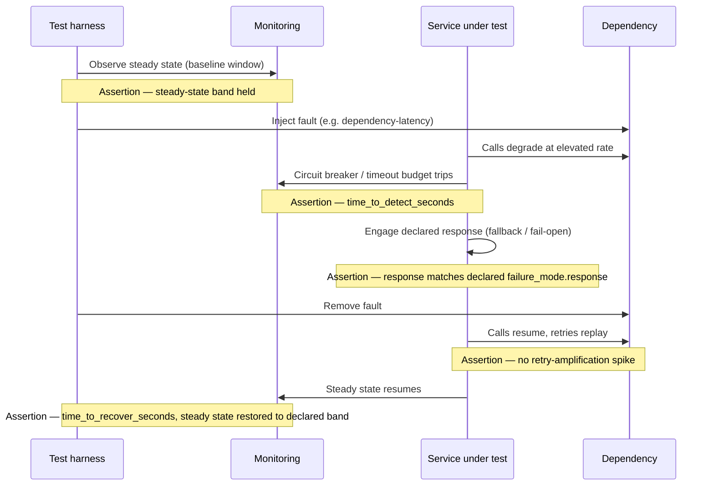

# Resilience Test Standard

Status: Approved | Last Reviewed: 2026-08-13 | Owner: @qe-lead
Catalog ID: TST-006 | Radii
Tier Applicability: T0, T1

## Problem Statement

- A service declares `failure_modes` in its `nfr_acceptance_criteria` block and no test ever
  exercises them — the declaration is a paper commitment, not a verified one.
- Faults are injected only at idle, so recovery behaviour under real traffic is unknown: a
  circuit breaker that opens cleanly against zero concurrent callers may behave completely
  differently against a saturated connection pool and a backlog of in-flight requests.
- Blast radius is asserted in a design document — "this fault stays inside one cell" — but is
  never measured against a running fault injection, so the claim is architecture-on-paper, not
  evidence.
- Retry amplification is untested: a caller's own retry policy, applied against a degraded
  dependency, can turn a partial outage into a thundering herd that makes the outage worse the
  moment recovery begins.
- Chaos experiments run without a pre-declared steady-state hypothesis, so an engineer looking
  at the result afterward cannot tell whether the system behaved as expected or not — there was
  nothing written down to compare against.

## Relationship to BP-005

[BP-005 Chaos Engineering](../../best-practices/chaos-engineering.md) owns the practice: the
five principles, the drill cadence per tier, the tool stack, the game-day playbook, and the
culture of running experiments continuously in production with bounded blast radius. `TST-006`
does not restate any of that. `TST-006` owns the *test obligation* that sits underneath the
practice: which fault classes exist as a shared vocabulary, which of them a given tier must
exercise, what must be true of the steady-state hypothesis before a fault is injected, and
exactly how the result is asserted — pass/fail criteria, not narrative. Where BP-005 answers
"how do we run chaos drills well," TST-006 answers "what must every drill prove, and how do we
know it proved it."

## Fault Class Taxonomy

Ten fault classes form the normative vocabulary every resilience overlay references by exact
name. A resilience overlay that names a fault outside this list has introduced an untracked
vocabulary term and should be rejected at review.

| Fault class | Simulates | How to inject | Expected system response | Pattern rows that must survive |
|---|---|---|---|---|
| `dependency-latency` | A downstream call responding slower than its declared budget, without failing outright. | Service-mesh fault injection (Istio `HTTPFaultInjection` delay) or a Toxiproxy `latency` toxic on the named downstream call. | The caller enforces [RES-006 Timeout Budget](../../patterns/resilience/timeout-budget.md) before the delay cascades upstream; if the delay is sustained, [RES-002 Circuit Breaker](../../patterns/resilience/circuit-breaker.md) opens. | RES-006, RES-002 |
| `dependency-error` | A downstream returning an elevated rate of 4xx/5xx or protocol-level errors. | Mesh fault injection returning a declared HTTP/gRPC error code on a percentage of calls, or the BP-005 `@ChaosFault` application-level annotation. | RES-002 Circuit Breaker opens once the declared error-rate threshold is crossed; [RES-007 Fallback Strategies](../../patterns/resilience/fallback-strategies.md) serves a degraded response instead of propagating the error. | RES-002, RES-007 |
| `dependency-blackhole` | The downstream accepts the connection or request and never responds — no error, no reset, no signal the caller can react to except elapsed time. | `iptables -j DROP` on the destination port, or Chaos Mesh `NetworkChaos` partition configured to drop packets silently rather than reject them. | RES-006 Timeout Budget is the *only* backstop, since no error is ever observed; the caller-side wait must still be bounded and the circuit breaker must open on timeout rate, not on an error it will never see. | RES-006, RES-002 |
| `resource-exhaustion` | CPU, memory, thread-pool, or connection-pool saturation on the instance under test. | `stress-ng` CPU/memory pressure co-located with the service, or a load client that opens and holds connections without releasing them. | [RES-009 Load Shedding](../../patterns/resilience/load-shedding.md) rejects excess load before the process is OOM-killed; [RES-001 Bulkhead Isolation](../../patterns/resilience/bulkhead-isolation.md) contains the exhaustion to the failing resource pool rather than starving unrelated call paths. | RES-009, RES-001 |
| `instance-loss` | Ungraceful termination of a single instance or pod — not a rolling deploy. | Chaos Mesh `PodChaos` `pod-kill` (mode: one) or an AWS FIS EC2-terminate action. | [RES-012 Health Check Aggregation](../../patterns/resilience/health-check-aggregation.md) removes the instance from rotation within its detection window; [RES-010 Leader Election](../../patterns/resilience/leader-election.md) re-elects if the killed instance held leadership. | RES-012, RES-010 |
| `zone-loss` | Loss of every instance in one availability zone at once. | Chaos Mesh `PodChaos` scoped to the AZ node-selector label, or an AWS FIS AZ-disruption action. | [RES-005 Cell-Based Architecture](../../patterns/resilience/cell-based-architecture.md) confines the blast radius to the cell(s) resident in that zone; traffic reroutes to healthy zones inside the tier's RTO. | RES-005, RES-001 |
| `region-loss` | Full regional outage — compute, network, or both. | AWS FIS region-scoped disruption, or disabling regional health checks per the BP-005 game-day playbook. | Cross-region failover completes within the [NFR-001](../../nfr/service-tiering-rto-rpo.md) tier's RTO/RPO row; no cell in the surviving region absorbs more than its designed share of rerouted traffic. | RES-005 |
| `clock-skew` | NTP drift or a manually offset system clock on a subset of instances. | Chaos Mesh `TimeChaos`, or `libfaketime`, offsetting the clock on a subset of instances by a declared duration. | RES-010 Leader Election's lease mechanism does not split-brain when the current leader's and a challenger's clocks disagree; timestamp-ordered invariants (idempotency keys, event ordering) do not silently reorder or double-apply. | RES-010 |
| `partial-partition` | An asymmetric network partition — a subset of instances can reach some peers but not others, unlike a clean network split. | Chaos Mesh `NetworkChaos` partition targeting a named subset of pod-to-pod pairs while leaving the rest of the mesh reachable. | RES-001 Bulkhead Isolation prevents the partitioned subset from starving the healthy majority of shared resources; RES-010 Leader Election does not elect two leaders, one on each side of the partition. | RES-001, RES-010 |
| `slow-disk` | Degraded disk I/O latency — EBS throttling, noisy-neighbour I/O contention, or a failing volume. | Chaos Mesh `IOChaos` adding latency to read/write syscalls, or `stress-ng --iomix` co-located contention on the same volume. | RES-006 Timeout Budget bounds any disk-bound call path; RES-009 Load Shedding sheds new write requests before an unbounded queue forms behind the slow disk. | RES-006, RES-009 |

## The `failure_modes` Obligation

The rule is symmetric with the Cross-Block Invariant already defined in
[TST-001](./test-strategy-standard.md#cross-block-invariants): every `FM*` entry a service
declares in `nfr_acceptance_criteria.failure_modes` (per
[TPL-001](../../templates/nfr-acceptance-criteria-dab.md)) requires exactly one corresponding
entry in that service's `test_acceptance_criteria.resilience.fault_scenarios`. A declared
failure mode with no matching fault scenario is not a documentation nit — it is a resilience
claim nobody has verified, and it is what this standard exists to close.

A worked synthetic example. The service declares a failure mode against its fraud-scoring
dependency:

```yaml
# nfr_acceptance_criteria (TPL-001, excerpt) — synthetic, not a real service
failure_modes:
  - id: FM7
    description: Fraud-scoring dependency stops responding — no error, no reset, no signal
    detection: circuit breaker observes p99 latency exceeding the timeout budget for 30s
    response: fail open to the manual-review queue
    time_to_detect_seconds: 30
    time_to_recover_seconds: 90
```

The matching test obligation, recorded in the service's `test_acceptance_criteria` block:

```yaml
# test_acceptance_criteria (TST-001, excerpt) — same synthetic service
resilience:
  fault_scenarios: [FM7]
```

The fault class exercised is `dependency-blackhole` (FM7's description is exactly that fault:
no error, no reset, only elapsed time). The assertions that prove FM7 is real, not aspirational:

- `assert time_to_detect_seconds <= 30` — measured from the moment the fault is injected to the
  moment the circuit breaker opens.
- `assert time_to_recover_seconds <= 90` — measured from fault injection to the fail-open path
  being fully engaged and serving traffic.
- `assert no_silent_hang` — no in-flight request waits longer than the declared timeout budget,
  regardless of the dependency's blackhole behaviour.

An `FM*` entry with no matching `fault_scenarios` entry is a detectable gap: it is exactly the
condition Cross-Block Invariant #2 in [TST-001](./test-strategy-standard.md) is written to
catch, and it fails the same way a missing coverage-matrix row fails —
[TPL-001](../../templates/nfr-acceptance-criteria-dab.md) is the source of the `FM*` IDs this
obligation reconciles against.

## Steady-State Hypothesis

A fault injection without a pre-declared steady-state hypothesis cannot be interpreted — there
is nothing to compare the post-injection state against, and "it seemed to recover" is not
evidence. State the hypothesis before injecting, with four parts:

- **The metric** — a golden signal already instrumented for the service (error rate, P95
  latency, queue depth), never a metric invented for the drill itself.
- **Its normal band** — the range the metric holds during undisturbed operation, stated as a
  number (e.g. "P95 < 250 ms; error rate < 0.1%"), not as "normal."
- **The duration of observation** — the length of the pre-injection baseline window the metric
  must hold its band for before the fault is injected (a common floor is 10 minutes stable
  baseline; longer for a low-traffic service where 10 minutes is not enough samples).
- **The abort condition** — the threshold and duration that, if breached during or after
  injection, stops the drill immediately regardless of what the fault-class table above
  predicts (for example: sustained 5xx above 5% for 60 seconds).

## Fault Injection Under Load

A fault injected at idle proves very little, because the load-bearing state the fault is
supposed to exercise does not exist at idle: connection pools sit empty so exhaustion behaviour
never triggers, circuit breakers have no request volume to sample an error rate from, and
queues have no backlog to drain when the fault clears. A `dependency-error` fault injected
against zero concurrent traffic will show a circuit breaker doing nothing, not because the
breaker is broken but because it was never given anything to observe.

**The rule:** for T0 and T1 services, every resilience assertion in the fault-class taxonomy
above is made during the `failover-under-load` profile defined in
[TST-002](./performance-test-standard.md#failover-under-load) — at declared sustained
throughput, not at idle. A resilience result captured outside that profile is a data point, not
evidence for a DAB submission.

## Blast Radius Measurement

Blast radius is measured, not asserted. A design document's claim that a fault "stays inside
one cell" is an architectural intent; it becomes evidence only once a fault injection produces
a measurement against these four dimensions:

- **Affected journeys** — the named set of user- or system-facing journeys observed to degrade
  during the injection window, not the set the architecture predicted would degrade.
- **Fraction of requests impacted** — the share of total request volume, across all journeys,
  that observed an error or a latency breach during the window.
- **Duration** — the wall-clock time from first observed impact to full recovery, not from the
  moment the fault was injected (a fault can be injected before it produces any observable
  impact).
- **Recovery shape** — whether recovery is a clean step back to steady state or a decaying tail
  of elevated errors/latency; a decaying tail after the fault is removed is itself a finding.

[RES-005 Cell-Based Architecture](../../patterns/resilience/cell-based-architecture.md) is the
pattern whose entire purpose is bounding this measurement to a known scope; a `zone-loss` or
`region-loss` injection that produces a measured blast radius wider than one cell is a RES-005
implementation gap, not a test failure to explain away. [PLT-008 Multi-Tenancy
Isolation](../../patterns/platform/multi-tenancy-isolation.md) is the pattern to cross-check
when the measured "affected journeys" set includes journeys belonging to a tenant that should
have been isolated from the failing one.

## Retry Amplification

The specific test: inject a `dependency-latency` or `dependency-error` fault against a
dependency while the caller's retry policy remains enabled, and measure the **offered load** on
the dependency — not the caller's own success rate — for the full duration of the fault and
through recovery. The failure mode under test is a thundering herd on recovery: every caller
that was retrying against the degraded dependency retries again the instant it recovers, and
the resulting spike in offered load can re-trigger the same fault the retries were meant to
survive.

- `assert offered_load_during_fault <= declared_retry_ceiling` — retries must not multiply
  offered load beyond what [RES-003 Retry with Backoff](../../patterns/resilience/retry-with-backoff.md)'s
  jitter and backoff ceiling permits.
- `assert no_recovery_spike` — offered load in the 60 seconds immediately following fault
  removal does not exceed the pre-fault steady-state load by more than the declared tolerance.



## Compliance Mapping

| Layer | Reference | Section/Control | How this satisfies |
|---|---|---|---|
| Ring 0 | NIST SP 800-53 | CP-4 (Contingency Plan Testing) | The fault-class taxonomy and the `failure_modes` obligation are the concrete, per-service instantiation of "test the contingency plan" rather than a paper plan alone. |
| Ring 0 | Principles of Chaos Engineering (principlesofchaos.org) | Steady-state hypothesis; minimise blast radius | [Steady-State Hypothesis](#steady-state-hypothesis) and [Blast Radius Measurement](#blast-radius-measurement) operationalise two of the five principles as assertable test obligations. |
| Ring 1 | [Basel BCBS 230](../../compliance/basel-bcbs-230.md) — Principle 9 | Severe-but-plausible scenario testing and drill evidence | The ten-class taxonomy is the normative catalogue of severe-but-plausible scenarios; the `failure_modes` obligation is the evidence trail Principle 9 requires. |
| Ring 1 | [Basel BCBS 230](../../compliance/basel-bcbs-230.md) — §27 | Blast radius containment | [Blast Radius Measurement](#blast-radius-measurement) is the measured artifact, not an architectural assertion, that §27's containment expectation is satisfied. |
| Ring 2 | SBV Circular 09/2020 — §IV.3 ⚠️ (working summary — pending Legal review) | BCP drill obligations | `failover-under-load` fault-injection evidence, retained per [TST-005](./environments-quality-gates.md), is the artifact produced for an SBV BCP-drill review. |

## Related

- [TST-001 Test Strategy Standard](./test-strategy-standard.md)
- [TST-002 Performance Test Standard](./performance-test-standard.md)
- [TST-035 Fault Injection & Graceful Degradation](../archetypes/fault-injection-degradation.md)
- [TST-036 Zero-Downtime Deploy, Traffic Shift & Rotation](../archetypes/zero-downtime-deploy-rotation.md)
- [BP-005 Chaos Engineering](../../best-practices/chaos-engineering.md)
- [RES-001 Bulkhead Isolation](../../patterns/resilience/bulkhead-isolation.md)
- [RES-002 Circuit Breaker](../../patterns/resilience/circuit-breaker.md)
- [RES-003 Retry with Backoff](../../patterns/resilience/retry-with-backoff.md)
- [RES-004 Graceful Degradation](../../patterns/resilience/graceful-degradation.md)
- [RES-005 Cell-Based Architecture](../../patterns/resilience/cell-based-architecture.md)
- [RES-006 Timeout Budget](../../patterns/resilience/timeout-budget.md)
- [RES-007 Fallback Strategies](../../patterns/resilience/fallback-strategies.md)
- [RES-008 Throttling / Rate Limiting](../../patterns/resilience/throttling-rate-limiting.md)
- [RES-009 Load Shedding](../../patterns/resilience/load-shedding.md)
- [RES-010 Leader Election](../../patterns/resilience/leader-election.md)
- [RES-011 Queue-Based Load Levelling](../../patterns/resilience/queue-based-load-levelling.md)
- [RES-012 Health Check Aggregation](../../patterns/resilience/health-check-aggregation.md)
- [NFR-001 Service Tiering + RTO/RPO Matrix](../../nfr/service-tiering-rto-rpo.md)
- [NFR-005 Error Budget Policy](../../nfr/error-budget-policy.md)
