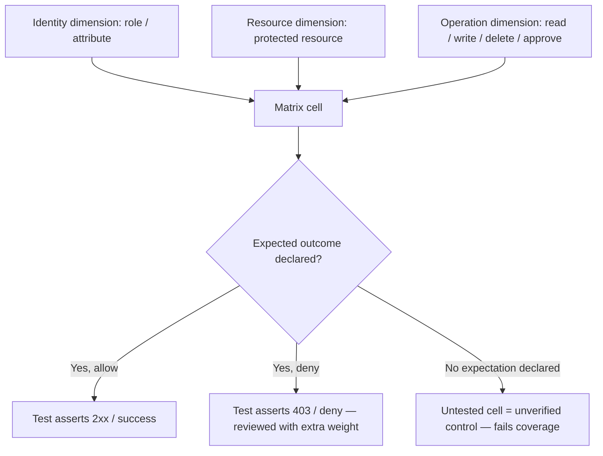

# Security Test Standard

Status: Approved | Last Reviewed: 2026-08-13 | Owner: @qe-lead
Catalog ID: TST-008 | Radii
Tier Applicability: T0, T1

## Problem Statement

- Authorisation is tested only on the happy path — the logged-in user hits the endpoint they
  are supposed to be able to hit — so a privilege-escalation path (the same endpoint hit by a
  user who should be denied) goes undetected until it is found in production or by an
  attacker.
- Token expiry and revocation are asserted by reading the configuration that declares them
  (`exp` claim TTL, a revocation-list entry) rather than by testing the actual runtime
  behaviour — a config value proves intent, not that the resource server actually rejects the
  token once it should.
- Masking is verified in the UI — the field shows `****1234` on screen — but never checked in
  logs, distributed traces, error payloads, or webhook bodies, which is exactly where the raw
  value most often survives unmasked.
- DAST is run against an environment with security controls disabled — WAF off, rate limiting
  off, "to make the scan finish faster" — so the scan finds nothing wrong and the environment
  proves nothing about the controls that will actually be running in production.
- Secrets and certificate rotation is tested at idle, with no traffic in flight, so the one
  failure mode that actually matters — an in-flight request holding a credential that gets
  rotated out from under it mid-call — is never exercised.

## Scope and Boundary

This standard covers **verification that declared controls behave as declared**: does
authorisation actually deny the cells it is supposed to deny, does a token actually stop working
at the moment it should, is sensitive data actually absent from every egress path, does a
rotation actually complete with zero attributable failures. Every obligation in this document is
a regression check against a control whose design already exists — QE is confirming the control
does what it says, not designing the control and not trying to find a way past it that nobody
anticipated.

This standard explicitly does **not** cover penetration testing engagements, red-team exercises,
or vulnerability research. Those are adversarial, creative-exploration activities — probing for
unknown weaknesses, not confirming known behaviour — and they are owned by InfoSec under their
own process, cadence, and rules of engagement. This boundary is not a formality: it keeps QE's
obligation testable (a declared-behaviour check has a pass/fail answer; an open-ended search for
unknown weaknesses does not) and it avoids the document implying that quality engineering
performs offensive security work, which it does not.

## Authorisation Matrix Method

The core technique: enumerate the cross-product of identity (role or attribute) × resource ×
operation, and assert the expected allow or deny for every cell in that cross-product — not a
sample of cells, all of them.

- **Cell-count formula.** `cells = |distinct roles or attribute combinations| × |protected
  resources| × |operations per resource|`. A service with 4 roles, 6 protected resources, and
  an average of 3 operations per resource has 72 cells; each one needs an explicit expected
  outcome, not an inferred one.
- **An untested cell is an unverified control.** If the matrix has 72 cells and the test suite
  exercises 40 of them, the other 32 are not "probably fine" — they are unverified, and an
  authorisation bug hiding in one of them is indistinguishable, from the test evidence alone,
  from a bug that does not exist.
- **Deny cases matter more than allow cases.** A false allow — a cell that should deny access
  but grants it — is a security incident waiting to be discovered by whoever finds it first. A
  false deny — a cell that should allow access but denies it — is a functional bug that a real
  user will report within a day. The matrix is written and reviewed with that asymmetry in
  mind: every deny cell gets an explicit test, not an assumption that "everything not
  explicitly allowed is denied by default" is actually enforced in code.

Cross-link: [SEC-010 Attribute-Based Access Control](../../patterns/security/attribute-based-access-control.md)
owns the policy-evaluation mechanism (PDP/PEP, Rego/Cedar policy authoring); this section owns
the obligation that every cell the policy could evaluate is actually exercised by a test.

## Token Lifecycle Cases

Every service that issues, accepts, or validates a bearer token runs this exact case list. The
case identifiers are normative — a security overlay references these names, not a paraphrase of
them.

| Case | Scenario | Expected result |
|---|---|---|
| `valid-accepted` | A correctly issued, unexpired token with matching audience and issuer, valid signature, not revoked. | Request is accepted. |
| `expired-rejected` | Token's `exp` claim is in the past. | Request is rejected — the rejection is observed at the resource server, not inferred from the `exp` value. |
| `wrong-audience-rejected` | Token's `aud` claim names a different service than the one receiving the request. | Request is rejected. |
| `wrong-issuer-rejected` | Token's `iss` claim does not match the resource server's configured trusted issuer. | Request is rejected. |
| `tampered-signature-rejected` | Any byte of the token's payload or signature is altered after issuance. | Request is rejected — including the specific case of an `alg` field changed to `none`. |
| `revoked-before-expiry-rejected` | Token is explicitly revoked (logout, admin action, compromise response) while its `exp` claim is still in the future. | Request is rejected from the moment of revocation, not merely at natural expiry. |
| `refresh-rotation-invalidates-prior-refresh` | A refresh token is used to obtain a new access/refresh pair. | The prior refresh token no longer works — a second attempt to use it is rejected, proving rotation actually invalidates the old token rather than just issuing a new one alongside it. |
| `cross-client-replay-rejected` | A token bound to one client (via `cnf`/DPoP, mTLS-bound token, or a BFF-issued session cookie scoped to one client) is replayed by a different client. | Request is rejected — the binding is enforced, not merely recorded. |

Each case is exercised against the running resource server or authorization server, not asserted
by inspecting a JWT library's unit tests — the point of the case list is proof that *this
deployment's* validation path enforces it. Cross-link
[SEC-006 JWT Best Practices](../../patterns/security/jwt-best-practices.md),
[SEC-011 Session Revocation](../../patterns/security/session-revocation.md), and
[SEC-005 BFF + Token-Binding](../../patterns/security/bff-token-binding.md).

## Egress Assertion for Sensitive Data

The rule: masking must be asserted on every egress path a sensitive value can travel, not just
the primary API response a UI happens to render. The declared egress paths are: application
logs, distributed traces, metrics labels, error payloads (including stack traces), webhook
bodies, batch exports, and support/admin tooling views.

This is where masking most often fails, because each of these paths is typically built on a
different serialisation path than the primary response:

- A structured logging call that serialises an entire request or response object directly,
  bypassing the masking interceptor wired into the API response pipeline.
- A stack trace embedded in an error payload that includes the raw exception message, and the
  exception message happens to contain the unmasked value that triggered the exception.
- A webhook payload built from the same DTO as the API response, but assembled by code that
  calls the DTO's raw getters directly instead of going through the same masking layer.
- A support or admin tool that queries the database directly rather than going through the
  API, and therefore never passes through the masking layer at all.

A masking control that is proven correct on the primary response and untested on these paths has
not been proven correct — it has been proven correct on the one path least likely to leak.

## DAST Placement and Preconditions

Automated dynamic scanning runs against the last pre-production-like environment in the
pipeline, as an automated gate, not as a manual, occasional activity run from an engineer's
laptop against whatever happens to be reachable.

**Precondition:** every control active in production — WAF rules, rate limiting, TLS
configuration, authentication — must also be active in the environment being scanned. A scan
run against an environment with controls disabled to "let the scan finish" produces a report
that is worthless: it certifies the absence of vulnerabilities in a system that is not the
system being shipped.

**Requirement:** every finding is triaged — severity, exploitability, and reachability from an
externally reachable entry point — before it is counted. A raw finding count used as a KPI
creates an incentive to reduce scanner sensitivity rather than fix real issues; the obligation
this standard imposes is that findings are worked through triage to a disposition (fixed,
accepted with named approval, or false positive with a documented reason), not that the count
trends toward zero by any means available.

## Rotation Under Load

Secret and certificate rotation must be exercised with traffic in flight — a synthetic load
generator kept running through the entire rotation window, not paused before rotation starts
and resumed after it completes. The specific failure mode under test is a request that acquired
a credential just before rotation and is still in flight when the credential is invalidated.

**Assertion:** zero requests fail *attributable to the rotation*. A background failure rate from
unrelated causes during the same window is not evidence of a rotation defect; a spike in
failures that starts at the moment rotation begins and stops at the moment it completes is.

Cross-link: [SEC-007 Secrets Rotation](../../patterns/security/secrets-rotation.md) owns the
rotation mechanism (dual-secret overlap window, cert renewal automation);
[TST-036](../archetypes/zero-downtime-deploy-rotation.md) owns the archetype that exercises this
obligation end-to-end alongside zero-downtime deploy and traffic-shift assertions.

## Compliance Mapping

| Layer | Reference | Section/Control | How this satisfies |
|---|---|---|---|
| Ring 0 | OWASP ASVS | V3 (Session Management), V4 (Access Control) | [Authorisation Matrix Method](#authorisation-matrix-method) and [Token Lifecycle Cases](#token-lifecycle-cases) operationalise ASVS's session and access-control verification levels as an exhaustive, cell-counted obligation rather than a sampled spot-check. |
| Ring 0 | OWASP WSTG | Testing for Authorization; Testing for Session Management | [DAST Placement and Preconditions](#dast-placement-and-preconditions) is the automated-scan half of WSTG's methodology; the authorisation matrix is the manual-technique half made systematic. |
| Ring 0 | NIST SP 800-53 | CA-8 (Penetration Testing — scope boundary only, not performed here); AC-3 (Access Enforcement) | [Scope and Boundary](#scope-and-boundary) draws the line CA-8 assumes between control-verification testing (this standard) and penetration testing (InfoSec's separate process); AC-3 is the control the authorisation matrix verifies is enforced, not merely configured. |
| Ring 1 | [PCI-DSS 4.0](../../compliance/pci-dss-4-0.md) — §6.4, §11.3, §11.4 | Pre-production security testing; penetration testing (referred to InfoSec); vulnerability scanning | §6.4's pre-production testing obligation is satisfied by the authorisation matrix and token-lifecycle cases run in this standard; §11.3's penetration-testing obligation is explicitly outside this standard's scope per [Scope and Boundary](#scope-and-boundary) and is InfoSec's responsibility; §11.4's scanning obligation is the DAST gate. |
| Ring 1 | [SWIFT CSP v2024](../../compliance/swift-csp-2024.md) — Control 2.x | Credential and secret lifecycle management | [Rotation Under Load](#rotation-under-load) is the evidence that Control 2.x's rotation requirement is met without a service disruption, not merely configured on a schedule. |
| Ring 2 | [Decree 13/2023](../../compliance/decree-13-2023-personal-data.md) and SBV Circular 09/2020/TT-NHNN — §IV.3 ⚠️ (working summary — pending Legal review) | Personal data protection in transit and at rest; IT security testing obligations | [Egress Assertion for Sensitive Data](#egress-assertion-for-sensitive-data) is the evidence that personal data is not exposed through a secondary channel Decree 13/2023 was written to prevent; the authorisation matrix and DAST gate are the IT-security testing artifact for an SBV review. |

## Related

- [TST-001 Test Strategy Standard](./test-strategy-standard.md)
- Co-owned with `@infosec-architect` — QE owns the verification test obligations in this
  standard (authorisation matrix, token lifecycle, egress masking, DAST gate placement,
  rotation-under-load); InfoSec owns the threat model, control design, and every activity
  named in [Scope and Boundary](#scope-and-boundary) as out of scope for this document.
- [TST-036 Zero-Downtime Deploy, Traffic Shift & Rotation](../archetypes/zero-downtime-deploy-rotation.md)
- [TST-040 AuthN/AuthZ Matrix & Token Lifecycle](../archetypes/authn-authz-token-lifecycle.md)
- [TST-041 Data Protection, Masking & Tokenisation](../archetypes/data-protection-masking-tokenisation.md)
- [SEC-010 Attribute-Based Access Control](../../patterns/security/attribute-based-access-control.md)
- [SEC-006 JWT Best Practices](../../patterns/security/jwt-best-practices.md)
- [SEC-011 Session Revocation](../../patterns/security/session-revocation.md)
- [SEC-005 BFF + Token-Binding](../../patterns/security/bff-token-binding.md)
- [SEC-007 Secrets Rotation](../../patterns/security/secrets-rotation.md)
