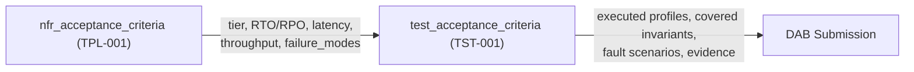

# Test Strategy Standard

Status: Approved | Last Reviewed: 2026-08-12 | Owner: @qe-lead
Catalog ID: TST-001 | **Spine**
Tier Applicability: N/A (defines test obligations)

## Problem Statement

- Every squad invents its own test approach per pattern, so two teams implementing the same
  archetype produce results that are not comparable.
- Declared NFR numbers — latency, throughput, RTO/RPO — carry no evidence standard, so a DAB
  can declare a target with nothing proving it was met.
- Soak, spike, and mixed-workload testing are named in conversation but nowhere defined, so
  duration, load shape, and pass criteria vary by engineer.
- Declared `failure_modes` in the `nfr_acceptance_criteria` block carry no corresponding
  resilience test obligation, so a service can declare a failure mode and never exercise it.
- Performance tooling is fragmented with no selection rule, and open and closed workload
  models are silently mixed, so results are not reproducible across squads.
- QE has no way to answer "which patterns are untested?" because no coverage record exists.

## Context

Reach for this document whenever:

- Authoring the test section of a DAB submission.
- Onboarding a squad to the QE team's testing standards.
- Planning a release regression cycle and deciding what must run.
- Investigating an escaped defect, to find which archetype should have caught it.

## The Six Disciplines

Every catalog row is verified — or explicitly exempted — against six disciplines. The `Key`
column values are normative and machine-validated by `scripts/validate-testing-coverage.py`:

| Discipline | Key | Verifies | Owning standard |
|---|---|---|---|
| Functional | `functional` | Behaviour matches specification | TST-001 |
| Performance | `performance` | Behaviour holds at declared load | TST-002 |
| Resilience | `resilience` | Behaviour degrades safely under fault | TST-006 |
| Contract | `contract` | Producer and consumer stay compatible | TST-007 |
| Security | `security` | Controls cannot be bypassed | TST-008 |
| Data quality | `data_quality` | Data is accurate, complete, and timely | TST-009 |

## Obligation Levels

Every discipline, for every catalog row, carries exactly one of four obligation levels. These
four strings are normative and machine-validated:

- `required` — a tier gate; a release blocks without evidence for it.
- `recommended` — expected; a documented waiver is permitted.
- `n/a` — the discipline does not apply to this pattern's shape.
- `governs` — the row is a meta-document that constrains testing rather than being tested
  itself. This covers the 5 `NFR-*`, 13 `PRIN-*`, 5 `TPL-*`, and 8 `COMP-*` rows, plus
  `BP-009`, `BP-010`, `BP-011`, `PLT-002`, `PLT-004`, and `PLT-007`.

`n/a` and "not yet covered" are different states, and the coverage gate distinguishes them: an
`n/a` discipline is a deliberate, recorded decision; an uncovered row is a gap the gate fails
on.

## Tier Obligation Matrix

Which disciplines are `required` per tier, referencing [NFR-001](../../nfr/service-tiering-rto-rpo.md)
for the tier definitions themselves. This standard does not restate RTO, RPO, or availability
values — those live only in NFR-001.

| Tier | Functional | Performance | Resilience | Contract | Security | Data quality |
|---|---|---|---|---|---|---|
| T0 | `required` | `required` | `required` | `required` | `required` | `required` |
| T1 | `required` | `required` | `required` | `required` | `required`¹ | `required`¹ |
| T2 | `required` | `recommended` | `recommended` | `required` | `recommended` | `recommended` |
| T3 | `required` | `recommended` | `recommended` | `recommended` | `recommended` | `recommended` |

¹ Required when the pattern handles credentials or regulated data; `recommended` otherwise.

- **T0** — all six disciplines required.
- **T1** — functional, performance, resilience, and contract required; security and data
  quality required where the pattern handles credentials or regulated data.
- **T2** — functional and contract required; performance recommended.
- **T3** — functional required; the rest recommended.

## The Four Oracles

An oracle is where the expected result for a functional test comes from. Every archetype
declares exactly one primary oracle:

| Oracle | Definition | Use for |
|---|---|---|
| `golden-dataset` | An exact expected value from a signed-off dataset | Calculation engines |
| `invariant-assertion` | A property that must hold over any input | Ledgers, ordering, idempotency |
| `confusion-matrix` | Precision, recall, and false-positive rate against a labelled corpus | Screening and decisioning |
| `contract-schema` | Conformance to a published schema or contract | Messaging and APIs |

## The `test_acceptance_criteria` Contract

Every service in scope of a DAB submission that has an `nfr_acceptance_criteria` block (see
[TPL-001](../../templates/nfr-acceptance-criteria-dab.md)) has a companion
`test_acceptance_criteria` block. The values below are illustrative for a payment-authorisation
service — every number is an example, not a normative threshold.

```yaml
test_acceptance_criteria:
  service_name: payment-auth-service
  tier: T0                                   # must equal nfr_acceptance_criteria.tier
  catalog_refs: [BSP-002, RES-002, INT-001]
  archetypes: [TST-020, TST-031, TST-035]
  slo_source: [NFR-001, NFR-002, NFR-004]    # thresholds derived, never restated

  functional:
    invariants_covered: 12
    negative_paths_covered: 8
    oracle: golden-dataset                   # golden-dataset | invariant-assertion |
                                             # confusion-matrix | contract-schema
  performance:
    profiles_executed: [baseline, load, stress, spike, soak, mixed, failover-under-load]
    sustained_rps: 5000                      # must equal nfr_acceptance_criteria value
    peak_rps: 15000                          # must equal nfr_acceptance_criteria value
    workload_model: closed                   # closed | open — see TST-003
    blend_ref: journey-blend-payments-peak
  resilience:
    fault_scenarios: [FM1, FM2]              # must reference declared failure_modes IDs
  contract: {consumer_contracts_verified: 4, schema_compat_mode: BACKWARD}
  security: {authz_matrix_cells_covered: 36, token_lifecycle_cases: 7}
  data_quality: {dq_rules_asserted: 18, reconciliation_tolerance: '0.00'}

  evidence:
    report_path: <perf-report-artifact>
    executed_on: '2026-08-12'
    environment: perf-prod-like
    signed_off_by: '@qe-lead'
```

### Field reference

| Field | Type | Required | Source |
|---|---|---|---|
| `service_name` | string | Yes | The service's own identity; must match `nfr_acceptance_criteria.service_name` |
| `tier` | enum: `T0`\|`T1`\|`T2`\|`T3` | Yes | Must equal `nfr_acceptance_criteria.tier` — see Cross-Block Invariants |
| `catalog_refs` | list of catalog IDs | Yes | The patterns this service implements |
| `archetypes` | list of `TST-0NN` IDs | Yes | From `coverage/coverage-matrix.md` for the listed `catalog_refs` |
| `slo_source` | list of `NFR-*` IDs | Yes | The spine rows supplying every threshold referenced below |
| `functional.invariants_covered` | integer | Yes | Count of invariants asserted, from the archetype's Functional Test Design |
| `functional.negative_paths_covered` | integer | Yes | Count of negative paths asserted, from the same section |
| `functional.oracle` | enum, one of the Four Oracles | Yes | The archetype's declared primary oracle |
| `performance.profiles_executed` | list of TST-002 profile names | Required when performance ≠ `n/a` | [TST-002](./performance-test-standard.md) |
| `performance.sustained_rps` | integer | Required when performance ≠ `n/a` | Must equal `nfr_acceptance_criteria.throughput_target.sustained_rps` |
| `performance.peak_rps` | integer | Required when performance ≠ `n/a` | Must equal `nfr_acceptance_criteria.throughput_target.peak_rps` |
| `performance.workload_model` | enum: `open`\|`closed` | Required when performance ≠ `n/a` | [TST-003](./workload-modelling.md) |
| `performance.blend_ref` | string | Required when the `mixed` profile is executed | Named journey blend owned by TST-034 |
| `resilience.fault_scenarios` | list of `FM*` IDs | Required when resilience ≠ `n/a` | Must reference `nfr_acceptance_criteria.failure_modes[].id` |
| `contract.consumer_contracts_verified` | integer | Required when contract ≠ `n/a` | Pact or equivalent contract count |
| `contract.schema_compat_mode` | string | Required when contract ≠ `n/a` | Schema registry compatibility mode, per [TST-007](./contract-integration-test-standard.md) |
| `security.authz_matrix_cells_covered` | integer | Required when security ≠ `n/a` | Per [TST-008](./security-test-standard.md) |
| `security.token_lifecycle_cases` | integer | Required when security ≠ `n/a` | Per [TST-008](./security-test-standard.md) |
| `data_quality.dq_rules_asserted` | integer | Required when data quality ≠ `n/a` | Per [TST-009](./data-quality-test-standard.md) |
| `data_quality.reconciliation_tolerance` | decimal string | Required when data quality ≠ `n/a` | Per [TST-009](./data-quality-test-standard.md) |
| `evidence.report_path` | string (artefact path) | Yes | The performance/test report attached to the DAB submission |
| `evidence.executed_on` | date (`YYYY-MM-DD`) | Yes | When the referenced evidence was produced |
| `evidence.environment` | string | Yes | Per [TST-005](./environments-quality-gates.md) |
| `evidence.signed_off_by` | string (`@handle`) | Yes | The accountable reviewer |

## Cross-Block Invariants

Three checkable rules link `test_acceptance_criteria` back to `nfr_acceptance_criteria` for the
same service:

1. `test_acceptance_criteria.tier` equals `nfr_acceptance_criteria.tier` for the same service.
2. Every ID in `resilience.fault_scenarios` appears in that service's
   `nfr_acceptance_criteria.failure_modes[].id`. A declared failure mode with no test is a gap.
3. `performance.sustained_rps` and `performance.peak_rps` equal the declared
   `nfr_acceptance_criteria.throughput_target` values. A service may not load-test below what
   it promised.

These are documented obligations, **not** CI-enforced. Enforcing them over `dab/` content is a
DAB-process change and is explicitly out of scope for this corpus — see the design spec's §2.

## Relationship to TPL-001

`nfr_acceptance_criteria` ([TPL-001](../../templates/nfr-acceptance-criteria-dab.md)) is the
declaration: it supplies tier, RTO/RPO, latency, throughput, and failure modes. This
`test_acceptance_criteria` block references those declared values and adds what was actually
executed — the profiles run, the invariants covered, the fault scenarios exercised, and the
evidence produced. One declares; the other proves.



## Shift-Left Placement

Unit and contract tests run in the merge pipeline, on every commit. The `baseline` performance
profile runs as a pipeline gate. `load`, `stress`, `spike`, and `scalability` run on a scheduled
performance pipeline, not on every merge. `soak` and `mixed` run pre-release.
`failover-under-load` runs as part of the release readiness drill, alongside the DR exercise
cadence set by NFR-001. See [TST-005](./environments-quality-gates.md) for environment tiers and
gate placement, and [BP-001](../../best-practices/ci-cd-pipeline-design.md) for the pipeline
design this schedule slots into.

## Compliance Mapping

| Layer | Reference | Section/Control | How this satisfies |
|---|---|---|---|
| Ring 0 | ISTQB Foundation Level Syllabus | Test levels and test types (canonical taxonomy) | The Six Disciplines and their obligation levels map directly onto the ISTQB test-type taxonomy |
| Ring 0 | NIST SP 800-53 | CA-2 (Control Assessment) | The `test_acceptance_criteria` contract is the assessment record for each declared control |
| Ring 1 | Basel BCBS 230 — Principle 9 | Operational resilience testing, including severe-but-plausible scenarios | The Resilience discipline and its `failover-under-load` obligation exercise declared failure modes under load |
| Ring 1 | Basel BCBS 239 — Principle 3 | Accuracy | The Data Quality discipline's reconciliation obligation is the accuracy control |
| Ring 2 | SBV Circular 09/2020/TT-NHNN — §IV.3 ⚠️ (working summary — pending Legal review) | System testing and BCP drill obligations | The `failover-under-load` profile and the release readiness drill satisfy the system-testing and BCP-drill expectation |

## Related

- [TST-002 Performance Test Standard](./performance-test-standard.md)
- [TST-003 Workload Modelling](./workload-modelling.md)
- [TST-004 Test Data Management](./test-data-management.md)
- [TST-005 Test Environments and Quality Gates](./environments-quality-gates.md)
- [TST-006 Resilience Test Standard](./resilience-test-standard.md)
- [TST-007 Contract and Integration Test Standard](./contract-integration-test-standard.md)
- [TST-008 Security Test Standard](./security-test-standard.md)
- [TST-009 Data Quality Test Standard](./data-quality-test-standard.md)
- [TST-010 Tool Selection Matrix](../tooling/tool-selection-matrix.md)
- [TPL-005 Test Archetype Document Template](../../templates/test-archetype-template.md)
- [NFR-001 Service Tiering + RTO/RPO Matrix](../../nfr/service-tiering-rto-rpo.md)
- [NFR-002 Latency Budget Model](../../nfr/latency-budget-model.md)
- [NFR-003 Capacity Planning Model](../../nfr/capacity-planning-model.md)
- [NFR-004 Throughput Model](../../nfr/throughput-model.md)
- [NFR-005 Error Budget Policy](../../nfr/error-budget-policy.md)
