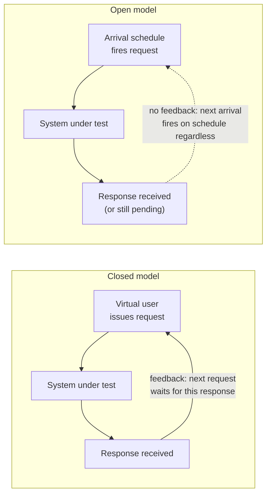

# Workload Modelling

Status: Approved | Last Reviewed: 2026-08-13 | Owner: @qe-lead
Catalog ID: TST-003 | Radii
Tier Applicability: T0, T1, T2

## Problem Statement

- Thread counts are guessed rather than derived from a stated business volumetric, so a load
  test's concurrency setting has no defensible basis and cannot be reconstructed by a reviewer.
- Open and closed workload models are mixed silently within and across squads, so breakpoint
  results from a `stress` run are not comparable to another team's, or even to the same
  service's own previous run.
- Peak factors are chosen ad hoc, so a declared `peak_rps` cannot be traced back to a stated
  business event and is effectively unjustified.
- Think time is omitted to save setup effort, which turns a realistic customer-journey profile
  into an unrealistic hammer that no real population of users could ever produce.
- Journey blends for the `mixed` profile are undefined, so two squads running "the `mixed`
  profile" against comparable services exercise different journey mixes and cannot compare
  results.

## Deriving Concurrency Volumetrics

Concurrency is a derived quantity, never a chosen one. It follows directly from Little's Law:

```text
concurrency = arrival_rate × residence_time
```

- `arrival_rate` (λ) — the rate at which new requests enter the system, in requests per unit
  time.
- `residence_time` — the mean time a request spends in the system, from arrival to response,
  including all queueing.
- `concurrency` (L) — the mean number of requests in the system at any instant: the population
  of in-flight work a generator must sustain to produce that arrival rate at that residence
  time.

### Worked example (illustrative only)

The numbers below exist only to demonstrate the mechanics of the law. They are not a declared
throughput target for any real service — a real arrival rate always comes from that service's
own stated business volumetric, and a real residence time always comes from that service's own
row in [NFR-002](../../nfr/latency-budget-model.md). Copying these illustrative numbers into a
`test_acceptance_criteria` block is a defect, not a shortcut.

1. **Business volumetric.** A synthetic example service is expected to receive a sustained
   arrival rate of 40 requests per second during normal operation. This number is stated by the
   business, not derived — it describes demand, not capacity.
2. **Residence time.** The service is tiered T1. [NFR-002](../../nfr/latency-budget-model.md)'s
   T1 account-services row states a P95 end-to-end budget of 500 ms. Using the P95 row, not the
   mean, as the residence-time input is deliberate: it sizes the generator for the tail the
   service is contractually allowed to run at, rather than a friendlier average that
   under-counts in-flight work.
3. **Resulting concurrency.** `concurrency = 40 req/s × 0.5 s = 20`. At any instant, 20 requests
   are expected to be in flight if the service is running at its declared arrival rate and its
   full P95 latency budget.
4. **Resulting generator setting.** An open-model generator is configured to fire arrivals at
   40 req/s — constant, Poisson, or stepped, depending on the profile; see
   [Think Time, Pacing, and Arrival Distribution](#think-time-pacing-and-arrival-distribution) —
   and is expected to observe roughly 20 requests in flight as an *output*, not an input. A
   closed-model generator, by contrast, would be configured with a *fixed* population of 20
   virtual users as its *input* — which looks like the same number, but is not the same claim.
   See [Open Versus Closed Workload Models](#open-versus-closed-workload-models) for why that
   equivalence holds at only one load level and breaks down everywhere else.

**Rule:** concurrency is always the output of this calculation, never a number picked because it
"feels realistic" or because it matches a load generator's default thread-pool size. A test plan
that states a thread count without showing the arrival rate and residence time it was derived
from is rejected in review.

## Open Versus Closed Workload Models

This is the single most consequential decision in any performance test's configuration, because
it determines whether the test's headline result means anything at all.

### Closed model

A closed model runs a **fixed population** of virtual users. Each virtual user waits for a
response to its current request before issuing its next one, optionally after a think-time
pause. The population size is a hard ceiling on offered load: no matter how slow the system
under test becomes, no more than `N` requests can ever be in flight, because the `N` virtual
users are the only source of demand and every one of them is either waiting on a response or
paused. As latency rises, each virtual user completes fewer request/response cycles per minute,
so **offered load falls automatically** — the harness quietly protects the system under test
from the very overload condition the test exists to find. JMeter's standard Thread Group is a
closed model: `Number of Threads` is exactly this fixed population.

### Open model

An open model generates requests that **arrive at a specified rate**, independent of whether
prior requests have completed. If the system under test slows down, in-flight requests pile up
— in the generator's own queue, on the network, or in the system's own queues — but the arrival
rate itself does not change. Offered load stays decoupled from the system's response behaviour
and keeps rising even while the system is struggling, until the test operator deliberately
changes the arrival-rate schedule. An open model reproduces how real, independent users or
independent upstream systems actually behave: no real caller waits for everyone else's request
to finish before deciding to submit its own.

### The rule

> **`stress`, `spike`, and `scalability` MUST run under an open workload model.**
>
> A closed model throttles its own offered load as latency rises, which means the breakpoint
> (`stress`), the true burst shape (`spike`), and the per-step throughput ceiling
> (`scalability`) are never actually reached — the harness backs off before the system under
> test does. The result a closed-model run produces for these three profiles is not a smaller
> or more conservative version of the real answer; it is a **different, meaningless number**
> that happens to look like one. A `stress`, `spike`, or `scalability` run submitted with a
> closed-model generator is void and must be re-run, regardless of what result it reported.

This is why JMeter's default Thread Group — a closed model — silently produces an unusable
breakpoint result for `stress`: the Thread Group throttles itself exactly at the moment the test
is supposed to start finding the knee, so the reported "knee" is an artifact of the harness's
own back-pressure, not a property of the system under test. See
[TST-002](./performance-test-standard.md) for how this false pass shows up in evidence review.

`load`, `soak`, `baseline`, and `mixed` may run under either model, and are commonly run closed,
because their purpose is to hold a declared, bounded population at steady state — closed is a
legitimate and often simpler choice there. `failover-under-load` follows the workload model of
whichever base profile, usually `load`, it is layered on top of.

### JMeter guidance

JMeter's built-in Thread Group is closed and must not be used for `stress`, `spike`, or
`scalability`. Use the **Concurrency Thread Group** or the **Arrivals Thread Group** from the
Custom Thread Groups plugin set to obtain a true open model — the Arrivals Thread Group in
particular accepts a target arrival rate directly, matching the `arrival_rate` this document
derives above. See [TST-011](../tooling/jmeter.md) for installation and worked configuration
examples.

### Feedback path



The closed model's solid feedback edge is the throttle: it is the mechanism by which offered
load falls when the system slows down. The open model's dashed edge shows that arrivals do not
wait on it — that is the entire distinction this section exists to make precise.

## Peak Factors

Sustained load is the floor, not the ceiling. Vietnamese payments traffic carries several
recurring, foreseeable elevation events on top of sustained load, and each one drives a
different subset of the eight [TST-002](./performance-test-standard.md) profiles:

| Driver | Shape | Relative multiplier over sustained load | Profiles it feeds |
|---|---|---|---|
| Tết (Lunar New Year) | Annual, multi-day sustained elevation, not a brief spike | High — the largest annual peak factor | `soak` (multi-day hold), `scalability` |
| End-of-month payroll settlement | Sharp elevation clustered around month-end settlement windows | Moderate–high, short-lived | `spike`, `stress` |
| Payday clustering | Recurring intra-month elevation as employers cluster payroll dates | Moderate, recurring | `mixed`, `load` |
| NAPAS 247 intraday shape | Predictable intraday curve — lunch-hour and evening peaks — rather than a single event | Moderate, twice-daily | `mixed`, `baseline` |
| Promotional campaign bursts | Deterministic, scheduled burst tied to a marketing event | High, very short-lived | `spike`, `stress` |

Every multiplier above is expressed **relative to sustained load**, never as an absolute figure.
The absolute sustained and peak throughput numbers a service must actually meet always come from
[NFR-004](../../nfr/throughput-model.md)'s declared throughput targets for that service's tier —
this document does not restate them, and a service's own peak target is never derived by
multiplying this table by a number found here. This table exists to justify *which* profile a
driver belongs to and *why* its shape looks the way it does, not to supply a number.

**Rule:** a `peak_rps` (or `peak_tps`) value that cannot be traced to one of the rows above, or
to an explicitly documented business event outside this table, is unjustified and is rejected in
DAB review.

## Think Time, Pacing, and Arrival Distribution

- **Think time** — the pause a simulated user holds between receiving a response and issuing
  its next request, modelling the time a real person spends reading a screen or typing. Think
  time is what keeps a closed-model population from behaving like a tight request loop.
- **Pacing** — the deliberate control of inter-request timing to hit a target rate, whether by
  think time (closed model) or by an arrival schedule (open model).
- **Arrival distribution** — the statistical shape of when requests arrive: constant (evenly
  spaced), Poisson (random and memoryless — the standard model of independent human or system
  arrivals), deterministic burst (all arrivals compressed into a short, exact window), or
  monotonic step (a rate that increases in discrete steps and holds at each one).

### Guidance by profile

| Profile | Arrival distribution | Why |
|---|---|---|
| `load`, `soak` | Constant arrival | Steady-state proof needs a stable, reproducible rate; variance would confound the pass/fail signal these profiles grade. |
| `mixed` | Poisson | Real, independent journeys arrive independently of one another; Poisson arrivals produce the realistic queueing behaviour a blended run exists to exercise. |
| `spike` | Deterministic burst | The burst shape itself — how fast load rises and how long it holds — is the thing under test; it must be exact and repeatable, not randomised. |
| `stress`, `scalability` | Monotonic step | Each step must hold long enough to observe a stable state before the next increase, so the knee (`stress`) or the linearity boundary (`scalability`) can be attributed to a specific, known load level. |

**Zero think time** is valid only for machine-to-machine, batch, or system-to-system flows,
where no human pause exists between calls by construction — for example, a settlement batch
replaying a fixed file of transactions. Applied to a customer-journey profile, zero think time is
misleading: it produces a hammering pattern no real population of users could generate, inflates
concurrency far beyond what Little's Law would derive from the real business volumetric, and
drives the system into a failure mode a real launch would never trigger. A `mixed` or `load` run
built on customer journeys with zero think time is a defect, not a conservative choice.

## Named Journey Blends

A named journey blend is a registered, reusable mixture of individual journeys, each carrying a
fixed percentage share of the blended load. Naming follows the convention
`journey-blend-<domain>-<condition>` — `<domain>` names the business area the blend represents,
and `<condition>` names the situation the mix is built to reproduce, such as a peak event, a
steady state, or a campaign. `journey-blend-payments-peak` is the canonical example: the
payments domain's journey mix, under peak conditions.

The `mixed` profile ([TST-002](./performance-test-standard.md)) always runs a named blend from
this registry — never an ad hoc mix invented for one test run — so that two squads running "the
`mixed` profile" against comparable services are provably running the same journey composition.
[TST-034](../archetypes/blended-journey-workload.md) owns the `mixed` profile's execution and
extends this registry as new blends are needed; this document owns the naming convention and the
seed rows below.

| Blend ID | Constituent journeys | Percentage mix | Reference architecture | Tier supplying the budget |
|---|---|---|---|---|
| `journey-blend-payments-peak` | NAPAS instant transfer, balance enquiry, statement fetch, standing-order execution | 55 / 25 / 12 / 8 | [REF-002 Real-Time Payments — NAPAS](../../reference-architectures/real-time-payments-napas.md) | T0 |
| `journey-blend-cards-authorisation` | Frictionless authorisation, step-up / 3DS challenge, risk-engine decline path, tokenised recurring charge | 60 / 25 / 10 / 5 | [REF-004 Card Authorization (3DS2)](../../reference-architectures/card-authorization-3ds2.md) | T0 |
| `journey-blend-onboarding-campaign` | Document capture and liveness check, KYC/AML decision, sanctions/PEP screening, account provisioning | 45 / 30 / 15 / 10 | [REF-003 KYC / AML Onboarding](../../reference-architectures/kyc-aml-onboarding.md) | T1 |

Each row's percentage mix sums to 100. The tier column states which
[NFR-002](../../nfr/latency-budget-model.md) tier row supplies that blend's per-journey pass
criteria — `mixed` always grades every journey against its own tier row, never against a single
blended budget (see [TST-002](./performance-test-standard.md)).

## Generator Sizing and Fidelity

The load generator itself must not become the bottleneck a test is trying to measure — a
plateau caused by generator exhaustion is easily mistaken for a system-under-test ceiling.

- **Confirm the generator is not the bottleneck.** Before attributing a plateau or a knee to the
  system under test, confirm the generator still has CPU and network headroom. A generator
  pinned at 100% CPU is measuring its own limit, not the target's.
- **Per-VU cost differs materially across tools.** JMeter's thread-per-VU model carries
  substantially more per-VU memory and CPU overhead than Gatling's or k6's event-loop model; the
  same virtual-user count can saturate one tool's host while leaving another comfortably under
  headroom. See [TST-010](../tooling/tool-selection-matrix.md) for the comparative capability
  matrix across all four tools.
- **Distributed generation is required past a single host's headroom.** Once the required
  concurrency or arrival rate would push a single generator host past a safe utilisation level,
  load must be distributed across multiple generator hosts rather than pushed further on one.

**Rule:** a `scalability` result is void if the load generator's own CPU or network utilisation
exceeded its documented ceiling at any point during the run — the observed throughput plateau in
that case is generator exhaustion, not a scalability boundary, and does not count as evidence.

## Compliance Mapping

| Layer | Reference | Section/Control | How this satisfies |
|---|---|---|---|
| Ring 0 | Little's Law / queueing theory | Concurrency as a derived quantity from arrival rate and residence time | [Deriving Concurrency Volumetrics](#deriving-concurrency-volumetrics) makes concurrency a provable output instead of a guessed input. |
| Ring 0 | Google SRE Workbook | Chapter 5 — load and stress testing | The open/closed distinction and the arrival-distribution guidance operationalise the Workbook's load-generation guidance into a normative, checkable rule. |
| Ring 1 | [Basel BCBS 230](../../compliance/basel-bcbs-230.md) — Principle 9 | Severe-but-plausible scenario definition | The [Peak Factors](#peak-factors) table supplies the scenario inputs — Tết, payroll settlement, promotional bursts — that Principle 9 requires be plausible and traceable, not invented per test run. |
| Ring 2 | SBV Circular 09/2020/TT-NHNN — §IV.3 ⚠️ (working summary — pending Legal review) | Operational continuity under peak load | The named journey blends and peak-factor drivers give the operational-continuity obligation a reproducible, registered load shape instead of an ad hoc one. |

## Related

- [TST-002 Performance Test Standard](./performance-test-standard.md)
- [TST-005 Test Environments and Quality Gates](./environments-quality-gates.md)
- [TST-011 JMeter Guide](../tooling/jmeter.md)
- [TST-034 Blended Journey Workload](../archetypes/blended-journey-workload.md)
- [NFR-003 Capacity Planning Model](../../nfr/capacity-planning-model.md)
- [NFR-004 Throughput Model](../../nfr/throughput-model.md)
