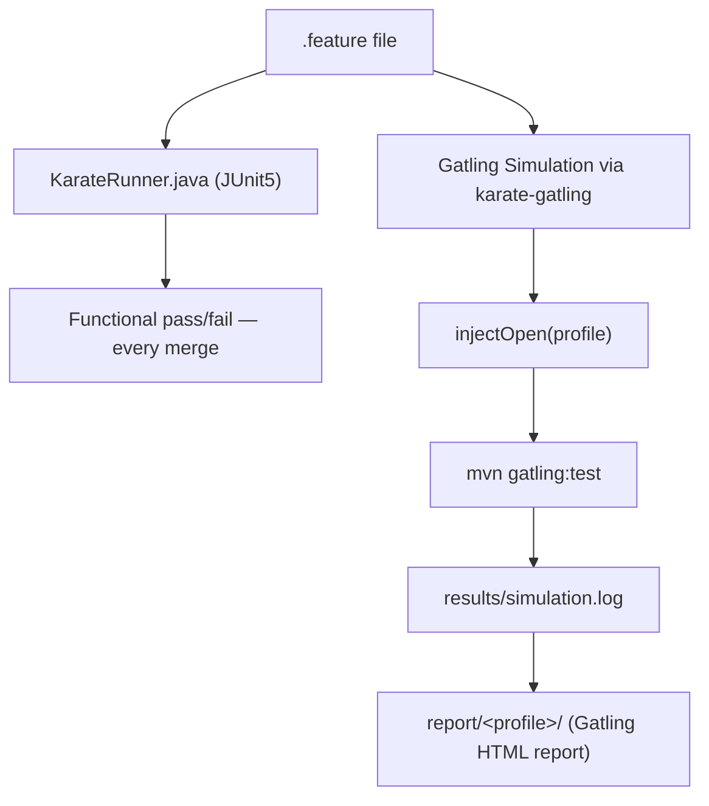

# Gatling + Karate Guide

Status: Approved | Last Reviewed: 2026-08-13 | Owner: @qe-lead
Catalog ID: TST-012 | Radii
Tier Applicability: T0, T1, T2

## Problem Statement

- Teams maintain two separate artifacts — a Karate `.feature` file for functional coverage and
  a hand-rolled Gatling Scala simulation for performance coverage — for the same API endpoint,
  so functional and performance testing drift out of sync the moment either one changes and
  nobody remembers to update the other.
- Gatling's own injection DSL supports both open-model and closed-model steps in the same API,
  so a Scala simulation reads as "correct" at every level, compiles cleanly, and runs without
  error — only a workload-modelling review under [TST-003](../strategy/workload-modelling.md)
  catches that whoever wrote it reached for the closed-model step out of muscle memory carried
  over from a JMeter background.
- The Scala DSL is compiled, not interpreted, so a simulation with a type error or a missing
  import passes code review as plausible-looking Scala text and only fails the moment CI
  actually invokes `gatling:test` inside a booked performance window — the failure surfaces at
  the worst possible time, not at authoring time.
- Karate's own `.feature` file already carries a functional pass/fail contract (`Then status
  200`, `match`) that has nothing to do with a performance profile's pass criteria; a Gatling
  HTML report's headline "Global" percentile row gets treated as the `mixed`-profile verdict
  when [TST-002](../strategy/performance-test-standard.md) requires each named journey graded
  independently.
- Because both tools run inside the same JVM process and share threads across many concurrently
  executing virtual users, any mutable state a `.feature` file's `Background` — or worse, a
  shared Scala object — holds leaks across virtual users under load in a way that never shows
  up when the same feature runs functionally, one scenario at a time.

## When to Use This Tool

Per [TST-010](./tool-selection-matrix.md)'s decision tree, Gatling + Karate is selected at the
tree's third branch: when the scenario does not need a JMeter-only protocol (JMS, ISO 8583, or
JDBC-heavy) and a Karate functional suite for the target API already exists. This guide does not
restate that tree; see [TST-010 § Decision Tree](./tool-selection-matrix.md#decision-tree) for
the full branch logic and [TST-010 § Position Each Tool](./tool-selection-matrix.md#position-each-tool)
for why this pairing is rated "Secondary, highest-leverage."

The practical trigger worth calling out here, because it is easy to miss in a one-line tree
node, is what "already exists" means. It means a *contract-tested* Karate suite per
[TST-007](../strategy/contract-integration-test-standard.md), not a throwaway exploratory
`.feature` file someone wrote once. A feature file that has never been wired into TST-007's
consumer-driven contract flow is still technically reusable via `karate-gatling`, but reusing it
buys none of this guide's core value proposition — there is no already-verified functional
artifact behind it, so the team is really authoring a fresh performance script that happens to
be written in Gherkin instead of Scala.

Every later archetype's §5 "Canonical Harness" section specialises JMeter's conventions by
default; where an archetype names `gatling-karate` as its primary or preferred tool in its §6
Tool Fit table (see [TPL-005](../../templates/test-archetype-template.md)), this guide's
conventions govern instead.

## Version and Installation

**The core value proposition, stated first.** A Karate `.feature` file authored for functional
API testing runs unchanged as a Gatling performance scenario, via the `karate-gatling` bridge
module. The same file a QA engineer wrote to assert `POST /v1/accounts/{id}/balance` returns
`200` with a well-shaped body is, unmodified, the load-generating unit inside a Gatling
`Simulation` — Gatling simply calls it many times, concurrently, at a controlled rate, instead
of once. One artifact serves both disciplines: the functional suite that runs on every merge and
the performance scenario that runs under a named profile.
[Worked Example 1](#worked-example-1--synchronous-api-under-load) shows the identical feature
file used both ways.

- **Pinned versions, coupled, not independent.** Karate `1.4.x` (currently `1.4.1`) and Gatling
  `3.10.x` (currently `3.10.5`), with `karate-gatling` pinned to the **same version number as
  Karate itself** (`karate-gatling:1.4.1`). The bridge module's own version is what determines
  which Gatling version it was built and tested against — it is not a separately chosen Gatling
  version. Pinning Gatling and Karate independently, on the theory that "any recent version of
  each should work together," is the single most common way this stack breaks; see
  [Common Failure Modes](#common-failure-modes).
- **Install method.** Dependency-managed via the QE harness repository's Maven `pom.xml` (or the
  Gradle equivalent) — `io.gatling:gatling-maven-plugin`, `com.intuit.karate:karate-gatling`,
  and `com.intuit.karate:karate-junit5` declared with exact pinned versions in the shared parent
  POM, resolved from the corporate artifact mirror at build time. This is never installed as a
  standalone binary tarball the way JMeter is; it is a JVM library dependency of the harness
  project itself.
- **Plugin / extension set.** `karate-gatling` (mandatory bridge, see above); `karate-junit5`
  (runs the same `.feature` file as a pure functional JUnit5 test, independent of Gatling, for
  the merge-gate functional run); the community `gatling-kafka-plugin`, used in
  [Worked Example 2](#worked-example-2--asynchronous--messaging-scenario), since neither Gatling
  core nor Karate ships native Kafka support (`plugin` in
  [TST-010's capability matrix](./tool-selection-matrix.md#capability-matrix)).
- **Open model by default.** Gatling's injection API distinguishes open-model steps
  (`constantUsersPerSec`, `rampUsersPerSec`, and this harness's own heaviside-style
  `stressPeakUsers` ramp target) from closed-model steps (`constantConcurrentUsers`,
  `rampConcurrentUsers`). This harness standardises on the open model as the default for every
  profile, via a single shared helper, `injectOpen` (see
  [Parameterisation and Correlation](#parameterisation-and-correlation)) — the mirror image of
  JMeter's closed-by-default Thread Group, and the reason
  [TST-003](../strategy/workload-modelling.md) lists this pairing as a natural home for
  `stress`, `spike`, and `scalability` work without needing a plugin the way JMeter does.

## Project Layout

A QE harness repository holding Gatling + Karate artefacts follows this layout. Nothing runs in
CI from `knowledge-base/` itself — every fragment in this guide is copied into a structure like
the one below, per [TST-005](../strategy/environments-quality-gates.md):

```text
qe-harness/
├── pom.xml                        # pins Karate, Gatling, and karate-gatling together
├── src/
│   └── test/
│       ├── java/
│       │   └── KarateRunner.java  # JUnit5 entry point — functional-only invocation
│       ├── resources/
│       │   ├── features/
│       │   │   ├── contract/                # reused unchanged from the TST-007 suite
│       │   │   │   ├── balance-enquiry.feature
│       │   │   │   ├── funds-transfer.feature
│       │   │   │   └── statement-download.feature
│       │   │   └── messaging/
│       │   │       └── posting-event.feature
│       │   └── data/
│       │       └── synthetic-accounts.csv   # header: SYNTHETIC — generated, no real accounts
│       └── scala/
│           ├── support/
│           │   └── Injection.scala          # shared injectOpen(...) helper
│           └── simulations/
│               ├── BalanceEnquirySimulation.scala
│               ├── PostingEventSimulation.scala
│               └── MixedJourneyBlendSimulation.scala
├── results/                        # simulation.log, gitignored
└── report/                         # Gatling HTML report output, gitignored
```



One `.feature` file, two consumers — the mechanism behind the core value proposition stated in
[Version and Installation](#version-and-installation).

## Worked Example 1 — Synchronous API under load

A synthetic REST endpoint under the `load` profile. The functional feature file:

```gherkin
Feature: synthetic balance enquiry API (functional and performance)

Background:
  * url baseUrl
  * def accounts = read('classpath:data/synthetic-accounts.csv')
  * def accountId = accounts[__loop % accounts.length].account_id

Scenario: POST balance-enquiry returns 200 for a synthetic account
  Given path '/v1/accounts/' + accountId + '/balance'
  And request { currency: 'VND' }
  When method post
  Then status 200
  And match response.balance == '#number'
```

Run functionally, independent of Gatling, on every merge:

```bash
mvn test -Dtest=KarateRunner -Dkarate.options="classpath:features/contract/balance-enquiry.feature"
```

The same file, reused unchanged, as the Gatling performance scenario:

```scala
import io.gatling.core.Predef._
import com.intuit.karate.gatling.Predef._
import support.Injection.injectOpen

class BalanceEnquirySimulation extends Simulation {

  val protocol = karateProtocol()

  val balanceEnquiry = scenario("synchronous-api-load")
    .exec(karateFeature("classpath:features/contract/balance-enquiry.feature"))

  setUp(
    balanceEnquiry.inject(injectOpen(sys.env.getOrElse("PROFILE", "load"))).protocols(protocol)
  ).assertions(
    global.responseTime.percentile3.lt(500),
    global.successfulRequests.percent.gt(99)
  )
}
```

```bash
PROFILE=load BASE_URL=https://api-perf.internal.example \
  mvn -q gatling:test -Dgatling.simulationClass=BalanceEnquirySimulation
```

## Worked Example 2 — Asynchronous / messaging scenario

Neither Gatling core nor Karate ships native Kafka support, so the community
`gatling-kafka-plugin` supplies the Kafka DSL used here (`plugin` in
[TST-010's capability matrix](./tool-selection-matrix.md#capability-matrix)). A synthetic
ledger-posting event, produced at a controlled open-model rate:

```scala
import io.gatling.core.Predef._
import com.github.mnogu.gatling.kafka.Predef._
import support.Injection.injectOpen

class PostingEventSimulation extends Simulation {

  val kafkaProtocol = kafka
    .topic("posting-event.synthetic")
    .properties(Map("bootstrap.servers" -> sys.env.getOrElse("KAFKA_BOOTSTRAP", "kafka-perf.internal.example:9092")))

  val postingEvent = scenario("posting-event-async")
    .exec(
      kafka("send posting-event.synthetic")
        .send[String, String](null, """{"accountId":"synthetic-0001","amount":"12500"}""")
    )

  setUp(
    postingEvent.inject(injectOpen(sys.env.getOrElse("PROFILE", "load"))).protocols(kafkaProtocol)
  ).assertions(
    global.failedRequests.count.is(0)
  )
}
```

```bash
PROFILE=load KAFKA_BOOTSTRAP=kafka-perf.internal.example:9092 \
  mvn -q gatling:test -Dgatling.simulationClass=PostingEventSimulation
```

## Worked Example 3 — Reusing a Karate contract suite for the `mixed` profile

The `mixed` profile applies the named journey blend from
[TST-003](../strategy/workload-modelling.md) and, per
[TST-002](../strategy/performance-test-standard.md#mixed), grades pass/fail **per journey**,
never on the blended aggregate alone. Three feature files already in daily use as the
[TST-007](../strategy/contract-integration-test-standard.md) contract suite become the three
journeys, reused unchanged:

```scala
import io.gatling.core.Predef._
import com.intuit.karate.gatling.Predef._
import support.Injection.injectOpen

class MixedJourneyBlendSimulation extends Simulation {

  val protocol = karateProtocol()

  val balanceEnquiry = scenario("balance-enquiry")
    .exec(karateFeature("classpath:features/contract/balance-enquiry.feature"))

  val fundsTransfer = scenario("funds-transfer")
    .exec(karateFeature("classpath:features/contract/funds-transfer.feature"))

  val statementDownload = scenario("statement-download")
    .exec(karateFeature("classpath:features/contract/statement-download.feature"))

  setUp(
    balanceEnquiry.inject(injectOpen("mixed", weight = 0.60)).protocols(protocol),
    fundsTransfer.inject(injectOpen("mixed", weight = 0.30)).protocols(protocol),
    statementDownload.inject(injectOpen("mixed", weight = 0.10)).protocols(protocol)
  ).assertions(
    global.successfulRequests.percent.gt(99),
    details("balance-enquiry").responseTime.percentile3.lt(300),
    details("funds-transfer").responseTime.percentile3.lt(800),
    details("statement-download").responseTime.percentile3.lt(1500)
  )
}
```

Each `details("<scenario-name>")` assertion is the per-journey NFR-002 tier budget for that
journey, not a restatement of the blend weights. The per-journey assertion requirement from
[TST-002](../strategy/performance-test-standard.md#mixed) is satisfied by the three `details(...)`
lines, not by the single `global(...)` line — see
[Assertions and Thresholds](#assertions-and-thresholds).

## Parameterisation and Correlation

**The `injectOpen(profile)` idiom.** Every value that changes across a run — arrival rate, ramp
target, duration, hostnames, topic names — is read from an environment variable inside
`support/Injection.scala`, never hard-coded into a simulation file. This single mechanism lets
one set of `Simulation` classes serve all eight
[TST-002](../strategy/performance-test-standard.md) profiles: the simulation's structure never
changes across profiles, only the environment variables and the profile name passed to
`injectOpen` do.

| Profile | Injection step inside `injectOpen` | Open/closed |
|---|---|---|
| `baseline` | `constantUsersPerSec(1).during(60.seconds)` | open |
| `load` | `constantUsersPerSec(loadRps).during(loadDuration)` | open |
| `stress` | `rampUsersPerSec(baseRps).to(stressPeakUsers).during(stressRampDuration)` | open |
| `spike` | `rampUsersPerSec(baseRps).to(spikePeakRps).during(30.seconds)` then hold | open |
| `soak` | `constantUsersPerSec(soakRps).during(soakDuration)` | open |
| `mixed` | weighted split across scenarios, each its own `injectOpen("mixed", weight)` call | open |
| `scalability` | successive `rampUsersPerSec` steps at 25/50/75/100/125% of target | open |
| `failover-under-load` | matches the base profile's injection step, fault injected mid-run | open |

`stress`, `spike`, and `scalability` reaching for `injectOpen`'s open-model steps rather than
Gatling's closed-model `constantConcurrentUsers`/`rampConcurrentUsers` steps is what satisfies
the rule in [TST-003](../strategy/workload-modelling.md#the-rule) that those three profiles must
run under an open workload model.

**Correlation.** Because correlation logic lives inside the `.feature` file itself — Karate's
own `* def accountId = response.accountId`-style JSON-path extraction — it is automatically
identical whether the feature runs functionally (via `KarateRunner`) or under load (via
`karate-gatling`). There is no separate JSON Extractor or regular-expression extractor to keep
in sync with the feature file the way JMeter requires; the same extraction that makes the
functional scenario pass is the extraction the performance scenario uses to chain requests.

**Rule:** every `data/*.csv` file consumed by a feature carries a header comment stating
`SYNTHETIC — generated, no real accounts`, per [TST-004](../strategy/test-data-management.md).

## Assertions and Thresholds

Two assertion layers exist, and they answer different questions:

- **Karate's own scenario assertions** (`Then status 200`, `match response.balance ==
  '#number'`) run on every executed iteration, under both `KarateRunner` and Gatling, and catch
  functional correctness — a malformed response body fails the run immediately, the same way
  under load as it does under a single functional pass. They are not the performance pass/fail
  mechanism.
- **Gatling's `assertions(...)` block**, attached to `setUp(...)`, is the performance pass/fail
  mechanism. `global(...)` grades the whole simulation's blended traffic; `details("<scenario
  name>")` grades one named scenario in isolation.

For every profile except `mixed`, a `global(...)` assertion is normally sufficient, because
there is only one journey in flight. For `mixed`, the rule in
[TST-002](../strategy/performance-test-standard.md#mixed) is explicit: pass/fail is evaluated
per journey, never on the blended aggregate alone. A `global(...)` assertion alone is necessary
but not sufficient for a `mixed` run — it only proves the blend overall stayed healthy, not that
any single journey met its own NFR-002 tier budget. The `details("balance-enquiry")`,
`details("funds-transfer")`, and `details("statement-download")` lines in
[Worked Example 3](#worked-example-3--reusing-a-karate-contract-suite-for-the-mixed-profile) are
what actually satisfy TST-002's per-journey obligation. A `mixed` run graded on `global(...)`
alone is not a completed grading — it is missing the check the profile exists to perform.

## Distributed Execution

Gatling's actor-model architecture — non-blocking I/O over Netty rather than a thread per
virtual user — gives materially lower per-VU memory and CPU cost than JMeter's thread-per-VU
model, per [TST-010's capability matrix](./tool-selection-matrix.md#capability-matrix) (`low
(Netty event-loop, non-blocking)` versus JMeter's `high (thread-per-VU)`). This is the resource
efficiency that makes Gatling + Karate the right choice for high-concurrency scenarios a single
generator host can reach without needing JMeter's distributed master/worker topology at all —
the same open-model target that would force JMeter onto several worker hosts often fits on one
Gatling generator.

When a target genuinely exceeds one generator host's own network or CPU headroom, this
open-source-tier stack has no native equivalent of JMeter's `-R` master/worker flag. Two options
exist, and both must be recorded in the run's evidence package per
[TST-005](../strategy/environments-quality-gates.md#evidence-and-retention):

- **Gatling Enterprise / FrontLine (commercial).** Coordinates distributed runs and result
  aggregation automatically. This is the plugin already flagged as commercial in
  [TST-010's Licensing Support Posture](./tool-selection-matrix.md#licensing-support-posture),
  and it carries its own version-pinning discipline against the Gatling line above.
- **Manual host partitioning.** Launch the same simulation jar on N independent generator hosts,
  each driving a fixed fraction of the target rate via the same environment variables
  `injectOpen` reads (for example, four hosts each set to 25% of the target rate). No shared
  clock or coordinator stitches the four `report/` directories together automatically — cross-host
  result aggregation is a manual step, and the run's evidence package must document how many
  hosts were used and how the target rate was split, or the aggregated number is not admissible
  evidence.

## Result Output and Baselining

A run produces a raw `results/<profile>/simulation.log` (the unprocessed sample stream) and,
from the same data, an HTML report under `report/<profile>/index.html` with a global stats view
and a per-scenario breakdown. The HTML report — not a live Gatling recorder view — is the
artefact attached as DAB evidence, per
[TST-005](../strategy/environments-quality-gates.md#evidence-and-retention), the same role the
`.jtl` plus HTML Dashboard pair plays for JMeter.

**Rule:** a Gatling-produced number is never compared against a JMeter-, k6-, or Locust-produced
number for the same service, per
[TST-010's Cross-Tool Comparability Rules](./tool-selection-matrix.md#cross-tool-comparability-rules)
— each tool's own per-VU cost model and reporting math differ enough that a cross-tool
comparison is meaningless even when both runs "passed."

A run becomes an accepted baseline, and a later run is graded as a regression against it, per
the rule in
[TST-002](../strategy/performance-test-standard.md#result-baselining-and-regression) — this
guide does not restate that rule, only the mechanics (`simulation.log` plus the HTML report)
that produce the numbers the rule grades.

## CI Invocation

```bash
PROFILE="${GATLING_PROFILE}" BASE_URL="${GATLING_BASE_URL}" \
  mvn -q gatling:test \
  -Dgatling.simulationClass="${GATLING_SIMULATION_CLASS}" \
  -Dkarate.env="${KARATE_ENV}"
```

## Common Failure Modes

- **Scala compilation errors surfacing only at run time.** `mvn gatling:test` compiles the
  simulation as its first step, so a broken simulation file fails at the start of a booked
  performance window, not during authoring. Run a fast `mvn compile` as a pre-flight CI stage
  before the window opens, rather than discovering the break when the window is already running.
- **`constantConcurrentUsers` or `rampConcurrentUsers` used by mistake instead of `injectOpen`.**
  Because there is no error, this silently reverts the run to a closed model exactly the way
  [TST-003](../strategy/workload-modelling.md#the-rule) warns against — the run completes,
  produces a number, and the number is void.
- **`karate.callSingle` misuse causing per-user setup cost that inflates measured latency.**
  `callSingle` exists to run an expensive one-time cross-scenario setup once, with the result
  cached and shared across every caller. Using ordinary `call` in its place, or configuring
  `callSingle` so its cache key varies per virtual user, re-runs the expensive setup inside the
  measured request for every virtual user, inflating that request's latency with setup cost that
  has nothing to do with the system under test.
- **The HTML report's global percentile mistaken for a per-journey percentile.** Screenshotting
  only the "Global" stats tab as evidence that a `mixed` run "passed," without checking the
  per-scenario rows, produces a false pass under
  [TST-002](../strategy/performance-test-standard.md#mixed) — see
  [Assertions and Thresholds](#assertions-and-thresholds).
- **Feature files sharing mutable state across virtual users.** A `.feature` file's `Background`
  section, or worse a shared mutable Scala `val` referenced from the simulation, leaks state
  between concurrently executing virtual users because Gatling runs many scenario instances
  concurrently on shared threads. State belongs inside the per-scenario Karate context, never in
  a shared object the simulation holds across users.
- **Gatling and Karate versions pinned independently.** Because `karate-gatling`'s own version
  is coupled to a specific transitive Gatling version, choosing "any recent" Gatling version
  alongside "any recent" Karate version risks a `NoSuchMethodError` or `ClassNotFoundException`
  that only surfaces when the simulation actually runs, not when it compiles. Pin all three
  together, per [Version and Installation](#version-and-installation).

## Compliance Mapping

| Layer | Reference | Section/Control | How this guide satisfies it |
|---|---|---|---|
| Ring 0 | ISTQB test-tool selection guidance | Performance-test tooling and load-generation practice | The pinned-version coupling and the `karateProtocol()`/`assertions(...)` configuration in [Version and Installation](#version-and-installation) and [Assertions and Thresholds](#assertions-and-thresholds) turn ISTQB's generic tooling guidance into a specific, checkable configuration for this stack. |
| Ring 1 | [Basel BCBS 230](../../compliance/basel-bcbs-230.md) — Principle 9 | Repeatable, evidenced severe-but-plausible scenario testing | The actor-model resource efficiency in [Distributed Execution](#distributed-execution) lets a single generator host reliably reproduce the higher-concurrency `stress` and `spike` targets Principle 9's severe-but-plausible testing calls for, and the pinned-version plus HTML-report rules in [Result Output and Baselining](#result-output-and-baselining) make the resulting number reproducible and admissible evidence. |
| Ring 2 | SBV Circular 09/2020/TT-NHNN — §IV.3 ⚠️ (working summary — pending Legal review) | Operational continuity testing | Because functional and performance evidence for a `failover-under-load` run come from the literal same `.feature` file (see [Version and Installation](#version-and-installation)), an SBV on-site examination can trace the exact contract-tested request shape behind that result back to the same suite exercised in daily functional regression. |

## Related

- [TST-002 Performance Test Standard](../strategy/performance-test-standard.md)
- [TST-003 Workload Modelling](../strategy/workload-modelling.md)
- [TST-005 Test Environments Quality Gates](../strategy/environments-quality-gates.md)
- [TST-007 Contract and Integration Test Standard](../strategy/contract-integration-test-standard.md)
- [TST-010 Test Tool Selection Matrix](./tool-selection-matrix.md)
- [TST-011 JMeter Guide](./jmeter.md)
- [TST-013 k6 Guide](./k6.md)
- [TST-014 Locust Guide](./locust.md)
- [TPL-005 Test Archetype Template](../../templates/test-archetype-template.md)
