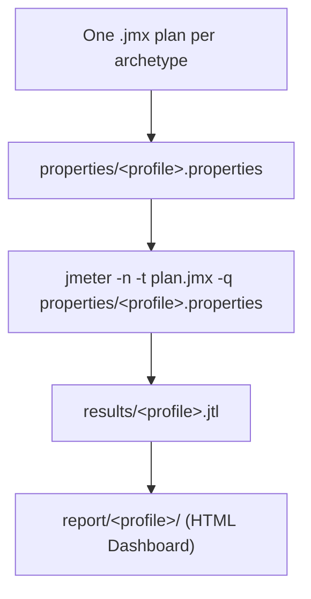
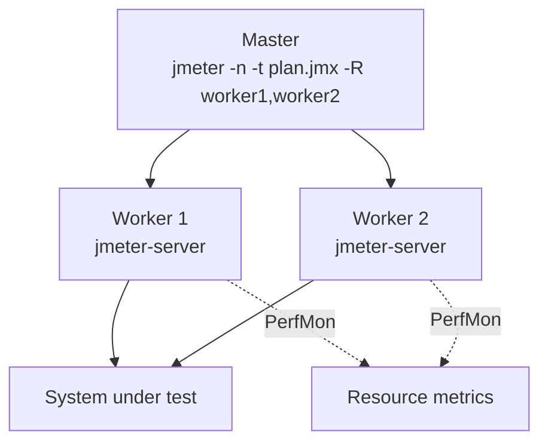

# JMeter Guide

Status: Approved | Last Reviewed: 2026-08-13 | Owner: @qe-lead
Catalog ID: TST-011 | Radii
Tier Applicability: T0, T1, T2, T3

## Problem Statement

- JMeter's default Thread Group is a **closed** workload model. A plan built with it and pointed
  at a `stress`, `spike`, or `scalability` profile silently produces a breakpoint, burst shape,
  or throughput ceiling that is an artifact of the harness throttling itself, not a property of
  the system under test — see [TST-003](../strategy/workload-modelling.md) for why that number is
  void, not merely conservative.
- The plugin set that supplies an open model, distributed generation, and protocol coverage
  beyond HTTP is not part of a stock JMeter install. A plan authored against one engineer's
  locally-plugin-augmented JMeter fails, silently or loudly, the moment it runs on CI or on a
  colleague's unmodified install.
- Every squad that hand-rolls its own CLI property names for users, ramp-up, duration, and target
  throughput produces plans that are not interchangeable across archetypes, so the eight
  [TST-002](../strategy/performance-test-standard.md) profiles cannot be run from one plan without
  a rewrite each time.
- GUI mode is convenient for authoring and is routinely left running, with listeners attached,
  for what is presented as a measured run — GUI rendering and listener overhead inflate every
  recorded sample time, so the reported percentiles measure the JMeter GUI, not the target.
- JDBC and JMS scenarios — the protocol coverage that gives JMeter its Primary position in
  [TST-010](./tool-selection-matrix.md) — are frequently authored with connection strings,
  queue names, or seed data that look like a real environment, rather than obviously synthetic
  values parameterised the same way as every HTTP sampler.

## When to Use This Tool

[TST-010](./tool-selection-matrix.md) positions `jmeter` as **Primary** and gives the full
decision tree for choosing among the four tools; that tree is not restated here. In short: this
guide applies whenever a scenario needs a protocol JMeter is the only tool in the stack that
covers natively — JMS, ISO 8583, or JDBC-heavy flows — and whenever no other tool's branch of the
[TST-010 decision tree](./tool-selection-matrix.md#decision-tree) fires first. Every later
archetype's §5 "Canonical Harness — JMeter" section is a specialisation of the conventions this
guide establishes, not a competing set of conventions.

## Version and Installation

- **Pinned version:** the `5.6.x` line (currently `5.6.3`). A run's evidence package records the
  exact patch version used, per [TST-005](../strategy/environments-quality-gates.md); results
  produced on different major or minor lines (`5.5.x` vs `5.6.x`) are **not comparable**, because
  sampler defaults, HTTP client behaviour, and the bundled dashboard's percentile calculation
  have all changed across major lines. A regression comparison (see
  [Result Output and Baselining](#result-output-and-baselining)) against a baseline recorded on a
  different major version is void regardless of what the numbers say.
- **Install method:** the official Apache binary tarball, pinned by checksum, unpacked into the
  QE harness repository's `jmeter/` toolchain directory (see
  [Project Layout](#project-layout)) or fetched by the CI runner's cache step at pipeline start —
  never installed from a distribution package manager, whose packaged version drifts
  independently of this document's pin.
- **JVM requirement:** a JDK matching the JMeter release notes' supported range, with the heap
  sized per [Common Failure Modes](#common-failure-modes) — undersized heap is one of the most
  common causes of a corrupted measured run.
- **Plugin manager:** `PluginsManagerCMD` (from the JMeter Plugins project) is used to install and
  pin the plugin set below by exact version, so that a plan authored against one pinned plugin
  set behaves identically on every generator host and on CI.

**Plugin set (all pinned by version in the harness repository's plugin manifest):**

| Plugin | Supplies | Why it is required |
|---|---|---|
| Custom Thread Groups — **Concurrency Thread Group** and **Arrivals Thread Group** | The open workload model | JMeter's built-in Thread Group is closed — a fixed, hard-ceiling population, per [TST-003](../strategy/workload-modelling.md#open-versus-closed-workload-models). The **Concurrency Thread Group** and **Arrivals Thread Group** are the only elements in a stock-plus-plugin JMeter install that generate a true open arrival stream, and they are the plugin every `stress`, `spike`, and `scalability` plan depends on. |
| Throughput Shaping Timer | Rate-shaped load over time | Paired with the Arrivals Thread Group to drive a `stress` step-ramp or a `spike` burst-and-hold shape directly from `-Jtargetrps`, rather than approximating a rate shape through think time alone. |
| PerfMon (Server Agent) listener | Generator- and target-host resource metrics | Confirms the generator itself is not the bottleneck, per the generator-sizing rule in [TST-003](../strategy/workload-modelling.md#generator-sizing-and-fidelity), and supplies the CPU/memory/connection-pool time series [TST-005](../strategy/environments-quality-gates.md#evidence-and-retention) requires as evidence. |
| Kafka sampler set (producer/consumer) | Kafka protocol coverage | Needed for any archetype whose messaging layer is Kafka; JMeter has no native Kafka sampler, so this plugin is what makes the Kafka worked example in this guide possible at all. |

JDBC and JMS samplers are **native** — no plugin is required for either, which is precisely the
capability [TST-010](./tool-selection-matrix.md#capability-matrix) credits toward JMeter's
Primary position; see [Worked Example 3](#worked-example-3--jdbc-and-jms-sampler-configuration).

**Rule:** the default Thread Group is JMeter's single most consequential default. Every plan in
this guide states explicitly, in a comment at the top of its Thread Group element, which Thread
Group implementation it uses and why — silence on this point is treated as a defect in review.

## Project Layout

A QE harness repository holding JMeter artefacts follows this layout. Nothing here runs in CI
from `knowledge-base/` itself — every fragment in this guide is copied into a structure like the
one below, per the corpus-wide rule in the [testing README](../README.md).

```text
qe-harness/
  jmeter/
    toolchain/
      apache-jmeter-5.6.3/        # pinned binary, fetched by checksum
      plugins/                    # plugin manifest + pinned jars via PluginsManagerCMD
    plans/
      <archetype-id>.jmx          # one plan per archetype, all eight profiles parameterised
    properties/
      baseline.properties
      load.properties
      stress.properties
      spike.properties
      soak.properties
      mixed.properties
      scalability.properties
      failover-under-load.properties
    lib/
      jdbc-driver-synthetic.jar   # driver jars required by JDBC samplers
    data/
      synthetic-accounts.csv      # header comment: "SYNTHETIC — generated, no real accounts"
    results/                      # .jtl output, gitignored
    report/                       # HTML Dashboard output, gitignored
```



One plan per archetype, driven by eight different properties files, is the mechanism behind the
"one plan serves all eight profiles" rule in
[Parameterisation and Correlation](#parameterisation-and-correlation) below.

## Worked Example 1 — Synchronous API under load

A synthetic REST endpoint under the `load` profile. `load` and `soak` may legitimately use the
standard, closed Thread Group, per [TST-003](../strategy/workload-modelling.md#the-rule) — this
example does so deliberately, to show the one case where the stock element is the correct choice.

```xml
<!-- Thread Group: CLOSED model — valid for `load` and `soak` only. See TST-003. -->
<ThreadGroup testname="tg-synchronous-api-load">
  <stringProp name="ThreadGroup.num_threads">${__P(users,20)}</stringProp>
  <stringProp name="ThreadGroup.ramp_time">${__P(rampup,60)}</stringProp>
  <stringProp name="ThreadGroup.duration">${__P(duration,3600)}</stringProp>
</ThreadGroup>

<CSVDataSet testname="synthetic-accounts.csv (SYNTHETIC — generated, no real accounts)">
  <stringProp name="filename">data/synthetic-accounts.csv</stringProp>
  <stringProp name="variableNames">account_id,currency</stringProp>
  <boolProp name="recycle">true</boolProp>
</CSVDataSet>

<HTTPSamplerProxy testname="POST balance-enquiry (synthetic)">
  <stringProp name="HTTPSampler.domain">${__P(base_host,api-perf.internal.example)}</stringProp>
  <stringProp name="HTTPSampler.path">/v1/accounts/${account_id}/balance</stringProp>
  <stringProp name="HTTPSampler.method">POST</stringProp>
</HTTPSamplerProxy>

<ResponseAssertion testname="assert 200">
  <stringProp name="Assertion.test_field">Assertion.response_code</stringProp>
  <stringProp name="49586">200</stringProp>
</ResponseAssertion>

<DurationAssertion testname="assert P95 tier budget (advisory per-sample gate)">
  <stringProp name="DurationAssertion.duration">${__P(sample_budget_ms,500)}</stringProp>
</DurationAssertion>
```

```bash
jmeter -n -t plans/synchronous-api.jmx -q properties/load.properties \
  -Jusers=20 -Jrampup=60 -Jduration=3600 -Jprofile=load \
  -l results/load.jtl -e -o report/load/
```

## Worked Example 2 — Asynchronous / messaging scenario

A Kafka-backed notification flow, run under `spike` to prove burst absorption. `spike` and
`stress` MUST run under an open model, so this example uses the **Arrivals Thread Group** —
never the standard Thread Group — with the Throughput Shaping Timer driving the burst-and-hold
arrival shape.

```xml
<!-- Thread Group: OPEN model via Arrivals Thread Group plugin — required for `spike`. -->
<kg.apc.jmeter.timers.VariableThroughputTimer testname="Throughput Shaping Timer">
  <collectionProp name="load_profile">
    <collectionProp name="0">
      <stringProp name="49">${__P(baseline_rps,10)}</stringProp>
      <stringProp name="50">${__P(targetrps,200)}</stringProp>
      <stringProp name="51">${__P(rampup,30)}</stringProp>
    </collectionProp>
    <collectionProp name="1">
      <stringProp name="49">${__P(targetrps,200)}</stringProp>
      <stringProp name="50">${__P(targetrps,200)}</stringProp>
      <stringProp name="51">${__P(duration,300)}</stringProp>
    </collectionProp>
  </collectionProp>
</kg.apc.jmeter.timers.VariableThroughputTimer>

<kg.apc.jmeter.threads.ArrivalsThreadGroup testname="tg-kafka-notification-spike">
  <stringProp name="TargetLevel">${__P(targetrps,200)}</stringProp>
  <stringProp name="Iterations">${__P(duration,300)}</stringProp>
</kg.apc.jmeter.threads.ArrivalsThreadGroup>

<KafkaMeterProducerSampler testname="publish notification.synthetic (async)">
  <stringProp name="kafka.topic">${__P(kafka_topic,notification.synthetic)}</stringProp>
  <stringProp name="kafka.bootstrap_servers">${__P(kafka_bootstrap,kafka-perf.internal.example:9092)}</stringProp>
  <stringProp name="kafka.message">{"eventId":"${__UUID()}","accountId":"${account_id}"}</stringProp>
</KafkaMeterProducerSampler>

<JSR223Assertion testname="assert no DLQ growth (consumer lag probe)">
  <stringProp name="script">
    // Correlates against a companion consumer-lag sampler; see
    // Parameterisation and Correlation for the extractor pattern this feeds.
    if (vars.get("dlq_depth_delta") != "0") { AssertionResult.setFailure(true); }
  </stringProp>
</JSR223Assertion>
```

```bash
jmeter -n -t plans/kafka-notification.jmx -q properties/spike.properties \
  -Jtargetrps=200 -Jrampup=30 -Jduration=300 -Jprofile=spike \
  -l results/spike.jtl -e -o report/spike/
```

## Worked Example 3 — JDBC and JMS sampler configuration

This is the capability that most directly justifies JMeter's Primary position in
[TST-010](./tool-selection-matrix.md#capability-matrix): both JDBC and JMS samplers are
**native**, requiring no plugin, where Gatling/Karate needs a plugin for JDBC and no other tool
in the stack reaches JMS at all. A synthetic ledger-posting flow: a JDBC read against a synthetic
ledger table, followed by a JMS Point-to-Point send of the posting event.

```xml
<JDBCDataSource testname="ledger-synth-pool (SYNTHETIC schema, no production data)">
  <stringProp name="dataSource">ledger_synth</stringProp>
  <stringProp name="dbUrl">${__P(jdbc_url,jdbc:postgresql://ledger-perf.internal.example:5432/ledger_synth)}</stringProp>
  <stringProp name="driver">${__P(jdbc_driver,org.postgresql.Driver)}</stringProp>
  <stringProp name="poolMax">${__P(jdbc_pool_max,20)}</stringProp>
</JDBCDataSource>

<JDBCSampler testname="SELECT synthetic ledger balance">
  <stringProp name="dataSource">ledger_synth</stringProp>
  <stringProp name="query">
    SELECT balance FROM ledger_synth.account_balance WHERE account_id = ?
  </stringProp>
  <stringProp name="queryArguments">${account_id}</stringProp>
  <stringProp name="queryArgumentsTypes">VARCHAR</stringProp>
</JDBCSampler>

<JMSPointToPointSampler testname="send posting-event.synthetic (JMS, native — no plugin)">
  <stringProp name="jms.queue">${__P(jms_queue,posting-event.synthetic)}</stringProp>
  <stringProp name="jms.initial_context_factory">${__P(jms_icf,org.apache.activemq.jndi.ActiveMQInitialContextFactory)}</stringProp>
  <stringProp name="jms.provider_url">${__P(jms_provider_url,tcp://mq-perf.internal.example:61616)}</stringProp>
  <stringProp name="jms.content">{"accountId":"${account_id}","amount":"${__Random(1,100000)}"}</stringProp>
</JMSPointToPointSampler>

<ResponseAssertion testname="assert JDBC row returned">
  <stringProp name="Assertion.test_field">Assertion.response_data</stringProp>
</ResponseAssertion>
```

```bash
jmeter -n -t plans/ledger-posting-jdbc-jms.jmx -q properties/load.properties \
  -Jusers=20 -Jrampup=60 -Jduration=3600 -Jprofile=load \
  -Jjdbc_url="jdbc:postgresql://ledger-perf.internal.example:5432/ledger_synth" \
  -Jjms_provider_url="tcp://mq-perf.internal.example:61616" \
  -l results/load.jtl -e -o report/load/
```

## Parameterisation and Correlation

**The `${__P(name,default)}` idiom.** Every value that changes across a run — user count,
ramp-up, duration, target throughput, hostnames, queue names — is read through
`${__P(name,default)}`, never hard-coded. The second argument is a safe local default so a plan
opened in the GUI for authoring still runs without a properties file; the properties file
supplied on the command line at `-q properties/<profile>.properties` always overrides it. This is
the single mechanism that lets one `.jmx` plan serve all eight [TST-002](../strategy/performance-test-standard.md)
profiles: the plan's structure never changes between profiles, only the properties file does.

**Profile-to-property mapping.** Each profile's properties file sets the same five `-J`
properties this document establishes as the shared convention every archetype's §5 depends on:

| Profile | Thread Group implementation | `-Jusers` | `-Jrampup` | `-Jduration` | `-Jtargetrps` | `-Jprofile` |
|---|---|---|---|---|---|---|
| `baseline` | standard (closed) | 2 | 30 | 600 | — | `baseline` |
| `load` | standard (closed) | 20 | 60 | 3600 | — | `load` |
| `stress` | **Concurrency Thread Group** (open) | — | — | until failure | step +10%/5 min | `stress` |
| `spike` | **Arrivals Thread Group** (open) | — | 30 | 300 | 200 | `spike` |
| `soak` | standard (closed) | 14 | 120 | 43200 (T0: 86400) | — | `soak` |
| `mixed` | standard (closed) | 20 | 60 | 14400 | — | `mixed` |
| `scalability` | **Concurrency Thread Group** (open) | — | 900 per step | 4500 | 25/50/75/100/125% steps | `scalability` |
| `failover-under-load` | matches the base profile it layers on (usually `load`) | 20 | 60 | 3600 | — | `failover-under-load` |

`stress` and `spike` select the **Concurrency Thread Group** or **Arrivals Thread Group**
because both profiles must run under an open model, per
[TST-003](../strategy/workload-modelling.md#the-rule); `load` and `soak` use the standard,
closed Thread Group because their purpose — holding a declared, bounded population at steady
state — is exactly what a closed model is legitimately for. A plan that reaches for the
**Concurrency Thread Group** on a `load` run, or the standard Thread Group on a `stress` run, is
using the wrong element for that profile's own contract and is rejected in review.

**Correlation.** A dynamic value returned by one sampler and required by a later sampler is
never hard-coded from a single recorded run; it is extracted and re-injected:

- **Regular Expression Extractor** — for values embedded in non-JSON text responses (headers, a
  legacy fixed-width or SOAP body).
- **JSON Extractor** — the default choice for any JSON REST response; extracts by JSONPath into a
  JMeter variable consumed by the next sampler, exactly as `${account_id}` is consumed in
  [Worked Example 3](#worked-example-3--jdbc-and-jms-sampler-configuration).
- **CSV Data Set Config** — for per-iteration synthetic input data (account IDs, currencies,
  amounts) rather than a correlated response value. **Rule:** every CSV file used this way carries
  a header comment stating `SYNTHETIC — generated, no real accounts`, and the element's own
  `testname` attribute restates it, matching the convention shown in
  [Worked Example 1](#worked-example-1--synchronous-api-under-load). A CSV without that marker is
  treated as an undeclared data-provenance defect, regardless of whether its contents are in fact
  synthetic.

## Assertions and Thresholds

Per-sample assertions (Response Assertion, Duration Assertion, JSR223 Assertion) catch
functional and gross-latency failures during the run itself, but they are **not** the pass/fail
mechanism for a profile — that mechanism is the aggregate percentile table in the HTML Dashboard
Report, graded against the tier row a profile's pass criteria point to in
[TST-002](../strategy/performance-test-standard.md#per-profile-detail). A per-sample Duration
Assertion is an early-warning tripwire, useful for aborting an obviously broken run early; the
`assert p95_latency <= NFR-002 tier row` claim a DAB reviewer actually checks is read from the
aggregate report, not from how many Duration Assertions failed.

**Rule:** an assertion element is placed **after** the Transaction Controller boundary it is
meant to gate, never inside the timed transaction — an assertion's own evaluation time is
counted as part of the sampler's elapsed time if placed inside, which silently inflates every
measured latency by the assertion's own cost. See
[Common Failure Modes](#common-failure-modes) for how this shows up in a review.

## Distributed Execution

JMeter's thread-per-VU model carries materially more per-VU memory and CPU overhead than an
event-loop tool, per [TST-010](./tool-selection-matrix.md#capability-matrix), so any concurrency
target beyond a single generator host's safe headroom is distributed across a master/worker
topology rather than pushed further onto one host:

```bash
# On each worker (server mode):
jmeter-server -Jserver.rmi.localport=4000

# On the master, driving N workers by hostname:
jmeter -n -t plans/ledger-posting-jdbc-jms.jmx -q properties/stress.properties \
  -Jtargetrps=200 -Jprofile=stress \
  -R worker-perf-01.internal.example,worker-perf-02.internal.example \
  -l results/stress.jtl -e -o report/stress/
```



**Rule:** every worker host in a distributed run is identically sized (CPU, memory, network) —
an asymmetric fleet makes the aggregate throughput figure unattributable to any single, known
per-host ceiling. The worker count and each worker's specification are recorded in the run's
evidence package alongside the pinned JMeter version, per
[TST-005](../strategy/environments-quality-gates.md#evidence-and-retention).

## Result Output and Baselining

A run always writes its raw samples to a `.jtl` file (`-l results/<profile>.jtl`) — CSV format
by default, which is smaller and faster to post-process than the legacy XML format and is the
convention this guide standardises on. The `-e -o report/<profile>/` flags generate the HTML
Dashboard Report from that `.jtl` file after the run completes; this HTML report, not any GUI
listener, is the artefact attached as DAB evidence, per
[TST-005](../strategy/environments-quality-gates.md#evidence-and-retention).

**Rule: GUI mode (`jmeter` with no `-n`) must never be used for a measured run.** GUI rendering
of every sample as it arrives, and any listener left attached in that mode, both consume CPU on
the same generator host that is trying to produce load — every recorded sample time is inflated
by however much GUI and listener overhead competed with it for CPU that run. GUI mode exists
solely for plan authoring and debugging against a trivial number of iterations; a plan is
switched to non-GUI (`-n`) before its first properties-file-driven run.

A run becomes an accepted baseline, and a later run is graded as a regression against it, per the
rule in [TST-002](../strategy/performance-test-standard.md#result-baselining-and-regression) —
this guide does not restate that rule, only the mechanics (`.jtl` plus HTML Dashboard) that
produce the numbers it grades.

## CI Invocation

```bash
jmeter -n -t "${JMETER_PLAN}" -q "properties/${JMETER_PROFILE}.properties" \
  -Jusers="${JMETER_USERS}" -Jrampup="${JMETER_RAMPUP}" -Jduration="${JMETER_DURATION}" \
  -Jtargetrps="${JMETER_TARGETRPS}" -Jprofile="${JMETER_PROFILE}" \
  -l "results/${JMETER_PROFILE}.jtl" -e -o "report/${JMETER_PROFILE}/"
```

## Common Failure Modes

- **GUI mode used for a measured run.** See the rule in
  [Result Output and Baselining](#result-output-and-baselining) — the reported numbers measure
  JMeter's own GUI overhead, not the target.
- **The default, closed Thread Group used for a breakpoint test.** A `stress` or `spike` plan
  built on the standard Thread Group throttles its own offered load exactly at the point the test
  is supposed to find the knee or the burst ceiling, per
  [TST-003](../strategy/workload-modelling.md#the-rule) — the reported "knee" is the harness's
  own back-pressure, not the system's.
- **Listeners left enabled during a measured run.** View Results Tree and similar per-sample
  listeners add serialisation and (if GUI-attached) rendering overhead per sample; only the
  Backend Listener or the `.jtl` writer belong in a properties-file-driven, non-GUI run.
- **DNS resolved once and cached for the whole run.** JMeter's HTTP client caches a resolved
  hostname's IP for the run's lifetime by default, so a load-balancer's DNS-based rotation across
  backend instances is never exercised — a `failover-under-load` run against a DNS-rotated
  target silently tests one instance the entire time. Disable DNS caching (`-DDNSCacheManager` or
  an explicit DNS Cache Manager element with caching turned off) whenever the target's routing
  depends on DNS rotation.
- **Generator heap sized too small.** An undersized heap forces the generator JVM to
  garbage-collect aggressively mid-run, and a GC pause on the generator shows up as a latency
  spike that looks like it came from the system under test. Heap is sized for the plan's own
  variable and correlation-data footprint (via `JVM_ARGS`/`HEAP_OPTS`, non-GUI mode) before the
  first properties-file-driven run, not tuned reactively after a suspicious spike appears.
- **An assertion placed inside the timed transaction it evaluates.** Per the rule in
  [Assertions and Thresholds](#assertions-and-thresholds), an assertion's own evaluation cost is
  counted as sampler elapsed time when placed inside the Transaction Controller boundary,
  inflating every measured latency by the assertion's own overhead — small on its own, but
  enough to shift a P99 across a tier's budget on a borderline service.

## Compliance Mapping

| Layer | Reference | Section/Control | How this satisfies |
|---|---|---|---|
| Ring 0 | ISTQB | Performance-test tooling and load-generation practice | The pinned-version rule, the plugin set, and the open/closed Thread Group guidance in [Version and Installation](#version-and-installation) turn ISTQB's generic tooling guidance into a specific, checkable configuration for this stack. |
| Ring 1 | [Basel BCBS 230](../../compliance/basel-bcbs-230.md) — Principle 9 | Repeatable, evidenced severe-but-plausible scenario testing | The distributed-execution, `.jtl`/HTML-report, and version-pinning rules in this guide are what make a `stress`, `spike`, or `failover-under-load` result in [TST-002](../strategy/performance-test-standard.md) reproducible and admissible as Principle 9 evidence, rather than an unrepeatable, tool-version-ambiguous number. |
| Ring 2 | SBV Circular 09/2020/TT-NHNN — §IV.3 ⚠️ (working summary — pending Legal review) | Operational continuity / capacity resilience testing | The distributed master/worker topology and the recorded worker count and JMeter version in [Distributed Execution](#distributed-execution) give an SBV on-site examination a concrete, auditable harness description behind a `failover-under-load` result. |

## Related

- [TST-002 Performance Test Standard](../strategy/performance-test-standard.md)
- [TST-003 Workload Modelling](../strategy/workload-modelling.md)
- [TST-005 Test Environments and Quality Gates](../strategy/environments-quality-gates.md)
- [TST-010 Test Tool Selection Matrix](./tool-selection-matrix.md)
- [TST-012 Gatling + Karate Guide](./gatling-karate.md)
- [TST-013 k6 Guide](./k6.md)
- [TST-014 Locust Guide](./locust.md)
- [TPL-005 Test Archetype Template](../../templates/test-archetype-template.md)
