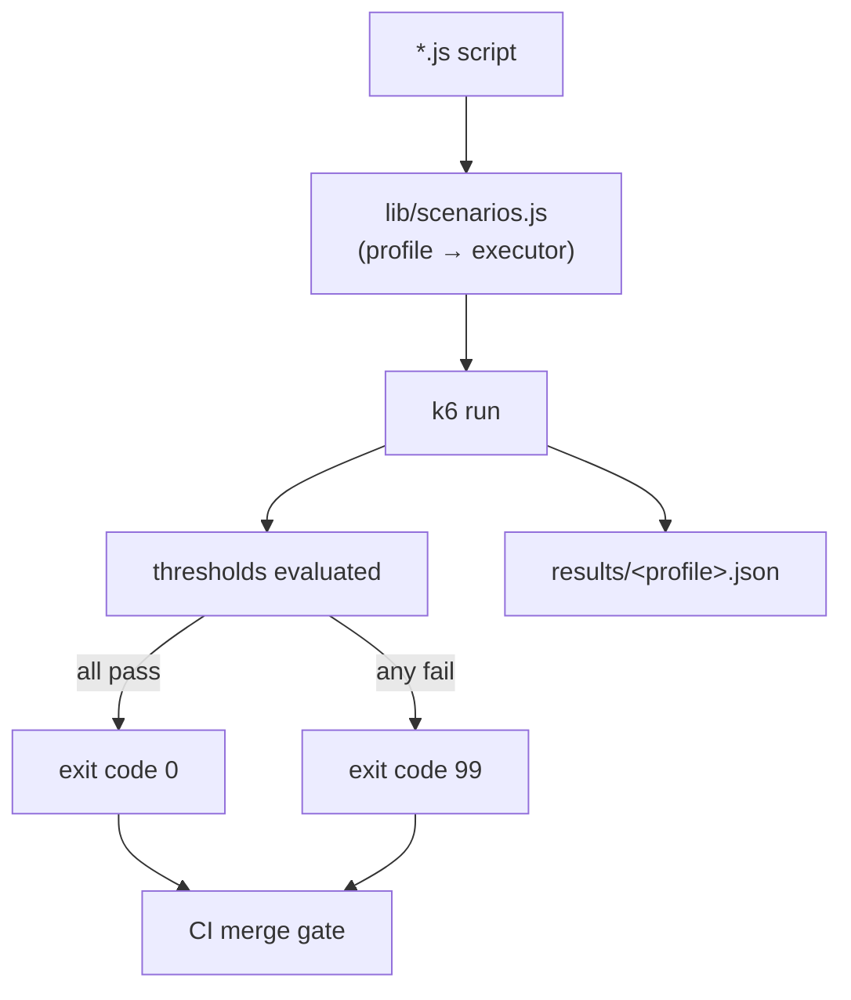
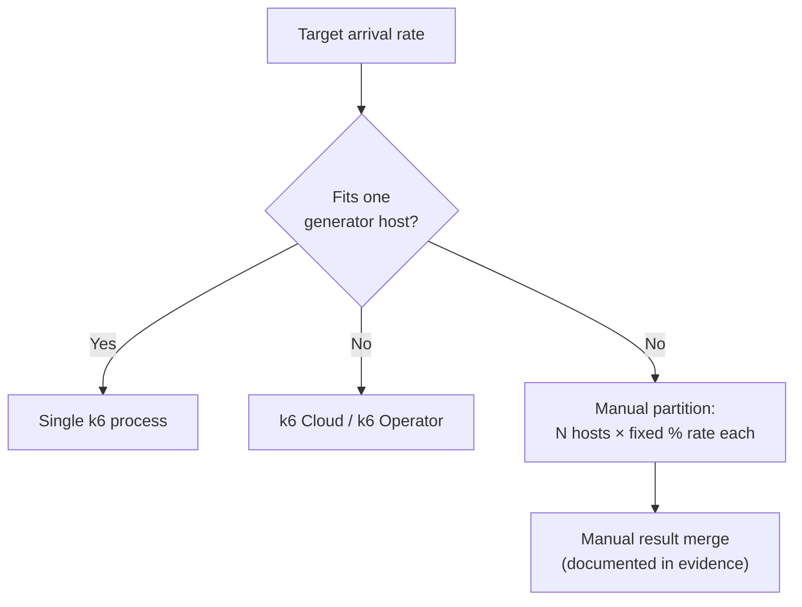

# k6 Guide

Status: Approved | Last Reviewed: 2026-08-13 | Owner: @qe-lead
Catalog ID: TST-013 | Radii
Tier Applicability: T0, T1, T2, T3

## Problem Statement

**k6's role, stated first.** k6 is the CI merge-gate tool for this corpus because a k6
script's `thresholds` block is declarative — the pass/fail criteria live inside the script
itself, not in a separately maintained report parser — and the `k6 run` process's own exit code
already reflects whether every threshold held. A merge-request pipeline can gate on that exit
code directly; it never needs a bespoke step that opens a results file and re-derives pass/fail
from raw samples the way a JMeter `.jtl` or a Gatling HTML report requires. That role is also
where k6-specific risk concentrates:

- A threshold quietly omitted from the script, or a stray `--no-thresholds` flag left on the CI
  invocation, makes `k6 run` exit `0` regardless of what the run actually measured — and because
  there is no external report-parsing step to catch the gap, the merge gate goes green with
  nothing behind it. See [Common Failure Modes](#common-failure-modes).
- k6's own end-of-test text summary reports `p90`/`p95` by default, which does not necessarily
  match the tier's own required percentile row (P50/P95/P99 per
  [NFR-002](../../nfr/latency-budget-model.md)); a reviewer who reads the console summary by eye
  instead of the script's own `thresholds` block can be satisfied by a percentile nobody's tier
  budget actually specifies.
- `xk6` extensions (Kafka, SQL) require a custom-compiled binary — there is no stock `k6` binary
  that includes them — so a script authored against a locally built extended binary fails,
  silently or loudly, the moment CI runs the stock binary instead, or a differently built
  extension set.
- k6's `scenarios` map cleanly onto open (`constant-arrival-rate`, `ramping-arrival-rate`) and
  closed (`constant-vus`, `ramping-vus`) executors, but an engineer reaching for the
  VU-based executor out of JMeter or Gatling habit silently reintroduces a closed model on a
  profile — `stress`, `spike`, `scalability` — that
  [TST-003](../strategy/workload-modelling.md#the-rule) requires run open, the same failure
  already documented for the other tools, now under k6's own executor names.
- Because k6 scripts are plain JavaScript, per-iteration `sleep()` reads as think time to anyone
  unfamiliar with the arrival-rate executors; inside `constant-arrival-rate` or
  `ramping-arrival-rate` it does not throttle the arrival rate at all, and can instead exhaust
  the scenario's `preAllocatedVUs` pool and silently drop iterations — a different and worse
  failure than the "wrong but recorded" number the other tools produce.

## When to Use This Tool

[TST-010](./tool-selection-matrix.md#position-each-tool) positions k6 as the **CI gate**: the
tool the [TST-010 decision tree](./tool-selection-matrix.md#decision-tree)'s first branch
selects whenever the scenario in question is the `baseline` profile running on the
merge-request pipeline defined in [TST-005](../strategy/environments-quality-gates.md#gate-placement).
This guide does not restate that tree or the branches that route to the other three tools; see
[TST-010 § Position Each Tool](./tool-selection-matrix.md#position-each-tool) for the full
comparative rationale. Beyond the `baseline` gate itself, k6 is also the right choice whenever
an `xk6` extension's protocol reach (Kafka, SQL) is warranted despite the maintenance cost of a
custom binary — see [Version and Installation](#version-and-installation). Every later
archetype's §6 Tool Fit table (see
[TPL-005](../../templates/test-archetype-template.md)) that names `k6` primary or preferred
specialises this guide's conventions rather than inventing its own.

## Version and Installation

- **Pinned version.** The `v0.55.x` line (currently `v0.55.0`). The exact patch version is
  recorded in the run's evidence package per
  [TST-005](../strategy/environments-quality-gates.md#evidence-and-retention); a baseline
  comparison (see [Result Output and Baselining](#result-output-and-baselining)) against a run
  on a different minor line is void, because default metric names, the built-in summary, and
  threshold-evaluation timing have changed across minor releases.
- **Install method.** k6 ships as a single statically linked Go binary — no JVM, no plugin
  manager. The stock binary is fetched by pinned checksum from the corporate artifact mirror
  into the QE harness repository's `k6/toolchain/` directory (see
  [Project Layout](#project-layout)) at pipeline start; it is never installed from an OS package
  manager, where the packaged version drifts independently of this document's pin.
- **`xk6` extensions require a custom binary.** `xk6-kafka` and `xk6-sql` are not part of the
  stock binary; each is compiled in via `xk6 build`, producing a second, differently named
  binary (`k6-ext` below) that is *not* interchangeable with the stock one. The browser module
  (`k6/browser`) is the one exception: since the `v0.52` line it ships **inside the core
  binary**, so a browser scenario needs no custom build on the pinned version above — it is
  listed here only because an older script or a stale mental model may still assume
  `xk6-browser` is a separate extension.
- **Recorded extension set.** Whichever binary a run actually used — stock or `k6-ext` — its
  exact `xk6` build command, the pinned `xk6-kafka`/`xk6-sql` module versions, and the resulting
  binary's own build commit hash are recorded in the run's evidence package per
  [TST-005](../strategy/environments-quality-gates.md#evidence-and-retention). A run cannot be
  attributed a specific extension set from its script alone — the binary that executed it must
  be identified.

**Extension set:**

| Extension | Adds | Build cost | Warranted when |
|---|---|---|---|
| `xk6-kafka` | Kafka producer/consumer DSL | Custom `xk6 build`, own module version pinned independently of k6 core | Scenario needs a Kafka protocol k6 core has no native support for — see [Worked Example 2](#worked-example-2--asynchronous--messaging-scenario) |
| `xk6-sql` | SQL driver DSL (Postgres, MySQL) | Custom `xk6 build`, own module version pinned independently of k6 core | Scenario needs direct database verification alongside HTTP load, avoiding a second tool purely for a DB check |
| `k6/browser` | Browser-automation DSL | None — built into the pinned core binary since `v0.52` | Scenario needs real-browser rendering/interaction rather than protocol-level HTTP calls |

**Rule:** a script that imports `k6/x/kafka` or `k6/x/sql` only ever runs against the `k6-ext`
binary; running it against the stock binary fails at import time, not silently — but a pipeline
stage that has both binaries on its `PATH` under similar names must select the correct one
explicitly, per [Common Failure Modes](#common-failure-modes).

## Project Layout

```text
qe-harness/
├── k6/
│   ├── toolchain/
│   │   ├── k6                        # stock pinned binary (v0.55.0, checksum-verified)
│   │   └── k6-ext                    # custom xk6 build: xk6-kafka + xk6-sql, see Version and Installation
│   ├── lib/
│   │   ├── scenarios.js              # shared eight-profile scenario-mapping helper
│   │   └── thresholds.js             # shared per-tag threshold-building helper
│   ├── scripts/
│   │   ├── synchronous-api.js        # Worked Example 1
│   │   ├── posting-event-kafka.js    # Worked Example 2
│   │   └── baseline-gate.js          # Worked Example 3 — merge-gate script
│   └── data/
│       └── synthetic-accounts.json   # header comment: SYNTHETIC — generated, no real accounts
├── results/                          # --out json export, gitignored
└── report/                           # --summary-export output, gitignored
```



One script, driven by environment variables through `lib/scenarios.js`, is the mechanism behind
"one script serves all eight profiles" in
[Parameterisation and Correlation](#parameterisation-and-correlation) below.

## Worked Example 1 — Synchronous API under load

A synthetic balance-enquiry endpoint under the `load` profile, driven by an open, arrival-rate
scenario per [TST-010's capability matrix](./tool-selection-matrix.md#capability-matrix) ("open
(`arrival-rate` executor is idiomatic default)").

```javascript
import http from 'k6/http';
import { check } from 'k6';
import { scenarioFor } from '../lib/scenarios.js';
import { tieredThreshold } from '../lib/thresholds.js';

export const options = {
  scenarios: {
    [__ENV.K6_PROFILE || 'load']: scenarioFor(__ENV.K6_PROFILE || 'load'),
  },
  thresholds: {
    'http_req_duration{scenario:balanceEnquiry}': [tieredThreshold('p(95)', 300)],
    'http_req_failed{scenario:balanceEnquiry}': ['rate<0.001'],
  },
};

const BASE_URL = __ENV.K6_BASE_URL || 'https://api-perf.internal.example';

export default function () {
  const accountId = 'synthetic-0001'; // header: SYNTHETIC — generated, no real accounts
  const res = http.post(
    `${BASE_URL}/v1/accounts/${accountId}/balance`,
    null,
    { tags: { scenario: 'balanceEnquiry' } },
  );
  check(res, {
    'status is 200': (r) => r.status === 200,
    'body has balance field': (r) => r.json('balance') !== undefined,
  });
}
```

```bash
K6_PROFILE=load K6_BASE_URL=https://api-perf.internal.example \
  ./k6/toolchain/k6 run k6/scripts/synchronous-api.js
```

## Worked Example 2 — Asynchronous / messaging scenario

A synthetic ledger-posting event, produced at a controlled open-model rate via `xk6-kafka` —
k6 core has no native Kafka support, exactly the gap the extension exists to close (see
[Version and Installation](#version-and-installation)).

```javascript
import { Writer, SchemaRegistry } from 'k6/x/kafka';
import { scenarioFor } from '../lib/scenarios.js';
import { tieredThreshold } from '../lib/thresholds.js';

const writer = new Writer({
  brokers: [__ENV.K6_KAFKA_BOOTSTRAP || 'kafka-perf.internal.example:9092'],
  topic: 'posting-event.synthetic',
});

export const options = {
  scenarios: {
    [__ENV.K6_PROFILE || 'spike']: scenarioFor(__ENV.K6_PROFILE || 'spike'),
  },
  thresholds: {
    'kafka_writer_error_count{scenario:postingEvent}': ['count==0'],
    'kafka_writer_write_seconds{scenario:postingEvent}': [tieredThreshold('p(95)', 0.2)],
  },
};

export default function () {
  writer.produce({
    messages: [
      {
        // synthetic account id, no real accounts
        value: JSON.stringify({ accountId: 'synthetic-0001', amount: '12500' }),
      },
    ],
  });
}

export function teardown() {
  writer.close();
}
```

```bash
K6_PROFILE=spike K6_KAFKA_BOOTSTRAP=kafka-perf.internal.example:9092 \
  ./k6/toolchain/k6-ext run k6/scripts/posting-event-kafka.js
```

Note the `k6-ext` binary, not the stock `k6` binary, per the extension rule in
[Version and Installation](#version-and-installation) — the stock binary has no `k6/x/kafka`
module to import.

## Worked Example 3 — the `baseline` profile wired as a CI merge-gate

This is the mechanism the whole guide exists to document: `thresholds` declared once, in the
script, and the process exit code carrying the pass/fail verdict with no downstream parsing
step.

```javascript
import http from 'k6/http';
import { check } from 'k6';
import { scenarioFor } from '../lib/scenarios.js';

export const options = {
  scenarios: {
    baseline: scenarioFor('baseline'),
  },
  thresholds: {
    // per NFR-002 tier row for this service — never a number copied by hand,
    // see the Rule in TST-002's Threshold Derivation section.
    'http_req_duration{scenario:baseline}': ['p(95)<300'],
    'http_req_failed{scenario:baseline}': ['rate==0'],
  },
};

const BASE_URL = __ENV.K6_BASE_URL || 'https://api-perf.internal.example';

export default function () {
  const accountId = 'synthetic-0001'; // header: SYNTHETIC — generated, no real accounts
  const res = http.post(
    `${BASE_URL}/v1/accounts/${accountId}/balance`,
    null,
    { tags: { scenario: 'baseline' } },
  );
  check(res, { 'status is 200': (r) => r.status === 200 });
}
```

`lib/scenarios.js` maps `baseline` to a `constant-arrival-rate` executor at 10% of the service's
declared `sustained_rps` for a 10-minute hold, per
[TST-002's `baseline` profile definition](../strategy/performance-test-standard.md#baseline).

```bash
K6_PROFILE=baseline K6_BASE_URL="${K6_BASE_URL}" \
  ./k6/toolchain/k6 run k6/scripts/baseline-gate.js \
  --out json="results/baseline.json" \
  --summary-export="report/baseline-summary.json"
```

**Exit-code semantics.** `k6 run` exits `0` when every declared threshold passed for the full
run. It exits `99` when at least one threshold failed — a status distinct from the exit codes
reserved for a broken harness itself (a script that fails to parse or initialise, or a
`setup()`/`teardown()` function that throws). A merge-request pipeline stage needs only check
for a non-zero exit to block the merge, but treating `99` specifically as "the service
regressed" rather than "the harness is broken" is what lets an on-call engineer triage a red
build correctly on sight, without opening the run's own log first. **The pipeline stage invoking
this script must not pass `--no-thresholds`** — that flag exists for local, exploratory runs and
forces `k6 run` to exit `0` regardless of threshold outcome, silently disabling the gate; see
[Common Failure Modes](#common-failure-modes).

## Parameterisation and Correlation

**The `scenarioFor(profile)` idiom.** Every value that changes across a run — arrival rate, ramp
target, duration, base URL, Kafka bootstrap address — is read from an environment variable
inside `lib/scenarios.js`, never hard-coded into a script file. This single mechanism lets one
set of `*.js` scripts serve all eight [TST-002](../strategy/performance-test-standard.md)
profiles: a script's own structure never changes across profiles, only the environment variables
and the `K6_PROFILE` value passed to `scenarioFor` do.

| Profile | Executor | Open/closed |
|---|---|---|
| `baseline` | `constant-arrival-rate` | open |
| `load` | `constant-arrival-rate` | open |
| `stress` | `ramping-arrival-rate` (step +10% every 5 min) | open |
| `spike` | `ramping-arrival-rate` (ramp to peak in 30 s, hold, release) | open |
| `soak` | `constant-arrival-rate` (long duration) | open |
| `mixed` | multiple `constant-arrival-rate` scenarios in parallel, each own `scenario` tag | open |
| `scalability` | `ramping-arrival-rate` (25/50/75/100/125% steps) | open |
| `failover-under-load` | matches base profile's executor, fault injected mid-run | open |

`stress`, `spike`, and `scalability` MUST resolve to the open, arrival-rate executors, per
[TST-003's rule](../strategy/workload-modelling.md#the-rule) — see
[Common Failure Modes](#common-failure-modes) for what happens when `constant-vus` or
`ramping-vus` is used by mistake. `load`, `soak`, and `baseline` may legitimately run under
either model; the arrival-rate executors are used throughout this guide because k6 makes the
open model the idiomatic default, per
[TST-010's capability matrix](./tool-selection-matrix.md#capability-matrix).

**Correlation.** Because a k6 script is imperative JavaScript, not a declarative element chain,
correlation is ordinary variable use: a value read from one `http.post`/`http.get` response
(`res.json('accountId')`, a header, or a regex match against `res.body`) is assigned to a local
variable and passed directly into the next call in the same iteration function — no separate
"extractor" component is needed the way JMeter's Regex/JSON Extractor or Gatling's `saveAs` is.
Per-iteration synthetic input data (account IDs, currencies, amounts) is loaded once via k6's
`SharedArray` from `data/synthetic-accounts.json`, so the dataset is read into memory a single
time and shared read-only across every virtual user rather than re-parsed per iteration.

**Rule:** every data file used this way carries a header comment stating
`SYNTHETIC — generated, no real accounts`, per
[TST-004](../strategy/test-data-management.md), matching the convention shown in
[Worked Example 1](#worked-example-1--synchronous-api-under-load) and
[Worked Example 3](#worked-example-3--the-baseline-profile-wired-as-a-ci-merge-gate).

## Assertions and Thresholds

Two mechanisms exist in k6, and they answer different questions:

- **`check()`** runs per-iteration, functional-style assertions (`status is 200`, `body has
  balance field`) and records a pass/fail count per check name — it is a correctness signal, not
  a performance pass/fail mechanism. A check failure does not stop the run or affect the exit
  code by itself; it only fails to increment the check's own pass counter.
- **`thresholds`**, declared in `options.thresholds`, is the performance pass/fail mechanism and
  the sole driver of `k6 run`'s exit code. A threshold expression names a built-in metric
  (`http_req_duration`, `http_req_failed`) or a custom `Trend`/`Rate`/`Counter`/`Gauge` metric
  the script defines itself, and states a condition (`p(95)<300`, `rate<0.001`) that must hold
  over the metric's full sample set for the run to pass.

**Per-journey thresholds via tags.** Every metric k6 emits can be filtered by the tags attached
to the request that produced it — `{ tags: { scenario: 'balanceEnquiry' } }` in
[Worked Example 1](#worked-example-1--synchronous-api-under-load). A threshold key of the form
`'http_req_duration{scenario:balanceEnquiry}'` evaluates only the sub-metric restricted to that
tag value, which is how the `mixed` profile's per-journey pass criterion is satisfied without a
separate tool feature: a `mixed` script simply declares one tag-scoped threshold per journey.

```javascript
export const options = {
  scenarios: {
    balanceEnquiry: scenarioFor('mixed', { weight: 0.55, tag: 'balanceEnquiry' }),
    fundsTransfer: scenarioFor('mixed', { weight: 0.25, tag: 'fundsTransfer' }),
    statementDownload: scenarioFor('mixed', { weight: 0.20, tag: 'statementDownload' }),
  },
  thresholds: {
    'http_req_duration{scenario:balanceEnquiry}': ['p(95)<300'],
    'http_req_duration{scenario:fundsTransfer}': ['p(95)<400'],
    'http_req_duration{scenario:statementDownload}': ['p(95)<600'],
    'http_req_failed{scenario:balanceEnquiry}': ['rate<0.001'],
    'http_req_failed{scenario:fundsTransfer}': ['rate<0.001'],
    'http_req_failed{scenario:statementDownload}': ['rate<0.001'],
  },
};
```

Per [TST-002's `mixed` profile](../strategy/performance-test-standard.md#mixed) rule, pass/fail
is evaluated per journey, never on the blended aggregate alone — the three
`http_req_duration{scenario:...}` lines above are what satisfy that obligation; a single
untagged `http_req_duration: ['p(95)<...']` threshold grades the blend as a whole and is
necessary but not sufficient for `mixed`, exactly the false pass named in
[TST-002](../strategy/performance-test-standard.md#mixed) for the blended-aggregate case.

**Custom metrics.** A domain-specific measurement that is not one of k6's built-in HTTP metrics —
for example, end-to-end posting latency measured from Kafka publish to a confirmation read — is
declared as a custom `Trend` (for a distribution, thresholded the same way as
`http_req_duration`) or `Rate` (for a pass/fail ratio, thresholded like `http_req_failed`), then
referenced in `thresholds` by the name given at declaration, tag-scoped exactly like a built-in
metric.

## Distributed Execution

The open-source k6 core is single-node, per
[TST-010's capability matrix](./tool-selection-matrix.md#capability-matrix) ("plugin (k6 Cloud
or k6 Operator; open-source core is single-node)"). Once a concurrency or arrival-rate target
exceeds one generator host's own safe CPU or network headroom, two options exist, both of which
must be recorded in the run's evidence package per
[TST-005](../strategy/environments-quality-gates.md#evidence-and-retention):

- **k6 Cloud or the k6 Operator (commercial / platform-managed).** k6 Cloud coordinates a
  distributed run and aggregates results centrally; the k6 Operator runs the same coordination
  as a Kubernetes custom resource, fanning a run out across a `StatefulSet` of pods. Both are
  already flagged as licensed/managed options in
  [TST-010's Licensing and Support Posture](./tool-selection-matrix.md#licensing-and-support-posture)
  and carry their own version-pinning discipline against the core `k6`/`k6-ext` binary pinned
  above.
- **Manual host partitioning.** Launch the same script, same binary, on N independent generator
  hosts, each driving a fixed fraction of the target arrival rate via the same environment
  variables `scenarioFor` reads (for example, four hosts each set to 25% of the target rate). No
  shared clock or coordinator merges the resulting `results/<profile>-<host>.json` files
  automatically — cross-host aggregation is a manual step, and the run's evidence package must
  document how many hosts were used and how the target rate was split; an aggregated number with
  no such record is not admissible evidence.



## Result Output and Baselining

A run always produces the end-of-test console summary, but that summary is not the evidence
artifact — it is a human-readable convenience that can be truncated by CI log limits and does
not carry the full raw sample stream. The evidence artifact is the file written by `--out
json=results/<profile>.json` (the unprocessed per-sample stream) alongside `--summary-export
=report/<profile>-summary.json` (the aggregated, machine-readable end-of-test summary), per
[TST-005](../strategy/environments-quality-gates.md#evidence-and-retention) — the same role the
`.jtl`/HTML Dashboard pair plays for JMeter and the `simulation.log`/HTML report pair plays for
Gatling.

**Rule:** a k6-produced number is never compared against a JMeter-, Gatling-, or Locust-produced
number for the same service, per
[TST-010's Cross-Tool Comparability Rules](./tool-selection-matrix.md#cross-tool-comparability-rules).
A run becomes an accepted baseline, and a later run is graded as a regression against it, per the
rule in
[TST-002](../strategy/performance-test-standard.md#result-baselining-and-regression) — this
guide does not restate that rule, only the mechanics (`--out json` plus `--summary-export`) that
produce the numbers it grades.

## CI Invocation

```bash
K6_PROFILE="${K6_PROFILE}" K6_BASE_URL="${K6_BASE_URL}" \
  ./k6/toolchain/k6 run "k6/scripts/${K6_SCRIPT}" \
  --out json="results/${K6_PROFILE}.json" \
  --summary-export="report/${K6_PROFILE}-summary.json"
```

The pipeline stage checks only the process exit code — a non-zero exit blocks the merge, with no
separate report-parsing step, per [Worked Example 3](#worked-example-3--the-baseline-profile-wired-as-a-ci-merge-gate).

## Common Failure Modes

- **`--no-thresholds` left on the invocation.** This flag exists for local, exploratory runs and
  forces `k6 run` to exit `0` regardless of what the declared thresholds actually measured. Left
  on a CI invocation, the merge gate goes permanently green with nothing behind it — see
  [Worked Example 3](#worked-example-3--the-baseline-profile-wired-as-a-ci-merge-gate).
- **Default summary percentiles mistaken for the tier's required percentiles.** k6's end-of-test
  console summary defaults to showing `p90`/`p95`; a reviewer who reads that summary by eye
  instead of the script's own `thresholds` block can be satisfied by a percentile that is not
  the P50/P95/P99 row [NFR-002](../../nfr/latency-budget-model.md) actually requires for the
  service's tier.
- **`ramping-vus` or `constant-vus` used for a breakpoint test.** Using a closed, VU-based
  executor for `stress`, `spike`, or `scalability` reintroduces exactly the closed-model failure
  [TST-003](../strategy/workload-modelling.md#the-rule) warns against: the executor throttles
  its own offered load as latency rises, so the reported "knee" or burst ceiling is the
  harness's own back-pressure, not a property of the system under test.
- **`discardResponseBodies: true` masking a response-validation failure.** This option reduces
  memory pressure at scale by not retaining response bodies, but any `check()` that inspects
  `res.body` or `res.json(...)` then silently evaluates against an empty body — the check
  quietly stops catching the functional failure it was written to catch, and nothing reports
  that it has gone blind.
- **Per-iteration `sleep()` mistaken for think time inside an arrival-rate scenario.** In
  `constant-vus`/`ramping-vus`, `sleep()` legitimately paces a fixed virtual-user population. In
  `constant-arrival-rate`/`ramping-arrival-rate`, the arrival rate is fixed by the executor
  itself and does not respond to `sleep()` at all — a `sleep()` call there can only make a
  single iteration run long enough to exhaust `preAllocatedVUs`, at which point k6 drops
  iterations it cannot start, silently under-delivering the declared rate. See
  [TST-003](../strategy/workload-modelling.md#think-time-pacing-and-arrival-distribution) for
  the think-time-versus-pacing distinction this confuses.
- **`preAllocatedVUs` set too low for the target rate.** Independent of `sleep()`, an
  arrival-rate scenario that under-provisions its VU pool relative to its own target rate and
  expected iteration duration drops iterations the same way — the run reports a rate lower than
  the one declared, and nothing in the console summary flags the gap unless `dropped_iterations`
  is checked explicitly.
- **A stock and an extended binary confused on the same `PATH`.** A script importing `k6/x/kafka`
  or `k6/x/sql` fails at import time against the stock binary; running the wrong binary by habit
  (for example, a CI runner image that only cached the stock binary) turns what should be an
  immediate, obvious failure into a pipeline-configuration debugging session, per
  [Version and Installation](#version-and-installation).

## Compliance Mapping

| Layer | Reference | Section/Control | How this satisfies |
|---|---|---|---|
| Ring 0 | ISTQB test-tool selection guidance | Performance-test tooling / automated regression gating | The declarative `thresholds` block and exit-code semantics in [Worked Example 3](#worked-example-3--the-baseline-profile-wired-as-a-ci-merge-gate) turn ISTQB's generic tooling guidance into a specific, checkable, automatable merge-gate mechanism rather than a manually reviewed report. |
| Ring 1 | [Basel BCBS 230](../../compliance/basel-bcbs-230.md) — Principle 9 | Repeatable, evidenced scenario testing | Pinned-binary and pinned-extension-set rules in [Version and Installation](#version-and-installation), together with the `--out json`/`--summary-export` evidence pair in [Result Output and Baselining](#result-output-and-baselining), make every `baseline`-gate decision a reproducible, admissible artifact rather than an unrecorded pipeline pass. |
| Ring 2 | SBV Circular 09/2020/TT-NHNN — §IV.3 ⚠️ (working summary — pending Legal review) | Operational tooling governance | The recorded `xk6` build command and extension-module versions in [Version and Installation](#version-and-installation) give §IV.3 a documented, provable tooling-governance trail for every custom binary in use, instead of an undocumented local build. |

## Related

- [TST-002 Performance Test Standard](../strategy/performance-test-standard.md)
- [TST-003 Workload Modelling](../strategy/workload-modelling.md)
- [TST-004 Test Data Management](../strategy/test-data-management.md)
- [TST-005 Test Environments and Quality Gates](../strategy/environments-quality-gates.md)
- [TST-010 Test Tool Selection Matrix](./tool-selection-matrix.md)
- [TST-011 JMeter Guide](./jmeter.md)
- [TST-012 Gatling + Karate Guide](./gatling-karate.md)
- [TST-014 Locust Guide](./locust.md)
- [TPL-005 Test Archetype Template](../../templates/test-archetype-template.md)
