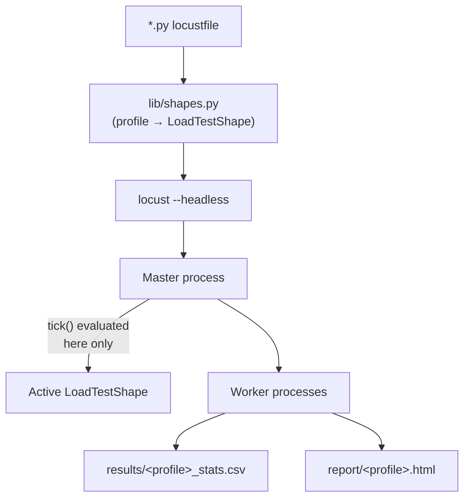
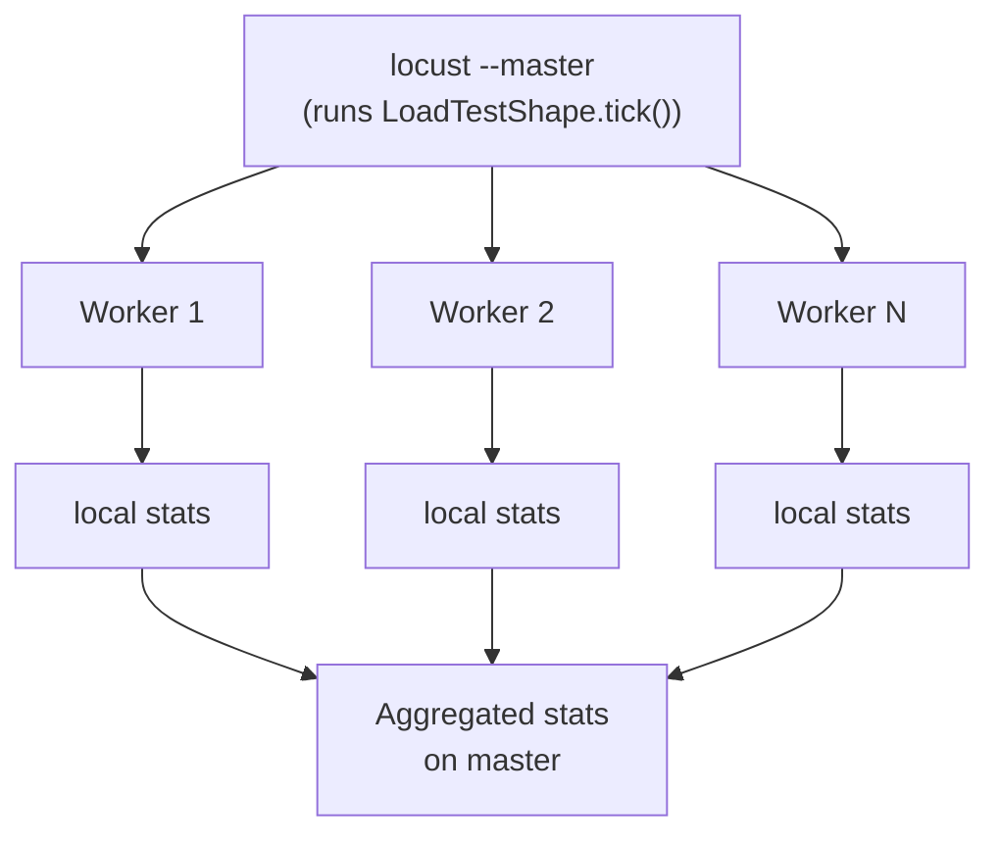

# Locust Guide

Status: Approved | Last Reviewed: 2026-08-13 | Owner: @qe-lead
Catalog ID: TST-014 | Radii
Tier Applicability: T1, T2, T3

## Problem Statement

**Locust's role, stated first.** Locust is the specialist tool in this corpus, chosen only when a
scenario needs bespoke stateful sequencing logic — a saga driven through a specific interleaving
of steps, with a compensating branch when a step fails — or when reusing an existing Python
domain library (a decimal-arithmetic settlement calculator, a signing helper, an internal SDK)
inline in the load script is worth more than the protocol breadth or raw efficiency the other
three tools offer. That role is also where Locust-specific risk concentrates:

- Locust's `User` population is a **closed** workload model: a fixed `--users` count spawned at a
  fixed `--spawn-rate`, each looping its own tasks as fast as `wait_time` allows. Pointed at
  `stress`, `spike`, or `scalability` without a custom `LoadTestShape` written specifically to
  compensate, it reproduces the same closed-model failure
  [TST-003](../strategy/workload-modelling.md#the-rule) documents for the other tools — except
  here the closed model is not a Thread Group habit carried over from JMeter, it is Locust's
  *only* built-in mode, so there is no idiomatic open-model default to fall back on. See
  [Load Shape Control](#load-shape-control-and-the-stress-profile-limitation) below for the
  plain statement of what this means for breakpoint work.
- The default `HttpUser` opens a full `requests`-backed session per simulated user. At a few
  hundred concurrent users this is fine; well past that, per-user thread and connection overhead
  becomes the bottleneck, and the run measures Locust's own resource exhaustion rather than the
  system under test — the fix is `FastHttpUser`, not more generator hosts. See
  [Version and Installation](#version-and-installation).
- Because every simulated user in a Locust process is a gevent greenlet inside one Python
  process, a module-level mutable value (a shared counter, a shared list used as a queue) read or
  written from inside a `@task` method is shared across every greenlet in that process, not
  scoped per user the way an instance attribute is — this produces false contention that looks
  like it came from the system under test but is actually a script bug. See
  [Common Failure Modes](#common-failure-modes).
- `wait_time` controls the pause **between** a user's task iterations; it is not the tool's
  concept of think time *inside* a single multi-step journey, and setting it under the assumption
  it paces the whole population as JMeter's Constant Timer or a fixed spawn rate would produces a
  materially different offered-load shape than intended. See
  [Parameterisation and Correlation](#parameterisation-and-correlation).
- Locust's default failure handling only distinguishes "the task raised" from "the task did not
  raise" — an assertion failure written as a Python `assert` and a genuine script bug (a `KeyError`
  from a malformed synthetic-data row) both surface as an uncaught exception in the Locust log
  unless the script explicitly tells them apart, which means a broken script and a real regression
  can look identical in the run summary. See [Assertions and Thresholds](#assertions-and-thresholds).

## When to Use This Tool

[TST-010](./tool-selection-matrix.md#position-of-each-tool) positions Locust as the **specialist**:
the tool the [TST-010 decision tree](./tool-selection-matrix.md#decision-tree)'s fourth branch
selects only after the first three branches have been exhausted — not the CI-gate `baseline`
profile, no JMeter-only protocol requirement, and no existing Karate contract suite to reuse —
and the scenario genuinely needs bespoke stateful logic or an existing Python domain library.
This guide does not restate that tree or the branches that route to the other three tools; see
[TST-010 § Decision Tree](./tool-selection-matrix.md#decision-tree) for the full branch logic and
[TST-010 § Position Each Tool](./tool-selection-matrix.md#position-of-each-tool) for why this
position is rated "Specialist" rather than "Primary" or "Secondary."

**Stated plainly, because it is easy to miss reaching for Locust out of Python familiarity
alone: Locust is a poor fit for breakpoint (`stress`) testing.** Its workload model is
user-based and closed unless a custom `LoadTestShape` is written specifically to compensate for
that — see [Load Shape Control](#load-shape-control-and-the-stress-profile-limitation). On the
`BEST`/`good`/`fair` scale a §6 Tool Fit table uses (see
[TPL-005](../../templates/test-archetype-template.md)), Locust's rating for `stress` work is
`fair`, never `good` and never `BEST` — the same honest limitation the capability matrix already
states plainly: `closed (fixed --users population; open-model arrival shapes need a custom
LoadTestShape)`. An archetype that needs `stress`, `spike`, or `scalability` coverage and reaches
for Locust anyway because a squad already knows Python should treat that as a deliberate,
documented trade-off, not a default choice.

Every later archetype's §6 Tool Fit table (see
[TPL-005](../../templates/test-archetype-template.md)) that names `locust` primary or preferred
specialises this guide's conventions rather than inventing its own.

## Version and Installation

- **Pinned version.** The `2.31.x` line (currently `2.31.8`). The exact patch version is recorded
  in the run's evidence package per
  [TST-005](../strategy/environments-quality-gates.md#evidence-and-retention); a baseline
  comparison (see [Result Output and Baselining](#result-output-and-baselining)) against a run on
  a different minor line is void, because default statistics aggregation and `LoadTestShape`
  timing have both changed across minor releases.
- **Install method.** Locust is a pure-Python package installed via `pip` into the QE harness
  repository's own virtual environment, pinned in `requirements.txt` (or the `poetry.lock`
  equivalent) rather than installed ad hoc into a shared interpreter — an unpinned `pip install
  locust` on a CI runner drifts independently of this document's pin the same way an OS-packaged
  JMeter or an unpinned `npm install -g` k6 would.
- **`FastHttpUser` versus `HttpUser`.** Both ship in Locust core — neither is a plugin. `HttpUser`
  wraps a `requests`-compatible session per simulated user; it is the more familiar API and the
  right default below a few hundred concurrent users per worker process. `FastHttpUser` wraps
  `geventhttpclient` instead, at a **significantly lower per-user cost** in memory and CPU, and is
  the one to reach for once a scenario's concurrency target approaches or exceeds that threshold —
  see [Common Failure Modes](#common-failure-modes) for what happens when this swap is missed.
  Both expose the same `self.client.get/post/...` calling convention, so switching between them is
  a one-line base-class change, not a script rewrite.
- **Plugin set — `locust-plugins`.** Not part of Locust core. Supplies additional listeners (a
  CSV/JSON results exporter beyond the built-in `--csv` flag), extra wait-time distributions, and
  a small library of `LoadTestShape` implementations (step-ramp, double-wave) that this guide's
  own shapes are modelled on rather than reimplementing from scratch. Pinned as
  `locust-plugins==4.x` alongside the core `locust` pin in the same `requirements.txt`.

**Extension set:**

| Component | Adds | Cost | Warranted when |
|---|---|---|---|
| `FastHttpUser` (core) | Lower per-user memory/CPU via `geventhttpclient` | None — built in, one base-class swap | Target concurrency per worker process is high enough that `HttpUser`'s per-session overhead becomes the bottleneck — see [Worked Example 1](#worked-example-1--synchronous-api-under-load) |
| `locust-plugins` | Extra listeners, wait-time distributions, reusable `LoadTestShape` bases | Additional pinned dependency | A custom `LoadTestShape` or export format is needed beyond Locust core's own `--csv`/`--html` output |

## Project Layout

```text
qe-harness/
├── requirements.txt                  # pins locust==2.31.8, locust-plugins==4.x
├── locust/
│   ├── lib/
│   │   ├── shapes.py                  # profile -> LoadTestShape mapping, see Parameterisation
│   │   └── domain/
│   │       └── ledger_math.py         # reused Python decimal-arithmetic domain library
│   ├── locustfiles/
│   │   ├── synchronous_api.py         # Worked Example 1
│   │   ├── posting_event.py           # Worked Example 2
│   │   └── funds_transfer_saga.py     # Worked Example 3
│   └── data/
│       └── synthetic_accounts.json    # header comment: SYNTHETIC — generated, no real accounts
├── results/                           # --csv export, gitignored
└── report/                            # --html export, gitignored
```



One locustfile per journey, driven by environment variables through `lib/shapes.py`, is the
mechanism behind "one script serves all eight profiles" in
[Parameterisation and Correlation](#parameterisation-and-correlation) below.

## Worked Example 1 — Synchronous API under load

A synthetic balance-enquiry endpoint under the `load` profile. `FastHttpUser` is used here
deliberately, not `HttpUser`, because the `load` profile's target concurrency for this journey
already sits above the threshold where `HttpUser`'s per-session `requests` overhead would start
competing with the system under test for the generator host's own CPU — see
[Version and Installation](#version-and-installation).

```python
from locust import FastHttpUser, task, between
import os

BASE_URL = os.environ.get("LOCUST_BASE_URL", "https://api-perf.internal.example")


class BalanceEnquiryUser(FastHttpUser):
    host = BASE_URL
    wait_time = between(1, 2)  # paces this user's own iterations, not the population arrival rate

    @task
    def balance_enquiry(self):
        account_id = "synthetic-0001"  # header: SYNTHETIC — generated, no real accounts
        with self.client.post(
            f"/v1/accounts/{account_id}/balance",
            catch_response=True,
            name="balance_enquiry",
        ) as response:
            if response.status_code != 200:
                response.failure(f"unexpected status {response.status_code}")
            elif "balance" not in response.json():
                response.failure("response missing balance field")
            else:
                response.success()
```

```bash
LOCUST_BASE_URL="https://api-perf.internal.example" \
  locust -f locust/locustfiles/synchronous_api.py --headless \
  --users 200 --spawn-rate 20 --run-time 15m \
  --csv results/load --html report/load.html
```

## Worked Example 2 — Asynchronous / messaging scenario

A synthetic ledger-posting event, published to a message bus by reusing an existing Python
domain library — `lib/domain/ledger_math.py` — inline, rather than by re-implementing its
decimal-arithmetic settlement logic in a second language the way a JMeter JSR223 script or a
Gatling Scala simulation would need to. This is the differentiator named first in
[Problem Statement](#problem-statement): Locust's `User` base class is not restricted to HTTP,
so the same trusted domain code a settlement service already uses can compute the expected
posted amount right inside the load script.

```python
from locust import User, task, between, events
from lib.domain.ledger_math import compute_expected_balance  # existing Python domain library
import json
import os
import time

from confluent_kafka import Producer  # reused unchanged from the service's own producer wrapper


class PostingEventUser(User):
    wait_time = between(0.5, 1.0)

    def on_start(self):
        self.producer = Producer(
            {"bootstrap.servers": os.environ.get(
                "LOCUST_KAFKA_BOOTSTRAP", "kafka-perf.internal.example:9092",
            )}
        )

    @task
    def post_ledger_event(self):
        account_id = "synthetic-0001"  # header: SYNTHETIC — generated, no real accounts
        opening_balance = "125000.00"
        amount = "12500.00"
        # Reusing the domain library inline avoids re-deriving settlement rounding
        # rules in a second language, per the Role stated in Problem Statement.
        expected_balance = compute_expected_balance(opening_balance, amount)

        start = time.monotonic()
        error = None
        try:
            self.producer.produce(
                "posting-event.synthetic",
                value=json.dumps({
                    "accountId": account_id,
                    "amount": amount,
                    "expectedBalance": str(expected_balance),
                }),
            )
            self.producer.flush(timeout=5)
        except Exception as exc:  # noqa: BLE001 — reported as a request failure, not re-raised
            error = exc
        finally:
            events.request.fire(
                request_type="KAFKA",
                name="post_ledger_event",
                response_time=(time.monotonic() - start) * 1000,
                response_length=0,
                exception=error,
            )
```

```bash
LOCUST_KAFKA_BOOTSTRAP="kafka-perf.internal.example:9092" \
  locust -f locust/locustfiles/posting_event.py --headless \
  --users 50 --spawn-rate 10 --run-time 10m \
  --csv results/spike --html report/spike.html
```

`events.request.fire(...)` is what makes a non-HTTP call participate in Locust's own statistics
and `--csv`/`--html` export the same way `self.client.post(...)` does automatically for
`HttpUser`/`FastHttpUser` — a custom `User` that skips this call runs, but produces no measured
result at all.

## Worked Example 3 — Multi-step saga with a compensating branch

This is the mechanism the whole guide exists to document: a `SequentialTaskSet` drives a
synthetic funds-transfer saga through a specific, ordered interleaving — reserve, debit, credit,
confirm — with per-step assertions, and a compensating branch that fires if the debit step
fails.

```python
from locust import HttpUser, SequentialTaskSet, task, between
import os


class FundsTransferSaga(SequentialTaskSet):
    def on_start(self):
        self.account_id = "synthetic-0001"  # header: SYNTHETIC — generated, no real accounts
        self.transfer_id = None
        self.debit_failed = False

    @task
    def reserve_funds(self):
        with self.client.post(
            f"/v1/accounts/{self.account_id}/reservations",
            json={"amount": "5000.00"},
            catch_response=True,
            name="saga_reserve_funds",
        ) as response:
            if response.status_code != 201:
                response.failure(f"reserve failed: {response.status_code}")
                self.interrupt()  # nothing to compensate yet — abandon the sequence
            self.transfer_id = response.json()["transferId"]
            response.success()

    @task
    def debit_source(self):
        with self.client.post(
            f"/v1/accounts/{self.account_id}/debits",
            json={"transferId": self.transfer_id, "amount": "5000.00"},
            catch_response=True,
            name="saga_debit_source",
        ) as response:
            if response.status_code != 200:
                self.debit_failed = True
                response.failure(f"debit failed: {response.status_code}")
            else:
                response.success()

    @task
    def release_reservation_if_debit_failed(self):
        if not self.debit_failed:
            return  # happy path: nothing to compensate, fall through to credit_destination
        with self.client.post(
            f"/v1/accounts/{self.account_id}/reservations/{self.transfer_id}/release",
            catch_response=True,
            name="saga_compensate_release_reservation",
        ) as response:
            if response.status_code != 200:
                response.failure(f"compensating release failed: {response.status_code}")
            else:
                response.success()
        self.interrupt()  # compensating path taken — do not continue to credit/confirm

    @task
    def credit_destination(self):
        with self.client.post(
            "/v1/accounts/synthetic-0002/credits",
            json={"transferId": self.transfer_id, "amount": "5000.00"},
            catch_response=True,
            name="saga_credit_destination",
        ) as response:
            if response.status_code != 200:
                response.failure(f"credit failed: {response.status_code}")
            else:
                response.success()

    @task
    def confirm_transfer(self):
        with self.client.post(
            f"/v1/transfers/{self.transfer_id}/confirm",
            catch_response=True,
            name="saga_confirm_transfer",
        ) as response:
            if response.status_code != 200:
                response.failure(f"confirm failed: {response.status_code}")
            else:
                response.success()
        self.interrupt()  # saga complete — end this iteration cleanly


class FundsTransferUser(HttpUser):
    host = os.environ.get("LOCUST_BASE_URL", "https://api-perf.internal.example")
    wait_time = between(2, 4)
    tasks = [FundsTransferSaga]
```

```bash
LOCUST_BASE_URL="https://api-perf.internal.example" \
  locust -f locust/locustfiles/funds_transfer_saga.py --headless \
  --users 30 --spawn-rate 5 --run-time 20m \
  --csv results/mixed --html report/mixed.html
```

`SequentialTaskSet` runs `@task`-decorated methods in the order they are declared on the class,
looping back to the first task once the last one completes — `self.interrupt()` is what ends the
current iteration early instead of falling through to the remaining declared tasks, which is how
both the compensating branch and the happy-path completion above avoid running the wrong
downstream steps. Per-step assertions live in each task's own `catch_response` block, exactly the
way [Assertions and Thresholds](#assertions-and-thresholds) describes for a flat `@task` method;
a `SequentialTaskSet` changes only the ordering guarantee, not the assertion mechanism itself.

## Parameterisation and Correlation

**`User`, `TaskSet`, and `SequentialTaskSet`.** These are the three building blocks, and the
choice between them is the actual advantage this guide exists to document:

| Construct | Ordering | Use when |
|---|---|---|
| `User` with flat `@task` methods | Locust picks one `@task` at random (weighted by `@task(n)`) each iteration | The journey has no required step order — [Worked Example 1](#worked-example-1--synchronous-api-under-load) |
| `TaskSet` (nested) | Same weighted-random selection, scoped to a sub-journey | A user's behaviour should be organised into named sub-journeys without a strict step order |
| `SequentialTaskSet` | Declared tasks run strictly in order, looping after the last unless `self.interrupt()` fires | A journey **must** happen in a specific interleaving — a saga, a multi-page checkout, a step-up-auth flow — [Worked Example 3](#worked-example-3--multi-step-saga-with-a-compensating-branch) |

**Correlation.** A value produced by one step and needed by a later step is stored as an instance
attribute on the `User` or `TaskSet` object (`self.transfer_id` in
[Worked Example 3](#worked-example-3--multi-step-saga-with-a-compensating-branch)) — ordinary
Python object state, scoped to that one simulated user for its whole lifetime, with no separate
"extractor" component the way JMeter's Regex/JSON Extractor or Gatling's `saveAs` requires.
Because each simulated user is its own `User`/`TaskSet` instance, this scoping is automatic; the
risk is the opposite failure — reaching for a **module-level** variable instead of `self.<attr>`
and accidentally sharing it across every user in the process, per
[Common Failure Modes](#common-failure-modes). Per-iteration synthetic input data (account IDs,
amounts) is loaded once at import time from `data/synthetic_accounts.json` into a module-level
**read-only** list — safe to share precisely because it is never written to after load, unlike
the mutable-state failure this section warns against.

**Rule:** every data file used this way carries a header comment stating
`SYNTHETIC — generated, no real accounts`, per
[TST-004](../strategy/test-data-management.md), matching the convention shown in
[Worked Example 1](#worked-example-1--synchronous-api-under-load) and
[Worked Example 3](#worked-example-3--multi-step-saga-with-a-compensating-branch).

### Load shape control and the `stress` profile limitation

**`LoadTestShape`** is how one locustfile is driven through all eight
[TST-002](../strategy/performance-test-standard.md) profiles without editing the script itself —
`lib/shapes.py` selects a shape class from an environment variable, mirroring the role
`lib/scenarios.js` plays for k6 and `Injection.scala` plays for Gatling:

```python
from locust import LoadTestShape


class StepRampShape(LoadTestShape):
    """+10% users every 5 minutes — used for the `stress` and `scalability` profiles."""

    step_users = 20
    step_duration = 300  # seconds

    def tick(self):
        run_time = self.get_run_time()
        current_step = run_time // self.step_duration
        return (self.step_users * (current_step + 1), self.step_users)
```

| Profile | Shape mechanism | Model this actually produces |
|---|---|---|
| `baseline` | Fixed `--users`/`--spawn-rate`, no custom shape | closed |
| `load` | Fixed `--users`/`--spawn-rate` held for the run duration | closed |
| `stress` | Custom `LoadTestShape` step-ramping users | **still closed** — see caution below |
| `spike` | Custom `LoadTestShape` ramping to a peak, holding, releasing | **still closed** — see caution below |
| `soak` | Fixed `--users`/`--spawn-rate`, long duration | closed |
| `mixed` | Multiple weighted `TaskSet`/`SequentialTaskSet` classes on one `User` population | closed |
| `scalability` | Custom `LoadTestShape` stepping 25/50/75/100/125% of a baseline user count | **still closed** — see caution below |
| `failover-under-load` | Same shape as the base profile, fault injected mid-run | closed |

**The caution, stated plainly.** A `LoadTestShape` changes how many users are active and how fast
they spawn; it does not change the fact that each active user is still a closed loop, waiting for
its own response before issuing its next request. It cannot manufacture an arrival-rate curve the
way k6's `ramping-arrival-rate` executor or Gatling's `injectOpen` can — it can only step the
*population size* up. For `load`, `soak`, `baseline`, and `mixed`, this distinction rarely
matters in practice. For `stress`, `spike`, and `scalability`, it matters a great deal: per
[TST-003's rule](../strategy/workload-modelling.md#the-rule), these three profiles must run under
an open model, and a `LoadTestShape`-driven population step is, at best, an approximation of one —
good enough when the service's own response time stays roughly flat across the step (offered load
tracks intended load closely), and misleading the moment response time rises, because Locust's
closed loop throttles each user's own request rate as latency rises, the same self-throttling
[TST-003](../strategy/workload-modelling.md#the-rule) warns against for JMeter's default Thread
Group. **This is why Locust is rated `fair`, not `good`, for breakpoint work** — see
[When to Use This Tool](#when-to-use-this-tool). A `stress` run's "knee" measured this way must be
treated as provisional and cross-checked against an open-model tool before it is trusted as the
service's actual breakpoint.

## Assertions and Thresholds

Two mechanisms exist, and — as with the other three tools — they answer different questions, but
Locust's own default behaviour makes the distinction easy to lose:

- **`catch_response=True` plus `response.success()`/`response.failure(...)`**, shown throughout
  the worked examples above, is how a request is marked pass or fail on functional grounds (wrong
  status code, missing field). Without `catch_response=True`, Locust marks any non-2xx/3xx status
  as a failure automatically and success otherwise — adequate for a simple health check, not
  sufficient for the field-level assertions [Worked Example 1](#worked-example-1--synchronous-api-under-load)
  and [Worked Example 3](#worked-example-3--multi-step-saga-with-a-compensating-branch) perform.
- **An uncaught Python exception inside a `@task` method** is what Locust's own summary reports
  as a generic "error," logged with a stack trace, distinct from a `response.failure(...)` call.
  This is where the risk named in [Problem Statement](#problem-statement) lives: a real assertion
  written as a bare `assert expected_balance == actual_balance` and a genuine script bug (a
  `KeyError` on a malformed synthetic-data row) both land in this same bucket. **Rule:** every
  intentional pass/fail check in this corpus's Locust scripts uses `catch_response`/
  `response.failure(...)` (or, for a non-HTTP `User` as in
  [Worked Example 2](#worked-example-2--asynchronous--messaging-scenario), an explicit
  `exception=` argument to `events.request.fire(...)`), never a bare `assert`, so a run's error
  log can be read at a glance as "the harness broke" rather than requiring a stack-trace-by-stack-
  trace audit to tell a regression from a broken script.

**Per-journey pass criteria for `mixed`.** The `name=` keyword argument on
`self.client.post(...)`/`self.client.get(...)` (`"saga_reserve_funds"`,
`"saga_debit_source"`, and so on in [Worked Example 3](#worked-example-3--multi-step-saga-with-a-compensating-branch))
is what groups a request's statistics under a stable label in Locust's own summary and
`--csv`/`--html` export, independent of any path parameters interpolated into the URL. Per
[TST-002's `mixed` profile](../strategy/performance-test-standard.md#mixed) rule, pass/fail is
graded per named journey, never on the blended aggregate alone — the per-`name` rows in the
`--csv` export are what a `mixed`-profile evidence review reads, not the single "Aggregated" row
at the bottom of the report, per [Common Failure Modes](#common-failure-modes).

## Distributed Execution

Locust's distributed model is `--master`/`--worker`, native to core with no plugin required, per
[TST-010's capability matrix](./tool-selection-matrix.md#capability-matrix):



```bash
# master
locust -f locust/locustfiles/synchronous_api.py --master --headless \
  --expect-workers 4 --run-time 15m --csv results/load --html report/load.html

# each of 4 worker hosts
locust -f locust/locustfiles/synchronous_api.py --worker --master-host <master-hostname>
```

**Rule: a custom `LoadTestShape` is evaluated on the master only.** The master process calls
`tick()` and distributes the resulting `(user_count, spawn_rate)` target evenly across every
connected worker; a worker never runs its own copy of the shape's logic. Two consequences follow
directly from this, both of which are common failure modes below:

- The `user_count` a `LoadTestShape.tick()` returns is the **total** across all workers, not a
  per-worker count — a shape hard-coded assuming a fixed worker count silently produces the wrong
  total the moment the worker count changes, because the master divides the same total by whatever
  worker count actually connected.
- If the master process itself is under-resourced relative to the total user count it must
  coordinate (not run — workers do that), it can become a bottleneck in its own right, independent
  of the workers' own headroom; the master's own CPU and network use are recorded in the run's
  evidence package per [TST-005](../strategy/environments-quality-gates.md#evidence-and-retention)
  precisely so this is distinguishable from a worker-side or system-under-test-side ceiling.

## Result Output and Baselining

A run always produces the live web UI when `--headless` is omitted, but that UI is not the
evidence artifact — it is a human-observed convenience with nothing to attach to a review. The
evidence artifacts are the files written by `--csv results/<profile>` (per-request and aggregated
statistics as `_stats.csv`, `_stats_history.csv`, and `_failures.csv`) alongside `--html
report/<profile>.html` (a static, shareable summary), per
[TST-005](../strategy/environments-quality-gates.md#evidence-and-retention) — the same role the
`.jtl`/HTML Dashboard pair plays for JMeter and the `simulation.log`/HTML report pair plays for
Gatling.

**Rule:** a Locust-produced number is never compared against a JMeter-, Gatling-, or k6-produced
number for the same service, per
[TST-010's Cross-Tool Comparability Rules](./tool-selection-matrix.md#cross-tool-comparability-rules) —
Locust's closed, gevent-greenlet-per-user model measures a different thing even from an
open-model tool's superficially similar-looking p95, and the caution in
[Load Shape Control](#load-shape-control-and-the-stress-profile-limitation) applies doubly to a
`stress` comparison. A run becomes an accepted baseline, and a later run is graded as a regression
against it, per the rule in
[TST-002](../strategy/performance-test-standard.md#result-baselining-and-regression) — this guide
does not restate that rule, only the mechanics (`--csv` plus `--html`) that produce the numbers it
grades.

## CI Invocation

```bash
locust -f "locust/locustfiles/${LOCUST_SCRIPT}" --headless \
  --users "${LOCUST_USERS}" --spawn-rate "${LOCUST_SPAWN_RATE}" \
  --run-time "${LOCUST_RUN_TIME}" \
  --csv "results/${LOCUST_PROFILE}" --html "report/${LOCUST_PROFILE}.html"
```

The pipeline stage checks the process exit code and the `_failures.csv` row count — Locust's own
exit code is non-zero only when the harness itself failed to start or connect, not when a
`response.failure(...)` call recorded a functional failure, so a non-empty `_failures.csv` must be
checked explicitly rather than relying on exit code alone, per
[Common Failure Modes](#common-failure-modes).

## Common Failure Modes

- **`HttpUser` used at a concurrency where `FastHttpUser` was needed.** Past a few hundred
  concurrent users per worker process, `HttpUser`'s per-session `requests` overhead competes with
  the system under test for the generator host's own CPU and memory, and the run measures Locust's
  own resource exhaustion, not the service — see [Version and Installation](#version-and-installation).
- **Shared mutable module-level state across users.** A module-level list or counter written to
  from inside a `@task` method is shared by every gevent greenlet in that process — not scoped per
  user — producing contention (or corruption) that looks like it came from the system under test
  but is actually every simulated user racing to mutate the same Python object. State that must
  vary per user belongs on `self`, per [Parameterisation and Correlation](#parameterisation-and-correlation).
- **`wait_time` confused with pacing.** `wait_time` paces one user's own iterations; it does not
  throttle the population's aggregate arrival rate the way a fixed spawn target or an open-model
  executor would. Shortening `wait_time` to "increase load" changes the shape of one user's own
  request cadence, not the total number of users driving the system — the lever for total load is
  `--users`/`--spawn-rate` (or a `LoadTestShape`), not `wait_time`.
- **A custom `LoadTestShape` not accounting for worker count.** Because `tick()` returns a
  **total** user count that the master divides across however many workers actually connected
  (see [Distributed Execution](#distributed-execution)), a shape written and tuned against a
  4-worker topology silently produces a different per-worker load — and therefore a different
  actual offered load — the moment the topology changes to 2 or 8 workers, with no error raised.
- **An uncaught exception counted as a failure without distinguishing a broken script from a real
  assertion failure.** Per [Assertions and Thresholds](#assertions-and-thresholds), a bare
  `assert` and a genuine `KeyError` from malformed synthetic data both surface identically as a
  generic Locust error; a reviewer who treats every entry in the error log as "the service failed"
  can attribute a harness bug to the system under test, or the reverse.
- **A `stress`, `spike`, or `scalability` run's knee trusted without the open-model caveat.** A
  `LoadTestShape`-stepped population is, at best, an approximation of an open-model arrival curve
  — see [Load Shape Control](#load-shape-control-and-the-stress-profile-limitation). Reporting a
  Locust-measured breakpoint with the same confidence a k6 or Gatling open-model run would carry
  overstates what a closed-loop measurement can actually show.

## Compliance Mapping

| Layer | Reference | Section/Control | How this satisfies |
|---|---|---|---|
| Ring 0 | ISTQB test-tool selection guidance | Performance-test tooling / fit-for-purpose tool selection | The explicit `fair`-not-`good` rating for breakpoint work in [When to Use This Tool](#when-to-use-this-tool) and [Load Shape Control](#load-shape-control-and-the-stress-profile-limitation) turns ISTQB's generic fit-for-purpose guidance into a specific, checkable statement rather than an implied endorsement carried over from the tool's general capability. |
| Ring 1 | [Basel BCBS 230](../../compliance/basel-bcbs-230.md) — Principle 9 | Repeatable, evidenced scenario testing | Pinned-version and `--csv`/`--html` evidence rules in [Version and Installation](#version-and-installation) and [Result Output and Baselining](#result-output-and-baselining), together with the master/worker topology recorded per [Distributed Execution](#distributed-execution), make every Locust-run decision a reproducible, admissible artifact rather than an unrecorded local run. |
| Ring 2 | SBV Circular 09/2020/TT-NHNN — §IV.3 ⚠️ (working summary — pending Legal review) | Operational tooling governance | The pinned `requirements.txt` versions for `locust` and `locust-plugins` in [Version and Installation](#version-and-installation) give §IV.3 a documented, provable tooling-governance trail for the exact interpreter environment a run executed in, instead of an ad hoc local `pip install`. |

## Related

- [TST-002 Performance Test Standard](../strategy/performance-test-standard.md)
- [TST-003 Workload Modelling](../strategy/workload-modelling.md)
- [TST-004 Test Data Management](../strategy/test-data-management.md)
- [TST-005 Test Environments and Quality Gates](../strategy/environments-quality-gates.md)
- [TST-010 Test Tool Selection Matrix](./tool-selection-matrix.md)
- [TST-011 JMeter Guide](./jmeter.md)
- [TST-012 Gatling + Karate Guide](./gatling-karate.md)
- [TST-013 k6 Guide](./k6.md)
- [TPL-005 Test Archetype Template](../../templates/test-archetype-template.md)
