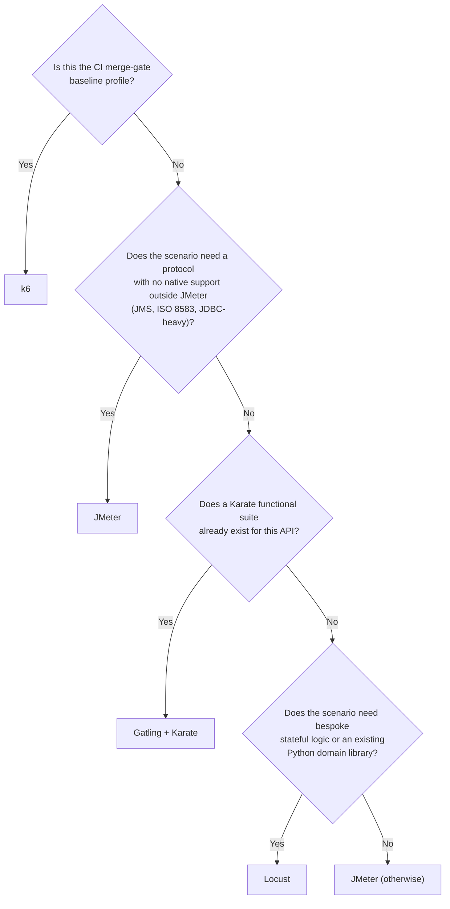

# Tool Selection Matrix

Status: Approved | Last Reviewed: 2026-08-13 | Owner: @qe-lead
Catalog ID: TST-010 | Radii
Tier Applicability: T0, T1, T2, T3

## Problem Statement

- A tool is chosen because a squad already knows it, not because it fits the scenario, so the
  same protocol gap or workload-model mistake is rediscovered independently by every new squad.
- Results produced by two different tools are compared as if they meant the same thing, even
  when one tool defaulted to an open workload model and the other to a closed one — see
  [TST-003](../strategy/workload-modelling.md) for why that comparison is meaningless.
- Protocol gaps — a scenario that needs JMS, ISO 8583, or a Kafka producer — are discovered mid
  engagement, after a harness has already been built around a tool that cannot reach that
  protocol, forcing a late and expensive rewrite.
- Four tools are maintained across the estate with no stated division of labour, so every squad
  re-derives its own answer to "which tool for this job" instead of consulting one normative
  matrix.
- A CI merge-gate is built on a tool that cannot express a pass/fail threshold as code, so the
  gate either can't be automated or is automated by parsing a report file as a fragile proxy for
  a real thresholds-as-code check.

## Position of Each Tool

| Tool | Position | Strongest fit |
|---|---|---|
| JMeter | **Primary.** Canonical recipe in every archetype. | Broadest protocol coverage — JDBC, JMS, Kafka, SOAP, ISO 8583 via samplers — plus distributed master/worker execution and the HTML dashboard. Default for protocol-heavy banking flows. |
| Gatling + Karate | Secondary, highest leverage. | `karate-gatling` reuses the same Karate `.feature` files as both functional API tests and performance scenarios — one artifact, two disciplines. Open model, low resource cost per virtual user. |
| k6 | CI gate. | Thresholds-as-code make it the natural pipeline gate for the `baseline` profile. `xk6` extensions cover Kafka, SQL, and browser. |
| Locust | Specialist. | Bespoke stateful scenario logic, or reuse of existing Python domain libraries that would be awkward in JMX or Scala. |

Every later archetype's §6 Tool Fit table (see [TPL-005](../../templates/test-archetype-template.md))
rates against these same four tools, using the exact lowercase `primary_tool` identifiers this
document establishes: `jmeter`, `gatling-karate`, `k6`, `locust`. "Gatling + Karate" is this
document's human-readable name for the single `gatling-karate` identifier — the two always refer
to the same tool pairing, never to two separately selectable tools.

## Capability Matrix

| Tool | HTTP/REST | SOAP | gRPC | JMS | Kafka | JDBC | ISO 8583 | ISO 20022 | Default workload model | Scripting language | Thresholds-as-code | Distributed execution | Per-VU resource cost | Built-in reporting | Correlation support | Learning curve |
|---|---|---|---|---|---|---|---|---|---|---|---|---|---|---|---|---|
| `jmeter` | native | native | plugin | native | plugin | native | plugin | plugin | closed (see [TST-003](../strategy/workload-modelling.md) for the Concurrency/Arrivals Thread Group plugins needed for open) | Groovy (JSR223) / BeanShell over a GUI-built XML plan | no | native (`-r` master/worker) | high (thread-per-VU) | native (HTML Dashboard Report) | native (Regex/JSON/XPath/Boundary extractors) | moderate (GUI-first; steeper for CI-scripted use) |
| `gatling-karate` | native | plugin | plugin | native | plugin | plugin | no | no | open (default injection profile) | Scala DSL (Gatling) / Gherkin `.feature` (Karate) | native (`assertions` block) | plugin (Gatling Enterprise / FrontLine, commercial) | low (Netty event-loop, non-blocking) | native (Gatling HTML report) | native (`check().saveAs`, Karate JSON-path capture) | moderate for the Scala DSL; low for Karate Gherkin |
| `k6` | native | no | native (`k6/net/grpc`) | no | extension (`xk6-kafka`) | extension (`xk6-sql`) | no | no | open (`arrival-rate` executor is the idiomatic default) | JavaScript / TypeScript | native (`thresholds` block) | plugin (k6 Cloud or the k6 Operator; open-source core is single-node) | low (goroutine-per-VU) | native (end-of-test summary; JSON/CSV export) | native (plain JS destructuring of the response body) | low (JavaScript, familiar to most engineers) |
| `locust` | native | no | plugin (`locust-plugins`) | no | plugin (`locust-plugins`) | no | no | no | closed (fixed `--users` population; open-model arrival shapes need a custom `LoadTestShape`) | Python | plugin (custom `LoadTestShape` / exit-code checks, no first-class DSL) | native (`--master`/`--worker`) | low (gevent greenlets) | native (web UI + CSV/HTML export) | no (manual response parsing in plain Python) | low (Python, familiar to teams with existing domain libraries) |

`no` means no declared first-party or widely adopted community support exists for that
capability — not that the underlying language is theoretically incapable of it. A blank cell in
this table is a defect; every cell above states an explicit value.

## Decision Tree

Every path through this tree terminates at exactly one tool. The tree is evaluated once per
scenario, top to bottom, and the first matching branch wins — a scenario is never left to
resolve to "either of two tools" or to no tool at all.

## Cross-Tool Comparability Rules

- Results produced under different workload models are never comparable, regardless of which
  two tools produced them — an open-model result and a closed-model result answer different
  questions even when their headline numbers look similar. See
  [TST-003](../strategy/workload-modelling.md) for why the two models diverge.
- A baseline established with one tool may only be compared against later runs from that same
  tool and the same tool version — never against a different tool, and never against a later or
  earlier version of the same tool, because per-VU cost and correlation mechanics differ enough
  between versions to invalidate the comparison.
- The tool and its exact version are recorded in the run evidence attached to every gate
  decision, per the environment and gate placement rules in
  [TST-005](../strategy/environments-quality-gates.md) — a result with no recorded tool version
  is not admissible evidence.

## Licensing and Support Posture

All four tools — JMeter, Gatling, Karate, k6, and Locust — are open-source and free to adopt
without a procurement cycle. Where a plugin or extension carries a licence different from its
core tool — for example, Gatling's own core is Apache 2.0 while Gatling Enterprise (used here
only for distributed execution) is commercial, and any `xk6` extension carries its own,
independently declared licence — that plugin's licence is checked at the point of adoption, not
assumed to inherit the core tool's terms. Any new plugin or extension added to this stack
follows the same technology radar intake process as any other dependency.

## Compliance Mapping

| Layer | Reference | Section/Control | How this satisfies |
|---|---|---|---|
| Ring 0 | ISTQB test-tool selection guidance | Tool selection criteria for performance test tools | The [Position of Each Tool](#position-of-each-tool) and [Capability Matrix](#capability-matrix) sections give the criteria ISTQB expects — protocol coverage, workload model, resourcing cost — a documented, comparable answer instead of an ad hoc squad choice. |
| Ring 1 | [Basel BCBS 230](../../compliance/basel-bcbs-230.md) — Principle 9 | Repeatable, evidenced scenario testing | Repeatable, evidenced scenario testing depends on tool determinism: the [Cross-Tool Comparability Rules](#cross-tool-comparability-rules) pin every comparison to a single tool and version, which is the determinism Principle 9 requires. |
| Ring 2 | SBV Circular 09/2020/TT-NHNN — §IV.3 ⚠️ (working summary — pending Legal review) | Operational tooling governance | The [Licensing and Support Posture](#licensing-and-support-posture) section's technology-radar intake requirement gives §IV.3 a documented, provable tooling-governance trail instead of an undocumented plugin choice. |

## Related

- [TST-002 Performance Test Standard](../strategy/performance-test-standard.md)
- [TST-003 Workload Modelling](../strategy/workload-modelling.md)
- [TST-011 JMeter Guide](./jmeter.md)
- [TST-012 Gatling + Karate Guide](./gatling-karate.md)
- [TST-013 k6 Guide](./k6.md)
- [TST-014 Locust Guide](./locust.md)
