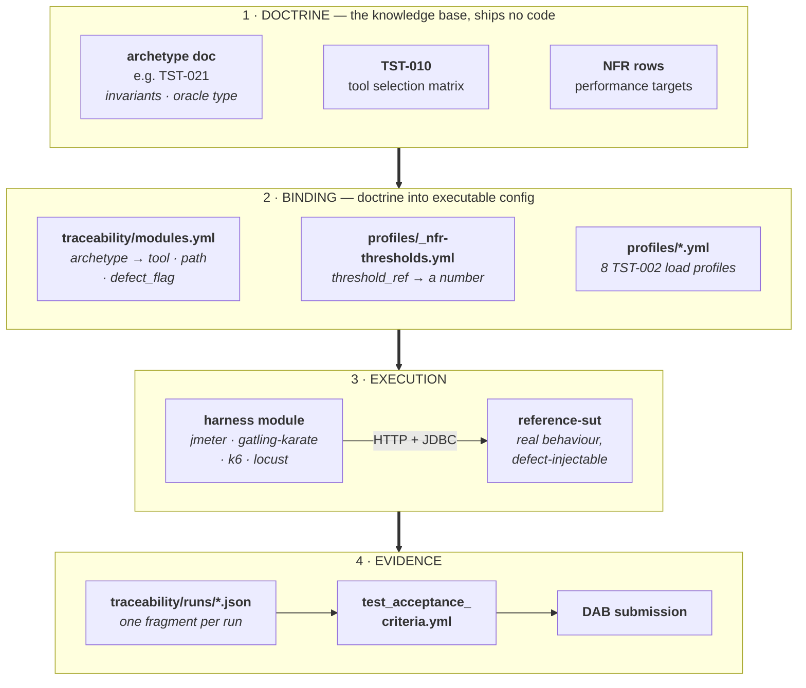

# QE Harness Reference Implementation

Status: Approved | Last Reviewed: 2026-08-24 | Owner: @qe-lead
Catalog ID: TST-016 | Radii
Tier Applicability: T0, T1, T2, T3

## Problem Statement

The Wave 15 testing corpus defines 24 archetypes, four oracle types, and eight performance
profiles, and states plainly that it ships no harness. A QE team could read all of it and still
have nothing to run. This directory is the runnable counterpart: a synthetic reference service
and seven harness modules, one per archetype family, each in the tool
[TST-010](../knowledge-base/testing/tooling/tool-selection-matrix.md) names as its best fit.

## Architecture — How the Pieces Fit

**New here? Read this section first.** It is the map; everything below it is detail.

### In one paragraph

The [testing knowledge base](../knowledge-base/testing/README.md) is **doctrine** — 24 archetype
documents stating what must be true of a system and how to prove it. It ships no code. This
directory is its **runnable counterpart**, and it has four parts: a deliberately-defective
[reference SUT](./reference-sut/) to test *against*; seven [harness modules](./harness/) that do
the testing; one [binding file](./traceability/modules.yml) declaring which module implements
which archetype; and an [evidence chain](./traceability/) that turns a run into the
`test_acceptance_criteria` block a DAB submission requires. Nothing here invents a requirement.
Every invariant and every threshold traces back to a knowledge-base document, and
[one gate](../scripts/validate-harness-coverage.py) fails the build when a trace breaks.

### The four layers



Read it top to bottom: **doctrine** says what to prove, **binding** says who proves it and with
which numbers, **execution** proves it, **evidence** records the proof in the form governance
accepts.

### The gate is what holds the layers together

The layers above are only trustworthy because one script asserts they still agree. Every
`make verify` runs [`validate-harness-coverage.py`](../scripts/validate-harness-coverage.py),
which fails the build on any of these:

| # | Check | Catches |
| --- | --- | --- |
| 1 | Every `modules.yml` archetype resolves to a real archetype document | A module bound to an archetype that does not exist, or was renamed |
| 2 | Each module's `tool` equals TST-010's declared best fit for that archetype | Someone quietly reimplementing a module in a tool the corpus did not choose |
| 3 | Each module `path` exists on disk | A moved or deleted module directory |
| 4 | `coverage: partial` requires a non-empty `partial_reason` | A partial module passing itself off as complete |
| 5 | No 13–19 digit numeric string anywhere under `qe-harness/` | Real card data pasted into seed data or fixtures |
| 6 | Every `threshold_ref` resolves to a real `NFR-*` row **and** an existing heading anchor | A threshold citing an NFR section that has since been renamed |
| 7 | Every `traceability/runs/*.json` validates against `evidence.schema.json` | Fragment drift between the four independent emitters |

Check 7 matters more than it looks. `harness/common/` is JVM, so k6 and Locust cannot use its
evidence emitter — there are four thin emitters instead, one per language. Drift between them is
caught by validating all their output against one schema, not by code review, which will not
catch it reliably. And check 2 is the whole reason this directory sits in the same repo as the
corpus: without a mechanical assertion that harness and doctrine agree, a git submodule would be
the better answer.

### Follow one archetype end to end: TST-021

Every module works the same way. Tracing one is the fastest way to understand all seven.

| Step | Where | What happens |
| --- | --- | --- |
| 1 | [`archetypes/ledger-monetary-invariant.md`](../knowledge-base/testing/archetypes/ledger-monetary-invariant.md) | Doctrine. Catalog ID `TST-021`, applies to patterns `BSP-001`/`BSP-015`/`BSP-016`, declares oracle `invariant-assertion` and invariants I1–I8 in prose. |
| 2 | [`traceability/modules.yml`](./traceability/modules.yml) | Binding. `archetype: TST-021` → `tool: jmeter`, `path: .../tst-021-ledger`, `coverage: full`, `defect_flag: ledger-unbalanced`. The gate checks `jmeter` really is TST-010's declared best fit for this archetype. |
| 3 | [`harness/jmeter/tst-021-ledger/`](./harness/jmeter/tst-021-ledger/) | The module. `plan.jmx` seeds two synthetic accounts, fires 8 concurrent threads × 5 loops at `POST /transfers`, then asserts in a teardown group via `assert-trial-balance.groovy`. Its own [README](./harness/jmeter/tst-021-ledger/README.md) lists the three invariants it actually checks. |
| 4 | [`reference-sut/`](./reference-sut/) | The target. A real double-entry ledger on Postgres — one DB transaction per transfer — so a concurrent transfer storm can *genuinely* break the trial balance if the code is wrong. |
| 5 | `traceability/runs/<ts>-TST-021.json` | The evidence. One fragment carrying `archetype`, `oracle`, `result`, each invariant's `id`/`description`/`result`, and every threshold's `threshold_ref`. Shape is fixed by [`evidence.schema.json`](./traceability/evidence.schema.json). |
| 6 | `traceability/test_acceptance_criteria.yml` | The aggregate. [`bin/merge-fragments.py`](./bin/merge-fragments.py) merges all fragments into the single block `TST-001` defines. Generated, so it is gitignored — run `make run-all` to produce it. |

Then the part that makes it trustworthy:

```
make run ARCH=TST-021    # against the clean SUT  → MUST pass
make run-defects         # with ledger-unbalanced injected → MUST fail
```

Each module is paired with a **defect flag** — a real behaviour change the SUT can be told to
adopt over HTTP (`POST /_test/defect/ledger-unbalanced` makes `TransferService` skip the credit
leg of every transfer). A module that cannot detect its own paired defect is not a test, so
`make run-defects` asserts all seven fail. This is the harness testing *itself*, and it is why
the SUT is bundled rather than pointed at a real service.

### What each layer owns

| Layer | Lives in | Owns | Generated? |
| --- | --- | --- | --- |
| Doctrine | `../knowledge-base/testing/` | Archetypes, invariants, oracle types, tool selection, NFR targets | No — hand-authored, governed |
| Binding | [`traceability/modules.yml`](./traceability/modules.yml) | archetype → tool, path, coverage, defect flag | No — hand-maintained |
| Thresholds | [`profiles/_nfr-thresholds.yml`](./profiles/_nfr-thresholds.yml) | Numbers, each citing an `NFR-####anchor` | No — hand-maintained |
| Load profiles | `profiles/baseline.yml` … (8 files) | Workload shape per [TST-002](../knowledge-base/testing/strategy/performance-test-standard.md) profile | No |
| SUT | [`reference-sut/`](./reference-sut/) | Java 21 + Spring Boot service, 15 capabilities implemented, 24 declared | No |
| Modules | [`harness/`](./harness/) | The tests, in 4 tools across 3 build systems (Maven, npm, pip) | No |
| Run fragments | `traceability/runs/*.json` | One record per module run | **Yes** — by the modules |
| Coverage table | [`traceability/harness-coverage.md`](./traceability/harness-coverage.md) | 24-row status view | **Yes** — `render-harness-coverage.py` |
| Aggregate | `traceability/test_acceptance_criteria.yml` | The DAB evidence block | **Yes** — `merge-fragments.py`; gitignored |

The `Makefile` is the single façade over all three build systems, so `make up && make run-all`
works regardless of which language a module is written in. They are deliberately *not* unified —
see [§4.3 of the design doc](../docs/superpowers/specs/2026-08-24-wave-16-qe-harness-design.md).

### Which module, which tool, which oracle

| Family | Archetype | Tool | Oracle |
| --- | --- | --- | --- |
| A — Correctness & State | TST-021 Ledger & Monetary Invariant | JMeter | invariant-assertion |
| B — Messaging & Integration | TST-030 Contract & Schema Compatibility | Gatling + Karate | contract-schema |
| C — Load & Capacity | TST-031 Rate Limit, Throttle & Breakpoint | JMeter | invariant-assertion |
| D — Resilience | TST-035 Fault Injection & Graceful Degradation | JMeter | invariant-assertion |
| E — Data | TST-039 Data Quality & Reconciliation | Locust | confusion-matrix |
| F — Security | TST-040 AuthN/AuthZ Matrix & Token Lifecycle | JMeter | invariant-assertion |
| G — Observability & Client | TST-043 Client Experience & Perf Budget | k6 | invariant-assertion |
| A — Correctness & State | TST-020 Idempotency & Replay | JMeter | invariant-assertion |
| A — Correctness & State | TST-023 Concurrent Limit & Counter | JMeter | invariant-assertion |
| B — Messaging & Integration | TST-026 Message Transformation & Routing | JMeter | contract-schema |
| B — Messaging & Integration | TST-027 Ordering & Resequencing | JMeter | invariant-assertion |
| B — Messaging & Integration | TST-028 Fan-out / Fan-in Correlation | JMeter | invariant-assertion |
| B — Messaging & Integration | TST-029 Delivery Guarantee, Retry, DLQ | JMeter | invariant-assertion |
| C — Load & Capacity | TST-034 Blended Journey Workload | JMeter | invariant-assertion |
| E — Data | TST-037 Read-Model Convergence & CDC Lag | JMeter | invariant-assertion |

Wave 16 seeded one archetype per family; Wave 17 completed Family B and deepened A, C and E, so
15 of the 24 archetypes now have runnable modules. All four tools and three of the four oracle
types are exercised.
`golden-dataset` is not implemented — no family representative uses it as primary oracle; it
lands with `TST-022` or `TST-038` in a later wave. `TST-039` uses Locust rather than JMeter
because [its archetype document §6](../knowledge-base/testing/archetypes/data-quality-reconciliation.md)
justifies that departure; the harness follows the corpus where the corpus deliberately departs
from the default.

### Three names that mean more than one thing

These trip up every new reader. Worth 60 seconds now.

- **`TST-###` is a catalog-row ID, not an archetype ID.** `TST-001`–`TST-009` are strategy
  documents, `TST-010`–`TST-014` are tooling guides, **`TST-016` is this harness itself**,
  `TST-017`–`TST-019` are reserved, and only **`TST-020`–`TST-043` are the 24 archetypes**.
  `evidence.schema.json` enforces the archetype range mechanically via the pattern
  `^TST-0[2-4][0-9]$`.
- **"Profile" means three different things**, sometimes on adjacent lines: a **Spring** profile
  (`@Profile("!prod")`), a **Docker Compose** profile (`make up PROFILES=core`), and a
  **TST-002 performance** profile (`profiles/load.yml`). Check which one is meant.
- **Invariant IDs in a fragment are module-local.** A fragment's `I1` is the first invariant
  *that module* asserts, listed in the module's own README — it is not an index into the
  archetype document's numbering. TST-021's archetype declares I1–I8; its module asserts three,
  renumbered I1–I3.

### Where to look next

| You want to… | Go to |
| --- | --- |
| Run something immediately | [Quick Start](#quick-start) below |
| Know what is and is not implemented | [`traceability/harness-coverage.md`](./traceability/harness-coverage.md) |
| Understand one module in depth | That module's own `README.md` under [`harness/`](./harness/) |
| Know why it is built this way | [Wave 16 design doc](../docs/superpowers/specs/2026-08-24-wave-16-qe-harness-design.md) — decisions, rejected alternatives |
| Add a module for a new archetype | Add a row to `modules.yml`, create the module dir, emit a schema-valid fragment, then `make verify` |
| Understand the doctrine itself | [Testing knowledge base README](../knowledge-base/testing/README.md) |

## Copying This Reference Implementation Into a Real Service

This SUT exposes unauthenticated test-control endpoints: `POST /_test/defect/{flag}` and
`DELETE /_test/defect` (`DefectController`), `POST /_test/token/expired` (`TokenExpiryTestController`
— mints a signed token for **any** role, including `admin`), `POST /_test/reset/ratelimit`
(`RateLimitResetController`), and `POST /auth/token` (`TokenController` — also mints a token for
any role, with no credential check at all). `SecurityConfig` permits all of these by design —
only `/protected/**` is access-controlled — because this SUT's entire purpose is to be
deliberately test-controllable.

Each of those four controllers is annotated `@Profile("!prod")`: they register in every Spring
profile **except** one explicitly named `prod`. Today that is a no-op — no environment this
harness runs in (locally or in `docker-compose.yml`) ever activates a `prod` profile — but it is
the only mechanical guard these endpoints have. **If you copy `capability/authz/`,
`DefectController`, or `RateLimitResetController` into a real service, you MUST do one of the
following**, or you ship an unauthenticated admin-token minter next to a production-shaped Spring
Security config:

- Delete these controllers entirely, or
- Ensure `prod` (or your real-environment's equivalent profile) is always active in that
  deployment, so `@Profile("!prod")` actually excludes them.

A code comment is not an enforcement mechanism; `@Profile("!prod")` is the enforcement mechanism,
and it only works if a real deployment actually activates a profile it excludes.

## Quick Start

    make up          # start the SUT and the infrastructure its modules need
    make verify      # run the gates — no containers required
    make run ARCH=TST-021
    make run-all     # all seven modules against the clean SUT
    make run-defects # all seven modules against their injected defects; each MUST fail

## Scope

Seven of the 24 archetypes are implemented. `GET /_capabilities` lists all 24; the other 17
answer `501` with their archetype ID. Waves 17+ fill those in.

`TST-043` is **partial**: it covers perf budget, cache correctness, conditional requests, and
compression. Its offline-sync invariants need a client application, which this repository does
not contain.

## What the Threshold Gate Does Not Prove

Performance targets are never hardcoded here. Each cites an `NFR-*` row and anchor in
`profiles/_nfr-thresholds.yml`. The gate proves **the citation resolves** — that the row and
anchor exist. It does **not** prove the number matches the NFR document's prose, because that
would mean parsing Markdown for numeric values. A human owns number accuracy; the gate owns the
citation.

## Smoke Mode

In CI, `TST-031` and `TST-035` run in smoke mode: correctness invariants are asserted, and every
performance threshold is recorded `not-evaluated`. A shared CI runner cannot produce meaningful
latency figures, and a green pipeline must never imply that performance was validated. Full-load
runs happen on a dedicated environment via the nightly or manual job.

## Pinned Versions

Resolved from Maven Central on 2026-08-24 (`mvn -q -N help:effective-pom`, plus
`maven-metadata.xml` lookups for each coordinate below — see Task 1's report for the exact
commands). Every subsequent task uses these exact versions; do not float them without updating
this table.

| Tool | Version | Lockfile |
| --- | --- | --- |
| Java (compiler release) | 21 (`maven.compiler.release`, pinned regardless of installed JDK) | `qe-harness/harness/pom.xml` |
| Spring Boot | 3.5.16 (`org.springframework.boot:spring-boot-starter-parent`, latest 3.x GA — pinned to the 3.x line over newer 4.x for its long, unambiguous compatibility record with Resilience4j, Testcontainers, springdoc-openapi, Flyway, and Spring Security resource-server, all needed by later tasks) | `qe-harness/reference-sut/pom.xml` (Task 5) |
| Apache JMeter | 5.6.2 engine (`org.apache.jmeter:ApacheJMeter`) via `jmeter-maven-plugin` 3.8.0's own default (`com.lazerycode.jmeter:jmeter-maven-plugin`) — confirmed against the actually-resolved artifacts in `~/.m2`, not the plugin's own docs, which reference 5.6.3 | `qe-harness/harness/jmeter/pom.xml` (Task 16) |
| Gatling | **3.9.5** engine (`io.gatling.highcharts:gatling-charts-highcharts`), NOT the true latest release (`3.15.1`, re-checked on 2026-09-01 as still Maven Central's `<release>`/`<latest>`) — `karate-gatling:1.4.1` (below) is genuinely BINARY-INCOMPATIBLE with 3.15.1 (confirmed empirically, not merely a dependency-mediation issue: `ProtocolComponentsRegistry.components`'s erased return type changed between the two engine releases, so karate-gatling 1.4.1's compiled bytecode throws `NoSuchMethodError` at the first real Gatling run against 3.15.1, even after fixing a separate, real netty-version-mediation issue along the way — see "Known Issues" below for the full story). 3.9.5 is karate-gatling 1.4.1's own originally-tested transitive default, and is the newest version confirmed by an actual successful load run (`OK=2 KO=0` against the reference SUT, including correctly detecting the `schema-drift` defect). Run via `gatling-maven-plugin` **4.21.11** (`io.gatling:gatling-maven-plugin`) — re-checked on 2026-09-01: Maven Central's `<release>`/`<latest>` (`4.21.10` was current at Task 1's original resolution but a newer patch shipped since); the plugin version is decoupled from the engine version in Gatling's own numbering and 4.21.11 drives the 3.9.5 engine successfully. | `qe-harness/harness/gatling-karate/pom.xml` (Task 20) |
| Karate | 1.4.1 (`com.intuit.karate:karate-junit5` and `com.intuit.karate:karate-gatling`, matched pair) — re-checked on 2026-09-01: still Maven Central's `<release>`/`<latest>` for both artifacts. See "Known Issues" below for a real JDK-version constraint this pairing has on the forked test JVM, and for karate-gatling 1.4.1's own binary-incompatibility ceiling on the Gatling engine version. | `qe-harness/harness/gatling-karate/pom.xml` (Task 20) |
| Testcontainers | 1.21.4 (`org.testcontainers:junit-jupiter`, `org.testcontainers:postgresql`) — resolved from `maven-metadata.xml` on 2026-08-25. The true latest on Maven Central is `2.0.5`, but that major renamed its module artifacts (`org.testcontainers:testcontainers-postgresql`, `org.testcontainers:testcontainers-junit-jupiter`) and was not evaluated for compatibility with the pinned Spring Boot 3.5.16 line. 1.21.4 is the newest version on the old artifact coordinates and is also the exact version Spring Boot 3.5.16's own `spring-boot-dependencies` BOM manages (`testcontainers.version`), so no explicit `<version>` is set in the reference SUT's POM — it comes transitively from the parent, the same pattern already used for `spring-boot-starter-web`/`-test`. | `qe-harness/reference-sut/pom.xml` (Task 6) |
| JJWT | 0.13.0 (`io.jsonwebtoken:jjwt-api`/`-impl`/`-jackson`) — resolved from `maven-metadata.xml` on 2026-08-25 as the current latest release. Not managed by Spring Boot's `spring-boot-dependencies` BOM (unlike `spring-boot-starter-security`, which needs no explicit version), so all three artifacts pin this version explicitly, the same pattern already used for `org.postgresql:postgresql`. | `qe-harness/reference-sut/pom.xml` (Task 9) |
| springdoc-openapi | 2.9.0 (`org.springdoc:springdoc-openapi-starter-webmvc-api`) — resolved from `maven-metadata.xml` on 2026-08-25 as the newest release on the 2.x line; the true latest, `3.1.0`, targets Spring Boot 4 and was not evaluated against this repo's pinned 3.5.16. Not managed by the `spring-boot-dependencies` BOM, so pinned explicitly, same pattern as JJWT. | `qe-harness/reference-sut/pom.xml` (Task 10) |
| json-schema-validator | 1.5.9 (`com.networknt:json-schema-validator`, test scope), NOT the true latest release (`3.0.7`, resolved from `maven-metadata.xml` on 2026-08-25) — `2.0.0` replaced the `JsonSchemaFactory`/`JsonSchema`/`ValidationMessage` API `SchemaCompatibilityTest` needs with an incompatible `Schema`/`Error`-based rewrite (confirmed directly: neither the `3.0.7` nor the `2.0.7` jar contains any of those four classes). `1.5.9` is the newest release still on the 1.x line, and the newest release that actually has the API this test code calls. | `qe-harness/reference-sut/pom.xml` (Task 10) |
| resilience4j | 2.4.0 (`io.github.resilience4j:resilience4j-spring-boot3`) — resolved from `maven-metadata.xml` on 2026-08-25 as the current latest release. Not managed by the `spring-boot-dependencies` BOM, so pinned explicitly, same pattern as JJWT/springdoc. Pulls in `resilience4j-spring6` (the `@CircuitBreaker` annotation + Spring Boot config binding) transitively at the same version. `spring-boot-starter-aop` (needed for the AOP proxy the annotation is woven through) IS managed by the BOM (verified via `mvn -N help:effective-pom`: `3.5.16`), so it carries no explicit version. | `qe-harness/reference-sut/pom.xml` (Task 11) |
| Python (interpreter) | 3.13 (Homebrew `python@3.13`), NOT the true latest available (`3.14`, the default `python3` on PATH on this host) — confirmed empirically that this module's entire pinned dependency set (below) installs and runs cleanly under 3.13, and `bin/run-locust.sh` explicitly prefers an installed 3.13/3.12/3.11 over plain `python3` for exactly this reason (locust's own gevent/greenlet dependency lags behind CPython's very latest release on some platforms). | `qe-harness/harness/locust/` (Task 21) |
| Locust | 2.46.4 (`locust`) — resolved via `pip index versions locust` on 2026-09-01 against a fresh Python 3.13 venv, as the current latest release. | `qe-harness/harness/locust/requirements.txt` (Task 21) |
| jsonschema | 4.26.0 (`jsonschema`) — resolved via `pip index versions jsonschema` on 2026-09-01, current latest release; supports Draft 2020-12, the draft `evidence.schema.json` (Task 2) itself declares. | `qe-harness/harness/locust/requirements.txt` (Task 21) |
| requests | 2.34.2 (`requests`) — resolved via `pip index versions requests` on 2026-09-01, current latest release. | `qe-harness/harness/locust/requirements.txt` (Task 21) |
| psycopg2-binary | 2.9.12 (`psycopg2-binary`) — resolved via `pip index versions psycopg2-binary` on 2026-09-01, current latest release. Used only for `tst_039_recon/recompute.py`'s direct-to-Postgres independent recomputation (the same database `qe-harness/docker-compose.yml`'s `postgres` service publishes to the host, for the same reason `LEDGER_JDBC_URL` already does for the jmeter modules). | `qe-harness/harness/locust/requirements.txt` (Task 21) |
| pytest (Python) | 8.4.2 (`pytest`) — resolved via `pip index versions pytest` on 2026-09-01; the true latest, `9.1.1`, was not evaluated for compatibility with the rest of this pinned set, so the newest 8.x release was chosen instead (same "not the true latest, pinned for a compatibility reason" pattern this table already uses for Gatling/Testcontainers/springdoc/json-schema-validator above). | `qe-harness/harness/locust/requirements.txt` (Task 21) |
| k6 | 2.2.0 (`k6`, Homebrew `k6` formula) — installed via `brew install k6` on 2026-09-01, current stable release; a Go binary, not an npm package, so it is not in `package.json`. | `qe-harness/bin/run-k6.sh` (Task 22) |
| ajv | 8.20.0 (`ajv`) — resolved via `npm view ajv version` on 2026-09-01, current latest release; supports Draft 2020-12 via its dedicated `ajv/dist/2020` entry point (the plain default export only understands draft-07 — confirmed empirically, see `harness/k6/emitter.js`'s own comment), matching the draft `evidence.schema.json` (Task 2) itself declares. | `qe-harness/harness/k6/package.json` (Task 22) |
| jest | 30.5.1 (`jest`) — resolved via `npm view jest version` on 2026-09-01, current latest release. | `qe-harness/harness/k6/package.json` (Task 22) |

## Known Issues

### gatling-karate (TST-030): Karate 1.4.1's `Suite#run` hangs forever on JDK 25

`mvn -pl gatling-karate test` (Task 20, TST-030) hangs **indefinitely, with no error and no
CPU use**, when the JDK actually forking the Surefire test JVM is as new as JDK 25 — confirmed
empirically: identical test code, only the JDK invoking Maven changed, reproduces/fixes this
deterministically. `jstack` on the hung process shows the main thread permanently parked in
`CompletableFuture.join()` inside `com.intuit.karate.Suite#run` (called from
`Runner.Builder#parallel`, which `Tst030ContractRunner` calls directly), with no Karate worker
thread ever scheduled. This is the same shape of problem `run-jmeter.sh` already documents for
JMeter's bundled Groovy vs. too-new a JDK — Karate 1.4.1 (2023) was never tested against a JDK
this new — just surfacing as a silent hang here instead of a loud "Unsupported class file major
version" error, which makes it easy to mistake for the test suite (or the SUT) being stuck.

**JDK 21 is confirmed working.** Point Maven at it, either by launching Maven itself under JDK 21:

    JAVA_HOME="$(/usr/libexec/java_home -v 21)" mvn -pl gatling-karate test

or, if Maven itself must stay on a newer JDK, by overriding the forked test JVM only via the
module's own escape-hatch property (see `qe.gatlingKarate.javaRuntime` in
`gatling-karate/pom.xml`):

    mvn -pl gatling-karate test "-Dqe.gatlingKarate.javaRuntime=$(/usr/libexec/java_home -v 21)/bin/java"

Both `Tst030ContractRunner`'s three tests pass cleanly (`Tests run: 3, Failures: 0, Errors: 0`
— the brief's two given proof tests plus one added clean-SUT baseline; see the module's own
README) under JDK 21; neither the reference SUT nor the harness code itself is
JDK-25-incompatible, only Karate 1.4.1's own `Suite#run` on the JVM actually running the test.
`bin/run-gatling-karate.sh` resolves this automatically (same `/usr/libexec/java_home -v
21`/`17` fallback `bin/run-jmeter.sh` uses for its own, unrelated JDK constraint), so
`./bin/run-module.sh TST-030` needs no manual `JAVA_HOME` juggling.

### gatling-karate (TST-030): karate-gatling 1.4.1 is binary-incompatible with Gatling 3.15.1

Running the actual Gatling load run (`mvn -pl gatling-karate
io.gatling:gatling-maven-plugin:4.21.11:test
-Dgatling.simulationClass=...Tst030Simulation`) surfaced two *separate* problems, only the
first of which a dependency-management fix can paper over:

1. **A real netty-version-mediation conflict** (now fixed, kept fixed even though it stopped
   being strictly necessary once the engine itself was downgraded — see below — because it is
   good hygiene regardless): `karate-junit5`'s transitive `com.linecorp.armeria:armeria`
   pulls `io.netty:netty-transport:4.1.96.Final`, which Maven's nearest-wins mediation
   resolves ahead of Gatling's own `4.2.14.Final`, while several *other* netty-* artifacts
   resolve to `4.2.14.Final` — a genuinely incompatible mixed-version classpath. At runtime
   this produced `NoClassDefFoundError: io/netty/channel/IoOps` inside
   `io.gatling.netty.util.Transports`'s static initializer (`IoOps` exists only in the 4.2.x
   netty-transport jar). **This is the true root cause** — an earlier version of this
   writeup incorrectly blamed suppressed `netty_tcnative` native-library warnings logged just
   before that error (real, but non-fatal noise from an unrelated native-SSL fallback path,
   not OS/arch-specific as first assumed).
2. **A genuine binary incompatibility between karate-gatling 1.4.1 and Gatling 3.15.1**,
   confirmed only after fixing (1): the run still crashed with `NoSuchMethodError:
   'java.lang.Object io.gatling.core.protocol.ProtocolComponentsRegistry.components(...)'`
   inside `com.intuit.karate.gatling.KarateFeatureActionBuilder.build`. Gatling's own
   (internal, non-DSL) `ProtocolComponentsRegistry.components` method's erased return type
   changed between whatever engine version karate-gatling 1.4.1 was built against
   (~3.9.x-4.3.x, per its own reference POM, last published ~2023) and 3.15.1 — karate-gatling
   1.4.1's compiled bytecode still calls the old erasure, and no newer karate-gatling release
   exists on Maven Central to fix this from the other side.

**Resolution:** `gatling-karate/pom.xml` pins the Gatling engine
(`io.gatling.highcharts:gatling-charts-highcharts`) to **3.9.5** — karate-gatling 1.4.1's own
originally-tested pairing — rather than the newer 3.15.1 (see the Pinned Versions table
above). Confirmed by an actual successful load run: both scenarios execute against the real
reference SUT (`POST /v1` and `/v2/transfers`, `OK=2 KO=0`), and with the `schema-drift`
defect active beforehand, the v2 scenario correctly reports `KO` while v1 stays `OK` — the
same defect proof the Karate side demonstrates, now demonstrated on the Gatling side too, with
an `oracle: contract-schema` evidence fragment emitted either way. `gatling-maven-plugin`
itself stays at the newer 4.21.11 (see the Pinned Versions table): the plugin and engine
versions are decoupled in Gatling's own numbering, and 4.21.11 drives the 3.9.5 engine
successfully.

If a future task needs the newer 3.15.1 engine for gatling-karate specifically, check Maven
Central for a `karate-gatling` release newer than 1.4.1 first — bumping the engine alone
without one will reproduce this exact `NoSuchMethodError`.

### Running the Testcontainers-backed tests on a non-Docker-Desktop engine

`SyntheticDataSeederTest` (Task 6) needs a real Docker API endpoint. Testcontainers'
auto-detection assumes Docker Desktop's default socket; on an engine registered as a different
Docker context (e.g. Rancher Desktop), point it at that context's socket explicitly:

    export DOCKER_HOST="$(docker context inspect <context-name> --format '{{.Endpoints.docker.Host}}')"
    export TESTCONTAINERS_RYUK_DISABLED=true   # see below

Without `DOCKER_HOST` set, Testcontainers fails immediately with "Could not find a valid Docker
environment" even though `docker info` succeeds, because it only probes the default Docker
Desktop socket path and context, not whatever `docker context show` currently reports.

`TESTCONTAINERS_RYUK_DISABLED` is needed because Ryuk (Testcontainers' container reaper) bind-mounts
the host's Docker socket into its own container to watch for JVM death; on an engine that runs
containers inside a VM (Rancher Desktop's Lima/QEMU VM, colima, etc.) that host-path bind-mount
doesn't resolve the same way it does for Docker Desktop, and Ryuk's own container fails to start.
Disabling it means containers aren't auto-reaped if the JVM crashes mid-test — acceptable for a
local run, worth reconsidering for a CI runner on the same kind of engine.

Neither of these is set in this repo (both are host/engine-specific, not project config); the
reference SUT's own `pom.xml` does carry one related, engine-agnostic fix: the surefire plugin
sets `-Djava.net.preferIPv4Stack=true`, plus the test itself sets `Flyway`'s `connectRetries`, to
absorb a real observed race on this kind of engine — see the comments in `pom.xml` and
`SyntheticDataSeederTest.java` for the failure mode each one fixes.

### `docker compose down -v` matches nothing without `--profile`

Found during Task 14's compose verification and confirmed deterministically reproducible (not an
environment flake): every service in `qe-harness/docker-compose.yml` is profile-gated -- none is
profile-less. Compose resolves which services `down` applies to the same way it resolves `up`'s
scope: from `--profile`/`COMPOSE_PROFILES`, not from "whatever containers are currently running".
A bare `docker compose down -v` therefore enables zero profiles, matches zero services, and exits
`0` having removed nothing -- indistinguishable from success by exit code alone. Confirmed by
direct A/B: with `qe-harness-postgres-1`/`qe-harness-reference-sut-1` running, a bare `down -v`
left both up (three times in a row); `docker compose --profile core --profile resilience
--profile observability --profile messaging down -v` removed both containers plus the volume and
network on the first try, every time.

`make down` (Task 14) always passes every profile this file declares
(`ALL_PROFILES` in the Makefile) to `down`, so it matches everything `up` could have started
regardless of which `PROFILES` value `up` was originally given. As a last-resort safety net for
any other reason `down` might still leave something behind, it also force-removes anything still
carrying the `com.docker.compose.project=qe-harness` label afterward:

    docker rm -f $(docker ps -aq --filter label=com.docker.compose.project=qe-harness)
    docker volume rm $(docker volume ls -q --filter label=com.docker.compose.project=qe-harness)
    docker network rm $(docker network ls -q --filter label=com.docker.compose.project=qe-harness)

This matters beyond `make down` itself: Task 23's `run-defects.sh` needs a clean SUT between the
baseline and defect-injection runs, and Task 27's CI job needs a clean runner between pipeline
stages -- either calling `docker compose down -v` directly without `--profile` would silently
inherit this same no-op.

### k6 (TST-043): `ajv` cannot run inside k6's own sandboxed JS engine

Confirmed empirically (Task 22): a k6 script cannot `import`/`require` `ajv` (or, by the same
mechanism, any other npm package whose own internal module graph relies on Node's full
module-resolution algorithm — relative, extension-less `require`s, package.json `main`/`exports`
resolution). k6 scripts run inside k6's own sandboxed JS engine (goja), which implements a much
simpler loader; attempting `import Ajv from './node_modules/ajv/dist/ajv.js'` from a k6 script
fails immediately with:

    GoError: The moduleSpecifier "./core" couldn't be found on local disk.

A trivial local CommonJS module (a single file, `module.exports = {...}`, no further requires of
its own) imports into a k6 script without issue — this is specifically about a real npm package's
own multi-file module graph, not about k6 rejecting `require`/`import` outright.

This is why `harness/k6/tst-043-clientexp/script.js` never calls `emitFragment` (`harness/k6/
emitter.js`) itself, unlike every other module's tool-native script, which calls its own
in-process emitter directly. Emission is split into two processes instead — see that module's own
README ("Why emission is a separate Node step") for the full write-up: k6 writes a raw report via
`handleSummary`; a plain `node` invocation (`write-fragment.js`) then calls `emitFragment` for
real, with real `ajv`, and writes the actual fragment. `k6`'s own `__ENV` (which transparently
inherits the parent process's real OS environment variables, confirmed empirically, not only
`-e`-flag values) is what lets `bin/run-k6.sh` hand a value resolved from `profiles/
_nfr-thresholds.yml` — itself parsed by `python3`+`PyYAML`, also unavailable inside k6's sandbox —
across that same process boundary, for I4's payload-budget check.

## TST-040 Clock-Skew Tolerance

`app.authz.clock-skew-seconds` (`qe-harness/reference-sut/src/main/resources/application.properties`)
is the *declared* tolerance the reference SUT's token validator (`JwtService`, Task 9) is actually
configured with — it is wired straight into JJWT's own `JwtParserBuilder#clockSkewSeconds(...)`, so
the running validator enforces exactly this number, never a different one. `TokenLifecycleTest`'s
`expiredTokenIsNotAcceptedBeyondDeclaredSkew` measures the SUT's real maximum accepted `exp` offset
by presenting progressively staler tokens and asserts that *measured* value against this property —
never the other way around, and never a hardcoded literal in the test — per this corpus's rule that
performance/tolerance thresholds are asserted against declared configuration, not duplicated as
literals. This one is not a performance threshold (it does not gate on latency or throughput), so
unlike the `NFR-*`-cited thresholds elsewhere in this harness it carries no `NFR-*` citation.

Task 19's `harness/jmeter/tst-040-authz` module runs the equivalent measurement out-of-process,
over real HTTP, via a small test-control door (`TokenExpiryTestController`,
`POST /_test/token/expired`) added to `reference-sut` for exactly this purpose — see that
module's own README for why an HTTP door was needed at all (`JwtService#mintExpiredAccessToken`
has no HTTP surface of its own, deliberately) and for the small, latency-driven margin below `5`s
that measurement typically reports.

## TST-035 Circuit Breaker Configuration

`resilience4j.circuitbreaker.instances.downstream.*`
(`qe-harness/reference-sut/src/main/resources/application.yml`) declares the breaker that guards
`DownstreamClient.fetch` (Task 11): `slidingWindowType: COUNT_BASED`, `slidingWindowSize: 5`,
`minimumNumberOfCalls: 5`, `failureRateThreshold: 50`, `waitDurationInOpenState: 2s`,
`permittedNumberOfCallsInHalfOpenState: 2`, `automaticTransitionFromOpenToHalfOpenEnabled: true`.
Same rule as the clock-skew tolerance above: these are resilience configuration, not performance
thresholds, so they carry no `NFR-*` citation, and `BreakerBehaviourTest` never duplicates them as
literals — it reads `minimumNumberOfCalls` straight off the live `CircuitBreakerRegistry` bean and
asserts the *measured* number of calls-to-open against that. `waitDurationInOpenState` is
deliberately short (2s, not a tuned production value) so the breaker-closes-after-fault-removed test
observes a real state transition well within its 20-second budget rather than needing a
test-specific override profile.

On a real downstream failure, `DownstreamClient.fetch`'s Resilience4j `fallbackMethod` returns a
declared `{"degraded": true, "source": "cache"}` response at a plain `200` — `GET /quotes/{id}`
never surfaces a downstream failure as a `5xx`. The `breaker-disabled` defect flag is the one
exception: with it active, the fallback itself rethrows instead of masking the failure, so the
failure propagates as a genuine `500` — this is the capability's proof that it fails for the right
reason. `qe-harness/downstream-stub/` is a small, static-responder Docker image for `docker compose`
(Task 14) to run as a real, network-reachable downstream service; Toxiproxy (also wired in Task 14)
is what actually black-holes/restores traffic to it in that setup — `BreakerBehaviourTest` itself
needs neither, using a hand-rolled in-process JDK `HttpServer` stub instead (see that test's
Javadoc).

## TST-020 Idempotency Content-Type Handling

`LedgerController.transfer` (Wave 17) accepts an optional `Idempotency-Key` header on
`POST /transfers`. Spring cannot bind two `@RequestBody` parameters on one handler method, so the
controller reads the body once as a raw `String` and parses it itself (via the shared
`ObjectMapper` bean) instead of letting Spring bind a typed `@RequestBody TransferRequest`
parameter directly, as it did before this task.

This is a narrow, deliberate divergence from "byte-identical": the pre-Wave-17 typed binding
required a JSON-compatible `Content-Type` and returned `415 Unsupported Media Type` for anything
else. Reading the body as a raw string accepts any `Content-Type` as long as the body itself is
JSON-shaped — a request Spring's binder would have rejected with `415` now succeeds instead. Every
caller in this corpus — TST-021's own JMeter module and TST-034's blended-journey module included —
sends `Content-Type: application/json`, so no existing behaviour actually changes; this is
recorded here so a future reader isn't surprised if they ever probe the endpoint with a
deliberately wrong `Content-Type`.

## Related

- [TST-001 Test Strategy Standard](../knowledge-base/testing/strategy/test-strategy-standard.md)
- [TST-002 Performance Test Standard](../knowledge-base/testing/strategy/performance-test-standard.md)
- [TST-010 Tool Selection Matrix](../knowledge-base/testing/tooling/tool-selection-matrix.md)
- [Testing Coverage Matrix](../knowledge-base/testing/coverage/coverage-matrix.md)
