# Payment SAGA Platform API

**Version:** 1.0.0
**Contact:** Payment Platform Team (payment-platform@company.com)
**Generated:** 2026-03-09 10:40

Distributed payment processing platform using a hybrid Temporal + Spring State Machine
SAGA pattern. Includes core payment orchestration, order/inventory/payment gateway
microservices, and SBV Circular 64-compliant Open Banking APIs.


## Table of Contents

- [Servers](#servers)
- [Architecture Overview](#architecture-overview)
- [Payment SAGA](#payment-saga)
  - [`POST` /api/v1/payments — Initiate a payment SAGA workflow](#endpoint-post-api-v1-payments)
  - [`GET` /api/v1/payments/{workflowId} — Get payment workflow status](#endpoint-get-api-v1-payments-workflowid)
  - [`GET` /api/v1/payments/{workflowId}/result — Get payment result (blocking)](#endpoint-get-api-v1-payments-workflowid-result)
  - [`POST` /api/v1/payments/{workflowId}/cancel — Cancel a running payment workflow](#endpoint-post-api-v1-payments-workflowid-cancel)
  - [`GET` /api/v1/payments/health — Payment service health check](#endpoint-get-api-v1-payments-health)
- [Audit Trail](#audit-trail)
  - [`GET` /api/v1/audit/{sagaId} — Get audit trail by SAGA ID](#endpoint-get-api-v1-audit-sagaid)
  - [`GET` /api/v1/audit/search — Search audit records](#endpoint-get-api-v1-audit-search)
  - [`GET` /api/v1/audit/export — Export audit records](#endpoint-get-api-v1-audit-export)
  - [`GET` /api/v1/audit/archival/status — Get archival status](#endpoint-get-api-v1-audit-archival-status)
  - [`POST` /api/v1/audit/archival/trigger — Trigger manual archival of old audit records](#endpoint-post-api-v1-audit-archival-trigger)
- [Reconciliation](#reconciliation)
  - [`GET` /api/v1/reconciliation/summary — Get reconciliation summary](#endpoint-get-api-v1-reconciliation-summary)
  - [`GET` /api/v1/reconciliation/latency-report — Get latency report with percentiles](#endpoint-get-api-v1-reconciliation-latencyreport)
  - [`GET` /api/v1/reconciliation/events/{eventId} — Get event timeline](#endpoint-get-api-v1-reconciliation-events-eventid)
  - [`GET` /api/v1/reconciliation/discrepancies — List discrepancies](#endpoint-get-api-v1-reconciliation-discrepancies)
  - [`POST` /api/v1/reconciliation/discrepancies/{eventId}/resolve — Resolve a discrepancy](#endpoint-post-api-v1-reconciliation-discrepancies-eventid-resolve)
  - [`GET` /api/v1/reconciliation/batches — List reconciliation batches](#endpoint-get-api-v1-reconciliation-batches)
  - [`GET` /api/v1/reconciliation/batches/{batchId} — Get batch details](#endpoint-get-api-v1-reconciliation-batches-batchid)
  - [`POST` /api/v1/reconciliation/trigger — Trigger manual reconciliation](#endpoint-post-api-v1-reconciliation-trigger)
  - [`GET` /api/v1/reconciliation/config — Get reconciliation configuration](#endpoint-get-api-v1-reconciliation-config)
  - [`GET` /api/v1/reconciliation/health — Reconciliation health check](#endpoint-get-api-v1-reconciliation-health)
- [Orders](#orders)
  - [`POST` /api/orders/validate — Validate an order](#endpoint-post-api-orders-validate)
  - [`PUT` /api/orders/{orderId}/status — Update order status](#endpoint-put-api-orders-orderid-status)
  - [`POST` /api/orders/{orderId}/cancel — Cancel an order](#endpoint-post-api-orders-orderid-cancel)
- [Inventory](#inventory)
  - [`POST` /api/inventory/reserve — Reserve inventory for an order](#endpoint-post-api-inventory-reserve)
  - [`POST` /api/inventory/release/{reservationId} — Release an inventory reservation](#endpoint-post-api-inventory-release-reservationid)
- [Payment Gateway](#payment-gateway)
  - [`POST` /api/payments/authorize — Authorize a payment](#endpoint-post-api-payments-authorize)
  - [`POST` /api/payments/capture/{authId} — Capture an authorized payment](#endpoint-post-api-payments-capture-authid)
  - [`POST` /api/payments/void/{authId} — Void an authorization](#endpoint-post-api-payments-void-authid)
  - [`POST` /api/payments/refund/{captureId} — Refund a captured payment](#endpoint-post-api-payments-refund-captureid)
- [Webhooks](#webhooks)
  - [`POST` /api/webhooks/{channel} — Receive webhook from payment channel](#endpoint-post-api-webhooks-channel)
- [Consent Management](#consent-management)
  - [`POST` /open-banking/v1/consents — Request customer consent](#endpoint-post-openbanking-v1-consents)
  - [`GET` /open-banking/v1/consents — List customer consents](#endpoint-get-openbanking-v1-consents)
  - [`GET` /open-banking/v1/consents/{consentId} — Get consent details](#endpoint-get-openbanking-v1-consents-consentid)
  - [`DELETE` /open-banking/v1/consents/{consentId} — Revoke consent](#endpoint-delete-openbanking-v1-consents-consentid)
  - [`POST` /open-banking/v1/consents/{consentId}/authorize — Authorize consent (after SCA)](#endpoint-post-openbanking-v1-consents-consentid-authorize)
- [TPP Registration](#tpp-registration)
  - [`POST` /open-banking/v1/tpp/register — Register a Third Party Provider](#endpoint-post-openbanking-v1-tpp-register)
  - [`GET` /open-banking/v1/tpp/{tppId} — Get TPP details](#endpoint-get-openbanking-v1-tpp-tppid)
  - [`PUT` /open-banking/v1/tpp/{tppId}/activate — Activate a TPP](#endpoint-put-openbanking-v1-tpp-tppid-activate)
  - [`PUT` /open-banking/v1/tpp/{tppId}/suspend — Suspend a TPP](#endpoint-put-openbanking-v1-tpp-tppid-suspend)
  - [`POST` /open-banking/v1/tpp/{tppId}/credentials — Rotate API credentials](#endpoint-post-openbanking-v1-tpp-tppid-credentials)
  - [`POST` /open-banking/v1/tpp/{tppId}/tiers/{tier} — Grant API tier to TPP](#endpoint-post-openbanking-v1-tpp-tppid-tiers-tier)
  - [`GET` /open-banking/v1/tpp — List active TPPs](#endpoint-get-openbanking-v1-tpp)
- [Account Information](#account-information)
  - [`GET` /open-banking/v1/accounts — List customer accounts (Tier 1)](#endpoint-get-openbanking-v1-accounts)
  - [`GET` /open-banking/v1/accounts/{accountId} — Get account details (Tier 1)](#endpoint-get-openbanking-v1-accounts-accountid)
  - [`GET` /open-banking/v1/accounts/{accountId}/balance — Get account balance (Tier 2)](#endpoint-get-openbanking-v1-accounts-accountid-balance)
  - [`GET` /open-banking/v1/accounts/{accountId}/transactions — Get account transactions (Tier 2)](#endpoint-get-openbanking-v1-accounts-accountid-transactions)
- [Payment Initiation](#payment-initiation)
  - [`POST` /open-banking/v1/payments — Initiate payment (Tier 3)](#endpoint-post-openbanking-v1-payments)
  - [`GET` /open-banking/v1/payments/{paymentId} — Get payment status](#endpoint-get-openbanking-v1-payments-paymentid)
  - [`POST` /open-banking/v1/payments/{paymentId}/confirm — Confirm payment after SCA](#endpoint-post-openbanking-v1-payments-paymentid-confirm)
- [NAPAS Integration](#napas-integration)
  - [`POST` /internal/napas/pain001/generate — Generate ISO 20022 pain.001 Credit Transfer Initiation](#endpoint-post-internal-napas-pain001-generate)
  - [`POST` /internal/napas/pain002/receive — Receive ISO 20022 pain.002 Payment Status Report](#endpoint-post-internal-napas-pain002-receive)
  - [`POST` /internal/napas/pain002/generate — Generate ISO 20022 pain.002 response](#endpoint-post-internal-napas-pain002-generate)
  - [`POST` /internal/napas/pain001/validate — Validate pain.001 message](#endpoint-post-internal-napas-pain001-validate)
- [Kong Audit](#kong-audit)
  - [`POST` /internal/audit/kong — Receive Kong Gateway audit log](#endpoint-post-internal-audit-kong)
- [Schemas](#schemas)
  - [OrderRequest](#schema-orderrequest)
  - [OrderItem](#schema-orderitem)
  - [PaymentDetails](#schema-paymentdetails)
  - [CustomerInfo](#schema-customerinfo)
  - [ShippingAddress](#schema-shippingaddress)
  - [BillingAddress](#schema-billingaddress)
  - [ThreeDSecureData](#schema-threedsecuredata)
  - [ConsentRequest](#schema-consentrequest)
  - [TppRegistrationRequest](#schema-tppregistrationrequest)
  - [PaymentInitiationRequest](#schema-paymentinitiationrequest)
  - [ScaConfirmationRequest](#schema-scaconfirmationrequest)
  - [ResolveDiscrepancyRequest](#schema-resolvediscrepancyrequest)
  - [Pain001Request](#schema-pain001request)
  - [Pain002Request](#schema-pain002request)
  - [KongLogEntry](#schema-konglogentry)
  - [PaymentResult](#schema-paymentresult)
  - [OrderValidation](#schema-ordervalidation)
  - [ValidationCheck](#schema-validationcheck)
  - [OrderUpdate](#schema-orderupdate)
  - [InventoryReservation](#schema-inventoryreservation)
  - [ReservedItem](#schema-reserveditem)
  - [PaymentAuth](#schema-paymentauth)
  - [PaymentCapture](#schema-paymentcapture)
  - [WebhookResponse](#schema-webhookresponse)
  - [ConsentResponse](#schema-consentresponse)
  - [TppResponse](#schema-tppresponse)
  - [TppCredentials](#schema-tppcredentials)
  - [TppRegistrationResult](#schema-tppregistrationresult)
  - [PaymentInitiationResponse](#schema-paymentinitiationresponse)
  - [PaymentStatusResponse](#schema-paymentstatusresponse)
  - [PaymentConfirmationResponse](#schema-paymentconfirmationresponse)
  - [AuditTrailResponse](#schema-audittrailresponse)
  - [AuditSearchResponse](#schema-auditsearchresponse)
  - [AuditRecordDto](#schema-auditrecorddto)
  - [ArchivalStatusResponse](#schema-archivalstatusresponse)
  - [ArchivalResultResponse](#schema-archivalresultresponse)
  - [ReconciliationSummaryDto](#schema-reconciliationsummarydto)
  - [LatencyReportDto](#schema-latencyreportdto)
  - [EventTimelineDto](#schema-eventtimelinedto)
  - [DiscrepancyDto](#schema-discrepancydto)
  - [PageDiscrepancyDto](#schema-pagediscrepancydto)
  - [ReconciliationBatch](#schema-reconciliationbatch)
  - [PageReconciliationBatch](#schema-pagereconciliationbatch)
  - [AccountSummary](#schema-accountsummary)
  - [AccountDetail](#schema-accountdetail)
  - [AccountBalance](#schema-accountbalance)
  - [TransactionList](#schema-transactionlist)
  - [ErrorResponse](#schema-errorresponse)
  - [PaymentMethod](#schema-paymentmethod)
  - [OrderStatus](#schema-orderstatus)
  - [CustomerStatus](#schema-customerstatus)
  - [PaymentResultStatus](#schema-paymentresultstatus)
  - [WorkflowState](#schema-workflowstate)
  - [PaymentState](#schema-paymentstate)
  - [ConsentType](#schema-consenttype)
  - [ConsentStatus](#schema-consentstatus)
  - [PermissionType](#schema-permissiontype)
  - [TppStatus](#schema-tppstatus)
  - [ApiTier](#schema-apitier)
  - [OBPaymentStatus](#schema-obpaymentstatus)
  - [ReconciliationStatus](#schema-reconciliationstatus)
  - [DiscrepancyType](#schema-discrepancytype)
  - [ResolutionStatus](#schema-resolutionstatus)
  - [BatchType](#schema-batchtype)
  - [BatchStatus](#schema-batchstatus)
- [Security](#security)

## Servers

| URL | Description |
|-----|-------------|
| `http://localhost:9090` | Payment SAGA Orchestrator |
| `http://localhost:8081` | Order Service |
| `http://localhost:8082` | Inventory Service |
| `http://localhost:8083` | Payment Gateway Service |
| `http://localhost:8084` | Open Banking API |

## Architecture Overview

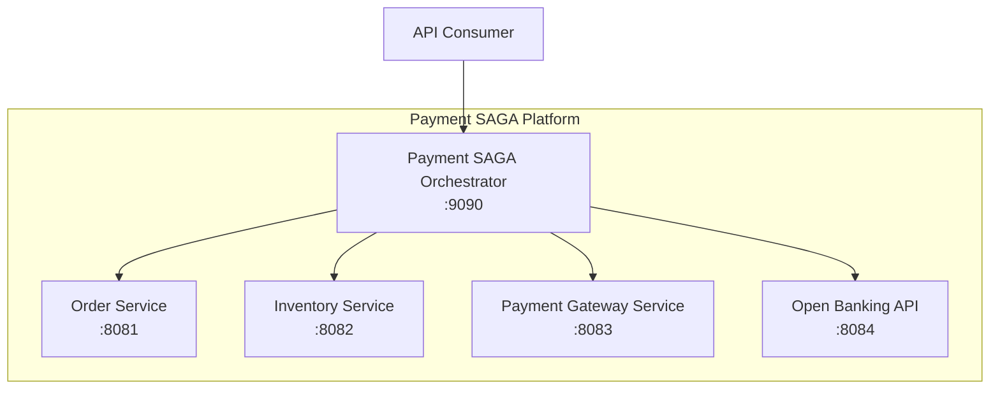

---

## Payment SAGA

> Payment workflow orchestration operations

| Method | Endpoint | Summary |
|--------|----------|---------|
| `POST` | `/api/v1/payments` | Initiate a payment SAGA workflow |
| `GET` | `/api/v1/payments/{workflowId}` | Get payment workflow status |
| `GET` | `/api/v1/payments/{workflowId}/result` | Get payment result (blocking) |
| `POST` | `/api/v1/payments/{workflowId}/cancel` | Cancel a running payment workflow |
| `GET` | `/api/v1/payments/health` | Payment service health check |

<a id="endpoint-post-api-v1-payments"></a>
### POST `/api/v1/payments`

**Operation ID:** `processPayment`

Creates a new Temporal workflow that orchestrates the full payment lifecycle:
order validation → inventory reservation → payment authorization → capture → completion.
Returns immediately with a workflow ID for status polling.

**Required Scopes:** `payment:create`

**Request Body:**

Content-Type: `application/json` → [OrderRequest](#schema-orderrequest)

<details>
<summary>Example Request</summary>

```json
{
  "orderId": "ORD-001",
  "customerId": "CUST-001",
  "amount": 100.0,
  "currency": "USD",
  "items": [
    {
      "sku": "PROD-001",
      "name": "Product",
      "quantity": 1,
      "price": 100.0
    }
  ],
  "paymentDetails": {
    "paymentMethod": "CREDIT_CARD",
    "amount": 100.0,
    "currency": "USD"
  }
}
```
</details>

**Responses:**

| Code | Description | Schema |
|------|-------------|--------|
| `202` | Payment workflow initiated | [PaymentResult](#schema-paymentresult) |
| `400` | Invalid request | [ErrorResponse](#schema-errorresponse) |
| `401` | Unauthorized |  |
| `403` | Forbidden - insufficient permissions |  |

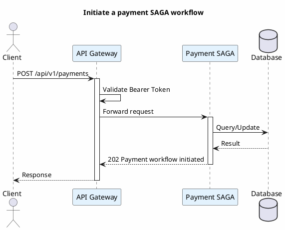

---

<a id="endpoint-get-api-v1-payments-workflowid"></a>
### GET `/api/v1/payments/{workflowId}`

**Operation ID:** `getPaymentStatus`

Returns the current workflow state, business state, and compensation stack size.

**Required Scopes:** `payment:read`

**Path Parameters:**

| Parameter | Type | Required | Description |
|-----------|------|----------|-------------|
| `workflowId` | string | True | Temporal workflow ID |

**Responses:**

| Code | Description | Schema |
|------|-------------|--------|
| `200` | Payment status retrieved | `{workflowId, workflowState, businessState...}` |
| `404` | Workflow not found |  |

---

<a id="endpoint-get-api-v1-payments-workflowid-result"></a>
### GET `/api/v1/payments/{workflowId}/result`

**Operation ID:** `getPaymentResult`

Blocks until the workflow reaches a terminal state, then returns the full result.
Use for synchronous payment flows.

**Required Scopes:** `payment:read`

**Path Parameters:**

| Parameter | Type | Required | Description |
|-----------|------|----------|-------------|
| `workflowId` | string | True |  |

**Responses:**

| Code | Description | Schema |
|------|-------------|--------|
| `200` | Payment result | [PaymentResult](#schema-paymentresult) |
| `404` | Workflow not found |  |

---

<a id="endpoint-post-api-v1-payments-workflowid-cancel"></a>
### POST `/api/v1/payments/{workflowId}/cancel`

**Operation ID:** `cancelPayment`

Signals the Temporal workflow to initiate compensation and rollback.

**Required Scopes:** `payment:cancel`

**Path Parameters:**

| Parameter | Type | Required | Description |
|-----------|------|----------|-------------|
| `workflowId` | string | True |  |

**Request Body:**

| Field | Type | Required | Description |
|-------|------|----------|-------------|
| `reason` | string |  | Cancellation reason |

**Responses:**

| Code | Description | Schema |
|------|-------------|--------|
| `200` | Cancellation requested | `{workflowId, status, reason}` |
| `404` | Workflow not found |  |

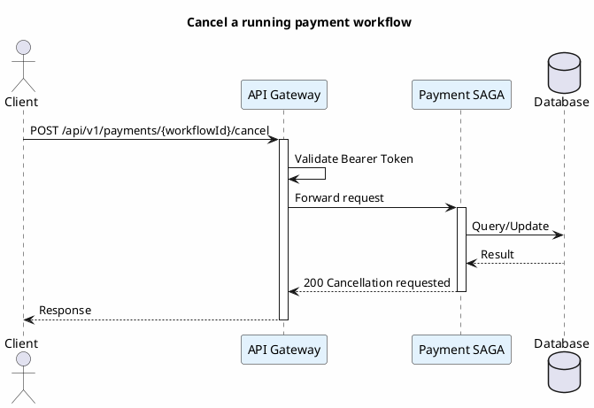

---

<a id="endpoint-get-api-v1-payments-health"></a>
### GET `/api/v1/payments/health`

**Operation ID:** `paymentHealth`

**Authentication:** None (public)

**Responses:**

| Code | Description | Schema |
|------|-------------|--------|
| `200` | Service is healthy | `{status, service}` |

---

## Audit Trail

> Audit trail and compliance reporting endpoints

| Method | Endpoint | Summary |
|--------|----------|---------|
| `GET` | `/api/v1/audit/{sagaId}` | Get audit trail by SAGA ID |
| `GET` | `/api/v1/audit/search` | Search audit records |
| `GET` | `/api/v1/audit/export` | Export audit records |
| `GET` | `/api/v1/audit/archival/status` | Get archival status |
| `POST` | `/api/v1/audit/archival/trigger` | Trigger manual archival of old audit records |

<a id="endpoint-get-api-v1-audit-sagaid"></a>
### GET `/api/v1/audit/{sagaId}`

**Operation ID:** `getAuditTrail`

Returns all audit records for a specific SAGA workflow execution.

**Authentication:** Bearer Token

**Path Parameters:**

| Parameter | Type | Required | Description |
|-----------|------|----------|-------------|
| `sagaId` | string | True |  |

**Responses:**

| Code | Description | Schema |
|------|-------------|--------|
| `200` | Audit trail retrieved | [AuditTrailResponse](#schema-audittrailresponse) |
| `404` | SAGA not found |  |

---

<a id="endpoint-get-api-v1-audit-search"></a>
### GET `/api/v1/audit/search`

**Operation ID:** `searchAudit`

Search audit records with filtering by SAGA ID, event type, and date range.

**Authentication:** Bearer Token

**Query Parameters:**

| Parameter | Type | Required | Default | Description |
|-----------|------|----------|---------|-------------|
| `sagaId` | string | False |  |  |
| `event` | string | False |  |  |
| `fromDate` | string | True |  | Start date (yyyy-MM-dd) |
| `toDate` | string | True |  | End date (yyyy-MM-dd) |
| `page` | integer | False | 0 |  |
| `size` | integer | False | 100 |  |

**Responses:**

| Code | Description | Schema |
|------|-------------|--------|
| `200` | Search results | [AuditSearchResponse](#schema-auditsearchresponse) |

---

<a id="endpoint-get-api-v1-audit-export"></a>
### GET `/api/v1/audit/export`

**Operation ID:** `exportAudit`

Export audit records as CSV or JSON file for compliance reporting.

**Authentication:** Bearer Token

**Query Parameters:**

| Parameter | Type | Required | Default | Description |
|-----------|------|----------|---------|-------------|
| `fromDate` | string | True |  |  |
| `toDate` | string | True |  |  |
| `format` | string | False | csv |  |
| `sagaId` | string | False |  |  |

**Responses:**

| Code | Description | Schema |
|------|-------------|--------|
| `200` | Exported file |  |

---

<a id="endpoint-get-api-v1-audit-archival-status"></a>
### GET `/api/v1/audit/archival/status`

**Operation ID:** `getArchivalStatus`

**Authentication:** Bearer Token

**Responses:**

| Code | Description | Schema |
|------|-------------|--------|
| `200` | Archival status | [ArchivalStatusResponse](#schema-archivalstatusresponse) |

---

<a id="endpoint-post-api-v1-audit-archival-trigger"></a>
### POST `/api/v1/audit/archival/trigger`

**Operation ID:** `triggerArchival`

**Authentication:** Bearer Token

**Responses:**

| Code | Description | Schema |
|------|-------------|--------|
| `200` | Archival triggered | [ArchivalResultResponse](#schema-archivalresultresponse) |

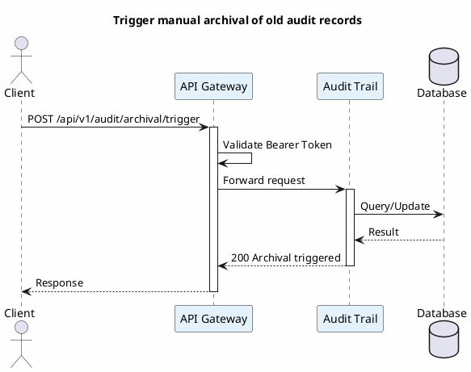

---

## Reconciliation

> Event reconciliation and reporting APIs

| Method | Endpoint | Summary |
|--------|----------|---------|
| `GET` | `/api/v1/reconciliation/summary` | Get reconciliation summary |
| `GET` | `/api/v1/reconciliation/latency-report` | Get latency report with percentiles |
| `GET` | `/api/v1/reconciliation/events/{eventId}` | Get event timeline |
| `GET` | `/api/v1/reconciliation/discrepancies` | List discrepancies |
| `POST` | `/api/v1/reconciliation/discrepancies/{eventId}/resolve` | Resolve a discrepancy |
| `GET` | `/api/v1/reconciliation/batches` | List reconciliation batches |
| `GET` | `/api/v1/reconciliation/batches/{batchId}` | Get batch details |
| `POST` | `/api/v1/reconciliation/trigger` | Trigger manual reconciliation |
| `GET` | `/api/v1/reconciliation/config` | Get reconciliation configuration |
| `GET` | `/api/v1/reconciliation/health` | Reconciliation health check |

<a id="endpoint-get-api-v1-reconciliation-summary"></a>
### GET `/api/v1/reconciliation/summary`

**Operation ID:** `getReconciliationSummary`

Returns aggregated reconciliation metrics for the specified time period.

**Authentication:** Bearer Token

**Query Parameters:**

| Parameter | Type | Required | Default | Description |
|-----------|------|----------|---------|-------------|
| `from` | string | False |  | Period start (ISO-8601) |
| `to` | string | False |  | Period end (ISO-8601) |

**Responses:**

| Code | Description | Schema |
|------|-------------|--------|
| `200` | Summary retrieved | [ReconciliationSummaryDto](#schema-reconciliationsummarydto) |

---

<a id="endpoint-get-api-v1-reconciliation-latencyreport"></a>
### GET `/api/v1/reconciliation/latency-report`

**Operation ID:** `getLatencyReport`

Returns end-to-end latency percentiles and per-stage breakdown.

**Authentication:** Bearer Token

**Query Parameters:**

| Parameter | Type | Required | Default | Description |
|-----------|------|----------|---------|-------------|
| `from` | string | False |  |  |
| `to` | string | False |  |  |
| `slaThresholdMs` | integer | False |  | SLA threshold in milliseconds for compliance calculation |

**Responses:**

| Code | Description | Schema |
|------|-------------|--------|
| `200` | Latency report | [LatencyReportDto](#schema-latencyreportdto) |

---

<a id="endpoint-get-api-v1-reconciliation-events-eventid"></a>
### GET `/api/v1/reconciliation/events/{eventId}`

**Operation ID:** `getEventTimeline`

Returns the full lifecycle timeline of a single event across all stages.

**Authentication:** Bearer Token

**Path Parameters:**

| Parameter | Type | Required | Description |
|-----------|------|----------|-------------|
| `eventId` | string | True |  |

**Responses:**

| Code | Description | Schema |
|------|-------------|--------|
| `200` | Event timeline | [EventTimelineDto](#schema-eventtimelinedto) |
| `404` | Event not found |  |

---

<a id="endpoint-get-api-v1-reconciliation-discrepancies"></a>
### GET `/api/v1/reconciliation/discrepancies`

**Operation ID:** `getDiscrepancies`

Returns paginated list of reconciliation discrepancies.

**Authentication:** Bearer Token

**Query Parameters:**

| Parameter | Type | Required | Default | Description |
|-----------|------|----------|---------|-------------|
| `unresolvedOnly` | boolean | False | False |  |
| `page` | integer | False | 0 |  |
| `size` | integer | False | 20 |  |

**Responses:**

| Code | Description | Schema |
|------|-------------|--------|
| `200` | Discrepancies page | [PageDiscrepancyDto](#schema-pagediscrepancydto) |

---

<a id="endpoint-post-api-v1-reconciliation-discrepancies-eventid-resolve"></a>
### POST `/api/v1/reconciliation/discrepancies/{eventId}/resolve`

**Operation ID:** `resolveDiscrepancy`

**Authentication:** Bearer Token

**Path Parameters:**

| Parameter | Type | Required | Description |
|-----------|------|----------|-------------|
| `eventId` | string | True |  |

**Request Body:**

Content-Type: `application/json` → [ResolveDiscrepancyRequest](#schema-resolvediscrepancyrequest)

**Responses:**

| Code | Description | Schema |
|------|-------------|--------|
| `200` | Discrepancy resolved | [DiscrepancyDto](#schema-discrepancydto) |
| `404` | Event not found |  |

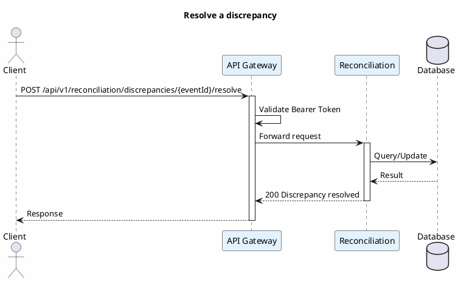

---

<a id="endpoint-get-api-v1-reconciliation-batches"></a>
### GET `/api/v1/reconciliation/batches`

**Operation ID:** `getBatches`

**Authentication:** Bearer Token

**Query Parameters:**

| Parameter | Type | Required | Default | Description |
|-----------|------|----------|---------|-------------|
| `type` | string | False |  |  |
| `page` | integer | False | 0 |  |
| `size` | integer | False | 20 |  |

**Responses:**

| Code | Description | Schema |
|------|-------------|--------|
| `200` | Batches page | [PageReconciliationBatch](#schema-pagereconciliationbatch) |

---

<a id="endpoint-get-api-v1-reconciliation-batches-batchid"></a>
### GET `/api/v1/reconciliation/batches/{batchId}`

**Operation ID:** `getBatch`

**Authentication:** Bearer Token

**Path Parameters:**

| Parameter | Type | Required | Description |
|-----------|------|----------|-------------|
| `batchId` | string | True |  |

**Responses:**

| Code | Description | Schema |
|------|-------------|--------|
| `200` | Batch details | [ReconciliationBatch](#schema-reconciliationbatch) |
| `404` | Batch not found |  |

---

<a id="endpoint-post-api-v1-reconciliation-trigger"></a>
### POST `/api/v1/reconciliation/trigger`

**Operation ID:** `triggerReconciliation`

**Authentication:** Bearer Token

**Query Parameters:**

| Parameter | Type | Required | Default | Description |
|-----------|------|----------|---------|-------------|
| `from` | string | True |  |  |
| `to` | string | True |  |  |

**Responses:**

| Code | Description | Schema |
|------|-------------|--------|
| `202` | Reconciliation triggered | `{batchId, periodStart, periodEnd...}` |

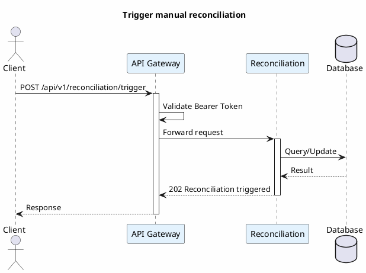

---

<a id="endpoint-get-api-v1-reconciliation-config"></a>
### GET `/api/v1/reconciliation/config`

**Operation ID:** `getReconciliationConfig`

**Authentication:** Bearer Token

**Responses:**

| Code | Description | Schema |
|------|-------------|--------|
| `200` | Configuration | `{enabled, sla, realtime...}` |

---

<a id="endpoint-get-api-v1-reconciliation-health"></a>
### GET `/api/v1/reconciliation/health`

**Operation ID:** `reconciliationHealth`

**Authentication:** Bearer Token

**Responses:**

| Code | Description | Schema |
|------|-------------|--------|
| `200` | Health status | `{status, enabled, lastRealtimeBatch...}` |

---

## Orders

> Order management operations

| Method | Endpoint | Summary |
|--------|----------|---------|
| `POST` | `/api/orders/validate` | Validate an order |
| `PUT` | `/api/orders/{orderId}/status` | Update order status |
| `POST` | `/api/orders/{orderId}/cancel` | Cancel an order |

<a id="endpoint-post-api-orders-validate"></a>
### POST `/api/orders/validate`

**Operation ID:** `validateOrder`

Validates the order request and returns validation results with individual checks.

**Authentication:** None (public)

**Request Body:**

Content-Type: `application/json` → [OrderRequest](#schema-orderrequest)

**Responses:**

| Code | Description | Schema |
|------|-------------|--------|
| `200` | Validation result | [OrderValidation](#schema-ordervalidation) |
| `400` | Invalid request |  |

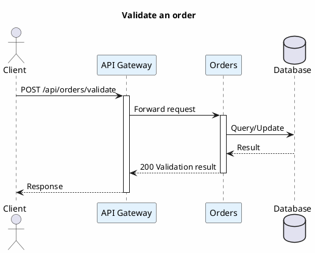

---

<a id="endpoint-put-api-orders-orderid-status"></a>
### PUT `/api/orders/{orderId}/status`

**Operation ID:** `updateOrderStatus`

**Authentication:** None (public)

**Path Parameters:**

| Parameter | Type | Required | Description |
|-----------|------|----------|-------------|
| `orderId` | string | True |  |

**Query Parameters:**

| Parameter | Type | Required | Default | Description |
|-----------|------|----------|---------|-------------|
| `status` | string | True |  |  |

**Responses:**

| Code | Description | Schema |
|------|-------------|--------|
| `200` | Status updated | [OrderUpdate](#schema-orderupdate) |
| `404` | Order not found |  |

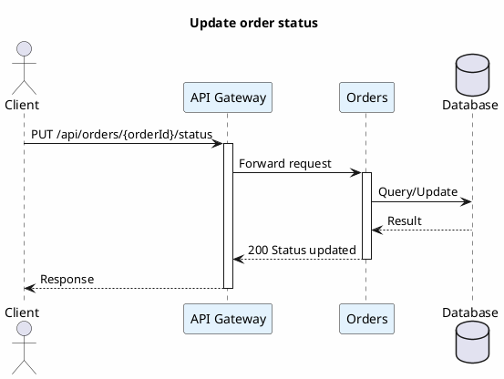

---

<a id="endpoint-post-api-orders-orderid-cancel"></a>
### POST `/api/orders/{orderId}/cancel`

**Operation ID:** `cancelOrder`

**Authentication:** None (public)

**Path Parameters:**

| Parameter | Type | Required | Description |
|-----------|------|----------|-------------|
| `orderId` | string | True |  |

**Query Parameters:**

| Parameter | Type | Required | Default | Description |
|-----------|------|----------|---------|-------------|
| `validationId` | string | True |  |  |

**Responses:**

| Code | Description | Schema |
|------|-------------|--------|
| `200` | Order cancelled |  |
| `404` | Order not found |  |

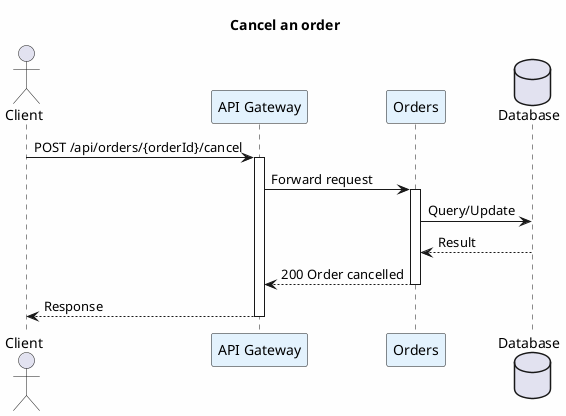

---

## Inventory

> Inventory reservation management

| Method | Endpoint | Summary |
|--------|----------|---------|
| `POST` | `/api/inventory/reserve` | Reserve inventory for an order |
| `POST` | `/api/inventory/release/{reservationId}` | Release an inventory reservation |

<a id="endpoint-post-api-inventory-reserve"></a>
### POST `/api/inventory/reserve`

**Operation ID:** `reserveInventory`

**Authentication:** None (public)

**Query Parameters:**

| Parameter | Type | Required | Default | Description |
|-----------|------|----------|---------|-------------|
| `orderId` | string | True |  |  |

**Request Body:**


**Responses:**

| Code | Description | Schema |
|------|-------------|--------|
| `200` | Reservation result | [InventoryReservation](#schema-inventoryreservation) |
| `400` | Invalid request |  |

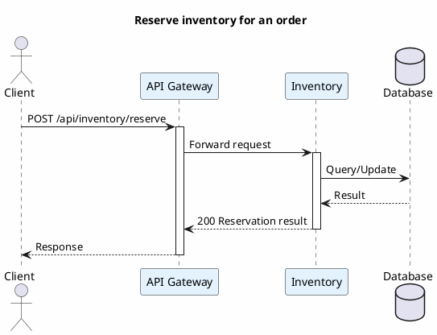

---

<a id="endpoint-post-api-inventory-release-reservationid"></a>
### POST `/api/inventory/release/{reservationId}`

**Operation ID:** `releaseInventory`

**Authentication:** None (public)

**Path Parameters:**

| Parameter | Type | Required | Description |
|-----------|------|----------|-------------|
| `reservationId` | string | True |  |

**Responses:**

| Code | Description | Schema |
|------|-------------|--------|
| `200` | Reservation released |  |
| `404` | Reservation not found |  |

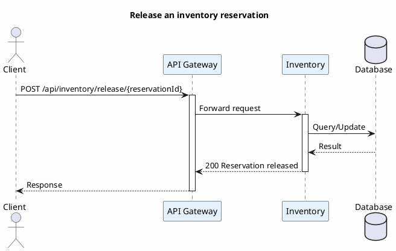

---

## Payment Gateway

> Payment authorization and capture operations

| Method | Endpoint | Summary |
|--------|----------|---------|
| `POST` | `/api/payments/authorize` | Authorize a payment |
| `POST` | `/api/payments/capture/{authId}` | Capture an authorized payment |
| `POST` | `/api/payments/void/{authId}` | Void an authorization |
| `POST` | `/api/payments/refund/{captureId}` | Refund a captured payment |

<a id="endpoint-post-api-payments-authorize"></a>
### POST `/api/payments/authorize`

**Operation ID:** `authorizePayment`

Places a hold on the customer's payment method for the specified amount.

**Authentication:** None (public)

**Request Body:**

Content-Type: `application/json` → [PaymentDetails](#schema-paymentdetails)

**Responses:**

| Code | Description | Schema |
|------|-------------|--------|
| `200` | Authorization result | [PaymentAuth](#schema-paymentauth) |
| `400` | Invalid payment details |  |
| `402` | Payment declined |  |

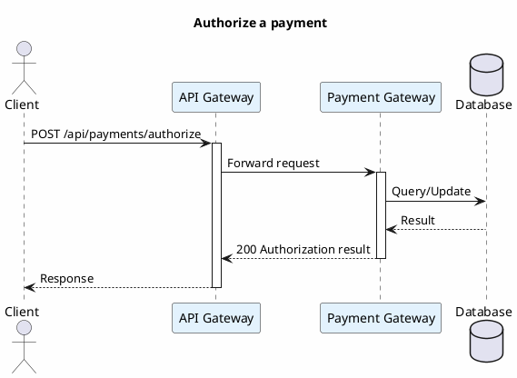

---

<a id="endpoint-post-api-payments-capture-authid"></a>
### POST `/api/payments/capture/{authId}`

**Operation ID:** `capturePayment`

Captures (settles) a previously authorized payment.

**Authentication:** None (public)

**Path Parameters:**

| Parameter | Type | Required | Description |
|-----------|------|----------|-------------|
| `authId` | string | True |  |

**Responses:**

| Code | Description | Schema |
|------|-------------|--------|
| `200` | Capture result | [PaymentCapture](#schema-paymentcapture) |
| `404` | Authorization not found |  |
| `409` | Authorization already captured or voided |  |

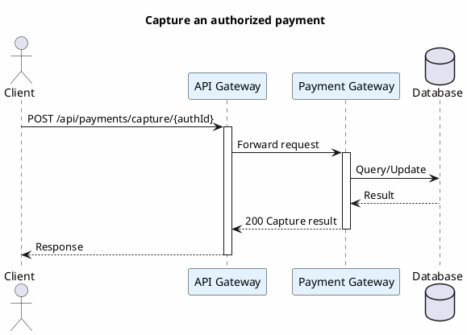

---

<a id="endpoint-post-api-payments-void-authid"></a>
### POST `/api/payments/void/{authId}`

**Operation ID:** `voidAuthorization`

Releases the hold on the customer's payment method.

**Authentication:** None (public)

**Path Parameters:**

| Parameter | Type | Required | Description |
|-----------|------|----------|-------------|
| `authId` | string | True |  |

**Responses:**

| Code | Description | Schema |
|------|-------------|--------|
| `200` | Authorization voided |  |
| `404` | Authorization not found |  |
| `409` | Authorization already captured or voided |  |

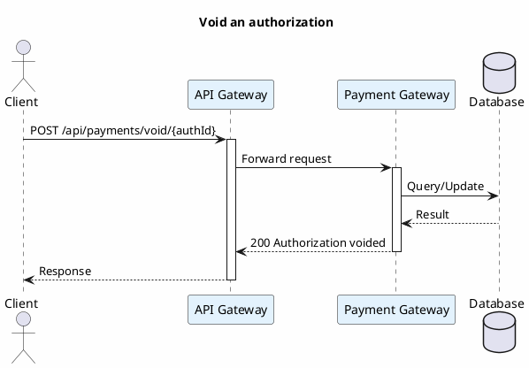

---

<a id="endpoint-post-api-payments-refund-captureid"></a>
### POST `/api/payments/refund/{captureId}`

**Operation ID:** `refundPayment`

**Authentication:** None (public)

**Path Parameters:**

| Parameter | Type | Required | Description |
|-----------|------|----------|-------------|
| `captureId` | string | True |  |

**Responses:**

| Code | Description | Schema |
|------|-------------|--------|
| `200` | Payment refunded |  |
| `404` | Capture not found |  |
| `409` | Payment already refunded |  |

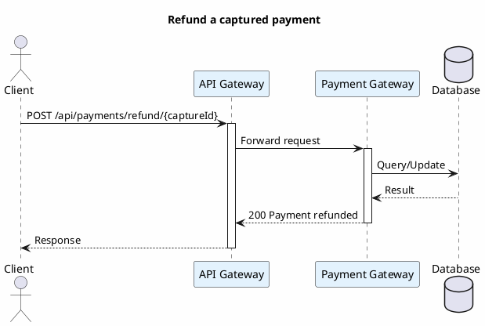

---

## Webhooks

> External payment provider webhook ingestion

| Method | Endpoint | Summary |
|--------|----------|---------|
| `POST` | `/api/webhooks/{channel}` | Receive webhook from payment channel |

<a id="endpoint-post-api-webhooks-channel"></a>
### POST `/api/webhooks/{channel}`

**Operation ID:** `receiveWebhook`

Ingests webhooks from external PSPs (Stripe, PayPal, Adyen, Square).
Verifies signatures, deduplicates events, and publishes to Kafka via
the transactional outbox pattern (CDC with Debezium).

**Authentication:** None (public)

**Path Parameters:**

| Parameter | Type | Required | Description |
|-----------|------|----------|-------------|
| `channel` | string | True | Payment channel identifier |

**Request Body:**


**Responses:**

| Code | Description | Schema |
|------|-------------|--------|
| `200` | Webhook processed | [WebhookResponse](#schema-webhookresponse) |
| `400` | Invalid webhook payload |  |
| `401` | Invalid webhook signature |  |
| `409` | Duplicate webhook (already processed) |  |

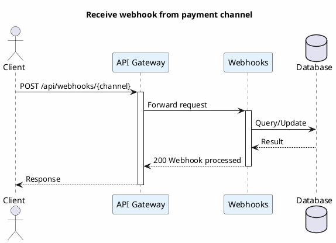

---

## Consent Management

> Customer consent management for Open Banking

| Method | Endpoint | Summary |
|--------|----------|---------|
| `POST` | `/open-banking/v1/consents` | Request customer consent |
| `GET` | `/open-banking/v1/consents` | List customer consents |
| `GET` | `/open-banking/v1/consents/{consentId}` | Get consent details |
| `DELETE` | `/open-banking/v1/consents/{consentId}` | Revoke consent |
| `POST` | `/open-banking/v1/consents/{consentId}/authorize` | Authorize consent (after SCA) |

<a id="endpoint-post-openbanking-v1-consents"></a>
### POST `/open-banking/v1/consents`

**Operation ID:** `requestConsent`

TPP requests consent from a customer to access their account information
or initiate payments. Maximum validity is 90 days per SBV Circular 64.

**Required Scopes:** `consent:create`

**Request Body:**

Content-Type: `application/json` → [ConsentRequest](#schema-consentrequest)

**Responses:**

| Code | Description | Schema |
|------|-------------|--------|
| `201` | Consent created (awaiting customer authorization) | [ConsentResponse](#schema-consentresponse) |
| `400` | Invalid request |  |
| `401` | Unauthorized |  |
| `403` | TPP not active |  |

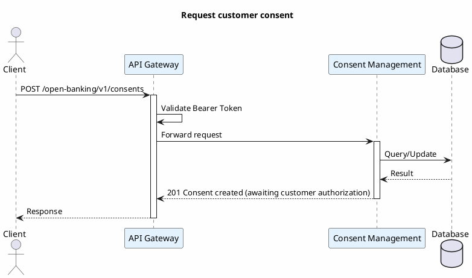

---

<a id="endpoint-get-openbanking-v1-consents"></a>
### GET `/open-banking/v1/consents`

**Operation ID:** `getCustomerConsents`

**Required Scopes:** `consent:read`

**Responses:**

| Code | Description | Schema |
|------|-------------|--------|
| `200` | Customer consents | array\<[ConsentResponse](#schema-consentresponse)\> |

---

<a id="endpoint-get-openbanking-v1-consents-consentid"></a>
### GET `/open-banking/v1/consents/{consentId}`

**Operation ID:** `getConsent`

**Required Scopes:** `consent:read`

**Path Parameters:**

| Parameter | Type | Required | Description |
|-----------|------|----------|-------------|
| `consentId` | string | True |  |

**Responses:**

| Code | Description | Schema |
|------|-------------|--------|
| `200` | Consent details | [ConsentResponse](#schema-consentresponse) |
| `404` | Consent not found |  |

---

<a id="endpoint-delete-openbanking-v1-consents-consentid"></a>
### DELETE `/open-banking/v1/consents/{consentId}`

**Operation ID:** `revokeConsent`

**Required Scopes:** `consent:revoke`

**Path Parameters:**

| Parameter | Type | Required | Description |
|-----------|------|----------|-------------|
| `consentId` | string | True |  |

**Request Body:**

| Field | Type | Required | Description |
|-------|------|----------|-------------|
| `reason` | string |  |  |

**Responses:**

| Code | Description | Schema |
|------|-------------|--------|
| `204` | Consent revoked |  |
| `403` | Not authorized to revoke this consent |  |
| `404` | Consent not found |  |

---

<a id="endpoint-post-openbanking-v1-consents-consentid-authorize"></a>
### POST `/open-banking/v1/consents/{consentId}/authorize`

**Operation ID:** `authorizeConsent`

Customer authorizes a consent request after completing Strong Customer Authentication.

**Required Scopes:** `consent:authorize`

**Path Parameters:**

| Parameter | Type | Required | Description |
|-----------|------|----------|-------------|
| `consentId` | string | True |  |

**Responses:**

| Code | Description | Schema |
|------|-------------|--------|
| `200` | Consent authorized | [ConsentResponse](#schema-consentresponse) |
| `400` | Invalid consent state |  |
| `403` | Not the consent's customer |  |
| `404` | Consent not found |  |

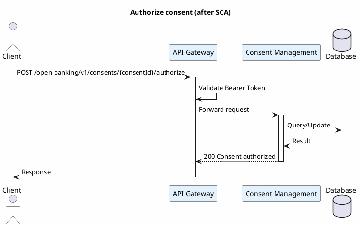

---

## TPP Registration

> Third Party Provider registration and management

| Method | Endpoint | Summary |
|--------|----------|---------|
| `POST` | `/open-banking/v1/tpp/register` | Register a Third Party Provider |
| `GET` | `/open-banking/v1/tpp/{tppId}` | Get TPP details |
| `PUT` | `/open-banking/v1/tpp/{tppId}/activate` | Activate a TPP |
| `PUT` | `/open-banking/v1/tpp/{tppId}/suspend` | Suspend a TPP |
| `POST` | `/open-banking/v1/tpp/{tppId}/credentials` | Rotate API credentials |
| `POST` | `/open-banking/v1/tpp/{tppId}/tiers/{tier}` | Grant API tier to TPP |
| `GET` | `/open-banking/v1/tpp` | List active TPPs |

<a id="endpoint-post-openbanking-v1-tpp-register"></a>
### POST `/open-banking/v1/tpp/register`

**Operation ID:** `registerTpp`

Registers a new TPP with SBV license verification.
Returns API credentials upon successful registration.

**Required Scopes:** `tpp:register`

**Request Body:**

Content-Type: `application/json` → [TppRegistrationRequest](#schema-tppregistrationrequest)

**Responses:**

| Code | Description | Schema |
|------|-------------|--------|
| `201` | TPP registered | [TppRegistrationResult](#schema-tppregistrationresult) |
| `400` | Invalid request or duplicate SBV license |  |
| `401` | Unauthorized |  |

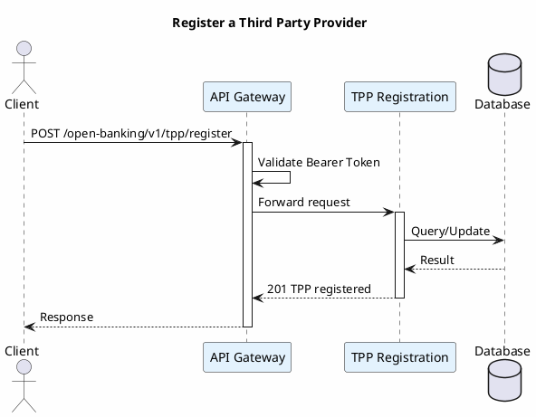

---

<a id="endpoint-get-openbanking-v1-tpp-tppid"></a>
### GET `/open-banking/v1/tpp/{tppId}`

**Operation ID:** `getTpp`

**Required Scopes:** `tpp:read`

**Path Parameters:**

| Parameter | Type | Required | Description |
|-----------|------|----------|-------------|
| `tppId` | string | True |  |

**Responses:**

| Code | Description | Schema |
|------|-------------|--------|
| `200` | TPP details | [TppResponse](#schema-tppresponse) |
| `404` | TPP not found |  |

---

<a id="endpoint-put-openbanking-v1-tpp-tppid-activate"></a>
### PUT `/open-banking/v1/tpp/{tppId}/activate`

**Operation ID:** `activateTpp`

**Required Scopes:** `tpp:admin`

**Path Parameters:**

| Parameter | Type | Required | Description |
|-----------|------|----------|-------------|
| `tppId` | string | True |  |

**Responses:**

| Code | Description | Schema |
|------|-------------|--------|
| `200` | TPP activated | [TppResponse](#schema-tppresponse) |
| `400` | License expired |  |
| `404` | TPP not found |  |

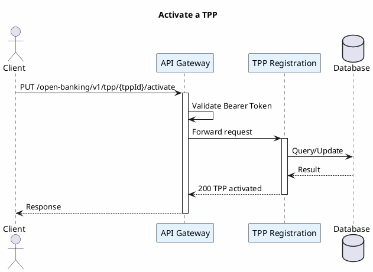

---

<a id="endpoint-put-openbanking-v1-tpp-tppid-suspend"></a>
### PUT `/open-banking/v1/tpp/{tppId}/suspend`

**Operation ID:** `suspendTpp`

**Required Scopes:** `tpp:admin`

**Path Parameters:**

| Parameter | Type | Required | Description |
|-----------|------|----------|-------------|
| `tppId` | string | True |  |

**Request Body:**

| Field | Type | Required | Description |
|-------|------|----------|-------------|
| `reason` | string | ✅ |  |

**Responses:**

| Code | Description | Schema |
|------|-------------|--------|
| `200` | TPP suspended | [TppResponse](#schema-tppresponse) |
| `404` | TPP not found |  |

```plantuml
@startuml suspendTpp
title Suspend a TPP

skinparam backgroundColor #FEFEFE
skinparam sequence {
    ParticipantBackgroundColor #E3F2FD
}

actor Client
participant "API Gateway" as GW
participant "TPP Registration" as SVC
database "Database" as DB

Client -> GW: PUT /open-banking/v1/tpp/{tppId}/suspend
activate GW
GW -> GW: Validate Bearer Token
GW -> SVC: Forward request
activate SVC
SVC -> DB: Query/Update
DB --> SVC: Result
SVC --> GW: 200 TPP suspended
deactivate SVC
GW --> Client: Response
deactivate GW

@enduml
```

---

<a id="endpoint-post-openbanking-v1-tpp-tppid-credentials"></a>
### POST `/open-banking/v1/tpp/{tppId}/credentials`

**Operation ID:** `rotateCredentials`

Generates new API key for the TPP. Old key is invalidated.

**Required Scopes:** `tpp:credentials`

**Path Parameters:**

| Parameter | Type | Required | Description |
|-----------|------|----------|-------------|
| `tppId` | string | True |  |

**Responses:**

| Code | Description | Schema |
|------|-------------|--------|
| `200` | New credentials | [TppCredentials](#schema-tppcredentials) |
| `404` | TPP not found |  |

```plantuml
@startuml rotateCredentials
title Rotate API credentials

skinparam backgroundColor #FEFEFE
skinparam sequence {
    ParticipantBackgroundColor #E3F2FD
}

actor Client
participant "API Gateway" as GW
participant "TPP Registration" as SVC
database "Database" as DB

Client -> GW: POST /open-banking/v1/tpp/{tppId}/credentials
activate GW
GW -> GW: Validate Bearer Token
GW -> SVC: Forward request
activate SVC
SVC -> DB: Query/Update
DB --> SVC: Result
SVC --> GW: 200 New credentials
deactivate SVC
GW --> Client: Response
deactivate GW

@enduml
```

---

<a id="endpoint-post-openbanking-v1-tpp-tppid-tiers-tier"></a>
### POST `/open-banking/v1/tpp/{tppId}/tiers/{tier}`

**Operation ID:** `grantTier`

**Required Scopes:** `tpp:admin`

**Path Parameters:**

| Parameter | Type | Required | Description |
|-----------|------|----------|-------------|
| `tppId` | string | True |  |
| `tier` | string | True |  |

**Responses:**

| Code | Description | Schema |
|------|-------------|--------|
| `200` | Tier granted | [TppResponse](#schema-tppresponse) |
| `404` | TPP not found |  |

```plantuml
@startuml grantTier
title Grant API tier to TPP

skinparam backgroundColor #FEFEFE
skinparam sequence {
    ParticipantBackgroundColor #E3F2FD
}

actor Client
participant "API Gateway" as GW
participant "TPP Registration" as SVC
database "Database" as DB

Client -> GW: POST /open-banking/v1/tpp/{tppId}/tiers/{tier}
activate GW
GW -> GW: Validate Bearer Token
GW -> SVC: Forward request
activate SVC
SVC -> DB: Query/Update
DB --> SVC: Result
SVC --> GW: 200 Tier granted
deactivate SVC
GW --> Client: Response
deactivate GW

@enduml
```

---

<a id="endpoint-get-openbanking-v1-tpp"></a>
### GET `/open-banking/v1/tpp`

**Operation ID:** `getActiveTpps`

**Required Scopes:** `tpp:admin`

**Responses:**

| Code | Description | Schema |
|------|-------------|--------|
| `200` | Active TPPs | array\<[TppResponse](#schema-tppresponse)\> |

---

## Account Information

> Tier 1 & 2: Account Information APIs

| Method | Endpoint | Summary |
|--------|----------|---------|
| `GET` | `/open-banking/v1/accounts` | List customer accounts (Tier 1) |
| `GET` | `/open-banking/v1/accounts/{accountId}` | Get account details (Tier 1) |
| `GET` | `/open-banking/v1/accounts/{accountId}/balance` | Get account balance (Tier 2) |
| `GET` | `/open-banking/v1/accounts/{accountId}/transactions` | Get account transactions (Tier 2) |

<a id="endpoint-get-openbanking-v1-accounts"></a>
### GET `/open-banking/v1/accounts`

**Operation ID:** `listAccounts`

**Required Scopes:** `openbanking:ais`

**Responses:**

| Code | Description | Schema |
|------|-------------|--------|
| `200` | Customer accounts | array\<[AccountSummary](#schema-accountsummary)\> |
| `401` | Unauthorized |  |
| `403` | Not authorized for this tier |  |

---

<a id="endpoint-get-openbanking-v1-accounts-accountid"></a>
### GET `/open-banking/v1/accounts/{accountId}`

**Operation ID:** `getAccount`

**Required Scopes:** `openbanking:ais`

**Path Parameters:**

| Parameter | Type | Required | Description |
|-----------|------|----------|-------------|
| `accountId` | string | True |  |

**Responses:**

| Code | Description | Schema |
|------|-------------|--------|
| `200` | Account details | [AccountDetail](#schema-accountdetail) |
| `404` | Account not found |  |

---

<a id="endpoint-get-openbanking-v1-accounts-accountid-balance"></a>
### GET `/open-banking/v1/accounts/{accountId}/balance`

**Operation ID:** `getBalance`

Requires active consent with BALANCES permission.

**Required Scopes:** `openbanking:ais`

**Path Parameters:**

| Parameter | Type | Required | Description |
|-----------|------|----------|-------------|
| `accountId` | string | True |  |

**Responses:**

| Code | Description | Schema |
|------|-------------|--------|
| `200` | Account balance | [AccountBalance](#schema-accountbalance) |
| `403` | Consent required for balance access |  |
| `404` | Account not found |  |

---

<a id="endpoint-get-openbanking-v1-accounts-accountid-transactions"></a>
### GET `/open-banking/v1/accounts/{accountId}/transactions`

**Operation ID:** `getTransactions`

Requires active consent with TRANSACTIONS permission.

**Required Scopes:** `openbanking:ais`

**Path Parameters:**

| Parameter | Type | Required | Description |
|-----------|------|----------|-------------|
| `accountId` | string | True |  |

**Query Parameters:**

| Parameter | Type | Required | Default | Description |
|-----------|------|----------|---------|-------------|
| `fromDate` | string | False |  | Filter from date (ISO-8601) |
| `toDate` | string | False |  | Filter to date (ISO-8601) |

**Responses:**

| Code | Description | Schema |
|------|-------------|--------|
| `200` | Transactions | [TransactionList](#schema-transactionlist) |
| `403` | Consent required for transaction access |  |
| `404` | Account not found |  |

---

## Payment Initiation

> Tier 3: Payment Initiation Services (PIS)

| Method | Endpoint | Summary |
|--------|----------|---------|
| `POST` | `/open-banking/v1/payments` | Initiate payment (Tier 3) |
| `GET` | `/open-banking/v1/payments/{paymentId}` | Get payment status |
| `POST` | `/open-banking/v1/payments/{paymentId}/confirm` | Confirm payment after SCA |

<a id="endpoint-post-openbanking-v1-payments"></a>
### POST `/open-banking/v1/payments`

**Operation ID:** `initiatePayment`

Initiates a payment on behalf of a customer. Requires active consent with
PAYMENTS permission and Strong Customer Authentication (SCA).

**Required Scopes:** `openbanking:pis`

**Request Body:**

Content-Type: `application/json` → [PaymentInitiationRequest](#schema-paymentinitiationrequest)

**Responses:**

| Code | Description | Schema |
|------|-------------|--------|
| `201` | Payment initiated (awaiting SCA) | [PaymentInitiationResponse](#schema-paymentinitiationresponse) |
| `400` | Invalid payment request |  |
| `403` | Consent required for payment initiation |  |

```plantuml
@startuml initiatePayment
title Initiate payment (Tier 3)

skinparam backgroundColor #FEFEFE
skinparam sequence {
    ParticipantBackgroundColor #E3F2FD
}

actor Client
participant "API Gateway" as GW
participant "Payment Initiation" as SVC
database "Database" as DB

Client -> GW: POST /open-banking/v1/payments
activate GW
GW -> GW: Validate Bearer Token
GW -> SVC: Forward request
activate SVC
SVC -> DB: Query/Update
DB --> SVC: Result
SVC --> GW: 201 Payment initiated (awaiting SCA)
deactivate SVC
GW --> Client: Response
deactivate GW

@enduml
```

---

<a id="endpoint-get-openbanking-v1-payments-paymentid"></a>
### GET `/open-banking/v1/payments/{paymentId}`

**Operation ID:** `getOBPaymentStatus`

**Required Scopes:** `openbanking:pis`

**Path Parameters:**

| Parameter | Type | Required | Description |
|-----------|------|----------|-------------|
| `paymentId` | string | True |  |

**Responses:**

| Code | Description | Schema |
|------|-------------|--------|
| `200` | Payment status | [PaymentStatusResponse](#schema-paymentstatusresponse) |
| `404` | Payment not found |  |

---

<a id="endpoint-post-openbanking-v1-payments-paymentid-confirm"></a>
### POST `/open-banking/v1/payments/{paymentId}/confirm`

**Operation ID:** `confirmPayment`

**Required Scopes:** `openbanking:pis`

**Path Parameters:**

| Parameter | Type | Required | Description |
|-----------|------|----------|-------------|
| `paymentId` | string | True |  |

**Request Body:**

Content-Type: `application/json` → [ScaConfirmationRequest](#schema-scaconfirmationrequest)

**Responses:**

| Code | Description | Schema |
|------|-------------|--------|
| `200` | Payment confirmed | [PaymentConfirmationResponse](#schema-paymentconfirmationresponse) |
| `400` | Invalid SCA or payment already processed |  |
| `404` | Payment not found |  |

```plantuml
@startuml confirmPayment
title Confirm payment after SCA

skinparam backgroundColor #FEFEFE
skinparam sequence {
    ParticipantBackgroundColor #E3F2FD
}

actor Client
participant "API Gateway" as GW
participant "Payment Initiation" as SVC
database "Database" as DB

Client -> GW: POST /open-banking/v1/payments/{paymentId}/confirm
activate GW
GW -> GW: Validate Bearer Token
GW -> SVC: Forward request
activate SVC
SVC -> DB: Query/Update
DB --> SVC: Result
SVC --> GW: 200 Payment confirmed
deactivate SVC
GW --> Client: Response
deactivate GW

@enduml
```

---

## NAPAS Integration

> Internal: ISO 20022 NAPAS Integration

| Method | Endpoint | Summary |
|--------|----------|---------|
| `POST` | `/internal/napas/pain001/generate` | Generate ISO 20022 pain.001 Credit Transfer Initiation |
| `POST` | `/internal/napas/pain002/receive` | Receive ISO 20022 pain.002 Payment Status Report |
| `POST` | `/internal/napas/pain002/generate` | Generate ISO 20022 pain.002 response |
| `POST` | `/internal/napas/pain001/validate` | Validate pain.001 message |

<a id="endpoint-post-internal-napas-pain001-generate"></a>
### POST `/internal/napas/pain001/generate`

**Operation ID:** `generatePain001`

Internal endpoint. Generates a pain.001.001.09 XML message for NAPAS.

**Authentication:** None (public)

**Request Body:**

Content-Type: `application/json` → [Pain001Request](#schema-pain001request)

**Responses:**

| Code | Description | Schema |
|------|-------------|--------|
| `200` | pain.001 XML generated |  |

```plantuml
@startuml generatePain001
title Generate ISO 20022 pain.001 Credit Transfer Initiation

skinparam backgroundColor #FEFEFE
skinparam sequence {
    ParticipantBackgroundColor #E3F2FD
}

actor Client
participant "API Gateway" as GW
participant "NAPAS Integration" as SVC
database "Database" as DB

Client -> GW: POST /internal/napas/pain001/generate
activate GW
GW -> SVC: Forward request
activate SVC
SVC -> DB: Query/Update
DB --> SVC: Result
SVC --> GW: 200 pain.001 XML generated
deactivate SVC
GW --> Client: Response
deactivate GW

@enduml
```

---

<a id="endpoint-post-internal-napas-pain002-receive"></a>
### POST `/internal/napas/pain002/receive`

**Operation ID:** `receivePain002`

Internal endpoint. Processes incoming pain.002 status reports from NAPAS.

**Authentication:** None (public)

**Request Body:**


**Responses:**

| Code | Description | Schema |
|------|-------------|--------|
| `200` | Status report processed | `{received, paymentId, status...}` |
| `400` | Invalid XML |  |

```plantuml
@startuml receivePain002
title Receive ISO 20022 pain.002 Payment Status Report

skinparam backgroundColor #FEFEFE
skinparam sequence {
    ParticipantBackgroundColor #E3F2FD
}

actor Client
participant "API Gateway" as GW
participant "NAPAS Integration" as SVC
database "Database" as DB

Client -> GW: POST /internal/napas/pain002/receive
activate GW
GW -> SVC: Forward request
activate SVC
SVC -> DB: Query/Update
DB --> SVC: Result
SVC --> GW: 200 Status report processed
deactivate SVC
GW --> Client: Response
deactivate GW

@enduml
```

---

<a id="endpoint-post-internal-napas-pain002-generate"></a>
### POST `/internal/napas/pain002/generate`

**Operation ID:** `generatePain002`

Internal endpoint. Generates a pain.002 response XML.

**Authentication:** None (public)

**Request Body:**

Content-Type: `application/json` → [Pain002Request](#schema-pain002request)

**Responses:**

| Code | Description | Schema |
|------|-------------|--------|
| `200` | pain.002 XML generated |  |

```plantuml
@startuml generatePain002
title Generate ISO 20022 pain.002 response

skinparam backgroundColor #FEFEFE
skinparam sequence {
    ParticipantBackgroundColor #E3F2FD
}

actor Client
participant "API Gateway" as GW
participant "NAPAS Integration" as SVC
database "Database" as DB

Client -> GW: POST /internal/napas/pain002/generate
activate GW
GW -> SVC: Forward request
activate SVC
SVC -> DB: Query/Update
DB --> SVC: Result
SVC --> GW: 200 pain.002 XML generated
deactivate SVC
GW --> Client: Response
deactivate GW

@enduml
```

---

<a id="endpoint-post-internal-napas-pain001-validate"></a>
### POST `/internal/napas/pain001/validate`

**Operation ID:** `validatePain001`

Internal endpoint. Validates a pain.001 XML message structure.

**Authentication:** None (public)

**Request Body:**


**Responses:**

| Code | Description | Schema |
|------|-------------|--------|
| `200` | Validation result | `{valid, messageType, validatedAt}` |

```plantuml
@startuml validatePain001
title Validate pain.001 message

skinparam backgroundColor #FEFEFE
skinparam sequence {
    ParticipantBackgroundColor #E3F2FD
}

actor Client
participant "API Gateway" as GW
participant "NAPAS Integration" as SVC
database "Database" as DB

Client -> GW: POST /internal/napas/pain001/validate
activate GW
GW -> SVC: Forward request
activate SVC
SVC -> DB: Query/Update
DB --> SVC: Result
SVC --> GW: 200 Validation result
deactivate SVC
GW --> Client: Response
deactivate GW

@enduml
```

---

## Kong Audit

> Internal: Kong Gateway Audit Logs

| Method | Endpoint | Summary |
|--------|----------|---------|
| `POST` | `/internal/audit/kong` | Receive Kong Gateway audit log |

<a id="endpoint-post-internal-audit-kong"></a>
### POST `/internal/audit/kong`

**Operation ID:** `receiveKongAuditLog`

Internal endpoint. Receives audit logs from Kong Gateway's http-log plugin.

**Authentication:** None (public)

**Request Body:**

Content-Type: `application/json` → [KongLogEntry](#schema-konglogentry)

**Responses:**

| Code | Description | Schema |
|------|-------------|--------|
| `200` | Log received | `{received, processedAt}` |

```plantuml
@startuml receiveKongAuditLog
title Receive Kong Gateway audit log

skinparam backgroundColor #FEFEFE
skinparam sequence {
    ParticipantBackgroundColor #E3F2FD
}

actor Client
participant "API Gateway" as GW
participant "Kong Audit" as SVC
database "Database" as DB

Client -> GW: POST /internal/audit/kong
activate GW
GW -> SVC: Forward request
activate SVC
SVC -> DB: Query/Update
DB --> SVC: Result
SVC --> GW: 200 Log received
deactivate SVC
GW --> Client: Response
deactivate GW

@enduml
```

---

## Schemas

| Schema | Type | Description |
|--------|------|-------------|
| [OrderRequest](#schema-orderrequest) | object |  |
| [OrderItem](#schema-orderitem) | object |  |
| [PaymentDetails](#schema-paymentdetails) | object |  |
| [CustomerInfo](#schema-customerinfo) | object |  |
| [ShippingAddress](#schema-shippingaddress) | object |  |
| [BillingAddress](#schema-billingaddress) | object |  |
| [ThreeDSecureData](#schema-threedsecuredata) | object |  |
| [ConsentRequest](#schema-consentrequest) | object |  |
| [TppRegistrationRequest](#schema-tppregistrationrequest) | object |  |
| [PaymentInitiationRequest](#schema-paymentinitiationrequest) | object |  |
| [ScaConfirmationRequest](#schema-scaconfirmationrequest) | object |  |
| [ResolveDiscrepancyRequest](#schema-resolvediscrepancyrequest) | object |  |
| [Pain001Request](#schema-pain001request) | object |  |
| [Pain002Request](#schema-pain002request) | object |  |
| [KongLogEntry](#schema-konglogentry) | object |  |
| [PaymentResult](#schema-paymentresult) | object |  |
| [OrderValidation](#schema-ordervalidation) | object |  |
| [ValidationCheck](#schema-validationcheck) | object |  |
| [OrderUpdate](#schema-orderupdate) | object |  |
| [InventoryReservation](#schema-inventoryreservation) | object |  |
| [ReservedItem](#schema-reserveditem) | object |  |
| [PaymentAuth](#schema-paymentauth) | object |  |
| [PaymentCapture](#schema-paymentcapture) | object |  |
| [WebhookResponse](#schema-webhookresponse) | object |  |
| [ConsentResponse](#schema-consentresponse) | object |  |
| [TppResponse](#schema-tppresponse) | object |  |
| [TppCredentials](#schema-tppcredentials) | object |  |
| [TppRegistrationResult](#schema-tppregistrationresult) | object |  |
| [PaymentInitiationResponse](#schema-paymentinitiationresponse) | object |  |
| [PaymentStatusResponse](#schema-paymentstatusresponse) | object |  |
| [PaymentConfirmationResponse](#schema-paymentconfirmationresponse) | object |  |
| [AuditTrailResponse](#schema-audittrailresponse) | object |  |
| [AuditSearchResponse](#schema-auditsearchresponse) | object |  |
| [AuditRecordDto](#schema-auditrecorddto) | object |  |
| [ArchivalStatusResponse](#schema-archivalstatusresponse) | object |  |
| [ArchivalResultResponse](#schema-archivalresultresponse) | object |  |
| [ReconciliationSummaryDto](#schema-reconciliationsummarydto) | object |  |
| [LatencyReportDto](#schema-latencyreportdto) | object |  |
| [EventTimelineDto](#schema-eventtimelinedto) | object |  |
| [DiscrepancyDto](#schema-discrepancydto) | object |  |
| [PageDiscrepancyDto](#schema-pagediscrepancydto) | object |  |
| [ReconciliationBatch](#schema-reconciliationbatch) | object |  |
| [PageReconciliationBatch](#schema-pagereconciliationbatch) | object |  |
| [AccountSummary](#schema-accountsummary) | object |  |
| [AccountDetail](#schema-accountdetail) | object |  |
| [AccountBalance](#schema-accountbalance) | object |  |
| [TransactionList](#schema-transactionlist) | object |  |
| [ErrorResponse](#schema-errorresponse) | object |  |
| [PaymentMethod](#schema-paymentmethod) | string |  |
| [OrderStatus](#schema-orderstatus) | string |  |
| [CustomerStatus](#schema-customerstatus) | string |  |
| [PaymentResultStatus](#schema-paymentresultstatus) | string |  |
| [WorkflowState](#schema-workflowstate) | string | Temporal workflow lifecycle state |
| [PaymentState](#schema-paymentstate) | string | Spring State Machine business state |
| [ConsentType](#schema-consenttype) | string |  |
| [ConsentStatus](#schema-consentstatus) | string |  |
| [PermissionType](#schema-permissiontype) | string | Tier 1: ACCOUNTS, PRODUCTS. Tier 2: BALANCES, TRANSACTIONS, etc. Tier 3: PAYM... |
| [TppStatus](#schema-tppstatus) | string |  |
| [ApiTier](#schema-apitier) | string | Tier 1: Information Query. Tier 2: Account Info (requires consent). Tier 3: P... |
| [OBPaymentStatus](#schema-obpaymentstatus) | string | Open Banking payment lifecycle status |
| [ReconciliationStatus](#schema-reconciliationstatus) | string |  |
| [DiscrepancyType](#schema-discrepancytype) | string |  |
| [ResolutionStatus](#schema-resolutionstatus) | string |  |
| [BatchType](#schema-batchtype) | string |  |
| [BatchStatus](#schema-batchstatus) | string |  |

### Data Model Overview

```plantuml
@startuml DataModel
title API Data Models

skinparam classAttributeIconSize 0
skinparam class {
    BackgroundColor #E8F5E9
    BorderColor #2E7D32
}

enum PaymentMethod {
    CREDIT_CARD
    DEBIT_CARD
    BANK_TRANSFER
    ACH_TRANSFER
    WIRE_TRANSFER
    SEPA_TRANSFER
    DIGITAL_WALLET
    BUY_NOW_PAY_LATER
    ... (13 more)
}

enum OrderStatus {
    PENDING
    VALIDATED
    PROCESSING
    PAYMENT_PENDING
    PAYMENT_AUTHORIZED
    PAYMENT_CAPTURED
    COMPLETED
    CANCELLED
    ... (2 more)
}

enum CustomerStatus {
    ACTIVE
    SUSPENDED
    PENDING_VERIFICATION
}

enum PaymentResultStatus {
    SUCCESS
    FAILED
    CANCELLED
    COMPENSATED
    PENDING
    REQUIRES_INTERVENTION
}

enum WorkflowState {
    INITIALIZED
    INITIALIZING
    RUNNING
    VALIDATING_ORDER
    RESERVING_INVENTORY
    AUTHORIZING_PAYMENT
    CAPTURING_PAYMENT
    COMPLETING_ORDER
    ... (5 more)
}

enum PaymentState {
    PENDING
    VALIDATING
    VALIDATED
    RESERVING
    RESERVED
    AUTHORIZING
    AUTHORIZED
    CAPTURING
    ... (7 more)
}

enum ConsentType {
    AIS
    PIS
    CBPII
}

enum ConsentStatus {
    AWAITING_AUTHORIZATION
    AUTHORIZED
    REVOKED
    EXPIRED
    REJECTED
}

enum PermissionType {
    ACCOUNTS
    PRODUCTS
    BALANCES
    TRANSACTIONS
    TRANSACTIONS_DETAIL
    STANDING_ORDERS
    DIRECT_DEBITS
    BENEFICIARIES
    ... (2 more)
}

enum TppStatus {
    PENDING
    ACTIVE
    SUSPENDED
    REVOKED
}

enum ApiTier {
    TIER_1
    TIER_2
    TIER_3
}

enum OBPaymentStatus {
    REQUIRES_SCA
    PENDING
    REJECTED
    ACCEPTED_SETTLEMENT_IN_PROCESS
    ACCEPTED_SETTLEMENT_COMPLETED
    CANCELLED
}

enum ReconciliationStatus {
    PENDING_PUBLISH
    PUBLISHED
    KAFKA_ACKED
    CONSUMED
    PROCESSED
    COMPLETED
    TIMEOUT
    ERROR
}

enum DiscrepancyType {
    PUBLISH_TIMEOUT
    KAFKA_DELIVERY_TIMEOUT
    CONSUME_TIMEOUT
    PROCESSING_TIMEOUT
    WORKFLOW_SIGNAL_TIMEOUT
    WORKFLOW_SIGNAL_FAILED
    WORKFLOW_NOT_FOUND
    DUPLICATE_EVENT
    ... (3 more)
}

enum ResolutionStatus {
    UNRESOLVED
    RESOLVED
    IGNORED
    ESCALATED
    AUTO_RESOLVED
}

enum BatchType {
    REALTIME
    HOURLY
    DAILY
    MANUAL
}

enum BatchStatus {
    RUNNING
    COMPLETED
    FAILED
}

class OrderRequest {
    + orderId: string
    + customerId: string
    + amount: number
    + currency: string
    - customer: CustomerInfo
    + items: array
    + paymentDetails: PaymentDetails
    - shippingAddress: ShippingAddress
    - metadata: object
    - requestedAt: string
    ... (1 more fields)
}

class OrderItem {
    + sku: string
    - name: string
    - description: string
    + price: number
    - quantity: integer
    - discount: number
    - category: string
    - tags: array
    - attributes: object
    - imageUrl: string
    ... (1 more fields)
}

class PaymentDetails {
    - orderId: string
    - customerId: string
    + paymentMethod: PaymentMethod
    + amount: number
    + currency: string
    - paymentToken: string
    - cardBrand: string
    - cardLast4: string
    - expiryMonth: integer
    - expiryYear: integer
    ... (4 more fields)
}

class ConsentRequest {
    + customerId: string
    + consentType: ConsentType
    + permissions: array
    - accountId: string
    - validityDays: integer
}

class TppRegistrationRequest {
    + organizationName: string
    + sbvLicenseNumber: string
    + licenseExpiry: string
    - contactEmail: string
    - webhookUrl: string
    - requestedTiers: array
    - certificateThumbprint: string
}

class PaymentInitiationRequest {
    + debtorAccountId: string
    + creditorAccountId: string
    - creditorName: string
    + amount: number
    + currency: string
    - paymentReference: string
    - endToEndIdentification: string
}

class ScaConfirmationRequest {
    + scaMethod: string
    - scaToken: string
    - otpCode: string
}

class ResolveDiscrepancyRequest {
    + resolutionStatus: ResolutionStatus
    - notes: string
    - resolvedBy: string
}

class Pain001Request {
    - paymentId: string
    - debtorAccountId: string
    - debtorName: string
    - creditorAccountId: string
    - creditorName: string
    - amount: number
    - currency: string
    - paymentReference: string
}

class Pain002Request {
    - originalMessageId: string
    - paymentId: string
    - status: string
    - reasonCode: string
    - additionalInfo: string
    - amount: number
    - currency: string
}

class PaymentResult {
    - workflowId: string
    - sagaId: string
    - orderId: string
    - status: PaymentResultStatus
    - workflowState: WorkflowState
    - businessState: PaymentState
    - captureId: string
    - authorizationId: string
    - amount: number
    - currency: string
    ... (6 more fields)
}

class OrderValidation {
    - validationId: string
    - orderId: string
    - valid: boolean
    - failureReason: string
    - checks: array
    - validatedAt: string
}

OrderRequest *-- CustomerInfo
OrderRequest o-- " * " OrderItem
OrderRequest *-- PaymentDetails
OrderRequest *-- ShippingAddress
PaymentDetails --> PaymentMethod
PaymentDetails *-- BillingAddress
PaymentDetails *-- ThreeDSecureData
ConsentRequest --> ConsentType
ConsentRequest o-- " * " PermissionType
TppRegistrationRequest o-- " * " ApiTier
ResolveDiscrepancyRequest --> ResolutionStatus
PaymentResult --> PaymentResultStatus
PaymentResult --> WorkflowState
PaymentResult --> PaymentState
OrderValidation o-- " * " ValidationCheck

@enduml
```

### Schema: OrderRequest
<a id="schema-orderrequest"></a>

**Type:** Object

| Field | Type | Required | Description |
|-------|------|----------|-------------|
| `orderId` | string | ✅ | Unique order identifier |
| `customerId` | string | ✅ | Customer identifier |
| `amount` | number (decimal) | ✅ | Total order amount |
| `currency` | string | ✅ | ISO 4217 currency code |
| `customer` | [CustomerInfo](#schema-customerinfo) |  |  |
| `items` | array\<[OrderItem](#schema-orderitem)\> | ✅ |  |
| `paymentDetails` | [PaymentDetails](#schema-paymentdetails) | ✅ |  |
| `shippingAddress` | [ShippingAddress](#schema-shippingaddress) |  |  |
| `metadata` | object |  |  |
| `requestedAt` | string (date-time) |  |  |
| `idempotencyKey` | string |  |  |

### Schema: OrderItem
<a id="schema-orderitem"></a>

**Type:** Object

| Field | Type | Required | Description |
|-------|------|----------|-------------|
| `sku` | string | ✅ |  |
| `name` | string |  |  |
| `description` | string |  |  |
| `price` | number (decimal) | ✅ |  |
| `quantity` | integer |  |  |
| `discount` | number (decimal) |  |  |
| `category` | string |  |  |
| `tags` | array\<string\> |  |  |
| `attributes` | object |  |  |
| `imageUrl` | string |  |  |
| `sellerId` | string |  |  |

### Schema: PaymentDetails
<a id="schema-paymentdetails"></a>

**Type:** Object

| Field | Type | Required | Description |
|-------|------|----------|-------------|
| `orderId` | string |  |  |
| `customerId` | string |  |  |
| `paymentMethod` | [PaymentMethod](#schema-paymentmethod) | ✅ |  |
| `amount` | number (decimal) | ✅ |  |
| `currency` | string | ✅ |  |
| `paymentToken` | string |  | Tokenized payment instrument (never raw card data) |
| `cardBrand` | string |  |  |
| `cardLast4` | string |  |  |
| `expiryMonth` | integer |  |  |
| `expiryYear` | integer |  |  |
| `billingAddress` | [BillingAddress](#schema-billingaddress) |  |  |
| `threeDSecure` | [ThreeDSecureData](#schema-threedsecuredata) |  |  |
| `gatewayMetadata` | string |  |  |
| `metadata` | object |  |  |

### Schema: CustomerInfo
<a id="schema-customerinfo"></a>

**Type:** Object

| Field | Type | Required | Description |
|-------|------|----------|-------------|
| `customerId` | string |  |  |
| `email` | string (email) |  |  |
| `firstName` | string |  |  |
| `lastName` | string |  |  |
| `phone` | string |  |  |
| `locale` | string |  |  |
| `status` | [CustomerStatus](#schema-customerstatus) |  |  |

### Schema: ShippingAddress
<a id="schema-shippingaddress"></a>

**Type:** Object

| Field | Type | Required | Description |
|-------|------|----------|-------------|
| `recipientName` | string |  |  |
| `line1` | string |  |  |
| `line2` | string |  |  |
| `city` | string |  |  |
| `state` | string |  |  |
| `postalCode` | string |  |  |
| `country` | string |  |  |
| `phone` | string |  |  |
| `instructions` | string |  |  |

### Schema: BillingAddress
<a id="schema-billingaddress"></a>

**Type:** Object

| Field | Type | Required | Description |
|-------|------|----------|-------------|
| `name` | string |  |  |
| `line1` | string |  |  |
| `line2` | string |  |  |
| `city` | string |  |  |
| `state` | string |  |  |
| `postalCode` | string |  |  |
| `country` | string |  |  |

### Schema: ThreeDSecureData
<a id="schema-threedsecuredata"></a>

**Type:** Object

| Field | Type | Required | Description |
|-------|------|----------|-------------|
| `cavv` | string |  |  |
| `xid` | string |  |  |
| `eci` | string |  |  |
| `version` | string |  |  |
| `authenticated` | boolean |  |  |

### Schema: ConsentRequest
<a id="schema-consentrequest"></a>

**Type:** Object

| Field | Type | Required | Description |
|-------|------|----------|-------------|
| `customerId` | string | ✅ |  |
| `consentType` | [ConsentType](#schema-consenttype) | ✅ |  |
| `permissions` | array\<[PermissionType](#schema-permissiontype)\> | ✅ |  |
| `accountId` | string |  | Restrict consent to a specific account |
| `validityDays` | integer (int64) |  | Maximum 90 days per SBV Circular 64 |

### Schema: TppRegistrationRequest
<a id="schema-tppregistrationrequest"></a>

**Type:** Object

| Field | Type | Required | Description |
|-------|------|----------|-------------|
| `organizationName` | string | ✅ |  |
| `sbvLicenseNumber` | string | ✅ | State Bank of Vietnam license number |
| `licenseExpiry` | string (date-time) | ✅ |  |
| `contactEmail` | string (email) |  |  |
| `webhookUrl` | string (uri) |  |  |
| `requestedTiers` | array\<[ApiTier](#schema-apitier)\> |  |  |
| `certificateThumbprint` | string |  | SHA-256 certificate thumbprint |

### Schema: PaymentInitiationRequest
<a id="schema-paymentinitiationrequest"></a>

**Type:** Object

| Field | Type | Required | Description |
|-------|------|----------|-------------|
| `debtorAccountId` | string | ✅ |  |
| `creditorAccountId` | string | ✅ |  |
| `creditorName` | string |  |  |
| `amount` | number (decimal) | ✅ |  |
| `currency` | string | ✅ |  |
| `paymentReference` | string |  |  |
| `endToEndIdentification` | string |  |  |

### Schema: ScaConfirmationRequest
<a id="schema-scaconfirmationrequest"></a>

**Type:** Object

| Field | Type | Required | Description |
|-------|------|----------|-------------|
| `scaMethod` | enum: `REDIRECT`, `OTP`, `PUSH` | ✅ |  |
| `scaToken` | string |  |  |
| `otpCode` | string |  |  |

### Schema: ResolveDiscrepancyRequest
<a id="schema-resolvediscrepancyrequest"></a>

**Type:** Object

| Field | Type | Required | Description |
|-------|------|----------|-------------|
| `resolutionStatus` | [ResolutionStatus](#schema-resolutionstatus) | ✅ |  |
| `notes` | string |  |  |
| `resolvedBy` | string |  |  |

### Schema: Pain001Request
<a id="schema-pain001request"></a>

**Type:** Object

| Field | Type | Required | Description |
|-------|------|----------|-------------|
| `paymentId` | string |  |  |
| `debtorAccountId` | string |  |  |
| `debtorName` | string |  |  |
| `creditorAccountId` | string |  |  |
| `creditorName` | string |  |  |
| `amount` | number (decimal) |  |  |
| `currency` | string |  |  |
| `paymentReference` | string |  |  |

### Schema: Pain002Request
<a id="schema-pain002request"></a>

**Type:** Object

| Field | Type | Required | Description |
|-------|------|----------|-------------|
| `originalMessageId` | string |  |  |
| `paymentId` | string |  |  |
| `status` | string |  |  |
| `reasonCode` | string |  |  |
| `additionalInfo` | string |  |  |
| `amount` | number (decimal) |  |  |
| `currency` | string |  |  |

### Schema: KongLogEntry
<a id="schema-konglogentry"></a>

**Type:** Object

| Field | Type | Required | Description |
|-------|------|----------|-------------|
| `request` | object |  |  |
| `response` | object |  |  |
| `latencies` | object |  |  |
| `clientIp` | string |  |  |
| `startedAt` | integer (int64) |  |  |
| `tppId` | string |  |  |
| `consentId` | string |  |  |
| `apiTier` | string |  |  |

### Schema: PaymentResult
<a id="schema-paymentresult"></a>

**Type:** Object

| Field | Type | Required | Description |
|-------|------|----------|-------------|
| `workflowId` | string |  |  |
| `sagaId` | string |  |  |
| `orderId` | string |  |  |
| `status` | [PaymentResultStatus](#schema-paymentresultstatus) |  |  |
| `workflowState` | [WorkflowState](#schema-workflowstate) |  | Temporal workflow lifecycle state |
| `businessState` | [PaymentState](#schema-paymentstate) |  | Spring State Machine business state |
| `captureId` | string |  |  |
| `authorizationId` | string |  |  |
| `amount` | number (decimal) |  |  |
| `currency` | string |  |  |
| `itemsProcessed` | integer |  |  |
| `itemsFailed` | integer |  |  |
| `errorMessage` | string |  |  |
| `errorDetails` | object |  |  |
| `completedAt` | string (date-time) |  |  |
| `durationMs` | integer (int64) |  |  |

### Schema: OrderValidation
<a id="schema-ordervalidation"></a>

**Type:** Object

| Field | Type | Required | Description |
|-------|------|----------|-------------|
| `validationId` | string |  |  |
| `orderId` | string |  |  |
| `valid` | boolean |  |  |
| `failureReason` | string |  |  |
| `checks` | array\<[ValidationCheck](#schema-validationcheck)\> |  |  |
| `validatedAt` | string (date-time) |  |  |

### Schema: ValidationCheck
<a id="schema-validationcheck"></a>

**Type:** Object

| Field | Type | Required | Description |
|-------|------|----------|-------------|
| `checkName` | string |  |  |
| `passed` | boolean |  |  |
| `message` | string |  |  |

### Schema: OrderUpdate
<a id="schema-orderupdate"></a>

**Type:** Object

| Field | Type | Required | Description |
|-------|------|----------|-------------|
| `orderId` | string |  |  |
| `previousStatus` | [OrderStatus](#schema-orderstatus) |  |  |
| `newStatus` | [OrderStatus](#schema-orderstatus) |  |  |
| `success` | boolean |  |  |
| `message` | string |  |  |
| `updatedAt` | string (date-time) |  |  |

### Schema: InventoryReservation
<a id="schema-inventoryreservation"></a>

**Type:** Object

| Field | Type | Required | Description |
|-------|------|----------|-------------|
| `reservationId` | string |  |  |
| `orderId` | string |  |  |
| `success` | boolean |  |  |
| `failureReason` | string |  |  |
| `items` | array\<[ReservedItem](#schema-reserveditem)\> |  |  |
| `expiresAt` | string (date-time) |  |  |
| `reservedAt` | string (date-time) |  |  |

### Schema: ReservedItem
<a id="schema-reserveditem"></a>

**Type:** Object

| Field | Type | Required | Description |
|-------|------|----------|-------------|
| `sku` | string |  |  |
| `quantityReserved` | integer |  |  |
| `warehouseId` | string |  |  |

### Schema: PaymentAuth
<a id="schema-paymentauth"></a>

**Type:** Object

| Field | Type | Required | Description |
|-------|------|----------|-------------|
| `authId` | string |  |  |
| `orderId` | string |  |  |
| `approved` | boolean |  |  |
| `declineReason` | string |  |  |
| `declineCode` | string |  |  |
| `amount` | number (decimal) |  |  |
| `currency` | string |  |  |
| `expiresAt` | string (date-time) |  |  |
| `gatewayReference` | string |  |  |
| `avsResult` | string |  | Address Verification Service result |
| `cvvResult` | string |  | CVV verification result |
| `riskScore` | integer |  |  |
| `threeDSecureStatus` | string |  |  |
| `authorizedAt` | string (date-time) |  |  |

### Schema: PaymentCapture
<a id="schema-paymentcapture"></a>

**Type:** Object

| Field | Type | Required | Description |
|-------|------|----------|-------------|
| `captureId` | string |  |  |
| `authId` | string |  |  |
| `orderId` | string |  |  |
| `success` | boolean |  |  |
| `failureReason` | string |  |  |
| `amount` | number (decimal) |  |  |
| `currency` | string |  |  |
| `gatewayReference` | string |  |  |
| `settlementDate` | string (date-time) |  |  |
| `processingFee` | number (decimal) |  |  |
| `netAmount` | number (decimal) |  |  |
| `capturedAt` | string (date-time) |  |  |

### Schema: WebhookResponse
<a id="schema-webhookresponse"></a>

**Type:** Object

| Field | Type | Required | Description |
|-------|------|----------|-------------|
| `status` | string |  |  |
| `eventId` | string |  |  |
| `message` | string |  |  |

### Schema: ConsentResponse
<a id="schema-consentresponse"></a>

**Type:** Object

| Field | Type | Required | Description |
|-------|------|----------|-------------|
| `consentId` | string |  |  |
| `customerId` | string |  |  |
| `tppId` | string |  |  |
| `consentType` | [ConsentType](#schema-consenttype) |  |  |
| `status` | [ConsentStatus](#schema-consentstatus) |  |  |
| `permissions` | array\<[PermissionType](#schema-permissiontype)\> |  |  |
| `validFrom` | string (date-time) |  |  |
| `validUntil` | string (date-time) |  |  |
| `createdAt` | string (date-time) |  |  |
| `authorizedAt` | string (date-time) |  |  |
| `revokedAt` | string (date-time) |  |  |
| `revokedReason` | string |  |  |

### Schema: TppResponse
<a id="schema-tppresponse"></a>

**Type:** Object

| Field | Type | Required | Description |
|-------|------|----------|-------------|
| `tppId` | string |  |  |
| `organizationName` | string |  |  |
| `sbvLicenseNumber` | string |  |  |
| `licenseExpiry` | string (date-time) |  |  |
| `status` | [TppStatus](#schema-tppstatus) |  |  |
| `authorizedTiers` | array\<[ApiTier](#schema-apitier)\> |  |  |
| `contactEmail` | string (email) |  |  |
| `webhookUrl` | string (uri) |  |  |
| `registeredAt` | string (date-time) |  |  |
| `lastVerifiedAt` | string (date-time) |  |  |

### Schema: TppCredentials
<a id="schema-tppcredentials"></a>

**Type:** Object

| Field | Type | Required | Description |
|-------|------|----------|-------------|
| `tppId` | string |  |  |
| `apiKey` | string |  | Full API key (shown only once) |
| `apiKeyPrefix` | string |  | Key prefix for identification |
| `warning` | string |  |  |

### Schema: TppRegistrationResult
<a id="schema-tppregistrationresult"></a>

**Type:** Object

| Field | Type | Required | Description |
|-------|------|----------|-------------|
| `tpp` | [TppResponse](#schema-tppresponse) |  |  |
| `credentials` | [TppCredentials](#schema-tppcredentials) |  |  |

### Schema: PaymentInitiationResponse
<a id="schema-paymentinitiationresponse"></a>

**Type:** Object

| Field | Type | Required | Description |
|-------|------|----------|-------------|
| `paymentId` | string |  |  |
| `consentId` | string |  |  |
| `status` | [OBPaymentStatus](#schema-obpaymentstatus) |  | Open Banking payment lifecycle status |
| `createdAt` | string (date-time) |  |  |
| `scaUrl` | string (uri) |  |  |
| `scaMethod` | string |  |  |

### Schema: PaymentStatusResponse
<a id="schema-paymentstatusresponse"></a>

**Type:** Object

| Field | Type | Required | Description |
|-------|------|----------|-------------|
| `paymentId` | string |  |  |
| `status` | [OBPaymentStatus](#schema-obpaymentstatus) |  | Open Banking payment lifecycle status |
| `createdAt` | string (date-time) |  |  |
| `statusUpdateAt` | string (date-time) |  |  |
| `reasonCode` | string |  |  |

### Schema: PaymentConfirmationResponse
<a id="schema-paymentconfirmationresponse"></a>

**Type:** Object

| Field | Type | Required | Description |
|-------|------|----------|-------------|
| `paymentId` | string |  |  |
| `status` | [OBPaymentStatus](#schema-obpaymentstatus) |  | Open Banking payment lifecycle status |
| `confirmedAt` | string (date-time) |  |  |
| `expectedSettlement` | string (date-time) |  |  |

### Schema: AuditTrailResponse
<a id="schema-audittrailresponse"></a>

**Type:** Object

| Field | Type | Required | Description |
|-------|------|----------|-------------|
| `sagaId` | string |  |  |
| `recordCount` | integer |  |  |
| `records` | array\<[AuditRecordDto](#schema-auditrecorddto)\> |  |  |

### Schema: AuditSearchResponse
<a id="schema-auditsearchresponse"></a>

**Type:** Object

| Field | Type | Required | Description |
|-------|------|----------|-------------|
| `totalRecords` | integer |  |  |
| `page` | integer |  |  |
| `size` | integer |  |  |
| `records` | array\<[AuditRecordDto](#schema-auditrecorddto)\> |  |  |

### Schema: AuditRecordDto
<a id="schema-auditrecorddto"></a>

**Type:** Object

| Field | Type | Required | Description |
|-------|------|----------|-------------|
| `id` | integer (int64) |  |  |
| `sagaId` | string |  |  |
| `workflowId` | string |  |  |
| `fromState` | string |  |  |
| `toState` | string |  |  |
| `event` | string |  |  |
| `accepted` | boolean |  |  |
| `durationMs` | integer (int64) |  |  |
| `errorMessage` | string |  |  |
| `userId` | string |  |  |
| `correlationId` | string |  |  |
| `timestamp` | string (date-time) |  |  |
| `createdBy` | string |  |  |
| `dataClassification` | string |  |  |
| `regulatoryContext` | string |  |  |
| `archived` | boolean |  |  |

### Schema: ArchivalStatusResponse
<a id="schema-archivalstatusresponse"></a>

**Type:** Object

| Field | Type | Required | Description |
|-------|------|----------|-------------|
| `archivalEnabled` | boolean |  |  |
| `thresholdDays` | integer |  |  |
| `pendingArchivalCount` | integer (int64) |  |  |

### Schema: ArchivalResultResponse
<a id="schema-archivalresultresponse"></a>

**Type:** Object

| Field | Type | Required | Description |
|-------|------|----------|-------------|
| `recordsArchived` | integer |  |  |
| `message` | string |  |  |

### Schema: ReconciliationSummaryDto
<a id="schema-reconciliationsummarydto"></a>

**Type:** Object

| Field | Type | Required | Description |
|-------|------|----------|-------------|
| `periodStart` | string (date-time) |  |  |
| `periodEnd` | string (date-time) |  |  |
| `totalEvents` | integer (int64) |  |  |
| `matchedEvents` | integer (int64) |  |  |
| `unmatchedEvents` | integer (int64) |  |  |
| `timeoutEvents` | integer (int64) |  |  |
| `errorEvents` | integer (int64) |  |  |
| `inProgressEvents` | integer (int64) |  |  |
| `matchRatePercent` | number (decimal) |  |  |
| `discrepanciesByType` | object |  |  |
| `eventsByStatus` | object |  |  |
| `unresolvedDiscrepancies` | integer (int64) |  |  |

### Schema: LatencyReportDto
<a id="schema-latencyreportdto"></a>

**Type:** Object

| Field | Type | Required | Description |
|-------|------|----------|-------------|
| `periodStart` | string (date-time) |  |  |
| `periodEnd` | string (date-time) |  |  |
| `sampleSize` | integer (int64) |  |  |
| `p50LatencyMs` | integer (int64) |  |  |
| `p75LatencyMs` | integer (int64) |  |  |
| `p90LatencyMs` | integer (int64) |  |  |
| `p95LatencyMs` | integer (int64) |  |  |
| `p99LatencyMs` | integer (int64) |  |  |
| `maxLatencyMs` | integer (int64) |  |  |
| `avgLatencyMs` | integer (int64) |  |  |
| `avgPublishLatencyMs` | integer (int64) |  | Average latency from created_at to published_at |
| `avgKafkaLatencyMs` | integer (int64) |  | Average latency from published_at to kafka_acked_at |
| `avgConsumeLatencyMs` | integer (int64) |  | Average latency from kafka_acked_at to consumed_at |
| `avgProcessLatencyMs` | integer (int64) |  | Average latency from consumed_at to processed_at |
| `avgSignalLatencyMs` | integer (int64) |  | Average latency from processed_at to workflow_signaled_at |
| `slaCompliancePercent` | number (double) |  |  |
| `slaThresholdMs` | integer (int64) |  |  |
| `eventsWithinSla` | integer (int64) |  |  |
| `eventsExceedingSla` | integer (int64) |  |  |

### Schema: EventTimelineDto
<a id="schema-eventtimelinedto"></a>

**Type:** Object

| Field | Type | Required | Description |
|-------|------|----------|-------------|
| `eventId` | string |  |  |
| `orderId` | string |  |  |
| `sagaId` | string |  |  |
| `eventType` | string |  |  |
| `sourceService` | string |  |  |
| `createdAt` | string (date-time) |  |  |
| `publishedAt` | string (date-time) |  |  |
| `kafkaAckedAt` | string (date-time) |  |  |
| `consumedAt` | string (date-time) |  |  |
| `processedAt` | string (date-time) |  |  |
| `workflowSignaledAt` | string (date-time) |  |  |
| `kafkaTopic` | string |  |  |
| `kafkaPartition` | integer |  |  |
| `kafkaOffset` | integer (int64) |  |  |
| `reconciliationStatus` | [ReconciliationStatus](#schema-reconciliationstatus) |  |  |
| `discrepancyType` | [DiscrepancyType](#schema-discrepancytype) |  |  |
| `resolutionStatus` | [ResolutionStatus](#schema-resolutionstatus) |  |  |
| `resolutionNotes` | string |  |  |
| `resolvedAt` | string (date-time) |  |  |
| `resolvedBy` | string |  |  |
| `publishLatencyMs` | integer (int64) |  |  |
| `kafkaLatencyMs` | integer (int64) |  |  |
| `consumeLatencyMs` | integer (int64) |  |  |
| `processLatencyMs` | integer (int64) |  |  |
| `signalLatencyMs` | integer (int64) |  |  |
| `e2eLatencyMs` | integer (int64) |  |  |

### Schema: DiscrepancyDto
<a id="schema-discrepancydto"></a>

**Type:** Object

| Field | Type | Required | Description |
|-------|------|----------|-------------|
| `id` | integer (int64) |  |  |
| `eventId` | string |  |  |
| `orderId` | string |  |  |
| `sagaId` | string |  |  |
| `eventType` | string |  |  |
| `sourceService` | string |  |  |
| `reconciliationStatus` | [ReconciliationStatus](#schema-reconciliationstatus) |  |  |
| `discrepancyType` | [DiscrepancyType](#schema-discrepancytype) |  |  |
| `discrepancyDescription` | string |  |  |
| `resolutionStatus` | [ResolutionStatus](#schema-resolutionstatus) |  |  |
| `resolutionNotes` | string |  |  |
| `resolvedAt` | string (date-time) |  |  |
| `resolvedBy` | string |  |  |
| `createdAt` | string (date-time) |  |  |

### Schema: PageDiscrepancyDto
<a id="schema-pagediscrepancydto"></a>

**Type:** Object

| Field | Type | Required | Description |
|-------|------|----------|-------------|
| `content` | array\<[DiscrepancyDto](#schema-discrepancydto)\> |  |  |
| `totalElements` | integer (int64) |  |  |
| `totalPages` | integer |  |  |
| `size` | integer |  |  |
| `number` | integer |  |  |

### Schema: ReconciliationBatch
<a id="schema-reconciliationbatch"></a>

**Type:** Object

| Field | Type | Required | Description |
|-------|------|----------|-------------|
| `id` | integer (int64) |  |  |
| `batchId` | string |  |  |
| `batchType` | [BatchType](#schema-batchtype) |  |  |
| `periodStart` | string (date-time) |  |  |
| `periodEnd` | string (date-time) |  |  |
| `status` | [BatchStatus](#schema-batchstatus) |  |  |
| `startedAt` | string (date-time) |  |  |
| `completedAt` | string (date-time) |  |  |
| `errorMessage` | string |  |  |
| `totalEvents` | integer (int64) |  |  |
| `matchedCount` | integer (int64) |  |  |
| `unmatchedCount` | integer (int64) |  |  |
| `timeoutCount` | integer (int64) |  |  |
| `errorCount` | integer (int64) |  |  |
| `p50LatencyMs` | integer (int64) |  |  |
| `p75LatencyMs` | integer (int64) |  |  |
| `p90LatencyMs` | integer (int64) |  |  |
| `p95LatencyMs` | integer (int64) |  |  |
| `p99LatencyMs` | integer (int64) |  |  |
| `maxLatencyMs` | integer (int64) |  |  |
| `avgLatencyMs` | integer (int64) |  |  |
| `matchRatePercent` | number (decimal) |  |  |

### Schema: PageReconciliationBatch
<a id="schema-pagereconciliationbatch"></a>

**Type:** Object

| Field | Type | Required | Description |
|-------|------|----------|-------------|
| `content` | array\<[ReconciliationBatch](#schema-reconciliationbatch)\> |  |  |
| `totalElements` | integer (int64) |  |  |
| `totalPages` | integer |  |  |
| `size` | integer |  |  |
| `number` | integer |  |  |

### Schema: AccountSummary
<a id="schema-accountsummary"></a>

**Type:** Object

| Field | Type | Required | Description |
|-------|------|----------|-------------|
| `accountId` | string |  |  |
| `accountType` | enum: `SAVINGS`, `CURRENT`, `CREDIT` |  |  |
| `currency` | string |  |  |
| `nickname` | string |  |  |
| `status` | enum: `ACTIVE`, `INACTIVE`, `CLOSED` |  |  |

### Schema: AccountDetail
<a id="schema-accountdetail"></a>

**Type:** Object

| Field | Type | Required | Description |
|-------|------|----------|-------------|
| `accountId` | string |  |  |
| `accountType` | string |  |  |
| `currency` | string |  |  |
| `nickname` | string |  |  |
| `status` | string |  |  |
| `openingDate` | string (date) |  |  |
| `servicer` | object |  |  |

### Schema: AccountBalance
<a id="schema-accountbalance"></a>

**Type:** Object

| Field | Type | Required | Description |
|-------|------|----------|-------------|
| `accountId` | string |  |  |
| `balances` | array\<object\> |  |  |

### Schema: TransactionList
<a id="schema-transactionlist"></a>

**Type:** Object

| Field | Type | Required | Description |
|-------|------|----------|-------------|
| `accountId` | string |  |  |
| `transactions` | array\<object\> |  |  |

### Schema: ErrorResponse
<a id="schema-errorresponse"></a>

**Type:** Object

| Field | Type | Required | Description |
|-------|------|----------|-------------|
| `timestamp` | string (date-time) |  |  |
| `status` | integer |  |  |
| `error` | string |  |  |
| `message` | string |  |  |
| `path` | string |  |  |

### Schema: PaymentMethod
<a id="schema-paymentmethod"></a>

**Type:** Enum

| Value | Description |
|-------|-------------|
| `CREDIT_CARD` | |
| `DEBIT_CARD` | |
| `BANK_TRANSFER` | |
| `ACH_TRANSFER` | |
| `WIRE_TRANSFER` | |
| `SEPA_TRANSFER` | |
| `DIGITAL_WALLET` | |
| `BUY_NOW_PAY_LATER` | |
| `LOYALTY_POINTS` | |
| `GIFT_CARD` | |
| `STORE_CREDIT` | |
| `LOAN_ACCOUNT` | |
| `LINE_OF_CREDIT` | |
| `BROKERAGE_ACCOUNT` | |
| `MUTUAL_FUND` | |
| `BITCOIN` | |
| `ETHEREUM` | |
| `USDC` | |
| `USDT` | |
| `MERCHANT_CREDIT` | |
| `AFFILIATE_PAYOUT` | |

### Schema: OrderStatus
<a id="schema-orderstatus"></a>

**Type:** Enum

| Value | Description |
|-------|-------------|
| `PENDING` | |
| `VALIDATED` | |
| `PROCESSING` | |
| `PAYMENT_PENDING` | |
| `PAYMENT_AUTHORIZED` | |
| `PAYMENT_CAPTURED` | |
| `COMPLETED` | |
| `CANCELLED` | |
| `REFUNDED` | |
| `FAILED` | |

### Schema: CustomerStatus
<a id="schema-customerstatus"></a>

**Type:** Enum

| Value | Description |
|-------|-------------|
| `ACTIVE` | |
| `SUSPENDED` | |
| `PENDING_VERIFICATION` | |

### Schema: PaymentResultStatus
<a id="schema-paymentresultstatus"></a>

**Type:** Enum

| Value | Description |
|-------|-------------|
| `SUCCESS` | |
| `FAILED` | |
| `CANCELLED` | |
| `COMPENSATED` | |
| `PENDING` | |
| `REQUIRES_INTERVENTION` | |

### Schema: WorkflowState
<a id="schema-workflowstate"></a>

Temporal workflow lifecycle state

**Type:** Enum

| Value | Description |
|-------|-------------|
| `INITIALIZED` | |
| `INITIALIZING` | |
| `RUNNING` | |
| `VALIDATING_ORDER` | |
| `RESERVING_INVENTORY` | |
| `AUTHORIZING_PAYMENT` | |
| `CAPTURING_PAYMENT` | |
| `COMPLETING_ORDER` | |
| `COMPLETED` | |
| `COMPENSATING` | |
| `FAILED` | |
| `CANCELLED` | |
| `REQUIRES_INTERVENTION` | |

### Schema: PaymentState
<a id="schema-paymentstate"></a>

Spring State Machine business state

**Type:** Enum

| Value | Description |
|-------|-------------|
| `PENDING` | |
| `VALIDATING` | |
| `VALIDATED` | |
| `RESERVING` | |
| `RESERVED` | |
| `AUTHORIZING` | |
| `AUTHORIZED` | |
| `CAPTURING` | |
| `CAPTURED` | |
| `COMPLETING` | |
| `COMPLETED` | |
| `COMPENSATING` | |
| `COMPENSATED` | |
| `FAILED` | |
| `COMPENSATION_FAILED` | |

### Schema: ConsentType
<a id="schema-consenttype"></a>

**Type:** Enum

| Value | Description |
|-------|-------------|
| `AIS` | |
| `PIS` | |
| `CBPII` | |

### Schema: ConsentStatus
<a id="schema-consentstatus"></a>

**Type:** Enum

| Value | Description |
|-------|-------------|
| `AWAITING_AUTHORIZATION` | |
| `AUTHORIZED` | |
| `REVOKED` | |
| `EXPIRED` | |
| `REJECTED` | |

### Schema: PermissionType
<a id="schema-permissiontype"></a>

Tier 1: ACCOUNTS, PRODUCTS. Tier 2: BALANCES, TRANSACTIONS, etc. Tier 3: PAYMENTS, PAYMENT_STATUS.

**Type:** Enum

| Value | Description |
|-------|-------------|
| `ACCOUNTS` | |
| `PRODUCTS` | |
| `BALANCES` | |
| `TRANSACTIONS` | |
| `TRANSACTIONS_DETAIL` | |
| `STANDING_ORDERS` | |
| `DIRECT_DEBITS` | |
| `BENEFICIARIES` | |
| `PAYMENTS` | |
| `PAYMENT_STATUS` | |

### Schema: TppStatus
<a id="schema-tppstatus"></a>

**Type:** Enum

| Value | Description |
|-------|-------------|
| `PENDING` | |
| `ACTIVE` | |
| `SUSPENDED` | |
| `REVOKED` | |

### Schema: ApiTier
<a id="schema-apitier"></a>

Tier 1: Information Query. Tier 2: Account Info (requires consent). Tier 3: Payment Initiation (requires consent + SCA).

**Type:** Enum

| Value | Description |
|-------|-------------|
| `TIER_1` | |
| `TIER_2` | |
| `TIER_3` | |

### Schema: OBPaymentStatus
<a id="schema-obpaymentstatus"></a>

Open Banking payment lifecycle status

**Type:** Enum

| Value | Description |
|-------|-------------|
| `REQUIRES_SCA` | |
| `PENDING` | |
| `REJECTED` | |
| `ACCEPTED_SETTLEMENT_IN_PROCESS` | |
| `ACCEPTED_SETTLEMENT_COMPLETED` | |
| `CANCELLED` | |

### Schema: ReconciliationStatus
<a id="schema-reconciliationstatus"></a>

**Type:** Enum

| Value | Description |
|-------|-------------|
| `PENDING_PUBLISH` | |
| `PUBLISHED` | |
| `KAFKA_ACKED` | |
| `CONSUMED` | |
| `PROCESSED` | |
| `COMPLETED` | |
| `TIMEOUT` | |
| `ERROR` | |

### Schema: DiscrepancyType
<a id="schema-discrepancytype"></a>

**Type:** Enum

| Value | Description |
|-------|-------------|
| `PUBLISH_TIMEOUT` | |
| `KAFKA_DELIVERY_TIMEOUT` | |
| `CONSUME_TIMEOUT` | |
| `PROCESSING_TIMEOUT` | |
| `WORKFLOW_SIGNAL_TIMEOUT` | |
| `WORKFLOW_SIGNAL_FAILED` | |
| `WORKFLOW_NOT_FOUND` | |
| `DUPLICATE_EVENT` | |
| `KAFKA_METADATA_MISMATCH` | |
| `PAYLOAD_ERROR` | |
| `UNKNOWN` | |

### Schema: ResolutionStatus
<a id="schema-resolutionstatus"></a>

**Type:** Enum

| Value | Description |
|-------|-------------|
| `UNRESOLVED` | |
| `RESOLVED` | |
| `IGNORED` | |
| `ESCALATED` | |
| `AUTO_RESOLVED` | |

### Schema: BatchType
<a id="schema-batchtype"></a>

**Type:** Enum

| Value | Description |
|-------|-------------|
| `REALTIME` | |
| `HOURLY` | |
| `DAILY` | |
| `MANUAL` | |

### Schema: BatchStatus
<a id="schema-batchstatus"></a>

**Type:** Enum

| Value | Description |
|-------|-------------|
| `RUNNING` | |
| `COMPLETED` | |
| `FAILED` | |

## Security

| Scheme | Type | Description |
|--------|------|-------------|
| `bearerAuth` | http (bearer) | JWT Bearer token. Claims include: sub, tpp_id, customer_id, consent_id.
Authorities: ROLE_TPP, ROLE_CUSTOMER, ROLE_ADMIN, TPP_TIER_1/2/3,
PERMISSION_payment:create/read/cancel, PERMISSION_consent:create/read/authorize/revoke,
PERMISSION_tpp:register/read/admin/credentials.
 |
| `oauth2` | oauth2 |  |

---

*This document was auto-generated from `openapi.yaml` using the Architecture-As-Code pipeline.*
*Generated: 2026-03-09 10:40:41*
