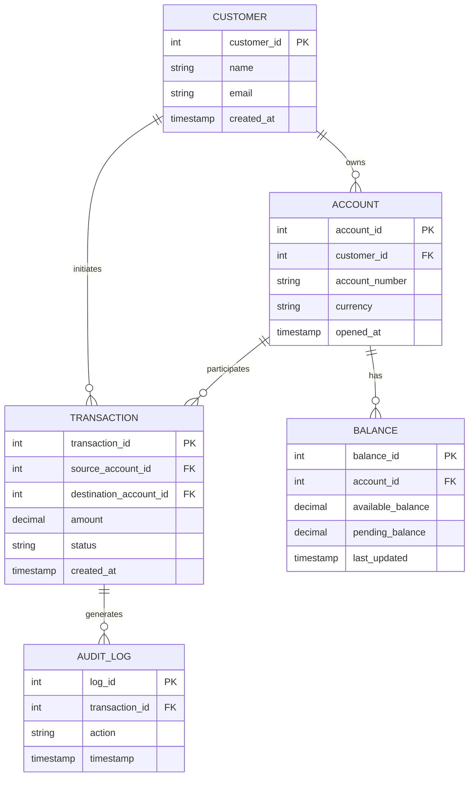
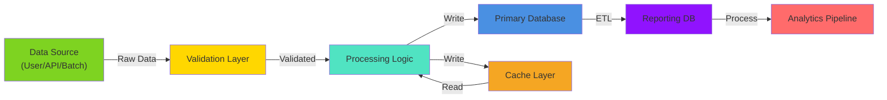

# 04 — Data Design

<!--
INSTRUCTIONS:
1. Document your data model and entity relationships
2. Define database schema with all tables, columns, and constraints
3. Show data flows across system boundaries
4. Classify all data according to Techcombank data classification
5. Document stored procedures and data access patterns
6. Remove these instruction comments when complete
-->

## Data Model Overview

### Entity-Relationship Diagram

<!--
Show all major entities, attributes, and relationships.
Include cardinality, primary keys, foreign keys.
Group related entities logically.

Use Mermaid ER diagram syntax.
-->



### Entity Definitions

| Entity | Purpose | Lifecycle | Retention |
|--------|---------|-----------|-----------|
| [Entity] | [What it represents] | [Created/Updated/Deleted when?] | [How long kept?] |
| [Entity] | [What it represents] | [Created/Updated/Deleted when?] | [How long kept?] |

---

## Database Schema

### Primary Tables

<!--
Define each table with columns, data types, constraints, and indexes.
Include NULL constraints, default values, check constraints.
-->

#### Table: [TABLE_NAME]

**Purpose:** [What data does this table hold? Why?]

```sql
CREATE TABLE [schema].[TABLE_NAME] (
    [column_id] INT NOT NULL PRIMARY KEY IDENTITY(1,1),
    [column_name] VARCHAR(255) NOT NULL,
    [column_email] VARCHAR(255) UNIQUE,
    [column_status] VARCHAR(50) CHECK (column_status IN ('active', 'inactive', 'deleted')),
    [created_at] DATETIME DEFAULT GETUTCDATE(),
    [updated_at] DATETIME DEFAULT GETUTCDATE(),

    CONSTRAINT fk_[table]_[reference] FOREIGN KEY ([column_id])
        REFERENCES [reference_table]([id])
);

CREATE INDEX idx_[table]_[column] ON [schema].[TABLE_NAME]([column_name]);
```

| Column | Data Type | Nullable | Default | Constraint | Purpose |
|--------|-----------|----------|---------|-----------|---------|
| [column] | [type] | [Y/N] | [default] | [PK/FK/UNIQUE] | [Purpose] |
| [column] | [type] | [Y/N] | [default] | [PK/FK/UNIQUE] | [Purpose] |

#### Table: [TABLE_NAME]

[Repeat schema for each table]

### Index Strategy

| Table | Index | Columns | Type | Reason |
|-------|-------|---------|------|--------|
| [Table] | idx_[name] | [col1, col2] | B-Tree/Hash | [Performance reason] |
| [Table] | idx_[name] | [col1, col2] | B-Tree/Hash | [Performance reason] |

### Referential Integrity

| FK Constraint | Parent Table | Child Table | Action | Notes |
|---------------|-------------|-------------|--------|-------|
| fk_[name] | [parent] | [child] | CASCADE/RESTRICT | [When should cascading occur?] |
| fk_[name] | [parent] | [child] | CASCADE/RESTRICT | [When should cascading occur?] |

---

## Data Flow Diagram

### End-to-End Data Movement

<!--
Show how data flows through the system:
- From source (user input, external system, batch import)
- Through processing layers
- To destination (database, cache, other systems, reporting)
- Including transformations and enrichment

Use Mermaid flowchart or graph.
-->



### Data Transformations

| Source Format | Processing | Target Format | Volume/Frequency |
|---------------|-----------|---------------|--------------------|
| [Format] | [How transformed?] | [Format] | [Amount & frequency] |
| [Format] | [How transformed?] | [Format] | [Amount & frequency] |

---

## Data Classification

### Classification Standards

This design follows Techcombank's [Data Classification Standard](https://techcombank.com/data-classification).

### Classified Data Inventory

| Data Element | Classification | PII? | PHI? | Storage | Encryption | Access Control |
|--------------|----------------|------|------|---------|-----------|-----------------|
| Customer Name | Confidential | Yes | No | Database | AES-256 | Role-based |
| Account Number | Restricted | Yes | No | Database | AES-256 | Role-based |
| Transaction Amount | Internal | No | No | Database | At-rest only | Role-based |
| Email Address | Confidential | Yes | No | Database | AES-256 | Role-based |
| [Data Element] | [Classification] | [Yes/No] | [Yes/No] | [Where?] | [Type] | [Method] |

### Data Residency Requirements

- **Data Residency:** [Jurisdiction/Region requirements]
- **Cross-Border Transfer:** [Allowed/Restricted] — [Details]
- **Compliance:** [GDPR/Local Regulations/Other]

### Data Retention Policies

| Data Type | Retention Period | Disposal Method | Regulatory Basis |
|-----------|------------------|-----------------|------------------|
| Transaction Records | [Period] | [How deleted?] | [Regulation] |
| Customer PII | [Period] | [How deleted?] | [Regulation] |
| Audit Logs | [Period] | [How deleted?] | [Regulation] |
| [Data Type] | [Period] | [How deleted?] | [Regulation] |

---

## Stored Procedures & Functions

### Critical Stored Procedures

<!--
Document any stored procedures, user-defined functions, or database logic.
Include purpose, parameters, and performance considerations.
-->

#### Procedure: [PROCEDURE_NAME]

**Purpose:** [What does this procedure do?]

**Invoked by:** [Which application/service calls this?]

**Parameters:**

| Name | Type | Direction | Description |
|------|------|-----------|-------------|
| @param1 | INT | IN | [Description] |
| @param2 | VARCHAR(100) | IN | [Description] |
| @result | INT | OUT | [Description] |

**Performance Consideration:** [Expected execution time, impact]

```sql
CREATE PROCEDURE [schema].[PROCEDURE_NAME]
    @param1 INT,
    @param2 VARCHAR(100),
    @result INT OUTPUT
AS
BEGIN
    -- Procedure logic
    -- ...
END
```

#### Procedure: [PROCEDURE_NAME]

[Repeat for each critical procedure]

### User-Defined Functions

[Document any UDFs similarly]

---

## Data Access Patterns

### Query Patterns

| Pattern | Frequency | Volume | Criticality | Optimization |
|---------|-----------|--------|------------|--------------|
| [Type of query] | [How often?] | [How much data?] | High/Medium/Low | [Index/Denormalization] |
| [Type of query] | [How often?] | [How much data?] | High/Medium/Low | [Index/Denormalization] |

### Backup & Recovery

- **Backup Strategy:** [Full/Incremental/Differential]
- **Backup Frequency:** [Daily/Hourly/Real-time]
- **Retention Period:** [How many backups kept?]
- **Recovery Time Objective (RTO):** [Time to recover]
- **Recovery Point Objective (RPO):** [Data loss tolerance]
- **Storage Location:** [Where backups stored?]

### High Availability

- **Replication:** [Primary-Secondary/Multi-Master/None]
- **Failover Strategy:** [Automatic/Manual]
- **Consistency Model:** [Strong/Eventual]

---

## Data Quality & Validation

### Validation Rules

| Data Element | Validation Rule | Enforcement Point | Error Handling |
|--------------|-----------------|-------------------|-----------------|
| [Field] | [Rule] | [App/DB] | [Action on failure] |
| [Field] | [Rule] | [App/DB] | [Action on failure] |

### Audit & Logging

- **Audit Scope:** [What changes are logged?]
- **Retention:** [How long are audit logs kept?]
- **Sensitive Data Masking:** [How is PII handled in logs?]

---

## References

- [Data Classification Standard](https://techcombank.com/data-classification)
- [Database Design Guidelines](https://techcombank.com/architecture/db-standards)
- [Backup & Recovery Policy](https://techcombank.com/operations/backup-policy)
- [Security Design Document](08-security-design.md)
