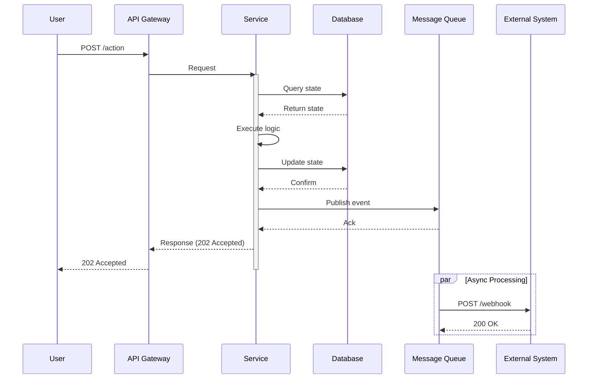
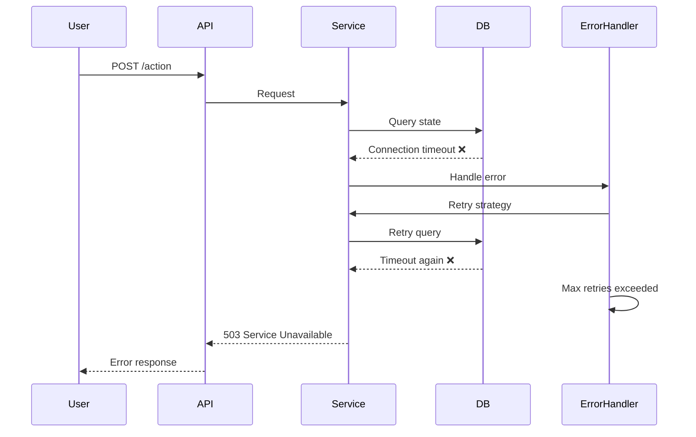
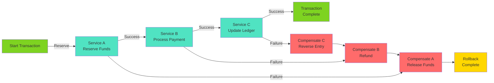
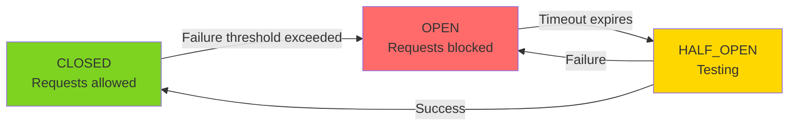

# 05 — Detailed Design

<!--
INSTRUCTIONS:
1. Document key workflows with sequence diagrams (happy path, error path)
2. Explain error handling strategy and recovery mechanisms
3. Describe idempotency approach for distributed operations
4. Show interaction details between components
5. Include compensation logic for saga patterns
6. Remove these instruction comments when complete
-->

## Key Workflows

### Workflow 1: [Happy Path - Primary Use Case]

<!--
Show the normal, successful execution path.
Use sequence diagram to show interactions between components.
Include timings where relevant.
-->

**Workflow Name:** [Workflow Name]

**Participants:**
- [Actor/System 1]
- [Component 1]
- [Component 2]
- [External System]

**Preconditions:**
- [Precondition 1]
- [Precondition 2]

**Steps:**

1. [Actor] initiates [action]
2. [Component 1] validates [input]
3. [Component 1] calls [Component 2] with [parameters]
4. [Component 2] processes [logic]
5. [Component 2] returns [result]
6. [Component 1] persists [state] to database
7. [Component 1] publishes [event] to message queue
8. [Actor] receives [response]

**Postconditions:**
- [State after workflow]
- [Side effects]

**Performance Characteristics:**
- **Expected Duration:** [P50/P99 latency]
- **Throughput:** [Requests per second]
- **Resource Usage:** [CPU/Memory impact]

**Sequence Diagram:**



---

### Workflow 2: [Error Handling Path]

**Workflow Name:** [When errors occur - what happens?]

**Trigger:** [What condition causes this workflow?]

**Error Scenario:**

1. [Step at which error occurs]
2. [Error detected]
3. [Recovery action 1]
4. [Recovery action 2]
5. [User notification / retry]

**Sequence Diagram:**



**Error Codes & Recovery:**

| Error Code | Cause | Recovery | Retry? |
|-----------|-------|----------|--------|
| 400 | Invalid input | Validate and resubmit | No |
| 409 | Conflict/Duplicate | Apply idempotency key | No |
| 503 | Service unavailable | Exponential backoff | Yes |
| 504 | Timeout | Retry with backoff | Yes |

---

### Workflow 3: [Compensation/Saga Path]

<!--
If using saga pattern for distributed transactions, show the happy path
and the compensation logic if any step fails.
-->

**Workflow Name:** [Distributed transaction - e.g., Payment Processing]

**Type:** [Orchestration/Choreography]

**Participants:**
- [Service 1]
- [Service 2]
- [Service 3]

**Happy Path Steps:**

1. Service A: Reserve funds
2. Service B: Process payment
3. Service C: Update ledger
4. All committed

**Failure Path (Compensation):**

If step 2 fails:
1. Service C: Reverse ledger entry (compensating transaction)
2. Service A: Release reserved funds (compensating transaction)
3. Final state: Transaction rolled back

**Saga Definition:**



---

## Error Handling Strategy

### Error Classification

<!--
Classify errors by type: validation, timeout, service unavailable, conflict, etc.
Define handling strategy for each class.
-->

| Error Class | Examples | Cause | Handling | User Impact |
|-----------|----------|-------|----------|------------|
| **Validation** | Invalid email, missing field | Client error | Return 400 immediately | User must fix input |
| **Conflict** | Duplicate entry, race condition | Business logic | Return 409, show conflict | User retries |
| **Transient** | Network timeout, service busy | Infrastructure | Retry with backoff | Transparent retry |
| **Fatal** | Database corruption, OOM | Critical failure | Log, alert, fail fast | Service unavailable |

### Retry Strategy

**Transient Errors (Automatic Retry):**

```
Attempt 1: Immediate
Attempt 2: Wait 100ms
Attempt 3: Wait 200ms (exponential backoff)
Attempt 4: Wait 400ms
Attempt 5: Wait 800ms
Max 5 attempts → Give up
```

**Configuration:**

| Parameter | Value | Reason |
|-----------|-------|--------|
| Max Retries | 5 | [Why this number?] |
| Initial Delay | 100ms | [Why this timing?] |
| Backoff Factor | 2x | [Why exponential?] |
| Max Delay | 5s | [Why cap?] |

### Circuit Breaker

<!--
For external service calls, define circuit breaker strategy.
-->

**Circuit Breaker State Machine:**



**Parameters:**

| Parameter | Value | Meaning |
|-----------|-------|---------|
| Failure Threshold | 5 consecutive failures | Open circuit after this many failures |
| Timeout | 30 seconds | How long to wait in OPEN state before trying HALF_OPEN |
| Success Threshold | 3 successes | Return to CLOSED after this many successes in HALF_OPEN |

### Error Logging & Observability

- **Log Level:** [Which errors logged at which level?]
  - ERROR: [Types of errors]
  - WARN: [Types of warnings]
  - INFO: [Business events]

- **Metrics:**
  - Error rate by type
  - Recovery success rate
  - Retry attempt distribution

- **Alerting:**
  - [Alert 1]: Triggered when [condition]
  - [Alert 2]: Triggered when [condition]

---

## Idempotency

### Idempotency Strategy

<!--
How do you ensure operations can be safely retried?
Key principle: multiple identical requests should have the same effect as a single request.
-->

**Idempotency Key Approach:**

1. Client generates unique `idempotency_key` (UUID v4)
2. Client includes in request header: `Idempotency-Key: [UUID]`
3. Server stores mapping: `[idempotency_key] -> [result]`
4. On retry with same key: return cached result, don't reprocess

**Implementation:**

| Component | Responsibility |
|-----------|-----------------|
| Client | Generate and send `Idempotency-Key` header |
| API Gateway | Validate header present for state-changing operations |
| Service | Store result with key, check on retry |
| Cache | TTL on idempotency cache entries (24 hours) |

**Idempotency Database Schema:**

```sql
CREATE TABLE idempotency_keys (
    idempotency_key UUID PRIMARY KEY,
    request_hash VARCHAR(64),         -- Hash of request body
    result_status INT,                 -- HTTP status returned
    result_body JSON,                  -- Response body
    created_at TIMESTAMP,
    expires_at TIMESTAMP,
    CONSTRAINT idx_created CHECK (created_at < expires_at)
);

CREATE INDEX idx_expires_at ON idempotency_keys(expires_at);
```

**Example Request/Response:**

```http
POST /api/v1/transactions HTTP/1.1
Host: api.techcombank.com
Idempotency-Key: 550e8400-e29b-41d4-a716-446655440000
Content-Type: application/json

{
  "sourceAccount": "123456",
  "destinationAccount": "654321",
  "amount": 1000
}

---

HTTP/1.1 201 Created
Content-Type: application/json

{
  "transactionId": "txn_12345",
  "status": "pending",
  "createdAt": "2026-03-08T10:30:00Z"
}

---

# Retry with same key returns same response:

POST /api/v1/transactions HTTP/1.1
Host: api.techcombank.com
Idempotency-Key: 550e8400-e29b-41d4-a716-446655440000
Content-Type: application/json

{
  "sourceAccount": "123456",
  "destinationAccount": "654321",
  "amount": 1000
}

---

HTTP/1.1 201 Created
Content-Type: application/json
Idempotency-Key-Replayed: true

{
  "transactionId": "txn_12345",
  "status": "pending",
  "createdAt": "2026-03-08T10:30:00Z"
}
```

### Idempotency Scoping

| Operation | Idempotency Scope | TTL |
|-----------|------------------|-----|
| [Operation] | [Customer/Account/Global] | [24 hours] |
| [Operation] | [Customer/Account/Global] | [24 hours] |

---

## Timeout Strategy

### Service Call Timeouts

| Service | Connect Timeout | Read Timeout | Total Timeout | Justification |
|---------|-----------------|--------------|---------------|---------------|
| External API | 2s | 8s | 10s | SLA requires <10s |
| Database | N/A | 5s | 5s | Query optimization |
| Cache | 1s | 1s | 1s | Non-critical |
| Message Queue | 2s | 3s | 5s | Async, can queue if slow |

---

## Distributed Tracing

### Trace Context Propagation

- **Header Format:** W3C Trace Context (traceparent, tracestate)
- **Propagated Through:**
  - HTTP headers
  - Message queue headers
  - Logs (correlation ID)
  - Metrics (trace ID tag)

**Example Trace Flow:**

```
Initial Request:
  traceparent: 00-4bf92f3577b34da6a3ce929d0e0e4736-00f067aa0ba902b7-01

Service A:
  → Parent ID: 4bf92f3577b34da6a3ce929d0e0e4736
  → Span ID: [New]

Service B (called from A):
  → Parent ID: [Service A's Span]
  → Span ID: [New]

Message Queue:
  → Trace ID: 4bf92f3577b34da6a3ce929d0e0e4736
  → Span ID: [New]
```

---

## References

- [Error Handling Best Practices](https://techcombank.com/architecture/error-handling)
- [Saga Pattern Documentation](https://techcombank.com/architecture/patterns/saga)
- [Idempotency Guidelines](https://techcombank.com/architecture/idempotency)
- [Observability Strategy](../07-infrastructure-design.md#observability)
