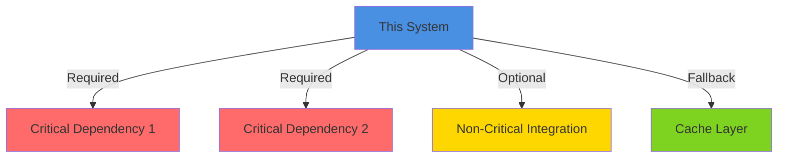

# 06 — Integration Design

<!--
INSTRUCTIONS:
1. Define all integration points with other systems
2. Specify protocols, data formats, and SLAs
3. Document message/event topics and contracts
4. Provide API specifications (link to OpenAPI)
5. Show dependency and sequence flows
6. Remove these instruction comments when complete
-->

## Integration Points Overview

### Summary Table

<!--
High-level view of all systems this architecture integrates with.
Include direction (sends/receives), protocol, and criticality.
-->

| # | System Name | Type | Protocol | Direction | SLA | Criticality |
|---|------------|------|----------|-----------|-----|------------|
| 1 | [System A] | Internal | REST/gRPC | Bidirectional | 99.9% | High |
| 2 | [System B] | External | SFTP | Inbound | 99% | Medium |
| 3 | [System C] | Internal | Kafka | Publish | N/A | Medium |
| 4 | [Mainframe] | Legacy | MQ Series | Bidirectional | 99.95% | Critical |
| 5 | [Partner API] | External | REST | Outbound | 95% | Medium |

---

## System-to-System Integration Details

### Integration 1: [System A Name]

**Type:** [Synchronous REST / Asynchronous Events / File Transfer / Legacy Protocol]

**Purpose:** [Why do we integrate with this system? What data/capabilities are exchanged?]

**Connection Details:**

| Property | Value |
|----------|-------|
| Protocol | [HTTP/HTTPS, gRPC, SFTP, MQ, etc.] |
| Authentication | [API Key, OAuth, mTLS, Legacy auth] |
| Endpoint(s) | [URL/Address of integration point] |
| Network | [Public internet / VPN / Private network] |
| Encryption | [TLS 1.2+, SSH, SSL] |

**Data Flows:**

| Direction | Frequency | Data Type | Volume | Format |
|-----------|-----------|-----------|--------|--------|
| Inbound | Real-time / Daily | [Entity] | [Throughput] | JSON/XML/CSV |
| Outbound | Real-time / Batch | [Entity] | [Throughput] | JSON/XML/CSV |

**SLA & Reliability:**

| Metric | Target | Consequence of Miss |
|--------|--------|-------------------|
| Availability | [99.5% uptime] | [Fallback behavior] |
| Latency (P99) | [100ms] | [Timeout/Queue] |
| Throughput | [1000 req/sec] | [Rate limiting] |
| Data Freshness | [Real-time / Daily] | [Caching strategy] |

**Integration Test Coverage:**

- [X] Happy path
- [X] Error handling (timeout, 500 errors)
- [X] Data validation
- [X] Retry logic
- [X] Idempotency (where applicable)

**Diagram:**

```mermaid
graph LR
    ThisSystem["This System"]
    SystemA["System A"]
    ExternalAPI["External Partner API"]

    ThisSystem -->|POST /api/v1/[resource]<br/>JSON| SystemA
    SystemA -->|200 OK + Response| ThisSystem
    ThisSystem -->|Periodic Poll<br/>or Webhook| ExternalAPI
    ExternalAPI -->|Event Notification| ThisSystem

    style ThisSystem fill:#4A90E2
    style SystemA fill:#50E3C2
    style ExternalAPI fill:#F5A623
```

### Integration 2: [System B Name]

[Repeat structure above for each integration]

---

## Message Specifications

### Event Topics

<!--
If using event-driven architecture (Kafka, RabbitMQ, SNS/SQS, etc.),
document each topic, producers, consumers, and payload schema.
-->

#### Topic: [TOPIC_NAME]

**Purpose:** [What events are published on this topic? Why?]

**Producers:**
- [Service A] — Publishes when [condition]
- [Service B] — Publishes when [condition]

**Consumers:**
- [Service C] — Subscribes to [perform action]
- [Service D] — Subscribes to [perform action]

**Message Schema (Avro):**

```json
{
  "type": "record",
  "name": "[EventType]",
  "namespace": "[domain].[subdomain]",
  "fields": [
    {"name": "eventId", "type": "string", "doc": "Unique event ID"},
    {"name": "eventType", "type": "string", "doc": "Type of event"},
    {"name": "timestamp", "type": "long", "doc": "Unix timestamp in milliseconds"},
    {"name": "sourceSystem", "type": "string"},
    {"name": "entityId", "type": "string"},
    {"name": "entityType", "type": "string"},
    {"name": "payload", "type": "string", "doc": "Event payload as JSON string"},
    {"name": "version", "type": "int", "default": 1}
  ]
}
```

**Example Message:**

```json
{
  "eventId": "evt-550e8400-e29b-41d4-a716-446655440000",
  "eventType": "TransactionCreated",
  "timestamp": 1678274400000,
  "sourceSystem": "PaymentService",
  "entityId": "txn_12345",
  "entityType": "Transaction",
  "payload": "{\"sourceAccount\": \"123456\", \"amount\": 1000, \"status\": \"pending\"}",
  "version": 1
}
```

**Partitioning Strategy:**
- **Partition Key:** [entityId / sourceSystem / timestamp]
- **Reasoning:** [Ensure order / Distribution / Other]

**Retention:**
- **Duration:** [7 days / 30 days / Infinite]
- **Reasoning:** [Compliance / Historical analysis / Other]

**SLA:**
- **Delivery Guarantee:** At-least-once / Exactly-once / At-most-once
- **Order Guarantee:** Per-partition order maintained
- **Latency:** P99 < [100ms]

---

#### Topic: [TOPIC_NAME]

[Repeat for each topic]

---

## API Contracts

### REST API Specification

**OpenAPI/Swagger Location:** `docs/openapi.yaml` or [External URL]

**Base URL:** `https://api.techcombank.com/v1`

**Authentication:** [Bearer Token / API Key / mTLS]

### Key Endpoints

#### Endpoint: [GET/POST] /v1/[resource]

**Purpose:** [What does this endpoint do?]

**Request:**

```http
POST /v1/transactions HTTP/1.1
Content-Type: application/json
Authorization: Bearer [token]
Idempotency-Key: [UUID]

{
  "sourceAccount": "string",
  "destinationAccount": "string",
  "amount": "number",
  "currency": "string",
  "description": "string"
}
```

**Response (Success):**

```http
HTTP/1.1 201 Created
Content-Type: application/json

{
  "transactionId": "txn_550e8400e29b",
  "status": "pending",
  "createdAt": "2026-03-08T10:30:00Z"
}
```

**Response (Error):**

```http
HTTP/1.1 400 Bad Request
Content-Type: application/json

{
  "error": "INVALID_AMOUNT",
  "message": "Amount must be positive",
  "details": {
    "field": "amount",
    "value": "-100"
  }
}
```

**Status Codes:**

| Code | Meaning | Retry? |
|------|---------|--------|
| 201 | Resource created | No |
| 400 | Invalid input | No |
| 401 | Unauthorized | No |
| 409 | Conflict (idempotency) | No |
| 500 | Server error | Yes (with backoff) |
| 503 | Service unavailable | Yes (with backoff) |

#### Endpoint: [GET/POST] /v1/[resource]/[id]

[Repeat for each significant endpoint]

### gRPC Services (if applicable)

**Proto Location:** `api/proto/[service].proto`

```protobuf
service [ServiceName] {
  rpc [MethodName] ([Request]) returns ([Response]);
  rpc [MethodName] ([Request]) returns (stream [Response]);
}
```

---

## Dependency Graph

### Integration Sequence

<!--
Show the order and timing of integrations.
Which systems must be healthy for this system to function?
Which integrations are critical vs. optional?
-->



### Critical Path Dependencies

| Dependency | Required? | Fallback | RTO/RPO |
|-----------|-----------|----------|---------|
| [System A] | Yes | Cache/Queue | 5 min / Immediate |
| [System B] | Yes | Fail request | 5 min / Real-time |
| [System C] | No | Use defaults | N/A |

---

## Resilience Patterns

### Circuit Breakers

```
For each critical integration:
- Monitor error rate
- Open circuit if errors > 50% for 10 consecutive requests
- Try to recover after 30 seconds
- Log all transitions
```

**Configuration per Integration:**

| Integration | Error Threshold | Open Duration | Success Required |
|------------|-----------------|--------------|-----------------|
| [System A] | 5 errors / 10 req | 30s | 3 successes |
| [System B] | 10 errors / 20 req | 60s | 5 successes |

### Bulkhead Pattern

<!--
Isolation between different integration pathways.
Prevent one slow/failing integration from affecting others.
-->

**Thread Pool Allocation:**

| Integration | Thread Pool Size | Queue Size | Timeout |
|------------|-----------------|-----------|---------|
| [System A] | 20 | 100 | 5s |
| [System B] | 10 | 50 | 10s |
| [System C] | 5 | 25 | 2s |

### Rate Limiting (Outbound)

<!--
Respect partner API rate limits and prevent overwhelming external systems.
-->

| Integration | Rate Limit | Burst | Strategy |
|------------|-----------|-------|----------|
| [Partner API] | 100 req/min | 10 | Leaky bucket |
| [External System] | 1000 req/sec | 100 | Token bucket |

---

## Integration Testing

### Test Scenarios

| Scenario | Triggering Condition | Expected Behavior |
|----------|-------------------|-------------------|
| Happy path | Normal request | Successful response |
| Timeout | No response in 5s | Retry + circuit break |
| 500 error | Server error | Retry with exponential backoff |
| Duplicate | Same idempotency key | Return cached result |
| Rate limit | Exceed partner limits | Queue + retry later |

### Contract Testing

- **Consumer-Driven Contracts:** [Tool: Pact / Spring Cloud Contract]
- **Test Coverage:** [Which endpoints / topics are tested?]
- **Continuous Integration:** Contracts verified in CI/CD pipeline

---

## Monitoring & Observability

### Key Metrics per Integration

| Integration | Metric | Alert Threshold |
|------------|--------|-----------------|
| [System A] | Error rate | >1% for 5 min |
| [System A] | Latency P99 | >500ms for 10 min |
| [System A] | Throughput | <50 req/sec (expected 100) |
| [Topic B] | Consumer lag | >1000 messages |
| [Topic B] | Publication latency | >1s |

### Dashboards

- **Integration Health Dashboard:** [Grafana/Datadog link]
  - Shows: Status of all integrations, error rates, latency, circuit breaker states

- **SLA Dashboard:** [Grafana/Datadog link]
  - Shows: Uptime, SLA compliance, incident count

---

## Contingency Planning

### Integration Failure Modes

| Failure Mode | Impact | Detection | Recovery |
|-------------|--------|-----------|----------|
| [System A] fully down | Cannot [function] | Health check fails | Use [fallback] |
| [System B] slow | P99 latency >10s | Metrics alert | Circuit break + queue |
| [API] rate limiting | Requests rejected | 429 responses | Backoff + retry |

### Fallback Strategies

| Integration | Primary | Fallback 1 | Fallback 2 |
|------------|---------|-----------|-----------|
| Real-time data | Live API | Cached data (stale) | Use defaults |
| Payment processing | Payment processor | Queue for later | Manual intervention |

---

## References

- [OpenAPI Specification](docs/openapi.yaml)
- [Message Schema Registry](https://registry.techcombank.com/schemas)
- [Integration Guidelines](https://techcombank.com/architecture/integration)
- [API Security](08-security-design.md#api-security)
- [Infrastructure Design](07-infrastructure-design.md)
