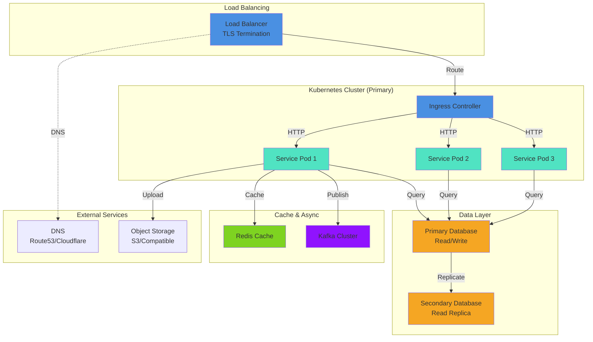
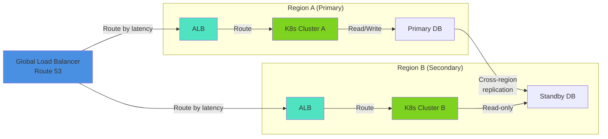

# 07 — Infrastructure Design

<!--
INSTRUCTIONS:
1. Document deployment topology and compute resources
2. Define scaling strategy, storage, and networking
3. Specify disaster recovery and backup approach
4. Document observability, logging, and monitoring
5. Remove these instruction comments when complete
-->

## Deployment Topology

### Architecture Diagram

<!--
Show how the system is deployed across environments and infrastructure.
Include: regions, availability zones, load balancers, databases, CDN, etc.
-->



### Multi-Region Deployment (if applicable)

<!--
If deploying to multiple regions for resilience or latency.
-->



### Environment Strategy

| Environment | Purpose | Scale | Backup | Location |
|------------|---------|-------|--------|----------|
| **Development** | Developer testing | Single node | Daily | [Region] |
| **Staging** | Pre-production validation | Same as prod | Hourly | [Region] |
| **Production** | Live traffic | Scaled | Real-time | [Primary region] |
| **DR Standby** | Disaster recovery | Minimal | Real-time | [Secondary region] |

---

## Compute Resources

### Container/Pod Specifications

<!--
Resource requests and limits for each service component.
-->

#### Service: [Service Name]

**Container Image:** `registry.techcombank.com/[domain]/[service]:[tag]`

**Resource Requests:**

| Resource | Request | Limit | Justification |
|----------|---------|-------|---------------|
| CPU | 500m | 1000m | [Why this amount?] |
| Memory | 512Mi | 1024Mi | [Why this amount?] |
| Disk | 10Gi | 20Gi | [Log/temp storage] |

**Health Checks:**

```yaml
livenessProbe:
  httpGet:
    path: /health/live
    port: 8080
  initialDelaySeconds: 30
  periodSeconds: 10
  timeoutSeconds: 3
  failureThreshold: 3

readinessProbe:
  httpGet:
    path: /health/ready
    port: 8080
  initialDelaySeconds: 10
  periodSeconds: 5
  timeoutSeconds: 2
  failureThreshold: 3
```

#### Service: [Service Name]

[Repeat for each service]

### Node & Cluster Specifications

**Kubernetes Cluster:**

| Property | Value |
|----------|-------|
| Cluster Name | [cluster-name] |
| Version | [1.28.x] |
| Node Count (Desired) | [e.g., 10] |
| Node Count (Min) | [e.g., 5] |
| Node Count (Max) | [e.g., 30] |
| Node Instance Type | [e.g., t3.xlarge] |
| OS | [Ubuntu 20.04 / RHEL / Other] |

**Node Pool (if using node groups):**

| Pool Name | Instance Type | Count | Min | Max | Purpose |
|-----------|---------------|-------|-----|-----|---------|
| compute | [Type] | [Desired] | [Min] | [Max] | Service workloads |
| memory | [Type] | [Desired] | [Min] | [Max] | Stateful workloads |
| gpu | [Type] | [Desired] | [Min] | [Max] | ML/Analytics |

---

## Storage

### Database Strategy

#### Primary Database

**Type:** [PostgreSQL / MySQL / MongoDB / etc.]

**Version:** [12.x / etc.]

**Deployment:** [RDS / Self-managed / Cloud-native]

**Configuration:**

| Property | Value |
|----------|-------|
| Instance Class | [db.r5.2xlarge] |
| Storage | [1000 GB gp2 SSD] |
| IOPS | [3000 IOPS] |
| Backup Retention | [30 days] |
| Multi-AZ | [Yes / No] |

**Performance Tuning:**

```sql
-- Relevant configurations
shared_buffers = 25% of RAM
effective_cache_size = 75% of RAM
work_mem = [appropriate for workload]
maintenance_work_mem = [appropriate]
```

#### Secondary Database / Read Replica

[Similar structure as primary]

### Distributed Cache

**Technology:** Redis / Memcached

**Topology:** [Standalone / Cluster / Sentinel]

**Configuration:**

| Property | Value |
|----------|-------|
| Instance Type | [cache.r6g.xlarge] |
| Nodes | [3 (cluster)] |
| Availability | Multi-AZ |
| Eviction Policy | [allkeys-lru] |
| Max Memory | [10 GB] |

**Use Cases:**

| Data Type | TTL | Invalidation | Critical? |
|-----------|-----|--------------|-----------|
| Session data | 24 hours | On logout | Yes |
| User profiles | 1 hour | On update | No |
| Query results | 5 min | On data change | No |

### File Storage

**Technology:** S3 / GCS / Self-managed

**Configuration:**

| Property | Value |
|----------|-------|
| Bucket | [bucket-name] |
| Storage Class | [Standard / Infrequent Access] |
| Versioning | [Enabled / Disabled] |
| Encryption | [AES-256 / KMS] |
| Access Log | [Enabled] |

**Data Types:**

| Data | Retention | Encryption | Backup |
|------|-----------|-----------|--------|
| User documents | 7 years | AES-256 | Daily snapshot |
| Logs | 90 days | At-rest only | None |
| Archives | Indefinite | AES-256 | Monthly copy |

---

## Networking

### Network Architecture

**VPC/Network Configuration:**

| Property | Value |
|----------|-------|
| CIDR Block | [10.0.0.0/16] |
| Public Subnets | [10.0.1.0/24, 10.0.2.0/24] |
| Private Subnets | [10.0.10.0/24, 10.0.11.0/24] |
| Availability Zones | [2 / 3] |

**Security Groups/Firewall Rules:**

| Source | Dest | Port | Protocol | Purpose |
|--------|------|------|----------|---------|
| [CIDR] | Service | 443 | HTTPS | Public API |
| [CIDR] | Database | 5432 | TCP | DB access from service |
| [CIDR] | Cache | 6379 | TCP | Cache access |
| 0.0.0.0/0 | LB | 443 | HTTPS | Client traffic |

**DNS:**

| Record | Type | Value | TTL |
|--------|------|-------|-----|
| api.techcombank.com | CNAME | alb.region.amazonaws.com | 300s |
| db.internal | A | [Private IP] | 60s |
| cache.internal | A | [Private IP] | 60s |

### Ingress & Load Balancing

**Load Balancer Type:** Application Load Balancer / Network Load Balancer

**Configuration:**

| Property | Value |
|----------|-------|
| Name | [alb-prod-primary] |
| Scheme | [internet-facing / internal] |
| Subnets | [public-1a, public-1b] |
| Security Groups | [lb-sg] |

**Listener Rules:**

| Host | Path | Target Group | Priority |
|------|------|--------------|----------|
| api.techcombank.com | /v1/* | service-tg | 1 |
| api.techcombank.com | /health | health-tg | 2 |
| api.techcombank.com | /* | default-404-tg | 999 |

**TLS/SSL:**

| Certificate | Domain | Valid Until | Auto-renewal |
|-------------|--------|-------------|--------------|
| [cert-name] | *.api.techcombank.com | 2027-03-08 | Yes (ACM) |

---

## Auto-Scaling

### Horizontal Pod Autoscaler (Kubernetes)

```yaml
apiVersion: autoscaling/v2
kind: HorizontalPodAutoscaler
metadata:
  name: service-hpa
spec:
  scaleTargetRef:
    apiVersion: apps/v1
    kind: Deployment
    name: [service-name]
  minReplicas: 3
  maxReplicas: 30
  metrics:
  - type: Resource
    resource:
      name: cpu
      target:
        type: Utilization
        averageUtilization: 70
  - type: Resource
    resource:
      name: memory
      target:
        type: Utilization
        averageUtilization: 80
  behavior:
    scaleDown:
      stabilizationWindowSeconds: 300
    scaleUp:
      stabilizationWindowSeconds: 0
```

### Database Auto-Scaling (if applicable)

| Target | Metric | Scale-up Threshold | Scale-down Threshold |
|--------|--------|-------------------|----------------------|
| RDS Storage | Used Space | 90% | N/A (manual) |
| Read Replicas | CPU | 70% | 30% |
| Read Replicas | Connections | 100/max | 50/max |

### Node Auto-Scaling

**Cluster Autoscaler Configuration:**

| Property | Value |
|----------|-------|
| Scale-up delay | 0 seconds |
| Scale-down delay | 10 minutes |
| Min node count | 5 |
| Max node count | 30 |

---

## Disaster Recovery (DR)

### RTO & RPO Targets

| Component | RTO | RPO | Strategy |
|-----------|-----|-----|----------|
| Application | 5 minutes | 1 minute | Multi-region failover |
| Database | 5 minutes | 1 minute | Cross-region replication |
| Cache | N/A (non-critical) | N/A | Rebuild on failover |
| File Storage | 15 minutes | 5 minutes | S3 cross-region replication |

### Backup Strategy

**Database Backups:**

```
Backup Schedule:
- Continuous WAL (Write-Ahead Logs) shipping
- Daily full backup at 2 AM UTC
- Hourly incremental backups
- Retention: 30 days
- Cross-region copy: Automated
```

**Backup Verification:**

- Weekly restore test to staging environment
- Automated integrity checks
- Metrics: Backup completion time, restore duration

**Retention Policy:**

| Backup Type | Retention | Location | Encryption |
|------------|-----------|----------|-----------|
| Hourly incremental | 7 days | Primary region | AES-256 |
| Daily full | 30 days | Primary + Secondary | AES-256 |
| Weekly | 12 weeks | Secondary region | AES-256 |
| Monthly | 7 years | Offline vault | AES-256 |

### Failover Procedure

**Automated Failover Steps:**

1. Health checks detect primary failure
2. DNS updated to point to secondary region (30s TTL)
3. Secondary database promoted (standby → primary)
4. Secondary application cluster receives traffic
5. Alerts sent to ops team
6. Monitoring confirms stability

**Manual Failback:**

1. Primary infrastructure restored
2. Primary database caught up with secondary
3. Traffic gradually shifted back (canary)
4. Monitoring for 24 hours before full restoration

---

## Observability, Logging & Monitoring

### Logging Strategy

**Log Aggregation:** ELK / Splunk / CloudWatch

**Log Sources:**

| Source | Format | Retention | Level |
|--------|--------|-----------|-------|
| Application | JSON | 30 days | INFO/WARN/ERROR |
| Kubernetes | JSON | 7 days | All |
| Database Audit | Structured | 90 days | All |
| Infrastructure | JSON | 14 days | INFO/WARN/ERROR |

**Log Structure (JSON):**

```json
{
  "timestamp": "2026-03-08T10:30:00Z",
  "level": "INFO",
  "logger": "TransactionService",
  "message": "Transaction created",
  "traceId": "550e8400-e29b-41d4-a716-446655440000",
  "spanId": "00f067aa0ba902b7",
  "userId": "user_12345",
  "transactionId": "txn_12345",
  "duration_ms": 145,
  "service": "payment-service",
  "version": "1.2.3",
  "environment": "production"
}
```

**Sensitive Data Masking:**

```
Masked fields: password, token, creditCard, ssn, apiKey
Masking rule: Replace with [REDACTED]
Applied at: Application logging layer
```

### Metrics & Monitoring

**Metrics Platform:** Prometheus / Datadog / CloudWatch

**Key Metrics:**

| Metric | Collection | Alert Threshold | SLO |
|--------|-----------|-----------------|-----|
| Request latency (P50/P99) | Prometheus | P99 > 500ms | 99% < 200ms |
| Error rate | Prometheus | > 1% for 5 min | 99.9% success |
| CPU usage | Kubernetes | > 80% sustained | < 75% avg |
| Memory usage | Kubernetes | > 85% | < 80% avg |
| Disk usage | Prometheus | > 90% | < 85% |
| DB connections | Prometheus | > 80% of max | < 70% avg |
| Queue depth | Prometheus | > 10k messages | < 5k avg |

**Dashboards:**

- **System Health:** CPU, Memory, Disk, Network
- **Application:** Request rate, error rate, latency, throughput
- **Database:** Connections, query latency, replication lag
- **Business:** Transaction count, amount processed, user activity

### Distributed Tracing

**Technology:** Jaeger / Datadog / New Relic

**Trace Configuration:**

| Parameter | Value |
|-----------|-------|
| Sampling Rate | 10% (production), 100% (staging) |
| Max trace duration | 60 seconds |
| Span timeout | 5 seconds |
| Retention | 72 hours |

**Traces Include:**

- Request entry point → response
- All service-to-service calls
- Database queries
- External API calls
- Cache hits/misses

### Alerting Strategy

**Alert Channels:**

- **Critical:** PagerDuty (pages on-call engineer)
- **High:** Slack #alerts + email
- **Medium:** Slack #alerts
- **Low:** Metrics dashboard only

**Sample Alerts:**

| Alert | Condition | Severity | Action |
|-------|-----------|----------|--------|
| Service Down | Health check failing 3x | Critical | Page on-call |
| High Error Rate | > 5% for 2 min | High | Notify team |
| DB Connection Pool Exhausted | > 90% utilization | High | Notify team |
| Queue Lag Growing | > 10k messages | Medium | Alert team |

---

## Maintenance Windows

**Planned Maintenance:**

| Component | Frequency | Duration | Window |
|-----------|-----------|----------|--------|
| K8s cluster upgrade | Quarterly | 2 hours | Sat 2-4 AM UTC |
| Database patching | Monthly | 30 minutes | Sun 3-3:30 AM UTC |
| OS patching | Monthly | 1 hour per node | Rolling, 1 per day |

---

## Cost Optimization

**Monthly Cost Breakdown:**

| Component | Estimated Cost | Optimization Strategy |
|-----------|-----------------|----------------------|
| Compute (K8s nodes) | $[X] | Reserved instances, spot instances |
| Database | $[X] | Adjust instance type, use read replicas |
| Storage | $[X] | Intelligent tiering, lifecycle policies |
| Data transfer | $[X] | CDN, regional deployment |
| **Total Monthly** | **$[X]** | |

---

## References

- [AWS Best Practices](https://aws.amazon.com/architecture/well-architected/)
- [Kubernetes Documentation](https://kubernetes.io/docs/)
- [SRE Book - Reliability](https://sre.google/sre-book/disaster-recovery/)
- [Observability Guide](https://techcombank.com/architecture/observability)
- [Security Design](08-security-design.md)
