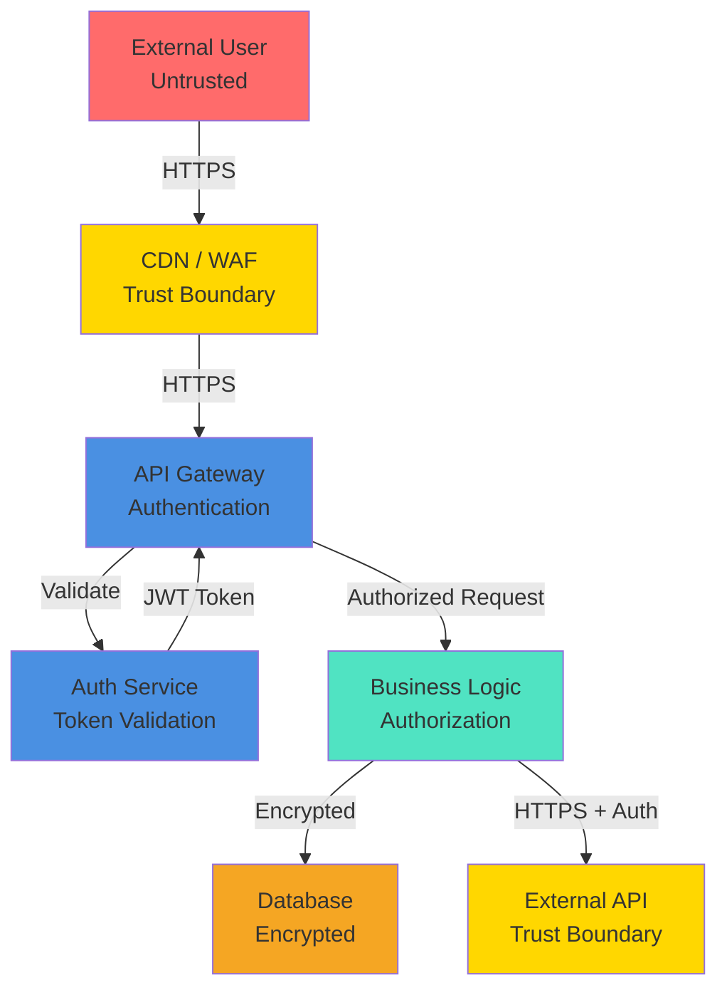
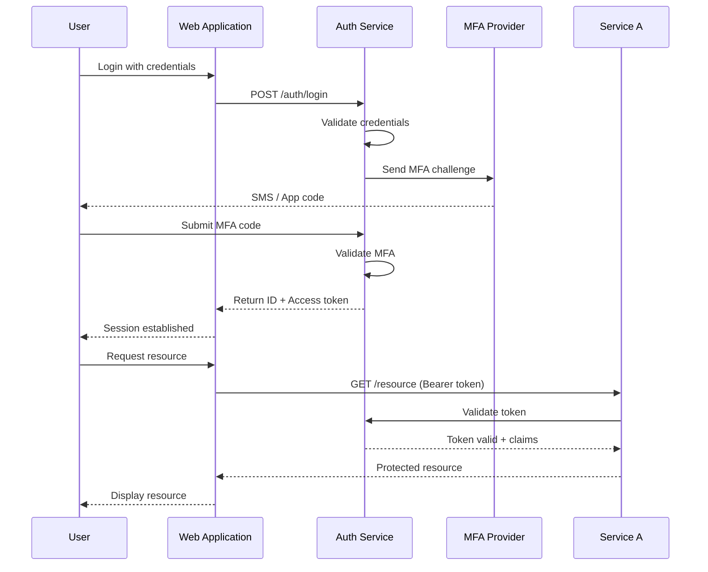

# 08 — Security Design

<!--
INSTRUCTIONS:
1. Document threat model and security architecture
2. Define authentication, authorization, and data protection
3. Specify encryption, compliance, and security testing
4. Remove these instruction comments when complete
-->

## Security Overview

**Security Owner:** [Name/Title]

**Classification Level:** [Confidential / Internal / Public based on Techcombank standards]

---

## Threat Model

### Threat Analysis Methodology

This section uses a systematic approach to identify potential threats:
- **STRIDE:** Spoofing, Tampering, Repudiation, Information Disclosure, Denial of Service, Elevation of Privilege
- **DREAD:** Damage, Reproducibility, Exploitability, Affected Users, Discoverability

### Data Flow Diagram (Security Focus)



### Critical Assets & Threats

| Asset | Threat | Severity | Mitigation |
|-------|--------|----------|-----------|
| Customer PII | Unauthorized access | Critical | Encryption + RBAC |
| Payment data | Tampering | Critical | Digital signatures + audit logs |
| API keys | Theft / Exposure | Critical | Secret manager + rotation |
| Authentication tokens | Spoofing / Theft | Critical | Short expiry + TLS |
| Database | Ransomware | High | Backups + network isolation |
| Application code | Malware injection | High | Code scanning + signed images |
| Configuration | Misconfiguration | High | IaC validation + secrets scanning |

### Attack Surface

| Attack Vector | Entry Point | Risk Level | Control |
|---------------|-------------|-----------|---------|
| Network (untrusted) | API endpoints | High | TLS 1.2+, WAF, API Gateway |
| Authentication | Login endpoint | Critical | MFA, rate limiting, account lockout |
| Authorization bypass | Privilege escalation | Critical | RBAC, audit logging |
| Data exfiltration | Database access | Critical | Data classification, encryption, DLP |
| Insider threat | System access | High | MFA, audit logs, least privilege |
| Third-party integration | External APIs | High | API validation, rate limiting, isolation |

---

## Authentication & Authorization

### Authentication Strategy

**Authentication Type:** OAuth 2.0 / OpenID Connect / SAML 2.0

**Supported Methods:**

| Method | Use Case | Implementation | MFA Required |
|--------|----------|----------------|--------------|
| User/Password | Staff login | OAuth 2.0 + MFA | Yes |
| API Key | Service-to-service | Long-lived keys with rotation | N/A |
| mTLS | Service mesh | Certificate-based | N/A |
| SAML | Enterprise SSO | Corporate identity provider | Yes |

### Authentication Flow

#### User Authentication (OAuth 2.0)



**Token Configuration:**

| Token Type | Lifetime | Refresh | Storage | Usage |
|-----------|----------|---------|---------|-------|
| ID Token | 1 hour | N/A | Secure cookie | Identity verification |
| Access Token | 15 minutes | Via refresh token | Memory/Session | API authorization |
| Refresh Token | 7 days | Manual rotation | HttpOnly cookie | Obtain new access token |

#### API Key Authentication

```
API Key Format: [domain]_[environment]_[timestamp]_[random]
Example: payments_prod_20260308_a7f3e8d2c1b9

Rotation: 90 days automatic + immediate on compromise
Storage: HashiCorp Vault / AWS Secrets Manager
```

### Authorization Strategy

**Authorization Model:** Role-Based Access Control (RBAC) with Attribute-Based Control (ABAC)

#### Role Definitions

| Role | Permissions | Scope | Typical Users |
|------|-----------|-------|---------------|
| **Admin** | All operations | All domains | Security team, senior architects |
| **Domain Lead** | Create/Update designs in domain | Domain | Domain architects |
| **Reviewer** | Review and approve submissions | Assigned projects | Technical leads |
| **Developer** | Read designs, create features | Own domain | Development teams |
| **Auditor** | Read-only access | All domains | Compliance team |
| **Guest** | View published designs | Public only | External stakeholders |

#### Permission Matrix

```
Resource: DAB Submission

Role          | View | Create | Edit | Review | Approve | Delete |
--------------|------|--------|------|--------|---------|--------|
Admin         |  ✓   |   ✓    |  ✓   |   ✓    |    ✓    |   ✓    |
Domain Lead   |  ✓   |   ✓    |  ✓   |   ✓    |    ✓    |   ✗    |
Reviewer      |  ✓   |   ✗    |  ✗   |   ✓    |    ✓    |   ✗    |
Developer     |  ✓   |   ✓    |  ✓*  |   ✗    |    ✗    |   ✗    |
Auditor       |  ✓   |   ✗    |  ✗   |   ✗    |    ✗    |   ✗    |
Guest         |  ✓** |   ✗    |  ✗   |   ✗    |    ✗    |   ✗    |

* Can edit own submissions only
** Published/approved only
```

#### Policy Enforcement

```yaml
# Example policy: "Only domain leads can approve designs in their domain"
policy:
  name: DomainLeadApproval
  resource: dab_submission
  action: approve
  conditions:
    - role: domain_lead
    - attribute: submission.domain == user.assigned_domain
    - attribute: submission.status == "in_review"
  effect: allow
```

---

## Encryption

### Encryption in Transit

**Protocol:** TLS 1.2 minimum, TLS 1.3 preferred

**Certificate Management:**

| Endpoint | Certificate Type | Provider | Auto-renewal | SAN |
|----------|-----------------|----------|--------------|-----|
| api.techcombank.com | Wildcard | Let's Encrypt / ACM | Yes | *.api.techcombank.com |
| internal services | Self-signed | Internal PKI | Quarterly | [service-names] |
| service-to-service | mTLS | Internal PKI | Quarterly | [service-names] |

**Configuration:**

```
TLS Version: 1.2 minimum, 1.3 preferred
Cipher Suites: Only strong ciphers (ECDHE + AES-256 / ChaCha20)
HSTS: Enabled (max-age=31536000; includeSubDomains)
OCSP Stapling: Enabled
Certificate Pinning: Enabled for critical APIs
```

**API Gateway TLS Termination:**

```nginx
server {
    listen 443 ssl http2;
    server_name api.techcombank.com;

    ssl_protocols TLSv1.2 TLSv1.3;
    ssl_ciphers HIGH:!aNULL:!MD5;
    ssl_prefer_server_ciphers on;
    ssl_certificate /etc/ssl/certs/api.crt;
    ssl_certificate_key /etc/ssl/private/api.key;
    ssl_session_cache shared:SSL:10m;
    ssl_session_timeout 10m;
}
```

### Encryption at Rest

**Default:** AES-256-GCM for all sensitive data

| Data Store | Encryption Type | Key Management | Key Rotation |
|-----------|-----------------|-----------------|--------------|
| Database | AES-256 (RDS) | AWS KMS | AWS managed (annual) |
| Backups | AES-256 | AWS KMS | AWS managed (annual) |
| S3 buckets | AES-256 | AWS KMS | AWS managed (annual) |
| Redis cache | AES-256 | Internal KMS | 90-day manual |
| Secrets vault | AES-256 | Internal KMS | 90-day manual |

**Database Encryption Detail:**

```sql
-- Enable Transparent Data Encryption (TDE) for SQL Server
ALTER DATABASE [database_name]
SET ENCRYPTION ON;

-- Verify encryption
SELECT name, is_encrypted FROM sys.databases;
```

### Key Management

**Secrets Management:** HashiCorp Vault / AWS Secrets Manager

**Secret Types & Rotation:**

| Secret Type | Rotation Interval | Alert Before | Storage |
|-------------|-------------------|--------------|---------|
| Database passwords | 90 days | 2 weeks before | Vault |
| API keys | 90 days | 2 weeks before | Vault |
| TLS certificates | Annual | 30 days before | ACM |
| SSH keys | 180 days | 2 weeks before | Vault |
| OAuth client secrets | 180 days | 2 weeks before | Vault |

**Access Control:**

```
Only services/users with legitimate need:
- Service A can read database password
- Service B cannot read Service A's secrets
- Audit trail: All secret access logged
```

---

## Data Classification & Handling

### Data Classification Levels

Per [Techcombank Data Classification Standard](https://techcombank.com/data-classification):

| Classification | Examples | Encryption | Access | Retention |
|----------------|----------|-----------|--------|-----------|
| **PUBLIC** | Published documents | Optional | Everyone | [Per policy] |
| **INTERNAL** | Internal documents, non-financial data | Optional | Employees | [Per policy] |
| **CONFIDENTIAL** | Customer PII, transaction data | Required | Role-based | [Per policy] |
| **RESTRICTED** | Encryption keys, credentials, audit logs | Required | Admin only | [Per policy] |

### Sensitive Data Handling

**PII (Personally Identifiable Information):**

```
Includes: Name, Email, Phone, Address, ID numbers
Storage: Encrypted at rest
Transmission: HTTPS only
Logging: Never log in full; use last-4 digits or hash
Deletion: Per retention policy, secure wipe
```

**Financial Data:**

```
Includes: Account numbers, transaction amounts, balances
Storage: Encrypted (AES-256)
Transmission: HTTPS + digital signature
Logging: Audit log only, masked in application logs
Retention: 7 years per regulatory requirement
```

**Secrets (API keys, passwords, tokens):**

```
Storage: HashiCorp Vault or AWS Secrets Manager only
Never commit to version control
Never log in application logs
Rotation: Every 90 days
```

### Data Minimization

- **Principle:** Collect only necessary data
- **Practice:** Not storing full credit card numbers (tokenization)
- **Audit:** Quarterly review of data retention
- **Compliance:** GDPR right to deletion respected

---

## Security Testing & Validation

### Application Security Testing

| Test Type | Frequency | Tool | Coverage | Pass Criteria |
|-----------|-----------|------|----------|-----------------|
| SAST | Every commit | SonarQube / Checkmarx | 100% of code | No critical issues |
| DAST | Weekly | OWASP ZAP / Burp Suite | All endpoints | No vulnerabilities |
| IAST | Continuous | Contrast / Snyk | Production code | No critical issues |
| Dependency check | Every commit | Snyk / Dependabot | All dependencies | No unpatched critical CVEs |
| Container scan | Every build | Trivy / Anchore | Container images | No critical vulnerabilities |

**SAST Configuration:**

```yaml
sonar:
  projectKey: payment-service
  sources: src/
  exclusions: tests/**, **/*Test.java
  rules:
    - owasp-top-10
    - cwe-top-25
  minQualityGate: A
```

**DAST Test Scenarios:**

- SQL injection
- Cross-site scripting (XSS)
- Cross-site request forgery (CSRF)
- Authentication bypass
- Authorization bypass
- Sensitive data exposure
- Insecure deserialization

### Penetration Testing

- **Frequency:** Annually
- **Scope:** All external-facing services
- **Out-of-scope:** DoS attacks, social engineering
- **Remediation SLA:** Critical in 24 hours, High in 1 week

### Code Review Security

**Mandatory Review Checklist:**

- [ ] No hardcoded secrets/credentials
- [ ] Input validation on all user inputs
- [ ] Output encoding to prevent XSS
- [ ] SQL parameterization (no concatenation)
- [ ] Authentication/authorization checks present
- [ ] Sensitive data not logged
- [ ] Error messages don't expose internal details
- [ ] Dependencies checked for known CVEs

---

## Compliance & Regulatory

### Applicable Standards

| Standard | Applicability | Requirements |
|----------|---------------|--------------|
| **PCI-DSS v3.2.1** | Payment processing | Encryption, MFA, audit logs, network segmentation |
| **GDPR** | EU customer data | Data minimization, consent, right to deletion |
| **Local Banking Regulation** | [Jurisdiction] | Capital requirements, audit trails, segregation |
| **ISO 27001** | Information security | ISMS, risk management, incident response |

### PCI-DSS Compliance Details

**Scope:** Any system handling payment data or card information

**Key Requirements:**

1. Install and maintain firewall
2. Change default credentials
3. Encrypt stored PII
4. Implement strong access controls
5. Maintain audit trails
6. Conduct regular security assessments
7. Maintain incident response policy

**Compliance Evidence:**

- Annual certification audit
- Quarterly vulnerability scans
- Controlled access logs
- Encryption verification
- Security awareness training (annual)

### GDPR Compliance

**Data Processing:**

- Data Controller: [Department]
- Data Processor: [External vendors if any]
- DPA: [Data Processing Agreement in place]

**Rights Supported:**

- [ ] Right to access
- [ ] Right to rectification
- [ ] Right to erasure
- [ ] Right to restrict processing
- [ ] Right to portability

**Data Retention:**

- Customer data: [Specify period] or until consent withdrawn
- Transaction logs: 7 years (regulatory requirement)
- Deletion: Secure wipe (cryptographic erasure or overwrite)

### Audit & Compliance Reporting

**Audit Activities:**

| Activity | Frequency | Owner | Retention |
|----------|-----------|-------|-----------|
| Security audit log review | Weekly | Security team | 1 year |
| Access review | Quarterly | Identity team | 3 years |
| Compliance audit | Annually | Audit/Compliance | 3 years |
| Incident review | Per incident | CISO | Indefinite |

**Audit Logs Must Include:**

```
- User identity
- Timestamp
- Action performed
- Resource accessed
- Success/failure
- IP address
- Changes made (before/after values)
```

---

## Incident Response

### Security Incident Types

| Incident Type | Definition | Response Time | Escalation |
|---------------|-----------|----------------|------------|
| **Critical** | Data breach, system compromise | 15 minutes | CISO + CRO |
| **High** | Unauthorized access attempt, malware | 1 hour | Security team |
| **Medium** | Policy violation, weak credentials | 4 hours | Department lead |
| **Low** | Suspicious activity, minor misconfiguration | 1 day | Security team |

### Incident Response Plan

**Contact Tree:**

1. Discover incident → Contact Security team
2. Security determines severity
3. If Critical → Contact CISO, CRO, legal
4. Activate incident response team
5. Containment, investigation, recovery
6. Post-incident review within 5 days

**Evidence Preservation:**

- Preserve logs and data for investigation
- Secure chain of custody
- No data destruction until legal approves
- Coordinate with legal before disclosure

---

## Security Awareness & Training

**Requirements:**

- Annual security training (mandatory)
- Phishing simulation (quarterly)
- Secure coding training (annual for developers)
- GDPR training (annual if handling EU data)

---

## References

- [OWASP Top 10](https://owasp.org/Top10/)
- [Techcombank Data Classification Standard](https://techcombank.com/data-classification)
- [PCI-DSS Compliance Guide](https://www.pcisecuritystandards.org/)
- [GDPR Documentation](https://gdpr-info.eu/)
- [ISO 27001 Standard](https://www.iso.org/isoiec-27001-information-security-management.html)
- [Incident Response Plan](https://techcombank.com/security/incident-response)
