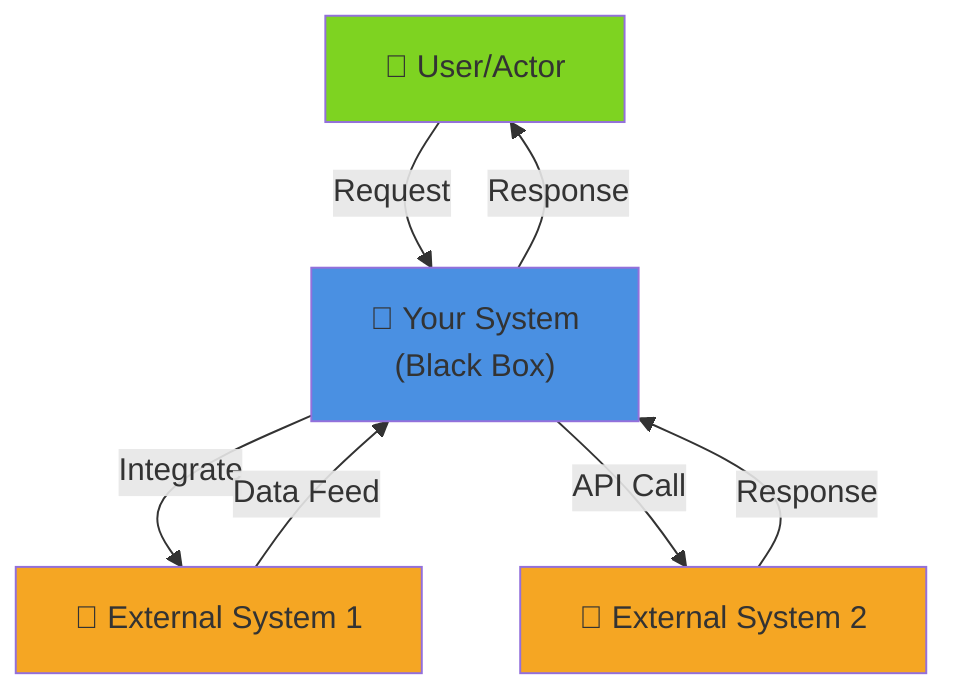
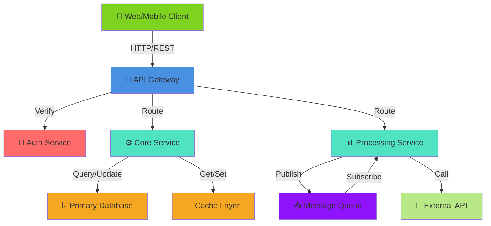

# 03 — High-Level Architecture

<!--
INSTRUCTIONS:
1. Create C4 diagrams at levels 1 (Enterprise), 2 (Container), and 3 (Component)
2. Document all technology choices with justification
3. Show system boundaries and key interactions
4. Document deployment targets and infrastructure patterns
5. Remove these instruction comments when complete
-->

## Enterprise Context (C4 Level 1)

### System Context Diagram

<!--
At the widest view, show:
- Your system as a black box
- External systems it connects to
- Key users/actors
- Data flows at a very high level

Mermaid diagram placeholder below. Replace with your actual context.
Format: C4 Context Diagram
External systems should include: legacy systems, partner integrations, external APIs, messaging infrastructure

Example context for Payment Orchestration:
- Users: Bank Staff, Corporate Customers, Payment Processors
- External Systems: SWIFT, Domestic ACH, Card Networks, Risk Management System
- Data flows: Payment requests in, routing decisions out, confirmation back to users
-->

### Key Interactions

| Actor | Interaction | Frequency | SLA |
|-------|-------------|-----------|-----|
| [User/System] | [What interaction?] | [How often?] | [Response time requirement] |
| [User/System] | [What interaction?] | [How often?] | [Response time requirement] |

---

## Container Architecture (C4 Level 2)

### Container Diagram

<!--
Show the major building blocks:
- Web applications
- Mobile apps
- Backend services
- Databases
- Message queues
- External integrations
- Authentication/authorization systems

Containers are separately deployable units (services, apps, databases).
Include data flows between containers.
-->

### Container Descriptions

| Container | Technology | Purpose | Criticality |
|-----------|-----------|---------|------------|
| [Container Name] | [Tech Stack] | [What does it do?] | High/Medium/Low |
| [Container Name] | [Tech Stack] | [What does it do?] | High/Medium/Low |
| [Container Name] | [Tech Stack] | [What does it do?] | High/Medium/Low |

### Container-to-Container Interactions

| From | To | Protocol | Frequency | Data Volume | Security |
|------|----|---------|-----------|-----------|----|
| [Source] | [Target] | HTTP/gRPC/Async | [Frequency] | [Volume/TPS] | [SSL/mTLS/Key Auth] |
| [Source] | [Target] | HTTP/gRPC/Async | [Frequency] | [Volume/TPS] | [SSL/mTLS/Key Auth] |

---

## Technology Stack

### Layered Technology Choices

| Layer | Technology | Version | Justification | Alternatives Considered |
|-------|-----------|---------|--------------|------------------------|
| **API Gateway** | [Technology] | [Version] | [Why this choice?] | [What else was considered?] |
| **Service Framework** | [Technology] | [Version] | [Why this choice?] | [What else was considered?] |
| **Authentication** | [Technology] | [Version] | [Why this choice?] | [What else was considered?] |
| **Database** | [Technology] | [Version] | [Why this choice?] | [What else was considered?] |
| **Cache** | [Technology] | [Version] | [Why this choice?] | [What else was considered?] |
| **Message Queue** | [Technology] | [Version] | [Why this choice?] | [What else was considered?] |
| **Observability** | [Technology] | [Version] | [Why this choice?] | [What else was considered?] |
| **Container Runtime** | [Technology] | [Version] | [Why this choice?] | [What else was considered?] |

### Technology Rationale

<!--
For each major technology choice, provide reasoning:
- Why it fits Techcombank's architecture
- Alignment with existing systems
- Vendor support / licensing
- Team expertise
- Performance characteristics
- Scalability approach
-->

**[Technology Name] Justification:**
- Aligns with [Architecture Principle]
- Supported by [team/platform]
- Selected over [alternatives] because [reason]
- Roadmap compatibility: [Yes/No] — [details]

---

## Architecture Principles Applied

<!--
Which Techcombank Architecture Principles are embodied in this design?
-->

- [Principle Name]: [How is it applied?]
- [Principle Name]: [How is it applied?]
- [Principle Name]: [How is it applied?]

---

## System Boundaries & Integration Points

### System Responsibilities

- **This System Owns:**
  - [Responsibility 1]
  - [Responsibility 2]
  - [Responsibility 3]

- **Integration with Other Systems:**
  - [System X]: [How?]
  - [System Y]: [How?]
  - [System Z]: [How?]

### Data Classification Alignment

| Data Type | Classification | Storage Layer | Encryption |
|-----------|----------------|---------------|-----------|
| [Type] | [Public/Internal/Confidential/Restricted] | [Where stored?] | [Algorithm] |
| [Type] | [Public/Internal/Confidential/Restricted] | [Where stored?] | [Algorithm] |

---

## Deployment Target

- **Cloud Platform:** [AWS/Azure/On-Premise/Hybrid]
- **Region(s):** [List geographic regions]
- **Kubernetes Cluster:** [Cluster name and location]
- **Network:** [Public/Private/VPC details]

---

## References

- [C4 Model Documentation](https://c4model.com/)
- [Techcombank Technology Radar](https://techcombank.com/architecture/tech-radar)
- [Security Design Document](08-security-design.md)
