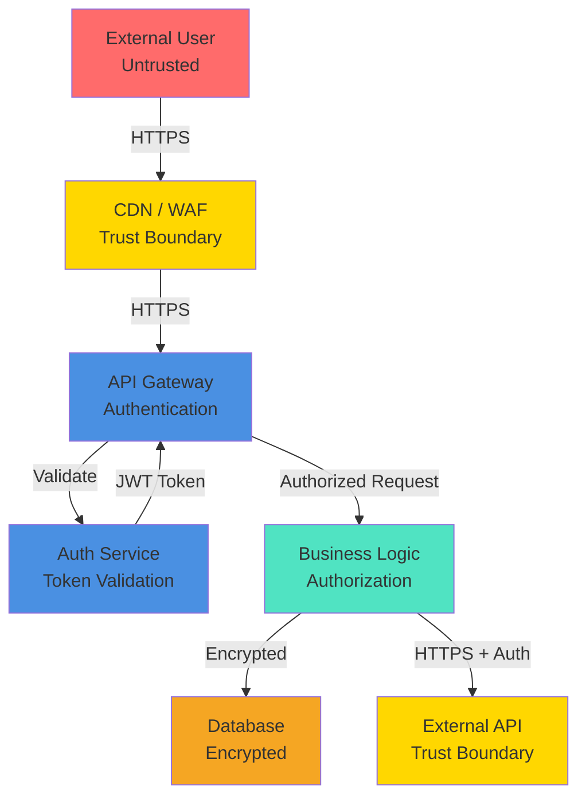

# 08 — Security Design

<!--
INSTRUCTIONS:
1. Document threat model and security architecture
2. Define authentication, authorization, and data protection
3. Specify encryption, compliance, and security testing
4. Remove these instruction comments when complete
-->

## Security Overview

**Security Owner:** [Name/Title]

**Classification Level:** [Confidential / Internal / Public based on Techcombank standards]

---

## Threat Model

### Threat Analysis Methodology

This section uses a systematic approach to identify potential threats:
- **STRIDE:** Spoofing, Tampering, Repudiation, Information Disclosure, Denial of Service, Elevation of Privilege
- **DREAD:** Damage, Reproducibility, Exploitability, Affected Users, Discoverability

### Data Flow Diagram (Security Focus)



### Critical Assets & Threats

| Asset | Threat | Severity | Mitigation |
|-------|--------|----------|-----------|
| Customer PII | Unauthorized access | Critical | Encryption + RBAC |
| Payment data | Tampering | Critical | Digital signatures + audit logs |
| API keys | Theft / Exposure | Critical | Secret manager + rotation |
| Authentication tokens | Spoofing / Theft | Critical | Short expiry + TLS |
| Database | Ransomware | High | Backups + network isolation |
| Application code | Malware injection | High | Code scanning + signed images |
| Configuration | Misconfiguration | High | IaC validation + secrets scanning |

---

## Authentication & Authorization

### Authentication Strategy

**Authentication Type:** OAuth 2.0 / OpenID Connect / SAML 2.0

**Supported Methods:**

| Method | Use Case | Implementation | MFA Required |
|--------|----------|----------------|--------------|
| User/Password | Staff login | OAuth 2.0 + MFA | Yes |
| API Key | Service-to-service | Long-lived keys with rotation | N/A |
| mTLS | Service mesh | Certificate-based | N/A |

### Authorization Strategy

**Authorization Model:** Role-Based Access Control (RBAC)

#### Role Definitions

| Role | Permissions | Scope | Typical Users |
|------|-----------|-------|---------------|
| **Admin** | All operations | All domains | Security team |
| **Domain Lead** | Create/Update designs | Domain | Domain architects |
| **Reviewer** | Review and approve | Assigned projects | Technical leads |
| **Developer** | Read designs, create features | Own domain | Development teams |
| **Auditor** | Read-only access | All domains | Compliance team |

---

## Encryption

### Encryption in Transit

**Protocol:** TLS 1.2 minimum, TLS 1.3 preferred

**Certificate Management:**

| Endpoint | Certificate Type | Provider | Auto-renewal |
|----------|-----------------|----------|--------------|
| api.techcombank.com | Wildcard | Let's Encrypt / ACM | Yes |
| internal services | Self-signed | Internal PKI | Quarterly |

### Encryption at Rest

**Default:** AES-256-GCM for all sensitive data

| Data Store | Encryption Type | Key Management | Key Rotation |
|-----------|-----------------|-----------------|--------------|
| Database | AES-256 (RDS) | AWS KMS | AWS managed (annual) |
| Backups | AES-256 | AWS KMS | AWS managed (annual) |
| S3 buckets | AES-256 | AWS KMS | AWS managed (annual) |

### Key Management

**Secrets Management:** HashiCorp Vault / AWS Secrets Manager

**Secret Types & Rotation:**

| Secret Type | Rotation Interval | Storage |
|-------------|-------------------|---------|
| Database passwords | 90 days | Vault |
| API keys | 90 days | Vault |
| TLS certificates | Annual | ACM |

---

## Data Classification & Handling

### Data Classification Levels

Per [Techcombank Data Classification Standard](https://techcombank.com/data-classification):

| Classification | Examples | Encryption | Access |
|----------------|----------|-----------|--------|
| **PUBLIC** | Published documents | Optional | Everyone |
| **INTERNAL** | Internal documents | Optional | Employees |
| **CONFIDENTIAL** | Customer PII, transactions | Required | Role-based |
| **RESTRICTED** | Keys, credentials, audit logs | Required | Admin only |

### Sensitive Data Handling

**PII (Personally Identifiable Information):**

```
Storage: Encrypted at rest
Transmission: HTTPS only
Logging: Never log in full; use last-4 digits or hash
Deletion: Per retention policy, secure wipe
```

**Secrets (API keys, passwords):**

```
Storage: HashiCorp Vault or AWS Secrets Manager only
Never commit to version control
Never log in application logs
Rotation: Every 90 days
```

---

## Security Testing & Validation

### Application Security Testing

| Test Type | Frequency | Tool | Pass Criteria |
|-----------|-----------|------|-----------------|
| SAST | Every commit | SonarQube / Checkmarx | No critical issues |
| DAST | Weekly | OWASP ZAP | No vulnerabilities |
| Dependency check | Every commit | Snyk / Dependabot | No unpatched critical CVEs |
| Container scan | Every build | Trivy | No critical vulnerabilities |

---

## Compliance & Regulatory

### Applicable Standards

| Standard | Applicability | Key Requirements |
|----------|---------------|------------------|
| **PCI-DSS v3.2.1** | Payment processing | Encryption, MFA, audit logs |
| **GDPR** | EU customer data | Data minimization, consent, deletion |
| **ISO 27001** | Information security | ISMS, risk management |

### Audit & Compliance Reporting

**Audit Activities:**

| Activity | Frequency | Retention |
|----------|-----------|-----------|
| Security audit log review | Weekly | 1 year |
| Access review | Quarterly | 3 years |
| Compliance audit | Annually | 3 years |

---

## Incident Response

### Security Incident Types

| Incident Type | Response Time | Escalation |
|---------------|----------------|------------|
| **Critical** | 15 minutes | CISO + CRO |
| **High** | 1 hour | Security team |
| **Medium** | 4 hours | Department lead |

---

## Security Awareness & Training

**Requirements:**

- Annual security training (mandatory)
- Phishing simulation (quarterly)
- Secure coding training (annual for developers)

---

## References

- [OWASP Top 10](https://owasp.org/Top10/)
- [Techcombank Data Classification Standard](https://techcombank.com/data-classification)
- [PCI-DSS Compliance Guide](https://www.pcisecuritystandards.org/)
- [ISO 27001 Standard](https://www.iso.org/isoiec-27001-information-security-management.html)
